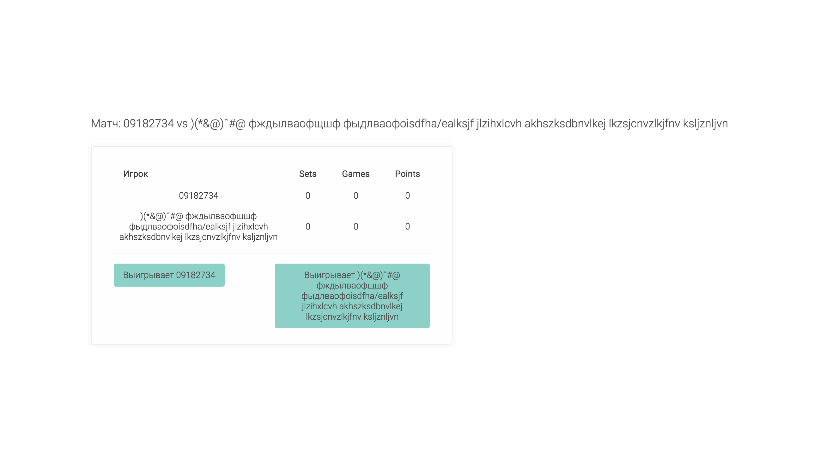
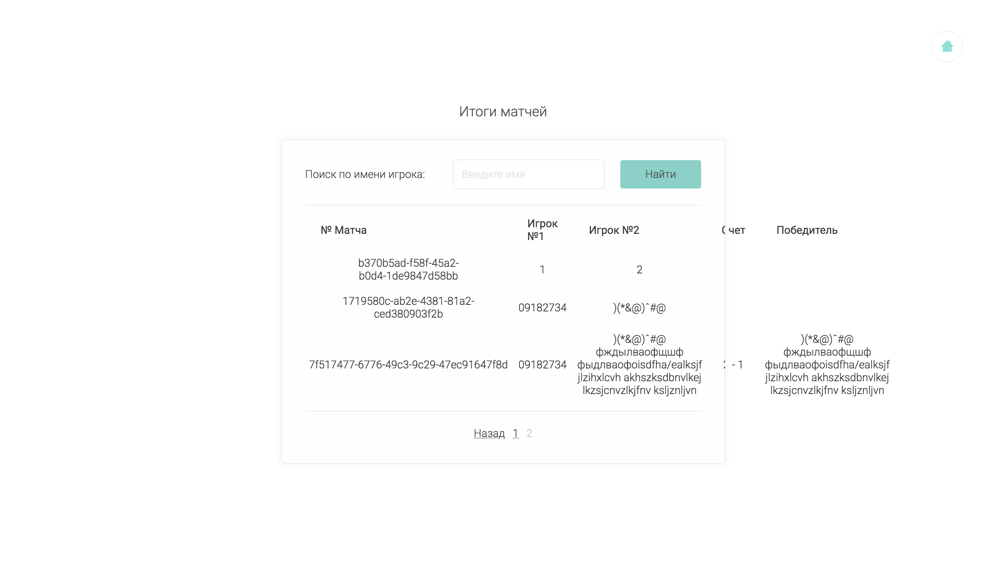
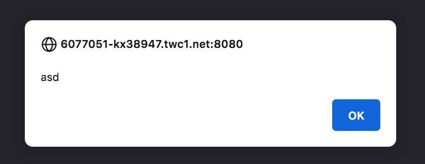
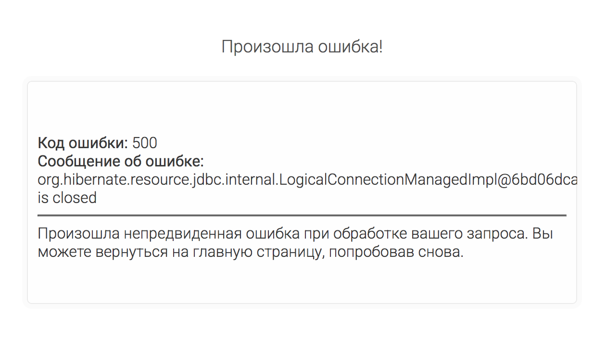
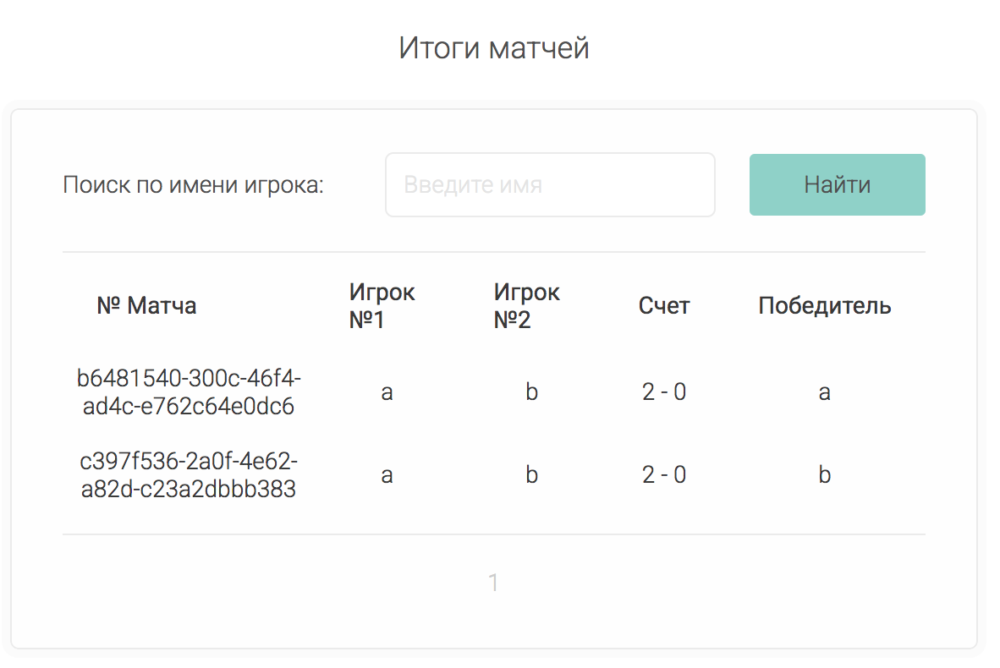
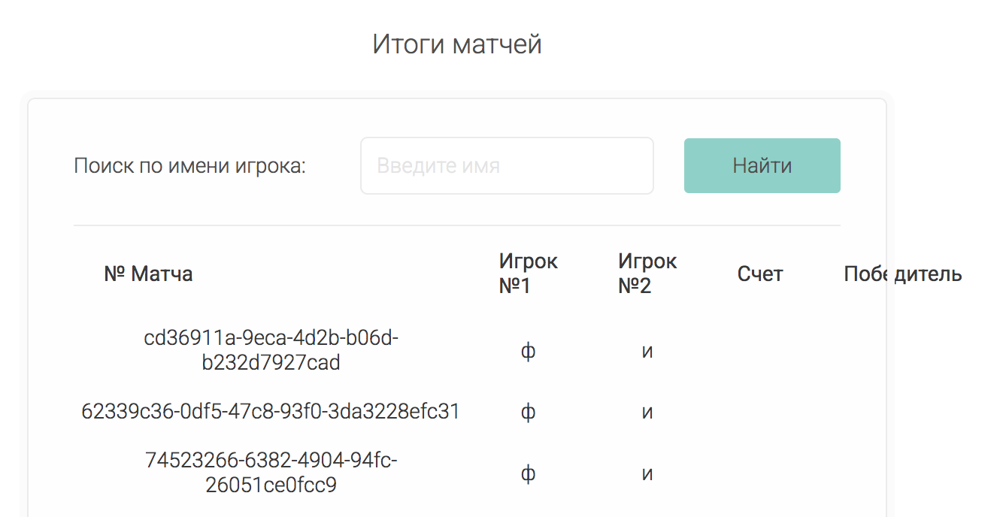
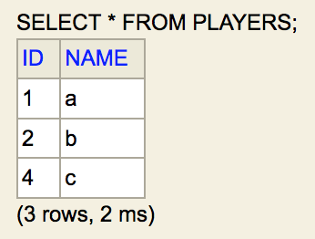
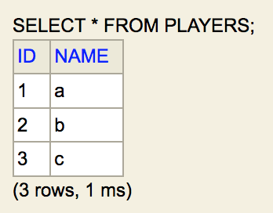

# Review на реализацию от [@Alex46volokno ](https://github.com/esipovAlex/tennis-scope-board) проекта [Табло теннисного матча](https://zhukovsd.github.io/java-backend-learning-course/projects/tennis-scoreboard/)

```text
1. Знаком ❗️ помечены критически важные замечания, а также места нарушения ТЗ.
2. Если ❗️ стоит перед заголовком, значит он относится ко всем пунктам этого раздела.
3. Замечания, указанные в пункте с именем пакета, относятся ко всем классам этого пакета или ко всем классам этого слоя.
4. Знаком 💡 помечены блоки, в которых содержится подсказка по реализации какого-то приёма или части кода. 
   Такие пункты всегда находятся в сворачиваемом блоке и разворачиваются по нажатию. 
   Перед их раскрытием стоит постараться придумать или поискать решение самостоятельно. 
```

## Функциональный обзор <a id="functional-overview"></a>

[перейти в раздел MatchesServlet](#matchesservlet)

- нет валидации имён игроков — стоит сделать ограничения на длину, отсутствие цифр, допустимые символы
- если имя одного игрока будет значительно длиннее имени другого, то табло со счётом сместится от центра страницы, а также кнопка игрока с длинным именем будет значительно больше кнопки игрока с коротким именем 
- ❗️когда счёт становится `40:40`, то на табло очки обнуляются и вместо `40:40` показывается `0:0`. Дальше показываются не `40:AD -> 40:40 -> AD:40`, а `1:0 -> 0:0 -> 0:1`. Сам подсчёт происходит правильно, но такое визуальное отображение сбивает с толку
- в таблице итоговых матчей, если у одного из игроков слишком длинное им, то текст выходит за пределы таблицы 
- при попытке поиска игрока по части имени появляется страница с ошибкой и возможностью вернуться только на главную страницу.  Вместо этого лучше показывать пустой список
- нет кнопки сброса фильтра по имени на странице завершённых матчей, если оставить поле ввода пустым и нажать `найти` (попытаться сбросить фильтр), то возникнет ошибка  Вместо этого лучше показывать полный (не фильтрованный) список матчей 
- номер матча в виде UUID не имеет ценности для пользователя и создаёт впечатление "торчащих наружу проводов" — лучше или убрать эту колонку или перейти на числа
- при переходе с домашней страницы на страницу с итогами матчей выскакивает окно "Подтвердите действие на странице" 
- при вводе имени игрока длиннее 255 символов (столько по умолчанию помещается в строковое поле в БД H2) происходит ошибка и показывается соответствующая страница  Вместо этого лучше просто сказать пользователю (показать текст над полем имени), что имя слишком длинное
- при вводе игрока с максимальной длинной имени (255 символов) на странице матча (если не менять масштаб до ~35%) будет только одна кнопка начисления очков — для него. А после того, как он выиграет этот матч, в таблице матчей не хватит масштаба браузера, чтобы уместить дважды его имя (в графе игрока и в графе победителя). Это решится добавлением валидации для имён (в том числе на длину).
- если два игрока сыграют два матча и поочереди в них победят, то в списке матчей счёт будет показываться как `2 - 0` и `2 - 0`, вместо `2 - 0` и `0 - 2` 
- если id матча помещается в одну строку в колонке `№ Матча`, то разметка таблицы матчей тоже ломается 

## Model
- хотя можно назвать DTO, доменные модели и Entity тремя видами моделей в контексте Java веб-приложения, это разные типы моделей, которые решают различные задачи в архитектуре приложения. Поэтому стоит упорядочить их по подходящим пакетам и можно вынести эти пакеты в корень как самостоятельные. Так каждый слой, решающий свои специфические задачи, будет изолирован от других.

#### <center>"Типы моделей" в веб-приложении</center>
| Тип | Назначение | Контекст |
|---|---|--- |
| Entity (Сущность) | Объекты, соответствующие таблицам базы данных, представляют данные в том виде, в котором они хранятся в базе данных| Уровень персистентности (JPA/Hibernate) | 
| Domain Model (Доменная модель) | Программные абстракции, представляют бизнес-логику, правила и поведение предметной области| Бизнес-уровень приложения |
| DTO (Data Transfer Object) | Объекты, используемые для передачи данных между различными слоями приложения| Уровень представления, API |

### Match
- ❗️тип UUID для поля `id` не соответствует ТЗ. По ТЗ тип колонки Int. Это является причиной того, что на странице завершённых матчей отображаются непонятные для пользователя комбинации вместо номеров матчей
- ❗️для обязательных полей стоит добавить `optional = false` в `@ManyToOne` или `nullable = false` в `@JoinColumn`. Целостность данных должна обеспечиваться на всех уровнях: в приложении (валидация) и в БД (constraints). Отсутствие ограничений в БД означает, что данные могут быть испорчены из-за ошибок в приложении или при прямом доступе к БД.

  Сейчас таблица матчей создаётся так:
```sqlite-sql
create table matches (
    id uuid not null,
    firstPlayerSets integer,
    score varchar(255),
    secondPlayerSets integer,
    player1 integer,
    player2 integer,
    winner integer,
    primary key (id)
)
```

При `optional = false` или `nullable = false` — Hibernate генерирует `NOT NULL` ограничение в БД и делает проверку перед вставкой в БД (если значение поля null, то Hibernate не будет обращаться в БД для вставки и сам выбросит исключение PropertyValueException)

- в текущей реализации сеттеры этому классу нужны только потому, что сейчас незавершённые матчи тоже сохраняются в БД. Даже для этой цели лучше сделать необходимый конструктор и удалить сеттеры.

  Также сеттеры используются в тестах, но это не является весомой причиной для их существования, к тому же их там легко заменить:

Сейчас так:
```java
private Match createMatch(Player firstPlayer, Player secondPlayer, Player winner) {
    Match match = new Match();
    match.setId(UUID.randomUUID());
    match.setFirstPlayer(firstPlayer);
    match.setSecondPlayer(secondPlayer);
    match.setWinner(winner);

    ScoreShort score = new ScoreShort(2, 1, "6-3, 4-6, 6-2");
    match.setScore(score);

    return match;
}
```
Можно так:
```java
private Match createMatch(Player firstPlayer, Player secondPlayer, Player winner) {
    ScoreShort score = new ScoreShort(2, 1, "6-3, 4-6, 6-2");
    return new Match(
            UUID.randomUUID(),
            firstPlayer,
            secondPlayer,
            score,
            winner
    );
}
```
- Hibernate достаточно конструктора без параметров с уровнем доступа protected — можно установить это значение в аннотации: `@NoArgsConstructor(access = AccessLevel.PROTECTED)`
- аннотацию `@ToString` лучше удалить 

[**Использование @ToString (Lombok) и @Entity (JPA) в одном классе**](#tostring-entity)

- в текущей реализации поле `ScoreShort score` можно не инициализировать при объявлении — оно всегда задаётся через конструктор
- можно добавить ограничения, проверяющие, что игроки разные и победителем является один из участников матча

<details>

---

<summary><b>💡 Например так 💡</b></summary>

```java
@Table(name = "matches",
        check = {
                @CheckConstraint(constraint = "player1 != player2"),
                @CheckConstraint(constraint = "winner = player1 OR winner = player2")
        })
public class Match { 
    // ...
}
```

---

</details>

### Player
- `@EqualsAndHashCode` (которая входит в `@Data`) обычно [**не используют в jpa сущностях**](#data-entity). Конкретно здесь проблем быть не должно, но использование этих аннотаций вместе не является хорошей практикой.
- Hibernate достаточно конструктора без параметров с уровнем доступа protected — можно установить это значение в аннотации: `@NoArgsConstructor(access = AccessLevel.PROTECTED)`, а также сделать публичный конструктор с полем `name` для маппера.
- ❗️`@AllArgsConstructor` позволяет создать объект Player c установленным id. Для полей, которые генерируются в БД, лучше не давать такую возможность. Также для id не нужен сеттер.
- чтобы избавиться от `@AllArgsConstructor` надо в методе `winProcess()` в MatchService вместо поиска только id игрока сразу получать всю сущность:
Сейчас так:
```java
public WinnerResponse winProcess(MatchResponse match) {
    WinnerResponse winner = checkWin(match);
    // ...
    int winnerId = playerService.findIdByName(winner.getWinnerName());
    // ...
    matchRepository.updateMatchScoreAndWinner(id, new Player(winnerId, winner.getWinnerName()), scoreShort);
    // ...
}
```
лучше так:
```java
public WinnerResponse winProcess(MatchResponse match) {
    WinnerResponse winner = checkWin(match);
    // ...
    Player pointWinner = playerService.findByName(winner.getWinnerName());
    // ...
    matchRepository.updateMatchScoreAndWinner(id, pointWinner, scoreShort);
    // ...
}
```
- хорошим подходом будет оставить минимум необходимых аннотаций, достаточных для JPA Entity:
```java
@Getter
@NoArgsConstructor(access = AccessLevel.PROTECTED)
@Entity
@Table(name = "Entities")
public class JpaEntity { 
    // ...
}
```

&#43; конструктор со всеми полями, кроме генерируемых автоматически (id), и equals/hashCode, реализованные на основе явно выбранных полей.

### ScoreShort
- отдельные аннотации `@Getter` и `@Setter` можно удалить — они уже включены в `@Data`
- сейчас формат отображения счёта (через дефис) определяется в методе `checkWin()` в MatchService. Можно позволить выбирать формат слою представления (JSP) и просто передавать в него необходимые данные.

### model.dto
- неоднородность в названиях классов: например, в `PlayerDtoRequest` есть инфикс `Dto`, а в `PageParam` — нет. Лучше называть классы в одном стиле — это увеличивает понятность кода, а также может служить подсказкой при разработке (напоминая об единственной ответственности класса).

### PageParam
- для полей, которые по логике никогда не должны быть null, лучше в record классах использовать примитивные типы. Иначе это может привести к неожиданным NullPointerException.

Сейчас так:
```java
public record PageParam(Integer pageNumber, Integer size) {
}
```
Лучше так (номеру страницы и размеру никогда не нужно значение null):
```java
public record PageParam(int pageNumber, int size) {
}
```

### PlayerDtoRequest
- можно переименовать в `PlayerRequestDto`, чтобы о слое, к которому относится этот класс, сообщал последний суффикс — это будет лучше читаться
- при отсутствии валидации создавать DTO из одной строки — избыточно

### Score
- класс является доменной моделью (используется для хранения состояния счета во время матча), поэтому лучше перенести его напрямую в пакет model
- поля `int firstPlayerPoints` и `int secondPlayerPoints` объявлены как int, хотя в них может быть только определённый набор значений. Поскольку класс предоставляет публичные сеттеры для этих полей сейчас в них можно установить любое невалидное значение без контроля. Сейчас так устанавливается значение `100`, которое кодирует определённое состояние, но не является валидным счётом. Вместо int здесь больше подошло бы перечисление (enum). Использование чисел вместо перечислений делает код менее читаемым и более подверженным ошибкам.

<details>

---

<summary><b>💡 Например такой 💡</b></summary>

```java
enum Point {
    LOVE,
    FIFTEEN,
    THIRTY,
    FORTY,
    ADVANTAGE;
}
```

---

</details>

- поле `UUID id` содержит id матча, поэтому в его название стоит добавить этот контекст — `matchId`
- класс имеет признаки "анемичной модели" — он является лишь контейнером для данных, а вся логика находится в сервисном слое. Если бы у класса вместо простых сеттеров были методы, совершающие необходимую работу над полями, это больше соответствовало бы ООП стилю и обязанности класса (в роли доменной модели). Также, эту часть логики было бы легче тестировать.

<details>

---

<summary><b>💡 Вот упрощённый пример такого класса 💡</b></summary>

```java
public class MatchScore {
    private static final Point INITIAL_POINTS = Point.LOVE;
    private static final int VICTORY_TIEBREAK_POINTS = 7;
    private static final int VICTORY_SET_POINTS = 6;
    private static final int MIN_ADVANTAGE_TO_WIN = 2;
    private Point points;
    private int games = 0;
    private int sets = 0;
    private int tieBreakPoints = 0;

    public MatchScore() {
        this.points = INITIAL_POINTS;
    }

    public void increment() {
        // логика добавления очков
    }

    public boolean hasAdvantage() {
        return points == Point.ADVANTAGE;
    }

    public String getPointsValue() {
        return points.value();
    }

    private void incrementGamePoints() {
        games++;
    }

    private void incrementSetPoints() {
        sets++;
    }

    private void incrementTieBreakPoints() {
        tieBreakPoints++;
    }

    private void resetPoints() {
        points = INITIAL_POINTS;
    }

    enum Point {
        LOVE("0"),
        FIFTEEN("15"),
        THIRTY("30"),
        FORTY("40"),
        ADVANTAGE("AD");

        private final String value;

        Point(String value) {
            this.value = value;
        }

        public Point next() {
            if (this == ADVANTAGE) {
                throw new IllegalStateException("Has no points after advantage.");
            }
            return values()[ordinal() + 1];
        }

        public String value() {
            return value;
        }
    }
}
```

При таком подходе от сеттеров стоит избавиться, чтобы состояние счёта управлялось только явно предусмотренными для этого методами.

---

</details>

- в классе объявлено 4 конструктора — при объявлении такого количества, стоит тщательно оценить, что это необходимо. Иначе, это может создать путаницу при использовании — например, сейчас при создании объекта через конструктор без параметров поле `UUID id` будет null — стоит убедиться, что это ожидаемо. Если такое количество конструкторов действительно необходимо классу, то стоит рассмотреть использование билдера (Builder).
- неоднородность в инициализации полей: поле `boolean tieBreak` инициализируется `false` по умолчанию, а поле `boolean needGame = false` — явно. Лучше использовать один подход (например явный, при большом количестве конструкторов). 
- сейчас поле `boolean deuce` при объявлении инициализируется значением `true`. Вместо этого по логике оно должно кодировать состояние "ровно" в гейме. Deuce (ровно) в теннисе — это не любой равный счёт, а конкретная ситуация, когда счёт в гейме становится `40:40`.
- ❗️сейчас название поля `boolean deuce` противоречит тому, что одно обозначает в проекте. Оно служит флагом для режима игры от `0` до `40` очков, поэтому ему больше подойдёт название `regular`.
- поле `boolean needGame` — это флаг, который указывает, что нужно провести проверку завершения гейма (и возможно, обновить счёт сетов), поэтому стоит дать ему больше подходящее название, например `gameFinished`
- поля `boolean deuce`, `boolean tieBreak` и `boolean needGame` отражают разные состояния матча. Для этой цели (если останется такая необходимость) лучше подойдёт перечисление, например такое:
```java
public enum GameState {
    REGULAR,
    DEUCE,
    TIEBREAK,
    FINISHED;
}
```
Использование boolean вместо перечислений делает код менее выразительным и более подверженным ошибкам. Например, из-за того, что нет препятствий, чтобы извне установить несколько взаимоисключающих друг друга флагов в `true`. Enum гарантирует, что будет выбрано только одно состояние.
- ❗️класс отвечает за хранение очков на всех этапах игрового процесса в матче, а также состояния игры — это слишком большая ответственность для одного класса и нарушает SRP (Single Responsibility Principle). Лучшим решением в этом направлении было бы, чтобы за счёт на каждом уровне отвечал отдельный класс. Такой подход больше соответствовал бы ООП-стилю и принципу единственной ответственности для каждого класса.

## model.response
### MatchPlayerResponse
- неоднородность в названиях полей: здесь `String firstPlayer` и `String secondPlayer`, а в WinnerResponse — `String firstPlayerName` и `String secondPlayerName`. Лучше использовать один стиль и добавить суффикс `Name` в имена полей этого класса.
- из названия можно убрать инфикс `Player` без потери смысла
- этот класс можно упразднить — сейчас он служит только для того, чтобы достать из БД данные о конкретном матче — эту роль может выполнять класс Match, который является JPA Entity и отвечает за отображение данных из БД.

### MatchResponse
- аннотации `@Setter` и `@NoArgsConstructor` можно удалить — в текущей реализации они не используются
- класс используется как DTO, поэтому стоит перенести его в соответствующий пакет и можно добавить суффикс `Dto` в название
- класс можно сделать record — значение его полей после создания никогда не меняются.
- от чистой ответственности DTO класс отделяет то, что он частично участвует в бизнес-логике

### WinnerResponse

[перейти в раздел MatchScoreServlet](#matchscoreservlet)

- класс используется как DTO, поэтому стоит перенести его в соответствующий пакет и можно добавить суффикс `Dto` в название
- если провести небольшой рефакторинг метода `checkWin()` в MatchService

Сейчас так:
```java
private WinnerResponse checkWin(MatchResponse match) {
    WinnerResponse winner = null;
    ScoreResponse score = match.getScore();
    int firstPlayerSets = score.getFirstPlayerSets();
    int secondPlayerSets = score.getSecondPlayerSets();
    if (Math.max(firstPlayerSets, secondPlayerSets) > 1) {
        winner = new WinnerResponse();
        winner.setFirstPlayerName(match.getFirstPlayer());
        winner.setSecondPlayerName(match.getSecondPlayer());
        if (firstPlayerSets > secondPlayerSets) { // первый выиграл
            winner.setWinnerName(match.getFirstPlayer());
            winner.setScore(firstPlayerSets + " - " + secondPlayerSets);
        } else { //второй выиграл
            winner.setWinnerName(match.getSecondPlayer());
            winner.setScore(secondPlayerSets + " - " + firstPlayerSets);
        }
    }
    return winner;
}
```
 
сделать так:
```java
private WinnerResponse checkWin(MatchResponse match) {
    WinnerResponse winner = null;
    ScoreResponse score = match.getScore();
    int firstPlayerSets = score.getFirstPlayerSets();
    int secondPlayerSets = score.getSecondPlayerSets();
    if (Math.max(firstPlayerSets, secondPlayerSets) > 1) {
        String winnerName;
        String scoreValue;
        if (firstPlayerSets > secondPlayerSets) {
            winnerName = match.getFirstPlayer();
            scoreValue = firstPlayerSets + " - " + secondPlayerSets;
        } else {
            winnerName = match.getSecondPlayer();
            scoreValue = secondPlayerSets + " - " + firstPlayerSets;
        }
        winner = new WinnerResponse(match.getFirstPlayer(), match.getSecondPlayer(), scoreValue, winnerName);
    }
    return winner;
}
```
то необходимость в сеттерах и конструкторе без параметров в этом классе исчезнет и аннотации `@Setter` и `@NoArgsConstructor` можно будет удалить
- также класс можно будет сделать record — значение его полей после создания нигде не меняются (кроме указанного выше метода)
- поскольку в проекте есть класс Score, то чистое имя `score` лучше оставить экземплярам этого класса, а здесь изменить `String score` на `String scoreValue`
- этот класс "борется" за ответственность с MatchResponse — оба передают данные о текущем матче в слой представления (JSP). Для этого можно оставить только один класс, который в случае если матч завершён будет содержать имя победителя, а до этого будет передавать null в соответствующем поле

<details>

---

<summary><b>💡 Например, такой 💡</b></summary>

```java
public record OngoingMatchDto(
        UUID id,
        String firstPlayerName,
        String secondPlayerName,
        ScoreDto score,
        boolean finished,
        String winnerName
) {
}
```

---

</details>

### ScoreResponse
- аннотации `@Setter` и `@NoArgsConstructor` можно удалить — в текущей реализации они используются только в маппере, а он сможет работать и через AllArgsConstructor
- класс используется как DTO, поэтому стоит перенести его в соответствующий пакет и можно добавить суффикс `Dto` в название
- класс можно сделать record — значение его полей после создания никогда не меняются.
- чтобы класс мог отображать любые формы очков (и численные и строковые — `AD`, `DEUCE`), можно сделать поля `int firstPlayerPoints` и `int secondPlayerPoints` строковыми (String)

### PlayerDtoResponse
- этот класс не используется в проекте — его можно удалить

### Page
- возможности, которые даёт параметризация не используются в этом проекте и скорее всего не понадобятся в дальнейшем, поэтому можно удалить дженерик и использовать класс в качестве DTO для передачи страницы матчей. Можно переименовать в `MatchesPageDto`.
- аннотации `@Setter` и `@NoArgsConstructor` можно удалить — в текущей реализации они не используются
- класс используется как транспорт данных, только не до JSP (что соответствовало бы ответственности DTO), а до сервлета. Затем данные извлекаются и передаются по отдельности. Стоит сделать класс полноценным DTO, перенести его в соответствующий пакет и можно добавить суффикс `Dto` в название
- класс можно сделать record — значение его полей после создания никогда не меняются.

## Hibernate
### CrudRepository
- стоит перенести класс в пакет `repository` к остальным репозиториям
- методу `tx()` стоит дать более понятное название, например `executeInTransaction()`
- ❗️в методе `tx()` есть обращение к объекту сессии, которая к этому времени уже закрыта — это вызовет исключение:
```java
private <T> T tx(Function<Session, T> command) {
    Session session = HibernateConfig.getSessionFactory().openSession();
    try (session) {
        // ...
    } catch (Exception e) {
        // ...
        Transaction tx = session.getTransaction(); // здесь сессия уже закрыта
        // ...
    }
}
```

[**Закрытие ресурсов в разных try происходит так**](#close-resources-in-try)

- ❗️сейчас в методе `tx()` откат транзакции происходит только если возникло PlayerAlreadyExistsException или NoSuchElementException. Вместо этого, при любом исключении, которое приводит к прерыванию работы метода, необходимо откатить транзакцию, если она активна. Иначе могут остаться незавершенные транзакции, что приведёт к утечкам ресурсов и неконсистентности данных.
- в методе `tx()` поведение в двух if одинаковое, поэтому их условия можно объединить:
Сейчас так:
```java
if (e instanceof PlayerAlreadyExistsException) {
    throw e;
}
if (e instanceof NoSuchElementException) {
    throw e;
}
```
Лучше так:
```java
if (e instanceof PlayerAlreadyExistsException || e instanceof NoSuchElementException) {
    throw e;
}
```
- в методе `tx()` исключение, которое не относится к PlayerAlreadyExistsException и NoSuchElementException тоже лучше обернуть в какое-то специально определённое общее для технических ошибок исключение, например, DataAccessException.
- в методе `tx()` переменным `tx` и `rsl` стоит дать более понятные имена: например, `transaction` и `result`
- `e.printStackTrace()` выводит данные в стандартный поток ошибок (System.err), который в многопоточных приложениях может быть перемешан, что затруднит чтение. Также такой вывод не структурирован и его сложно парсить и анализировать. Лучше использовать логгер (уже есть в зависимостях проекта), который позволяет настроить уровень логирования и формат вывода.

<details>

---

<summary><b>💡 После предложенного рефакторинга метод `tx()` может выглядеть так 💡</b></summary>

```java
private <T> T executeInTransaction(Function<Session, T> command) {
    Transaction transaction = null;
    try (Session session = HibernateConfig.getSessionFactory().openSession()) {
        transaction = session.beginTransaction();
        T result = command.apply(session);
        transaction.commit();
        return result;
    } catch (Exception e) {
        if (transaction != null && transaction.isActive()) {
            transaction.rollback();
        }
        if (e instanceof PlayerAlreadyExistsException || e instanceof NoSuchElementException) {
            throw e;
        }
        throw new DataAccessException("Database operation failed", e);
    }
}
```

---

</details>

- нет поддержки единой сессии на транзакцию — каждый вызов метода `tx()` открывает новую сессию. Лучше использовать паттерн "ThreadLocal Session" или "Session per Request" — чтобы в течение одного запроса (например, HTTP-запроса) использовалась одна и та же сессия Hibernate.
- неоднородное объявление переменных: в методе `optional()` результат `var sq = session.createQuery(query, cl)` кладётся в var, а в методе `<T> List<T> query(String query, Class<T> cl, Map<String, Object> args)` результат `Query<T> sq = session .createQuery(query, cl)` в `Query<T>`. Лучше придерживаться одного подхода и в обоих случаях использовать `Query<T>`.
- в методе `<T> List<T> query(String query, Class<T> cl)` загружаются все данные сразу, что может привести к OutOfMemoryError:
```java
Function<Session, List<T>> command = session -> session
        .createQuery(query, cl)
        .list();
```
Лучше всегда использовать запрос с пагинацией

- сейчас параметры для пагинации передаются вместе с другими параметрами в Map, что позволяет клиентскому коду их не указывать и может привести к OutOfMemoryError. Лучше явно ожидать эти параметры в методах, которые делают выборку с пагинацией.

- сейчас в методе `tx()` используется `openSession()`:

  `Session session = HibernateConfig.getSessionFactory().openSession();` — при таком подходе при каждом вызове метода создаётся новый объект Session.

  Вместо этого можно использовать `getCurrentSession()` — этот метод возвращает сессию текущего контекста. Так в одном потоке (HTTP-запросе) будет использоваться одна и та же сессия. В этом случае закрытие сессии тоже будет происходить автоматически (даже без try-with-resources).
  
  Для получения сессии через `getCurrentSession()` надо добавить в `hibernate.properties` свойство `hibernate.current_session_context_class`.

<details>

---

<summary><b>💡 Например, так (для режима одна-сессия-на-поток) 💡</b></summary>

```properties
hibernate.current_session_context_class=thread
```

---

</details>

- методу `void run(Consumer<Session> command)` можно дать более понятное название, например `void executeInTransaction(Consumer<Session> command)`, поскольку он выполняет то же, что и метод `tx()`, только без возврата значения
- в методе `<T> Optional<T> optional(String query, Class<T> cl, Map<String, Object> args)` лучше использовать `return sq.uniqueResultOptional();` вместо `return sq.stream().findFirst();`
- в методах `<T> Optional<T> optional(String query, Class<T> cl, Map<String, Object> args)` и `<T> List<T> query(String query, Class<T> cl, Map<String, Object> args)` есть повторяющиеся части кода — можно подумать, как избавиться от этого

<details>

---

<summary><b>💡 Например так 💡</b></summary>

Сейчас так
```java
public <T> Optional<T> optional(String query, Class<T> cl, Map<String, Object> args) {
    Function<Session, Optional<T>> command = session -> {
        var sq = session
                .createQuery(query, cl);
        for (Map.Entry<String, Object> arg : args.entrySet()) {
            sq.setParameter(arg.getKey(), arg.getValue());
        }
        return sq.stream().findFirst();
    };
    return tx(command);
}

public <T> List<T> query(String query, Class<T> cl, Map<String, Object> args) {
    Function<Session, List<T>> command = session -> {
        Query<T> sq = session
                .createQuery(query, cl);
        for (Map.Entry<String, Object> arg : args.entrySet()) {
            String parameter = arg.getKey();
            switch (parameter) {
                case "firstResult" -> sq.setFirstResult((Integer) arg.getValue());
                case "maxResult" -> sq.setMaxResults((Integer) arg.getValue());
                default -> sq.setParameter(arg.getKey(), arg.getValue());
            }
        }
        return sq.list();
    };
    return tx(command);
}
```

Можно так:
```java
public <T> Optional<T> querySingleResult(String jpql, Class<T> resultType, Map<String, Object> args) {
    Function<Session, Optional<T>> command =
            session -> createQuery(jpql, resultType, args, session)
                    .uniqueResultOptional();
    return executeInTransaction(command);
}

public <T> List<T> queryResultList(String jpql, Class<T> resultType, Map<String, Object> args) {
    Function<Session, List<T>> command = session ->
            createQuery(jpql, resultType, args, session)
                    .list();
    return executeInTransaction(command);
}

private <T> Query<T> createQuery(String jpql, Class<T> resultType, Map<String, Object> args, Session session) {
    Query<T> query = session.createQuery(jpql, resultType);
    return withParameters(query, args);
}

private <T> Query<T> withParameters(Query<T> query, Map<String, Object> args) {
    args.forEach((key, value) -> {
        switch (key) {
            case "firstResult" -> query.setFirstResult((Integer) value);
            case "maxResult" -> query.setMaxResults((Integer) value);
            default -> query.setParameter(key, value);
        }
    });
    return query;
}
```

Похожим образом можно сделать более читаемым метод `void run(String query, Map<String, Object> args)`

---

</details>

## Repository
- JPQL запросы можно вынести в константы и дать им понятные имена, это сделает код методов ещё более читаемым
- текст запроса удобнее читать, когда он логично разбит на строки:

```sqlite-sql
SELECT p 
FROM Player p 
WHERE p.name = :name
```
- неоднородность в стиле написания ключевых слов в некоторых JPQL запросах: кроме верхнего (UPPERCASE) есть нижний регистр (lowercase) и PascalCase (или UpperCamelCase) — лучше изменить регистр везде на верхний (uppercase). Это не влияет на корректность работы, так как JPQL не чувствителен к регистру, но будет соответствовать общепринятой практике написания ключевых слов.

> В Idea для изменения регистра всего слова (на котором находится курсор) или только выделенной части есть сочетание клавиш: `cmd + shift + u` (на mac os).

- параметр `maxResult` обычно называют с `s` на конце (`maxResults`) по аналогии с методом, в который он передаётся — `Query.setMaxResults()`
- неоднородность в использовании ключевых слов в запросах HQL. Несмотря на то, что в HQL порядок ключевых слов в запросе не строгий (в отличие от стандартного SQL, где SELECT должен идти перед FROM), лучше использовать стандартный порядок ключевых слов (как в SQL). Такой подход будет более читаемым, будет соответствовать стандартному синтаксису SQL и общепринятым практикам написания запросов.
- в проекте есть Lombok, поэтому конструктор в PlayerRepository и MatchRepository можно заменить аннотацией `@RequiredArgsConstructor`
- вызывать `session.flush();` сразу после `session.persist(entity);` не обязательно — синхронизация данных произойдёт автоматически при вызове Transaction.commit(), поэтому нет необходимости вызывать этот метод напрямую.
- из метода поиска одной сущности в PlayerRepository возвращается сущность, а в MatchRepository — Optional<Entity>. Лучше использовать один подход и возвращать везде через Optional.

### PlayerRepository
- если проект не планируется расширять, то все неиспользуемые методы можно удалить
- метод `add()` можно переименовать в `save()` — в контексте репозитория лучше использовать именно этот глагол
- сообщения в исключениях предназначены для разработчиков и лучше писать их на английском языке. Это де-факто является стандартом, а также гарантирует, что в любой системе в логах будут отображаться корректные символы. 
- в методе `Player add(Player player)` ловятся только ConstraintViolationException, а остальные пробрасываются выше. Раз в этом методе есть обработка исключений, то стоит обрабатывать все возможные (например, так же оборачивая в какое-то специально созданное)
- в сообщении исключения в методе `add()` ошибка — всегда говорится об игроке 2: `throw new PlayerAlreadyExistsException("Игрок 2 с именем '" + player.getName() + "' уже существует");`
- ❗️в методе `Player findById(int id)` используется NoSuchFieldException — это исключение рефлексии (при работе с полями классов). Для "не найденной сущности" есть более подходящее jakarta.persistence.EntityNotFoundException, а ещё лучше использовать специально определённое в проекте.
- `id` и `name` не являются зарезервированными словами в H2, поэтому лучше дать более чистые имена для:

  именованного параметра `:fId` в методе `Player findById(int id)` и `void delete(int id)` -> `:id`

  именованного параметра `:fName` в методе `Player findByName(String name)` -> `:name`

- если метод `void delete(int id)` останется в проекте, стоит продумать, что будет с матчами при удалении игрока, который в них участвовал
- в методе `Long getTotal()` лучше вместо списка получать один результат:
Сейчас так:
```java
public Long getTotal() {
    List<Long> query = crudRepository.query(
            "FROM Player p SELECT COUNT(p)", Long.class);
    return query.get(0);
}
```
Лучше так (заодно поправим запрос и переименуем переменную подходящим образом):
```java
public Long getTotal() {
    Optional<Long> count = crudRepository.querySingleResult(
            "SELECT COUNT(p) FROM Player p",
            Long.class,
            Collections.emptyMap()
    );
    return count.orElse(0L);
}
```

### MatchRepository
- опечатка в имени параметра в методе `Match save(Match math)`: `Match math` -> `Match match`
- опечатка в имени метода `Optional<MatchPlayerResponse> findPlayersNamesByMatshId(UUID id)`: `findPlayersNamesByMatshId()` -> `findPlayersNamesByMatchId`
- ❗️в методе `findPlayersNamesByMatshId()` запрос
```java
String jpql = """
        SELECT NEW ru.esipov.model.response.MatchPlayerResponse(m.id, m.firstPlayer.name, m.secondPlayer.name)
        FROM Match m WHERE m.id = :fId
        """;
```
не будет работать, потому что класс сейчас лежит здесь: `ru.tennis.model.response.MatchPlayerResponse.java`, а не в `ru.esipov.model.response`
- лучше дать более чистые/информативные имена для именованных параметров:

  `:fId` —> `:id`, 

  `:p1s` —> `:firstPlayerScore`,

  `:p2s` —> `:secondPlayerScore`,

  `:p3s` —> `:displayScore`,

  `:fPlayer` —> `:player`


- в методах `Long getCountByPlayer(Player player)` и `Long getTotalCount()` лучше вместо списка получать один результат:
  Сейчас так:
```java
public Long getTotalCount() {
    List<Long> query = crudRepository.query(
            COUNT_JPQL, Long.class); // .а здесь в uppercase
    return query.get(0);
}

public Long getCountByPlayer(Player player) {
    List<Long> query = crudRepository.query(
            " SELECT COUNT(m.id) FROM Match m WHERE m.firstPlayer = :fPlayer OR m.secondPlayer = :fPlayer",
            Long.class,
            Map.of("fPlayer", player)
    );
    return query.get(0);
}
```
Лучше так:
```java
private static final String COUNT_JPQL = """
        SELECT COUNT(m.id)
        FROM Match m
        """;
private static final String WITH_PLAYER_JPQL = """
        WHERE m.firstPlayer = :player OR m.secondPlayer = :player
        """;
private static final String COUNT_WITH_PLAYER_JPQL = COUNT_JPQL + WITH_PLAYER_JPQL;

public Long count() {
    return crudRepository.querySingleResult(
                    COUNT_JPQL,
                    Long.class,
                    Collections.emptyMap())
            .orElse(0L);
}

public Long countWithPlayer(Player player) {
    return crudRepository.querySingleResult(
            COUNT_WITH_PLAYER_JPQL,
            Long.class,
            Map.of("player", player)
    ).orElse(0L);
}
```
- ❗️В методе `findAllPage()` загружаются сущности Match, которые связаны с Player отношением многие-к-одному. В текущей реализации при загрузке одного матча будет выполняться ещё два запроса для загрузки связанных с ним игроков (проблема N+1). Следует это исправить — например, изменить запросы так, чтобы сразу загружать связанные сущности.

<details>

---

<summary><b>💡 Вот пример такого запроса 💡</b></summary>

Оптимизируем запросы с помощью JOIN FETCH
```java
String FIND_BY_NAME_JPQL = """
        SELECT m FROM Match m
        LEFT JOIN FETCH m.playerOne
        LEFT JOIN FETCH m.playerTwo
        LEFT JOIN FETCH m.winner
        WHERE m.playerOne.name LIKE :playerName OR m.playerTwo.name LIKE :playerName
        """;
```

---

</details>

- ❗️в методах `findAllPage()` и `findPageByPlayer()` пагинация реализована через параметры firstResult и maxResult, но в запросе нет сортировки. Без сортировки результат пагинации может быть нестабильным. Стоит добавить ORDER BY (например, по id).

## Service
- ❗️сейчас при создании нового матча он сохраняется в БД — это не соответствует ТЗ, но расширяет его, поэтому допустимо. Однако сейчас при этом происходит 4 запроса в БД: 
  
  - сохранение первого игрока

  - сохранение второго игрока

  - сохранение матча

  - получение матча

это создаёт избыточную нагрузку на БД. Стоит оптимизировать количество запросов при создании матча — например, сделать так, чтобы при сохранении матча автоматически сохранялись игроки, если их ещё нет в БД.
- ❗️сейчас при сохранении игрока, который уже есть в БД происходит инкремент счётчика id. То есть, если создать матч с игроками `a` и `b`, а затем создать матч с игроками `a` и `c`, 

  то id игроков будут такими

   

  стоит найти решение, как сделать их такими
  
  

- ❗️стоит реализовать управление транзакциями в слое сервисов, чтобы все обращения к БД в рамках одного запроса происходили в одной транзакции и предотвратить возможные race condition
- в проекте есть Lombok, поэтому конструктор в сервисах можно заменить аннотацией `@RequiredArgsConstructor`

### PlayerService
- несмотря на то, что Hibernate подставляет данные в текущую сущность при `session.persist()`, лучше явно возвращать из метода `createPlayerOrGet()` объект сущности, полученный из репозитория:
Вместо 
```java
Player player = mapper.playerFromRequest(playerDto);
//...
playerRepository.add(player);
//...
return player;
```
возвращать так:
```java
Player player = mapper.playerFromRequest(playerDto);
//...
Player savedPlayer = playerRepository.add(player);
//...
return savedPlayer;
```
или просто
```java
Player player = mapper.playerFromRequest(playerDto);
//...
return playerRepository.add(player);
```
- в методе `createPlayerOrGet()` лучше использовать логгер вместо `e.printStackTrace()`
- ❗️в методе `add()` из PlayerRepository выбрасывается PlayerAlreadyExistsException только если произошло ConstraintViolationException. Другие исключения пробрасываются в `createPlayerOrGet()` в PlayerService. Но здесь они не обрабатываются и, в случае возникновения такой ошибки, из метода вернётся игрок без установленного id, что вызовет уже TransientPropertyValueException при сохранении матча. Стоит сделать этот процесс контролируемым и обработать такие случаи явно. 
- метод `findIdByName()` используется только один раз в MatchService. Можно его упразднить и на месте его вызова получать объект игрока целиком и использовать его id.
- метод `createOrGet()` можно упразднить — сейчас от просто делегирует выполнение методу `createPlayerOrGet()`

### MatchService
- создание PlayerDtoRequest и Match можно вынести в мапперы для единообразного подхода к созданию объектов
- как и в других местах, здесь тоже сообщения в исключениях лучше писать на английском языке, а в понятный для пользователя ответ конвертировать там, где происходит (должна происходить) подготовка ответа
- логику валидации имён игроков лучше реализовывать в валидаторе, например использовать Hibernate validator
- метод `MatchPlayerResponse findById(UUID id)` возвращает результат из Optional без проверки на его существование. Также такой проверки нет и во всей цепочки внутренних вызовов из этого метода.
- метод `checkWin()` будет читаться лучше, если разделить его на несколько более простых методов с понятными названиями

<details>

---

<summary><b>💡 Например так (сохраняя текущую логику) 💡</b></summary>

```java
private WinnerResponse checkWin(MatchResponse match) {
    WinnerResponse winner = null;
    ScoreResponse score = match.getScore();
    int firstPlayerSets = score.getFirstPlayerSets();
    int secondPlayerSets = score.getSecondPlayerSets();

    if (hasFavorite(firstPlayerSets, secondPlayerSets)) {
        String winnerName = getWinnerName(firstPlayerSets, secondPlayerSets, match);
        String scoreValue = getScoreValue(firstPlayerSets, secondPlayerSets);
        winner = new WinnerResponse(match.getFirstPlayer(), match.getSecondPlayer(), scoreValue, winnerName);
    }
    return winner;
}

private boolean hasFavorite(int firstPlayerSets, int secondPlayerSets) {
    return Math.max(firstPlayerSets, secondPlayerSets) > 1;
}

private String getWinnerName(int firstPlayerSets, int secondPlayerSets, MatchResponse match) {
    if (firstPlayerSets > secondPlayerSets) {
        return match.getFirstPlayer();
    }
    return match.getSecondPlayer();
}

private String getScoreValue(int firstPlayerSets, int secondPlayerSets) {
    if (firstPlayerSets > secondPlayerSets) {
        return firstPlayerSets + " - " + secondPlayerSets;
    }
    return secondPlayerSets + " - " + firstPlayerSets;
}
```

---

</details>

- ❗️методы `checkWin()` и `winProcess()` могут вернуть null. [**Почему стоит избегать возврата null**](#avoid-returning-null-reason)
- название `checkWin()` больше подходит методу, который возвращает boolean или бросает исключение. Сейчас этот метод возвращает DTO, поэтому стоит подобрать ему более подходящее название.
- название `winProcess()` больше подходит методу, который возвращает void. Сейчас этот метод возвращает DTO, поэтому стоит подобрать ему более подходящее название.
- ❗️сейчас расчёт общего количества страниц происходит так `long pageCount = (total / size) + 1;`, что приводит к тому, что когда количество матчей в выборке оказывается равным числу матчей на странице, то отображается +1 страница, на которой нет матчей.

`total = 10, size = 10` → `(10/10) + 1 = 1 + 1 = 2`.

<details>

---

<summary><b>💡 Это можно исправить так 💡</b></summary>

Один из правильных подходов — использовать формулу `(total + size - 1) / size`

тогда при `total = 10, size = 10` → `(10 + 10 - 1) / 10 = 19 / 10 = 1`.

Эта формула корректна только для положительных total и size.

---

</details>

- ❗️в методах `getPageMatch()` и `getPageMatchByPlayerName()` запрашивается `firstResult + size` количество матчей для страницы (метод `Query.setMaxResults()` задаёт максимальное количество возвращаемых строк в выборке, а не номер последнего результата). Это приводит к росту числа отображаемых матчей на каждой следующей странице в арифметической прогрессии: на первой — 10, на второй — 20, на третьей 30 и тд. Правильным будет — всегда передавать фиксированное количество матчей — `size`: `matchRepository.findAllPage(firstResult, size)`

- методы `getPageMatch()` и `getPageMatchByPlayerName()` содержат дублирующийся код — можно подумать, как этого избежать

<details>

---

<summary><b>💡 Например так 💡</b></summary>

Сейчас методы выглядят так
```java
private Page<Match> getPageMatch(PageParam pageParam) {
    int pageNumber = pageParam.pageNumber();
    int size = pageParam.size();
    int firstResult = (pageNumber - 1) * size;
    long total = matchRepository.getTotalCount();
    long pageCount = (total / size) + 1;
    List<Match> page = matchRepository.findAllPage(firstResult, firstResult + size);
    return new Page<>(page, pageNumber, pageCount);
}

private Page<Match> getPageMatchByPlayerName(PageParam pageParam, String playerName) { // .есть дублирующийся код с getPageMatch
    int pageNumber = pageParam.pageNumber();
    int size = pageParam.size();
    int firstResult = (pageNumber - 1) * size;
    Player player = playerService.findByName(playerName);
    long total = matchRepository.getCountByPlayer(player);
    long pageCount = (total / size) + 1;
    List<Match> page = matchRepository.findPageByPlayer(firstResult, firstResult + size, player);
    return new Page<>(page, pageNumber, pageCount);
}
```

Можно вынести повторяющиеся части в общий метод
```java
private Page<Match> getPageMatch(PageParam param) {
    return getPageMatch(param,
            matchRepository::getTotalCount,
            matchRepository::findAllPage
    );
}

private Page<Match> getPageMatchByPlayerName(PageParam param, String nameFilter) {
    Player player = playerService.findByName(nameFilter);
    return getPageMatch(param,
            () -> matchRepository.getCountByPlayer(player),
            (firstResult, size) -> matchRepository.findPageByPlayer(firstResult, size, player)
    );
}

private Page<Match> getPageMatch(PageParam param,
                                 Supplier<Long> totalCountSupplier,
                                 BiFunction<Integer, Integer, List<Match>> matchesSupplier
) {
    int pageNumber = param.pageNumber();
    int size = param.size();
    int firstResult = (pageNumber - 1) * size;

    long total = totalCountSupplier.get();
    long pageCount = (total + size - 1) / size;

    List<Match> matches = matchesSupplier.apply(firstResult, size);
    return new Page<>(matches, pageNumber, pageCount);
}
```
Также можно вынести расчёт пагинации в отдельную абстракцию.

---

</details>

### ScoreService
- ❗️сейчас в методе, который отвечает за обработку выигранного очка `addPoint()` создаётся 4 объекта (не считая внутренних вызовов): Score, ScoreResponse, MatchPlayerResponse, MatchResponse. Такое количество новых объектов при обработке каждого очка кажется избыточным. Один из способов избежать этого — выполнить декомпозицию предметной области и реализовать объекты доменных моделей с инкапсуляцией внутри необходимой логики (в соответствии с Single Responsibility Principle, SRP). Тогда в этом методе можно будет получить нужный объект из коллекции и вызвать у него один метод, который запустит цепочку вычислений. После этого (если необходимо) можно конвертировать его в Entity и обновить в БД.
- из сигнатуры метода `MatchResponse addPoint(UUID id, int pointFirstPlayer, int pointSecondPlayer)` (как и из его реализации) не понятно, какому именно игроку добавляется очко

### service.process
- ❗️сейчас основная бизнес-логика приложения поделена между классами этого пакета и некоторыми классами пакета model. Хотя для этого проекта хорошо подошла реализация через паттерн Цепочка обязанностей (Chain of responsibility), текущая архитектура ближе к паттерну Стратегия. Если реализовать логику через один из этих паттернов, это будет больше соответствовать ООП стилю, а также упростит поддержку и расширение в случае необходимости.
- В классах этого пакета часто встречаются "магические" переменные — числа, появляющееся в коде без объяснения своего смысла.

  Использование магических переменных является плохой практикой из-за снижения читаемости — приходится догадываться, что означает это число, и сложности поддержки — если значение нужно будет изменить, то придётся искать все его вхождения в коде вручную.

  Чтобы избежать этого лучше использовать константы с понятными именами или перечисления (enum) для ограниченного набора значений.

- ❗️основные методы в классах этого пакета содержат многоступенчатую ветвистую логику до 3-х уровней вложенности. Это усложняет чтение, отладку и поддержку кода. Переход на ООП реализацию может полностью устранить это.

### ScoreProcess
- в проекте есть Lombok, поэтому конструктор в классе можно заменить аннотацией `@RequiredArgsConstructor`
- метод `addPoint()` можно упростить, добавив в пакет интефейс, который будут реализовывать каждый из процессов, обрабатывающих очки

<details>

---

<summary><b>💡 Например так 💡</b></summary>

Сейчас:
```java
public Score addPoint(Score old, int pointFirstPlayer, int pointSecondPlayer) {
    Score score;
    boolean onlyPoint = old.isDeuce();
    boolean tieBreak = old.isTieBreak();
    if (tieBreak) {
        score = tieBreakProcess.process(old, pointFirstPlayer, pointSecondPlayer);
        score = checkGameProcess.checkGame(score);
        return score;
    }
    if (onlyPoint) {
        score = regularProcess.process(old, pointFirstPlayer, pointSecondPlayer);
        score = checkGameProcess.checkGame(score);
        return score;
    } else {
        score = greatLessProcess.process(old, pointFirstPlayer, pointSecondPlayer);
        score = checkGameProcess.checkGame(score);
        return score;
    }
}
```
После добавления интерфейса:
```java
public interface ScoreProcessor {
    Score process(Score previous, int pointFirstPlayer, int pointSecondPlayer);
}

public class RegularProcess implements ScoreProcessor {
    @Override
    public Score process(Score previous, int pointFirstPlayer, int pointSecondPlayer) {
        // ...
    }
}

public class TieBreakProcess implements ScoreProcessor {
    @Override
    public Score process(Score previous, int pointFirstPlayer, int pointSecondPlayer) {
        // ...
    }
}

public class GreatLessProcess implements ScoreProcessor {
    @Override
    public Score process(Score previous, int pointFirstPlayer, int pointSecondPlayer) {
        // ...
    }
}

public class ScoreProcess {
    public Score addPoint(Score previous, int pointFirstPlayer, int pointSecondPlayer) {
        ScoreProcessor scoreProcessor = previous.isDeuce() ? regularProcess : greatLessProcess;

        scoreProcessor = previous.isTieBreak() ? tieBreakProcess : scoreProcessor;

        return scoreProcessor.process(previous, pointFirstPlayer, pointSecondPlayer);
    }
}
```

---

</details>

### RegularProcess
- параметр `int pointSecondPlayer` в методе `process()` никогда не используется — стоит его удалить
- ❗️метод `getPoint()` может возвращать невалидные для реального теннисного матча значения — это прямое следствие отсутствия логики изменения состояния в классах моделей. Значение счёта не должно принимать невалидные значения и логика приложения не должна быть построена на этом.
- комментарий в строке `score.setDeuce(false); // переходим на больше-меньше` в методе `process()` подчёркивает необходимость улучшить читаемость кода, а также неправильное использование переменной (или неправильное именование) `boolean deuce` в классе Score.
- ❗️метод `Score fillField(Score old, Boolean deuce, Integer firstPoint, Integer secondPoint, Boolean needGame)` принимает в качестве аргументов класс-обёртки над примитивными типами. Таким образом происходит управление конфигурацией объекта Score. Подход с использованием null для управления логикой (как специального маркера, означающего "не обновлять") не является хорошей практикой и запутывает код. Такой подход нарушает принципы чистого кода и ясности намерений — снижает читаемость, усложняет поддержку и повышает вероятность ошибок. Для того чтобы создавать объект с разными конфигурациями хорошо подходит паттерн Строитель (Buider).

### GreatLessProcess
- параметр `int pointSecondPlayer` в методе `process()` никогда не используется — стоит его удалить
- ❗️метод `Score fillField(Score old, Boolean deuce, Integer firstPoint, Integer secondPoint, Boolean needGame)` принимает в качестве аргументов класс-обёртки над примитивными типами. Таким образом происходит управление конфигурацией объекта Score. Подход с использованием null для управления логикой (как специального маркера, означающего "не обновлять") не является хорошей практикой и запутывает код. Такой подход нарушает принципы чистого кода и ясности намерений — снижает читаемость, усложняет поддержку и повышает вероятность ошибок. Для того чтобы создавать объект с разными конфигурациями хорошо подходит паттерн Строитель (Buider).

## Exceptions
- конструкторы без параметров в классах PlayerAlreadyExistsException и PlayerNameNotFoundException используются только в тестах, поэтому их можно удалить и в тестах использовать другой конструктор, передавая в него пустое сообщение

## Servlet
- ❗️После перемещения JSP страниц в папку `WEB-INF` (об этом будет сказано в разделе [**JSP**](#jsp)) нужно будет поправить все пути к этим страницам в местах, где происходит forward

### IndexServlet
- класс называется IndexServlet, но обрабатывает путь `/home` — можно переименовать сервлет или использовать для домашней странице путь `/index`

### NewMatchServlet
- метод `doPost()` не выбрасывает ServletException — можно удалить это исключение из объявления метода
- сейчас из метода `doPost()` имена игроков передаются в сервис строками и без валидации. Можно создать для этой цели DTO, реализовать валидацию (через отдельные классы валидаторов) и передавать в сервис уже прошедший проверку DTO.
- параметры имён игроков называются `first-player-name` и `second-player-name`, тогда как в MatchScoreServlet это `firstPlayerName` и `secondPlayerName`. Лучше использовать один стиль и везде перейти на `firstPlayerName` и `secondPlayerName`.

### MatchScoreServlet
- ❗️из метода `doGet()` вызывается `scoreService.addPoint(uuid, 0, 0)`, хотя при GET запросе не нужно никому добавлять очки. Хоть сейчас очки и не добавляются, стоит разработать другой способ получения нужного DTO с данными о текущем матче.
- в методе `doGet()` можно не добавлять атрибут `uuid` — он уже установлен в объекте MatchResponse, который передаётся в JSP
- ❗️в методах `doGet()` и `doPost()` нет проверки на NullPointerException и IllegalArgumentException при вызове `UUID.fromString(request.getParameter("uuid"))`
- ❗️в методе `doPost()` нет проверки на NumberFormatException при вызове `Integer.parseInt(request.getParameter("point-winner-id"))`
- в методе `doPost()` логику определения игрока, выигравшего очко
```java
MatchResponse match = scoreService.addPoint(
        uuid,
        pointWinnerId == 1 ? 1 : 0,
        pointWinnerId == 2 ? 1 : 0
);
```
лучше вынести в сервисный слой — это сделает сервлет более строго соответствующим принципу единственной ответственности

- сейчас в методе `doPost()` объект WinnerResponse передаётся в JSP по частям
```java
request.setAttribute("firstPlayerName", winnerResponse.getFirstPlayerName());
request.setAttribute("secondPlayerName", winnerResponse.getSecondPlayerName());
request.setAttribute("score", winnerResponse.getScore());
request.setAttribute("winnerName", winnerResponse.getWinnerName());
```
вместо этого лучше передавать объект целиком и уже в JSP извлекать нужные данные
```java
request.setAttribute("ongoingMatch", winnerResponse);
```
- в методе `doPost()` можно не добавлять атрибут `uuid` — он уже установлен в объекте MatchResponse, который передаётся в JSP
- сейчас из метода `doPost()` передаётся два разных DTO (в зависимости от условий) — предложения по тому, как их унифицировать описаны в разделе [**WinnerResponse**](#winnerresponse)

### MatchesServlet
- ❗️в методе `doPost()` строка-значение параметра фильтра `String playerName = request.getParameter("filter-by-player-name")` передаётся в `URLEncoder.encode(playerName, StandardCharsets.UTF_8)` без проверки на null, что может вызывать NullPointerException
- ❗️метод `doPost()` можно удалить и получать фильтрованный список матчей через GET запрос (надо будет сделать соответствующее исправление на странице `matches.jsp`) — это должно избавить от появления окна с подтверждением действия при переходе с домашней страницы на страницу с итогами матчей (описано в разделе [**Функциональный обзор**](#functional-overview))
- валидацию номера страницы `int pageNumber = (page == null || "0".equals(page)) ? DEFAULT_PAGE_NUMBER : Integer.parseInt(page);` для лучшей читаемости стоит вынести в отдельный метод
- сейчас в методе `doGet()` объект Page<Match> передаётся в JSP по частям
```java
req.setAttribute("matches",     pageMatch.getResults());
req.setAttribute("currentPage", pageMatch.getPage());
req.setAttribute("totalPages",  pageMatch.getTotalPages());
```
вместо этого лучше передавать объект целиком и уже в JSP извлекать нужные данные
```java
req.setAttribute("matchesPage",  matchesPage);
```

## Mapper
- имеет смысл добавить мапперы и для других объектов, которые останутся в проекте после рефакторинга

### MapperMapstruct
- сейчас один маппер отвечает и за конвертацию игроков (Player) и за конвертацию счёта (Score) — лучше разделить эти ответственности на два разных класса и дать им соответствующие названия
- опечатка в названии параметра в методе `playerFromRequest()`: `PlayerDtoRequest reguest` —> `PlayerDtoRequest request`
- аннотации `@Mapping(target = "id", ignore = true)` и конструктора с полем `name` в классе Player будет достаточно для генерации корректного метода (это позволит избавиться от конструктора со всеми аргументами в классе Player)

<details>

---

<summary><b>💡 Сгенерированный метод будет выглядеть так 💡</b></summary>

```java
@Override
public Player playerFromRequest(PlayerDtoRequest reguest) {
    if ( reguest == null ) {
        return null;
    }

    String name = null;

    name = reguest.name();

    Player player = new Player( name );

    return player;
}
```

Убедиться в корректной реализации можно, посмотрев сгенерированный код в `target/generated-sources/annotations/ru/tennis/mapper/MapperMapstructImpl.java` после компиляции (`mvn compile`)

---

</details>

## Filters
- фильтры — удачное место, чтобы реализовать недостающую логику обработки исключений и преобразования их в понятный для пользователя ответ

### CharacterEncodingFilter
- указать, что класс является фильтром можно с помощью аннотации `@WebFilter("/*")` — это будет читаться лучше, чем указание через xml

## Context
### AppContextListener
- в качестве ключа для атрибута можно использовать простое имя класса (или полное, если классов с одинаковыми именами может быть несколько в разных пакетах). Это избавит от магических строк и возможности допустить опечатку.
  Вместо:
```java
context.setAttribute("matchService", matchService);
```
будет:
```java
context.setAttribute(MatchService.class.getSimpleName(), matchService);
```
и аналогично, при получении объекта:
```java
@Override
public void init() throws ServletException {
    super.init();
    ServletContext context = getServletContext();
    this.matchService = (MatchService) context.getAttribute(MatchService.class.getSimpleName());
}
```
А также можно реализовать собственный контекст приложения с проверкой на соответствие типов.

- для корректного закрытия SessionFactory при остановке приложения можно переопределить метод `contextDestroyed()` и вызывать в нём `HibernateConfig.shutdown()` (но лучше реализовать это в отдельном listener-е)

## Hibernate
### HibernateConfig
- ❗️риск race condition при создании SessionFactory. В текущей реализации SessionFactory создаётся лениво (lazy) и без синхронизации, значит два потока могут параллельно создать две фабрики. Чтобы избежать этого можно использовать synchronized, статический блок инициализации или внутренний статический holder-class.
- создание SessionFactory можно вынести в listener, чтобы оно происходило на старте приложения (eager), а не при первом обращении к БД
- ❗️Вызов `addAnnotatedClass()` сообщает Hibernate о классе, который является сущностью (т.е. помечен `@Entity`) и который нужно сопоставить с таблицей в БД. Класс Score не является JPA Entity, поэтому его не нужно добавлять в конфигурацию для маппинга.
- в методе `getSessionFactory()` лучше использовать логгер вместо `e.printStackTrace()`
- ❗️сейчас метод `shutdown()` нигде не вызывается — стоит добавить его вызов при остановке приложения, чтобы корректно закрывать SessionFactory
- чтобы создание таблиц БД происходило при старте приложения, можно реализовать этот класс как WebListener — это также позволит корректно создавать и закрывать SessionFactory при старте и остановке приложения.

## JSP

[перейти в раздел Servlet](#servlet)

- ❗️JSP страницы должны быть в папке `WEB-INF`, чтобы к ним не было прямого доступа. Файлы из этой папки нельзя запросить напрямую, только через сервлеты.
- ❗️все поля ввода имеют уязвимость к XSS. Для проверки можно ввести строку `<script>alert('XSS')</script>` в поле имени игрока на странице создания матча или в поле фильтра по имени на странице завершённых матчей. Это позволяет выполнить любой скрипт. Исправить это можно перейдя на использование JSTL (JavaServer Pages Standard Tag Library).
- Нет повсеместной обработки контекстного пути — многие ссылки и ресурсы используют относительные пути. Это может сломаться при развёртывании приложения не в корне сервера. Решение — использовать `${pageContext.request.contextPath}` для формирования абсолютных путей
- как и из кода, комментарии из JSP стоит удалять после завершения разработки
- ❗️на странице `error.jsp` выводятся внутренние детали исключений
- лучше использовать JSTL (JavaServer Pages Standard Tag Library) и EL (Expression Language) вместо скриплетов
- в пагинации на странице `matches.jsp` отображаются все страницы, что будет плохо выглядеть при большом количестве страниц. Лучше сделать отображение текущей и +- 2 страниц вокруг неё.
- ❗️при поиске по имени игрока на странице `matches.jsp` и переходе на следующую страницу не сохраняется фильтр (отображается страница с матчами без фильтра)

## В целом по проекту
- местами в некоторых классах немного не хватает форматирования. Перед `git commit` можно нажимать (`cmd + alt + l` в Idea на mac os)
- во всём проекте понятности имён стоит уделить большее внимание. Следует называть методы так, чтобы другой разработчик мог понять, что они делают по сигнатуре, не заглядывая в реализацию.
- в некоторых классах есть аннотации, которые не используются, в других наоборот аннотации не используются, хотя уместны — стоит проверить их необходимость и удалить лишние, чтобы не генерировать в проекте неиспользуемый код, а также использовать недостающие, чтобы уменьшить boilerplate-код
- ❗️В проекте отсутствуют интерфейсы для ключевых компонентов (репозитории и сервисы), что приводит к нарушению принципа инверсии зависимостей (Dependency Inversion). Было бы правильным — выделить интерфейсы для сервисов (возможно) и репозиториев и внедрять зависимости через них. Также выделение интерфейсов помогает сделать названия и сигнатуры методов более понятными.
- ❗️не все исключения от Hibernate и БД (а также некоторые другие) обрабатываются должным образом, поэтому, при любой такой ошибке во время работы приложения, пользователь видит страницу с неинформативным сообщением. Следует использовать специализированные исключения, чтобы оборачивать в них возникающие ошибки и убедиться, что они обрабатываются в фильтре (или другом предусмотренном месте), чтобы улучшить пользовательский опыт, доступно информируя о том, что пошло не так.

## Другое
- ❗️код в репозитории отличается от кода задеплоенного приложения
- Имена пакетов в java пишут в единственном числе. Когда смотришь на набор классов в пакете, кажется естественным использовать множественное число, обобщая то, что в нём находится, но если посмотреть на декларацию пакета в классе и сравнить варианты, например: `*.validation.limits.annotations.MaxLength` и `*.validation.limit.annotation.MaxLength`, то название в единственном числе становится более логичным как полное имя конкретного класса.
- если есть техническая возможность, лучше использовать Tomcat 11
- чтобы визуально протестировать пагинацию на странице списка матчей надо вручную завести много матчей. И ещё больше — чтобы протестировать пагинацию при фильтрации по имени игрока. Поэтому было бы хорошо добавлять при старте приложения (или деплое) нужное количество матчей в БД.
- ❗️учётные данные из `hibernate.properties`
```properties
hibernate.connection.username=sa
hibernate.connection.password=
```
не должны попадать в github
- зависимость `Gson (com.google.code.gson)` не используется в проекте — можно её удалить

## Плюсы
- работающая бизнес-логика (хоть и нужна доработка для отображения счёта)
- довольно хорошо читаемое разделение кода на методы (за исключением пакета service.process)
- инкапсуляция логики подсчёта очков в разных классах (хоть и нужна доработка)
- использование DTO (хоть их и стоит ещё доработать)
- чёткое разделение на слои (Servlet -> Service -> Repository)
- объекты всех ключевых классов создаются только по одному разу
- репозитории инкапсулируют работу с БД (+ использование репозитория с набором универсальных методов)
- использование Lombok для уменьшения boilerplate-кода
- использование транзакций при работе с БД
- хорошая работа с сессиями
- использование MapStruct
- использование фильтра
- работает фильтрация матчей по имени игрока
- наличие тестов (+ превышающих требования по ТЗ)
- стабильный деплой приложения
- работает пагинация на странице поиска матчей
- отдельные страницы для отображения победителя в матче и ошибок
- подключение логгера
- кастомный фронтенд (+ похоже, выполненный без LLM)
- использование Checkstyle
- использование Mockito

## Может быть полезным <a id="may-be-useful"></a>
- Для более удобного чтения SQL запросов в консоли, которые генерирует Hibernate можно добавить настройку `hibernate.highlight_sql=true` в hibernate.properties
- Посмотреть, что такое Hibernate Validator
- Посмотреть, что такое Проблема N+1 в запросах к БД и способы её устранения
- Чтобы визуально контролировать состояние БД и быстро находить проблемы с сохранением данных можно создать [**класс, дающий доступ к консоли БД H2**](#h2-console). Но нужно не забыть удалить его перед деплоем.
- Посмотреть, записи стримов по декомпозиции в ООП (наиболее полезным для этого проекта может оказаться стрим по игре Орёл и решка)
- Для удобного запуска проекта из Idea CE во время разработки можно настроить плагины Smart Tomcat или Jetty (для Maven проекта)/Gretty (для Gradle)
- Почитать главы, которые покажутся актуальными, из книги "Рефакторинг" Мартина Фаулера

## Сноски

### @ToString и @Entity <a id="tostring-entity"></a>

[перейти в раздел Match](#match)

<details>

---

<summary><b>Использование `@ToString` (Lombok) и `@Entity` (JPA) в одном классе</b></summary>

При совместном использовании `@ToString` (Lombok) и `@Entity` (JPA) необходимо соблюдать определенные правила, чтобы избежать распространенных проблем с JPA и Hibernate.

Основная проблема заключается в том, что `@ToString` по умолчанию включает все поля класса в сгенерированный метод `toString()`. Это может привести к следующим трудностям при работе с JPA-сущностями:

- StackOverflowError: если сущности имеют двунаправленные связи (например, Parent ссылается на Child, а Child на Parent), вызов `toString()` на одном объекте приведет к бесконечной рекурсии вызовов `toString()` между связанными объектами, что быстро исчерпает стек вызовов.
- Проблема N+1 запросов и нежелательная загрузка ленивых коллекций (Lazy Loading Issues): если `@ToString` пытается получить доступ к полям с ленивой загрузкой (`FetchType.LAZY`), которые ещё не были загружены из базы данных в текущей сессии (например, при вызове `toString()` вне транзакции), это приведет к ошибке LazyInitializationException.

Чтобы безопасно использовать `@ToString` с JPA-сущностями, необходимо исключить поля отношений из генерации `toString()`:

с помощью аннотации над полем
```java
@ToString.Exclude
```

или в аннотации над классом (старый подход)
```java
@ToString(exclude = "childEntity")
```

или использовать над классом
```java
@ToString(onlyExplicitlyIncluded = true)
```
и явно указывать нужные поля через аннотацию надо полем
```java
@ToString.Include
```

---

</details>


### @EqualsAndHashCode и @Entity <a id="equalsandhashcode-entity"></a>

[перейти в раздел Player](#player)

<details>

---

<summary><b>Использование @EqualsAndHashCode (Lombok) и @Entity (JPA) в одном классе</b></summary>

При совместном использовании @EqualsAndHashCode (Lombok) и @Entity (JPA/Hibernate) необходимо соблюдать определенные правила, чтобы избежать распространенных проблем, связанных с управлением персистентностью и прокси-объектами.
Основная проблема заключается в том, как JPA/Hibernate создает прокси-объекты (proxy) для ленивой загрузки (lazy loading) связанных сущностей. `@EqualsAndHashCode` по умолчанию генерирует методы `equals()` и `hashCode()`, которые используют все поля класса, включая поля отношений и, что критично, поле ID.
Это может привести к следующим трудностям:

- Проблемы с прокси-объектами Hibernate: Hibernate использует прокси (наследники класса сущности, определённого в проекте) для реализации ленивой загрузки. Если методы `equals()` и `hashCode()` напрямую обращаются к полям ID (до их инициализации) или полям отношений, это может нарушить работу механизма проксирования. Два прокси-объекта, представляющие одну и ту же сущность в базе данных, могут быть признаны неравными, если Lombok сгенерировал методы до того, как Hibernate инициализировал все необходимые поля.
- Неожиданное поведение в коллекциях (Set и Map): Сущности часто хранятся в коллекциях (Set или Map). Если `hashCode()` объекта меняется после его добавления в коллекцию (например, когда объекту присваивается ID после сохранения в БД), поиск и удаление этого объекта из коллекции работать не будет.

Рекомендуемый подход к реализации `equals()` и `hashCode()` для JPA-сущностей:

- Не использовать `@EqualsAndHashCode` по умолчанию — лучше написать эти методы вручную.
- Если всё же используется Lombok, надо исключить все поля отношений и не использовать поле id в вычислениях `equals()`/`hashCode()` до тех пор, пока объект не будет сохранен и ID будет гарантированно не равен null.

Чтобы безопасно использовать `@EqualsAndHashCode` с JPA-сущностями, необходимо исключить все поля отношений и явно указать, какие поля использовать, либо исключить все:

```java
@Entity
@EqualsAndHashCode(onlyExplicitlyIncluded = true) // Использовать только помеченные поля
public class ParentEntity {

    @Id
    @EqualsAndHashCode.Include // Явно включаем ID
    private Long id;

    // Все остальные поля и отношения исключены по умолчанию
    private String name;

    // @EqualsAndHashCode.Include здесь нет, поле игнорируется
    @OneToMany(mappedBy = "parent")
    private List<ChildEntity> children;
}

```

---

</details>

### @Data и @Entity <a id="data-entity"></a>

<details>

---

<summary><b>Использование `@Data` (Lombok) и `@Entity` (JPA) в одном классе</b></summary>

Аннотация `@Data` в Lombok — это удобный ярлык, который автоматически генерирует сразу несколько методов: `@Getter`, `@Setter`, `@RequiredArgsConstructor`, `@ToString` и `@EqualsAndHashCode`.

Применение `@Data` к JPA-сущности не рекомендуется в профессиональной разработке из-за автоматической генерации методов `equals()`, `hashCode()` и `toString()`, которые по умолчанию включают все поля класса.

[**Использование @ToString (Lombok) и @Entity (JPA) в одном классе**](#tostring-entity)

[**Использование @EqualsAndHashCode (Lombok) и @Entity (JPA) в одном классе**](#equalsandhashcode-entity)

---

</details>

### Почему стоит избегать возврата null <a id="avoid-returning-null-reason"></a>

[перейти в раздел MatchService](#matchservice)

<details>

---

<summary><b>Вот почему стоит избегать возврата null</b></summary>

> #### Возврат null — это плохая практика (в большинстве случаев) по нескольким причинам:
> - Это источник NullPointerException (NPE). Вызывающий код может забыть проверить возвращаемое значение на null, что приведёт к ошибке во время выполнения, а не компиляции.
> - Загрязнение кода проверками: Каждый вызов такого метода требует явной проверки, что делает код многословным и более сложным для восприятия.
> - Неявный контракт метода: сигнатура метода (например, `public String findNameById(int id)`) явно не сообщает, что может вернуться null. Контракт "может вернуть null" существует только в документации (или в головах разработчиков), и его легко нарушить.

> #### Когда возврат null может быть допустим:
> - В методах, для которых null — семантически валидный, ожидаемый результат (например, `Map.get(key)` возвращает null, если ключа нет — это часть официального контракта).
> - Внутри других методов для обозначения отсутствия значения перед преобразованием (например, перед упаковкой в Optional).

> #### Лучшие альтернативы:
> - Для коллекций — возвращать пустые коллекции.
> - Для одиночных объектов, где отсутствие значения — нормальная ситуация — использовать Optional<T>.
> - Для одиночных объектов, где отсутствие значения — ошибка — бросать исключение.

Явность и безопасность через Optional и исключения предпочтительнее неявного и опасного null.

---

</details>

### Запуск консоли для БД H2 <a id="h2-console"></a>

[перейти в раздел Может быть полезным](#may-be-useful)

<details>

---

<summary><b>Инициализатор консоли H2 базы данных</b></summary>

```java
/**
 * Инициализатор консоли H2 базы данных
 * При старте приложения запускает веб-консоль H2 на порту 8082
 * Консоль доступна по адресу: http://localhost:8082
 */
@WebListener
public class H2ConsoleInitializer implements ServletContextListener {

    private Server webServer;
    @Override
    public void contextInitialized(ServletContextEvent sce) {
        try {
            webServer = Server.createWebServer("-web", "-webAllowOthers", "-webPort", "8082");
            webServer.start();

            System.out.println("==========================================");
            System.out.println("H2 Console started successfully!");
            System.out.println("Web Console URL: http://localhost:8082");
            System.out.println("JDBC URL: jdbc:h2:mem:db");
            System.out.println("User Name: sa");
            System.out.println("Password: [empty]");
            System.out.println("==========================================");

        } catch (SQLException e) {
            System.err.println("Failed to start H2 Console: " + e.getMessage());
            e.printStackTrace();
        }
    }

    @Override
    public void contextDestroyed(ServletContextEvent sce) {
        if (webServer != null) {
            webServer.stop();
        }
        System.out.println("H2 Console stopped");
    }
}
```

---

</details>

### Закрытие ресурсов в try <a id="close-resources-in-try"></a>

[перейти в раздел CrudRepository](#crudrepository)

<details>

---

<summary><b>Закрытие ресурсов в разных try происходит так: </b></summary>

#### В обычном try
Поток выполнения: `try` -> `catch` -> `finally (здесь ресурс закрывается вручную)`.

<details>
<summary><b>Вот так</b></summary>

```java
public static void main(String[] args) throws IOException {
    BufferedReader reader = new BufferedReader(new InputStreamReader(new ByteArrayInputStream("data".getBytes())));
    try {

        System.out.println("[in try] Source is open: " + reader.ready());

        throw new Exception();

    } catch (Exception e) {

        System.out.println("--- exception occurred ---");

        try {
            System.out.print("[in catch] ");
            System.out.println("Source is open: " + reader.ready());
        } catch (IOException ioe) {
            System.out.println(ioe.getMessage());
        }

    } finally {
        try {
            System.out.print("[in finally] ");
            System.out.println("Source is open: " + reader.ready());
        } catch (IOException ioe) {
            System.out.println(ioe.getMessage());
        }

        reader.close();
        System.out.println("Source close manually.");
    }

    try {
        System.out.print("[after try-with-resources] ");
        System.out.println("Source is open: " + reader.ready());
    } catch (IOException ioe) {
        System.out.println(ioe.getMessage());
    }
}
```
Вывод в консоль:
```text
[in try] Source is open: true
--- exception occurred ---
[in catch] Source is open: true
[in finally] Source is open: true
Source close manually.
[after try-with-resources] Stream closed
```

</details>

#### В try-with-resources
Если используется try-with-resources, то [любой блок catch или finally запускается после закрытия объявленных ресурсов](https://docs.oracle.com/javase/tutorial/essential/exceptions/tryResourceClose.html). Ресурс закрывается в неявно сгенерированном блоке, который эквивалентен блоку finally. Этот неявный finally-подобный механизм выполняется:
- После завершения блока try.
- До выполнения любого явно указанного блока catch.
- До выполнения любого явно указанного блока finally (если он есть).

Поток выполнения: `try` -> `закрытие ресурсов` -> `catch` -> `finally`.

Независимо от того, было ли исключение или нет, оператор try-with-resources автоматически вызовет метод close() у всех открытых ресурсов перед завершением блока try.

<details>
<summary><b>Вот так</b></summary>

```java
public static void main(String[] args) {
    BufferedReader reader = new BufferedReader(new InputStreamReader(new ByteArrayInputStream("data".getBytes())));
    try (reader) {

        System.out.println("[in try] Source is open: " + reader.ready());

        throw new Exception();

    } catch (Exception e) {

        System.out.println("--- exception occurred ---");

        try {
            System.out.print("[in catch] ");
            System.out.println("Source is open: " + reader.ready());
        } catch (IOException ioe) {
            System.out.println(ioe.getMessage());
        }

    }

    try {
        System.out.print("[after try-with-resources] ");
        System.out.println("Source is open: " + reader.ready());
    } catch (IOException ioe) {
        System.out.println(ioe.getMessage());
    }

}
```
Вывод в консоль:
```text
[in try] Source is open: true
--- exception occurred ---
[in catch] Stream closed
[after try-with-resources] Stream closed
```

</details>

---

</details>

## Заключение
Проект демонстрирует хорошие навыки разработки, а также наличие знаний за пределами используемых технологий.

Приложение хорошо разделено на слои и свободно поддаётся изменениям почти в любой его части.

Выполнение рефакторинга по предложенным рекомендациям не должно составить труда и скорее будет демонстрацией уже имеющихся навыков, чем изучением фундаментальных основ.
