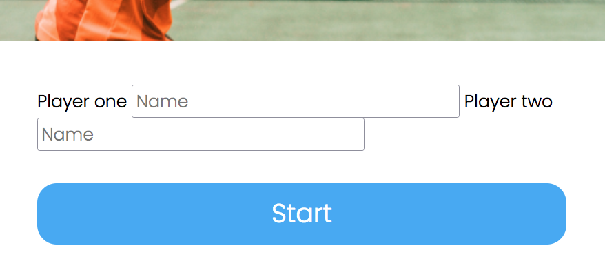
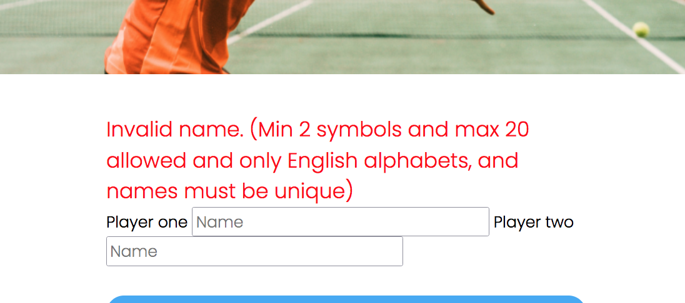
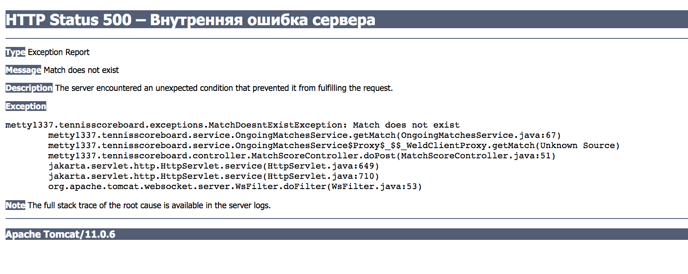

# Review на реализацию от [@c137_morty3](https://github.com/Metty1337/TennisScoreboard) проекта [Табло теннисного матча](https://zhukovsd.github.io/java-backend-learning-course/projects/tennis-scoreboard/)

```text
1. Знаком ❗️ помечены критически важные замечания, а также места нарушения ТЗ.
2. Если ❗️ стоит перед заголовком, значит он относится ко всем пунктам этого раздела.
3. Замечания, указанные в пункте с именем пакета, относятся ко всем классам этого пакета или ко всем классам этого слоя.
4. Знаком 💡 помечены блоки, в которых содержится подсказка по реализации какого-то приёма или части кода. 
   Такие пункты всегда находятся в сворачиваемом блоке и разворачиваются по нажатию. 
   Перед их раскрытием стоит постараться придумать или поискать решение самостоятельно. 
```


## Функциональный обзор
- на странице создания матча строка `"Player two"` "прилипла" к полю ввода имени первого игрока 
- не сохраняются имена в поле ввода — чтобы исправить ошибку, пользователю приходится заново писать всё имя 
- на странице текущего матча перепутаны колонки `Games` и `Sets` 
- в пагинации на странице завершённых матчей отображаются все страницы, что будет плохо выглядеть при большом количестве страниц. 

Лучше сделать отображение текущей и +- 2 страниц вокруг неё.

## Model
### ScoreModel
- суффикс `Model` можно удалить из названия класса
- реализация паттерна Строитель (Builder) не нужна в этом классе. Даже в текущей реализации объекты класса создаются только с параметрами по умолчанию, которые можно задать в конструкторе без параметров или при объявлении полей класса. Удобство использования Строителя в тестах не является достаточной причиной создавать его в коде класса.

  Сейчас в OngoingMatchesService объект создаётся так:
```java
ScoreModel scoreModel = ScoreModel.builder()
        .playerOnePoints(Point.LOVE)
        .playerOneGames(0)
        .playerOneSets(0)
        .playerTwoPoints(Point.LOVE)
        .playerTwoGames(0)
        .playerTwoSets(0)
        .tieBreak(Boolean.FALSE)
        .playerOneTieBreakPoints(0)
        .playerTwoTieBreakPoints(0)
        .build();
```
Вместо этого можно например так:
```java
public class ScoreModel {
    private Point playerOnePoints;
    private Point playerTwoPoints;
    
    // ...
    
    public ScoreModel() {
        this.playerOnePoints = Point.LOVE;
        this.playerTwoPoints = Point.LOVE;
    }
}
```
и создавать объект так:
```java
ScoreModel scoreModel = new ScoreModel();
```
- Поля в классе повторяются для каждого игрока: `playerOnePoints`, `playerTwoPoints`, `playerOneGames`, `playerTwoGames` и тд. Это признак того, что в классе отсутствует важная абстракция. Все данные, относящиеся к счету одного игрока (`points`, `games`, `sets`, `tieBreakPoints`), логически связаны между собой и можно сгруппировать их в отдельный класс.
  Например, такой:
```java
class PlayerScore {
    private Point points = Point.LOVE;
    private int games = 0;
    private int sets = 0;
    private int tieBreakPoints = 0;
    // геттеры + специальные методы для контролируемого изменения счёта
}
```
- ❗️класс отвечает за хранение очков на всех этапах игрового процесса в матче, а также состояния игры — это слишком большая ответственность для одного класса и нарушает SRP (Single Responsibility Principle). Лучшим решением в этом направлении было бы, чтобы за счёт на каждом уровне отвечал отдельный класс. Такой подход больше соответствовал бы ООП-стилю и принципу единственной ответственности для каждого класса.
- ❗️класс имеет признаки "анемичной модели" — он является лишь контейнером (причём изменяемым — mutable value object) для данных, а вся логика находится в сервисном слое, что способствует процедурному подходу. Если бы у класса вместо простых сеттеров были методы, совершающие необходимую работу над полями, это больше соответствовало бы ООП стилю и обязанности класса (в роли доменной модели). Также, эту часть логики было бы легче тестировать.


<details>

<summary><b>💡 Вот упрощённый пример такого класса 💡</b></summary>

---

```java
public class PlayerScore {
    private static final Point INITIAL_POINTS = Point.LOVE;
    private static final int VICTORY_TIEBREAK_POINTS = 7;
    private static final int VICTORY_SET_POINTS = 6;
    private static final int MIN_ADVANTAGE_TO_WIN = 2;
    private Point points;
    private int games = 0;
    private int sets = 0;
    private int tieBreakPoints = 0;

    public PlayerScore() {
        this.points = INITIAL_POINTS;
    }

    public void increment() {
        // логика добавления очков
    }

    public boolean hasAdvantage() {
        return points == Point.ADVANTAGE;
    }

    public String getPointsValue() {
        return points.value();
    }

    private void incrementGamePoints() {
        games++;
    }

    private void incrementSetPoints() {
        sets++;
    }

    private void incrementTieBreakPoints() {
        tieBreakPoints++;
    }

    private void resetPoints() {
        points = INITIAL_POINTS;
    }

    enum Point {
        LOVE("0"),
        FIFTEEN("15"),
        THIRTY("30"),
        FORTY("40"),
        ADVANTAGE("AD");

        private final String value;

        Point(String value) {
            this.value = value;
        }

        public Point next() {
            if (this == ADVANTAGE) {
                throw new IllegalStateException("Has no points after advantage.");
            }
            return values()[ordinal() + 1];
        }

        public String value() {
            return value;
        }
    }
}
```

При таком подходе от сеттеров стоит избавиться, чтобы состояние счёта управлялось только явно предусмотренными для этого методами.

---

</details>

[**Анемичная vs Богатая модель предметной области**](#reach-anemic-model) <a id="back-1"></a>

### MatchScoreModel
- суффикс `Model` можно удалить из названия класса
- класс смешивает архитектурные роли доменной модели и DTO: он участвует в основной бизнес-логике, а также служит контейнером для передачи данных в слой представления (JSP) (хоть и делает это по частям). Доменная модель и DTO — это два разных типа объектов, поэтому стоит выделить их в отдельные классы (например, `OngoingMatch` и `MatchDto`) и реализовать в соответствии с принципом единственной ответственности.

[**"Типы моделей" в веб-приложении**](#model-types) <a id="back-2"></a>

- ❗️сейчас этот класс отдаёт в представление (JSP-файлы) объекты Entity (с данными напрямую из БД). Это не является хорошей практикой и может привести к проблемам производительности (например, ленивая загрузка) и безопасности (например, случайная передача чувствительных данных). Кроме того, это связывает слой представления с моделью данных, нарушая архитектурные границы. Лучше для этого использовать объекты DTO, реализованных с соблюдением принципа единственной ответственности.
- При реализации класса, как DTO стоит учесть, что все внутренние объекты в DTO должны быть тоже DTO.

### Point
- Сейчас Point находится в пакете `enums`. Такое выделение отдельного пакета по типу класса с архитектурной точки зрения сомнительно. Перечисление Point представляет собой концепцию предметной области (очки в теннисном гейме) и должно находиться на слое предметной области, поэтому стоит переместить Point в `model`.
- даже если сейчас у класса есть только final поля, то всё равно лучше использовать максимально "узкую" аннотацию `@RequiredArgsConstructor` вместо `@AllArgsConstructor`. Чтобы при добавлении новых non-final полей они автоматически не попадали в параметры конструктора.
- значение `value = 100` для `GAME` не валидно, потому что в теннисном гейме не существует счёта в `100` очков
- значение `GAME` само по себе также не является частью счёта в гейме (это понятие относится к результату гейма, а не к счёту в нём), поэтому не должно существовать в этом перечислении
- значение `value = 0` для `DEUCE` некорректно, потому что в теннисном гейме `DEUCE` означает состояние "ровно" при счёте `40:40` и может отображаться как `40:40` или `DEUCE`
- значение `value = 1` для `ADVANTAGE` некорректно, его правильное значение — `AD`
- поле `int value` может быть строкой и тогда будет подходить для отображения любого счёта
- метода `next()` получает следующее значение по индексу, добавляя к индексу текущего элемента `1` — `return values()[this.ordinal() + 1]`), поэтому при вызове метода `next()` на объекте `ADVANTAGE` произойдёт выход за границы массива и возникнет ArrayIndexOutOfBoundsException. Стоит обработать этот случай отдельно.
- также `FORTY.next()` вернет `GAME`. Но гейм не всегда заканчивается после `FORTY`. Например, если у соперника тоже `FORTY`, то следующим состоянием будет `ADVANTAGE`.

## Entity
- суффикс `Entity` можно удалить из названий классов
- В текущей реализации сущностей, пустой публичный конструктор без параметров можно было бы не писать в коде (или через `@NoArgsConstructor`), если он единственный в классе — в таком случае в java он будет по умолчанию
- Hibernate достаточно конструктора без параметров с уровнем доступа protected — поэтому можно именно это значение установить в аннотации: `@NoArgsConstructor(access = AccessLevel.PROTECTED)`. Это также служит сигналом другим разработчикам, что этот конструктор предназначен в первую очередь для использования фреймворком (JPA), а не для прямого вызова в коде.
- неоднородность в использовании аннотации `@Column`: в PlayerEntity (над `name`) имя колонки не указано явно (т.к. совпадает с именем поля), а в классе MatchEntity указано (над `id`). Лучше везде придерживаться одного подхода.

### PlayerEntity
- В аннотацию `@Column` стоит добавить параметр `length = 20`, чтобы Hibernate тоже (помимо валидатора) выполнял проверку перед вставкой в БД. А также это влияет на DDL при создании таблицы. Целостность данных должна обеспечиваться на всех уровнях: в приложении (валидация) и в БД (constraints). Отсутствие ограничений в БД означает, что данные могут быть испорчены из-за ошибок в приложении или при прямом доступе к БД.
- ❗️аннотация `@Setter` генерирует публичный сеттер поля `private String name;`, из-за этого любой код может изменить имя игрока, что нарушает инварианты (имя игрока должно быть неизменяемым после создания). Решением будет не создавать сеттеры для полей.
- ❗️сеттер для `id` позволяет создать объект Player c установленным id. Для полей, которые генерируются в БД, лучше не давать такую возможность, поэтому его стоит удалить.
- хорошим подходом будет оставить минимум необходимых аннотаций, достаточных для JPA Entity, предоставить конструктор для создания валидных объектов и корректную реализацию `equals`/`hashCode`:
```java
@Getter // Геттеры нужны для JPA и сериализации
@NoArgsConstructor(access = AccessLevel.PROTECTED) // Конструктор для JPA
@ToString
@EqualsAndHashCode(of = "name") // Реализация на основе бизнес-ключа
@ToString(of = {"id", "name"}) // С явно выбранными полями
@Entity
@Table(name = "players")
public class PlayerEntity {

    @Id
    @GeneratedValue(strategy = GenerationType.SEQUENCE)
    private Long id;

    @Column(nullable = false, unique = true, length = 20)
    private String name;

    // Публичный конструктор для создания валидных объектов в бизнес-логике
    public PlayerEntity(String name) {
        this.name = name;
    }
}
```

### MatchEntity
- ❗️аннотация `@Setter` генерирует публичные сеттеры для полей игроков и победителя, из-за этого любой код может изменить игрока или победителя после создания entity матча, что нарушает инварианты (состав игроков, а также победитель должен быть неизменяемым после завершения матча). Решением будет не создавать сеттеры для полей.

## Dao
- В текущей реализации методы сохранения сущностей `save(PlayerEntity playerEntity)` и `save(MatchEntity matchEntity)` возвращают void. Это допустимо, но обычно в таких методах возвращают сохранённую сущность (особенно если у неё генерируется ID) или, по крайней мере, тот же объект. Это позволяет получить сгенерированный идентификатор или сохранённый объект более явно:

  Например, в TransactionalFinishedMatchesPersistenceService сейчас так:
```java
public MatchEntity saveMatchToFinishedScoreboard(MatchScoreModel matchScoreModel, int winnerId) {
        
    // ...

    MatchEntity matchEntity = new MatchEntity();
    matchEntity.setPlayerOne(playerOne);
    matchEntity.setPlayerTwo(playerTwo);
    matchEntity.setWinner(winner);

    Objects.requireNonNull(matchDao).save(matchEntity);

    return matchEntity;
}
```
лучше так:
```java
public MatchEntity saveMatchToFinishedScoreboard(MatchScoreModel matchScoreModel, int winnerId) {
        
    // ...
        
    MatchEntity matchEntity = new MatchEntity(playerOne, playerTwo, winner);

    MatchEntity savedMatch = matchDao.save(matchEntity);

    return savedMatch;
}
```
или так:
```java
public MatchEntity saveMatchToFinishedScoreboard(MatchScoreModel matchScoreModel, int winnerId) {
        
    // ...
        
    MatchEntity matchEntity = new MatchEntity(playerOne, playerTwo, winner);

    return matchDao.save(matchEntity);
}
```
- неоднородность в написании HQL запросов: в классе HiberMatchDao HQL запросы написаны с alias-ами (`FROM MatchEntity m`), а в классе HiberPlayerDao без (`FROM PlayerEntity`). Лучше везде придерживаться одного стиля

### PlayerDao
<div align="right">

[перейти к упоминанию в HiberPlayerDao](#forward-1) </div>
- ❗️метод `boolean existsByName(String name)` порождает лишний запрос в БД — сначала проверяется, если ли игрок, а затем он запрашивается из БД. Лучше сразу пытаться получить игрока через `Optional<PlayerEntity> findByName(String name)` и если вернётся `Optional.empty()` — это и будет означать, что игрока нет.

### HiberPlayerDao
<div align="right">

[перейти к упоминанию в HiberMatchDao](#forward-2) </div>
<div align="right">

[перейти к упоминанию в PlayerService](#playerservice) </div>
<div align="right">

[перейти к упоминанию в OngoingMatchesService](#ongoingmatchesservice) </div>
<div align="right">

[перейти к упоминанию в FinishedMatchesPersistenceService](#forward-3) </div>
- В проекте нигде больше (кроме классов DAO) не используются сокращения в названиях классов, а также в `HibernateUtil` префикс `Hibernate` тоже полный, поэтому и здесь префикс `Hibernate` в названии класса лучше писать без сокращения `HiberPlayerDao` —> `HibernatePlayerDao`
- в названиях констант с запросами можно убрать префикс `PLAYER` и добавить суффикс `HQL` или `JPQL`:

`PLAYER_EXISTS_BY_NAME` —> `EXISTS_BY_NAME_HQL`

`PLAYER_FIND_BY_NAME` —> `FIND_BY_NAME_HQL`

`PLAYER_FIND_BY_ID` —> `FIND_BY_ID_HQL`

- текст запроса удобнее читать, когда он логично разбит на строки:
```sqlite-sql
SELECT COUNT(*)
FROM PlayerEntity 
WHERE name = :name
```
для этого можно использовать текстовые блоки:
```java
private static final String FIND_BY_NAME_HQL = """
        FROM PlayerEntity 
        WHERE name = :name
        """;
```
- части
```sqlite-sql
FROM PlayerEntity
```
и
```sqlite-sql
WHERE name = :name
```
дублируются в нескольких запросах — можно вынести их в отдельные переменные
```java
private static final String SELECT_ALL_HQL = """
        FROM PlayerEntity
        """;

private static final String FILTER_BY_NAME_HQL = """
        WHERE name = :name
        """;
```
- в каждом методе SessionFactory проверяется на null: `Objects.requireNonNull(sessionFactory)` — это избыточно: если такая проверка актуальна, то достаточно будет сделать её один раз в конструкторе, при внедрении этой зависимости. В данном случае, поскольку ответственность за создание и внедрение зависимостей берёт на себя CDI-контейнер, эту проверка — скорее способ избежать уведомлений при статическом анализе, а не реальная необходимость.

  Чтобы избежать предупреждений `Method invocation 'openSession' may produce 'NullPointerException'` в местах вызова `sessionFactory.openSession()` можно добавить проверку в конструктор вручную или через аннотацию `@jakarta.annotation.Nonnull` — с ней такая проверка будет сгенерирована автоматически при компиляции.

В классе:
```java
public class HiberPlayerDao {
    @jakarta.annotation.Nonnull
    private final SessionFactory sessionFactory;

    @Inject
    public HiberPlayerDao(SessionFactory sessionFactory) {
        this.sessionFactory = Objects.requireNonNull(sessionFactory);
    }
}
```
После `mvn compile` в `target/classes/metty1337/tennisscoreboard/dao/HiberPlayerDao.class`:
```java
public class HiberPlayerDao {
    @Nonnull
    private final SessionFactory sessionFactory;

    @Inject
    public HiberPlayerDao(SessionFactory sessionFactory) {
        this.sessionFactory = (SessionFactory)Objects.requireNonNull(sessionFactory);
    }
}
```

Ещё более чистым подходом будет перейти на внедрение зависимостей через интерфейсы, тогда классам бинов не понадобится конструктор без параметров (прокси объект будет реализовывать интерфейс, а не наследоваться от класса) и, как следствие, не будет предупреждений о том, что объекты полей могут быть причиной NullPointerException от статического анализатора.
- ❗️про отсутствие необходимости в методе `existsByName()` cказано в разделе [PlayerDao](#playerdao) <a id="forward-1"></a>
- ❗️перед откатом транзакции в блоке catch в методе `save()` стоит добавить проверку, что она активна
```java
if (transaction != null && transaction.isActive()) {
    transaction.rollback();
}
```
иначе вызов `transaction.rollback()` может привести к исключению IllegalStateException
- ❗️также вызов `transaction.rollback()` стоит обернуть в try, иначе при возникновении исключения в этом методе оно замаскирует оригинальное исключение из основного блока try.

  Например, так:
```java
@Override
public void save(PlayerEntity playerEntity) {
    Transaction transaction = null;
    try (Session session = sessionFactory.openSession()) {
        transaction = session.beginTransaction();
        session.persist(playerEntity);
        transaction.commit();
    } catch (Exception e) {
        safeRollback(transaction, e);
        throw new DatabaseException(ExceptionMessages.DATABASE_EXCEPTION.getMessage(), e);
    }
}

private void safeRollback(Transaction transaction, Exception originalException) {
    try {
        if (transaction != null && transaction.isActive()) {
            transaction.rollback();
        }
    } catch (Exception rollbackException) {
        originalException.addSuppressed(rollbackException);
    }
}
```
- в методах `findByName()` и `findById()` можно напрямую получать Optional из Query: вместо `return Optional.ofNullable(query.uniqueResult())` возвращать `return query.uniqueResultOptional()`
- тела методов `findByName()` и `findById()` можно записать лаконичнее.

Например, в `findByName()` cейчас так:
```java
@Override
public Optional<PlayerEntity> findByName(String name) {
    try (Session session = Objects.requireNonNull(sessionFactory).openSession()) {
        Query<PlayerEntity> query = session.createQuery(
                PLAYER_FIND_BY_NAME,
                PlayerEntity.class
        );
        query.setParameter("name", name);
        return Optional.ofNullable(query.uniqueResult());
    } catch (Exception e) {
        throw new DatabaseException(ExceptionMessages.DATABASE_EXCEPTION.getMessage(), e);
    }
}
```
можно так:
```java
@Override
public Optional<PlayerEntity> findByName(String name) {
    try (Session session = sessionFactory.openSession()) {
        return session.createQuery(PLAYER_FIND_BY_NAME, PlayerEntity.class)
                .setParameter("name", name)
                .uniqueResultOptional();
    } catch (Exception e) {
        throw new DatabaseException(ExceptionMessages.DATABASE_EXCEPTION.getMessage(), e);
    }
}
```

### MatchDao
<div align="right">

[перейти к упоминанию в HiberMatchDao](#forward-2) </div>
- метод `findBySimilarNameWithSettings()` можно переименовать в `findByPlayerName()` или `findByName()` без потери смысла
- метод `findAllWithSettings()` можно переименовать в `findAll()` без потери смысла
- ❗️метод `List<MatchEntity> findAll()` возвращает вообще все матчи, которые есть в БД, что может привести к OutOfMemoryError. В текущем виде он не должен существовать. Для получения выборки матчей лучше всегда использовать запрос с пагинацией, а для того, чтобы узнать общее количество матчей в БД, следует сделать метод, который выполнит соответствующий запрос и вернёт `Long count` из базы.

### HiberMatchDao
<div align="right">

[перейти к упоминанию в MatchesController](#forward-5) </div>
- В проекте нигде больше (кроме классов DAO) не используются сокращения в названиях классов, а также в `HibernateUtil` префикс `Hibernate` тоже полный, поэтому и здесь префикс `Hibernate` в названии класса лучше писать без сокращения `HiberMatchDao` —> `HibernateMatchDao`
- в названиях констант с запросами можно добавить суффикс `HQL` или `JPQL`:

`FIND_BY_SIMILAR_NAME` —> `FIND_BY_NAME_HQL`

`FIND_ALL` —> `FIND_ALL_HQL`

- текст запроса удобнее читать, когда он логично разбит на строки:
```sqlite-sql
FROM MatchEntity m
WHERE m.playerOne.name LIKE :name OR m.playerTwo.name LIKE :name 
ORDER BY m.id
```
для этого можно использовать текстовые блоки:
```java
private static final String FIND_BY_SIMILAR_NAME = """
        FROM MatchEntity m
        WHERE m.playerOne.name LIKE :name OR m.playerTwo.name LIKE :name 
        ORDER BY m.id
        """;
```
- части
```sqlite-sql
FROM MatchEntity m
```
и
```sqlite-sql
ORDER BY m.id
```
дублируются в нескольких запросах — можно вынести их в отдельные переменные
```java
private static final String SELECT_ALL_HQL = """
        FROM MatchEntity m
        """;

private static final String ORDER_HQL = """
        ORDER BY m.id
        """;
```
- в каждом методе SessionFactory проверяется на null: `Objects.requireNonNull(sessionFactory)` — это избыточно. Избежать этого можно так же, как описано в разделе [HiberPlayerDao](#hiberplayerdao). <a id="forward-2"></a>
- ❗️про отсутствие необходимости в методе `List<MatchEntity> findAll()` cказано в разделе [MatchDao](#matchdao)
- ❗️обработку отката транзакции в блоке catch в методе `save()` стоит организовать так же, как описано в разделе [HiberPlayerDao](#hiberplayerdao).
- тела методов этого класса тоже можно записать цепочкой вызовов.
  Например, в методе `findBySimilarNameWithSettings()` сейчас так:
```java
@Override
public List<MatchEntity> findBySimilarNameWithSettings(int limit, int offset, String playerName) {
    try (Session session = Objects.requireNonNull(sessionFactory).openSession()) {
        Query<MatchEntity> query = session.createQuery(FIND_BY_SIMILAR_NAME, MatchEntity.class);
        query.setParameter("name", playerName);
        query.setFirstResult(offset);
        query.setMaxResults(limit);
        return query.getResultList();
    } catch (Exception e) {
        throw new DatabaseException(ExceptionMessages.DATABASE_EXCEPTION.getMessage(), e);
    }
}
```
можно так:
```java
@Override
public List<MatchEntity> findBySimilarNameWithSettings(int limit, int offset, String playerName) {
    try (Session session = Objects.requireNonNull(sessionFactory).openSession()) {
        return session.createQuery(FIND_BY_SIMILAR_NAME, MatchEntity.class)
                .setParameter("name", playerName)
                .setFirstResult(offset)
                .setMaxResults(limit)
                .getResultList();
    } catch (Exception e) {
        throw new DatabaseException(ExceptionMessages.DATABASE_EXCEPTION.getMessage(), e);
    }
}
```
- ❗️В методах поиска загружаются сущности MatchEntity, которые связаны с PlayerEntity отношением многие-к-одному. В текущей реализации при загрузке одного матча будет выполняться ещё два запроса для загрузки связанных с ним игроков (проблема N+1):
```sqlite-sql
[Hibernate] 
    select
        me1_0.id,
        me1_0.player1_id,
        me1_0.player2_id,
        me1_0.winner_id 
    from
        matches me1_0 
    order by
        me1_0.id
[Hibernate] 
    select
        pe1_0.id,
        pe1_0.name 
    from
        players pe1_0 
    where
        pe1_0.id=?
[Hibernate] 
    select
        pe1_0.id,
        pe1_0.name 
    from
        players pe1_0 
    where
        pe1_0.id=?
```

Следует это исправить — например, изменить запросы так, чтобы сразу загружать связанные сущности.

<details>
<summary><b>💡 Вот пример такого запроса 💡</b></summary>

Оптимизируем запросы с помощью JOIN FETCH
```java
String FIND_BY_NAME_JPQL = """
        SELECT m FROM MatchEntity m
        LEFT JOIN FETCH m.playerOne
        LEFT JOIN FETCH m.playerTwo
        LEFT JOIN FETCH m.winner
        WHERE m.playerOne.name LIKE :name OR m.playerTwo.name LIKE :name
        """;
```

</details>

## Service
- cтоит подумать о переносе управления транзакциями на сервисный слой. Это сделает соблюдение принципа единственной ответственности в слое DAO более строгим. 

### PlayerService
- избавиться от проверок `Objects.requireNonNull(playersDao)` в каждом методе, где используется DAO, можно аналогично тому, как описано в разделе [HiberPlayerDao](#hiberplayerdao)
- ❗️проверка `if (isPlayerExist(playerName))` в методе `findOrCreatePlayer()` добавляет необязательный запрос в БД. Лучше сразу пытаться получить/сохранить игрока и обрабатывать ситуацию, когда это не удаётся сделать.
  Например, вместо:
```java
public PlayerEntity findOrCreatePlayer(String playerName) {
    if (isPlayerExist(playerName)) {
        return getPlayerByName(playerName);
    } else {
        return createPlayer(playerName);
    }
}
```
будет так:
```java
public PlayerEntity findOrCreatePlayer(String playerName) {
    return playersDao.findByName(playerName)
            .orElseGet(() -> createPlayer(playerName));
}
```
- когда из блока if происходит return, то остальной код можно писать без блока else.
  сейчас так:
```java
public PlayerEntity findOrCreatePlayer(String playerName) {
    if (isPlayerExist(playerName)) {
        return getPlayerByName(playerName);
    } else {
        return createPlayer(playerName);
    }
}
```
лучше так:
```java
public PlayerEntity findOrCreatePlayer(String playerName) {
    if (isPlayerExist(playerName)) {
        return getPlayerByName(playerName);
    }
    return createPlayer(playerName);
}
```
Это уменьшает вложенность и улучшает читаемость кода.

- ❗️Race condition при создании игрока — сначала проверяем существует ли игрок по имени и затем делаем ещё один запрос, чтобы получить/сохранить его:
```java
public PlayerEntity findOrCreatePlayer(String playerName) {
    if (isPlayerExist(playerName)) {
        return getPlayerByName(playerName);
    } else {
        return createPlayer(playerName);
    }
}
```

Между проверкой и сохранением игрока другой поток может создать игрока с тем же именем. И тогда при сохранении возникнет исключение, которе нигде не обрабатывается и пользователь увидит страницу с кодом 500. Хотя создать матч с уже существующим в БД игроком — нормальная ситуация. 

Вместо этого надо сразу пытаться сохранить игрока, позволить БД выбросить ошибку, если такой игрок уже существует, и тогда уже обработать этот случай, продолжив работу приложения.
Этот подход гарантирует корректность при высокой конкурентной нагрузке и, в "счастливом пути" (когда игрок новый), сокращает количество запросов к БД.

При реализации этого подхода важно ловить правильное исключение. Блок catch должен убедиться, что произошло исключение, связанное с нарушением уникальности — ConstraintViolationException. Это нужно, чтобы случайно не обработать другую ошибку (например, падение соединения с БД) как штатную ситуацию "игрок уже существует".

### OngoingMatchesService
- запуск логики валидации имён игроков из метода `createMatch()` можно вынести в сервлет — как можно ближе ко входу этих данных в приложение
- избавиться от проверок `Objects.requireNonNull(playerService)` в каждом методе, где используется PlayerService, можно аналогично тому, как описано в разделе [HiberPlayerDao](#hiberplayerdao)
- проверка `Objects.requireNonNull(ongoingMatches)` для хранилища текущих матчей избыточна, так как оно всегда создаётся в конструкторе класса
- из метода `createMatch()` стоит возвращать id матча в виде объекта UUID и предоставить клиентскому коду самому приводить его к строке, если это необходимо
- в методах `getMatch()` и `removeMatchFromOngoing()` стоит принимать объект UUID, а проверять его на корректность и парсить как можно ближе ко входу — в сервлете
- создавать Optional для проверки на null значения из Map не является хорошей практикой: `Optional.ofNullable(Objects.requireNonNull(ongoingMatches).get(uuid))`. В методе `getMatch()` можно проверять, существует ли в хранилище пришедший в метод ключ, а затем просто возвращать объект по этому ключу.

<details>

<summary><b>💡 После всех предложений метод `getMatch()` может выглядеть так 💡</b></summary>

---

Сейчас так:
```java
public MatchScoreModel getMatch(String matchId) {
    UUID uuid = UUID.fromString(matchId);
    Optional<MatchScoreModel> matchScoreModel = Optional.ofNullable(Objects.requireNonNull(ongoingMatches).get(uuid));

    if (matchScoreModel.isPresent()) {
        return matchScoreModel.get();
    } else {
        throw new MatchDoesntExistException(ExceptionMessages.MATCH_DOESNT_EXIST_EXCEPTION.getMessage());
    }
}
```
более идиоматичным было бы так:
```java
public MatchScoreModel getMatch(UUID matchId) {
    return Optional.ofNullable(ongoingMatches.get(matchId))
            .orElseThrow(() -> new MatchDoesntExistException(ExceptionMessages.MATCH_DOESNT_EXIST_EXCEPTION.getMessage()));
}
```
лучше (только для текущей реализации, но не идеально для избегания состояния гонки) так:
```java
public MatchScoreModel getMatch(UUID matchId) {
    if (!ongoingMatches.containsKey(matchId)) {
        throw new MatchDoesntExistException(ExceptionMessages.MATCH_DOESNT_EXIST_EXCEPTION.getMessage());
    }

    return ongoingMatches.get(matchId);
}
```

---

</details>
- ❗️в текущей реализации ничего не мешает двум разным запросам получить один и тот же объект матча и изменять его состояние, конкурируя друг с другом. Это может привести например к тому, что один из потоков попытается добавить очко игроку в уже завершённом матче. Возникнет исключение MatchDoesntExistException и пользователь увидит неожиданную (и неинформативную) страницу от томката



Один из способов избежать этого — выполнить декомпозицию и реализовать логику обработки выигранного очка в классах моделей (например, через паттерн Chain of responsibility) и выполнять её в методе `ConcurrentHashMap.compute()` внутри OngoingMatchesService. Тогда каждый вызов метода станет атомарной операцией, результатом которой будет валидное состояние счёта.

### MatchScoreCalculationService
- у константы `int ONE = 1;` малоинформативное имя и несмотря на то, что это значение вынесено в константу, оно остаётся "магическим" и не объясняет назначение числа. Стоит дать ей более подходящее имя, например, `POINT_INCREMENT` или `SET_INCREMENT`.
- магические числа (`playerOneSets == 2 || playerTwoSets == 2`) из метода `isFinished()` тоже можно вынести в константу, например `SETS_TO_WIN_MATCH`.
- класс слишком много знает о внутреннем устройстве ScoreModel, а также содержит всю логику его изменения, что соответствует больше процедурному стилю, нежели ООП подходу
- хотя обработка счёта и разделена на отдельные методы, логика в них остаётся ветвистой, запутанной и местами сложно читаемой.
- Во многих местах повторяется шаблон
```java
if (playerOneWon) {
    // ...
} else {
    // ...
}
```
это приводит к дублированию логики для каждого игрока.
- В методах `advancePlayerOnePoint()` и `advancePlayerTwoPoint()` используется `playerNumberPoint.ordinal() < Point.FORTY.ordinal()`. Это плохая практика, так как логика становится зависимой от порядка объявления констант в `enum`. Любое изменение порядка в `Point` сломает подсчет очков. Текущее сравнение можно заменить на прямое, например `playerTwoPoint != Point.FORTY`.
- Логика определения начала тай-брейка "размазана" по нескольким методам, что приводит к повторным проверкам и усложняет понимание того, когда именно начинается тай-брейк. В текущей реализации можно выполнять проверку на тай-брейк один раз в начале и чётко направлять поток выполнения либо по пути обычного гейма, либо по пути тай-брейка.
- ❗️методы класса имеют побочные эффекты (side effects) и нарушают Принцип наименьшего удивления (Principle of Least Astonishment).

  Например метод `checkTieBreakWin()`:
    - Имя метода — `checkTieBreakWin` ("проверить победу в тай-брейке"). Такое имя-вопрос или имя-проверка (check, is, has) подразумевает, что метод должен выполнить проверку и вернуть результат, как правило, boolean (ещё возможно бросить исключение). То есть, ожидается, что это "запрос".
    - В реальности метод не возвращает результат проверки — имеет тип возвращаемого значения void. Вместо этого, если победитель определен, метод сам запускает каскад изменений состояния: вызывает `applyTieBreakWin()` (который отдает сет игроку и сбрасывает счёт геймов) и `endTieBreak()` (который сбрасывает очки тай-брейка и выходит из его режима). То есть, этот метод представляет собой "команду".

  Неожиданность заключается в том, что метод, чьё имя звучит как безопасный запрос на получение информации, на самом деле является командой, активно и значительно изменяющей состояние системы.

  Это нарушение принципа [Command-Query Separation (CQS)](https://martinfowler.com/bliki/CommandQuerySeparation.html), который гласит, что метод должен быть либо
  командой (выполняет действие, меняет состояние), либо запросом (возвращает данные, не меняет состояние), но не тем и другим одновременно. Нарушение CQS почти всегда приводит к нарушению принципа наименьшего удивления.

  Более предсказуемый дизайн выглядел бы так:
    - Метод `isTieBreakWon()` (или `getTieBreakWinner()`) выполняет проверку и возвращает boolean, ничего не меняя.
    - Вызывающий код анализирует результат и, если нужно, вызывает другие, отдельные методы-команды, такие как `applySetWin()` и `endTieBreakMode()`.

- ❗️реализация логики изменения состояния доменных моделей отдельно от классов моделей является хрупким подходом и не является хорошей практикой — такой код сложнее поддерживать, тестировать и изменять. Лучшим решением будет реализовать полноценные классы богатых моделей и перенести логику изменения состояния внутрь самой доменной модели.

[**Анемичная vs Богатая модель предметной области**](#reach-anemic-model) <a id="back-3"></a>

### FinishedMatchesPersistenceService
<div align="right">

[перейти к упоминанию в MatchesController](#forward-5) </div>
- название метода `saveMatchToFinishedScoreboard()` можно упростить до `save()` без потери смысла
- в методе `saveMatchToFinishedScoreboard()` нет проверки на совпадение winnerId с id второго игрока
```java
if (winnerId == playerOne.getId()) {
    winner = playerOne;
} else {
    winner = playerTwo;
}
```
Код станет более надёжным, если добавить явную проверку для второго игрока.
- в методе `saveMatchToFinishedScoreboard()` для создания MatchEntity вместо сеттеров
```java
MatchEntity matchEntity = new MatchEntity();
matchEntity.setPlayerOne(playerOne);
matchEntity.setPlayerTwo(playerTwo);
matchEntity.setWinner(winner);
```
лучше использовать конструктор с необходимыми параметрами. Это гарантирует, что объект создаётся сразу в валидном состоянии, а также позволит избавиться от сеттеров в Entity.
- избавиться от проверок `Objects.requireNonNull(matchDao)` в каждом методе, где используется DAO, можно аналогично тому, как описано в разделе [HiberPlayerDao](#hiberplayerdao) <a id="forward-3"></a>
- название метода `getPageOfMatches()` можно упростить до `getMatches()` без потери смысла
- параметрам метода `getPageOfMatches()` можно дать чуть более подходящие имена:

`int page` —> `int pageNumber`

`String searchRequest` —> `String filter`

- блоки кода вида:
```java
if (!searchRequest.isBlank()) {
    matchEntities = Objects.requireNonNull(matchDao).findBySimilarNameWithSettings(pageSize, offset, searchRequest);
} else {
    matchEntities = Objects.requireNonNull(matchDao).findAllWithSettings(pageSize, offset);
}
return matchEntities;
```
можно заменять более плоскими и читаемыми:
```java
if (!searchRequest.isBlank()) {
    return Objects.requireNonNull(matchDao).findBySimilarNameWithSettings(pageSize, offset, searchRequest);
}
return Objects.requireNonNull(matchDao).findAllWithSettings(pageSize, offset);
```
- ❗️метод `getTotalPages()` загружает полные объекты всех матчей из БД только для того, чтобы узнать их количество. Если в базе данных будут храниться сотни тысяч или миллионы матчей, этот метод приведёт к огромной нагрузке на базу данных и сетевые ресурсы. А также при очень большом количестве записей приложение может исчерпать доступную память, пытаясь загрузить все `MatchEntity` объекты в память.

  Решением будет создать в `MatchDao` метод для получения общего количества записей напрямую из базы данных, без загрузки самих сущностей и вызывать его здесь. Это позволит значительно сократить использование ресурсов.

## Controller
- имя параметра value в аннотации `@WebServlet` можно не указывать явно:

  `@WebServlet(value = "/path")` —> `@WebServlet("/path")`

### IndexController
- класс называется IndexController, но обрабатывает путь `/home` — можно переименовать контроллер или использовать для домашней страницы путь `/index`

### MatchScoreController
<div align="right">

[перейти к упоминанию в MatchesController 1](#matchescontroller) </div>
<div align="right">

[перейти к упоминанию в MatchesController 2](#forward-4) </div>
- константам стоит дать подходящие суффиксы:

  `UUID` —> `UUID_PARAM`

  `WINNER_ID` —> `WINNER_ID_PARAM`

  `WINNER_NAME` —> `WINNER_NAME_ATTR`

  `PLAYER_ONE` —> `PLAYER_ONE_ATTR`

  `PLAYER_TWO` —> `PLAYER_TWO_ATTR`

  `SCORE` —> `SCORE_ATTR`

  `MATCH_FINISHED` —> `MATCH_FINISHED_ATTR` (лучше `FINISHED_MATCH_ATTR`)

Эта конвенция (`_PARAM`, `_ATTR` или `_PARAMETER` как в NewMatchController) значительно улучшает читаемость, так как сразу становится ясно, где
используется каждая константа.

- Хорошо, что этот контроллер взаимодействует с сервисным слоем, но сейчас он работает с 4-мя сервисами:
```java
@Inject
private OngoingMatchesService ongoingMatchesService;
@Inject
private MatchScoreCalculationService matchScoreCalculationService;
@Inject
private PlayerService playerService;
@Inject
private FinishedMatchesPersistenceService finishedMatchesPersistenceService;
```
Контроллер содержит в себе всю логику оркестрации — последовательность шагов по обновлению, проверке и сохранению матча. Это перегружает контроллер бизнес-логикой, которая должна находиться в сервисном слое. Идеальная картина для него — использовать только один сервис (например, OngoingMatchesService) — отправлять ему входящие данные и получать ответ, который нужно отдать в представление. А логикой завершения матча и сохранения в БД пусть управляет сервисный слой. Такой рефакторинг сделает контроллер "тонким" и его единственной задачей останется обработка HTTP и делегирование бизнес-запроса сервисному слою.

[Архитектурный анти-паттерн: "Толстый контроллер" (Fat Controller)](#fat-controller) <a id="back-4"></a>

- в обоих методах дублируется логика установки атрибутов:
```java
@Override
protected void doRequest(HttpServletRequest request, HttpServletResponse response) {
    // ...
    request.setAttribute(PLAYER_ONE, matchScoreModel.playerOne());
    request.setAttribute(PLAYER_TWO, matchScoreModel.playerTwo());
    request.setAttribute(SCORE, matchScoreModel.score());
    request.setAttribute(UUID, uuid);
    // ...
}
```
избавиться от дублирования можно, если вынести её в отдельный метод:
```java
@Override
protected void doRequest(HttpServletRequest request, HttpServletResponse response) {
    // ...
    putMatchAttributes(matchScoreModel, uuid, request);
    // ...
}

private void putMatchAttributes(MatchScoreModel matchScoreModel, String uuid, HttpServletRequest request) {
    request.setAttribute(PLAYER_ONE, matchScoreModel.playerOne());
    request.setAttribute(PLAYER_TWO, matchScoreModel.playerTwo());
    request.setAttribute(SCORE, matchScoreModel.score());
    request.setAttribute(UUID, uuid);
}
```
- вместо того, чтобы передавать данные о матче по частям
```java
request.setAttribute(PLAYER_ONE, matchScoreModel.playerOne());
request.setAttribute(PLAYER_TWO, matchScoreModel.playerTwo());
request.setAttribute(SCORE, matchScoreModel.score());
request.setAttribute(UUID, uuid);
```
можно создать специальный объект, например такой:
```java
public record MatchDto(
        UUID id,
        String firstPlayerName,
        String secondPlayerName,
        ScoreDto firstPlayerScore,
        ScoreDto secondPlayerScore,
        String winnerName,
        boolean finished
) {
}
```
и передавать в JSP его в таком духе:
```java
MatchDto matchDto = ongoingMatchesService.updateMatchScore(matchRequestDto);
request.setAttribute(MATCH_FINISHED, matchDto);
```
- будет уместным проверять валидность id матча в сервлете и передавать в слой сервисов не строку, а объект UUID.

Например, так:
```java
@Override
protected void doGet(HttpServletRequest request, HttpServletResponse response) {
    UUID matchId = getValidId(request);

    // ...
}

private UUID getValidId(HttpServletRequest request) {
    String uuidParamValue = request.getParameter(UUID_PARAM);
    CustomUUIDValidator.validate(uuidParamValue);
    return UUID.fromString(uuidParamValue);
}
```
- в методе `doPost()` нет проверки на NumberFormatException при вызове `Integer.parseInt(request.getParameter(WINNER_ID))`. Парсинг чисел из запроса всегда должен быть обернут в `try-catch` или выполняться с помощью безопасной утилиты.
- ❗️Контроллер передаёт в слой представления JPA сущности (PlayerEntity в MatchScoreModel). Передача Entity объектов в JSP не является хорошей практикой. Это может привести к проблемам производительности (например, ленивая загрузка) и безопасности (например, случайная передача чувствительных данных). Кроме того, это связывает слой представления с моделью данных. Лучше использовать DTO (Data Transfer Object) для передачи данных в представление. DTO позволяют контролировать, какие именно данные передаются.
- ❗️сейчас после сохранения завершённого матча выполняется ещё один запрос в БД, чтобы получить победителя и отдать в JSP его имя:

код:
```java
if (matchScoreCalculationService.isFinished(matchScoreModel)) {
    // ...
    finishedMatchesPersistenceService.saveMatchToFinishedScoreboard(matchScoreModel, winnerId); // сохранение матча

    // ...
    request.setAttribute(WINNER_NAME, playerService.getPlayerById(winnerId).getName()); // получение победителя
}
```
запросы в БД:
```sqlite-sql
-- сохранение матча
[Hibernate] 
    insert 
    into
        matches
        (player1_id, player2_id, winner_id, id) 
    values
        (?, ?, ?, ?)

-- получение победителя
[Hibernate] 
    select
        pe1_0.id,
        pe1_0.name 
    from
        players pe1_0 
    where
        pe1_0.id=?
```
Это избыточно. Можно просто взять имя победителя из объекта сохранённого матча и вставить его в соответствующий DTO, чтобы передать в JSP. Создать такой DTO с именем победителя (и другой необходимой информацией) следует на уровне сервиса.

### MatchesController
- константам стоит дать подходящие суффиксы (по примеру, описанному в разделе [MatchScoreController](#matchscorecontroller))
- создавать объект Optional только ради проверки на null
```java
String filterByPlayerName = Optional.ofNullable(request.getParameter(FILTER_BY_PLAYER_NAME))
        .orElse("");
```
является избыточным.

Optional создавался для использования в качестве возвращаемого типа методов, чтобы явно указать на отсутствие значения. Использование его внутри метода для простой проверки на null создает лишний объект в куче (heap) там, где достаточно тернарного оператора.

Помимо этого, традиционный подход часто понятнее:
```java
String filterValue = request.getParameter(FILTER_BY_PLAYER_NAME);
String filterByPlayerName = (filterValue != null) ? filterValue : "";
```

Использование Optional может быть оправдано, если после получения значения планируется цепочка дальнейших трансформаций (например, `.map(String::trim).filter(s -> !s.isEmpty())`). В таком случае использование Optional делает код более лаконичным и линейным.

Если нужна только замена null на пустую строку, лучше использовать тернарный оператор или `Objects.requireNonNullElse(val, "")`.

- нет проверки на NumberFormatException при вызове `Integer::parseInt`
```java
int page = Optional.ofNullable(request.getParameter(PAGE))
        .map(Integer::parseInt)
        .orElse(1);
```
Парсинг чисел из запроса всегда должен быть обернут в `try-catch` или выполняться с помощью безопасной утилиты.
- присваивать переменной значение константы `int pageSize = PAGE_SIZE;` не имеет смысла — можно передавать в методы саму константу
- вместо передачи атрибутов по отдельности
```java
request.setAttribute(PAGE, page);
request.setAttribute(FILTER_BY_PLAYER_NAME, filterByPlayerName);
request.setAttribute(TOTAL_PAGES, totalPages);
request.setAttribute(MATCHES, pageOfMatches);
```
можно создать специальный DTO и передавать его целиком (по аналогии из раздела [MatchScoreController](#matchscorecontroller)) <a id="forward-4"></a>
- ❗️Контроллер передаёт в слой представления JPA сущности (`List<MatchEntity>`). Передача Entity объектов в JSP не является хорошей практикой. Это может привести к проблемам производительности (например, ленивая загрузка) и безопасности (например, случайная передача чувствительных данных). Кроме того, это связывает слой представления с моделью данных. Лучше использовать DTO (Data Transfer Object) для передачи данных в представление. DTO позволяют контролировать, какие именно данные передаются.
- ❗️В текущей реализации вызов методов:
```java
List<MatchEntity> pageOfMatches = finishedMatchesPersistenceService.getPageOfMatches(page, pageSize, filterByPlayerName);
int totalPages = finishedMatchesPersistenceService.getTotalPages(pageSize);
```
порождает большое количество избыточных запросов. Что создаёт лишнюю нагрузку на БД.

Например, при переходе на страницу с двумя матчами происходит 10 запросов
```sqlite-sql
-- получение выборки из списка матчей
[Hibernate] 
    select
        me1_0.id,
        me1_0.player1_id,
        me1_0.player2_id,
        me1_0.winner_id 
    from
        matches me1_0 
    order by
        me1_0.id 
    offset
        ? rows 
    fetch
        first ? rows only

-- получение каждого игрока из каджого матча отдельным запросом
[Hibernate] 
    select
        pe1_0.id,
        pe1_0.name 
    from
        players pe1_0 
    where
        pe1_0.id=?
[Hibernate] 
    select
        pe1_0.id,
        pe1_0.name 
    from
        players pe1_0 
    where
        pe1_0.id=?
[Hibernate] 
    select
        pe1_0.id,
        pe1_0.name 
    from
        players pe1_0 
    where
        pe1_0.id=?
[Hibernate] 
    select
        pe1_0.id,
        pe1_0.name 
    from
        players pe1_0 
    where
        pe1_0.id=?

-- получение всех матчей (чтобы узнать общее количество)
[Hibernate] 
    select
        me1_0.id,
        me1_0.player1_id,
        me1_0.player2_id,
        me1_0.winner_id 
    from
        matches me1_0 
    order by
        me1_0.id

-- получение каждого игрока для каждого матча отдельным запросом (т.к. в @ManyToOne стратегия загрузки по умолчанию = FetchType.EAGER)
[Hibernate] 
    select
        pe1_0.id,
        pe1_0.name 
    from
        players pe1_0 
    where
        pe1_0.id=?
[Hibernate] 
    select
        pe1_0.id,
        pe1_0.name 
    from
        players pe1_0 
    where
        pe1_0.id=?
[Hibernate] 
    select
        pe1_0.id,
        pe1_0.name 
    from
        players pe1_0 
    where
        pe1_0.id=?
[Hibernate] 
    select
        pe1_0.id,
        pe1_0.name 
    from
        players pe1_0 
    where
        pe1_0.id=?
```
Чтобы исправить это надо избавиться от проблемы N+1 (описанной в разделе [HiberMatchDao](#hibermatchdao)) и реализовать правильный запрос для получения общего количества матчей (описано в разделе [FinishedMatchesPersistenceService](#finishedmatchespersistenceservice)). <a id="forward-5"></a>

## Util
### HibernateUtil
<div align="right">

[перейти к упоминанию в Beans.xml](#forward-6) </div>
- Для утилитного класса (если этот класс задумывался таким), который не предназначен для создания экземпляров, стандартной практикой является добавление приватного конструктора без параметров для предотвращения возможности создания экземпляров.
- класс не является утилитным классом (хотя он и использует статический метод, его основная цель — создание бина SessionFactory), а выполняет роль производителя бинов (producer) в CDI, поэтому будет уместно поместить его в более подходящий пакет (например `config` или `infrastructure`), отражающий его роль в конфигурации приложения.
- ❗️класс предназначен для создания и предоставления единственного экземпляра `SessionFactory` в приложении. Он использует статический блок инициализации для создания `SessionFactory` и статический метод-продюсер CDI (`@Produces`) для его предоставления другим компонентам. Такой подход не является хорошей практикой. `SessionFactory` — это тяжеловесный объект, который управляет пулом соединений с БД и кэшем второго уровня. Его жизненный цикл должен контролироваться контейнером. В текущей реализации нет механизма для корректного закрытия `SessionFactory` (вызова `sessionFactory.close()`) при остановке приложения. Это может привести к утечкам ресурсов.

<details>

<summary><b>💡 Немного исправить ситуацию в текущей реализации можно так 💡</b></summary>

---

добавить метод с аннотацией `@Disposes` для параметра (параметр метода `closeSessionFactory()` получает объект, созданный полем/методом производителя)
```java
private void closeSessionFactory(@Disposes SessionFactory sessionFactory) {
    if (sessionFactory != null) {
        sessionFactory.close();
    }
}
```

---

</details>


- Методы-продюсеры (методы `produceSessionFactory()` с аннотацией `@Produces`) должны быть методами экземпляра в классе, который сам является CDI-бином. Хотя некоторые реализации CDI могут обрабатывать статические методы-продюсеры, это не является идиоматичным и нарушает основной принцип инверсии управления.
- Более удачным подходом было бы сделать класс с методом-продюсером тоже бином. Это сделает архитектуру приложения более чистой, надежной и более соответствующей практикам разработки на Java.

<details>

<summary><b>💡 Вот несколько вариантов возможных реализаций 💡</b></summary>

---

### SessionFactoryProducer

Если управление жизненным циклом сессий остаётся в DAO.

#### Вариант 1

```java
@ApplicationScoped
public class SessionFactoryProducer {
    private SessionFactory sessionFactory;

    @PostConstruct
    private void init() {
        try {
            sessionFactory = new Configuration().configure().buildSessionFactory();
        } catch (Throwable ex) {
            throw new ExceptionInInitializerError(ex);
        }
    }

    @Produces
    public SessionFactory getSessionFactory() {
        return sessionFactory;
    }

    @PreDestroy
    private void cleanup() {
        if (sessionFactory != null && sessionFactory.isOpen()) {
            sessionFactory.close();
        }
    }
}
```

#### Вариант 2

```java
@ApplicationScoped
public class SessionFactoryProducer {
    @Produces
    @ApplicationScoped
    private SessionFactory getSessionFactory() {
        try {
            return new Configuration().configure().buildSessionFactory();
        } catch (Throwable ex) {
            throw new ExceptionInInitializerError(ex);
        }
    }

    private void cleanup(@Disposes SessionFactory sessionFactory) {
        if (sessionFactory != null && sessionFactory.isOpen()) {
            sessionFactory.close();
        }
    }
}
```

В обоих вариантах CDI-контейнер полностью управляет `SessionFactory`. Он создаст её при старте приложения и корректно закроет при помощи `@Disposes` метода при остановке. Вся логика по созданию и уничтожению `SessionFactory` находится в одном, предназначенном для этого классе. Этот подход является идиоматичным для Jakarta EE и следует принципам Dependency Injection.

### SessionProducer

В дополнение к классу SessionFactoryProducer можно добавить продюсера для сессий.

#### Вариант 1

Простого

```java
@ApplicationScoped
public class SessionProducer {
    private final SessionFactory sessionFactory;

    @Inject
    public SessionProducer(SessionFactory sessionFactory) {
        this.sessionFactory = sessionFactory;
    }

    @Produces
    @RequestScoped
    private Session produce() {
        return sessionFactory.openSession();
    }

    private void closeSession(@Disposes Session session) {
        try {
            session.close();
        } catch (HibernateException e) {
            throw new RuntimeException(e);
        }
    }
}
```

#### Вариант 2

Или с транзакциями

```java
@ApplicationScoped
public class TransactionalSessionProducer {
    private final SessionFactory sessionFactory;

    @Inject
    public TransactionalSessionProducer(SessionFactory sessionFactory) {
        this.sessionFactory = sessionFactory;
    }

    @Produces
    @RequestScoped
    private Session produce() {
        Session session = sessionFactory.openSession();
        session.beginTransaction();
        return session;
    }

    private void closeSession(@Disposes Session session) {
        Transaction transaction = null;
        try {
            transaction = session.getTransaction();
            if (transaction != null && transaction.isActive()) {
                transaction.commit();
            }
            session.close();
        } catch (Exception e) {
            safeRollback(transaction, e);
            throw e;
        }
    }

    private void safeRollback(Transaction transaction, Exception originEx) {
        if (transaction != null && transaction.isActive()) {
            try {
                transaction.rollback();
            } catch (Exception rollbackEx) {
                originEx.addSuppressed(rollbackEx);
            }
        }
    }
}
```

Это сделает ответственность классов DAO более чёткой (отвечать за работу с данными из БД).
```java
@ApplicationScoped
public class HiberSessionPlayerDao implements PlayerDao {
    private static final String SELECT_ALL_HQL = """
            FROM PlayerEntity p
            """;
    private static final String FILTER_BY_NAME_HQL = """
            WHERE p.name = :name""";
    private static final String FILTER_BY_ID_HQL = """
            WHERE p.id = :id
            """;
    private static final String FIND_BY_NAME_HQL = 
            SELECT_ALL_HQL + 
            FILTER_BY_NAME_HQL;
    private static final String FIND_BY_ID_HQL = 
            SELECT_ALL_HQL + 
            FILTER_BY_ID_HQL;
    private final Session session;

    @Inject
    public HiberSessionPlayerDao(Session session) {
        this.session = session;
    }

    @Override
    public void save(PlayerEntity playerEntity) {
        session.persist(playerEntity);
    }

    @Override
    public Optional<PlayerEntity> findByName(String name) {
        return session.createQuery(FIND_BY_NAME_HQL, PlayerEntity.class)
                .setParameter("name", name)
                .uniqueResultOptional();
    }

    @Override
    public Optional<PlayerEntity> findById(int id) {
        return session.createQuery(FIND_BY_ID_HQL, PlayerEntity.class)
                .setParameter("id", id)
                .uniqueResultOptional();
    }
}
```

```java
@ApplicationScoped
public class MatchDaoImpl implements MatchDao {
    private static final String SELECT_ALL_HQL = """
            FROM MatchEntity m
            """;
    private static final String FILTER_BY_NAME_HQL = """
            WHERE m.playerOne.name LIKE :name OR m.playerTwo.name LIKE :name
            """;
    private static final String ORDER_HQL = """
            ORDER BY m.id DESC
            """;
    private static final String FIND_BY_PLAYER_NAME_HQL =
            SELECT_ALL_HQL +
            FILTER_BY_NAME_HQL +
            ORDER_HQL;
    private static final String FIND_ALL_HQL =
            SELECT_ALL_HQL +
            ORDER_HQL;

    private final Session session;

    @Inject
    public MatchDaoImpl(Session session) {
        this.session = session;
    }
    
    @Override
    public void save(MatchEntity matchEntity) {
        session.persist(matchEntity);
    }

    @Override
    public List<MatchEntity> findByPlayer(String playerName, int limit, int offset) {
        return session.createQuery(FIND_BY_PLAYER_NAME_HQL, MatchEntity.class)
                .setParameter("name", playerName)
                .setFirstResult(offset)
                .setMaxResults(limit)
                .getResultList();
    }

    @Override
    public List<MatchEntity> findAll(int limit, int offset) {
        return session.createQuery(FIND_ALL_HQL, MatchEntity.class)
                .setFirstResult(offset)
                .setMaxResults(limit)
                .getResultList();
    }
}
```

---

</details>

- Переход на `SessionFactoryProducer` избавит от необходимости использовать `bean-discovery-mode="all"` в `beans.xml`

### Validator
- паттернам можно дать более понятные имена, например такие:

  `Pattern SEARCH_REQUEST` —> `Pattern NAME_FILTER_PATTERN`

  `Pattern NAME` —> `Pattern PLAYER_NAME_PATTERN`

- регулярное выражение из `Pattern NAME` дублируется в обоих паттернах — можно вынести его в отдельную переменную.

Сейчас так:
```java
private static final Pattern SEARCH_REQUEST = Pattern.compile("^\\s*$|^[A-Za-z]{2,20}$");
private static final Pattern NAME = Pattern.compile("^[A-Za-z]{2,20}$");
```
можно так:
```java
private static final String PLAYER_NAME_REGEXP = "^[A-Za-z]{2,20}$";
private static final Pattern SEARCH_REQUEST = Pattern.compile("^\\s*$|" + PLAYER_NAME_REGEXP);
private static final Pattern NAME = Pattern.compile(PLAYER_NAME_REGEXP);
```
- регулярные выражения всегда читаются сложнее, чем методы java (которым, как правило, дают понятные имена). Поэтому лучше дополнительно не усложнять их и вместо `"^\\s*$"` использовать `String.isBlank()` там, где необходимо проверить строку на пустоту.

Сейчас так:
```java
public static boolean isSearchRequestValid(final String name) {
    Matcher matcher = SEARCH_REQUEST.matcher(name);
    return matcher.matches();
}
```
лучше так:
```java
public static boolean isSearchRequestValid(String name) {
    Matcher matcher = NAME.matcher(name);
    return name.isBlank() || matcher.matches();
}
```
- сейчас ограничения для имён неоправданно строгие — только латинские буквы. Реальные имена и фамилии могут содержать дефисы, апострофы или пробелы. А также использовать кириллицу. Стоит ослабить регулярное выражение, например, до `"^[A-Za-zА-Яа-я'\\-\\s]{2,20}$"`
- все методы валидатора короткие и содержат простую логику и нет риска, что параметры, которые принимает метод, случайно изменятся внутри, поэтому нет необходимости объявлять их final.

## Exceptions
### MatchDoesntExistException
- название MatchDoesNotExistException будет правильнее и будет лучше читаться

### PlayerDoesntExistException
- название PlayerDoesNotExistException будет правильнее и будет лучше читаться

### ExceptionMessages
- даже если сейчас у класса есть только final поля, то всё равно лучше использовать максимально "узкую" аннотацию `@RequiredArgsConstructor` вместо `@AllArgsConstructor`. Чтобы при добавлении новых non-final полей они автоматически не попадали в параметры конструктора.
- в java у перечислений (enum) по умолчанию скрытый приватный конструктор, поэтому нет необходимости использовать `@AllArgsConstructor(access = AccessLevel.PRIVATE)`
- `PLAYER_DOES_NOT_EXIST_EXCEPTION` будет правильнее, чем `PLAYER_DOESNT_EXIST_EXCEPTION`, а также будет лучше читаться
- `MATCH_DOES_NOT_EXIST_EXCEPTION` будет правильнее, чем `MATCH_DOESNT_EXIST_EXCEPTION`, а также будет лучше читаться
- в значениях `ILLEGAL_SEARCH_REQUEST_EXCEPTION` и `ILLEGAL_NAME_EXCEPTION` жёстко закодированы значения валидации.
```java
ILLEGAL_SEARCH_REQUEST_EXCEPTION("Search request is not valid. (Min 2 symbols and max 20 allowed and only English alphabets)"),
ILLEGAL_NAME_EXCEPTION("Invalid name. (Min 2 symbols and max 20 allowed and only English alphabets, and names must be unique)");
```
Возможно, самым уместным подходом в текущей реализации было бы использовать шаблоны:
```java
ILLEGAL_SEARCH_REQUEST_EXCEPTION("Search request is not valid. (Min %d symbols and max %d allowed and only English alphabets)"),
ILLEGAL_NAME_EXCEPTION("Invalid name. (Min %d symbols and max %d allowed and only English alphabets, and names must be unique)");
```
и подставлять значения в местах использования

## Filter
- имя параметра value в аннотации `@WebFilter` можно не указывать явно:

  `@WebFilter(value = "/new-match")` —> `@WebFilter("/new-match")`,

  `@WebFilter(value = "/matches")` —> `@WebFilter("/matches")`

- можно добавить суффикс `ATTRIBUTE` в имена констант `String ERROR_MESSAGE` — это будет точнее отражать их суть
- классы `NewMatchFilter` и `MatchesExceptionFilter` можно объединить в общий фильтр обработки ошибок из всего приложения

### NewMatchFilter
- класс можно переименовать в `NewMatchExceptionFilter`, по аналогии с `MatchesExceptionFilter`

## Beans.xml
- ❗️Сейчас, чтобы заставить контейнер увидеть HibernateUtil (и его метод-продюсер), включен режим
  `bean-discovery-mode="all"`, который заставляет CDI проверять все классы в проекте, что менее эффективно, чем `bean-discovery-mode="annotated"` (режим по умолчанию), который заставляет CDI сканировать только классы, явно помеченные аннотациями вроде `@ApplicationScoped`, `@RequestScoped` и т.д.
  Предложенный в разделе [HibernateUtil](#hibernateutil) <a id="forward-6"></a> переход на `SessionFactoryProducer` позволит это исправить, поскольку `SessionFactoryProducer` имеет аннотацию `@ApplicationScoped` и будет обнаружен даже в режиме `"annotated"`.

## Pom.xml
- в проекте используются record-классы, которые стали стандартной возможностью в java 16. При этом в настройках указана 8 версия java:
```xml
<maven.compiler.target>8</maven.compiler.target>
<maven.compiler.source>8</maven.compiler.source>
```
такой проект не скомпилируется (если эти параметры не будут переопределены в плагине — об этом будет сказано ниже).

В свойствах `maven.compiler.target` и `maven.compiler.source` надо указывать версию, совместимую с кодом проекта. Минимальная подходящая LTS версия — 17.
- вместо свойств `maven.compiler.target` и `maven.compiler.source` можно использовать одно `maven.compiler.release`. `release` делает то же самое, что `source` + `target`, но также гарантирует использование правильных API этой версии (компилятор будет виртуально "прятать" от себя все API, которые появились после указанной версии JDK).
- ❗️также сейчас версия java указана в плагине компиляции
```xml
<plugin>
    <groupId>org.apache.maven.plugins</groupId>
    <artifactId>maven-compiler-plugin</artifactId>
    <version>${maven-compiler-plugin.version}</version>
    <configuration>
        <release>25</release> <!-- здесь -->
        <annotationProcessorPaths>
            <!-- ... -->
        </annotationProcessorPaths>
    </configuration>
</plugin>
```
Хотя Maven технически позволяет написать такой код, это приводит к несогласованности и запутыванию настроек.

Явная **конфигурация плагина переопределяет свойство** и информация, указанная в секции `<properties>` становится недостоверной.

Также это усложняет чтение и может приводить к непредсказуемость IDE. Например, IntelliJ IDEA из-за этого конфликта не может решить, какую версию использовать, и может сбрасывать настройки проекта, пытаясь соответствовать более приоритетному (указанному в плагине) правилу.

Хорошим подходом будет всегда использовать свойства (`<properties>`) для определения общих версий проекта и ссылаться на эти свойства внутри конфигураций плагинов (если нужно).

Это является лучшей практикой по сравнению с жёстким кодированием значения внутри плагина по следующим причинам:

- Централизация и "Единый источник истины" ([Single Source of Truth](#ssot-principle) <a id="back-5"></a>): при указании версии в `<properties>`, появляется единый источник истины для версии Java во всем проекте.

В большом проекте может быть много плагинов, которым нужна информация о версии Java (например, maven-compiler-plugin, maven-javadoc-plugin, плагины для запуска тестов или статического анализа). Если версия жестко закодирована в каждом плагине отдельно, придется искать и менять её в нескольких местах при обновлении проекта до новой версии Java. Используя свойства (в идеале — с переменной), например так:

```xml
<properties>
<!--    ... -->
    <java.version>17</java.version>
    <maven.compiler.release>${java.version}</maven.compiler.release>
<!--    ... -->
</properties>
```

будет достаточно поменять её только в одном месте.

- Читаемость и ясность кода: секция `<properties>` обычно расположена в самом начале файла `pom.xml` и служит "панелью управления" основными параметрами проекта.

Любой разработчик, открывающий файл, сразу видит ключевые версии проекта: версию Java, версии основных библиотек (Spring, Hibernate), версии плагинов и тд. Это намного быстрее и нагляднее, чем пролистывать весь файл в поисках глубоко вложенной строки `<release>25</release>` внутри конфигурации конкретного плагина.

- Гибкость и переопределение из командной строки: использование свойств обеспечивает большую гибкость при сборке.

Иногда может понадобиться собрать проект под другой версией Java без изменения исходного файла `pom.xml` (например, для тестирования совместимости). Используя свойства, можно легко переопределить их через командную строку (терминал).

Если версия будет жёстко закодирована внутри `<configuration>` плагина, этот приём не сработает, и придётся вручную править XML-файл.

<details>

<summary><b>Наглядно убедиться в этом можно так</b></summary>

---

Предположим, что в системе установлена 21 версия Java.

#### Подготовка `pom.xml`
Чтобы убедиться, что подмена версии работает, нужно добавить переменную в `pom.xml` и указать минимально подходящую LTS для проекта — `17`:

```xml
<properties>
    <!--    ... -->
    <java.version>17</java.version>
    <maven.compiler.release>${java.version}</maven.compiler.release>
    <!--    ... -->
</properties>
```

и закомментировать явно указанную версию в конфигурации плагина

```xml
<plugin>
    <groupId>org.apache.maven.plugins</groupId>
    <artifactId>maven-compiler-plugin</artifactId>
    <version>${maven-compiler-plugin.version}</version>
    <configuration>
<!--        <release>21</release>-->
<!--        ... -->
    </configuration>
</plugin>
```

#### Запуск сборки с параметром из `pom.xml`

Запустив сборку стандартной командой, увидим:

```bash
$ mvn clean install
# ...
[INFO] --- maven-compiler-plugin:3.14.1:compile (default-compile) @ tennis-scoreboard ---
# ...
[INFO] Compiling 27 source files with javac [debug release 17] to target/classes
# ...
[INFO] --- maven-compiler-plugin:3.14.1:testCompile (default-testCompile) @ tennis-scoreboard ---
# ...
[INFO] Compiling 1 source file with javac [debug release 17] to target/test-classes
# ...
```

Стоки с `[debug release 17]` в логах указывают, для какой версии Java компилируется код — использована версия, из переменной в `<properties>`.

#### Запуск сборки с переопределением параметра из командной строки

Запустим сборку ещё раз и передадим версию для переменной `java.version` через флаг `-D`, обозначающий, что передаётся системное свойство:

```bash
$ mvn clean install -Djava.version=21
# ...
[INFO] --- maven-compiler-plugin:3.14.1:compile (default-compile) @ tennis-scoreboard ---
# ...
[INFO] Compiling 27 source files with javac [debug release 21] to target/classes
# ...
[INFO] --- maven-compiler-plugin:3.14.1:testCompile (default-testCompile) @ tennis-scoreboard ---
# ...
[INFO] Compiling 1 source file with javac [debug release 21] to target/test-classes
# ...
```

Стоки с `[debug release 21]` в логах показывают, что использована версия, переданная в команде сборки.

> Таким образом можно задать любую версию Java от минимально необходимой для уровня языка в проекте, до версии текущего JDK.

> Если в системе установлено несколько версий Java, то выбрать какую использовать можно через переопределение (на время одной команды) переменной `JAVA_HOME`.
> Вот так:
> ```bash
> $ JAVA_HOME=/path/to/Java/JavaVirtualMachines/[jdk-version]/Contents/Home mvn clean install -Djava.version=21
> ```

#### Запуск сборки с переопределением параметра из командной строки и явным указанием версии в конфигурации плагина

Теперь раскомментируем явно указанную версию из конфигурации плагина (и поменяем её для наглядности на `19`)
```xml
<plugin>
    <groupId>org.apache.maven.plugins</groupId>
    <artifactId>maven-compiler-plugin</artifactId>
    <version>${maven-compiler-plugin.version}</version>
    <configuration>
        <release>19</release>
<!--        ... -->
    </configuration>
</plugin>
```

Сейчас в `pom.xml` указаны две версии: `17` — в `<properties>` и `19` — в `<plugin><configuration>`, а третью — `21` передадим через команду сборки.

Запустим сборку и убедимся, что теперь передача значения для `java.version` не влияет на результат, как и версия, определённая по умолчанию в `pom.xml`

```bash
$ mvn clean install -Djava.version=21
# ...
[INFO] --- maven-compiler-plugin:3.14.1:compile (default-compile) @ tennis-scoreboard ---
# ...
[INFO] Compiling 27 source files with javac [debug release 19] to target/classes
# ...
[INFO] --- maven-compiler-plugin:3.14.1:testCompile (default-testCompile) @ tennis-scoreboard ---
# ...
[INFO] Compiling 1 source file with javac [debug release 19] to target/test-classes
# ...
```

Стоки с `[debug release 19]` в логах демонстрируют, что версия, явно указанная в плагине, перебивает любые другие настройки.

---

</details>

- зависимости `org.glassfish.expressly`, `org.hibernate.validator` и `org.mapstruct` не используются в проекте — можно их удалить

## В целом по проекту
- Бины, использующие область видимости сессии `@SessionScoped`, приложения `@ApplicationScoped` или диалога `@ConversationScoped`, [должны быть сериализуемыми](https://jakarta.ee/learn/docs/jakartaee-tutorial/current/cdi/cdi-basic/cdi-basic008.html). Несмотря на то, что в этом проекте проблем с отсутствием Serializable быть не дожно, стоит всегда придерживаться требований официальных источников.

<details>

<summary><b>Вот почему</b></summary>

---

Требование сериализуемости для бинов с областью видимости сессии (session), приложения (application) и диалога (conversation) нужно для того, чтобы контейнер (сервер приложений) мог безопасно управлять их жизненным циклом в распределенных или кластерных средах, особенно для операций:

- Пассивации (passivation) — выгрузки бина из оперативной памяти на диск.

- Репликации (replication) — копирования состояния бина на другой узел кластера.

Для бинов области запроса (request) такое требование отсутствует, потому что их жизнь начинается и заканчивается в пределах одного HTTP-запроса, и контейнеру нет необходимости их сохранять или перемещать.

#### Контекст и почему это важно

В промышленном enterprise-приложении важны:

- Кластеризация: Для отказоустойчивости и масштабируемости приложение работает на нескольких серверах (нодах) одновременно.

- Распределенные сессии: Пользовательский сеанс (session) может "мигрировать" между серверами. Например, если один сервер падает, балансировщик нагрузки перенаправляет пользователя на другой, и его сессия должна быть восстановлена.

- Эффективность использования памяти: Сервер может временно выгружать ("пассивировать") давно не используемые объекты сессии на диск, чтобы освободить оперативную память.

Все эти операции требуют, чтобы состояние объекта можно было преобразовать в поток байтов (сериализовать), сохранить (на диск или отправить по сети), а затем восстановить (десериализовать) в другом месте или в другое время.

#### Почему требование к разным областям видимости разное?

`@RequestScoped`: Живут от одного HTTP-запроса до отправки ответа. После этого они уничтожаются. Контейнеру не нужно их сохранять или перемещать, поэтому сериализуемость не требуется.

`@SessionScoped`: Могут жить часы или дни (пока пользователь активен). Контейнер обязан иметь возможность:

- Пассивировать их на диск, если пользователь неактивен.

- Реплицировать на другую ноду кластера для обеспечения отказоустойчивости.

- Восстановить после перезагрузки сервера (если это поддерживается).

Serializable — это контракт, который дает контейнеру гарантию, что эти операции могут быть выполнены.

`@ApplicationScoped`: Живут, пока живёт само приложение. Часто содержат кэш или общие настройки. При остановке/развёртывании приложения (redeploy) контейнер может сериализовать и восстановить состояние бина, чтобы не терять данные. Особенно критично в кластере, где конфигурация должна быть синхронизирована.

`@ConversationScoped`: Это "длинный запрос", который может распространяться на несколько взаимодействий с пользователем. По сути, это часть сессии, которая также может быть пассивирована, поэтому требует сериализуемости.

#### Последствия, если бин не будет сериализуемым

Если пометить бин `@SessionScoped`, но не реализовать `Serializable`, приложение может работать без ошибок в простой, некластерной среде разработки (например, на встроенном сервере). Однако в промышленном окружении это приведет к скрытым и тяжело отлавливаемым ошибкам:

- Ошибки при пассивации/активации: При попытке выгрузить сессию на диск контейнер выбросит исключение NotSerializableException. Это может привести к:

    - Аварийному завершению HTTP-сессии пользователя (потеря корзины покупок, данных формы).

    - Утечкам памяти, так как объекты не могут быть корректно выгружены.

- Сбои в кластере: При попытке реплицировать сессию на другую ноду операция завершится ошибкой. В результате:

    - Потеряется отказоустойчивость: Если сервер упадет, сессия пользователя не восстановится на резервном узле.

    - Нарушится "sticky sessions" (стратегия балансировки нагрузки, при которой все запросы в рамках одной пользовательской сессии направляются на один и тот же сервер кластера): Пользователь не сможет переключаться между серверами, получая ошибки.

- Проблемы с перезагрузкой приложения (redeploy): Некоторые серверы при попытке сохранить состояние сессии между перезагрузками также будут терпеть неудачу.

- Трудноотлавливаемые баги: Ошибка может проявиться только под нагрузкой, в определённые моменты времени (когда сервер решит сделать пассивацию), что сильно осложняет диагностику.

#### Лучший подход

Если бин имеет область видимости дольше, чем один запрос (`@SessionScoped`, `@ApplicationScoped`, `@ConversationScoped`), стоит всегда реализовывать интерфейс Serializable.

---

</details>

- в репозитории на github отсутствует файл `hibernate.cfg.xml`, что хорошо с точки зрения сокрытия чувствительных данных, но заставляет догадываться о конфигурации проекта. Для удобного локального запуска другими разработчиками можно добавить `hibernate.cfg.xml` в репозиторий, скрыв в нём только чувствительные данные.
- неоднородность в названиях пакетов — одни имена пакетов в единственном числе, другие — во множественном
- Имена пакетов в java пишут в единственном числе. Когда смотришь на набор классов в пакете, кажется естественным использовать множественное число, обобщая то, что в нём находится, но если посмотреть на декларацию пакета в классе и сравнить варианты, например: `*.validation.limits.annotations.MaxLength` и `*.validation.limit.annotation.MaxLength`, то название в единственном числе становится более логичным как полное имя конкретного класса.
- ❗️В проекте отсутствуют интерфейсы для некоторых ключевых компонентов (сервисов), что приводит к нарушению принципа инверсии зависимостей (Dependency Inversion). Было бы правильным — выделить интерфейсы и внедрять зависимости через них.

  Это позволило бы внедрять зависимости, используя тип интерфейса, а не тип класса и избавиться от `@NoArgsConstructor(force = true, access = AccessLevel.PROTECTED)` в каждом бине с `@ApplicationScoped`. Поскольку в этом случае CDI создаст прокси, реализующий интерфейс, и ему не нужно будет наследоваться от конкретного класса.

  Также выделение интерфейсов помогает сделать названия и сигнатуры методов более понятными.
- ❗️не все исключения от Hibernate и БД (а также некоторые другие) обрабатываются должным образом, поэтому, при любой такой ошибке во время работы приложения, пользователь видит страницу с неинформативным сообщением. Следует использовать специализированные исключения, чтобы оборачивать в них возникающие ошибки и убедиться, что они обрабатываются в фильтре (или другом предусмотренном месте), чтобы улучшить пользовательский опыт, доступно информируя о том, что пошло не так.

## Другое
- чтобы визуально протестировать пагинацию на странице списка матчей надо вручную завести много матчей. И ещё больше — чтобы протестировать пагинацию при фильтрации по имени игрока. Поэтому было бы хорошо добавлять при старте приложения (или деплое) нужное количество матчей в БД.

## Плюсы
- хорошая читаемость кода
- чёткое разделение на слои (Controller -> Service -> DAO)
- использование CDI и аннотаций для создания и внедрения бинов
- используются фильтры для обработки исключений
- работающая во всех случаях пагинация
- хорошая работа с сессиями и транзакциями
- хорошие классы Entity
- чистые JSP и связанные с ними файлы (+ правильное расположение файлов в проекте)
- отдельная страница для результатов матча
- страницы JSP лежат в `/WEB-INF`

## Может быть полезным
- Посмотреть лучшие практики использования DTO
- Посмотреть, что такое Проблема N+1 в запросах к БД и способы её устранения
- Посмотреть, что такое Hibernate Validator
- Посмотреть, что такое MapStruct
- Посмотреть, записи стримов по декомпозиции в ООП (наиболее полезным для этого проекта может оказаться стрим по игре Орёл и решка)
- Для удобного запуска проекта из Idea CE во время разработки можно настроить плагины Smart Tomcat или Jetty (для Maven проекта)/Gretty (для Gradle)

## Сноски

<details>

<summary><b>Анемичная vs Богатая модель предметной области</b></summary>

<div align="right">

[вернуться в ScoreModel](#back-1) </div>
<div align="right">

[вернуться в MatchScoreCalculationService](#back-3) </div>

---

### Анемичная vs Богатая модель предметной области <a id="reach-anemic-model"></a>

> **Богатая модель** инкапсулирует как данные (состояние), так и всю связанную с ними бизнес-логику и поведение внутри классов предметной области, обеспечивая высокий уровень инкапсуляции.
>
> **Анемичная модель**, напротив, содержит только свойства (данные), а логика обработки этих данных вынесена в другие компоненты (как правило, сервисы).
>
> **Богатая модель (Rich Domain Model / Fat Model):**
> - Интегрирует данные и бизнес-логику в единое целое (в классах сущностей).
> - Объекты являются полноценными и самодостаточными, отвечают за собственную консистентность и поведение.
> - Соответствует ключевой идее объектно-ориентированного программирования — инкапсуляции.
> - Основа Domain-Driven Design (DDD) и чистой архитектуры.
>
> **Анемичная модель (Anemic Model):**
> - Хранит только состояние (свойства/поля).
> - Поведение (методы с бизнес-логикой) отсутствует или сведено к минимуму (сеттеры/геттеры).
> - Классы больше напоминают структуры данных (DTO) или записи (record), а не полноценные объекты.
> - Часто приводит к "Сервисному спагетти-коду" (Service Layer Spaghetti), когда сервисы разрастаются, управляя данными извне.

---

</details>


<details>

<summary><b>"Типы моделей" в веб-приложении</b></summary>

<div align="right">

[вернуться назад](#back-2) </div>

---

#### <center>**"Типы моделей" в веб-приложении**</center> <a id="model-types"></a>

| Тип | Назначение | Контекст |
|---|---|--- |
| Entity (Сущность) | Объекты, соответствующие таблицам базы данных, представляют данные в том виде, в котором они хранятся в базе данных| Уровень персистентности (JPA/Hibernate) | 
| Domain Model (Доменная модель) | Программные абстракции, представляют бизнес-логику, правила и поведение предметной области| Бизнес-уровень приложения |
| DTO (Data Transfer Object) | Объекты, используемые для передачи данных между различными слоями приложения| Уровень представления, API |

---

</details>


<details>

<summary><b>Архитектурный анти-паттерн: "Толстый контроллер" (Fat Controller)</b></summary>

<div align="right">

[вернуться назад](#back-4) </div>

---

### Архитектурный анти-паттерн: "Толстый контроллер" (Fat Controller) <a id="fat-controller"></a>

"Толстый контроллер" — это распространенный анти-паттерн в приложениях, построенных на архитектуре MVC (Model-View-Controller). Он возникает, когда слой контроллеров берет на себя слишком много ответственности. Вместо того чтобы быть тонким связующим звеном, он разрастается и вбирает в себя логику, которая должна находиться в других слоях приложения.

#### Как должно быть

В идеальной архитектуре **"Худые контроллеры, толстые модели" (Thin Controllers, Fat Models)**, обязанности строго разделены:

| Слой  | Обязанности |
|:---|:---|
| **Худой Контроллер** (Thin Controller) | - Принять HTTP-запрос и разобрать его параметры.<br>- Вызвать **один** метод в сервисном слое (модели), передав ему эти данные.<br>- Получить от сервиса результат. <br>- Выбрать подходящее представление (View) и передать ему результат для отображения. |
| **Толстая Модель (Сервисный слой)** (Fat Model) | - Бизнес-логика: Сложные вычисления, принятие решений, изменение состояния бизнес-сущностей.<br>- Логика доступа к данным: Прямые запросы к базе данных (например, через DAO или EntityManager).<br>- Оркестрация: Координация работы нескольких сервисов для выполнения одной бизнес-операции.<br>- Управление транзакциями.|

При таком подходе бизнес-логика становится независимой от веб-слоя, легко тестируется и может быть переиспользована где угодно.

"Толстый контроллер" нарушает это разделение. Он начинает содержать в себе бизнес-логику, логику доступа к данным, оркестрацию нескольких сервисов и даже форматирование данных.

#### Последствия "Толстого контроллера"

1. Нарушение Принципа единственной ответственности (SRP): Контроллер начинает делать всё сразу, что делает код запутанным и сложным для понимания.

2. **Низкая тестируемость:** Бизнес-логику внутри контроллера практически невозможно протестировать в изоляции от веб-контекста.

3. **Плохая переиспользуемость:** Логика, "запертая" в контроллере, не может быть повторно использована в других частях системы (например, в фоновых задачах или для мобильного API).

4. **Дублирование кода (нарушение DRY):** Если похожая бизнес-операция понадобится в другом контроллере, высока вероятность, что разработчик просто скопирует кусок кода, вместо того чтобы вынести его в общий сервис.

5. **Сложность в поддержке:** Код становится запутанным, а его обязанности — размытыми, что усложняет отладку и внесение изменений.

#### Решение

Решение заключается в рефакторинге: необходимо переносить всю бизнес-логику и логику оркестрации из контроллеров в соответствующий **сервисный слой**. Контроллер должен оставаться "худым" — его единственная задача быть посредником между миром HTTP и приложением.

---

</details>

<details>

<summary><b>Принцип Single Source of Truth (SSOT)</b></summary> <a id="ssot-principle"></a>

<div align="right">

[вернуться назад](#back-5) </div>

---

Принцип Single Source of Truth (SSOT), или "Единый источник истины", в контексте программирования и управления данными означает архитектурный подход, при котором все данные о конкретной сущности или состоянии системы хранятся и управляются в одном единственном, авторитетном месте.

Суть принципа заключается в том, чтобы избежать дублирования информации и обеспечить ее согласованность. Если данные существуют в нескольких местах, всегда есть риск их расхождения, что приводит к ошибкам, путанице и неверным решениям.

#### Преимущества:

- Согласованность данных: невозможно иметь противоречивое состояние.
- Упрощение отладки и поддержки: данные берутся и изменяются только в одном месте.
- Упрощение тестирования: легче тестировать, так как состояние определяется одним источником.
- Повышение надежности: уменьшает количество ошибок и повышает уверенность в точности информации.

#### Возможные недостатки:
- Производительность: постоянное вычисление может быть дороже, чем хранение поля.
- Сложность вычислений: иногда вычисление сложное.

Следование принципу SSOT делает код более предсказуемым, надёжным и понятным.

---

</details>

## Заключение

По реализации проекта видно понимание разработчиком используемых технологий и стремление к правильному проектированию.

Структура проекта хорошо организована, используются современные технологии, что является хорошей основой для развития проекта.

Выполнений предложенных рекомендаций (прежде всего критических) может стать следующим шагом в освоении профессиональных приёмов работы с уже знакомыми инструментами и сделать приложение более производительным и поддерживаемым.
