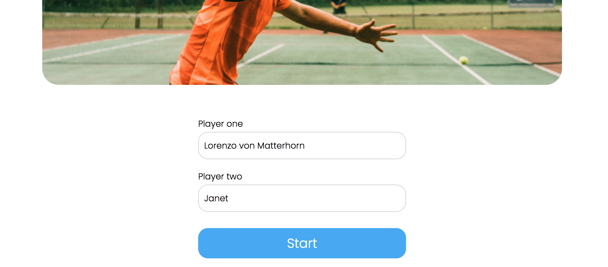
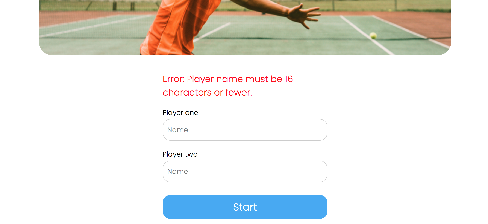
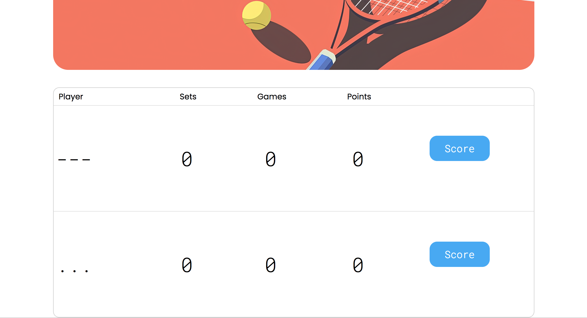
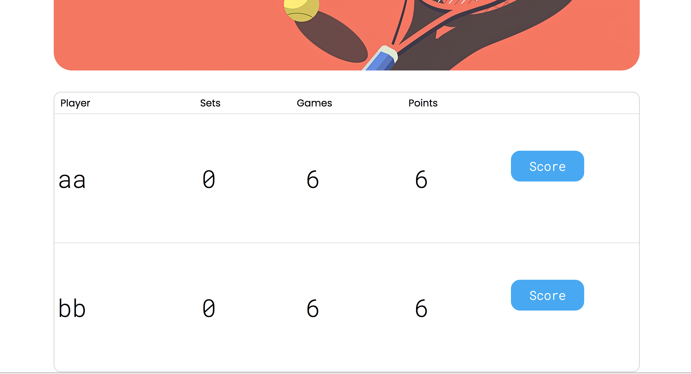
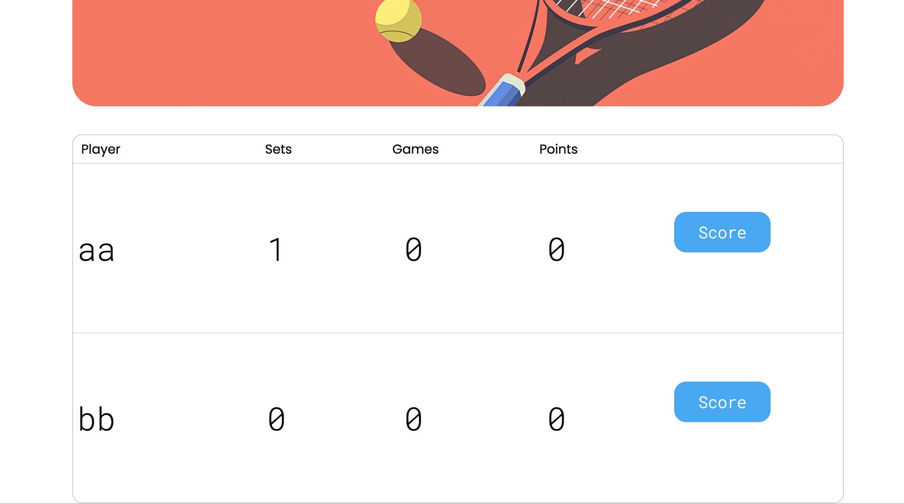
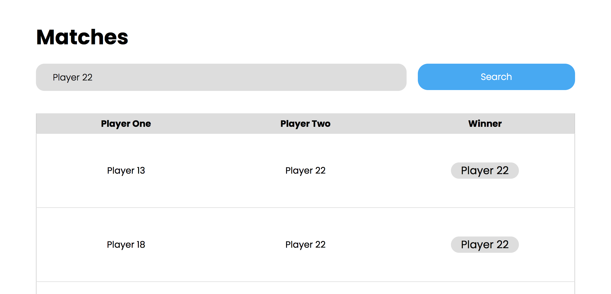
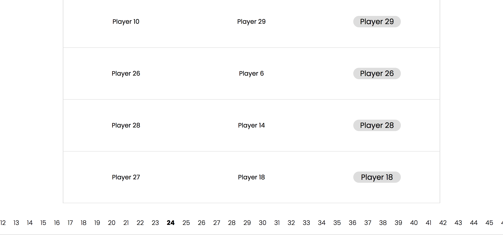

# Review на реализацию от [@chuminito](https://github.com/haushekmiva/tennis-scoreboard) проекта [Табло теннисного матча](https://zhukovsd.github.io/java-backend-learning-course/projects/tennis-scoreboard/)

> [!NOTE]
> 1. Знаком ❗️ помечены критически важные замечания, а также места нарушения ТЗ. 
> 2. Если ❗️ стоит перед заголовком, значит он относится ко всем пунктам этого раздела.
> 3. Замечания, указанные в пункте с именем пакета, относятся ко всем классам этого пакета или ко всем классам этого слоя.
> 4. Знаком 💡 помечены блоки, в которых содержится подсказка по реализации какого-то приёма или части кода.
> Такие пункты всегда находятся в сворачиваемом блоке и разворачиваются по нажатию. 
   Перед их раскрытием стоит постараться придумать или поискать решение самостоятельно. 

## Функциональный обзор

- При использовании недопустимого имени, оно не сохраняется в поле ввода и приходится заново его печатать.





При ошибке лучше оставлять текст в поле ввода — это улучшит пользовательский опыт.

- Сейчас можно создать игроков с такими именами:



Раз в проекте есть валидация, стоит добавить проверку, что в имени есть буквы и ввести другие уместные ограничения.

>[!CAUTION]
> - ❗️Победа в тай-брейке засчитывается без учёта необходимой разницы в счетё.
> 
> 
> 
> Тай-брейк выигрывает первый, кто наберёт 7 очков:
> 
> 
> 
> По правилам тенниса минимальная разница в счёте для выигрыша тай-брейка должна быть 2 очка.

- Нет кнопки сброса фильтра по имени игрока.



После фильтрации матчей должна быть возможность вернуться к полному списку, сбросив фильтр. Сейчас это можно сделать обходным путём — если очистить поле ввода имени и нажать "Search".

Лучше добавить специальную кнопку сброса фильтра.

>[!CAUTION]
> - ❗️В пагинации на странице завершённых матчей отображаются все страницы, что плохо выглядит при большом количестве страниц и делает недоступными страницы за пределами экрана.
> 
> 
> 
> Лучше сделать отображение текущей и +-2 страниц вокруг неё.

## model

- В пакете `model` смешаны классы, относящиеся к разным архитектурным слоям. В нём одновременно находятся:

  - JPA-сущности (`Player`, `Match`), которые являются частью слоя персистентности.
  - Доменные модели (`OngoingMatchScore`, `PlayerScore`, `PointDisplayState`), которые относятся к слою бизнес-логики.

Более строгим соблюдением [**Принципа разделения ответственности (Separation of Concerns)**](#soc-principle) <a id="back-from-soc-principle-to-model"></a> было бы, когда каждый пакет имел бы чёткое, единое назначение.

Лучше разделить классы по разным пакетам в соответствии с их архитектурной ролью.

>[!TIP]
> <details>
> 
> <summary><b>💡 Например, так 💡</b></summary>
> 
> ---
> 
> ```
> com.haushekmiva
> ├── model          // Пакет для "чистых" доменных моделей
> │   ├── OngoingMatchScore.java
> │   └── PlayerScore.java
> │   └── PointDisplayState.java
> │
> └── dao            // Пакет для слоя доступа к данным
>     ├── entity     // Новый вложенный пакет для JPA-сущностей
>     │   ├── Player.java
>     │   └── Match.java
>     │
>     ├── PlayerDao.java
>     └── MatchDao.java
>     └── ...
> ```
> Или можно создать пакет `entity` на одном уровне с `model`, `dao` и другими.
> 
> ---
> 
> </details>

### Player

<div align="right">

[Перейти к упоминанию в Match](#match) </div>

> [!CAUTION] 
> - ❗️Класс имеет публичный сеттер `setName(String name)`, что делает его изменяемым.
> 
> ```java
> @Entity
> public class Player {
>     // ...
>     public void setName(String name) {
>         this.name = name;
>     }
> }
> ```
> 
> Свободное изменение состояния объекта, который представляет запись в БД, может привести к рассинхронизации данных и усложнить отладку. По ТЗ и логике приложения, имя игрока является уникальным и его произвольное изменение не предполагается.
> 
> Стоит удалить метод `setName(String name)`. Для создания объекта JPA Entity внутри приложения, уже есть специальный конструктор, который принимает только поля, необходимые для создания валидного объекта (в данном случае, только `name`).

> [!CAUTION] 
> ❗️Спецификация JPA требует наличия конструктора без аргументов для создания экземпляров сущностей, однако ему не обязательно быть `public`. Когда конструктор публичный, он становится частью общедоступного API класса. Это позволяет использовать его для создания "пустых", невалидных объектов (без установки обязательных полей) в любом месте приложения, хотя он предназначен исключительно для внутреннего использования фреймворком (JPA).
>
> Хорошим подходом будет ограничить область видимости этого конструктора до `protected`. Это делает его недоступным для прямого вызова из других пакетов, но оставляет видимым для JPA и дочерних классов.
> 
> Сейчас так:
> 
> ```java
> @Entity
> public class Player {
>     // ...
>     public Player() {
>     }
>     // ...
> }
> ```
> 
> Лучше так:
> 
> ```java
> @Entity
> public class Player {
>     // ...
>     protected Player() {
>     }
>     // ...
> }
> ```

- Класс `Player` содержит три коллекции (`firstPlayerMatches`, `secondPlayerMatches`, `winnerMatches`) для реализации двунаправленной связи с сущностью `Match`. Однако эти коллекции нигде в приложении не используются.

```java
@Entity
public class Player {
    // ...
    @OneToMany(mappedBy = "firstPlayer", fetch = FetchType.LAZY)
    private List<Match> firstPlayerMatches = new ArrayList<>();

    @OneToMany(mappedBy = "secondPlayer", fetch = FetchType.LAZY)
    private List<Match> secondPlayerMatches = new ArrayList<>();

    @OneToMany(mappedBy = "winner", fetch = FetchType.LAZY)
    private List<Match> winnerMatches = new ArrayList<>();
    // ...
}
```

Эти поля и аннотации `@OneToMany` усложняют сущность, добавляя "мёртвый код". Они создают иллюзию возможности навигации от игрока к матчам, которая не реализована и не требуется по ТЗ. Поддержание двунаправленных связей требует дополнительных усилий (например, синхронизации обеих сторон отношения), а их наличие без использования может запутать других разработчиков.

Стоит удалить поля-коллекции и аннотации `@OneToMany` из класса `Player`. Однонаправленной связи `@ManyToOne` из сущности `Match` к `Player` достаточно для выполнения всех требований проекта.

- Уникальность поля `name` обеспечивается атрибутом `unique = true` в аннотации `@Column`. Хотя `unique = true` приводит к созданию уникального индекса, явное определение индекса через аннотацию `@Table` даёт больше контроля и улучшает читаемость кода. В `@Index` можно задать имя для индекса, что упрощает его администрирование в будущем, и сама аннотация явно декларирует намерение создать индекс для оптимизации поиска.

Можно добавить явное определение индекса на уровне класса.

>[!TIP]
> <details>
> 
> <summary><b>💡 Вот так 💡</b></summary>
> 
> ---
> 
> ```java
> @Entity
> @Table(name = "players", indexes = @Index(name = "idx_player_name", columnList = "name", unique = true))
> public class Player {
>     // ...
>     @Column(length = 16, nullable = false)
>     private String name;
> }
> ```
> 
> При таком подходе параметр `unique = true` из аннотации `@Column` можно удалить, так как уникальность теперь задана в `@Index`.
> 
> ---
> 
> </details>

- Если имя поля совпадает с названием колонки, то параметр name в аннотации `@Column` можно опустить.

Сейчас так:

```java
public class Player {
    // ...
    @Column(name = "name", length = 16, nullable = false, unique = true)
    String name;
    // ...
}
```

Можно так:

```java
public class Player {
    // ...
    @Column(length = 16, nullable = false, unique = true)
    String name;
    // ...
}
```

### Match

> [!CAUTION]
> - ❗️Пункт про ограничение области видимости конструктора без аргументов, описанный в разделе [Player](#player), актуален и для этого класса.

> [!CAUTION]
> - ❗️Слово `MATCHES` (а также `MATCH`) является зарезервированным ключевым словом в некоторых диалектах SQL (например, для оператора `MATCH ... AGAINST` в полнотекстовом поиске). Хотя в конкретно в этом проекте проблем с этим не возникнет, не стоит использовать зарезервированные слова в качестве имён таблиц. Это может приводить к необходимости экранировать имя таблицы в нативных SQL-запросах или к синтаксическим ошибкам в некоторых СУБД.
> 
> [**Использование зарезервированных слов в качестве названий в БД**](#sql-keywords) <a id="back-from-sql-keywords"></a>
> 
> Лучше выбирать имена, которые гарантированно не конфликтуют с зарезервированными словами. Учитывая, что в таблице хранятся только завершённые матчи, можно выбрать более описательное и безопасное имя `FINISHED_MATCHES` или более общее `TENNIS_MATCHES`.

- Риск нарушения целостности данных. Класс не имеет механизмов, которые бы гарантировали на уровне схемы базы данных выполнение ключевых бизнес-правил:

  - Игрок не может играть сам с собой (`player1` должен отличаться от `player2`).

  - Победителем (`winner`) должен быть один из участников матча (`player1` или `player2`).

Хотя логика в сервисном слое может предотвращать создание некорректных матчей, база данных этого не гарантирует. Прямой SQL-запрос или ошибка в другом модуле приложения могут привести к созданию невалидных данных (например, матч, где `player1_id = 5` и `player2_id = 5`).

Защита должна быть на всех уровнях, поэтому стоит добавить ограничения, проверяющие, что игроки разные и победителем является один из участников матча.

>[!TIP]
> <details>
> 
> <summary><b>💡 Например так 💡</b></summary>
> 
> ---
> 
> ```java
> @Entity
> @Table(name = "FINISHED_MATCHES", check = {
>         @CheckConstraint(name = "players_are_different_check", constraint = "player1 != player2"),
>         @CheckConstraint(name = "winner_is_participant_check", constraint = "winner = player1 OR winner = player2")
> })
> public class Match {
>     
> }
> ```
> 
> Что это даст:
> 
>   - Гарантирует целостность данных даже при прямом доступе к БД.
>   - Снижает риск появления невалидных данных из-за ошибок в коде или внешних вмешательств.
>   - Схема базы данных будет явно отражать бизнес-правила.
> 
> ---
> 
> </details>

> [!CAUTION]
> - ❗️Сущность `Match`, представляющая завершённый матч, имеет публичные сеттеры (`setFirstPlayer`, `setSecondPlayer`, `setWinner`), что делает её изменяемой (mutable).
> 
> ```java
> @Entity
> public class Match {
>     // ...
>     public void setSecondPlayer(Player secondPlayer) {
>         this.secondPlayer = secondPlayer;
>     }
> 
>     public void setWinner(Player winner) {
>         this.winner = winner;
>     }
> 
>     public void setFirstPlayer(Player firstPlayer) {
>         this.firstPlayer = firstPlayer;
>     }
> }
> ```
> 
> Публичные сеттеры для полей игроков и победителя дают возможность любому коду изменить игрока или победителя после создания Entity матча, что нарушает инварианты (состав игроков, а также победитель должны быть неизменяемыми после завершения матча).
> 
> Как исправить: удалить аннотацию `@Setter`. Инициализация полей должна происходить только один раз в момент создания объекта через конструктор.

- Для обязательных полей стоит добавить `optional = false` в `@ManyToOne` или `nullable = false` в `@JoinColumn` (можно добавить оба параметра). Целостность данных должна обеспечиваться на всех уровнях: в приложении (валидация) и в БД (constraints). Отсутствие ограничений в БД означает, что данные могут быть испорчены из-за ошибок в приложении или при прямом доступе к БД.

А также можно добавить атрибут `updatable = false`. Это атрибут запрещает изменять колонку после её первоначальной вставки. Игроки матча и победитель не должны меняться, поэтому эти колонки можно защитить от обновлений.

Сейчас так:

```java
@Entity
@Table(name = "matches")
public class Match {

    // ...
  
    @ManyToOne(fetch = FetchType.EAGER)
    @JoinColumn(name = "player1")
    Player firstPlayer;

    @ManyToOne(fetch = FetchType.EAGER)
    @JoinColumn(name = "player2")
    Player secondPlayer;

    @ManyToOne(fetch = FetchType.EAGER)
    @JoinColumn(name = "winner")
    Player winner;
  
    // ...
}
```

Лучше так:

```java
@Entity
@Table(name = "matches")
public class Match {
    
    // ...

    @ManyToOne(fetch = FetchType.EAGER, optional = false)
    @JoinColumn(name = "player1", nullable = false, updatable = false)
    Player firstPlayer;

    @ManyToOne(fetch = FetchType.EAGER, optional = false)
    @JoinColumn(name = "player2", nullable = false, updatable = false)
    Player secondPlayer;

    @ManyToOne(fetch = FetchType.EAGER, optional = false)
    @JoinColumn(name = "winner", nullable = false, updatable = false)
    Player winner;

    // ...
}
```

Сейчас таблица матчей создаётся так:

```postgres-sql
create table matches (
    id bigint generated by default as identity,
    player1 bigint,
    player2 bigint,
    winner bigint,
    primary key (id)
)
```

При `optional = false` или `nullable = false` — Hibernate генерирует `NOT NULL` ограничение в БД и делает проверку перед вставкой в БД (если значение поля null, то Hibernate не будет обращаться в БД для вставки и сам выбросит исключение PropertyValueException)

Будет так:

```postgres-sql
create table matches (
    id bigint generated by default as identity,
    player1 bigint not null,
    player2 bigint not null,
    winner bigint not null,
    primary key (id)
)
```

Это позволит избежать риска создания некорректных записей (например, матчи без игроков) в БД.

- Колонки игроков и победителя в `@JoinColumn` названы `player1`, `player2`, `winner`.

Для колонок, хранящих внешний ключ, уместно добавлять суффикс `_id`, чтобы было очевидно, что в них хранится идентификатор, а не какая-то другая информация.

Также вместо чисел в названиях можно использовать числительные, написанные словами. Единообразие имён между кодом и схемой БД (с поправкой на стиль: camelCase в Java, snake_case в SQL) делает код стилистически однородным.

Сейчас так:

```java
@Table(name = "matches")
public class Match {
    // ...
  
    @JoinColumn(name = "player1")
    private Player firstPlayer;

    @JoinColumn(name = "player2")
    private Player secondPlayer;

    @JoinColumn(name = "winner")
    private Player winner;
    
    // ...
}
```

Лучше так:

```java
@Table(name = "matches")
public class Match {
    // ...
  
    @JoinColumn(name = "first_player_id")
    private Player firstPlayer;

    @JoinColumn(name = "second_player_id")
    private Player secondPlayer;

    @JoinColumn(name = "winner_id")
    private Player winner;
    
    // ...
}
```

Это сделает названия колонок более идиоматичными для БД.

> [!CAUTION]
> - ❗️Поле `id` имеет тип `Long`, в то время как метод `getId()` возвращает примитивный тип `long`.
> 
> Сейчас так:
> 
> ```java
> public class Match {
>     
>     @Id
>     private Long id;
>     // ...
>   
>     public long getId() {
>         return id;
>     }
>     // ...
> }
> ```
> 
> Это приведёт к `NullPointerException`, если метод `getId()` будет вызван для нового, ещё не сохранённого в базе данных объекта (у которого `id` будет равен `null`). Произойдёт попытка автоматической распаковки `null` в `long`, что недопустимо.
> 
> Стоит изменить тип возвращаемого значения в методе `getId()` на `Long`, чтобы он соответствовал типу поля.
> 
> Вот так:
> 
> ```java
> public class Match {
>     
>     @Id
>     private Long id;
>     // ...
>   
>     public Long getId() {
>         return id;
>     }
>     // ...
> }
> ```

- Порядок аргументов в конструкторе неинтуитивен: победитель идёт первым, а игроки — в обратном порядке.

Сейчас так:

```java
public class Match {
    // ...
    public Match(Player winner, Player secondPlayer, Player firstPlayer) {
        this.winner = winner;
        this.secondPlayer = secondPlayer;
        this.firstPlayer = firstPlayer;
    }    
    // ...
}
```

Такой порядок может привести к ошибкам при вызове конструктора — можно случайно перепутать аргументы местами и создать некорректный объект. Код становится сложнее для чтения и понимания.

Лучше расположить аргументы в логичном и предсказуемом порядке.

Вот так:

```java
public class Match {
    // ...
    public Match(Player firstPlayer, Player secondPlayer, Player winner) {
        this.firstPlayer = firstPlayer;
        this.secondPlayer = secondPlayer;
        this.winner = winner;
    }    
    // ...
}
```

### OngoingMatchScore

<div align="right">

[Перейти к упоминанию в PlayerScore](#playerscore) </div>

> [!CAUTION]
> - ❗️Класс `OngoingMatchScore` — это анемичная модель. Он представляет собой просто набор полей с геттерами и сеттеро-подобными методами, не содержащий никакой значимой бизнес-логики (логики подсчёта очков).
> 
> ```java
> public class OngoingMatchScore {
>     private final PlayerScore firstPlayerScore;
>     private final PlayerScore secondPlayerScore;
>     private final Map<Long, PlayerScore> playerScores = new HashMap<>();
>     private final ArrayList<SetScores> setScores = new ArrayList<SetScores>();
>     private boolean isTieBreak = false;
>     private boolean isMatchFinished = false;
>     private Long winnerId;
>     // ...
>     
>     public void addSet(Long playerId) {
>         playerScores.get(playerId).addSet();
>     }
>     
>     public int getPlayerSets(Long playerId) {
>         return playerScores.get(playerId).getSets();
>     }    
>     
>     public void setTieBreak() {
>         this.isTieBreak = true;
>     }
> 
>     public void unsetTieBreak() {
>         this.isTieBreak = false;
>     }
> 
>     public boolean isTieBreak() {
>         return isTieBreak;
>     }
>     // ...
> }
> ```
> 
> Вся логика подсчёта очков вынесена во внешний сервисный класс (`MatchScoreCalculatorImpl`).
> 
> Почему это проблема:
> 
>   - Нарушение инкапсуляции: Любой внешний код может напрямую изменить любое поле объекта, полностью игнорируя правила тенниса. Даже каждое поле `playerScore` хотя оно и объявлено как `final`, что означает, что ему нельзя переприсвоить ссылку на другой объект `PlayerScore`, однако сам объект, на который указывает ссылка, является полностью изменяемым. Это делает состояние объекта ненадёжным.
> 
>   - Процедурный стиль: Вместо того чтобы сказать объекту `ongoingMatchScore.addPointTo(firstPlayer)`, внешний код получает его внутренние данные (объект `PlayerScore`) и изменяет их по своему усмотрению.
> 
>   ```java
>   /**
>    * В MatchScoreCalculatorImpl
>    */
>   @Override
>   public void doMove(OngoingMatchScore score, Long playerId) {
>       Long enemyPlayerId = score.getPlayerEnemyId(playerId);
> 
>       score.addPoint(playerId);
>       if (!score.isTieBreak() && score.getPlayerPoints(playerId) >= POINTS_TO_WIN_GAME) {
>           if (score.getPlayerPoints(enemyPlayerId) < POINTS_TO_WIN_GAME - 1) {
>               score.resetPoints();
>               score.addGame(playerId);
>           } else {
>               if ((score.getPlayerPoints(playerId) - score.getPlayerPoints(enemyPlayerId) == DIFFERENCE_TO_WIN_IN_DEUCE)) {
>                   score.resetPoints();
>                   score.addGame(playerId);
>               }
>           }
>       } else {
>           if (score.getPlayerPoints(playerId) == POINTS_TO_WIN_IN_TIE_BREAK) {
>               score.addSet(playerId);
>               score.saveSetHistory();
>               score.resetPoints();
>               score.resetGames();
>               score.unsetTieBreak();
>           }
>       }
> 
>       if (score.getPlayerGames(playerId) >= GAMES_TO_WIN_SET
>               && (score.getPlayerGames(playerId) - score.getPlayerGames(enemyPlayerId)) >= DIFFERENCE_TO_WIN_SET
>               && !score.isTieBreak()) {
>           score.addSet(playerId);
>           score.saveSetHistory();
>           score.resetGames();
>       } else {
>           if (score.getPlayerGames(playerId) == GAMES_TO_HAVE_TIE_BREAK
>                   && score.getPlayerGames(enemyPlayerId) == GAMES_TO_HAVE_TIE_BREAK
>                   && !score.isTieBreak()) {
>               score.setTieBreak();
>           }
>       }
> 
>       if (score.getPlayerSets(playerId) == SETS_TO_WIN_GAME) {
>           score.setWinnerId(playerId);
>           score.setMatchFinished();
>       }
>   }
>   
>   ```
> 
>   Это порождает процедурный, а не объектно-ориентированный подход. Код превращается в набор процедур, которые оперируют над объектом-держателем данных, что лишает преимуществ ООП.
> 
>   - Сложность тестирования: Чтобы протестировать логику подсчёта очков, нужно тестировать сервисы, которые её содержат, что может потребовать мокирования зависимостей. Если бы логика была внутри доменного объекта, её можно было бы тестировать в полной изоляции.
> 
> [**Анемичная vs Богатая модель предметной области**](#reach-anemic-model) <a id="back-from-reach-anemic-model"></a>
> 
> Решением будет превратить `OngoingMatchScore` в "богатую" доменную модель, инкапсулировав в нём и данные, и поведение.
> 
> <details>
> 
> <summary><b>💡 В таком духе 💡</b></summary>
> 
> ---
> 
> ```java
> // Концептуальный пример "богатой" модели
> public class OngoingMatch {
>     private final PlayerScore firstPlayerScore; // PlayerScore тоже должен быть "богатой" моделью
>     private final PlayerScore secondPlayerScore; // PlayerScore тоже должен быть "богатой" моделью
>     
>     // другие поля
>   
>     public OngoingMatch(TennisPlayer firstPlayer, TennisPlayer secondPlayer) { // TennisPlayer тоже должен быть моделью (не JPA Entity)
>         this.firstPlayerScore = new PlayerScore(firstPlayer);
>         this.secondPlayerScore = new PlayerScore(secondPlayer);
>     }
>   
>     // Публичный метод для изменения состояния
>     public void awardPointTo(TennisPlayer player) {
>         if (isFinished()) {
>             throw new MatchAlreadyFinishedException();
>         }
>     
>         PlayerScore winnerScore = getScoreFor(player);
>         PlayerScore loserScore = getOpponentScoreFor(player);
>     
>         // Вся логика подсчёта очков, геймов и сетов находится здесь
>         // Она вызывает внутренние методы winnerScore и loserScore
>     }
>   
>     // Методы, совершающие необходимую работу над полями
>   
> }
> ```
> 
> При таком подходе от сеттеров стоит избавиться, чтобы состояние счёта управлялось только явно предусмотренными для этого методами. А также стоит оставить только нужные (не раскрывающие внутреннего устройства) геттеры.
> 
> ---
> 
> </details>
> 
> Краткий чек-лист проверки успешного проектирования богатой доменной модели матча:
> 
>   - Объект сам контролирует своё состояние и не позволяет перевести себя в невалидное состояние.
> 
>   - Объектно-ориентированный дизайн: Данные и поведение, которое с ними работает, находятся вместе.
> 
>   - Простота тестирования: Можно создать экземпляр матча и протестировать всю логику игры, вызывая для начисления очков всего один метод.
> 
>   - Можно создать новый "уровень" теннисного матча с особыми правилами (например, гейм, где счёт идёт с шагом +8 очков) без изменения логики текущих классов. Суть этой проверки не в том, что в проекте понадобится такой необычный гейм, а в том, чтобы проверить и наглядно убедиться, насколько гибким и расширяемым получился дизайн.
> 
> PS: Возможно предложенный в этом пункте рефакторинг сделает неактуальными все последующие замечания, в том числе в классах других моделей, но сейчас они есть в проекте, поэтому тоже будут рассмотрены.

> [!CAUTION]
> - ❗️Класс имеет публичные методы `resetPoints()` и `resetGames()`. 
> 
> ```java
> public void resetPoints() {
>     firstPlayerScore.resetPoints();
>     secondPlayerScore.resetPoints();
> }
> 
> public void resetGames() {
>     firstPlayerScore.resetGames();
>     secondPlayerScore.resetGames();
> }
> ```
> 
> Это позволяет любому внешнему сервису в любой момент сбросить очки игроков, что является небезопасным и нарушает инкапсуляцию. Сброс очков должен быть внутренней операцией, происходящей в строго определённый момент (например, после выигрыша гейма), и эта логика должна быть инкапсулирована внутри доменной модели, а не вызываться извне.
> 
> В "богатой" доменной модели подобные методы (если они в ней понадобятся) должны быть `private` и вызываться, например, из метода вычисления счёта, который бы находился в этом же классе.
> 
> Ещё более удачным подходом было бы не обнулять счёт гейма или сета, а создавать новый объект нужного уровня, при завершении предыдущего.

- Класс хранит в полях `isMatchFinished` и `winnerId` данные, которые являются производными от основного состояния (счёта по сетам).

```java
public class OngoingMatchScore {
    // ...
    private boolean isMatchFinished = false;  
    private Long winnerId;
    // ...
}
```

Это нарушает принцип [**Принцип Единого источника истины (Single Source of Truth, SSOT)**](#ssot-principle) <a id="back-from-ssot-principle-to-ongoingmatchscore"></a>. Источником истины является счёт. Флаг `isMatchFinished` и `winnerId` — это лишь следствие. Хранение производных данных создаёт риск рассинхронизации: можно изменить счёт, но забыть обновить флаг, и объект окажется в неконсистентном состоянии.

Лучше удалить поля `isMatchFinished` и `winnerId` вместе с их сеттерами и заменить их методами, которые вычисляют результат на лету.

> [!TIP]
> <details>
> 
> <summary><b>💡 Например, так 💡</b></summary>
> 
> ---
> 
> ```java
> public boolean isMatchFinished() {
>     return getWinnerId().isPresent();
> }
> 
> public Optional<Long> getWinnerId() {
>     if (getFirstPlayerSets() == MIN_SET_POINT_TO_WIN) {
>         return Optional.of(getFirstPlayerId());
>     }
>     if (getSecondPlayerSets() == MIN_SET_POINT_TO_WIN) {
>         return Optional.of(getSecondPlayerId());
>     }
>     return Optional.empty();
> }
> ```
> 
> Так состояние объекта всегда будет консистентным, так как оно будет вычисляться из единственного источника истины.
> 
> ---
> 
> </details>

- Метод `getSetScores()` возвращает прямую ссылку на внутренний, изменяемый `ArrayList`.

```java
public class OngoingMatchScore {
    // ...
    private final ArrayList<SetScores> setScores = new ArrayList<SetScores>();
    // ...
    public ArrayList<SetScores> getSetScores() {
        return setScores;
    }
    // ...
}
```

Это нарушает инкапсуляцию. Любой внешний код может получить этот список и изменить его (например, через `.add()`, `.clear()` и другие методы), повредив внутреннее состояние `OngoingMatchScore`. Объект перестаёт контролировать свои данные.

Как исправить: Всегда возвращать либо неизменяемое представление, либо защищённую копию коллекции. Также в сигнатуре метода и в типе переменной следует использовать интерфейс (`List`), а не конкретную реализацию (`ArrayList`). И использовать "diamond operator" (`... = new ArrayList<>()` вместо `... = new ArrayList<SetScores>()`) при создании коллекций — компилятор может сам вывести тип из переменной слева.

```java
public class OngoingMatchScore {
    // ...
    private final List<SetScores> setScores = new ArrayList<>();
    // ...
    public List<SetScores> getSetScores() {
        return List.copyOf(setScores); 
    }
    // ...
}
```

- Класс хранит ссылки на объекты `PlayerScore` и в двух отдельных полях (`firstPlayerScore`, `secondPlayerScore`), и в `Map` (`playerScores`).

```java
public class OngoingMatchScore {
    private final PlayerScore firstPlayerScore;
    private final PlayerScore secondPlayerScore;  
    private final Map<Long, PlayerScore> playerScores = new HashMap<>();
    // ...
    public OngoingMatchScore(Long firstPlayerId, String firstPlayerName, Long secondPlayerId, String secondPlayerName) {

        this.firstPlayerScore = new PlayerScore(firstPlayerId, firstPlayerName);
        this.secondPlayerScore = new PlayerScore(secondPlayerId, secondPlayerName);

        playerScores.put(firstPlayerId, firstPlayerScore);
        playerScores.put(secondPlayerId, secondPlayerScore);

    }
    // ...
}
```

Это избыточно и приводит к ненужному усложнению кода (нужно поддерживать в актуальном состоянии оба хранилища) и небольшому увеличению потребления памяти.

Как исправить: Оставить только один способ хранения. Хотя `Map<Long, PlayerScore>` является более гибким решением, использование `Map` для двух предопределённых, фиксированных ключей (`firstPlayerId` и `secondPlayerId`) является излишним усложнением (over-engineering). `Map` подразумевает динамическое количество ключей, но в теннисе всегда ровно два игрока (или две стороны), поэтому лучше оставить только два отдельных поля.

- Конструктор принимает четыре параметра (`firstPlayerId`, `firstPlayerName`, `secondPlayerId`, `secondPlayerName`), которые представляют собой две логические группы "игрок".

```java
public class OngoingMatchScore {
    // ...
    public OngoingMatchScore(Long firstPlayerId, String firstPlayerName, Long secondPlayerId, String secondPlayerName) {
        // ...
    }
    // ...
}
```

Это "запах кода" [Data Clump](https://martinfowler.com/bliki/DataClump.html). Он делает сигнатуру конструктора длинной и менее выразительной, а также повышает риск ошибки (можно перепутать `id` и `name` разных игроков).

Стоит создать доменный объект `TennisPlayer` (например, `record`) и передавать в конструктор два объекта этого типа вместо четырёх примитивов.

> [!TIP]
> <details>
> 
> <summary><b>💡 Вот так 💡</b></summary>
> 
> ---
> 
> ```java
> public record TennisPlayer(
>         Long id, 
>         String name
> ) {
> }
> 
> public class OngoingMatchScore {
>     // ...
>     public OngoingMatchScore(TennisPlayer firstPlayer, TennisPlayer secondPlayer) {
>         // ...
>     }
>     // ...
> }
> ```
> 
> Так код будет оперировать понятиями предметной области (`TennisPlayer`), а не набором разрозненных данных.
> 
> ---
> 
> </details>

- Метод `getPointDisplayState` возвращает `enum`, который используется исключительно для логики отображения в `MatchMapper`.

```java
/**
 * В OngoingMatchScore
 */
public PointDisplayState getPointDisplayState() {
    int p1 = firstPlayerScore.getPoints();
    int p2 = secondPlayerScore.getPoints();

    if (isTieBreak) {
        return PointDisplayState.TIE_BREAK;
    }

    if (p1 >= 3 && p2 >= 3) {
        if (p1 == p2) return PointDisplayState.DEUCE;
        if (p1 > p2) return PointDisplayState.ADVANTAGE_FIRST;
        return PointDisplayState.ADVANTAGE_SECOND;
    }

    return PointDisplayState.NORMAL;
}

/**
 * В MatchMapper
 */
default String getPlayerPoints(OngoingMatchScore score, PlayerNumbers playerNumber) {
    // ...
    PointDisplayState pointDisplayState = score.getPointDisplayState();
    // ...
    return switch (pointDisplayState) {
        case NORMAL -> ...
        case DEUCE -> ...
        case ADVANTAGE_FIRST -> ...
        case ADVANTAGE_SECOND -> ...
        case TIE_BREAK -> ...
    };
}
```

Таким образом, доменный объект `OngoingMatchScore` начинает неявно содержать логику, относящуюся к слою представления.

Это нарушает разделение слоёв. Доменная модель должна содержать только бизнес-логику и состояние, но не должна заботиться о том, как это состояние будет выглядеть на экране.

Как исправить: Удалить метод `getPointDisplayState` из этого класса. Всю логику по определению состояния для отображения следует перенести в маппер, который преобразует доменную модель в DTO.

- В методе `getPointDisplayState` используются однобуквенные имена переменных `p1` и `p2`.

Это снижает читаемость кода. Разработчику приходится догадываться, что `p1` — это "очки первого игрока", что создаёт лишнюю когнитивную нагрузку.

Лучше использовать полные, описательные имена.

```java
int firstPlayerPoints = firstPlayerScore.getPoints();
int secondPlayerPoints = secondPlayerScore.getPoints();
```

- Метод `getPointDisplayState` использует число `3` для определения, достиг ли счёт в гейме стадии "deuce" или "advantage".

```java
if (p1 >= 3 && p2 >= 3) {
    // ...
}
```

Число `3` — это "магическое число". Его смысл (оно соответствует `40` очкам в анемичной модели `PlayerScore`) не очевиден без знания внутренней реализации. Если правила изменятся или логика будет пересмотрена, придётся искать и заменять это число по всему коду.

Лучше (в текущей реализации) заменить магическое число на именованную константу, которая объясняет его смысл.

```java
private static final int POINTS_FOR_DEUCE = 3;

public PointDisplayState getPointDisplayState() {
    // ...
    if (p1 >= POINTS_FOR_DEUCE && p2 >= POINTS_FOR_DEUCE) {
        // ...
    }
    // ...
}
```

PS: Более удачным решением было бы избавиться от `int` для очков в пользу специального `enum`, что полностью устранило бы эту проблему.

- В некоторых методах используются `if/else` без фигурных скобок для однострочных выражений.

Тело блока `if/else` лучше всегда оборачивать в фигурные скобки. Хотя синтаксис Java позволяет этого не делать, данная практика является небезопасной (например, при добавлении новой строки кода в такой блок легко забыть добавить скобки, и новая строка будет выполняться всегда, а не по условию) и нарушает [конвенцию по стилю кода](https://www.oracle.com/java/technologies/javase/codeconventions-statements.html#449). Она может привести к трудноуловимым ошибкам.

- Когда в блоке `if` происходит выход из метода (`return`, `throw`), то остальной код можно писать без блока `else`.

Сейчас так:

```java
public Long getPlayerEnemyId(Long playerId) {
    if (Objects.equals(firstPlayerScore.getPlayerId(), playerId)) {
        return secondPlayerScore.getPlayerId();
    } else { // добавил фигурные скобки
        return firstPlayerScore.getPlayerId();
    }
}
```

Если условие `if` истинно, выполнение метода прерывается. Следовательно, код после `if` будет выполнен только в том случае, если условие ложно — дополнительный `else` для этого не нужен.

Лучше так:

```java
public Long getPlayerEnemyId(Long playerId) {
    if (Objects.equals(firstPlayerScore.getPlayerId(), playerId)) {
        return secondPlayerScore.getPlayerId();
    }
    return firstPlayerScore.getPlayerId();
}
```

Это уменьшает вложенность и улучшает читаемость кода.

- Поля `boolean isTieBreak` и `boolean isMatchFinished` отражают разные состояния матча. Для этой цели (обозначения несовместимых значений) лучше подходит перечисление, например такое:

```java
public enum OngoingMatchStage {
    REGULAR,
    TIEBREAK,
    FINISHED;
}
```

Использование отдельных `boolean` флагов вместо перечислений для представления взаимоисключающих состояний — плохая практика. Это не защищает от невалидных комбинаций, например, когда `isMatchFinished = true` и `isTieBreak = true` одновременно.

Enum делает код более выразительным и гарантирует, что матч будет находиться только в одном из допустимых состояний.

Более продвинутым и удачным в некоторых подобных случаях решением может быть реализация паттерна "Состояние" (State).

- Метод `getPlayerEnemyId` некорректно обрабатывает случай, когда ему передаётся `id` игрока, не участвующего в матче. В такой ситуации он по умолчанию вернёт `id` первого игрока.

```java
public Long getPlayerEnemyId(Long playerId) {
    if (Objects.equals(firstPlayerScore.getPlayerId(), playerId)) {
        return secondPlayerScore.getPlayerId();
    } else return firstPlayerScore.getPlayerId();
}
```

Метод не выполняет своего контракта (вернуть ID оппонента) и тихо возвращает неверные данные. Это может привести к непредсказуемым последствиям в вызывающем коде (например, очки будут начислены не тому игроку). Программа должна падать быстро (по принципу fail-fast) при обнаружении невалидных входных данных. Поэтому стоит добавить явную проверку для второго игрока и выбрасывать исключение, если переданный `id` не принадлежит ни одному из участников матча.

> [!TIP]
> <details>
> 
> <summary><b>💡 Вот так 💡</b></summary>
> 
> ---
> 
> ```java
> public Long getOpponentId(Long playerId) { // Переименовал для ясности
>     Long firstPlayerId = firstPlayerScore.getPlayerId();
>     Long secondPlayerId = secondPlayerScore.getPlayerId();
> 
>     if (Objects.equals(playerId, firstPlayerId)) {
>         return secondPlayerId;
>     }
>     if (Objects.equals(playerId, secondPlayerId)) {
>         return firstPlayerId;
>     }
>     throw new IllegalArgumentException("Player with id " + playerId + " is not in this match.");
> }
> ```
> 
> Так ошибки в логике вызывающего кода будут обнаруживаться немедленно, а не приводить к скрытому повреждению состояния.
> 
> ---
> 
> </details>

> [!CAUTION]
> - ❗️`OngoingMatchScore` отвечает за слишком многое: он хранит ссылки на объекты счёта каждого игрока (`PlayerScore`), хранит историю сетов (`setScores`), отслеживает текущее состояние матча (`isTieBreak`, `isMatchFinished`) и хранит ID победителя (`winnerId`). Это нарушает Принцип единой ответственности и превращает его в "божественный объект".
> 
> Как исправить: Выполнить декомпозицию.
> 
> <details>
> 
> <summary><b>💡 Вот одна из идей 💡</b></summary>
> 
> ---
> 
> `OngoingMatchScore` (можно переименовать его в `TennisMatch`) должен быть на вершине иерархии и делегировать ответственность другим объектам. Например, он может содержать список объектов `TennisSet`, каждый из которых содержит список объектов `TennisGame`. Это сделает архитектуру чище и позволит каждому классу отвечать только за свою часть логики.
> 
> ---
> 
> </details>

> [!CAUTION]
> - ❗️`OngoingMatchScore` и содержащиеся в нём `PlayerScore` оперируют `Long playerId`. Этот `id` является первичным ключом из таблицы `Players` в базе данных. Таким образом, деталь реализации слоя персистентности "протекает" в доменную модель, создавая между этими слоями нежелательную связь.
> 
> Как исправить: В доменном слое лучше использовать не ID из базы данных, а доменные объекты и их собственные уникальные идентификаторы. Для идентификации игрока внутри доменной логики достаточно его уникального имени.
> 
> <details>
> 
> <summary><b>💡 Например, так 💡</b></summary>
> 
> ---
> 
> ```java
> public record TennisPlayer(
>         String name
> ) {
> }
> 
> public class OngoingMatchScore {
>     // ...
>     public OngoingMatchScore(TennisPlayer firstPlayer, TennisPlayer secondPlayer) {
>         // ...
>     }
> }
> ```
> 
> Так граница между доменной логикой и слоем данных станет более чёткой. 
> 
> Преобразование из JPA-сущности `Player` в `TennisPlayer` должно происходить на границе сервисного слоя.
> 
> ---
> 
> </details>

> [!CAUTION]
> - ❗️Доменный объект `OngoingMatchScore` в методе `saveSetHistory` сам создаёт DTO `SetScores`.
> 
> ```java
> public void saveSetHistory() {
>     if (!isTieBreak) {
>         setScores.add(new SetScores(firstPlayerScore.getGames(), secondPlayerScore.getGames()));
>     } else setScores.add(new SetScores(firstPlayerScore.getPoints(), secondPlayerScore.getPoints()));
> }
> ```
> 
> Это нарушение принципа разделения слоёв. Доменный слой (где находится `OngoingMatchScore`) не должен ничего знать о существовании и структуре объектов для передачи данных (DTO). Его задача — содержать "чистую" бизнес-логику и состояние. Когда доменный объект начинает создавать DTO, он становится зависимым от слоя представления/передачи данных.
> 
> Как исправить: Разделить эти ответственности.
> 
>   - Доменный объект `OngoingMatchScore` должен хранить историю счёта в своих собственных, внутренних объектах (богатых моделях теннисного сета), а не в DTO.
>   - Логика преобразования внутреннего представления истории счёта в `List<SetScores>` (список DTO) должна находиться в маппере и выполняться в тот момент, когда эти данные понадобятся для передачи во View.

### PlayerScore

- Пункты про:

> [!CAUTION]
>   - ❗️Анемичную модель

> [!CAUTION]
>   - ❗️Предоставление публичных методов для обнуления и изменения счёта

> [!CAUTION]
>   - ❗️Использование ID из БД в доменных моделях

  - Передачу в конструктор разрозненных данных об одной сущности

  - Вынесение магических чисел в константы

описанные в разделе [OngoingMatchScore](#ongoingmatchscore), актуальны и для этого класса.

> [!CAUTION]
> - ❗️Для представления теннисных очков используется примитивный тип `int point`. А метод `addPoint()` просто увеличивает значение этого поля на 1, что не соответствует правилам тенниса.
> 
> ```java
> public class PlayerScore {
>     // ...
>     private int point = 0;  
>     // ...
>     public void addPoint() {
>         this.point += 1;
>     }
>     // ...
> }
> ```
> 
> Тип `int` не отражает семантику теннисного счёта (0, 15, 30, 40, AD). Это заставляет писать логику преобразования `int` в строковое представление (`"40"`, `"AD"`) в слое отображения (`MatchMapper`). Кроме того, `int` позволяет хранить невалидные значения (например, -5 или 100), что снижает надёжность модели.
> 
> Как исправить: Заменить `int` на более выразительный тип — `enum`, который будет инкапсулировать все возможные состояния очков и логику перехода между ними.
> 
> <details>
> 
> <summary><b>💡 Например, так 💡</b></summary>
> 
> ---
> 
> ```java
> public enum TennisPoint {
>     LOVE("0"),
>     FIFTEEN("15"),
>     THIRTY("30"),
>     FORTY("40"),
>     ADVANTAGE("AD");
> 
>     private final String value;
> 
>     TennisPoint(String value) {
>         this.value = value;
>     }
> 
>     public TennisPoint next() {
>         if (this == ADVANTAGE) {
>             throw new IllegalStateException("Has no points after ADVANTAGE.");
>         }
>         return values()[ordinal() + 1];
>     }
> 
>     public String value() {
>         return value;
>     }
> }
> ```
> 
> Так модель станет более выразительной, типобезопасной и надёжной и упростится логика в других частях приложения.
> 
> ---
> 
> </details>

> [!CAUTION]
> - ❗️`PlayerScore` нарушает Принцип единственной ответственности, так как он отвечает за хранение счёта сразу на трёх разных уровнях: очки (`point`), геймы (`game`) и сеты (`set`).
> 
> Поля внутри класса не всегда используются вместе (например, при подсчёте очков в гейме поля `game` и `set` не нужны). Такой класс сложнее для понимания и поддержки. Изменение правил подсчёта геймов может случайно затронуть логику, связанную с сетами.
> 
> Как исправить: Разделить ответственность между несколькими классами, отражающими иерархию тенниса.
> 
> <details>
> 
> <summary><b>💡 В таком духе 💡</b></summary>
> 
> ---
> 
> ```java
> // Концептуальный пример
> 
> // Отвечает только за очки в гейме
> public class GameScore {
>     private TennisPoint points;
> }
> 
> // Отвечает за геймы в сете и содержит текущий GameScore
> public class SetScore {
>     private int games;
>     private GameScore currentGame;
> }
> 
> // Отвечает за сеты в матче и содержит текущий SetScore
> public class MatchScore {
>     private int sets;
>     private SetScore currentSet;
> }
> ```
> 
> При таком подходе архитектура станет более чистой, гибкой и масштабируемой. Каждый класс будет иметь одну, чётко определённую зону ответственности. Логику каждого уровня (гейм, сет, матч) можно будет тестировать и изменять независимо.
> 
> ---
> 
> </details>

- Внешний сервис `MatchScoreCalculatorImpl` постоянно "спрашивает" у `PlayerScore` его состояние (`getPoints()`, `getGames()`), а затем на основе полученных данных принимает решение, какой метод-мутатор (`addGame()`, `resetPoints()`) вызвать. Это пример нарушения принципа "Tell, Don't Ask".

>[!TIP]
> **Tell, Don't Ask (Говори, не спрашивай)** — принцип ООП, который призывает объекты к выполнению действий над своими собственными данными, а не к запросу этих данных для последующей обработки извне. Это помогает инкапсулировать поведение и данные внутри объекта, уменьшая связанность и делая систему более гибкой и расширяемой.

Рефакторинг в сторону "богатой" доменной модели автоматически решит эту проблему.

### PointDisplayState

- Существование `enum PointDisplayState` — это симптом "Примитивной одержимости" (Primitive Obsession) в классе `PlayerScore`, где для хранения теннисных очков используется `int`. Поскольку `int` не несёт в себе информации о состояниях "ровно" или "больше", понадобился этот дополнительный `enum`, чтобы описать, как интерпретировать и отображать этот `int`.

Это усложняет архитектуру. Вместо одной выразительной доменной концепции ("теннисное очко") существуют две: примитивный `int` в `PlayerScore` и `enum PointDisplayState` в `OngoingMatchScore`. Вся логика по их связыванию и преобразованию вынесена вовне — в класс `MatchMapper`, который содержит большую `switch`-конструкцию. Это делает `MatchMapper` излишне сложным, а `PointDisplayState` — "анемичным".

Как исправить: Отказаться от `int` для хранения очков и ввести `enum`, который будет представлять само очко. И необходимость в `enum PointDisplayState` скорее всего полностью отпадёт.

- `PointDisplayState` смешивает в себе две разные концепции: состояние счёта внутри обычного гейма (`NORMAL`, `DEUCE`, `ADVANTAGE_FIRST`, `ADVANTAGE_SECOND`) и совершенно другой режим игры (`TIE_BREAK`).

```java
public enum PointDisplayState {
    NORMAL,
    DEUCE,
    ADVANTAGE_FIRST,
    ADVANTAGE_SECOND,
    TIE_BREAK
}
```

Тай-брейк — это не просто одно из состояний счёта, это другой набор правил для всего гейма.

В общем случае, для более строгого следования Принципу единственной ответственности (SRP), можно было бы разделить эти понятия. Здесь же рефакторинг классов в сторону "богатой" доменной модели должен автоматически решить эту проблему.

### SetScores

- `SetScores` — это `record`, который является простым неизменяемым контейнером для данных. Его роль — это DTO (Data Transfer Object). При этом он находится в пакете `model`, который предназначен для доменных моделей, содержащих бизнес-логику.

Это создаёт путаницу и нарушает принцип разделения слоёв. Разработчик, глядя на пакет `model`, ожидает увидеть там "богатые" доменные объекты, а не простые структуры для передачи данных. Смешение разных по своей роли классов в одном пакете делает архитектуру менее очевидной и понятной.

Стоит переместить `SetScores` в специальный пакет `dto`. А класс богатой доменной модели матча вместо DTO `SetScores` должен содержать тоже богатую модель объекта, представляющего сет в теннисном матче.

> [!CAUTION]
> - ❗️Класс нарушает Принцип единой ответственности (SRP) и используется для представления двух семантически разных сущностей: счёта в обычном сете (где результат — это геймы) и счёта в тай-брейке (где результат — это очки). 
> 
> ```java
> /**
>  * В OngoingMatchScore
>  */
> public void saveSetHistory() {
>     if (!isTieBreak) {
>         setScores.add(new SetScores(firstPlayerScore.getGames(), secondPlayerScore.getGames()));
>     } else setScores.add(new SetScores(firstPlayerScore.getPoints(), secondPlayerScore.getPoints()));
> }
> ```
> 
> Из-за этого класс `SetScores` имеет две причины для изменения, а его данные становятся неоднозначными. Потребитель этого объекта не может быть уверен, что именно означают числа в полях, не зная внешнего контекста (был ли это тай-брейк).
> 
> Как исправить: Разделить этот `record` на два отдельных, с явными именами и полями.
> 
> <details>
> 
> <summary><b>💡 Вот так 💡</b></summary>
> 
> ---
> 
> ```java
> // Для результата обычного сета
> public record RegularSetScore(
>         int firstPlayerGames,
>         int secondPlayerGames
> ) {
> }
> 
> // Для результата тай-брейка
> public record TieBreakScore(
>         int firstPlayerPoints,
>         int secondPlayerPoints
> ) {
> }
> ```
> 
> ---
> 
> </details>

- Поля названы `firstPlayerResult` и `secondPlayerResult`. Имя `*Result` является слишком общим и не даёт понимания, в каких единицах он измеряется. Это прямое следствие проблемы, описанной в предыдущем пункте: пришлось выбрать общее имя, чтобы оно подходило и для геймов, и для очков.

Как исправить: После разделения на два разных `record`-а, поля можно будет назвать конкретно и понятно: `firstPlayerGames` в одном и `firstPlayerPoints` в другом.

## dto

### MatchInformation

- Имя `MatchInformation` является очень общим. Оно описывает "информацию о матче", но не говорит, для чего именно она предназначена.

Общее имя создаёт путаницу. Имена классов должны как можно точнее отражать их единственную ответственность.

Стоит дать `record`-у более конкретное имя, отражающее его назначение. Поскольку он используется для создания нового матча в `ongoingMatchRepository`, ему подойдут имена `NewMatchDto` или `CreateMatchDto`.

>[!CAUTION]
> - ❗️Класс передаёт идентификаторы из базы данных (`playerId`) в доменный объект `OngoingMatchScore`.
> 
> Это нарушает принцип разделения слоёв. Доменный слой, который отвечает за бизнес-логику, не должен ничего знать о том, как данные хранятся в базе данных, включая их первичные ключи. Его должны интересовать только бизнес-идентификаторы. Согласно техническому заданию, уникальным идентификатором игрока является его имя.
> 
> Стоит изменить `MatchInformation` и конструктор `OngoingMatchScore` так, чтобы они принимали только те данные, которые необходимы для доменной логики — имена игроков или доменные модели игроков.
> 
> Сейчас так:
> 
> ```java
> public record MatchInformation(
>         Long firstPlayerId,
>         String firstPlayerName,
>         Long secondPlayerId,
>         String secondPlayerName
> ) {
> }
> ```
> 
> Лучше так:
> 
> ```java
> public record CreateMatchDto(
>         String firstPlayerName,
>         String secondPlayerName
> ) {
> }
> ```

### MatchParticipantIds

>[!CAUTION]
> - ❗️Класс передаёт идентификаторы из базы данных (`playerId`) в DTO (хотя сейчас это скорее объект-параметр) `MatchInformation`.
> 
> При переходе на использование в доменных моделях только имён игроков, необходимость в этом классе исчезнет.

### OngoingMatchScoreDto

>[!CAUTION]
> - ❗️Класс содержит поля `firstPlayerId` и `secondPlayerId`, которые являются внутренними идентификаторами из базы данных. Эти `id` передаются на сторону клиента и вставляются в HTML-форму.
> 
> Хотя в этом проекте это не представляет большой угрозы, вообще раскрытие внутренних идентификаторов базы данных является потенциальной уязвимостью.
> 
> Стоит отказаться от передачи и использования этих полей во View.

- Сейчас все поля, относящиеся к игроку (`firstPlayerPoints`, `firstPlayerGames`, `firstPlayerSets` и др), дублируются для первого и второго игрока. 

```java
public record OngoingMatchScoreDto(
        String firstPlayerId,
        String firstPlayerName,
        String firstPlayerPoints,
        String firstPlayerGames,
        String firstPlayerSets,
        String secondPlayerId,
        String secondPlayerName,
        String secondPlayerPoints,
        String secondPlayerGames,
        String secondPlayerSets
) {
}
```

Это признак того, что в классе отсутствует важная абстракция. Из-за этого класс становится большим и громоздким и нарушает принцип DRY (Don't Repeat Yourself). А также, если понадобится добавить новое поле к счету игрока (например, количество эйсов), придётся добавить два поля (`firstPlayerAces`, `secondPlayerAces`).

Все данные, относящиеся к счёту одного игрока, логически связаны между собой, поэтому можно сгруппировать их в отдельный класс.

Например, такой:

```java
public record PlayerScoreDto(
        String firstPlayerName,
        String firstPlayerPoints,
        String firstPlayerGames,
        String firstPlayerSets,
) {
}
```

Тогда класс упростится до:

```java
public record OngoingMatchScoreDto(
    PlayerScoreDto firstPlayerScore,
    PlayerScoreDto secondPlayerScore) {
}
```

### FinishedMatchDto

- Класс содержит поле `PlayerNumbers winnerNumber`, которое является непрямым указателем на победителя (`PlayerNumbers` — это `enum`, который просто кодирует "первый" или "второй" игрок), а не готовыми к отображению данными.

Уникальное по ТЗ имя игрока позволяет также точно идентифицировать его, как и присвоенный номер. Поэтому нет необходимости создавать и использовать дополнительные абстракции (`enum PlayerNumbers`).

Можно заменить поле `PlayerNumbers winnerNumber` на `String winnerName`.

- Поле `setScores` объявлено с конкретным типом реализации `ArrayList<SetScores>`, а не с интерфейсом `List<SetScores>`.

```java
public record FinishedMatchDto(
        // ...
        ArrayList<SetScores> setScores
) {
}
```

Это является нарушением подхода "программировать на интерфейс, а не на реализацию". Публичный контракт DTO становится жёстко привязан к конкретной реализации `ArrayList`. Если в будущем по какой-либо причине потребуется использовать другую реализацию `List` (например, `LinkedList` или неизменяемый список, возвращаемый `List.of()`), придётся изменять сигнатуру `record`-а. Это может затронуть весь код, который с ним работает.

Лучше всегда использовать наиболее общий подходящий интерфейс в качестве типа для полей, параметров и возвращаемых значений.

Вот так:

```java
public record FinishedMatchDto(
        // ...
        List<SetScores> setScores
) {
}
```

Так внутренняя реализация списка сможет меняться без изменения публичного контракта DTO. Это стандартная лучшая практика в Java.

- Класс содержит поле `ArrayList<SetScores> setScores`. Хотя `record` по своей природе неизменяем (его поля являются `final`), сам `ArrayList` является изменяемым объектом.

Любой код, получивший ссылку на этот `record`, может изменить его внутреннее состояние, вызвав, например, `dto.setScores().add(new SetScores(1,1))` или `dto.setScores().clear()`. Это нарушает гарантии неизменяемости, которые ожидаются от `record`-а, и может привести к непредсказуемым побочным эффектам.

Чтобы сделать `record` по-настоящему неизменяемым, можно создавать защитную копию изменяемых объектов (таких как коллекции) в конструкторе.

> [!TIP]
> <details>
> 
> <summary><b>💡 Вот так 💡</b></summary>
> 
> ---
> 
> ```java
> public record FinishedMatchDto(
>         String firstPlayerName,
>         String secondPlayerName,
>         PlayerNumbers winnerNumber,
>         List<SetScores> setScores // Тип изменён на интерфейс List
> ) {
>     public FinishedMatchDto {
>         setScores = List.copyOf(setScores);
>     }
> }
> ```
> 
> ---
> 
> </details>

### FinishedMatchSearchDto

>[!CAUTION]
> - ❗️DTO, предназначенный для слоя представления, содержит поле `List<Match>`, где `Match` — это JPA-сущность из слоя персистентности.
> 
> ```java
> public record FinishedMatchSearchDto(
>         int pageCount,
>         int currentPage,
>         int prevPage,
>         int nextPage,
>         String playerName,
>         List<Match> matches
> ) {
> }
> ```
> 
> Почему это проблема:
> 
>   - Это нарушение принципа разделения слоёв.
>   - Слой представления (View) становится напрямую зависимым от структуры таблиц в базе данных. Изменение в `Match` (например, переименование поля) может сломать JSP страницу.
>   - Если бы у сущности `Match` или у связанных с ней `Player` были лениво загружаемые поля (что является стандартной практикой для оптимизации), попытка доступа к ним на JSP странице (где сессия Hibernate уже закрыта) привела бы к падению приложения с ошибкой `LazyInitializationException`.
>   - Сущность `Match` может содержать технические поля или связи, не предназначенные для отображения. Передача всей сущности целиком создаёт риск утечки лишних данных.
> 
> Как исправить: Никогда не передавать JPA-сущности за пределы сервисного слоя. Вместо этого необходимо создать специальный, "плоский" DTO для представления одного матча в списке и выполнять преобразование из `Match` в этот DTO на уровне сервиса или маппера.
> 
> Все поля в DTO тоже должны быть DTO или примитивными/простыми типами.

-  Сейчас для создания `FinishedMatchSearchDto` используется отдельный класс `FinishedMatchSearchDtoFactory`. Паттерн "Фабрика" здесь применён для инкапсуляции логики создания объекта (вычисления `prevPage` и `nextPage`). Это хорошо разделяет ответственности и соответствует SRP на уровне классов: `FinishedMatchSearchDto` остаётся чистым контейнером данных, а `Factory` занимается его конструированием.

Альтернативный вариант через статический фабричный метод здесь был бы тоже допустим.

> [!TIP]
> <details>
> 
> <summary><b>💡 Вот так 💡</b></summary>
> 
> ---
> 
> Логику можно было бы поместить в статический метод внутри самого `record`-а.
> 
> ```java
> public record FinishedMatchSearchDto(
>         int pageCount,
>         int currentPage,
>         int prevPage,
>         int nextPage,
>         String playerName,
>         List<Match> matches
> ) {
> 
>     private static final int MIN_PAGE_NUMBER = 1;
> 
>     public static FinishedMatchSearchDto of(int pageNumber, int pageCount, String playerName, List<Match> matches) {
>         int prevPage = Math.max(pageNumber - 1, MIN_PAGE_NUMBER);
>         int nextPage = Math.min(pageNumber + 1, pageCount);
> 
>         return new FinishedMatchSearchDto(
>                 pageCount,
>                 pageNumber,
>                 prevPage,
>                 nextPage,
>                 playerName,
>                 Collections.unmodifiableList(matches)
>         );
>     }
> }
> ```
> 
> ---
> 
> </details>

### MoveResult

- Класс содержит поле `score` типа `OngoingMatchScore` — это внутренний объект доменной модели, который содержит состояние и (в идеале) поведение. `MoveResult` передаёт этот объект из сервисного слоя (`OngoingMatchOrchestrator`) в слой контроллеров (`MatchScoreServlet`).

Это является нарушением принципа разделения слоёв.

  - Контроллер (`MatchScoreServlet`) становится зависимым от внутренней реализации доменной модели. Если класс `OngoingMatchScore` изменится, возможно придётся менять и код сервлета.
  - `OngoingMatchScore` может содержать множество полей и методов, которые не нужны сервлету для его работы. Сервлету нужны только данные для отображения.
  - Передача изменяемого доменного объекта на верхние слои создаёт риск, что его состояние будет случайно изменено не тем компонентом, который за это отвечает.

Вместо этого класс должен содержать "плоский" DTO, специально предназначенный для отображения, например, `OngoingMatchScoreDto`. Преобразование из `OngoingMatchScore` в `OngoingMatchScoreDto` должно происходить внутри сервисного слоя.

Все поля в DTO тоже должны быть DTO или примитивными/простыми типами.

### dto.factory.FinishedMatchSearchDtoFactory

>[!CAUTION]
> - ❗️Фабрика принимает в качестве аргумента `List<Match>` (где `Match` является JPA-сущностью) и передаёт его напрямую в конструктор `FinishedMatchSearchDto`.
> 
> ```java
> public final class FinishedMatchSearchDtoFactory {
>     // ...
>     public static FinishedMatchSearchDto buildFinishedMatchSearchDto(
>             int pageNumber,
>             int pageCount,
>             String playerName,
>             List<Match> matches) {
> 
>         // ...
> 
>         return new FinishedMatchSearchDto(
>                 // ...
>                 matches
>         );
>     }
> }
> ```
> 
> Это закрепляет и продолжает архитектурную ошибку, связанную с нарушением слоёв. Фабрика, как компонент, отвечающий за создание DTO, должна была бы взять на себя ответственность за преобразование (маппинг) доменных объектов или сущностей в "плоские" DTO, безопасные для передачи в слой представления.

- Логика создания `FinishedMatchSearchDto` вынесена в отдельный класс-фабрику.

Для простой логики, как в данном случае (вычисление `prevPage` и `nextPage`), создание отдельного класса может быть избыточным.

Можно поместить фабричную логику в статический метод внутри самого `record`-а `FinishedMatchSearchDto`.

- Логика вычисления `prevPage` и `nextPage` реализована через тернарные операторы.

```java
int prevPage = (pageNumber <= 1) ? pageNumber : pageNumber - 1;
int nextPage = (pageNumber >= pageCount) ? pageNumber : pageNumber + 1;
```

Можно сделать этот код чуть более читаемым и лаконичным, используя стандартные функции `Math.max` и `Math.min`.

Вот так:

```java
int prevPage = Math.max(1, pageNumber - 1);
int nextPage = Math.min(pageNumber, pageNumber + 1);
```

- Метод `buildFinishedMatchSearchDto` не выполняет валидацию своих входных параметров, в частности `pageNumber` и `pageCount`.

```java
public static FinishedMatchSearchDto buildFinishedMatchSearchDto(
        int pageNumber,
        int pageCount,
        String playerName,
        List<Match> matches) {

    int prevPage = (pageNumber <= 1)
            ? pageNumber
            : pageNumber - 1;

    int nextPage = (pageNumber >= pageCount)
            ? pageNumber
            : pageNumber + 1;

    return new FinishedMatchSearchDto(
            pageCount,
            pageNumber,
            prevPage,
            nextPage,
            playerName,
            matches
    );
}
```

Это нарушает принцип "защитного программирования". Метод слепо доверяет вызывающему коду. Если ему на вход придут некорректные данные (например, `pageNumber = -5` или `pageCount = -10`), он создаст DTO с бессмысленными и нелогичными значениями (`prevPage`, `nextPage`), что может привести к трудноуловимым ошибкам в слое представления (View). Утилитарные методы и фабрики должны быть максимально надёжными и не должны полагаться на то, что их всегда будут вызывать правильно.

Стоит добавить в начало метода блок проверки входящих параметров. Если данные не проходят проверку, метод должен сообщать об ошибке, выбрасывая подходящее исключение.

- Логика вычисления `nextPage` в `FinishedMatchSearchDtoFactory` является ненадёжной и в пограничных случаях может привести к созданию DTO с неконсистентным состоянием.

В сценарии, когда общее количество страниц (`pageCount`) равно `0`, а запрошенный номер страницы (`pageNumber`) больше нуля (например, `5`), текущая логика `(pageNumber >= pageCount) ? pageNumber : pageNumber + 1` вернёт `nextPage = 5`. В результате будет создан объект с логически противоречивым состоянием: `currentPage=5`, `pageCount=0`, `nextPage=5`. Пятая страница не может существовать, если их всего ноль. Фабрика, как создатель объектов, не должна допускать создания экземпляров в невалидном состоянии, даже если вызывающий код в данный момент отфильтровывает такие случаи.

Стоит использовать более надёжную и декларативную логику с `Math.min` и `Math.max`, которая корректно обрабатывает все крайние случаи, включая `pageCount = 0`.

```java
public static FinishedMatchSearchDto buildFinishedMatchSearchDto(
        int pageNumber,
        int pageCount,
        String playerName,
        List<Match> matches) {

    // Math.max гарантирует, что prevPage никогда не будет меньше 1.
    int prevPage = Math.max(1, pageNumber - 1);

    // Math.min гарантирует, что nextPage никогда не будет больше pageCount.
    int nextPage = Math.min(pageNumber + 1, pageCount);

    return new FinishedMatchSearchDto(
            pageCount,
            pageNumber,
            prevPage,
            nextPage,
            playerName,
            matches
    );
}
```

## dao

### HibernateDao

<div align="right">

[Перейти к упоминанию в PlayerHibernateDao](#playerhibernatedao) </div>

<div align="right">

[Перейти к упоминанию в MatchHibernateDao](#matchhibernatedao) </div>

>[!CAUTION]
> - ❗️Класс использует `sessionFactory.openSession()` для получения сессии.
> 
> ```java
> public Long save(T entity) {
>     // ...
>     try (Session session = sessionFactory.openSession()) {
>         // ...
>     }
> }
> 
> public T getReferenceById(ID id) {
>     try (Session session = sessionFactory.openSession()) {
>         // ...
>     }
> }
> ```
> 
> Это ведёт к антипаттерну "Session-per-Operation" ("сессия на операцию"), который имеет два критических недостатка:
> 
>   - Низкая производительность: Создание объекта `Session` в Hibernate — это относительно "дорогая" операция. Она включает в себя получение соединения с базой данных из пула, инициализацию кэшей и тд. Создавать и уничтожать сессию при каждом вызове метода DAO неэффективно и создаёт лишнюю нагрузку.
> 
>   - Невозможность управления транзакциями: Самое главное — этот подход делает невозможным объединение нескольких операций DAO в одну бизнес-транзакцию. Например, если сервису нужно сохранить двух игроков, каждый вызов `playerDao.save()` будет выполнен в отдельной, независимой транзакции. Если второй вызов не удастся, первый уже будет закоммичен, что нарушает атомарность бизнес-операции и приводит к несогласованности данных.
> 
> Один из вариантов исправления — перейти на паттерн "Session-per-Request" ("сессия на запрос"). Его суть в том, что одна сессия Hibernate используется всеми сервисами и DAO на протяжении всей обработки HTTP-запроса.
> 
> <details>
> 
> <summary><b>💡 Вот как это можно реализовать 💡</b></summary>
> 
> ---
> 
> Использовать `getCurrentSession()` (`sessionFactory.getCurrentSession()`) — этот метод возвращает сессию текущего контекста. Так в одном потоке (HTTP-запросе) будет использоваться одна и та же сессия. В этом случае закрытие сессии будет происходить автоматически (даже без try-with-resources).
> 
> Для получения сессии через `getCurrentSession()` в `hibernate.cfg.xml` уже есть свойство `hibernate.current_session_context_class`.
> 
> ```xml
> <property name="hibernate.current_session_context_class">thread</property>
> ```
> 
> ---
> 
> </details>

- Метод `save` использует `session.save()` (помеченный, как устаревший с Hibernate 6.0) и возвращает `Long`, а не саму сущность.

```java
public abstract class HibernateDao<T, ID extends Serializable> {
    // ...
    
    public Long save(T entity) {
        // ...
        try (...) {
            // ...
            Long id = (Long) session.save(entity);
            // ...
            return id;
        }
        // ...
    }
    
    // ...
}
```

  - Использование `session.save()` не рекомендуется в современных версиях Hibernate. Альтернатива этому — использовать метод `persist()`. 
  - Возврат `Long` вместо `T` делает метод менее удобным для вызывающего кода, которому может понадобиться полный объект после сохранения (например, с уже сгенерированным ID и другими полями).

Лучше перейти на стандартный JPA-метод `session.persist()` и изменить сигнатуру метода так, чтобы он возвращал сохранённую сущность.

```java
public abstract class HibernateDao<T, ID extends Serializable> {
    // ...
    
    public T save(T entity) {
        // ...
        try (...) {
            // ...
            session.persist(entity);
            // ...
            return entity;
        }
        // ...
    }
    
    // ...
}
```

>[!CAUTION]
> - ❗️Перед откатом транзакции в блоке catch в методе `save()` стоит добавить проверку, что она активна
> 
> Сейчас так:
> 
> ```java
> if (transaction != null) {
>     transaction.rollback();
> }
> ```
> 
> Лучше так:
> 
> ```java
> if (transaction != null && transaction.isActive()) {
>     transaction.rollback();
> }
> ```
> 
> иначе вызов `transaction.rollback()` может привести к исключению IllegalStateException.

>[!CAUTION]
> - ❗️В блоке `catch` вызов `transaction.rollback()` не обёрнут в `try-catch`.
> 
> ```java
> public abstract class HibernateDao<T, ID extends Serializable> {
>     // ...
>     
>     public Long save(T entity) {
>         // ...
>         try (...) {
>             // ...
>         } catch (HibernateException e) {
>             if (transaction != null) {
>                 transaction.rollback();
>             }
>             log.error("Failed to save {} entity", entity.getClass().getSimpleName(), e);
>             throw new DataAccessException("An error occurred while saving entity.", e);
>         }
>     }
>     
>     // ...
> }
> ```
> 
> Если во время отката транзакции произойдёт ещё одно исключение (например, из-за проблем с сетевым соединением с БД), это новое исключение "замаскирует" исходную ошибку, которая инициировала откат. В логах останется только ошибка отката, и разработчик не сможет узнать, что послужило первопричиной сбоя, что сильно усложняет отладку.
> 
> Стоит обернуть `transaction.rollback()` в собственный блок `try-catch` и, в случае ошибки, добавить новое исключение к исходному с помощью `originalException.addSuppressed(rollbackException)`.
> 
> <details>
> 
> <summary><b>💡 Например, так 💡</b></summary>
> 
> ---
> 
> ```java
> public Long save(T entity) {
>     // ...
>     try (...) {
>         // ...
>     } catch (HibernateException e) {
>         safeRollback(transaction, e);
>         
>         log.error("Failed to save {} entity", entity.getClass().getSimpleName(), e);
>         throw new DataAccessException("An error occurred while saving entity.", e);
>     }
> }
> 
> private void safeRollback(Transaction transaction, Exception originalException) {
>     if (transaction != null && transaction.isActive()) {
>         try {
>             transaction.rollback();
>         } catch (Exception rollbackException) {
>             originalException.addSuppressed(rollbackException);
>         }
>     }
> }
> ```
> 
> ---
> 
> </details>

- Метод `getSessionFactory()` объявлен как `public`, делая фабрику сессий доступной для любого класса в приложении, работающего с DAO.

Сейчас так:

```java
public abstract class HibernateDao<T, ID extends Serializable> {
    // ...
    public SessionFactory getSessionFactory() {
        return sessionFactory;
    }    
}
```

Это нарушает инкапсуляцию слоя доступа к данным. `SessionFactory` — это низкоуровневый компонент, и внешние слои не должны ничего о нём знать и иметь возможность получить его из DAO. 

Стоит изменить модификатор доступа на `protected`. Это позволит дочерним классам DAO в том же пакете использовать фабрику, но скроет её от остального приложения.

Лучше так:

```java
public abstract class HibernateDao<T, ID extends Serializable> {
    // ...
    protected SessionFactory getSessionFactory() {
        return sessionFactory;
    }    
}
```

>[!CAUTION]
> - ❗️Метод `save` самостоятельно управляет транзакцией:
> 
> ```java
> public abstract class HibernateDao<T, ID extends Serializable> {
>     // ...
>     
>     public Long save(T entity) {
>         Transaction transaction = null;
>         try (...) {
>             transaction = session.beginTransaction();
>             // ...
>             transaction.commit();
>             // ...
>         } catch (HibernateException e) {
>             if (transaction != null) {
>                 transaction.rollback();
>             }
>             // ...
>         }
>     }
>     
>     // ...
> }
> ```
> 
> DAO не должен решать, когда начинать и заканчивать транзакцию. Его ответственность — только выполнение операций с данными. Транзакция должна охватывать всю бизнес-операцию целиком, которая может состоять из нескольких вызовов DAO. Например, если сервис должен сохранить двух игроков, а второй `save` упадёт с ошибкой, первый игрок уже будет сохранён в своей отдельной транзакции, что нарушит атомарность.
> 
> Лучше перенести управление транзакциями из методов DAO в сервисный слой, который будет оборачивать вызовы методов DAO в одну транзакцию.

>[!CAUTION]
> - ❗️Обобщённый (generic) класс `HibernateDao<T, ID>` в методе `save` жёстко прописывает возвращаемый тип `Long` и выполняет приведение к нему: `(Long) session.save(entity)`.
> 
> Это ломает обобщённость класса. Такой DAO сможет работать только с сущностями, у которых `id` имеет тип `Long`. Если появится сущность с `id` типа `UUID`, этот метод вызовет `ClassCastException`.
> 
> Изменение метода `save` так, чтобы он возвращал сохранённую сущность вместо ID исправит эту проблему.

- Чтобы избежать дублирования шаблонного кода создания сессии (`Session session = sessionFactory.openSession()`) (или получения текущей сессии после рефакторинга на паттерн "сессия-на-запрос": `Session session = sessionFactory.getCurrentSession();`) можно добавить в базовый класс метод, который будет инкапсулировать логику получения текущей сессии.

> [!TIP]
> <details>
> 
> <summary><b>💡 Вот так 💡</b></summary>
> 
> ---
> 
> ```java
> public abstract class HibernateDao<T, ID extends Serializable> {
>     private final SessionFactory sessionFactory;
> 
>     // ...
> 
>     protected Session getSession() {
>         return sessionFactory.getCurrentSession();
>     }
> }
> ```
> 
> В дочерних классах будет так
> 
> ```java
> public class PlayerHibernateDao extends HibernateDao<Player, Long> implements PlayerDao {
>     
>     public Optional<Player> findByName(String name) {
>         // ...
>         return getSession().createQuery("...", Player.class)
>                 .setParameter(...)
>                 .uniqueResultOptional();
>     }
> }
> ```
> 
> ---
> 
> </details>

### PlayerDao

- Метод `save(Player entity)` возвращает `Long`, то есть только идентификатор созданной сущности.

Хотя это и даёт основную необходимую информацию, это не всегда удобно. Более гибкой практикой является возврат самой сохранённой сущности. А также позволит использовать общий параметризованный класс DAO.

Сейчас так:

```java
public interface PlayerDao {
    // ...
    Long save(Player entity);
    // ...
}
```

Лучше так:

```java
public interface PlayerDao {
    // ...
    Player save(Player entity);
    // ...
}
```

### PlayerHibernateDao

<div align="right">

[Перейти к упоминанию в MatchHibernateDao](#matchhibernatedao) </div>

>[!CAUTION]
> - ❗️Пункт про переход на паттерн "сессия на запрос", описанный в разделе [HibernateDao](#hibernatedao), актуален и для этого класса.

- Для визуального разделения запросов на строки лучше использовать текстовые блоки

Вместо этого:

```java
"FROM Player p WHERE p.name = :name"
```

Лучше так:

```java
"""
FROM Player p 
WHERE p.name = :name
"""
```

Текст запроса удобнее читать, когда он логично разбит на строки, даже если он короткий.

- Текст HQL-запроса `"FROM Player p WHERE p.name = :name"` жёстко закодирован внутри метода `findByName` и является "магической строкой" (неназванным строковым литералом).

```java
public Optional<Player> findByName(String name) {
    // ...
    Query<Player> query = session.createQuery(
                    "FROM Player p WHERE p.name = :name", Player.class);
    // ...
}
```

"Магические строки" в коде — источник ошибок. В них легко допустить опечатку, которую компилятор не сможет проверить. Также, если такой же запрос понадобится в другом месте, его придётся скопировать, что приведёт к дублированию. При изменении сущности придётся искать и исправлять все такие строки вручную.

Лучше вынести текст запроса в `private static final` константу и дать ей понятное имя.

```java
private static final String FIND_BY_NAME_HQL = """
        FROM Player p 
        WHERE p.name = :name
        """;
```

Когда запросы собраны в одном месте, их легко найти и изменить, а также снижается риск опечаток и исключается дублирование этой части кода. Даже если сейчас запрос только один, стоит придерживаться этого подхода.

- Имя именованного параметра `:name` используется как "магическая строка" в двух местах: в HQL-запросе и в вызове метода `.setParameter("name", name)`.

Это создаёт неявную связь между двумя строковыми литералами. Если нужно будет переименовать параметр в HQL-запросе (например, с `:name` на `:playerName`), можно забыть обновить его в вызове метода `.setParameter()`. Компилятор такую ошибку не поймает, и она проявится только во время выполнения в виде исключения, что усложнит отладку.

Можно вынести имя параметра в `private static final` константу с осмысленным именем и использовать её в обоих местах.

> [!TIP]
> <details>
> 
> <summary><b>💡 Вот так 💡</b></summary>
> 
> ---
> 
> ```java
> public class PlayerHibernateDao extends HibernateDao<Player, Long> implements PlayerDao {
> 
>     private static final String NAME_PARAM = "name";
>     
>     private static final String FIND_BY_NAME_HQL = """
>             FROM Player p
>             WHERE p.name = :""" + NAME_PARAM;
> 
>     // ...
> 
>     public Optional<Player> findByName(String name) {
>         // ...
>         Query<Player> query = session.createQuery(FIND_BY_NAME_HQL, Player.class);
>         query.setParameter(NAME_PARAM, name);
>         // ...
>     }
> }
> ```
> 
> ---
> 
> </details>

- В методе `findByName` для поиска одного объекта используется метод `query.list()`, который всегда создаёт список, даже если результат один или его нет вовсе.

Сейчас так:

```java
public Optional<Player> findByName(String name) {
    try (Session session = super.getSessionFactory().openSession()) {

        Query<Player> query = session.createQuery(
                "FROM Player p WHERE p.name = :name", Player.class);

        query.setParameter("name", name);

        List<Player> players = query.list();
        if (players.isEmpty()) {
            return Optional.empty();
        } else return Optional.of(players.get(0));
    } catch (HibernateException e) {
        log.error("Failed to find Player by name: {}", name, e);
        throw new DataAccessException(e);
    }
}
```

Это неэффективно и многословно. Создаётся лишний объект-коллекция, а коду приходится вручную проверять, пуста ли она.

Вместо этого лучше использовать метод `uniqueResultOptional()`, который специально предназначен для таких случаев. Он сразу возвращает `Optional`, что идеально соответствует сигнатуре метода `findByName`.

> [!TIP]
> <details>
> 
> <summary><b>💡 Вот так 💡</b></summary>
> 
> ---
> 
> Также тело метода можно записать лаконичнее. API для построения запросов в Hibernate спроектирован как "текучий" (fluent), где каждый метод настройки возвращает сам объект, позволяя выстраивать вызовы в цепочку.
> 
> ```java
> public Optional<Player> findByName(String name) {
>     try {
>         return getSession().createQuery(FIND_BY_NAME_HQL, Player.class)
>                 .setParameter(NAME_PARAM, name)
>                 .uniqueResultOptional();
>     } catch (HibernateException e) {
>         log.error("Failed to find Player by name: {}", name, e);
>         throw new DataAccessException(e);
>     }
> }
> ```
> 
> ---
> 
> </details>

- Метод `findByName` реализует метод из интерфейса `PlayerDao`, но не помечен аннотацией `@Override`.

Аннотация `@Override` в Java используется для указания, что метод переопределяет метод суперкласса или реализует метод интерфейса.

Хотя её указание не является обязательным, стоит всегда это делать. Так другие разработчики сразу видят, что метод предназначен для реализации интерфейса (или переопределения родительского метода). А также это будет соответствовать общепринятому подходу.

## MatchDao

- Методам интерфейса можно дать более стандартные имена, а также удалить избыточный инфикс `Match`/`Matches` (этот контекст понятен из названия интерфейса и типа возвращаемого значения метода).

`getMatchCount` —> `count`

`getMatchCountByPlayerName` —> `countByPlayerName`

`fetchMatchesSubset` —> `findAll`

`fetchMatchesSubsetByPlayerName` —> `findAllByPlayerName`

Интерфейс станет более идиоматичным, чистым и интуитивно понятным для любого Java-разработчика, знакомого со стандартными паттернами (DAO/Repository). Также можно переименовать параметр `count` в `limit` для большего соответствия общепринятому подходу.

Сейчас так:

```java
public interface MatchDao {
    Long getMatchCount();

    Long getMatchCountByPlayerName(String playerName);

    List<Match> fetchMatchesSubset(int offset, int count);

    List<Match> fetchMatchesSubsetByPlayerName(int offset, int count, String playerName);

    Long save(Match entity);
}
```

Можно так:

```java
public interface MatchDao {
    Long count();

    Long countByPlayerName(String playerName);

    List<Match> findAll(int offset, int limit);

    List<Match> findAllByPlayerName(String playerName, int offset, int limit);

    Long save(Match entity);
}
```

### MatchHibernateDao

>[!CAUTION]
> - ❗️Пункт про переход на паттерн "сессия на запрос", описанный в разделе [HibernateDao](#hibernatedao), актуален и для этого класса.

- Пункты про:
  - Использование текстовых блоков для написания HQL запросов
  - Вынесение HQL запросов в константы
  - Вынесение в константы именованного параметра

описанные в разделе [PlayerHibernateDao](#playerhibernatedao), актуальны и для этого класса.

- Ключевые слова в тексте HQL-запросов (`from`, `where`) написаны в нижнем регистре. Хотя это и не влияет на работоспособность, написание ключевых слов SQL/HQL в верхнем регистре (`UPPERCASE`) является общепринятым стандартом. Это значительно улучшает читаемость запросов, так как визуально отделяет синтаксические конструкции языка от имён сущностей и полей.

Сейчас так:

```java
"from Match e where e.firstPlayer.name like :name or e.secondPlayer.name like :name"
```

Лучше так:

```java
"""
FROM Match e
WHERE e.firstPlayer.name LIKE :name OR e.secondPlayer.name LIKE :name
"""
```

>[!CAUTION]
> - ❗️Логика подсчёта матчей по имени игрока и логика выборки этих матчей — разные.
>   - `getMatchCountByPlayerName` ищет матчи, где игрок является победителем: `e.winner.name like :name`.
>   - `fetchMatchesSubsetByPlayerName` ищет матчи, где игрок является одним из участников: `e.firstPlayer.name like :name or e.secondPlayer.name like :name`.
> 
> ```java
> @Override
> public Long getMatchCountByPlayerName(String playerName) {
>     try (...) {
>         return session.createQuery("select count(e) from Match e where e.winner.name like :name", Long.class)
>                 .setParameter("name", "%" + playerName + "%")
>                 .uniqueResult();
>     } catch (HibernateException e) {
>         // ...
>     }
> }
> 
> @Override
> public List<Match> fetchMatchesSubsetByPlayerName(int offset, int count, String playerName) {
>     try (...) {
>         return session.createQuery("FROM Match e WHERE e.firstPlayer.name LIKE :name OR e.secondPlayer.name LIKE :name"
>                         , Match.class)
>                 .setParameter("name", "%" + playerName + "%")
>                 .setFirstResult(offset)
>                 .setMaxResults(count)
>                 .list();
>     }
>     // ...
> }
> ```
> 
> Пагинация будет работать некорректно. Например, если у игрока 10 матчей, но он выиграл только 2, метод подсчёта вернёт `2`, а на странице будет показан список из 10 матчей. Пользователь увидит "Страница 1 из 1", но на самом деле матчей может быть на несколько страниц.
> 
> Как исправить: Привести логику в обоих методах к единой и правильной — поиск по участию в матче.
> 
> ```java
> @Override
> public Long getMatchCountByPlayerName(String playerName) {
>     try (...) {
>         return session.createQuery("SELECT count(e) FROM Match e WHERE e.firstPlayer.name LIKE :name OR e.secondPlayer.name LIKE :name", Long.class)
>                 .setParameter("name", "%" + playerName + "%")
>                 .uniqueResult();
>     } catch (HibernateException e) {
>         // ...
>     }
> }
> ```

## service

### PlayerResolverImpl

>[!CAUTION]
> - ❗Race condition в методе `getOrCreateId()`: метод реализует логику "проверить наличие, затем создать" (`check-then-act`).
> 
> ```java
> private Long getOrCreateId(String playerName) {
>     Optional<Player> playerRaw = playerDao.findByName(playerName);
> 
>     if (playerRaw.isPresent()) {
>         return playerRaw.get().getId();
>     }
> 
>     Player player = new Player(playerName);
>     return playerDao.save(player);
> }
> ```
> В многопоточной среде (то есть на любом веб-сервере) этот подход не является потокобезопасным. Если два пользователя одновременно пытаются создать матч с новым игроком, например, `"Новак Джокович"`, то может произойти следующее:
> 
> Шаг 1: Поток 1 вызывает `playerDao.findByName("Новак Джокович")`. Ничего не находит, `playerRaw.isPresent()` равен `false`.
> 
> Шаг 2: Поток 2 в тот же самый момент времени вызывает `playerDao.findByName("Новак Джокович")`. Тоже ничего не находит, `playerRaw.isPresent()` равен `false`.
> 
> Шаг 3: Поток 1 создаёт объект `Player` и вызывает `playerDao.save(player)`. Игрок успешно сохраняется в БД.
> 
> Шаг 4: Поток 2 также создаёт второй объект `Player` и пытается вызвать `playerDao.save(player)`.
> 
> Шаг 5: В результате база данных выбрасывает исключение `ConstraintViolationException`, так как игрок с таким именем уже существует. Это исключение не обрабатывается, и второй пользователь видит неинформативную страницу от томката с ошибкой `500 Internal Server Error`.
> 
> Вместо этого стоит сразу пытаться сохранить игрока и обрабатывать исключение от БД, если игрок уже существует.
> 
> <details>
> 
> <summary><b>💡 Вот так 💡</b></summary>
> 
> ---
> 
> Использовать обратный, потокобезопасный подход: сразу пытаться сохранить нового игрока. Если такой игрок уже существует, база данных вернёт ошибку, которую можно перехватить и в блоке `catch` выполнить повторный поиск уже существующего игрока. При этом важно убедиться, что обрабатывается именно ошибка нарушения уникальности, а не любая ошибка базы данных.
> 
> ```java
> private Long getOrCreateId(String playerName) {
>     try {
>         Player newPlayer = new Player(playerName);
>         return playerDao.save(newPlayer);
>     } catch (DataAccessException e) {
>         if (isConstraintViolation(e)) {
>             return playerDao.findByName(playerName)
>                     .map(Player::getId)
>                     .orElseThrow(() -> new IllegalStateException("Player not found after a constraint violation for name: " + playerName, e));
>         }
>         throw e;
>     }
> }
> 
> /**
>  * Вспомогательный метод для проверки всей цепочки исключений 
>  * на наличие ConstraintViolationException.
>  */
> private boolean isConstraintViolation(Throwable throwable) {
>     Throwable cause = throwable;
>     while (cause != null) {
>         if (cause instanceof ConstraintViolationException) {
>             return true;
>         }
>         cause = cause.getCause();
>     }
>     return false;
> }
> ```
> 
> Так реализация станет потокобезопасной и более надёжной. Она будет корректно обрабатывать состояние гонки, и при этом не будет маскировать другие, действительно непредвиденные проблемы с базой данных, позволяя им быть обработанными на более высоком уровне.
> 
> ---
> 
> </details>

>[!CAUTION]
> - ❗️Операция "получить или создать" в вызовах `getOrCreateId` из `getPlayerIds` не является атомарной. Она состоит из двух отдельных обращений к базе данных (чтение, а затем, возможно, запись), которые в текущей архитектуре выполняются в разных транзакциях.
> 
> Вся бизнес-операция "получить ID двух участников" должна выполняться как единое, неделимое целое. Отсутствие единой транзакции усугубляет проблему "состояния гонки" и в более сложных сценариях могло бы привести к неконсистентному состоянию данных. Сервисный слой — это подходящее место, для управления транзакциями.
> 
> Весь публичный метод `getPlayerIds` лучше выполнять в рамках одной транзакции.

### OngoingMatchOrchestrator

>[!CAUTION]
> - ❗️Метод `processMove` в качестве идентификатора игрока использует `Long playerId`, который является первичным ключом из таблицы базы данных.
> 
> Из-за этого сервис бизнес-логики становится зависимым от деталей реализации слоя данных (`dao`). В идеале этот сервис должен оперировать только понятиями предметной области (домена). В этом проекте, согласно ТЗ, уникальным бизнес-идентификатором игрока является его имя, поэтому лучше использовать именно его, вместо `id` из таблицы.
> 
> Сейчас так:
> 
> ```java
> public interface OngoingMatchOrchestrator {
>     MoveResult processMove(UUID matchUuid, Long playerId);
> }
> ```
> 
> Лучше так:
> 
> ```java
> public interface OngoingMatchOrchestrator {
>     MoveResult processMove(UUID matchUuid, String playerName);
> }
> ```

### OngoingMatchOrchestratorImpl

- Код метода `processMove` можно записать чуть лаконичнее.

Сейчас так:

```java
@Override
public MoveResult processMove(UUID matchUuid, Long playerId) {
    OngoingMatchScore ongoingMatchScore = ongoingMatchRepository.getMatch(matchUuid);

    matchScoreCalculator.doMove(ongoingMatchScore, playerId);

    if (!ongoingMatchScore.isMatchFinished()) {
        return new MoveResult(false, ongoingMatchScore);
    } else {
        finishedMatchPersistence.saveFinishedMatch(ongoingMatchScore);
        ongoingMatchRepository.removeMatch(matchUuid);
        return new MoveResult(true, ongoingMatchScore);
    }
}
```

Можно так:

```java
@Override
public MoveResult processMove(UUID matchUuid, Long playerId) {
    OngoingMatchScore ongoingMatchScore = ongoingMatchRepository.getMatch(matchUuid);

    matchScoreCalculator.doMove(ongoingMatchScore, playerId);
        
    boolean matchFinished = ongoingMatchScore.isMatchFinished();
    if (matchFinished) {
        finishedMatchPersistence.saveFinishedMatch(ongoingMatchScore);
        ongoingMatchRepository.removeMatch(matchUuid);
    }

    return new MoveResult(matchFinished, ongoingMatchScore);
}
```

>[!CAUTION]
> - ❗️Метод `processMove` в случае завершения матча выполняет две критически важные операции, изменяющие состояние системы: `finishedMatchPersistence.saveFinishedMatch(...)` и `ongoingMatchRepository.removeMatch(...)`. Эти две операции не выполняются атомарно.
> 
> Если `saveFinishedMatch` успешно завершится, а `removeMatch` по какой-то причине выбросит исключение, система придёт в неконсистентное состояние: матч будет одновременно и в списке завершённых, и в списке текущих. Вся бизнес-операция "завершить матч" должна быть атомарной: либо все её части выполняются успешно, либо все изменения откатываются.
> 
> Весь метод `processMove` стоит выполнять в рамках одной транзакции.

### MatchScoreCalculator

- Интерфейс назван `MatchScoreCalculator`. Слово "калькулятор" обычно подразумевает компонент, который выполняет вычисления и возвращает результат, не изменяя входные данные. Однако его метод `doMove` возвращает `void` и работает исключительно через побочные эффекты (модификацию переданного объекта `score`).

Возникает семантический конфликт между названием и контрактом. Разработчик, видя имя `Calculator`, ожидает одного поведения (безопасные вычисления), а получает другое (неявное изменение состояния). Это нарушает [**Принцип наименьшего удивления (Principle of Least Astonishment, POLA)**](#pola) <a id="back-from-pola"></a>.

Если компонент предназначен для изменения состояния, ему больше подошло бы имя `MatchScoreUpdater` или `MatchStateMutator`.

После рефакторинга в сторону богатых доменных моделей, необходимость в этом интерфейсе и его реализации исчезнет.

### MatchScoreCalculatorImpl

> Многие пункты, относящиеся к этому классу, исправятся или потеряют смысл после проведения рефакторинга классов моделей и перехода к "богатой" доменной модели. Но так как некоторые рекомендации могут быть полезны и вне этого класса, они тоже будут описаны.

>[!CAUTION]
> - ❗️Класс `MatchScoreCalculatorImpl` содержит в себе всю бизнес-логику по подсчёту очков, геймов и сетов. Объект, которым он оперирует (`OngoingMatchScore`), является "анемичной" моделью — простым контейнерами данных практически без специфичного для бизнес-логики собственного поведения. Сервис напрямую читает и записывает его поля.
> 
> Это главная архитектурная проблема этой части логики. По этим причинам:
> 
>   - Нарушение инкапсуляции: Данные (в `OngoingMatchScore`) и поведение (в `MatchScoreCalculatorImpl`) полностью разделены. Любой другой сервис может так же напрямую изменить счёт матча, и объект `OngoingMatchScore` не сможет себя защитить.
> 
>   - Процедурный стиль: Вместо объектно-ориентированного подхода, где объекты сами управляют своим состоянием (и начисление очков происходит в духе `ongoingMatchScore.pointWonBy(player)`), получается процедурный код, который манипулирует внешними структурами данных.
> 
>   - Жёсткая связанность (Tight Coupling) и низкая связность (Low Cohesion): Сервис тесно связан с внутренним устройством `OngoingMatchScore`. При этом логика, относящаяся к одному понятию (счёт), размазана по разным классам (моделям и сервису).
> 
>   - Сложность тестирования: Чтобы протестировать один конкретный сценарий (например, переход от "ровно" к "преимуществу"), нужно разбираться во многоступенчатой логике `if-else`. Это сложно и хрупко.
> 
> Как исправить: Провести рефакторинг классов моделей с переходом к "богатой" доменной модели.

- Метод сервиса (`doMove`) изменяет состояние объекта (`OngoingMatchScore`), переданного ему в качестве параметра.

```java
@Override
public void doMove(OngoingMatchScore score, Long playerId) {
    // ...
    score.addPoint(playerId);
    if (...) {
        if (...) {
            score.resetPoints();
            score.addGame(playerId);
        } else {
            // ...
        }
    } else {
        // ...
    }

    // ...
}
```

Это является побочным эффектом (side effect). В сложных системах отслеживание таких неявных мутаций становится источником трудноуловимых ошибок. Более предсказуемым является функциональный подход, когда метод не меняет исходный объект, а возвращает новый с изменённым состоянием.

В этом проекте проблема исчезнет сама после рефакторинга доменных моделей.

- Метод `doMove` содержит глубокую вложенность `if-else` конструкций, достигающую 3-х уровней.

```java
@Override
public void doMove(OngoingMatchScore score, Long playerId) {
    // ...
    if (...) {
        if (...) {
            // ...
        } else {
            if (...) {
                // ...
            }
        }
    } else {
        if (...) {
            // ...
        }
    }
    // ...
}
```

Это увеличивает цикломатическую сложность кода (количество путей выполнения кода). Его становится труднее читать, понимать и тестировать. Каждая новая ветка `if` удваивает количество возможных путей выполнения, которые нужно держать в голове и покрывать тестами.

Эта проблема исчезнет сама после рефакторинга доменных моделей в сторону богатых моделей.

- В коде есть сложные, многосоставные условия в блоках `if`.

```java
public void doMove(OngoingMatchScore score, Long playerId) {
    if (score.getPlayerGames(playerId) >= GAMES_TO_WIN_SET
        && (score.getPlayerGames(playerId) - score.getPlayerGames(enemyPlayerId)) >= DIFFERENCE_TO_WIN_SET
        && !score.isTieBreak()) {
        // ...
    }
    // ...
}
```

Длинные логические выражения трудно читать и понимать. Они скрывают бизнес-правило, которое за ними стоит.

Лучше выносить такие условия в отдельные `private` методы или переменные с "говорящими" именами.

В таком духе:

```java
public void doMove(OngoingMatchScore score, Long playerId) {
    if (isNecessaryCondition(params)) {
        // ...
    }
    // ...
}

// этому методу нужно дать осмысленное название и можно тоже разделить на несколько более простых, проверяющих по одному конкретному условию
private boolean isNecessaryCondition(Param... params) {
    return score.getPlayerGames(playerId) >= GAMES_TO_WIN_SET
           && (score.getPlayerGames(playerId) - score.getPlayerGames(enemyPlayerId)) >= DIFFERENCE_TO_WIN_SET
           && !score.isTieBreak();
}
```

Это сделает код более декларативным и читаемым, а также даст возможность переиспользовать повторяющиеся условия.

- В коде используется вычисление `POINTS_TO_WIN_GAME - 1` прямо в условном операторе.

```java
if (score.getPlayerPoints(enemyPlayerId) < POINTS_TO_WIN_GAME - 1) {
    // ...
}
```

Хотя `POINTS_TO_WIN_GAME` — это константа, само вычисление `- 1` является "магическим". Оно не объясняет своего бизнес-смысла. Разработчику нужно мысленно вычислить `4 - 1 = 3` и держать в уме, что выражение `... < POINTS_TO_WIN_GAME - 1` означает `2` или меньше и догадаться, что это означает "счёт меньше 40". Это создаёт лишнюю когнитивную нагрузку.

Стоит заменить вычисление на новую константу с семантически ясным именем.

Например, так:

```java
private static final int POINTS_FOR_FORTY = 3;
// ...
if (score.getPlayerPoints(enemyPlayerId) < POINTS_FOR_FORTY) {
    // ...
}
```

Намерение проверки станет очевидным из имени константы.

- Переменная, хранящая ID соперника, названа `enemyPlayerId`.

Слово "enemy" (враг) несёт негативную коннотацию и не является стандартным термином в спортивной и программной лексике.

Лучше использовать стандартное и эмоционально нейтральное слово "opponent" (соперник, оппонент).

>[!CAUTION]
> - ❗️Логика определения победы в тай-брейке неполная. Она присуждает сет игроку, как только тот набирает 7 очков, не учитывая счёт оппонента.
> 
> ```java
> // ...
> } else { // Это ветка для тай-брейка
>     if (score.getPlayerPoints(playerId) == POINTS_TO_WIN_IN_TIE_BREAK) { // Проверяется только, что счёт == 7
>         score.addSet(playerId); // Сет присуждается немедленно
>         // ...
>     }
> }
> ```
> 
> По правилам тенниса (по ТЗ), для победы в тай-брейке нужно набрать минимум 7 очков и иметь преимущество в 2 очка. При счёте 7:6 игра продолжается. Текущая реализация некорректно завершит сет при счёте 7:6.
> 
> Стоит добавить в условие проверку на разницу в счёте.
> 
> ```java
> // ...
> } else { // Ветка для тай-брейка
>     if (playerPoints >= POINTS_TO_WIN_IN_TIE_BREAK && (playerPoints - opponentPoints) >= MIN_DIFFERENCE_TO_WIN_TIE_BREAK) {
>         // ...
>     }
> }
> ```

### FinishedMatchPersistence

- Методы `getFinishedMatchCount` и `getFinishedMatchCountByPlayer` возвращают `int`.

Количество записей в таблице может превысить максимальное значение для `int` (2.1 миллиарда). В этом случае произойдёт переполнение, и метод вернёт некорректное значение, что приведёт к ошибкам в логике пагинации. А также `COUNT` в SQL возвращает 64-битное число, которому в Java соответствует `long`.

Поэтому стоит использовать `long` в качестве возвращаемого типа для всех методов, которые подсчитывают количество строк.

>[!CAUTION]
> - ❗️Методы `getPaginatedMatches` и `getPaginatedMatchesByPlayerName` возвращают `List<Match>`, где `Match` — это JPA-сущность.
> 
> Это является нарушением принципа разделения слоёв. Сервисный слой должен служить границей, которая изолирует доменную логику и слой данных от внешнего мира (в данном случае, от сервлетов). Возвращая JPA-сущности напрямую, этот сервис:
> 
>   - Создаёт сильную связанность: клиентский код становится зависимым от реализации `Match` и от Hibernate.
>   - Создаёт риск `LazyInitializationException`: Если бы у сущности `Match` были лениво загружаемые поля, попытка доступа к ним в сервлете или JSP привела бы к ошибке.
> 
> Сервис не должен возвращать наружу JPA-сущности. Он должен преобразовывать их в "плоские" DTO, предназначенные для передачи данных.

- Методам интерфейса можно дать более стандартные имена, а также удалить избыточные части, контекст которых понятен из названия интерфейса и типа возвращаемого значения метода.

`saveFinishedMatch` —> `save`

`getPaginatedMatches` —> `findAll`

`getPaginatedMatchesByPlayerName` —> `findAllByPlayerName`

`getFinishedMatchCount` —> `count`

`getFinishedMatchCountByPlayer` —> `countByPlayerName`

Интерфейс станет более лаконичным и интуитивно понятным. Также можно переименовать параметр `count` в `limit` для большего соответствия общепринятому подходу.

Сейчас так:

```java
public interface FinishedMatchPersistence {

    void saveFinishedMatch(OngoingMatchScore score);

    List<Match> getPaginatedMatches(int pageSize, int pageNumber);

    List<Match> getPaginatedMatchesByPlayerName(int pageSize, int pageNumber, String playerName);

    int getFinishedMatchCount();

    int getFinishedMatchCountByPlayer(String playerName);
}
```

Лучше так:

```java
public interface FinishedMatchPersistenceService {

    void save(OngoingMatchScore matchScore);

    List<MatchDto> findAll(int pageSize, int pageNumber);

    List<MatchDto> findAllByPlayerName(String playerName, int pageSize, int pageNumber);

    long count();

    long countByPlayerName(String playerName);
}
```

### FinishedMatchPersistenceImpl

- Логика определения победителя реализована через тернарный оператор, который неявно предполагает, что если победитель — не первый игрок, то это обязательно второй.

```java
Player winner = Objects.equals(winnerId, firstPlayerId)
        ? firstPlayer
        : secondPlayer;
```

Это небезопасное допущение. Если из-за ошибки в `OngoingMatchScore` поле `winnerId` окажется `null` или будет содержать постороннее значение, этот код не сообщит об ошибке, а молча и неверно назначит победителем второго игрока.

Стоит использовать явную, более защищённую логику, которая проверяет все условия и выбрасывает исключение в случае несоответствия.

```java
Player winner;
if (Objects.equals(winnerId, firstPlayer.getId())) {
    winner = firstPlayer;
} else if (Objects.equals(winnerId, secondPlayer.getId())) {
    winner = secondPlayer;
} else {
    // Ситуация, когда ID победителя не совпадает ни с одним из игроков,
    // является ошибкой состояния и должна приводить к выбрасыванию исключение
    throw new IllegalStateException("Winner ID " + winnerId + " does not match any of the players.");
}
```

## controller

- Классы в пакете `com.haushekmiva.controller` имеют суффикс `...Servlet` (например, `NewMatchServlet`), в то время как сам пакет, описывающий их архитектурную роль, называется `controller`.

Лучше привести названия к единообразию — чтобы имя пакета соответствовало именам классов.

### IndexServlet

- Название `IndexServlet` подразумевает, что он обрабатывает путь `/index`, но текущий маппинг этого не отражает.

Можно сделать маппинг более явным и соответствующим названию и роли сервлета. Например, зарегистрировать его сразу на несколько подходящих путей.

Вот так:

```java
@WebServlet(urlPatterns = {"", "/index"})
public class IndexServlet extends HttpServlet {
    // ...
}
```

- Имя файла `index.jsp` жёстко закодировано прямо в методе `doGet`.

Жёстко закодированные строковые литералы ("магические строки") затрудняют рефакторинг и поддержку кода. Если название страницы изменится, его придётся искать и исправлять внутри логики метода. Кроме того, если эта же страница будет использоваться в другом месте, возникнет дублирование, что может привести к ошибкам (например, при изменении названия в одном месте, но не в другом).

Можно вынести название JSP-страницы в приватную статическую константу с осмысленным именем, даже если сейчас оно используется только в одном месте.

Сейчас так:

```java
@WebServlet("")
public class IndexServlet extends HttpServlet {

    @Override
    protected void doGet(HttpServletRequest request, HttpServletResponse response) throws ServletException, IOException {
        forwardUser(request, response, "index.jsp");
    }

}
```

Лучше так:

```java
@WebServlet(urlPatterns = {"", "/index"})
public class IndexServlet extends HttpServlet {
    private static final String INDEX_PAGE_JSP = "index.jsp";

    @Override
    protected void doGet(HttpServletRequest request, HttpServletResponse response) throws ServletException, IOException {
        forwardUser(request, response, INDEX_PAGE_JSP);
    }

}
```

### NewMatchServlet

<div align="right">

[Перейти к упоминанию в MatchScoreServlet](#matchscoreservlet) </div>

<div align="right">

[Перейти к упоминанию в FinishedMatchesServlet](#finishedmatchesservlet) </div>

>[!CAUTION]
> - ❗️Сервлет имеет два поля-зависимости от сервисного слоя:
> 
> ```java
> public class NewMatchServlet extends HttpServlet {
>     private OngoingMatchRepository ongoingMatchRepository;
>     private PlayerResolver playerResolver;
>     // ...
> }
> ```
> 
> Сервлет берёт на себя лишнюю ответственность — оркестрирует взаимодействие между несколькими сервисами, а также выполняет нескольких шагов бизнес-валидации, создаёт DTO (не являющийся запросом из View), хотя его задача — только принимать HTTP-запросы и делегировать их обработку. Это нарушает принцип единственной ответственности (SRP) и делает код сервлета более сложным и трудным для тестирования.
> 
> [**Архитектурный антипаттерн: "Толстый контроллер" (Fat Controller)**](#fat-controller) <a id="back-from-fat-controller"></a>
> 
> Сервлет должен быть "тонким контроллером", делегирующим всю бизнес-логику одному фасадному сервису.
> 
> Как исправить: Использовать в этом классе только один сервис, который инкапсулирует всю логику, связанную с созданием матча, и скрыть за ним работу других сервисов и слоёв.

- Для сохранения и извлечения зависимостей (сервисов, репозиториев) из `ServletContext` используются жёстко закодированные строки.

Сейчас так:

```java
public class NewMatchServlet extends HttpServlet {
    private OngoingMatchRepository ongoingMatchRepository;
    private PlayerResolver playerResolver;

    @Override
    public void init() throws ServletException {
        super.init();
        ServletContext context = getServletContext();

        this.ongoingMatchRepository = (OngoingMatchRepository) context.getAttribute(
                "ongoingMatchRepository");
        this.playerResolver = (PlayerResolver) context.getAttribute("playerResolver");
    }
}
```

Такой подход не защищён от опечаток и затрудняет рефакторинг. Если имя класса и ключ изменятся, связь между слушателем контекста (где зависимость устанавливается) и сервлетом (где она извлекается) будет нарушена, что приведёт к `NullPointerException` во время выполнения.

Вместо этого можно использовать в качестве ключа естественную "константу", например, полное имя класса интерфейса (`SomeInterface.class.getName()`). В этом проекте можно использовать и простые имена (`SomeInterface.class.getSimpleName()`).

Можно так:

```java
public class NewMatchServlet extends HttpServlet {
    private OngoingMatchRepository ongoingMatchRepository;
    private PlayerResolver playerResolver;

    @Override
    public void init() throws ServletException {
        super.init();
        ServletContext context = getServletContext();

        this.ongoingMatchRepository = (OngoingMatchRepository) context.getAttribute(
                OngoingMatchRepository.class.getSimpleName());
        this.playerResolver = (PlayerResolver) context.getAttribute(PlayerResolver.class.getSimpleName());
    }
}
```

Это гарантирует уникальность ключа и избавляет от риска `NullPointerException` из-за опечатки или переименования.

- Все повторяющиеся или важные строковые литералы (например, `"firstPlayerName"`, `"errorMessage"`, `"new-match.jsp"` и др), которые используются в качестве ключей для атрибутов и параметров, а также для указания путей, лучше вынести в `private static final` константы с понятными именами. Именованная константа делает код более семантически понятным.

- Логика валидации находится прямо в методе `doPost`. А также валидируются отдельные строки по нескольку раз, а не целостный объект запроса.

```java
ValidationErrorMessages errorMessages = new ValidationErrorMessages();
checkFieldEmpty(errorMessages, firstPlayerName, "Field player one cannot be empty.");
checkFieldEmpty(errorMessages, secondPlayerName, "Field player two cannot be empty.");
checkInputLength(errorMessages, firstPlayerName, 16, "Player name must be 16 characters or fewer.");
checkInputLength(errorMessages, secondPlayerName, 16, "Player name must be 16 characters or fewer.");
checkFieldsEqual(
                errorMessages,
                firstPlayerName,
                secondPlayerName,
                "Player names must be different."
);
```

Ответственность сервлета будет более строгой, если он не будет заниматься оркестрацией бизнес-правил валидации.

Как исправить: 

  - Собрать параметры запроса в объект DTO (например, `NewMatchRequestDto`) в самом начале.
  - Создать единый класс-валидатор, который инкапсулирует всю логику проверки этого DTO.
  - Вызывать валидатор из сервлета.

- URL для редиректа конструируется вручную с помощью конкатенации строк, в то время как в проекте есть утилитарный класс `ResponseUtils` с методом `redirectUser`, предназначенным для этих целей.

Сейчас так:

```java
response.sendRedirect(request.getContextPath() + "/match-score?uuid=" + matchUUID.toString());
```

Это приводит к неконсистентности кодовой базы. Существование двух разных способов делать одно и то же усложняет поддержку и может привести к ошибкам, если в одном месте логика будет исправлена, а в другом — нет.

Стоит использовать существующий `ResponseUtils.redirectUser` для большей консистентности.

Лучше так:

```java
Map<String, String> params = Map.of("uuid", matchUUID.toString());
ResponseUtils.redirectUser(response, "match-score", params);
```

- В классе используется четыре статических импорта для утилитных методов из разных классов.

```java
import static com.haushekmiva.utils.ResponseUtils.forwardUser;
import static com.haushekmiva.validation.InputValidation.checkFieldEmpty;
import static com.haushekmiva.validation.InputValidation.checkInputLength;
import static com.haushekmiva.validation.ObjectLevelValidation.checkFieldsEqual;
```

Хотя статический импорт делает код короче, это загрязняет пространство имён класса. При чтении кода не сразу очевидно, откуда был импортирован тот или иной метод. Это может снизить читаемость, особенно если имена методов являются общими (как `check...`). Общепринятая практика — использовать статические импорты умеренно, в основном для очень часто используемых методов из одного-двух классов (например, `Assertions` в тестах).

Для повышения читаемости и ясности можно было бы оставить статический импорт только для самого частого метода (`forwardUser`), а методы валидации вызывать через имя их класса.

А можно и вообще отказаться от использования статических импортов в этом классе. Это повысит ясность кода без значительного увеличения его объёма.

### MatchScoreServlet

<div align="right">

[Перейти к упоминанию в FinishedMatchesServlet](#finishedmatchesservlet) </div>

- Пункты про:

>[!CAUTION]
>   - ❗️Антипаттерн толстый контроллер

  - Получение зависимостей из контекста по имени класса
  - Вынос строковых литералов в константы
  - Использование статических импортов

описанные в разделе [NewMatchServlet](#newmatchservlet), актуальны и для этого класса.

>[!CAUTION]
> - ❗️Контроллер получает из сервиса (и работает с ним) объект доменной модели `OngoingMatchScore`.
> 
> ```java
> @Override
> protected void doGet(HttpServletRequest request, HttpServletResponse response) throws ServletException, IOException {
>     // ...
> 
>     OngoingMatchScore ongoingMatchScore = ongoingMatchRepository.getMatch(matchUuid);
> 
>     OngoingMatchScoreDto ongoingMatchScoreDto = MatchMapper.INSTANCE.ongoingMatchScoreToDto(ongoingMatchScore);
> 
>     // ...
> }
> ```
> 
> Это нарушает границы между слоями приложения и [**Принцип разделения ответственности (Separation of Concerns)**](#soc-principle) <a id="back-from-soc-principle-to-matchscoreservlet"></a>. Сервлет не должен работать с доменными моделями — ему это не нужно для выполнения его задачи. Он должен общаться с сервисным слоем исключительно через объекты передачи данных (DTO).
> 
> А сервисный слой должен возвращать только те данные, которые необходимы контроллеру. Идеальная картина для контроллера — использовать только один сервис (например, `OngoingMatchOrchestrator`) — отправлять ему входящие данные и получать ответ, который нужно отдать в представление. А логикой вычисления очков и преобразование моделей в DTO пусть управляет сервисный слой. Такой рефакторинг сделает контроллер "тонким" и его единственной задачей останется обработка HTTP и делегирование бизнес-запроса сервисному слою.

- Метод `doPost`, который изменяет состояние (добавляет очко), завершает свою работу вызовом `forwardUser(...)`.

`forward` происходит на стороне сервера, и URL в браузере у пользователя не меняется. Если пользователь после этого обновит страницу, браузер повторно отправит последний `POST` запрос, что приведёт к повторному начислению очка.

Лучше после любой успешной `POST` операции, изменяющей состояние использовать не `forward`, а `redirect`. Это заставит браузер сделать новый `GET` запрос на страницу с обновлённым счётом.

> [!TIP]
> <details>
> 
> <summary><b>💡 Вот идея, как это сделать 💡</b></summary>
> 
> ---
> 
> Реализовать паттерн Post-Redirect-Get:
> 
> - `POST`-запрос только изменяет состояние и в ответ отдаёт команду на редирект.
> - Браузер делает новый `GET`-запрос на соответствующий URL.
> - `GET`-запрос только читает данные и отображает страницу.
> 
> Так обновление страницы в браузере на любом этапе будет безопасным и не приведёт к повторному начислению очка.
> 
> ---
> 
> </details>

### FinishedMatchesServlet

- Пункты про:

>[!CAUTION]
>   - ❗️Антипаттерн толстый контроллер (касается бизне-логики в блоке `if (playerName == null) ... else ...` в методе `doGet`)

  - Получение зависимостей из контекста по имени класса
  - Вынос строковых литералов в константы
  - Использование статических импортов

описанные в разделе [NewMatchServlet](#newmatchservlet), актуальны и для этого класса.

>[!CAUTION]
> - ❗️Пункт про нарушение границ между слоями приложения (из-за использования `List<Match> matches` c JPA-Entity `Match`), описанный в разделе [MatchScoreServlet](#matchscoreservlet), актуален и для этого класса.

- Константы `DEFAULT_PAGE_NUMBER` и `PAGE_SIZE` объявлены как `public`.

```java
public static final int DEFAULT_PAGE_NUMBER = 1;
public static final int PAGE_SIZE = 5;
```

Эти константы являются деталью реализации именно этого сервлета. Делая их `public`, класс без необходимости выставляет их наружу для всего приложения, что нарушает инкапсуляцию.

Стоит изменить модификатор доступа на `private`

```java
private static final int DEFAULT_PAGE_NUMBER = 1;
private static final int PAGE_SIZE = 5;
```

- ❗Сервлет передаёт в слой представления JPA сущности (через `List<Match> matches` в `FinishedMatchSearchDto`).

```java
@Override
protected void doGet(HttpServletRequest request, HttpServletResponse response) throws ServletException, IOException {
    // ...        
    List<Match> matches;
    // ...

    FinishedMatchSearchDto finishedMatchSearchDto = FinishedMatchSearchDtoFactory.buildFinishedMatchSearchDto(
            pageNumber,
            pageCount,
            playerName,
            matches
    );

    request.setAttribute("finishedMatchSearchDto", finishedMatchSearchDto);

    forwardUser(request, response, "matches.jsp");
}
```

Передача Entity объектов в JSP не является хорошей практикой. Это может привести к проблемам производительности (например, ленивая загрузка) и безопасности (например, случайная передача чувствительных данных). Кроме того, это связывает слой представления с моделью данных. Лучше использовать DTO (Data Transfer Object) для передачи данных в представление. DTO позволяют контролировать, какие именно данные передаются.

### ContextListener

- Для сохранения (сервисов, репозиториев) в `ServletContext` используются жёстко закодированные строки.

Сейчас так:

```java
@Override
public void contextInitialized(ServletContextEvent sce) {
    // ...
    context.setAttribute("ongoingMatchRepository", ongoingMatchRepository);
    context.setAttribute("playerResolver", playerResolver);
    context.setAttribute("finishedMatchPersistence", finishedMatchPersistence);
    context.setAttribute("matchScoreCalculator", matchScoreCalculator);
    context.setAttribute("ongoingMatchOrchestrator", ongoingMatchOrchestrator);
    // ...
}
```

Такой подход не защищён от опечаток и затрудняет рефакторинг. Если имя класса и ключ изменятся, связь между слушателем контекста (где зависимость устанавливается) и сервлетом (где она извлекается) будет нарушена, что приведёт к `NullPointerException` во время выполнения.

Вместо этого можно использовать в качестве ключа естественную "константу", например, полное имя класса интерфейса (`SomeInterface.class.getName()`). В этом проекте можно использовать и простые имена (`SomeInterface.class.getSimpleName()`).

Можно так:

```java
@Override
public void contextInitialized(ServletContextEvent sce) {
    // ...
    context.setAttribute(OngoingMatchRepository.class.getSimpleName(), ongoingMatchRepository);
    context.setAttribute(PlayerResolver.class.getSimpleName(), playerResolver);
    context.setAttribute(FinishedMatchPersistence.class.getSimpleName(), finishedMatchPersistence);
    context.setAttribute(MatchScoreCalculator.class.getSimpleName(), matchScoreCalculator);
    context.setAttribute(OngoingMatchOrchestrator.class.getSimpleName(), ongoingMatchOrchestrator);
    // ...
}
```

Это гарантирует уникальность ключа и избавляет от риска `NullPointerException` из-за опечатки или переименования.

>[!CAUTION]
> - ❗️`ContextListener` не реализует метод `contextDestroyed`, который вызывается при остановке приложения.
> 
> В приложении есть ресурсы, которые требуют явного освобождения (например, `SessionFactory` в Hibernate, которая управляет пулом соединений). Без реализации `contextDestroyed` нет гарантированного способа их закрыть. Это приведёт к утечкам ресурсов, особенно в окружении сервера приложений, где приложение может многократно перезапускаться.
> 
> Как исправить: Реализовать метод `contextDestroyed` и в нём вызывать `sessionFactory.close()`. Для этого `SessionFactory` нужно вынести в поле класса.
> 
> <details>
> 
> <summary><b>💡 Вот так 💡</b></summary>
> 
> ---
> 
> ```java
> public class ContextListener implements ServletContextListener {
>     private SessionFactory sessionFactory;
> 
>     @Override
>     public void contextInitialized(ServletContextEvent sce) {
>         // ...
>         this.sessionFactory = configuration.buildSessionFactory();
>         // ...
>     }
> 
>     @Override
>     public void contextDestroyed(ServletContextEvent sce) {
>         if (sessionFactory != null && !sessionFactory.isClosed()) {
>             sessionFactory.close();
>             log.info("SessionFactory closed.");
>         }
>     }
> }
> ```
> 
> ---
> 
> </details>

- Вызов `configuration.buildSessionFactory()` может выбросить исключение (например, если не найден файл конфигурации или БД недоступна), которое в данный момент никак не обрабатывается.

Сбой при создании `SessionFactory` — это ошибка, которая не позволит приложению работать. Если она не будет корректно обработана и залогирована, в логах сервера может появиться невнятное сообщение, и будет сложно понять, почему приложение не стартовало.

Стоит обернуть блок инициализации Hibernate в `try-catch`. В случае ошибки необходимо записать в лог сообщение и пробросить исключение дальше, чтобы остановить запуск приложения.

> [!TIP]
> <details>
> 
> <summary><b>💡 Вот так 💡</b></summary>
> 
> ---
> 
> ```java
> @Override
> public void contextInitialized(ServletContextEvent sce) {
>     try {
>         // ...
>         Configuration configuration = new Configuration();
>         configuration.configure("hibernate.cfg.xml");
>         SessionFactory sessionFactory = configuration.buildSessionFactory();
>         // ...
>     } catch (Throwable e) {
>         log.error("Failed to initialize SessionFactory. Application startup failed.", e);
>         throw new RuntimeException(e);
>     }
> }
> ```
> 
> ---
> 
> </details>

- `ContextListener` сейчас отвечает и за запуск приложения, и за детали конфигурации Hibernate. Это является нарушением Принципа единственной ответственности (SRP).

```java
public class ContextListener implements ServletContextListener {
    @Override
    public void contextInitialized(ServletContextEvent sce) {
        Configuration configuration = new Configuration();
        configuration.configure("hibernate.cfg.xml");
        SessionFactory sessionFactory = configuration.buildSessionFactory();
        // ...
    }
}
```

 Код `ContextListener` содержит детали, не относящиеся напрямую к его основной задаче — инициализации контекста приложения.

Можно создать отдельный утилитный класс (например, `HibernateUtil`), который будет инкапсулировать всю логику создания и хранения `SessionFactory`.

> [!TIP]
> <details>
> 
> <summary><b>💡 Например, так 💡</b></summary>
> 
> ---
> 
> ```java
> public final class HibernateUtil {
>     private static final SessionFactory SESSION_FACTORY = buildSessionFactory();
> 
>     private HibernateUtil() {}
> 
>     private static SessionFactory buildSessionFactory() {
>         try {
>             return new Configuration().configure().buildSessionFactory();
>         } catch (Throwable ex) {
>             throw new ExceptionInInitializerError(ex);
>         }
>     }
> 
>     public static SessionFactory getSessionFactory() {
>         return SESSION_FACTORY;
>     }
>     
>     public static void shutdown() {
>         getSessionFactory().close();
>     }
> }
> ```
> 
> `ContextListener` станет проще:
> 
> ```java
> public class ContextListener implements ServletContextListener {
>     @Override
>     public void contextInitialized(ServletContextEvent sce) {
>         SessionFactory sessionFactory = HibernateUtil.getSessionFactory();
>         // ...
>     }
>     
>     @Override
>     public void contextDestroyed(ServletContextEvent sce) {
>         HibernateUtil.shutdown();
>     }
> }
> ```
> 
> ---
> 
> </details>

## utils

- Опечатка в названии пакета. Имена пакетов в java пишут в единственном числе. Когда смотришь на набор классов в пакете, кажется естественным использовать множественное число, обобщая то, что в нём находится, но если посмотреть на декларацию пакета в классе и сравнить варианты, например: `*.validation.limits.annotations.MaxLength` и `*.validation.limit.annotation.MaxLength`, то логика названия в единственном числе становится более понятной, так как это отображает полное имя одного (каждого) конкретного класса.

PS: этот же пункт относится и к пакету `exceptions`.

### ResponseUtils

- Имена методов `forwardUser` и `redirectUser` содержат избыточный суффикс `User`. Имена должны быть как можно более лаконичными, но при этом понятными. Так как метод и класс не работают с сущностями или переменными с названием `User`, суффикс `User` является лишним и немного сбивает с толку.

Стоит переименовать методы, например, в `forwardTo` и `redirectTo`.

- Метод `forwardUser` устанавливает `response.setContentType("text/html; charset=UTF-8")`, в то время как `EncodingFilter` в проекте уже устанавливает кодировку `UTF-8` для всех ответов.

```java
public static void forwardUser(HttpServletRequest request, HttpServletResponse response, String forwardPageName)
        throws ServletException, IOException {
    response.setContentType("text/html; charset=UTF-8");
    // ...
}
```

  - Установка кодировки происходит в двух местах, что излишне.

  - Утилитный метод для `forward`-а не должен делать предположений о типе контента. Он может быть использован для перенаправления на JSP, генерирующую JSON или XML, и в этом случае `text/html` будет некорректным.

Стоит убрать строку `response.setContentType(...)` из метода `forwardUser`. Ответственность за установку типа контента должна лежать на вызывающем коде (сервлете), который знает, какой тип ответа он генерирует.

- Все строковые литералы (например, `"/WEB-INF/view/"`, `"&"`, `"="`, `"?"`) лучше вынести в `private static final` константы с понятными именами. Именованная константа делает код более семантически понятным.

> [!TIP]
> <details>
> 
> <summary><b>💡 Вот так 💡</b></summary>
> 
> ---
> 
> ```java
> private static final String JSP_VIEW_PATH = "/WEB-INF/view/";
> private static final String PARAMETER_APPEND_DELIMITER = "?";
> private static final String DELIMITER_BETWEEN_PARAMETERS = "&";
> private static final String KEY_VALUE_DELIMITER = "=";
> ```
> 
> ---
> 
> </details>

- Метод `redirectUser` можно записать более декларативным и читаемым образом.

Сейчас так:

```java
public static void redirectUser(HttpServletResponse response, String endpoint, Map<String, String> parameters) throws IOException {
    StringBuilder stringBuilder = new StringBuilder();
    stringBuilder.append(endpoint);
    if (!parameters.isEmpty()) {
        boolean isFirstElement = true;
        for (Map.Entry<String, String> parameter : parameters.entrySet()) {
            if (isFirstElement) {
                stringBuilder.append("?");
                isFirstElement = false;
            } else {
                stringBuilder.append("&");
            }
            stringBuilder.append(parameter.getKey()).append("=").append(parameter.getValue());
        }
    }
    response.sendRedirect(stringBuilder.toString());

}
```

> [!TIP]
> <details>
> 
> <summary><b>💡 Можно так 💡</b></summary>
> 
> ---
> 
> ```java
> private static final String PARAMETER_APPEND_DELIMITER = "?";
> private static final String DELIMITER_BETWEEN_PARAMETERS = "&";
> private static final String KEY_VALUE_DELIMITER = "=";
> 
> public static void redirectTo(HttpServletResponse response, String endpoint, Map<String, String> parameters) throws IOException { // слово User не нужно в названии, лучше redirectTo
>     String fullPath = endpoint + buildParameterString(parameters);
>     response.sendRedirect(fullPath);
> 
> }
> 
> private static String buildParameterString(Map<String, String> parameters) {
>     if (parameters.isEmpty()) {
>         return "";
>     }
> 
>     return PARAMETER_APPEND_DELIMITER + parameters.entrySet().stream()
>             .map(ResponseUtils::getOneParameterPart)
>             .collect(Collectors.joining(DELIMITER_BETWEEN_PARAMETERS));
> }
> 
> private static String getOneParameterPart(Map.Entry<String, String> entry) {
>     return entry.getKey() + KEY_VALUE_DELIMITER + entry.getValue();
> }
> ```
> 
> А также можно добавить URL-кодирование для ключей и значений параметров.
> 
> ---
> 
> </details>

## filter

### EncodingFilter

- В методе `doFilter` для указания кодировки используется "магическая строка" `"UTF-8"`.

```java
@Override
public void doFilter(ServletRequest request, ServletResponse response, FilterChain chain) throws IOException, ServletException {

    request.setCharacterEncoding("UTF-8");
    response.setCharacterEncoding("UTF-8");

    // ...
}
```

Хотя `"UTF-8"` — это стандартное имя, его ручной ввод в виде строки подвержен опечаткам (например, `UFT-8` или `utf8`). Такие ошибки не будут обнаружены компилятором, но могут привести к некорректному отображению символов в приложении, причём причину такой ошибки будет сложно найти.

Вместо этого можно использовать стандартную константу `StandardCharsets.UTF_8` из `java.nio.charset.StandardCharsets`.

```java
@Override
public void doFilter(ServletRequest request, ServletResponse response, FilterChain chain) throws IOException, ServletException {

    request.setCharacterEncoding(StandardCharsets.UTF_8);
    response.setCharacterEncoding(StandardCharsets.UTF_8);

    // ...
}
```

### ErrorHandlingFilter

- Класс реализует базовый интерфейс `Filter` и затем выполняет приведение типов `(HttpServletRequest) request`.

```java
@WebFilter("/*")
public class ErrorHandlingFilter implements Filter {
    
    @Override
    public void doFilter(ServletRequest servletRequest, ServletResponse servletResponse, FilterChain chain) throws IOException, ServletException {
    
        HttpServletRequest request = (HttpServletRequest) servletRequest;
        HttpServletResponse response = (HttpServletResponse) servletResponse;
    
        // ...
    }    
}
```

Это приведение является небезопасным (хоть и маловероятно, что вызовет ошибку в веб-приложении) и избыточным. Наследование от `jakarta.servlet.http.HttpFilter` является лучшей практикой, так как он предоставляет переопределяемый метод `doFilter` уже с типизированными параметрами `HttpServletRequest` и `HttpServletResponse`, что делает код чище и безопаснее.

```java
@WebFilter("/*")
public class ErrorHandlingFilter extends HttpFilter {
    
    @Override
    protected void doFilter(HttpServletRequest req, HttpServletResponse res, FilterChain chain) throws IOException, ServletException {
        // ...
    }    
}
```

- Все строковые литералы (например, `"error.jsp"`, `"errorDto` и др) лучше вынести в `private static final` константы с понятными именами. Именованная константа делает код более семантически понятным.

Например, так:

```java
private static final String ERROR_DTO_ATTRIBUTE = "errorDto";
private static final String ERROR_JSP_PATH = "error.jsp";
```

>[!CAUTION]
> - ❗️Фильтр отправляет сообщение из исключения (`e.getMessage()`) напрямую пользователю.
> 
> ```java
> @Override
> public void doFilter(ServletRequest servletRequest, ServletResponse servletResponse, FilterChain chain) throws IOException, ServletException {
>     // ...
>     } catch (InvalidParameterValueException | MissingParameterException e) {
>         forwardUserToErrorPage(
>                 request,
>                 response,
>                 new ErrorDto(HttpServletResponse.SC_BAD_REQUEST,
>                         e.getMessage()) // <—— здесь
>         );
>     } catch (ResourceNotFoundException e) {
>         forwardUserToErrorPage(
>                 request,
>                 response,
>                 new ErrorDto(HttpServletResponse.SC_NOT_FOUND,
>                         e.getMessage()) // <—— здесь
>         );
>     }
>     // ...
> }
> 
> private void forwardUserToErrorPage(HttpServletRequest request, HttpServletResponse response, ErrorDto errorDto) throws ServletException, IOException {
>     request.setAttribute("errorDto", errorDto);
>     forwardUser(request, response, "error.jsp");
> }
> ```
> 
> Сообщения об ошибках из исключений могут содержать технические детали, которые не предназначены для конечного пользователя и могут представлять угрозу безопасности. Например, сообщение может быть `"No entity found for query 'SELECT ...'"` или `"Validation failed for field 'internalFieldName'"`, что раскрывает структуру БД или внутренние имена полей.
> 
> Лучше не отправлять необработанное сообщение из исключения на клиент. Вместо этого можно использовать заранее определённые, безопасные сообщения или коды ошибок. Само исключение при этом нужно логировать для разработчиков.
> 
> <details>
> 
> <summary><b>💡 Вот так 💡</b></summary>
> 
> ---
> 
> ```java
> @Override
> public void doFilter(ServletRequest servletRequest, ServletResponse servletResponse, FilterChain chain) throws IOException, ServletException {
>     // ...
>     } catch (InvalidParameterValueException | MissingParameterException e) {
>         log.warn("Bad request from user: {}", e.getMessage());
>         forwardUserToErrorPage(
>                 request,
>                 response,
>                 new ErrorDto(HttpServletResponse.SC_BAD_REQUEST,
>                         "Invalid request.")
>         );
>     } catch (ResourceNotFoundException e) {
>         log.warn("Resource not found: {}", e.getMessage());
>         forwardUserToErrorPage(
>                 request,
>                 response,
>                 new ErrorDto(HttpServletResponse.SC_NOT_FOUND,
>                         "The requested resource was not found.")
>         );
>     }
>     // ...
> }
> ```
> 
> ---
> 
> </details>

- Каждый `catch`-блок в методе `doFilter` содержит практически идентичный код — вызов `forwardUserToErrorPage` с созданием нового `ErrorDto`.

```java
@Override
public void doFilter(ServletRequest servletRequest, ServletResponse servletResponse, FilterChain chain) throws IOException, ServletException {

    HttpServletRequest request = (HttpServletRequest) servletRequest;
    HttpServletResponse response = (HttpServletResponse) servletResponse;

    try {
        chain.doFilter(request, response);
    } catch (InvalidParameterValueException | MissingParameterException e) {
        forwardUserToErrorPage(
                request,
                response,
                new ErrorDto(HttpServletResponse.SC_BAD_REQUEST,
                        e.getMessage())
        );
    } catch (ResourceNotFoundException e) {
        forwardUserToErrorPage(
                request,
                response,
                new ErrorDto(HttpServletResponse.SC_NOT_FOUND,
                        e.getMessage())
        );
    } catch (Exception e) {
        log.error("Internal server error", e);
        forwardUserToErrorPage(
                request,
                response,
                new ErrorDto(HttpServletResponse.SC_INTERNAL_SERVER_ERROR,
                        "Internal server error")
        );
    }
}
```

Это создаёт небольшое дублирование кода. 

Его можно устранить, чтобы сделать код более чистым и соответствующим принципу DRY.

> [!TIP]
> **DRY (Don't Repeat Yourself)** — принцип «Не повторяйся», направленный на снижение повторения кода и логики, так как изменения в повторяющихся участках требуют правок во многих местах, что увеличивает риск ошибок. Централизация логики делает код более поддерживаемым и надёжным.

> [!TIP]
> <details>
> 
> <summary><b>💡 Вот так 💡</b></summary>
> 
> ---
> 
> Можно реорганизовать код так, чтобы в `try-catch` определялся только объект `ErrorDto`, а вызов `forwardUserToErrorPage` был один.
> 
> ```java
> @Override
> public void doFilter(ServletRequest servletRequest, ServletResponse servletResponse, FilterChain chain) throws IOException, ServletException {
>     HttpServletRequest request = (HttpServletRequest) servletRequest;
>     HttpServletResponse response = (HttpServletResponse) servletResponse;
> 
>     try {
>         chain.doFilter(request, response);
>     } catch (Exception e) {
>         ErrorDto errorDto = resolveErrorDtoFromException(e);
>         forwardUserToErrorPage(request, response, errorDto);
>     }
> }
> 
> private ErrorDto resolveErrorDtoFromException(Exception e) {
>     if (e instanceof InvalidParameterValueException || e instanceof MissingParameterException) {
>         return new ErrorDto(HttpServletResponse.SC_BAD_REQUEST, "Invalid request.");
>     }
>     if (e instanceof ResourceNotFoundException) {
>         return new ErrorDto(HttpServletResponse.SC_NOT_FOUND, "The requested resource was not found.");
>     }
> 
>     log.error("Internal server error", e);
>     return new ErrorDto(HttpServletResponse.SC_INTERNAL_SERVER_ERROR, "Internal server error.");
> }
> ```
> 
> ---
> 
> </details>

## validation

- Логика валидации входных данных (имён игроков) разбросана по нескольким утилитным классам в пакете `com.haushekmiva.validation` (`InputValidation`, `ObjectLevelValidation`, `Checks`). Кроме того, используются разные стратегии обработки ошибок: `InputValidation` собирает сообщения в список, а `RequestValidation` выбрасывает исключение.

Почему это проблема:

1.  Низкая связность (Low Cohesion): Логика, относящаяся к одной бизнес-операции (проверка имён для нового матча), разделена между несколькими файлами.
2.  Путаница: Разработчику нужно знать, какой класс и метод использовать для каждой конкретной проверки, что усложняет навигацию по коду.
3.  Сложность поддержки: Изменение бизнес-правил валидации может потребовать внесения правок в несколько разных классов.
4.  "Толстый" контроллер: Ответственность за вызов всех этих разрозненных методов и сборку ошибок ложится на сервлет (`NewMatchServlet`), делая его перегруженным логикой.

Как исправить: Объединить всю логику, относящуюся к валидации данных для создания нового матча, в один специализированный класс-валидатор. Этот класс должен иметь один публичный метод, который выполняет все проверки и возвращает полный список ошибок.

> [!TIP]
> <details>
> 
> <summary><b>💡 В таком духе 💡</b></summary>
> 
> ---
> 
> ```java
> // Концептуальный пример
> public class NewMatchValidator {
>     private static final int MAX_NAME_LENGTH = 16;
> 
>     public List<String> validate(String firstPlayerName, String secondPlayerName) {
>         List<String> errors = new ArrayList<>();
> 
>         // Валидация первого имени
>         if (firstPlayerName == null || firstPlayerName.isBlank()) {
>             errors.add("Имя первого игрока не может быть пустым.");
>         } else if (firstPlayerName.length() > MAX_NAME_LENGTH) {
>             errors.add("Имя первого игрока не может быть длиннее " + MAX_NAME_LENGTH + " символов.");
>         }
> 
>         // Валидация второго имени
>         if (secondPlayerName == null || secondPlayerName.isBlank()) {
>             errors.add("Имя второго игрока не может быть пустым.");
>         } else if (secondPlayerName.length() > MAX_NAME_LENGTH) {
>             errors.add("Имя второго игрока не может быть длиннее " + MAX_NAME_LENGTH + " символов.");
>         }
>         
>         // Кросс-полевая валидация
>         if (firstPlayerName != null && firstPlayerName.equalsIgnoreCase(secondPlayerName)) {
>             errors.add("Имена игроков должны быть разными.");
>         }
> 
>         return errors;
>     }
> }
> ```
> 
> Ещё более предпочтительным решением было бы использование стандарта Jakarta Bean Validation и аннотаций на DTO, что могло бы полностью устранить необходимость в самописных валидаторах.
> 
> ---
> 
> </details>

## mapper

### MatchMapper

>[!CAUTION]
> - ❗️`default`-метод `getPlayerPoints` содержит сложную логику преобразования счёта и правил его отображения.
> 
> ```java
> default String getPlayerPoints(OngoingMatchScore score, PlayerNumbers playerNumber) {
>     String ADVANTAGE_SYMBOL = "AD";
>     int POINT_COUNT_TO_GET_FORTY = 3;
>     String[] values = {"0", "15", "30", "40"};
>     PointDisplayState pointDisplayState = score.getPointDisplayState();
> 
>     Long playerId = switch (playerNumber) {
>         case FIRST -> score.getFirstPlayerId();
>         case SECOND -> score.getSecondPlayerId();
>     };
> 
>     return switch (pointDisplayState) {
>         case NORMAL -> values[score.getPlayerPoints(playerId)];
>         case DEUCE -> values[3];
>         case ADVANTAGE_FIRST -> (playerNumber == PlayerNumbers.FIRST) ? ADVANTAGE_SYMBOL : values[POINT_COUNT_TO_GET_FORTY];
>         case ADVANTAGE_SECOND -> (playerNumber == PlayerNumbers.SECOND) ? ADVANTAGE_SYMBOL : values[POINT_COUNT_TO_GET_FORTY];
>         case TIE_BREAK -> String.valueOf(score.getPlayerPoints(playerId));
>     };
> }
> ```
> 
> Это нарушает Принцип единственной ответственности. Задача маппера — преобразовывать одну структуру данных в другую, а не реализовывать бизнес-логику или логику представления. Помещение такого кода в маппер способствует анемичности доменной модели, а сам маппер делает излишне сложным и трудным для тестирования.
> 
> Стоит реализовать эту логику в доменной модели. `OngoingMatchScore` или вложенные в него объекты могут предоставлять метод, возвращающий строковое отображение счёта. Мапперу останется только вызвать этот метод.

- Локальные переменные в методе `getPlayerPoints` названы в стиле `UPPER_SNAKE_CASE`, который в Java используется для `static final` констант.

```java
String ADVANTAGE_SYMBOL = "AD";
int POINT_COUNT_TO_GET_FORTY = 3;
```

Это нарушает общепринятые конвенции языка и может ввести в заблуждение разработчика, который будет ожидать, что это глобальные константы.

Стоит использовать для переменных стиль `camelCase`.

```java
String advantageSymbol = "AD";
int pointCountToGetForty = 3;
```

- Блок из пяти аннотаций `@Mapping` для `firstPlayer...` практически полностью повторяется для `secondPlayer...`.

```java
@Mapping(target = "firstPlayerName", expression = "java(ongoingMatchScore.getFirstPlayerName())")
@Mapping(target = "firstPlayerId", expression = "java(String.valueOf(ongoingMatchScore.getFirstPlayerId()))")
@Mapping(source = ".", target = "firstPlayerPoints", qualifiedByName = "getFirstPlayerPoints")
@Mapping(target = "firstPlayerGames", expression = "java(String.valueOf(ongoingMatchScore.getFirstPlayerGames()))")
@Mapping(target = "firstPlayerSets", expression = "java(String.valueOf(ongoingMatchScore.getFirstPlayerSets()))")
@Mapping(target = "secondPlayerName", expression = "java(ongoingMatchScore.getSecondPlayerName())")
@Mapping(target = "secondPlayerId", expression = "java(String.valueOf(ongoingMatchScore.getSecondPlayerId()))")
@Mapping(source = ".", target = "secondPlayerPoints", qualifiedByName = "getSecondPlayerPoints")
@Mapping(target = "secondPlayerGames", expression = "java(String.valueOf(ongoingMatchScore.getSecondPlayerGames()))")
@Mapping(target = "secondPlayerSets", expression = "java(String.valueOf(ongoingMatchScore.getSecondPlayerSets()))")
OngoingMatchScoreDto ongoingMatchScoreToDto(OngoingMatchScore ongoingMatchScore);
```

Это нарушение принципа DRY (Don't Repeat Yourself). Код становится громоздким, а при необходимости добавить новое поле придётся дублировать аннотацию ещё раз. Это является прямым следствием "плоской" структуры `OngoingMatchScoreDto`.

Стоит провести рефакторинг `OngoingMatchScoreDto`, выделив данные игрока в отдельный `record`, как предлагалось в ревью для этого DTO.

> [!TIP]
> <details>
> 
> <summary><b>💡 Тогда дублирование исчезнет 💡</b></summary>
> 
> ---
> 
> Будет так:
> 
> ```java
> @Mapper
> public interface MatchMapper {
>     // ...
>     // Один метод для маппинга игрока
>     PlayerScoreData mapPlayerScore(OngoingMatchScore score, PlayerNumbers side);
>     
>     // Основной метод будет использовать вложенный маппинг
>     @Mapping(target="firstPlayer", expression="java(mapPlayerScore(score, PlayerNumbers.FIRST))")
>     @Mapping(target="secondPlayer", expression="java(mapPlayerScore(score, PlayerNumbers.SECOND))")
>     OngoingMatchScoreDto ongoingMatchScoreToDto(OngoingMatchScore score);
> }
> ```
> 
> ---
> 
> </details>

### FinishedMatchMapper

- `default`-метод `getWinnerNumber` определяет, какой игрок победил, и возвращает `enum` `PlayerNumbers`. Затем этот `enum` записывается в `FinishedMatchDto`.

```java
@Named("getWinnerNumber")
default PlayerNumbers getWinnerNumber(OngoingMatchScore score) {
    if (Objects.equals(score.getFirstPlayerId(), score.getWinnerId())) {
        return PlayerNumbers.FIRST;
    }

    return PlayerNumbers.SECOND;
}
```

Это заставляет слой представления (View) содержать в себе бизнес-логику. Чтобы отобразить имя победителя, JSP-странице придётся реализовывать условную логику для сопоставления `winnerNumber` с игроками. Задача маппера — предоставить DTO с уже готовыми к отображению данными.

Поэтому можно изменить маппер так, чтобы он сразу определял имя победителя и помещал в DTO именно его.

> [!TIP]
> <details>
> 
> <summary><b>💡 Вот так 💡</b></summary>
> 
> ---
> 
> ```java
> @Mapper
> public interface FinishedMatchMapper {
>     // ...
>     @Mapping(target = "winnerName", source = "ongoingMatchScore")
>     FinishedMatchDto ongoingMatchScoreToFinishedMatchDto(OngoingMatchScore ongoingMatchScore);
> 
>     default String getWinnerName(OngoingMatchScore score) {
>         if (Objects.equals(score.getFirstPlayerId(), score.getWinnerId())) {
>             return score.getFirstPlayerName();
>         }
>         if (Objects.equals(score.getSecondPlayerId(), score.getWinnerId())) {
>             return score.getSecondPlayerName();
>         }        
>         throw new IllegalStateException("Winner ID " + score.getWinnerId() + " does not match any of the players.");
>     }
> }
> ```
> 
> Слой представления будет избавлен от условной логики и станет проще.
> 
> ---
> 
> </details>

### PlayerNumbers

- `enum PlayerNumbers` является избыточной и ненужной абстракцией.

Он используется как "селектор" для выбора между полями `firstPlayerScore` и `secondPlayerScore`, что заставляет писать процедурный код с `if` или `switch` вместо объектно-ориентированного. Вместо того чтобы сказать "обнови счёт для этого игрока", код говорит "обнови счёт, вот тебе селектор, указывающий, какого из двух игроков обновить".

```java
/**
 * В MatchMapper
 */
@Named("getFirstPlayerPoints")
default String getFirstPlayerPoints(OngoingMatchScore score) {
    return getPlayerPoints(score, PlayerNumbers.FIRST);
}

@Named("getSecondPlayerPoints")
default String getSecondPlayerPoints(OngoingMatchScore score) {
    return getPlayerPoints(score, PlayerNumbers.SECOND);
}

default String getPlayerPoints(OngoingMatchScore score, PlayerNumbers playerNumber) {
    // ...
    Long playerId = switch (playerNumber) {
        case FIRST -> score.getFirstPlayerId();
        case SECOND -> score.getSecondPlayerId();
    };
    // ...
}
```

Стоит провести рефакторинг классов, которые используют этот `enum`, чтобы они оперировали напрямую уникальными идентификаторами игроков (например, именами). После этого `enum PlayerNumbers` станет не нужен, и его можно будет безопасно удалить из проекта.

## hibernate.cfg.xml

>[!CAUTION]
> - ❗️Имя пользователя и пароль для доступа к базе данных жёстко закодированы в конфигурационном файле.
> 
> ```xml
> <property name="hibernate.connection.username">sa</property>
> <property name="hibernate.connection.password"></property>
> ```
> 
> Хранение учётных данных в коде или конфигурационных файлах, которые попадают в систему контроля версий (например, Git), является уязвимостью. Это создаёт риск того, что любой, у кого есть доступ к репозиторию, может получить доступ к базе данных.
> 
> <details>
> 
> <summary><b>💡 Вот пример, как это можно исправить 💡</b></summary>
> 
> ---
> 
> Использовать переменные окружения.
> 
> Установить в `hibernate.cfg.xml` плейсхолдеры
> 
> ```xml
> <property name="hibernate.connection.username">${env.DB_USER}</property>
> <property name="hibernate.connection.password">${env.DB_PASSWORD}</property>
> ```
> 
> Добавить программную установку этих свойств в конфигурацию
> 
> ```java
> String dbUser = System.getenv("DB_USER");
> String dbPassword = System.getenv("DB_PASSWORD");
> 
> if (dbUser != null) {
>     configuration.setProperty("hibernate.connection.username", dbUser);
> } else {
>     // Если переменная не задана, можно выдать предупреждение или использовать значение по умолчанию
> }
> 
> if (dbPassword != null) {
>     configuration.setProperty("hibernate.connection.password", dbPassword);
> } else {
>     // Если переменная не задана, можно выдать предупреждение или использовать значение по умолчанию
> }
> ```
> 
> И перед запуском приложения установить переменные окружения `DB_USER` и `DB_PASSWORD`.
> 
> ---
> 
> </details>

## pom.xml

- ❗В некоторых версиях зависимостей обнаружены уязвимости:

  - `ch.qos.logback:logback-classic:1.4.14` имеет транзитивную уязвимую зависимость `ch.qos.logback:logback-core:1.4.14`

Поэтому стоит использовать более надёжные версии.

Сейчас так:

```xml
<dependency>
    <groupId>ch.qos.logback</groupId>
    <artifactId>logback-classic</artifactId>
    <version>1.4.14</version>
</dependency>
```

Лучше так:

```xml
<dependency>
    <groupId>ch.qos.logback</groupId>
    <artifactId>logback-classic</artifactId>
    <version>1.5.32</version>
</dependency>
```

- Версии зависимостей жёстко прописаны в каждой секции `<dependency>` и `<plugin>`. В некоторых зависимостях одна и та же версия (MapStruct) повторяется несколько раз.

```xml
<dependencies>
    <dependency>
        <groupId>org.mapstruct</groupId>
        <artifactId>mapstruct</artifactId>
        <version>1.6.3</version>
        <scope>compile</scope>
    </dependency>
</dependencies>
<!-- ... -->
<annotationProcessorPaths>
    <path>
        <groupId>org.mapstruct</groupId>
        <artifactId>mapstruct-processor</artifactId>
        <version>1.6.3</version>
    </path>
</annotationProcessorPaths>
```

Чтобы обновить версию библиотеки (например, как сейчас MapStruct), придётся найти и заменить её во всех местах, где она указана. Это трудоёмко и легко допустить ошибку. Также можно случайно обновить версию в одном месте, но забыть в другом, что может стать причиной трудноуловимых ошибок во время выполнения.

Лучше вынести все версии зависимостей в специальный блок `<properties>` в начале `pom.xml`. Затем в секциях `<dependency>` ссылаться на эти свойства.

```xml
<properties>
    <maven.compiler.source>17</maven.compiler.source>
    <maven.compiler.target>17</maven.compiler.target>
    <mapstruct.version>1.6.3</mapstruct.version>
    <!-- версии остальных зависимостей -->
<dependencies>
    <dependency>
        <groupId>org.mapstruct</groupId>
        <artifactId>mapstruct</artifactId>
        <version>${mapstruct.version}</version>
        <scope>compile</scope>
    </dependency>
</dependencies>
<!-- ... -->
<annotationProcessorPaths>
    <path>
        <groupId>org.mapstruct</groupId>
        <artifactId>mapstruct-processor</artifactId>
        <version>${mapstruct.version}</version>
    </path>
</annotationProcessorPaths>
```

Когда все версии находятся в одном месте, как "оглавление" технологий проекта, легко можно оценить, на каких версиях построен проект и для обновления библиотеки достаточно изменить значение версии в одном месте.

- Для плагина компиляции используются свойства `maven.compiler.source` и `maven.compiler.target`.

```xml
<properties>
    <maven.compiler.source>17</maven.compiler.source>
    <maven.compiler.target>17</maven.compiler.target>
    <!-- ... -->
</properties>
```

В текущей реализации можно оставить так, но стоит иметь в виду, что начиная с Maven Compiler Plugin версии 3.6 и Java 9+, предпочтительнее использовать свойство `maven.compiler.release`.

Можно заменить `maven.compiler.source` и `maven.compiler.target` на `maven.compiler.release`.

```xml
<properties>
    <maven.compiler.release>17</maven.compiler.release>
    <!-- ... -->
</properties>
```

Это гарантированно предотвратит ошибки совместимости, так как компилятор будет использовать только API, доступные в целевой версии Java.

>[!CAUTION]
> - ❗️Также сейчас версия java указана в плагине компиляции
> 
> ```xml
> <plugin>
>     <groupId>org.apache.maven.plugins</groupId>
>     <artifactId>maven-compiler-plugin</artifactId>
>     <version>3.11.0</version>
>     <configuration>
>         <source>17</source> <!-- здесь -->
>         <target>17</target> <!-- здесь -->
>         <annotationProcessorPaths>
>             <!-- ... -->
>         </annotationProcessorPaths>
>     </configuration>
> </plugin>
> ```
> 
> Хотя Maven технически позволяет написать такой код, это может приводить к несогласованности и запутыванию настроек.
> 
> Явная конфигурация плагина переопределяет свойство и информация, указанная в секции `<properties>` становится недостоверной.
> 
> Также это усложняет чтение и может приводить к непредсказуемости IDE. Например, если версии в `<properties>` и в плагине окажутся разными, IntelliJ IDEA из-за этого конфликта не сможет решить, какую версию использовать, и может сбрасывать настройки проекта, пытаясь соответствовать более приоритетному (указанному в плагине) правилу.
> 
> Хорошим подходом будет всегда использовать свойства (`<properties>`) для определения общих версий проекта и ссылаться на эти свойства внутри конфигураций плагинов (если нужно).
> 
> Это является лучшей практикой по сравнению с жёстким кодированием значения внутри плагина по следующим причинам:
> 
>   - Централизация и "Единый источник истины" ([Single Source of Truth](#ssot-principle) <a id="back-from-ssot-principle-to-config"></a>): при указании версии в `<properties>`, появляется единый источник истины для версии Java во всем проекте.
> 
>   В большом проекте может быть много плагинов, которым нужна информация о версии Java (например, maven-compiler-plugin, maven-javadoc-plugin, плагины для запуска тестов или статического анализа). Если версия жестко закодирована в каждом плагине отдельно, придется искать и менять её в нескольких местах при обновлении проекта до новой версии Java. Используя свойства (в идеале — с переменной), например так:
> 
>   ```xml
>   <properties>
>   <!--    ... -->
>       <java.version>17</java.version>
>       <maven.compiler.release>${java.version}</maven.compiler.release>
>   <!--    ... -->
>   </properties>
>   ```
> 
>  будет достаточно поменять её только в одном месте.
> 
>   - Читаемость и ясность кода: секция `<properties>` обычно расположена в самом начале файла `pom.xml` и служит "панелью управления" основными параметрами проекта.
> 
>   Любой разработчик, открывающий файл, сразу видит ключевые версии проекта: версию Java, версии основных библиотек (Spring, Hibernate), версии плагинов и тд. Это намного быстрее и нагляднее, чем пролистывать весь файл в поисках вложенных строк `<source>17</source>` и `<target>17</target>` внутри конфигурации конкретного плагина.
> 
>   - Гибкость и переопределение из командной строки: использование свойств обеспечивает большую гибкость при сборке.
> 
>   Иногда может понадобиться собрать проект под другой версией Java без изменения исходного файла `pom.xml` (например, для тестирования совместимости). Используя свойства, можно легко переопределить их через командную строку (терминал).
> 
>   Если версия будет жёстко закодирована внутри `<configuration>` плагина, этот приём не сработает, и придётся вручную править XML-файл.
> 
> <details>
> 
> <summary><b>Наглядно убедиться в этом можно так</b></summary>
> 
> ---
> 
> Предположим, что в системе установлена 21 версия Java.
> 
> #### Подготовка `pom.xml`
> 
> Чтобы убедиться, что подмена версии работает, нужно добавить переменную в `pom.xml` и указать минимально подходящую LTS для проекта — `17`:
> 
> ```xml
> <properties>
>     <!--    ... -->
>     <java.version>17</java.version>
>     <maven.compiler.source>${java.version}</maven.compiler.source>
>     <maven.compiler.target>${java.version}</maven.compiler.target>
>     <!--    ... -->
> </properties>
> ```
> 
> и закомментировать явно указанную версию в конфигурации плагина
> 
> ```xml
> <plugin>
>     <groupId>org.apache.maven.plugins</groupId>
>     <artifactId>maven-compiler-plugin</artifactId>
>     <version>3.11.0</version>
>     <configuration>
> <!--        <source>17</source>-->
> <!--        <target>17</target>-->
> <!--        ... -->
>     </configuration>
> </plugin>
> ```
> 
> #### Запуск сборки с параметром из `pom.xml`
> 
> Запустив сборку стандартной командой, увидим:
> 
> ```bash
> $ mvn clean compile
> # ...
> [INFO] --- compiler:3.11.0:compile (default-compile) @ tennis-scoreboard ---
> # ...
> [INFO] Compiling 50 source files with javac [debug target 17] to target/classes
> # ...
> ```
> 
> Строка с `[debug target 17]` в логах указывает, для какой версии Java компилируется код — использована версия, из переменной в `<properties>`.
> 
> #### Запуск сборки с переопределением параметра из командной строки
> 
> Запустим сборку ещё раз и передадим версию для переменной `java.version` через флаг `-D`, обозначающий, что передаётся системное свойство:
> 
> ```bash
> $ mvn clean compile -Djava.version=21
> # ...
> [INFO] --- compiler:3.11.0:compile (default-compile) @ tennis-scoreboard ---
> # ...
> [INFO] Compiling 50 source files with javac [debug target 21] to target/classes
> # ...
> ```
> 
> Строка с `[debug target 21]` в логах показывает, что использована версия, переданная в команде сборки.
> 
> > Таким образом можно задать любую версию Java от минимально необходимой для уровня языка в проекте, до версии текущего JDK.
> 
> > Если в системе установлено несколько версий Java, то выбрать какую использовать можно через переопределение (на время одной команды) переменной `JAVA_HOME`.
> > Вот так:
> > ```bash
> > $ JAVA_HOME=/path/to/Java/JavaVirtualMachines/[jdk-version]/Contents/Home mvn clean install -Djava.version=21
> > ```
> 
> #### Запуск сборки с переопределением параметра из командной строки и явным указанием версии в конфигурации плагина
> 
> Теперь раскомментируем явно указанную версию из конфигурации плагина (и поменяем её для наглядности на `19`)
> 
> ```xml
> <plugin>
>     <groupId>org.apache.maven.plugins</groupId>
>     <artifactId>maven-compiler-plugin</artifactId>
>     <version>3.11.0</version>
>     <configuration>
>         <source>19</source>
>         <target>19</target>
> <!--        ... -->
>     </configuration>
> </plugin>
> ```
> 
> Сейчас в `pom.xml` указаны две версии: `17` — в `<properties>` и `19` — в `<plugin><configuration>`, а третью — `21` передадим через команду сборки.
> 
> Запустим сборку и убедимся, что теперь передача значения для `java.version` не влияет на результат, как и версия, определённая по умолчанию в `pom.xml`
> 
> ```bash
> $ mvn clean compile -Djava.version=21
> # ...
> [INFO] --- compiler:3.11.0:compile (default-compile) @ tennis-scoreboard ---
> # ...
> [INFO] Compiling 50 source files with javac [debug target 19] to target/classes
> # ...
> ```
> 
> Строка с `[debug target 19]` в логах демонстрирует, что версия, явно указанная в плагине, перебивает любые другие настройки.
> 
> ---
> 
> </details>

- В качестве `groupId` используется `com.example`.

```xml
<groupId>com.example</groupId>
<artifactId>tennis-scoreboard</artifactId>
<version>1.0</version>
```

`groupId` — это ключевая часть координат артефакта в экосистеме Maven. Он обеспечивает уникальность проекта. Общепринятый подход — использовать перевёрнутое доменное имя организации или личный домен разработчика (например, `com.haushekmiva`, `org.apache.maven`). `com.example` — это зарезервированный пример, который не должен использоваться в реальных проектах, так как он не является уникальным.

Лучше заменить `com.example` на уникальный идентификатор, соответствующий проекту — `com.haushekmiva`.

```xml
<groupId>com.haushekmiva</groupId>
<artifactId>tennis-scoreboard</artifactId>
<version>1.0</version>
```

## test

### MatchScoreCalculatingServiceTest

>[!CAUTION]
> - ❗️Тест `shouldPlayerGetSetWhenHeHasSevenPointsInTieBreak`, повторяя логику сервиса, не проверяет важное условие победы в тай-брейке — преимущество в два очка. Он проверяет только что сет выигрывается при достижении 7 очков, независимо от счёта оппонента.
> 
> Стоит создать более полные и точные тест-кейсы для тай-брейка, которые проверяют все важные и пограничные условия.

- Метод `makePlayerWinGame` пытается симулировать выигрыш определённого количества геймов, отслеживая изменения счёта в цикле `while`. Его логика сложна, неочевидна и хрупка.

```java
private void makePlayerWinGame(OngoingMatchScore score, long playerId, int times) {
    int countTimes = 0;

    int countGameLast = score.getPlayerGames(playerId);
    int countSetLast = score.getPlayerSets(playerId);

    while(countTimes != times) {
        if (score.isTieBreak()) {
            throw new IllegalStateException("This method cannot be called during a tie-break.");
        }
        calculationService.doMove(score, playerId);
        if (score.getPlayerGames(playerId) != countGameLast && score.getPlayerGames(playerId) != 0) {
            countTimes += 1;
        }

        if (score.getPlayerSets(playerId) != countSetLast && score.getPlayerGames(playerId) == 0) {
            countTimes += 1;
        }

        countGameLast = score.getPlayerGames(playerId);
        countSetLast = score.getPlayerSets(playerId);

    }
}
```

Это является следствием того, что основная бизнес-логика расположена вне доменных моделей и исправится в новых тестах, которые должны будут тестировать поведение богатых доменных моделей.

- Поля `MOVES_REQUIRED_TO_WIN_ONE_GAME` и `MOVES_REQUIRED_TO_WIN_ONE_SET` не являются константами.

```java
public class MatchScoreCalculatingServiceTest {
    long MOVES_REQUIRED_TO_WIN_ONE_GAME = 4;
    long MOVES_REQUIRED_TO_WIN_ONE_SET = 4 * 6;
    // ...
}
```

Они не объявлены как `static final`. Кроме того, они имеют тип `long`, хотя для количества очков достаточно `int`. А также имя `MOVES_REQUIRED_TO_WIN_ONE_SET` вводит в заблуждение: оно хранит количество очков (24), а не геймов.

Стоит объявить поля как настоящие константы с более подходящим типом и более точными именами.

Например, так:

```java
public class MatchScoreCalculatingServiceTest {
    private static final int POINTS_TO_WIN_GAME = 4;
    private static final int POINTS_TO_WIN_SET_6_0 = 24;
    // ...
}
```

- Отсутствуют проверки для некоторых обычных и пограничных случаев.

Недостающие сценарии:

1. Логика "Ровно/Больше":
  - Проверка возврата к счёту "Ровно" (Deuce). Нет теста для сценария, когда игрок с "Больше" проигрывает очко, и счёт должен снова стать 40-40.

2. Логика Тай-брейка:
  - Проверка правила "выиграть с разницей в 2 очка". Текущий тест `shouldPlayerGetSetWhenHeHasSevenPointsInTieBreak` проверяет только счёт 7-0. Нет тестов для следующих ситуаций:
    - Счёт 7-6: игра должна продолжаться.
    - Счёт 8-7: игра должна продолжаться.
    - Счёт 8-6: игра должна завершиться победой.

3. Логика выигрыша сета:
  - Явная проверка выигрыша сета при "обычном" счёте, например, 6-4. Текущие тесты проверяют только крайние случаи (6-0 и 7-5).

4. Логика выигрыша матча:
  - Проверка выигрыша матча со счётом 2-1 по сетам. Текущий тест проверяет только "сухую" победу 2-0.

Стоит добавить проверки недостающих сценариев, это даст уверенность в корректной работе бизнес-логики.

## JSP

### match-score.jsp

>[!CAUTION]
> - ❗️Несоответствие URL отправки формы требованиям ТЗ. По ТЗ форма должна отправлять POST-запрос по адресу `/match-score?uuid=$match_id`. В текущей реализации `uuid` передается в теле запроса как скрытое поле, а не в URL.
> 
> ```html
> <form method="post" action="">
>     <input type="hidden" name="playerId" value="${ongoingMatchScoreDto.firstPlayerId}" />
>     <!-- ... -->
> </form>
> ```
> 
> Стоит добавить `uuid` в `action` формы и убрать соответствующее скрытое поле:
> 
> ```html
> <form method="post" action="<c:url value='/match-score?uuid=${ongoingMatchScoreDto.firstPlayerId}'/>">
>     ...
> </form>
> ```
> 
> Аналогично для формы второго игрока.

### matches.jsp

>[!CAUTION]
> - ❗️Пагинация реализована через простой цикл от 1 до `pageCount`.
> 
> ```html
> <c:forEach var="i" begin="1" end="${finishedMatchSearchDto.pageCount}">
> ```
> 
> Если в базе данных будет 100, 1000 или больше страниц с матчами, на странице будут отрисованы все 1000 ссылок. Это загромождает интерфейс, делая его непригодным для использования.
> 
> Как исправить: Реализовать "скользящее окно" пагинации, которое показывает только несколько страниц вокруг текущей, а также первую и последнюю страницы. Например: `[1] ... [5] [6] [7] ... [100]`.

## В целом по проекту

- Местами в некоторых классах немного не хватает форматирования, а также встречаются лишние пустые строки. Перед `git commit` можно нажимать (`cmd + alt + l` в Idea на mac os)

## Другое

- Чтобы визуально протестировать пагинацию на странице списка матчей надо вручную завести много матчей. И ещё больше — чтобы протестировать пагинацию при фильтрации по имени игрока. Поэтому было бы хорошо добавлять при старте приложения (или деплое) нужное количество матчей в БД.

## Может быть полезным

- Посмотреть записи стримов по декомпозиции в ООП (наиболее полезным для этого проекта может оказаться стрим по игре Орёл и решка)
- Изучить паттерн Chain of responsibility
- Посмотреть, что такое Hibernate Validator
- Посмотреть, что такое Lombok
- Для удобного запуска проекта из Idea CE во время разработки можно настроить плагины Smart Tomcat или Jetty (для Maven проекта)/Gretty (для Gradle)

## Сноски

> [!NOTE]
> <details>
> 
> <summary><b> Принцип разделения ответственности (Separation of Concerns) </b></summary>
> 
> <div align="right">
> 
> [вернуться в Model](#back-from-soc-principle-to-model) </div>
> 
> <div align="right">
> 
> [вернуться в MatchScoreServlet](#back-from-soc-principle-to-matchscoreservlet) </div>
> 
> ---
> 
> ### Принцип разделения ответственности (Separation of Concerns) в архитектуре MVC(S) <a id="soc-principle"></a>
> 
> ## Введение
> 
> Любое программное приложение со временем усложняется. Чтобы сохранить возможность развивать и поддерживать его, в разработке используют принцип **разделения ответственности (Separation of Concerns, SoC)**. Суть его такая: каждый модуль или слой системы должен отвечать за одну чётко определённую задачу. Это улучшает читаемость кода, упрощает тестирование, позволяет заменять отдельные части без влияния на остальные.
> 
> ## Общая архитектура MVC(S)
> 
> MVC (Model-View-Controller) – архитектурный паттерн для разделения данных приложения и управляющей логики на три отдельных компонента: модель, представление и контроллер. В веб-приложениях его часто расширяют до **MVC(S)**, где отдельно выделяют слой **Service** (бизнес-логика).
> 
> - **View (Представление)** – то, что видит пользователь (JSP-страницы).
> - **Controller (Контроллер)** – сервлеты, которые принимают HTTP-запросы, вызывают нужные сервисы и передают данные в представление.
> - **Model (Модель)** – данные и логика их обработки. В текущем проекте модель состоит из нескольких подуровней:
>     - **Domain Model (Доменная модель)** – объекты, отражающие бизнес-сущности и правила.
>     - **Service (Сервис)** – слой, содержащий бизнес-логику и координирующий работу с данными.
>     - **DAO (Data Access Object)** – объекты доступа к данным, работающие с JPA-сущностями.
>     - **JPA-Entity** – сущности, привязанные к таблицам базы данных через JPA-аннотации.
>     - **DTO (Data Transfer Object)** – объекты для передачи данных между слоями (например, между сервисом и контроллером).
> 
> Такое расслоение позволяет чётко разграничить зоны ответственности каждого компонента.
> 
> ## Детальный разбор слоёв
> 
> ### 1. JSP (View)
> 
> JSP отвечает только за **отображение данных**, полученных от контроллера, и за формирование HTML-форм для отправки данных на сервер. JSP не должна содержать бизнес-логики, обращений к базе данных или прямых вызовов сервисов. Все необходимые для рендеринга данные контроллер помещает в атрибуты запроса (или сессии).
> 
> ### 2. Сервлеты (Controller)
> 
> Сервлет выступает в роли **контроллера** – точки входа для HTTP-запросов. Его обязанности:
> - Прочитать параметры запроса.
> - Вызвать соответствующий метод сервиса (передав при необходимости DTO или простые параметры).
> - Обработать результат: поместить данные в атрибуты запроса/сессии.
> - Выбрать представление (JSP) для ответа и выполнить перенаправление или forward.
> 
> Контроллер **не должен содержать** бизнес-логику и код доступа к данным. Всё это делегируется сервисам.
> 
> ### 3. DTO (Data Transfer Object)
> 
> DTO – это простые объекты, которые служат только для **передачи данных** между слоями приложения. Они не содержат бизнес-логики и обычно имеют только поля, конструкторы и геттеры/сеттеры.
> 
> Зачем нужны DTO, если есть доменные модели и JPA-сущности? Причины:
> - **Изоляция представления от модели данных.** JSP может использовать только те поля, которые действительно нужны на странице, и не видеть, например, методы доменных объектов.
> - **Упрощение сериализации.** Если понадобится отдавать данные в формате JSON, DTO удобно преобразовывать в JSON без риска зацикливания (при связях между сущностями).
> - **Безопасность.** Нельзя случайно передать на клиент пароль или внутренние флаги.
> 
> ### 4. Сервисы (Service)
> 
> Сервисный слой содержит **бизнес-логику приложения**. Здесь выполняются:
> - Проверки правильности данных (валидация, которая не может быть выполнена на уровне БД).
> - Координация нескольких DAO (например, перевод денег со счёта на счёт).
> - Вычисления, формирование отчётов, отправка уведомлений.
> - Преобразование доменных объектов в DTO (и обратно).
> 
> Сервис ничего не знает о том, как данные будут отображаться (JSP, REST и т.д.) и откуда пришёл запрос. Он работает с доменными моделями и DAO.
> 
> ### 5. Доменные модели (Domain Model)
> 
> Доменная модель представляет **бизнес-сущности** и правила. В простейшем случае это могут быть POJO-классы, похожие на JPA-сущности, но с дополнительными бизнес-методами. В идеале доменная модель не зависит от способа хранения (БД) и содержит поведение.
> 
> ### 6. JPA-Entity
> 
> Это класс, помеченный аннотациями JPA (@Entity, @Table и т.д.), который **отображается на таблицу базы данных**. Его поля соответствуют колонкам. Он может содержать аннотации связей (@OneToMany, @ManyToOne).
> 
> ### 7. DAO (Data Access Object)
> 
> Слой DAO отвечает исключительно за **доступ к данным**. Он использует JPA EntityManager для выполнения CRUD-операций и запросов. DAO не должен содержать бизнес-логику. В простейшем случае методы: findById, findAll, save, update, delete.
> 
> ## Принципы взаимодействия слоёв
> 
> Чтобы разделение ответственности работало, нужно строго соблюдать правила взаимодействия между слоями. Вот основные принципы:
> 
> 1. **Контроллер** общается только с **сервисом**. Он передаёт ему данные из запроса (возможно, упакованные в DTO) и получает от сервиса DTO или простые типы.
> 2. **Сервис** работает с **DAO** и **доменными моделями**. Он может преобразовывать доменные объекты в DTO и обратно, но не должен знать о существовании HTTP-сессии или JSP.
> 3. **DAO** работает только с **JPA-сущностями** и EntityManager. Он не содержит бизнес-логики.
> 4. **JSP** использует только те данные, которые передал контроллер (атрибуты запроса). Никаких обращений к сервисам или DAO из JSP быть не должно.
> 5. **DTO** используются для передачи данных между **сервисом и контроллером** (или контроллером и представлением). Они не должны содержать ссылок на EntityManager или зависеть от JPA.
> 
> Такая изоляция позволяет менять реализацию любого слоя без влияния на другие. Например, можно заменить JSP на другой движок представлений (например, Thymeleaf), заменив только контроллер и добавив новые шаблоны. Или заменить Hibernate на другую реализацию JPA, изменив только DAO.
> 
> ## Преимущества разделения ответственности
> 
> Когда каждый класс выполняет строго свою функцию, это даёт ряд преимуществ:
> 
> - **Лёгкость поддержки и модификации**. Если нужно изменить способ отображения (например, добавить пагинацию), меняется только JSP и, возможно, контроллер. Бизнес-логика остаётся нетронутой.
> - **Тестируемость**. Сервисы можно тестировать с мок-объектами DAO без запуска сервера. DAO можно тестировать с in-memory БД (например, H2).
> - **Возможность замены технологий**. Если нужно заменить JSP на Freemarker, понадобится новый контроллер (или модификация существующего), но сервисы и DAO не меняются. Чтобы перейти с Hibernate на EclipseLink меняется только JPA-провайдер и, возможно, настройки – код DAO остаётся тем же (если используется стандартный JPA API).
> - **Командная разработка**. Разные разработчики могут параллельно работать над представлением, бизнес-логикой и доступом к данным, если чётко определены интерфейсы взаимодействия.
> 
> ## Заключение
> 
> Разделение ответственности – фундаментальный принцип, который стоит применять даже в небольших проектах, чтобы избежать "каши" из кода и облегчить дальнейшее развитие.
> 
> Такой подход готовит почву для перехода на более мощные фреймворки (например, Spring), которые предлагают готовые механизмы для реализации этих слоёв (например, Spring MVC, Spring Data, Spring Web Services). Но даже без фреймворков, при следовании принципам SoC, получается чистый, понятный и гибкий код.
> 
> Главная цель разделения ответственности – упростить жизнь разработчикам и обеспечить долгосрочную жизнеспособность приложения.
> 
> ---
> 
> </details>

---

> [!NOTE]
> <details>
> 
> <summary><b>Использование зарезервированных слов в качестве названий в БД</b></summary>
> 
> ---
> 
> ### Использование зарезервированных слов в качестве названий в БД <a id="sql-keywords"></a>
> 
> <div align="right">
> 
> [вернуться назад](#back-from-sql-keywords) </div>
> 
> Использование зарезервированного слова (например, `USER`, `ORDER`, `GROUP`) в качестве названия таблицы в базе данных — это плохая практика, которая может привести к ряду проблем.
> 
> Вот основные из них:
> 
> ### 1. Синтаксические ошибки
> 
> Это самая главная и частая проблема. SQL-парсер видит зарезервированное слово и ожидает определённой синтаксической конструкции, а не названия таблицы.
> 
> **Пример:**
> При попытке получить все записи из таблицы с названием `ORDER`.
> ```sql
> SELECT * FROM ORDER;
> ```
> этот запрос, скорее всего, вызовет ошибку, потому что `ORDER` — это ключевое слово для `ORDER BY` (сортировка). Парсер будет ожидать после него `BY` и не поймёт, что `ORDER` — это название таблицы.
> 
> ### 2. Необходимость экранирования (Quoting)
> 
> Чтобы обойти синтаксические ошибки, придётся постоянно заключать название таблицы в специальные кавычки, которые зависят от конкретной СУБД:
> 
> * **MySQL / MariaDB:** обратные кавычки (`` ` ``)
>     ```sql
>     SELECT * FROM `ORDER`;
>     ```
> * **PostgreSQL / Стандарт SQL:** двойные кавычки (`" "`)
>     ```sql
>     SELECT * FROM "ORDER";
>     ```
> * **SQL Server:** квадратные скобки (`[ ]`)
>     ```sql
>     SELECT * FROM [ORDER];
>     ```
> 
> ### 3. Снижение читаемости и усложнение кода
> 
> Из-за необходимости постоянного экранирования код становится менее читаемым. Разработчики могут легко забыть поставить кавычки, что приведёт к ошибкам, на поиск которых уйдёт время.
> 
> ### 4. Проблемы с ORM и другими инструментами
> 
> Инструменты, которые автоматически генерируют SQL-запросы (например, Hibernate, JPA, SQLAlchemy и другие ORM), а также различные GUI-клиенты и утилиты для миграции, могут не справиться с такими названиями. Они могут не знать, что `ORDER` нужно экранировать, и будут генерировать нерабочий SQL-код. Это потребует дополнительной конфигурации или ручного вмешательства.
> 
> ### 5. Потеря переносимости
> 
> Ключевые слова могут отличаться в разных СУБД. Слово, которое не зарезервировано в одной системе, может быть зарезервировано в другой. Если команда сменит СУБД, проект с такими названиями таблиц потребует значительной доработки.
> 
> ---
> 
> **Лучшая практика:**
> 
> **Никогда не использовать зарезервированные слова для названий таблиц, столбцов и других объектов в БД.**
> 
> Всегда проверять список зарезервированных слов для основных СУБД. Чтобы избежать случайных совпадений, можно придерживаться соглашений об именовании, например:
> * Использовать префиксы: `tbl_order`.
> * Использовать множественное число (если слово во множественном числе не зарезервировано): `orders` (слово `orders` не зарезервировано).
> * Добавлять суффиксы: `order_data`.
> 
> ---
> 
> </details>

---

> [!NOTE]
> <details>
> 
> <summary><b>Анемичная vs Богатая модель предметной области</b></summary>
> 
> <div align="right">
> 
> [вернуться назад](#back-from-reach-anemic-model) </div>
> 
> ---
> 
> ### Анемичная vs Богатая модель предметной области <a id="reach-anemic-model"></a>
> 
> **Богатая модель** инкапсулирует как данные (состояние), так и всю связанную с ними бизнес-логику и поведение внутри классов предметной области, обеспечивая высокий уровень инкапсуляции.
> 
> **Анемичная модель**, напротив, содержит только свойства (данные), а логика обработки этих данных вынесена в другие компоненты (как правило, сервисы).
> 
> **Богатая модель (Rich Domain Model / Fat Model):**
> - Интегрирует данные и бизнес-логику в единое целое (в классах сущностей).
> - Объекты являются полноценными и самодостаточными, отвечают за собственную консистентность и поведение.
> - Соответствует ключевой идее объектно-ориентированного программирования — инкапсуляции.
> - Основа Domain-Driven Design (DDD) и чистой архитектуры.
> 
> **Анемичная модель (Anemic Model):**
> - Хранит только состояние (свойства/поля).
> - Поведение (методы с бизнес-логикой) отсутствует или сведено к минимуму (сеттеры/геттеры).
> - Классы больше напоминают структуры данных (DTO) или записи (record), а не полноценные объекты.
> - Часто приводит к "Сервисному спагетти-коду" (Service Layer Spaghetti), когда сервисы разрастаются, управляя данными извне.
> 
> ---
> 
> </details>

---

> [!NOTE]
> <details>
> 
> <summary><b>Принцип Единого источника истины (Single Source of Truth, SSOT)</b></summary>
> 
> <div align="right">
> 
> [вернуться назад в OngoingMatchScore](#back-from-ssot-principle-to-ongoingmatchscore) </div>
> 
> <div align="right">
> 
> [вернуться назад в Config](#back-from-ssot-principle-to-config) </div>
> 
> ---
> 
> ### Принцип Единого источника истины (Single Source of Truth, SSOT) <a id="ssot-principle"></a>
> 
> Принцип Single Source of Truth (SSOT), или "Единый источник истины", в контексте программирования и управления данными означает архитектурный подход, при котором все данные о конкретной сущности или состоянии системы хранятся и управляются в одном единственном, авторитетном месте.
> 
> Суть принципа заключается в том, чтобы избежать дублирования информации и обеспечить ее согласованность. Если данные существуют в нескольких местах, всегда есть риск их расхождения, что приводит к ошибкам, путанице и неверным решениям.
> 
> #### Преимущества:
> 
> - Согласованность данных: невозможно иметь противоречивое состояние.
> - Упрощение отладки и поддержки: данные берутся и изменяются только в одном месте.
> - Упрощение тестирования: легче тестировать, так как состояние определяется одним источником.
> - Повышение надежности: уменьшает количество ошибок и повышает уверенность в точности информации.
> 
> #### Возможные недостатки:
> - Производительность: постоянное вычисление может быть дороже, чем хранение поля.
> - Сложность вычислений: иногда вычисление сложное.
> 
> Следование принципу SSOT делает код более предсказуемым, надёжным и понятным.
> 
> ---
> 
> </details>

---

> [!NOTE]
> <details>
> 
> <summary><b>Принцип наименьшего удивления</b></summary>
> 
> <div align="right">
> 
> [вернуться назад](#back-from-pola) </div>
> 
> ---
> 
> ### Принцип наименьшего удивления (Principle of Least Astonishment, POLA) <a id="pola"></a>
> 
> **Система должна вести себя так, как от неё ожидает большинство пользователей (разработчиков), и не должна вызывать удивление или замешательство.**
> 
> Это означает, что API, класс, метод или даже однострочное выражение должны быть **интуитивно понятными** и **предсказуемыми** для другого разработчика.
> 
> ### Ключевые аспекты принципа
> 
> - Следование общепринятым соглашениям и идиомам: Имена методов и классов должны точно отражать их поведение. Геттеры начинаются с `get`/`is`, сеттеры — с `set`. Классы — `CamelCase`, переменные — `camelCase`, константы — `UPPER_SNAKE_CASE`.
> 
> - Предсказуемость поведения: Поведение методов должно быть интуитивно понятным и соответствовать тому, что подразумевает их имя и сигнатура.
> 
> - Соблюдение контрактов методов: 
> 
>   - Если метод называется `getSomething()`, он должен возвращать что-то, а не изменять состояние.
> 
>   - Если метод называется `calculateSomething(params)`, он должен вычислять и возвращать результат, а не изменять переданные параметры.
> 
> - Следование единому стилю: Если в одном методе используется порядок параметров `(source, destination)`, то его следует придерживаться во всех похожих методах. Нельзя в другом методе делать `(destination, source)`.
> 
> - Согласованные возвращаемые значения: Если семейство методов возвращает `-1` при ошибке, не стоит в одном из них возвращать `0` или бросать исключение без веской причины.
> 
> Принцип наименьшего удивления в программировании — это о снижении когнитивной нагрузки на других разработчиков. Это создание кода, который ведёт себя так, как от него ждут, потому что он следует установленным правилам, здравому смыслу и согласованности. Следование этому принципу напрямую ведёт к созданию более чистого, поддерживаемого и надёжного кода.
> 
> ---
> 
> </details>

---

> [!NOTE]
> <details>
> 
> <summary><b>Архитектурный анти-паттерн: "Толстый контроллер" (Fat Controller)</b></summary>
> 
> <div align="right">
> 
> [вернуться назад](#back-from-fat-controller) </div>
> 
> ---
> 
> ### Архитектурный анти-паттерн: "Толстый контроллер" (Fat Controller) <a id="fat-controller"></a>
> 
> "Толстый контроллер" — это распространенный анти-паттерн в приложениях, построенных на архитектуре MVC (Model-View-Controller). Он возникает, когда слой контроллеров берет на себя слишком много ответственности. Вместо того чтобы быть тонким связующим звеном, он разрастается и вбирает в себя логику, которая должна находиться в других слоях приложения.
> 
> #### Как должно быть
> 
> В идеальной архитектуре **"Худые контроллеры, толстые модели" (Thin Controllers, Fat Models)**, обязанности строго разделены:
> 
> | Слой  | Обязанности |
> |:---|:---|
> | **Худой Контроллер** (Thin Controller) | - Принять HTTP-запрос и разобрать его параметры.<br>- Вызвать **один** метод в сервисном слое (модели), передав ему эти данные.<br>- Получить от сервиса результат. <br>- Выбрать подходящее представление (View) и передать ему результат для отображения. |
> | **Толстая Модель (Сервисный слой)** (Fat Model) | - Бизнес-логика: Сложные вычисления, принятие решений, изменение состояния бизнес-сущностей.<br>- Логика доступа к данным: Прямые запросы к базе данных (например, через DAO или EntityManager).<br>- Оркестрация: Координация работы нескольких сервисов для выполнения одной бизнес-операции.<br>- Управление транзакциями.|
> 
> При таком подходе бизнес-логика становится независимой от веб-слоя, легко тестируется и может быть переиспользована где угодно.
> 
> "Толстый контроллер" нарушает это разделение. Он начинает содержать в себе бизнес-логику, логику доступа к данным, оркестрацию нескольких сервисов и даже форматирование данных.
> 
> #### Последствия "Толстого контроллера"
> 
> 1. Нарушение Принципа единственной ответственности (SRP): Контроллер начинает делать всё сразу, что делает код запутанным и сложным для понимания.
> 
> 2. **Низкая тестируемость:** Бизнес-логику внутри контроллера практически невозможно протестировать в изоляции от веб-контекста.
> 
> 3. **Плохая переиспользуемость:** Логика, "запертая" в контроллере, не может быть повторно использована в других частях системы (например, в фоновых задачах или для мобильного API).
> 
> 4. **Дублирование кода (нарушение DRY):** Если похожая бизнес-операция понадобится в другом контроллере, высока вероятность, что разработчик просто скопирует кусок кода, вместо того чтобы вынести его в общий сервис.
> 
> 5. **Сложность в поддержке:** Код становится запутанным, а его обязанности — размытыми, что усложняет отладку и внесение изменений.
> 
> #### Решение
> 
> Решение заключается в рефакторинге: необходимо переносить всю бизнес-логику и логику оркестрации из контроллеров в соответствующий **сервисный слой**. Контроллер должен оставаться "худым" — его единственная задача быть посредником между миром HTTP и приложением.
> 
> ---
> 
> </details>

## Плюсы

- Имена классов, методов и переменных понятны и отражают их назначение
- Хорошее разделение на слои (Servlet -> Service -> DAO)
- Логичное разделение классов проекта по пакетам
- Используются интерфейсы в слое DAO
- Используются интерфейсы в слое сервисов
- Нет проблемы N+1 при запросах к БД
- Хорошо оптимизировано количество обращений в БД
- Использование транзакций при работе с БД
- Использование DTO
- Реализованы специализированные классы исключений
- Объекты всех ключевых классов создаются только по одному разу
- Используется ConcurrentHashMap для хранения текущих матчей
- Используется фильтр для централизованной обработки исключений
- Есть хорошее количество тестов
- Работает фильтрация матчей по имени игрока
- Работает пагинация на странице поиска матчей (хоть и стоит её доработать)
- Страницы JSP лежат внутри `/WEB-INF`
- Есть отдельная JSP страница для ошибок
- Есть логирование
- Используется MapStruct

## Заключение

Реализация проекта демонстрирует уверенное владение стеком технологий (Java Servlets, Hibernate, JSP, Maven) и понимание архитектурных принципов.

Положительные стороны проекта свидетельствуют о хорошем уровне подготовки разработчика.

Исправление перечисленных замечаний (особенно критических) станет отличным упражнением в рефакторинге и углубит понимание грамотного проектирования веб‑приложений.

