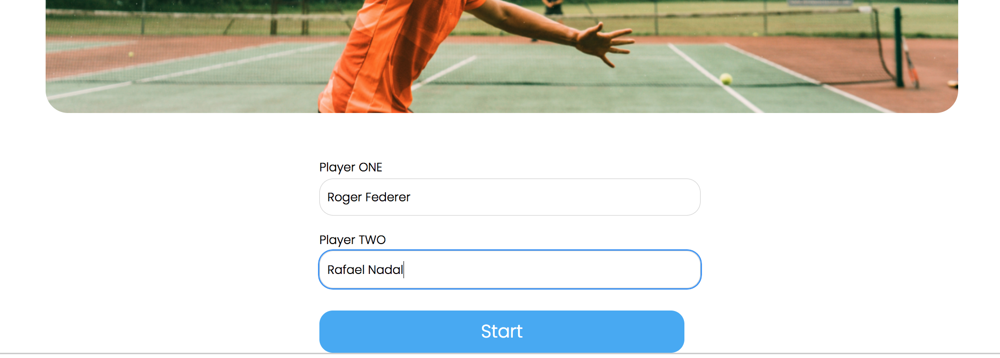
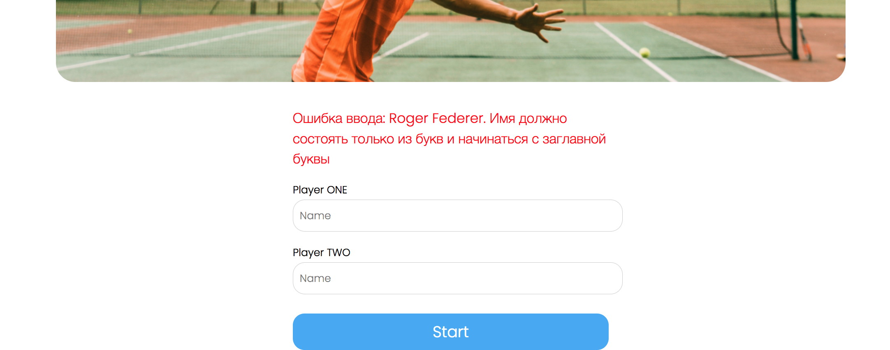
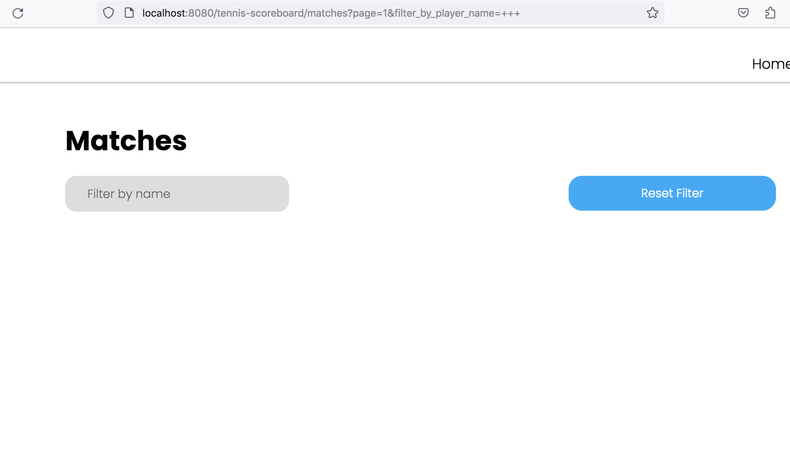
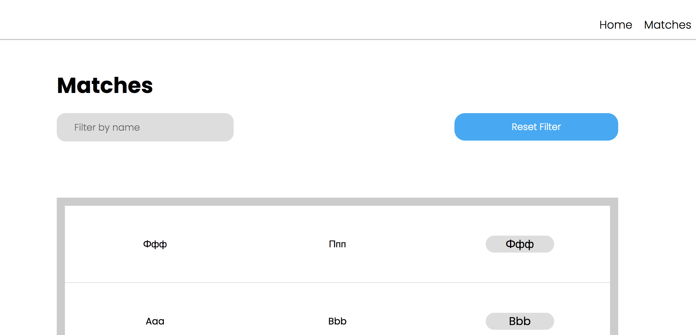
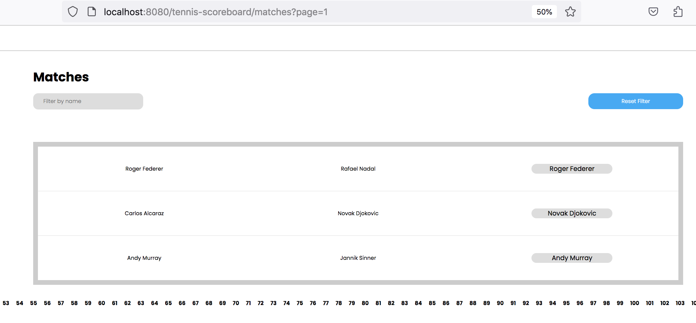
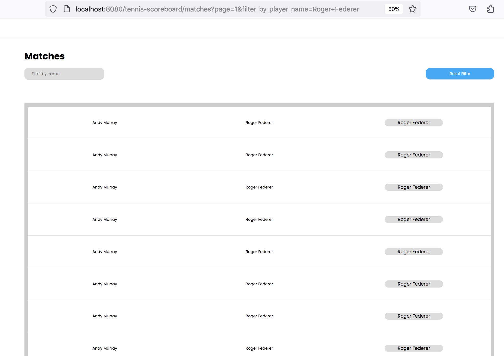

# Review на реализацию от [@diman_3f](https://github.com/diman3f/tennis-scoreboard) проекта [Табло теннисного матча](https://zhukovsd.github.io/java-backend-learning-course/projects/tennis-scoreboard/)

> [!NOTE]
> 1. Знаком ❗️ помечены критически важные замечания, а также места нарушения ТЗ. 
> 2. Если ❗️ стоит перед заголовком, значит он относится ко всем пунктам этого раздела.
> 3. Замечания, указанные в пункте с именем пакета, относятся ко всем классам этого пакета или ко всем классам этого слоя.
> 4. Знаком 💡 помечены блоки, в которых содержится подсказка по реализации какого-то приёма или части кода.
> Такие пункты всегда находятся в сворачиваемом блоке и разворачиваются по нажатию. 
   Перед их раскрытием стоит постараться придумать или поискать решение самостоятельно.

## Функциональный обзор

- При использовании недопустимого имени, оно не сохраняется в поле ввода и приходится заново его печатать.





При ошибке лучше оставлять текст в поле ввода — это улучшит пользовательский опыт.

- Последний сыгранный матч отображается последним в списке на странице завершённых матчей — чтобы посмотреть его результат в таблице надо листать до последней страницы. Лучше, чтобы последний завершённый отображался первым в списке (на первой странице).

- При фильтрации по пустой строке сейчас не показывается ни один матч:



Вместо этого можно считать это за отсутствие фильтра и показывать все матчи.

- На странице завершённых матчей нет кнопки для применения фильтра и есть кнопка сброса фильтра, даже когда он не применён и поле пустое.



Хотя фильтрация работает при нажатии на `Enter`, лучше явно добавить кнопку, применяющую фильтр.

> [!CAUTION]
> - ❗️В пагинации на странице завершённых матчей отображаются все страницы, что плохо выглядит при большом количестве страниц и делает недоступными страницы за пределами экрана.
> 
> 
> 
> Лучше сделать отображение текущей и +-2 страниц вокруг неё.

> [!CAUTION]
> - ❗️При фильтре по имени на странице отображается больше матчей, чем без фильтра
> 
> 
> 
> 
> 
> Лучше сделать так, чтобы размер страницы (количество отображаемых матчей) было одинаковым.

## entities

### Player

<div align="right">

[Перейти к упоминанию в Match](#match) </div>

> [!CAUTION]
> - ❗️Аннотация `@Setter` генерирует публичные сеттеры для всех полей класса:
> 
>   - Поле `id` является первичным ключом, генерируемым базой данных. Публичный сеттер для этого поля позволяет устанавливать и изменять ID на любом этапе жизненного цикла объекта. Предоставление такой возможности может привести к рассинхронизации объекта в приложении с его представлением в базе данных, а также к конфликтам при сохранении.
> 
>   - Публичный сеттер для поля `name` позволяет произвольно менять имя игрока, которое должно быть его уникальным и неизменяемым свойством в рамках бизнес-логики.
> 
> Как исправить: удалить аннотацию `@Setter`. Инициализация полей должна происходить только один раз в момент создания объекта через конструктор.

> [!CAUTION]
> - ❗️Спецификация JPA требует наличия конструктора без аргументов для создания экземпляров сущностей, однако ему не обязательно быть `public`. Когда конструктор публичный, он становится частью общедоступного API класса. Это позволяет использовать его для создания "пустых", невалидных объектов (без установки обязательных полей) в любом месте приложения, хотя он предназначен исключительно для внутреннего использования фреймворком (JPA).
> 
> Хорошим подходом будет ограничить область видимости этого конструктора до `protected`. Это делает его недоступным для прямого вызова из других пакетов, но оставляет видимым для JPA и дочерних классов. В Lombok это можно сделать с помощью параметра `access`.
> 
> Сейчас так:
> 
> ```java
> @NoArgsConstructor
> @Entity
> public class Player {
>     // ...
> }
> ```
> 
> Лучше так:
> 
> ```java
> @NoArgsConstructor(access = AccessLevel.PROTECTED)
> @Entity
> public class Player {
>     // ...
> }
> ```

> [!CAUTION]
> - ❗️️Аннотация `@AllArgsConstructor` позволяет создать объект Player c установленным ID. Поле `id` является первичным ключом, генерируемым базой данных. Предоставление возможности устанавливать его напрямую в коде может привести к рассинхронизации объекта в приложении с его представлением в базе данных, а также к конфликтам при сохранении.
> 
> Стоит удалить аннотацию `@AllArgsConstructor`. Для создания новых, ещё не сохранённых в БД, игроков использовать более безопасный и корректный конструктор, который уже есть в классе.
> 
> ```java
> public Player(String name) {
>     this.name = name;
> }
> ```
> 
> По этой же причине в классе не должно быть аннотации `@Builder`. 

> [!CAUTION]
> - ❗️Аннотация `@Builder` предоставляет гибкий, но неконтролируемый способ создания объектов. 
> 
> Как и `@AllArgsConstructor` или `@Setter`, стандартный `@Builder` позволяет установить любое поле, включая `id`. Он также позволяет создать объект, не установив обязательные поля (например, `name`), что приведёт к ошибке на этапе сохранения в базу данных. Для сущностей, где важно обеспечить валидное состояние при создании, `@Builder` часто бывает слишком "разрешающим".
> 
> Стоит удалить аннотацию `@Builder` и использовать для создания объектов определённый в предыдущем пункте публичный конструктор (со всеми полями, кроме ID).

- Уникальность поля `name` обеспечивается атрибутом `unique = true` в аннотации `@Column`. Хотя `unique = true` приводит к созданию уникального индекса, явное определение индекса через аннотацию `@Table` даёт больше контроля и улучшает читаемость кода. В `@Index` можно задать имя для индекса, что упрощает его администрирование в будущем, и сама аннотация явно декларирует намерение создать индекс для оптимизации поиска.

Можно добавить явное определение индекса на уровне класса.

> [!TIP]
> <details>
> 
> <summary><b>💡 Например, так 💡</b></summary>
> 
> ---
> 
> ```java
> @Entity
> @Table(name = "players", indexes = @Index(name = "idx_player_name", columnList = "name", unique = true))
> public class Player {
>     // ...
>     @Column(name="Name")
>     private String name;
> }
> ```
> 
> При таком подходе параметр `unique = true` из аннотации `@Column` можно удалить, так как уникальность теперь задана в `@Index`.
> 
> ---
> 
> </details>

- В классе есть аннотации, функционал которых не используется или не должен быть в проекте. Хорошим подходом будет оставить минимум необходимых аннотаций, достаточных для JPA Entity.

Сейчас так:

```java
@Getter
@Setter
@NoArgsConstructor
@AllArgsConstructor
@Builder
@ToString
@Entity
@Table(name = "Players")
public class Player {
    // ...
}
```

Лучше так:

```java
@Getter
@NoArgsConstructor(access = AccessLevel.PROTECTED)
@Entity
@Table(name = "Players")
public class Player {
    // ...
}
```

> [!CAUTION]
> - ❗️Противоречивые ограничения на максимальную длину имени игрока (`name`) между двумя уровнями приложения:
> 
>   - Бизнес-валидация (в классе `Validator`): Максимальная длина 14 символов.
> 
>   ```java
>   public final class Validator {
>       private final static int LENGTH_NAME = 15;
>       // ...
>       public static boolean isValidLength(String name) {
>           if (name != null) {
>               return name.length() < LENGTH_NAME;
>           }
>           return false;
>       }  
>   }
>   ```
> 
>   - JPA-Entity (в классе `Player`): В аннотации `@Column` не указан параметр `length`, что означает значение ограничение в 255 символов.
> 
>   ```java
>   public class Player {
>       // ...
>       @Column(name="Name", unique = true)
>       private String name;
>   }
>   ```
> 
> Такое несоответствие может вводить в заблуждение. Например, разработчик, смотрящий только на `Player`, будет думать, что лимит — 255 символов, что не соответствует бизнес-требованиям (в классе `Validator`).
> 
> Стоит привести оба уровня к единому, консистентному значению.

- Поле `id` имеет тип `Integer`, который имеет максимальное значение `~2.1` миллиарда. Хотя `Integer` соответствует ТЗ (`Int`), в долгосрочной перспективе это может стать проблемой. Максимальное значение `Integer` может быть исчерпано в системах с большим количеством записей. Общепринятой и хорошей практикой для первичных ключей является использование типа `Long`. Лучше заменить тип поля `id` на `Long`.

- Имена таблицы (`Players`) и колонок (`ID`, `Name`) используют `PascalCase` и `UPPERCASE`. Часто используемый подход для SQL — `snake_case` (например, `players`, `id`, `name`). Единообразный стиль улучшает читаемость схемы данных, поэтому лучше использовать `snake_case` в аннотациях `@Table` и `@Column`. 

Сейчас так:

```java
@Table(name = "Players")
//...
@Column(name = "ID")
//...
@Column(name="Name", unique = true)
```

Лучше так:

```java
@Table(name = "players")
//...
@Column(name = "id")
//...
@Column(name = "name", unique = true)
```

### Match

- Пункты про:

> [!CAUTION]
>   - ❗️Использование аннотации `@Setter`


> [!CAUTION]
>   - ❗️Использование аннотации `@AllArgsConstructor`


> [!CAUTION]
>   - ❗️Использование аннотации `@Builder`


> [!CAUTION]
>   - ❗️Ограничение видимости `@NoArgsConstructor`

  - Избавление от лишних аннотаций
  - Использование Long для id
  - Использование snake_case в названиях в БД

описанные в разделе [Player](#player), актуальны и для этого класса.

> [!CAUTION]
> - ❗️`@ToString` обычно не используют в JPA сущностях. Конкретно здесь проблем быть не должно, но использование этих аннотаций вместе с `@Entity` не является хорошей практикой.
> 
> [**Использование @ToString (Lombok) и @Entity (JPA) в одном классе**](#tostring-entity) <a id="back-from-tostring-entity"></a>
> 
> Даже если сейчас для генерации `toString()` используются все поля, лучше их явно указать в аннотации. Так при добавлении в класс новых полей, они не будут автоматически участвовать в `toString()`.

> [!CAUTION]
> - ❗️Слово `MATCHES` (а также `MATCH`) является зарезервированным ключевым словом в некоторых диалектах SQL (например, для оператора `MATCH ... AGAINST` в полнотекстовом поиске). Хотя в конкретно в этом проекте проблем с этим не возникнет, не стоит использовать зарезервированные слова в качестве имён таблиц. Это может приводить к необходимости экранировать имя таблицы в нативных SQL-запросах или к синтаксическим ошибкам в некоторых СУБД.
> 
> [**Использование зарезервированных слов в качестве названий в БД**](#sql-keywords) <a id="back-from-sql-keywords"></a>
> 
> Лучше выбирать имена, которые гарантированно не конфликтуют с зарезервированными словами. Учитывая, что в таблице хранятся только завершённые матчи, можно выбрать более описательное и безопасное имя `FINISHED_MATCHES` или более общее `TENNIS_MATCHES`.

- Колонки, связывающие матч с игроками (`Player1`, `Player2`, `Winner`), по умолчанию являются изменяемыми (`updatable = true`).

По логике, после того как матч завершён и сохранён, его участники и победитель меняться не должны. Разрешение на их изменение на уровне JPA является избыточным и потенциально небезопасным.

Можно явно указать, что эти колонки не должны обновляться, добавив `updatable = false` в аннотации `@JoinColumn`.

Сейчас так:

```java
@JoinColumn(name = "Player1")
```

Лучше так:

```java
@JoinColumn(name = "Player1", updatable = false)
```

- Риск нарушения целостности данных. Класс не имеет механизмов, которые бы гарантировали на уровне схемы базы данных выполнение ключевых бизнес-правил:

  - Игрок не может играть сам с собой (`Player1` должен отличаться от `Player2`).

  - Победителем (`Winner`) должен быть один из участников матча (`Player1` или `Player2`).

Хотя логика в сервисном слое может предотвращать создание некорректных матчей, база данных этого не гарантирует. Прямой SQL-запрос или ошибка в другом модуле приложения могут привести к созданию невалидных данных (например, матч, где `player1_id = 5` и `player2_id = 5`).

Защита должна быть на всех уровнях, поэтому стоит добавить ограничения, проверяющие, что игроки разные и победителем является один из участников матча.

> [!TIP]
> <details>
> 
> <summary><b>💡 Например так 💡</b></summary>
> 
> ---
> 
> ```java
> @Entity
> @Table(name = "FINISHED_MATCHES", check = {
>         @CheckConstraint(name = "players_are_different_check", constraint = "Player1 != Player2"),
>         @CheckConstraint(name = "winner_is_participant_check", constraint = "Winner = Player1 OR Winner = Player2")
> })
> public class Match {
>     
> }
> ```
> 
> Что это даст:
> 
>   - Гарантирует целостность данных даже при прямом доступе к БД.
>   - Снижает риск появления невалидных данных из-за ошибок в коде или внешних вмешательств.
>   - Схема базы данных будет явно отражать бизнес-правила.
> 
> ---
> 
> </details>

- Поля игроков используют числительные в виде цифр (`player1`, `player2`), тогда как в другом месте приложения (в модели и сервисе `OngoingMatchesService`) внутренние переменные, обозначающие тех же игроков, именуются словами (`playerOne`, `playerTwo`).

```java
@Entity
public class Match {
    // ...
    @JoinColumn(name = "Player1")
    private Player player1;
    
    @JoinColumn(name = "Player2")
    private Player player2;
    // ...
}

/**
 * В OngoingMatchesService
 */
public NewMatchDto createCurrentMatch(NewMatchDto dto) {
    // ...
  
    Player playerOne = onePlayer.get();
    Player playerTwo = twoPlayer.get();
  
    // ...
}

/**
 * В OngoingMatch
 */
private Player playerOne;
private Player playerTwo;
```

Отсутствие единого, последовательного стиля именования может затруднять чтение кода. В некоторых случаях разработчику придётся потратить дополнительное время и умственные усилия, чтобы убедиться, что `player1` и `playerOne` являются обозначениями одной и той же сущности. Это создаёт ненужную когнитивную нагрузку.

Также непоследовательное именование повышает риск случайных ошибок, особенно при копировании/вставке кода или при работе с большим количеством схожих переменных, когда легко перепутать один стиль с другим.

Стоит привести именование к единому стилю, используя либо только цифры, либо только слова.

Например, так:

```java
@Entity
public class Match {
    // ...
  
    @JoinColumn(name = "first_player_id", nullable = false)
    private Player firstPlayer;
  
    @JoinColumn(name = "second_player_id", nullable = false)
    private Player secondPlayer;
  
    // ...
}

/**
 * В OngoingMatchesService
 */
public NewMatchDto createCurrentMatch(NewMatchDto dto) {
    // ...
  
    Player firstPlayer = firstPlayerOptional.get();
    Player secondPlayer = secondPlayerOptional.get();
  
    // ...
}

/**
 * В OngoingMatch
 */
private Player firstPlayer;
private Player secondPlayer;
```

Использование слов (например, `firstPlayer` и `secondPlayer`) даёт несколько преимуществ перед использованием цифр:

  - Визуальное различие и читаемость: Имена `firstPlayer` и `secondPlayer` визуально отличаются друг от друга сильнее, чем `player1` и `player2`. Это снижает вероятность их перепутать при быстром просмотре кода. Кроме того, такие имена читаются более естественно, как обычный текст.

  - Эффективность работы в IDE: При вводе `first...`, IntelliJ IDEA однозначно предложит подсказку `firstPlayer`. При вводе `player...` IDE предложит оба варианта (`player1`, `player2`), что требует дополнительного действия для выбора нужного.

  - Удобство поиска: Искать по кодовой базе переменную тоже `firstPlayer` может быть проще, чем `player1` (по причине, из предыдущего пункта).

- Колонки игроков и победителя в `@JoinColumn` названы `Player1`, `Player2`, `Winner`.

Для колонок, хранящих внешний ключ, уместно добавлять суффикс `_id`, чтобы было очевидно, что в них хранится идентификатор, а не какая-то другая информация.

Также вместо чисел в названиях можно использовать числительные, написанные словами. Единообразие имён между кодом и схемой БД (с поправкой на стиль: camelCase в Java, snake_case в SQL) делает код стилистически однородным.

Сейчас так:

```java
@Table(name = "Matches")
public class Match {
    // ...
  
    @JoinColumn(name = "Player1")
    private Player firstPlayer;

    @JoinColumn(name = "Player2")
    private Player secondPlayer;

    @JoinColumn(name = "Winner")
    private Player winner;
    
    // ...
}
```

Лучше так:

```java
@Table(name = "finished_matches")
public class Match {
    // ...
  
    @JoinColumn(name = "first_player_id")
    private Player firstPlayer;

    @JoinColumn(name = "second_player_id")
    private Player secondPlayer;

    @JoinColumn(name = "winner_id")
    private Player winner;
    
    // ...
}
```

Это сделает названия колонок более идиоматичными для БД.

- Связи `@ManyToOne` не имеют явного указания о стратегии загрузки. По умолчанию для `@ManyToOne` используется `FetchType.EAGER`, что приводит к немедленной загрузке связанных сущностей при загрузке `MatchEntity`. Это может вызывать проблемы производительности (N+1 запросов) и излишнюю загрузку данных, особенно если связанные объекты не всегда нужны.

Как исправить: добавить `fetch = FetchType.LAZY` для каждого `@ManyToOne` поля.

Сейчас так:

```java
public class Match {
    // ...
    @ManyToOne
    private Player player1;
    
    @ManyToOne
    private Player player2;
    
    @ManyToOne
    private Player winner;
}
```

Лучше так:

```java
public class Match {
    // ...
    @ManyToOne(fetch = FetchType.LAZY)
    private Player player1;
    
    @ManyToOne(fetch = FetchType.LAZY)
    private Player player2;
    
    @ManyToOne(fetch = FetchType.LAZY)
    private Player winner;
}
```

Это даст более тонкий контроль над тем, какие данные загружаются и в некоторых ситуациях оптимизирует загрузку и предотвратит проблемы с производительностью.

- Для обязательных полей стоит добавить `optional = false` в `@ManyToOne` или `nullable = false` в `@JoinColumn` (можно добавить оба параметра). Целостность данных должна обеспечиваться на всех уровнях: в приложении (валидация) и в БД (constraints). Отсутствие ограничений в БД означает, что данные могут быть испорчены из-за ошибок в приложении или при прямом доступе к БД.

А также можно добавить атрибут `updatable = false`. Это атрибут запрещает изменять колонку после её первоначальной вставки. Игроки матча и победитель не должны меняться, поэтому эти колонки можно защитить от обновлений.

Сейчас так:

```java
@Entity
@Table(name = "Matches")
public class Match {

    // ...
  
    @ManyToOne
    @JoinColumn(name = "Player1")
    Player player1;

    @ManyToOne
    @JoinColumn(name = "Player2")
    Player player2;

    @ManyToOne
    @JoinColumn(name = "Winner")
    Player winner;
  
    // ...
}
```

Лучше так:

```java
@Entity
@Table(name = "Matches")
public class Match {
    
    // ...

    @ManyToOne(fetch = FetchType.LAZY, optional = false)
    @JoinColumn(name = "Player1", nullable = false, updatable = false)
    Player firstPlayer;

    @ManyToOne(fetch = FetchType.LAZY, optional = false)
    @JoinColumn(name = "Player2", nullable = false, updatable = false)
    Player secondPlayer;

    @ManyToOne(fetch = FetchType.LAZY, optional = false)
    @JoinColumn(name = "Winner", nullable = false, updatable = false)
    Player winner;

    // ...
}
```

Сейчас таблица матчей создаётся так:

```postgres-sql
create table Matches (
    Player1 integer,
    Player2 integer,
    Winner integer,
    id integer generated by default as identity,
    primary key (id)
)
```

При `optional = false` или `nullable = false` — Hibernate генерирует `NOT NULL` ограничение в БД и делает проверку перед вставкой в БД (если значение поля null, то Hibernate не будет обращаться в БД для вставки и сам выбросит исключение PropertyValueException)

Будет так:

```postgres-sql
create table Matches (
    Player1 integer not null,
    Player2 integer not null,
    Winner integer not null,
    id integer generated by default as identity,
    primary key (id)
)
```

Это позволит избежать риска создания некорректных записей (например, матчи без игроков) в БД.

- Для поля `id` лучше использовать обёртку `Long`, вместо примитивного типа `long` (после перехода на него с `int`). `Long` (обёртка) может быть `null` и для нового объекта поле `id` будет `null` до тех пор, пока Hibernate не присвоит ему значение после сохранения. А `long` (примитив) не может быть `null` и для нового, ещё не сохраненного объекта, поле `id` будет иметь значение по умолчанию `0`. Использование обертки `Long` является предпочтительным для генерируемых ID, потому что позволяет легко и надёжно определить, является ли сущность новой, просто проверив `if (id == null)`. С использованием примитива `0` может оказаться валидным значением ID (хотя и редко), что создаст путаницу.

## models

### Score

<div align="right">

[Перейти к упоминанию в SetScore](#setscore) </div>

<div align="right">

[Перейти к упоминанию в MatchScoreModel](#matchscoremodel) </div>

- Константы `INDEX_ONE_PLAYER` и `INDEX_OPPOSITE_PLAYER` объявлены как `private final int`, то есть являются полями экземпляра.

Сейчас так:

```java
public abstract class Score<T> {
    private final int INDEX_ONE_PLAYER = 0;
    private final int INDEX_OPPOSITE_PLAYER = 1;
}
```

Константы по своей природе должны быть статическими (`static`), так как они не принадлежат конкретному объекту, а являются общими для всех экземпляров класса. Создание этих полей в каждом новом объекте `Score` — это пустая трата памяти (хоть и незначительная) и семантически неверный подход.

Должно быть так:

```java
public abstract class Score<T> {
    private static final int INDEX_ONE_PLAYER = 0;
    private static final int INDEX_OPPOSITE_PLAYER = 1;
}
```

> [!CAUTION]
> - ❗️Предоставление публичных методов для изменения счёта (`setScorePlayer`, `setScoreOppositePlayer`) превращает класс в анемичную модель.
> 
> ```java
> public abstract class Score<T> {
>     //...
>     public void setScorePlayer(int playerNumber, T score) {
>         playerScore.set(playerNumber, score);
>     }
> 
>     public void setScoreOppositePlayer(int playerNumber, T score) {
>         playerScore.set(playerNumber == INDEX_ONE_PLAYER ? INDEX_OPPOSITE_PLAYER : INDEX_ONE_PLAYER, score);
>     }
>     //...
> }
> ```
> 
> [**Анемичная vs Богатая модель предметной области**](#reach-anemic-model) <a id="back-from-reach-anemic-model"></a>
> 
> Это позволяет любому внешнему коду напрямую и бесконтрольно изменять внутреннее состояние счёта, полностью обходя игровую логику, которая должна быть инкапсулирована в модели. Это делает систему хрупкой и подверженной ошибкам.

- Для хранения счёта двух игроков используется `List`, а доступ к данным осуществляется по "магическим" индексам (0 и 1), которые вынесены в константы `INDEX_ONE_PLAYER` и `INDEX_OPPOSITE_PLAYER`.

Сейчас так:

```java
public abstract class Score<T> {
    private final List<T> playerScore;
    private final int INDEX_ONE_PLAYER = 0;
    private final int INDEX_OPPOSITE_PLAYER = 1;
    //...
    public T getScorePlayer(int playerNumber) {
        return playerScore.get(playerNumber);
    }
    //...
    protected abstract State pointWon(int numberPlayer);
}
```

Почему это проблема:

  Неочевидность: Код трудно читать, так как постоянно приходится сопоставлять индекс с конкретным игроком.

  Хрупкость: Легко допустить ошибку, перепутав индексы, что приведёт к неверному подсчёту очков.

Вместо этого можно использовать специальную структуру данных с ассоциативными ключами — Map. Также поскольку игроков в матче-сете-гейме всегда только 2 (или две стороны), то можно заменить `List` на два именованных поля. Это наиболее простое и надёжное решение для двух игроков.

Лучше так:

```java
public abstract class Score<T> {
    private T playerOneScore;
    private T playerTwoScore;
    
    public T getFirstPlayerScore() {
        return playerOneScore;
    }
    
    public T getSecondPlayerScore() {
        return playerTwoScore;
    }
    // ...
}
```

> [!CAUTION]
> - ❗️Аннотация `@Getter` на уровне класса сгенерирует публичный метод `getPlayerScore()`, который вернёт прямую ссылку на внутренний `List<T> playerScore`. Это нарушает инкапсуляцию, так как любой внешний код сможет напрямую изменять список (например, через `score.getPlayerScore().clear()`), нарушая состояние объекта.
> 
> Сейчас так:
> 
> ```java
> @Getter
> public abstract class Score<T> {
> 
>     private final List<T> playerScore;
>     //...
> }
> ```
> 
> В случае, когда нужно вернуть коллекцию, лучше так (возвращать неизменяемую копию или представление):
> 
> ```java
> public abstract class Score<T> {
> 
>     private final List<T> playerScore;
>     
>     public List<T> getPlayerScore() {
>         return List.copyOf(playerScore);
>     }
>     //...
> }
> ```
> 
> В текущей реализации необходимости возвращать `List<T> playerScore` не должно быть, поэтому геттер для него просто не нужен.

- Аннотация `@Getter` применяется ко всему классу, что приводит к созданию геттеров для `private final` констант `INDEX_ONE_PLAYER` и `INDEX_OPPOSITE_PLAYER`.

```java
public abstract class Score<T> {
    private final List<T> playerScore = new ArrayList();
    private final int INDEX_ONE_PLAYER = 0;
    private final int INDEX_OPPOSITE_PLAYER = 1;
    // ...
    @Generated
    public int getINDEX_ONE_PLAYER() {
        Objects.requireNonNull(this);
        return 0;
    }

    @Generated
    public int getINDEX_OPPOSITE_PLAYER() {
        Objects.requireNonNull(this);
        return 1;
    }
}
```

Приватные константы предназначены для внутреннего использования и не должны быть частью публичного API объекта.

- Константы `INDEX_ONE_PLAYER` и `INDEX_OPPOSITE_PLAYER` объявлены после поля `playerScore`, а конструктор — после абстрактных методов.

Сейчас так:

```java
public abstract class Score<T> {
    private final List<T> playerScore;
    private final int INDEX_ONE_PLAYER = 0;
    private final int INDEX_OPPOSITE_PLAYER = 1;
    
    protected abstract T getZeroScore();

    public Score() {
        this.playerScore = new ArrayList<>();
        playerScore.add(getZeroScore());
        playerScore.add(getZeroScore());
    }
    
    // ...
```

Константы принять объявлять первыми в классе — перед всеми полями экземпляра и конструкторами. Стандартный порядок (статические поля -> поля экземпляра -> конструкторы -> методы) помогает разработчикам быстрее ориентироваться в коде и улучшает его читаемость.

Должно быть так:

```java
public abstract class Score<T> {
    private final int INDEX_ONE_PLAYER = 0;
    private final int INDEX_OPPOSITE_PLAYER = 1;
    private final List<T> playerScore;

    public Score() {
        this.playerScore = new ArrayList<>();
        playerScore.add(getZeroScore());
        playerScore.add(getZeroScore());
    }
    
    protected abstract T getZeroScore();
    
    // ...
```

Так код будет соответствовать стандартам, что улучшит его читаемость.

- Методы класса (`pointWon`, `getScorePlayer` и др.) принимают аргумент с названием `playerNumber`, но их логика подразумевает, что передаётся индекс игрока, а не его номер.

```java
public abstract class Score<T> {
    // ...
    private final List<T> playerScore;
    // ...
    
    public Score() {
        this.playerScore = new ArrayList<>();
        playerScore.add(getZeroScore());
        playerScore.add(getZeroScore());
    }
    
    // ...
    
    public T getScorePlayer(int playerNumber) {
        return playerScore.get(playerNumber);
    }
    
    public T getScoreOppositePlayer(int playerNumber) {
        return playerScore.get(playerNumber == INDEX_ONE_PLAYER ? INDEX_OPPOSITE_PLAYER : INDEX_ONE_PLAYER);
    }

    public void setScorePlayer(int playerNumber, T score) {
        playerScore.set(playerNumber, score);
    }

    public void setScoreOppositePlayer(int playerNumber, T score) {
        playerScore.set(playerNumber == INDEX_ONE_PLAYER ? INDEX_OPPOSITE_PLAYER : INDEX_ONE_PLAYER, score);
    }
}
```

Индексы начинаются с `0`, поэтому для получения счёта для второго игрока надо передать в метод `1`, что контринтуитивно и может вводить в заблуждение. 

Лучшим решением будет принимать в метод доменную модель игрока.

- Методы, принимающие `int playerNumber`, не проверяют, является ли переданное значение валидным индексом (0 или 1).

Передача некорректного значения приведёт к `IndexOutOfBoundsException` во время выполнения программы. Это делает код хрупким и ненадёжным.

В текущей реализации стоит добавить проверку на корректность переданного значения в начале каждого метода, который использует `playerNumber` для доступа к списку.

- Название метода `getZeroScore` не полностью отражает его суть, так как начальный счёт в теории может быть не нулевым.

Сейчас так:

```java
protected abstract T getZeroScore();
```

Имя метода должно точно описывать его предназначение. `getZeroScore` слишком конкретно и привязано к реализации, в то время как `getInitialScore` (`getInitScore`) описывает намерение — получить начальное значение.

Можно переименовать метод во всех классах иерархии.

Можно так:

```java
protected abstract T getInitialScore();
```

- Метод `pointWon` одновременно изменяет состояние объекта (счёт) и возвращает информацию о новом состоянии (через `enum State`).

Сейчас так:

```java
protected abstract State pointWon(int numberPlayer);
```

Это нарушает принцип разделения команд и запросов [Command-Query Separation (CQS)](https://martinfowler.com/bliki/CommandQuerySeparation.html), который гласит, что метод должен либо изменять состояние (команда), либо возвращать данные (запрос), но не делать и то, и другое. Смешение этих обязанностей усложняет код, его тестирование и понимание.

Как исправить: 

Разделить `pointWon` на несколько методов:

  - Команда `pointWon`, которая будет `void` и только обновлять счёт.
  - Запросы `isFinished()` и `getWinner()`, которые будут возвращать информацию о состоянии.

Лучше так:

```java
public abstract void pointWon(TennisPlayer player);
public abstract boolean isFinished();
public abstract Optional<TennisPlayer> getWinner();
```

- Абстрактные методы `getZeroScore` и `pointWon` разнесены по классу.

Группировка связанных (в данном случае, абстрактных) методов помогает быстрее понять "контракт", который должны реализовать подклассы.

Поэтому стоит расположить все абстрактные методы вместе, например, после конструктора.

### RegularScore

<div align="right">

[Перейти к упоминанию в TieBreakScore](#tiebreakscore) </div>

<div align="right">

[Перейти к упоминанию в SetScore](#setscore) </div>

<div align="right">

[Перейти к упоминанию в MatchScoreModel](#matchscoremodel) </div>

> [!CAUTION]
> - ❗️Метод `pointWon` слишком сложный и содержит много вложенных `if-else` конструкций.
> 
> ```java
> @Override
> protected State pointWon(int numberPlayer) {
>     RegularGamePlayerPoints playerScore = getScorePlayer(numberPlayer);
>     if (playerScore.ordinal() <= RegularGamePlayerPoints.THIRTY.ordinal()) {
>         //...
>     } else if (playerScore == RegularGamePlayerPoints.FORTY) {
>         if (getScoreOppositePlayer(numberPlayer) == RegularGamePlayerPoints.ADVANTAGE) {
>             //...
>         } else if (getScoreOppositePlayer(numberPlayer) == RegularGamePlayerPoints.FORTY) {
>             //...
>         } else {
>             //...
>         }
>     } else if (playerScore == RegularGamePlayerPoints.ADVANTAGE) {
>         //...
>     } else {
>         //...
>     }
>     return State.ONGOING;
> }
> ```
> 
> Высокая цикломатическая сложность делает метод трудным для чтения, понимания и модификации. Любое изменение правил игры потребует внесения правок в эту запутанную структуру, что чревато ошибками. 
> 
> Лучше разбить метод на несколько небольших приватных методов с понятными именами, каждый из которых отвечает за свой сценарий (например, `handleStandardPoint`, `handleDeuce`, `handleAdvantage`).

> [!CAUTION]
> - ❗️Сравнение `enum` по `ordinal()` за пределами самого `enum` делает логику хрупкой.
> 
> ```java
> if (playerScore.ordinal() <= RegularGamePlayerPoints.THIRTY.ordinal()) {
>     setScorePlayer(numberPlayer, RegularGamePlayerPoints.next(playerScore));
> }
> ```
> 
> Метод `ordinal()` возвращает порядковый номер константы в `enum`. Если в будущем порядок объявления констант в `RegularGamePlayerPoints` изменится (например, кто-то добавит новое значение или отсортирует их по алфавиту), эта логика молча сломается, что приведет к непредсказуемым ошибкам в подсчете очков. 
> 
> Не следует полагаться на `ordinal()` в бизнес-логике.

- Метод `pointWon` не проверяет, завершилась ли уже игра. Если после завершения игры по ошибке вызвать этот метод ещё раз, он продолжит изменять счёт, что приведёт к невалидному состоянию.

```java
@Override
protected State pointWon(int numberPlayer) {
    // логика начисления счёта
}
```

Это нарушает инварианты класса. Объект, представляющий завершённый гейм, не должен иметь возможности изменять свой счёт. Отсутствие такой проверки делает класс хрупким и перекладывает ответственность за контроль состояния на клиента, что не является хорошей практикой.

Стоит добавить в самое начало метода `pointWon` проверку на состояние завершённости.

> [!TIP]
> <details>
> 
> <summary><b>💡 В таком духе 💡</b></summary>
> 
> ---
> 
> ```java
> @Override
> protected State pointWon(int numberPlayer) {
>     if (isFinished()) {
>         throw new IllegalStateException("Cannot award a point. The game is already finished.");
>     }
>     // логика начисления счёта
> }
> ```
> 
> Так класс будет сам защищать свою целостность. Это сделает его более надёжным и предсказуемым в использовании, а также упростит клиентский код.
> 
> ---
> 
> </details>

- В методе `getZeroScore` начальное значение для очков задаётся напрямую через `RegularGamePlayerPoints.ZERO`.

Сейчас так:

```java
public class RegularScore extends GameScore<RegularGamePlayerPoints> {
    @Override
    protected RegularGamePlayerPoints getZeroScore() {
        return RegularGamePlayerPoints.ZERO;
    }
}
```

Хотя `RegularGamePlayerPoints.ZERO` кажется очевидным значением, вынесение его в именованную константу, улучшило бы читаемость и поддерживаемость кода. Это делает намерение программиста явным и упрощает изменение начального значения в будущем.

Лучше так:

```java
public class RegularScore extends GameScore<RegularGamePlayerPoints> {
    private static final RegularGamePlayerPoints INITIAL_SCORE = RegularGamePlayerPoints.ZERO;
    
    @Override
    protected RegularGamePlayerPoints getZeroScore() {
        return INITIAL_SCORE;
    }
}
```

- Сообщение в `IllegalStateException` написано на русском языке и не содержит достаточного контекста для отладки (`"pointWon() не вызывается на Advantage"`).

Сейчас так:

```java
throw new IllegalStateException("pointWon() не вызывается на Advantage");
```

Сообщение констатирует факт, но не объясняет, почему это проблема, и не предоставляет контекста, который мог бы помочь в отладке.

В профессиональной разработке стандартом является английский язык для сообщений об ошибках, логов и комментариев.

Поэтому стоит переписать сообщение на английский язык, сделав его более подробным и полезным.

Лучше так:

```java
throw new IllegalStateException(
    "Invalid game state: pointWon() was called for a player who already has ADVANTAGE."
);
```

- Конечный блок `else` в методе `pointWon()` является недостижимым кодом (dead code).

```java
} else {
    throw new IllegalStateException("pointWon() не вызывается на Advantage");
}
```

Предыдущие ветви `if-else if` уже покрывают все возможные значения `enum RegularGamePlayerPoints`. Этот блок никогда не выполнится.

Стоит удалить этот блок `else`. Логика метода должна быть структурирована так, чтобы покрывать все случаи без необходимости в "защитном" `else`.

- Все "магические" числа, лучше вынести в `private static final` константы с понятными именами. Именованная константа делает код более семантически понятным и защищает от ошибок из-за опечаток.

- Строка `return numberPlayer == 0 ? State.PLAYER_WON_ONE : State.PLAYER_WON_TWO;` повторяется в коде дважды.

Это небольшое нарушение принципа DRY (Don't Repeat Yourself). Если в будущем логика определения победителя изменится, придётся вносить правки в нескольких местах, что увеличивает риск ошибки.

> [!TIP]
> **DRY (Don't Repeat Yourself)** — принцип «Не повторяйся», направленный на снижение повторения кода и логики, так как изменения в повторяющихся участках требуют правок во многих местах, что увеличивает риск ошибок. Централизация логики делает код более поддерживаемым и надёжным.

Стоит вынести этот тернарный оператор в отдельный `private` метод с понятным названием.

### RegularGamePlayerPoints

> [!CAUTION]
> - ❗️Константа для счёта "15" названа `FIFTY`, что в переводе означает "50". Правильное название — `FIFTEEN`.

- Метод `next()` реализован как статический, что вынуждает использовать его в стиле: `RegularGamePlayerPoints.next(playerScore)`.

```java
public enum RegularGamePlayerPoints {
    // ...
    public static RegularGamePlayerPoints next(RegularGamePlayerPoints player) {
        if (player.ordinal() != ADVANTAGE.ordinal()) {
            return RegularGamePlayerPoints.values()[player.ordinal() + 1];
        } else throw new IllegalArgumentException("Cannot be more Advantage");
    }    
}
```

Вызов `playerScore.next()` более интуитивен и лучше отражает идею, что запрашивается следующее состояние у текущего значения.

Стоит сделать метод `next()` нестатическим, чтобы его можно было вызывать у экземпляра `enum`.

- В методе `next()` используются `if/else` без фигурных скобок для однострочных выражений.

Тело блока `if/else` лучше всегда оборачивать в фигурные скобки. Хотя синтаксис Java позволяет этого не делать, данная практика является небезопасной (например, при добавлении новой строки кода в такой блок легко забыть добавить скобки, и новая строка будет выполняться всегда, а не по условию) и нарушает [конвенцию по стилю кода](https://www.oracle.com/java/technologies/javase/codeconventions-statements.html#449). Она может привести к трудноуловимым ошибкам.

- Когда в блоке `if` происходит выход из метода (`return`, `throw`), то остальной код можно писать без блока `else`.

Сейчас так:

```java
public static RegularGamePlayerPoints next(RegularGamePlayerPoints player) {
    if (player.ordinal() != ADVANTAGE.ordinal()) {
        return RegularGamePlayerPoints.values()[player.ordinal() + 1];
    } else throw new IllegalArgumentException("Cannot be more Advantage");
}
```

Если условие `if` истинно, выполнение метода прерывается. Следовательно, код после `if` будет выполнен только в том случае, если условие ложно — дополнительный `else` для этого не нужен.

Лучше так:

```java
public static RegularGamePlayerPoints next(RegularGamePlayerPoints player) {
    if (player.ordinal() != ADVANTAGE.ordinal()) {
        return RegularGamePlayerPoints.values()[player.ordinal() + 1];
    }
    throw new IllegalArgumentException("Cannot be more Advantage");
}
```

Это уменьшает вложенность и улучшает читаемость кода.

- Название параметра в методе `public static RegularGamePlayerPoints next(RegularGamePlayerPoints player)` можно переименовать в `currentPoints`, так как его тип `*PlayerPoints`, а не `Player`.

- В методе `getNumber()` в `default` блоке `switch` используется русскоязычное сообщение об ошибке: `"Отсутствует такое значение"`.

Это нарушает общепринятый подход использования английского языка в коде, логах и сообщениях об ошибках.

Стоит перевести сообщение и сделать его более информативным.

Сейчас так:

```java
default: throw new IllegalStateException("Отсутствует такое значение");
```

Лучше так:

```java
default: throw new IllegalStateException("Internal error: Unhandled score value: " + this);
```

- Имя метода `getNumber()` может ввести в заблуждение, так как он возвращает не число (`Integer`), а строку (`String`).

Имя должно чётко отражать тип и суть возвращаемого значения. `getNumber` создаёт ложное ожидание.

Стоит переименовать метод в `asString()` или `stringValue()`.

- Метод `getNumber()` использует конструкцию `switch` для получения строкового представления очков.

```java
public String getNumber() {
    switch (this) {
        case ZERO: return "0";
        case FIFTY: return "15";
        case THIRTY: return "30";
        case FORTY: return "40";
        case ADVANTAGE: return "AD";
        default: throw new IllegalStateException("Отсутствует такое значение");
    }
}
```

Этот подход менее эффективен и элегантен, чем использование поля в `enum`. Для каждого вызова метода происходит проверка. Более идиоматичный подход — хранить строковое значение в поле, которое инициализируется один раз в конструкторе.

> [!TIP]
> <details>
> 
> <summary><b>💡 Вот так 💡</b></summary>
> 
> ---
> 
> ```java
> public enum RegularGamePlayerPoints {
>     ZERO("0"),
>     FIFTEEN("15"), // С учётом исправления опечатки
>     THIRTY("30"),
>     FORTY("40"),
>     ADVANTAGE("AD");
> 
>     private final String stringValue;
> 
>     RegularGamePlayerPoints(String stringValue) {
>         this.stringValue = stringValue;
>     }
> 
>     // Вместо switch-case метода
>     public String asString() {
>         return stringValue;
>     }
> }
> ```
> 
> Так код станет более производительным, читаемым и простым в поддержке. Добавление новой константы потребует только указания её строкового значения в конструкторе, без необходимости изменять `switch`.
> 
> ---
> 
> </details>

### TieBreakScore

<div align="right">

[Перейти к упоминанию в SetScore](#setscore) </div>

- Пункты про:
  - Вынесение начального значения счёта в константу
  - Вынесение всех магических чисел в константы

описанные в разделе [RegularScore](#regularscore), актуальны и для этого класса.

- Имя константы `DIFFERENT_POINT_FOR_WIN_TIEBREAK` не полностью отражает её смысл. Она обозначает минимальную разницу в очках для победы.

Имена в коде должны быть максимально точными. Неполное имя может заставить разработчика делать лишние предположения или неправильно интерпретировать логику.

Стоит переименовать константу, добавив слово `MIN` или `MINIMUM`.

Сейчас так:

```java
private static final int DIFFERENT_POINT_FOR_WIN_TIEBREAK = 2;
```

Лучше так:

```java
private static final int MIN_DIFFERENT_POINT_FOR_WIN_TIEBREAK = 2;
```

- В коде есть сложные, многосоставные условия в блоке `if`.

Логика определения победителя в методе `pointWon` реализована через два вложенных `if`.

```java
@Override
protected State pointWon(int numberPlayer) {
    setScorePlayer(numberPlayer, getScorePlayer(numberPlayer) + 1);
    if (getScorePlayer(numberPlayer) >= MIN_POINT_FOR_WIN_TIEBREAK) {
        if (getScorePlayer(numberPlayer)  - getScoreOppositePlayer(numberPlayer) >= DIFFERENT_POINT_FOR_WIN_TIEBREAK) {
            return numberPlayer == 0 ? State.PLAYER_WON_ONE : State.PLAYER_WON_TWO;
        }
    }
    return State.ONGOING;
}
```

Вложенные условия требуют больше умственных усилий для понимания. Чтобы понять общую картину, нужно проанализировать все уровни вложенности.

Стоит объединить оба условия в один `if` с помощью логического оператора `&&` и, что более важно, вынести всю проверку в отдельный `private` метод с говорящим названием.

> [!TIP]
> <details>
> 
> <summary><b>💡 Например, так 💡</b></summary>
> 
> ---
> 
> ```java
> @Override
> protected State pointWon(int winningPlayerIndex) {
>     setScorePlayer(winningPlayerIndex, getScorePlayer(winningPlayerIndex) + 1);
> 
>     if (isTieBreakWon(winningPlayerIndex)) {
>         return determineWinnerState(winningPlayerIndex);
>     }
> 
>     return State.ONGOING;
> }
> 
> private boolean isTieBreakWon(int winningPlayerIndex) {
>     int winnerScore = getScorePlayer(winningPlayerIndex);
>     int loserScore = getScoreOppositePlayer(winningPlayerIndex);
> 
>     boolean hasEnoughPoints = winnerScore >= MIN_POINT_FOR_WIN_TIEBREAK;
>     boolean hasRequiredDifference = (winnerScore - loserScore) >= MIN_POINT_DIFFERENCE_FOR_WIN;
> 
>     return hasEnoughPoints && hasRequiredDifference;
> }
> 
> private State determineWinnerState(int playerIndex) {
>     return playerIndex == 0 ? State.PLAYER_WON_ONE : State.PLAYER_WON_TWO;
> }
> ```
> 
> ---
> 
> </details>

Это сделает код более декларативным и читаемым, а также даст возможность переиспользовать повторяющиеся условия.

### SetScore

<div align="right">

[Перейти к упоминанию в MatchScoreModel](#matchscoremodel) </div>

- Пункты про:
  - Вынесение начального значения счёта в константу
  - Вынесение всех магических чисел в константы
  - Упрощение метода `pointWon`

описанные в разделе [RegularScore](#regularscore), актуальны и для этого класса.

- Пункт про расположение констант в классе, описанный в разделе [Score](#score), актуален и для этого класса.

- Пункт про вынесение условий из `if` в методы с понятными названиями, описанный в разделе [TieBreakScore](#tiebreakscore), актуален и для этого класса.

- В методах `pointWon` и `getPointsScore` используется проверка `instanceof` для определения текущего типа гейма (`RegularScore` или `TieBreakScore`).

```java
@Override
protected State pointWon(int numberPlayer) {
    State state = gameScore.pointWon(numberPlayer);
    if (gameScore instanceof TieBreakScore) {
        // ...
    } else if (state == State.PLAYER_WON_ONE) {
        // ...
    }
    return State.ONGOING;
}

// ...

private List<String> getPointsScore() {
    List<String> points = new ArrayList<>();
    if (gameScore instanceof RegularScore) {
        // ...
    } else if (gameScore instanceof TieBreakScore) {
        // ...
    } else {
        // ...
    }
    return points;
}
```

Это антипаттерн, нарушающий принцип полиморфизма. Код, использующий `instanceof`, становится жёстким и негибким, так как добавление нового типа гейма потребует изменения всех подобных проверок в коде.

Как исправить: Использовать полиморфные вызовы. Например, можно добавить в базовый класс `GameScore` абстрактные методы (например, `getPlayerScoreAsString()`), которые будут по-разному реализованы в каждом подклассе.

- Класс доменной модели `SetScore` содержит метод `getCurrentScore(CurrentScore model)`, который принимает и модифицирует DTO-объект.

```java
public CurrentScore getCurrentScore(CurrentScore model) {
    List<String> score = getPointsScore();
    model.setGameOne(getScorePlayer(getINDEX_ONE_PLAYER()));
    model.setGameTwo(getScorePlayer(getINDEX_OPPOSITE_PLAYER()));
    model.setPointOne(score.get(getINDEX_ONE_PLAYER()));
    model.setPointTwo(score.get(getINDEX_OPPOSITE_PLAYER()));
    return model;
}
```

Доменная модель не должна иметь никаких знаний о DTO, используемых для передачи данных на уровень представления. Это создаёт сильную связанность между слоями и усложняет поддержку системы.

Лучше удалить метод `getCurrentScore` из `SetScore`. Всю логику по преобразованию доменного объекта в DTO следует перенести в отдельный класс-маппер.

Это даст чёткое разделение ответственностей между слоями приложения. Доменная модель будет полностью независима от формата передачи данных.

> [!CAUTION]
> - ❗️Метод `pointWon` содержит баг: при выигрыше второго игрока в тай-брейке он ошибочно возвращает `State.PLAYER_WON_ONE`.
> 
> Сейчас так:
> 
> ```java
> } else if (state == State.PLAYER_WON_TWO) {
>     gameScore = new RegularScore();
>     return State.PLAYER_WON_ONE;
> }
> ```
> 
> Должно быть так:
> 
> ```java
> } else if (state == State.PLAYER_WON_TWO) {
>     gameScore = new RegularScore();
>     return State.PLAYER_WON_TWO;
> }
> ```

> [!CAUTION]
> - ❗️Метод `getCurrentScore` принимает в качестве параметра объект `CurrentScore` и изменяет его поля. Это является побочным эффектом (side effect) и делает поведение метода непредсказуемым для вызывающего кода. Метод должен создавать и возвращать новый объект, а не изменять существующий.
> 
> ```java
> public CurrentScore getCurrentScore(CurrentScore model) {
>     List<String> score = getPointsScore();
>     model.setGameOne(getScorePlayer(getINDEX_ONE_PLAYER()));
>     model.setGameTwo(getScorePlayer(getINDEX_OPPOSITE_PLAYER()));
>     model.setPointOne(score.get(getINDEX_ONE_PLAYER()));
>     model.setPointTwo(score.get(getINDEX_OPPOSITE_PLAYER()));
>     return model;
> }
> ```
> 
> Эта проблема решится сама, если маппинг модель —> DTO переедет в маппер.

- В методе `pointWon` есть дублирование кода:

```java
@Override
protected State pointWon(int numberPlayer) {
    State state = gameScore.pointWon(numberPlayer);
    if (gameScore instanceof TieBreakScore) {
        if (state == State.PLAYER_WON_ONE) {
            
            // первый раз
            gameScore = new RegularScore();
            return State.PLAYER_WON_ONE;
            
        } else if (state == State.PLAYER_WON_TWO) {
        
            // второй раз
            gameScore = new RegularScore();
            return State.PLAYER_WON_ONE;
        
        }
        return State.ONGOING;
    } else if (state == State.PLAYER_WON_ONE) {
        
        // первый раз
        gameScore = new RegularScore();
        setScorePlayer(numberPlayer, getScorePlayer(numberPlayer) + 1);
        return gameWon(numberPlayer);
        
    } else if (state == State.PLAYER_WON_TWO) {
        
        // второй раз
        gameScore = new RegularScore();
        setScorePlayer(numberPlayer, getScorePlayer(numberPlayer) + 1);
        return gameWon(numberPlayer);
        
    }
    return State.ONGOING;
}
```

Это нарушение принципа DRY. Дублирование кода увеличивает вероятность ошибок при внесении изменений (можно забыть исправить во всех местах).

Стоит провести рефакторинг, объединив общие части.

### MatchScoreModel

- Пункт про расположение конструктора в классе, описанный в разделе [Score](#score), актуален и для этого класса.

- Пункты про:
  - Дублирование кода
  - Создание DTO в доменной модели

описанные в разделе [SetScore](#setscore), актуальны и для этого класса.

- Пункты про:
  - Вынесение начального значения счёта в константу
  - Вынесение всех магических чисел в константы

описанные в разделе [RegularScore](#regularscore), актуальны и для этого класса.

- Класс назван `MatchScoreModel`, в то время как другие классы в том же доменном слое имеют простые имена (`SetScore`, `RegularScore`). Суффикс `Model` нарушает единообразие.

Суффикс `Model` не несёт полезной информации и загрязняет имя. В доменном слое класс `MatchScore` и так является моделью, это очевидно из контекста.

Стоит переименовать класс в `MatchScore`.

### CurrentScore

- Класс `CurrentScore` по своей сути является объектом для передачи данных (DTO), но он расположен в пакете `models`, предназначенном для доменной модели. Его имя также не отражает его роли как DTO.

Это нарушает [**Принцип разделения ответственности (Separation of Concerns)**](#soc-principle) <a id="back-from-soc-principle"></a> и вносит путаницу в структуру проекта. Смешение классов из разных слоёв в одном пакете затрудняет понимание архитектуры и навигацию по кодовой базе.

Стоит переместить класс `CurrentScore` в пакет `com.diman_3f.tennis_scoreboard.dto`. И переименовать класс в `CurrentScoreDto`, чтобы явно указать его предназначение.

> [!CAUTION]
> - ❗️Класс содержит дублирующиеся поля для каждого игрока.
> 
> ```java
> @Getter
> @Setter
> public class CurrentScore {
>     private String nameOne;
>     private String nameTwo;
>     private int setOne;
>     private int setTwo;
>     private int gameOne;
>     private int gameTwo;
>     private String pointOne;
>     private String pointTwo;
>     //...
> }
> ```
> 
> Все поля (`name`, `set`, `game`, `point`) повторяются для `One` и `Two`. Это "запах кода" Data Clump (Группа данных).
> 
> Если к счёту игрока понадобится добавить новый атрибут (например, количество эйсов), придётся добавлять два новых поля и два набора геттеров/сеттеров.
> 
> Всю информацию, относящуюся к одному игроку, следует сгруппировать в отдельный класс-контейнер (DTO).
> 
> <details>
> 
> <summary><b>💡 Например, так 💡</b></summary>
> 
> ---
> 
> ```java
> // Новый DTO для очков одного игрока
> public record PlayerDisplayScore(
>     String name,
>     int sets,
>     int games,
>     String points
> ) {}
> 
> // Обновленный CurrentScore
> @Getter
> @Setter
> public class CurrentScoreDto { // Переименован для ясности
>     private PlayerDisplayScore firstPlayer;
>     private PlayerDisplayScore secondPlayer;
> }
> ```
> Такой подход делает структуру данных более понятной, гибкой и устраняет дублирование.
> 
> ---
> </details>

### OngoingMatch

> [!CAUTION]
> - ❗️Использование аннотации `@Setter` на уровне класса генерирует публичные сеттеры для всех полей, включая `playerOne`, `scoreModel` и другие.
> 
> Это полностью разрушает инкапсуляцию, позволяя любому внешнему коду произвольно изменять внутреннее состояние матча. Это делает поведение объекта непредсказуемым и открывает путь к трудноотлавливаемым ошибкам.
> 
> Стоит полностью удалить аннотацию `@Setter` с класса. Изменения состояния должны происходить только через контролируемые методы самого класса.

- Класс `OngoingMatch` хранит множество полей для счёта (`setOnePlayer`, `gameOnePlayer`, `pointOnePlayer` и т.д.), которые являются всего лишь копией данных, уже хранящихся внутри объекта `scoreModel`. После каждого розыгрыша очка метод `upPointPlayer` принудительно синхронизирует эти поля.

```java
@Getter
@Setter
public class OngoingMatch {
    
    private int playerOneId;
    private int playerTwoId;
    private Player playerOne;
    private Player playerTwo;
    private Player winner;
    private int setOnePlayer;
    private int setTwoPlayer;
    private int gameOnePlayer;
    private int gameTwoPlayer;
    private String pointOnePlayer;
    private String pointTwoPlayer;
    private boolean advantageOnePlayer;
    private boolean advantageTwoPlayer;
    private int advantageOnePoint;
    private int advantageTwoPoint;
    private Integer winnerPlayerId;
    private MatchScoreModel scoreModel;
    private boolean matchFinished;


    public OngoingMatch(Player playerOne, Player playerTwo) {
        this.playerOneId = playerOne.getId();
        this.playerTwoId = playerTwo.getId();
        this.playerOne = playerOne;
        this.playerTwo = playerTwo;
        this.setOnePlayer = 0;
        this.gameOnePlayer = 0;
        this.pointOnePlayer = "0";
        this.setTwoPlayer = 0;
        this.gameTwoPlayer = 0;
        this.pointTwoPlayer = "0";
        this.advantageOnePlayer = false;
        this.advantageTwoPlayer = false;
        this.scoreModel = new MatchScoreModel();
        this.matchFinished = false;
    }

    public OngoingMatch upPointPlayer(int numberPlayer) {
        State state = scoreModel.pointWon(numberPlayer);
        defineWinnerMatch(state);
        CurrentScore currentScore = scoreModel.getCurrentScore();
        setOnePlayer = currentScore.getSetOne();
        gameOnePlayer = currentScore.getGameOne();
        pointOnePlayer = currentScore.getPointOne();
        setTwoPlayer = currentScore.getSetTwo();
        gameTwoPlayer = currentScore.getGameTwo();
        pointTwoPlayer = currentScore.getPointTwo();
        return this;
    }

    private void defineWinnerMatch(State state) {
        if (state.equals(State.PLAYER_WON_ONE)) {
            winner = playerOne;
            matchFinished = true;
        } else if (state.equals(State.PLAYER_WON_TWO)) {
            winner = playerTwo;
            matchFinished = true;
        }
    }

    // ...

}
```

Это нарушение [**Принципа Единого источника истины (Single Source of Truth, SSOT)**](#ssot-principle) <a id="back-from-ssot-principle"></a>.

Стоит полностью удалить все поля, дублирующие счёт (`setOnePlayer`, `gameOnePlayer`, `pointOnePlayer`, `setTwoPlayer` и т.д.). `OngoingMatch` не должен ничего знать о внутреннем устройстве `scoreModel`. Его задача — делегировать подсчёт очков `scoreModel`, а при необходимости получить данные для отображения — запросить их у `scoreModel` через геттеры.

> [!CAUTION]
> - ❗️`OngoingMatch` напрямую хранит и работает с `Player` — классом, который является JPA-сущностью. А также `OngoingMatch` содержит метод `getScore()`, который создаёт и возвращает `ScoreDto`.
> 
> Это нарушает важное правило чистой архитектуры: доменный слой (`models`) должен быть независим от других слоёв.
> 
> Вместо `Player` (JPA Entity) доменная модель должна использовать свой собственный объект, например, `record TennisPlayer(String name)`. Преобразование из `Player` в `TennisPlayer` должно происходить в сервисном слое при создании `OngoingMatch`.
> 
> Метод `getScore()` должен быть удалён. Создание DTO должно происходить во внешнем классе-маппере.

- Класс содержит множество неиспользуемых полей: `advantageOnePlayer`, `advantageTwoPlayer`, `advantageOnePoint`, `advantageTwoPoint`, `winnerPlayerId`.

Этот код создаёт "шум", увеличивает размер объекта, вводит в заблуждение разработчиков, которые могут потратить время, пытаясь понять, для чего нужны эти поля.

Стоит удалить все неиспользуемые поля.

- Метод `public OngoingMatch upPointPlayer(int numberPlayer)` изменяет состояние объекта и возвращает `this`.

```java
public OngoingMatch upPointPlayer(int numberPlayer) {
    State state = scoreModel.pointWon(numberPlayer);
    defineWinnerMatch(state);
    CurrentScore currentScore = scoreModel.getCurrentScore();
    setOnePlayer = currentScore.getSetOne();
    gameOnePlayer = currentScore.getGameOne();
    pointOnePlayer = currentScore.getPointOne();
    setTwoPlayer = currentScore.getSetTwo();
    gameTwoPlayer = currentScore.getGameTwo();
    pointTwoPlayer = currentScore.getPointTwo();
    return this;
}
```

Этот подход здесь не кажется оправданным. Методы, изменяющие состояние (команды), должны быть `void`. Это чётко разделяет команды (которые что-то делают) и запросы (которые что-то возвращают). Возврат `this` провоцирует написание кода в виде цепочек (`match.upPointPlayer(0).upPointPlayer(1)`), что в данном контексте не несёт пользы и только запутывает.

- Класс хранит в полях `matchFinished` и `winner` данные, которые являются производными от основного состояния (счёта).

```java
public class OngoingMatch {
    // ...
    private Player winner;
    // ...
    private boolean matchFinished;
    //...
}
```

Это нарушает Принцип Единого источника истины (Single Source of Truth, SSOT). Источником истины является счёт. Флаг `matchFinished` и поле `winner` — это лишь следствие. Хранение производных данных создаёт риск рассинхронизации: можно изменить счёт, но забыть обновить эти поля, и объект окажется в неконсистентном состоянии.

Лучше удалить поля `matchFinished` и `winner` и заменить их методами, которые вычисляют результат на лету из текущего счёта.

## dto

### NewMatchDto

<div align="right">

[Перейти к упоминанию в ScoreDto](#scoredto) </div>

<div align="right">

[Перейти к упоминанию в MatchResultDto](#matchresultdto) </div>

- Класс `NewMatchDto` используется для нескольких совершенно разных целей:

  - Как объект для приёма данных из формы (`nameOnePlayer`, `nameTwoPlayer`).
  - Как контейнер для хранения ошибок валидации (`errors`, `isValidDto`).
  - Как объект для передачи результата создания матча (`uuid`).
  - Он является изменяемым (mutable) из-за `@Setter` и методов типа `saveErrors`.

Это нарушение Принципа Единственной Ответственности (SRP). Класс пытается быть всем сразу, из-за чего он становится сложным, неочевидным и хрупким. DTO (Data Transfer Object) должен быть простым, неизменяемым "контрактом" для передачи данных.

Стоит разделить класс на несколько более сфокусированных.

- Хорошим решением было бы преобразовать класс в `record` (доступно в LTS с Java 17). `record` был создан специально для таких случаев. Он по умолчанию является неизменяемым (immutable) и автоматически генерирует всё необходимое:

  - Приватные `final` поля.
  - Публичный конструктор для всех полей.
  - Публичные методы доступа (геттеры, например, `namePlayerOne()`).

- Имена полей для игроков (`nameOnePlayer`, `nameTwoPlayer`) не согласуются с именами в других DTO:

```java
public class NewMatchDto {
    // ...
    private String nameOnePlayer;
    private String nameTwoPlayer;
    // ...
}

public class ScoreDto {
    // ...
    private String playerOneName;
    private String playerTwoName;
    // ...
}

public class MatchResultDto {
    private String namePlayerOne;
    private String namePlayerTwo;
    // ...
}
```

Это создаёт хаос и путаницу. Разработчику постоянно приходится вспоминать, как именно называется поле в данном конкретном DTO. Это гарантированный источник ошибок при маппинге данных, обработке JSON и отображении в UI. 

Стоит принять единый стандарт именования для всех DTO в проекте. Вариант `firstPlayerName`/`secondPlayerName`  будет хорошим выбором, так как он понятен и легко читается.

- В классе присутствует поле `boolean isValidDto`, которое полностью дублирует информацию, уже содержащуюся в `Map<String, String> errors`.

```java
public class NewMatchDto {
    // ...
    private boolean isValidDto;
    private Map<String, String> errors;
    // ...
    @Builder
    public NewMatchDto(String nameOnePlayer, String nameTwoPlayer) {
        this.nameOnePlayer = nameOnePlayer;
        this.nameTwoPlayer = nameTwoPlayer;
        this.isValidDto = true;
        this.errors = new HashMap<>();
    }

    public void saveErrors(String name, String error) {
        isValidDto = false;
        errors.put(name, error);
    }

    public String getError(String nameError) {
        if (errors.get(nameError) == null) {
            return "";
        } else
            return errors.get(nameError);
    }
}
```

Это нарушает Принцип Единого источника истины (Single Source of Truth, SSOT).

Состояние валидности хранится в двух местах. Это создаёт риск рассинхронизации: код может изменить `isValidDto` в `false`, но забыть добавить ошибку в `Map`, или наоборот. Наличие двух источников правды для одного и того же факта — это потенциальный баг.

Стоит удалить поле `isValidDto` и, в случае необходимости, вместо прямого доступа к флагу использовать метод `isValid()`, который будет вычислять значение на лету.

> [!TIP]
> <details>
> 
> <summary><b>💡 Вот так 💡</b></summary>
> 
> ---
> 
> ```java
> public boolean isValid() {
>     return errors.isEmpty();
> }
> ```
> 
> Это исправление актуально для текущего дизайна. При полном рефакторинге и вынесении логики валидации из DTO эта проблема исчезнет сама собой.
> 
> ---
> 
> </details>

- Аннотация `@Builder` от Lombok стоит над конструктором, а не над классом.

Когда `@Builder` размещается над конструктором, он создаёт "строитель", который может установить только те поля, которые перечислены в аргументах этого конструктора. В данном случае это `nameOnePlayer` и `nameTwoPlayer`.

```java
public class NewMatchDto {
    // ...
    @Builder
    public NewMatchDto(String nameOnePlayer, String nameTwoPlayer) {
        this.nameOnePlayer = nameOnePlayer;
        this.nameTwoPlayer = nameTwoPlayer;
        this.isValidDto = true;
        this.errors = new HashMap<>();
    }
    // ...
}

/**
 * В target/classes/com/diman_3f/tennis_scoreboard/dto/NewMatchDto.class
 */
@Generated
public static class NewMatchDtoBuilder {
    @Generated
    private String nameOnePlayer;
    @Generated
    private String nameTwoPlayer;

    @Generated
    NewMatchDtoBuilder() {
    }

    @Generated
    public NewMatchDtoBuilder nameOnePlayer(String nameOnePlayer) {
        this.nameOnePlayer = nameOnePlayer;
        return this;
    }

    @Generated
    public NewMatchDtoBuilder nameTwoPlayer(String nameTwoPlayer) {
        this.nameTwoPlayer = nameTwoPlayer;
        return this;
    }

    @Generated
    public NewMatchDto build() {
        return new NewMatchDto(this.nameOnePlayer, this.nameTwoPlayer);
    }

    @Generated
    public String toString() {
        return "NewMatchDto.NewMatchDtoBuilder(nameOnePlayer=" + this.nameOnePlayer + ", nameTwoPlayer=" + this.nameTwoPlayer + ")";
    }
}
```

Остальные поля класса (`uuid`, `isValidDto`, `errors`) нельзя будет установить через этот строитель.

`@Builder` здесь вообще не нужен (так как DTO для запроса должен быть простым), поэтому аннотацию следует удалить.

- Тело блока `if/else` лучше всегда оборачивать в фигурные скобки. Хотя синтаксис Java позволяет этого не делать, данная практика является небезопасной (например, при добавлении новой строки кода в такой блок легко забыть добавить скобки, и новая строка будет выполняться всегда, а не по условию) и нарушает [конвенцию по стилю кода](https://www.oracle.com/java/technologies/javase/codeconventions-statements.html#449). Она может привести к трудноуловимым ошибкам.

Сейчас так:

```java
public String getError(String nameError) {
    if (errors.get(nameError) == null) {
        return "";
    } else
        return errors.get(nameError);
}
```

Лучше так:

```java
public String getError(String nameError) {
    if (errors.get(nameError) == null) {
        return "";
    } else{
        return errors.get(nameError);
    }
}
```

> [!TIP]
> <details>
> 
> <summary><b>💡 Ещё лучше так 💡</b></summary>
> 
> ---
> 
> ```java
> public String getError(String nameError) {
>     return errors.getOrDefault(nameError, "");
> }
> ```
> 
> ---
> 
> </details>

### ScoreDto

- Пункт про преобразование класса в `record`, описанный в разделе [NewMatchDto](#newmatchdto), актуален и для этого класса.

- Сейчас все поля, относящиеся к счету игрока (`firstPlayerPoints`, `firstPlayerGames`, `firstPlayerSets`), дублируются для первого и второго игрока. 

```java
public class ScoreDto {
    private int playerOneId;
    private int playerTwoId;
    private String playerOneName;
    private String playerTwoName;
    private int setOne;
    private int gameOne;
    private String pointOne;
    private int setTwo;
    private int gameTwo;
    private String pointTwo;
    // ...
}
```

Это признак того, что в классе отсутствует важная абстракция. Из-за этого класс становится большим и громоздким и нарушает принцип DRY (Don't Repeat Yourself). А также, если понадобится добавить новое поле к счету игрока (например, количество эйсов), придётся добавить два поля (`firstPlayerAces`, `secondPlayerAces`).

Все данные, относящиеся к счёту одного игрока, логически связаны между собой, поэтому можно сгруппировать их в отдельный класс.

### MatchResultDto

- Пункт про преобразование класса в `record`, описанный в разделе [NewMatchDto](#newmatchdto), актуален и для этого класса.

## dao

### CrudDao

> [!CAUTION]
> - ❗️Интерфейс назван `CrudDao<T>`, что подразумевает универсальный (generic) контракт для CRUD-операций (Create, Read, Update, Delete) над любой сущностью `T`. Однако его методы не универсальны:
> 
>   - `getMatchWithOffSet(int offset, int limit)` и `findByName(String name)` — это специфичные методы для поиска матчей.
>   - Оба этих метода возвращают `List<MatchResultDto>`, то есть DTO, а не универсальный тип `T` (которым должна быть сущность, например, `Match`).
> 
> Невозможно использовать этот интерфейс для других сущностей. Например, `class PlayerDaoImpl implements CrudDao<Player>` будет невозможно реализовать, так как `PlayerDao` не имеет никакого отношения к `MatchResultDto`.
> 
> Один из вариантов исправления: Отказаться от идеи универсального `CrudDao` в пользу специфичных интерфейсов для каждой сущности.

> [!CAUTION]
> - ❗️Методы `getMatchWithOffSet` и `findByName` возвращают `List<MatchResultDto>`.
> 
> Это нарушает принцип разделения ответственности. Слой DAO должен отвечать исключительно за взаимодействие с базой данных и оперировать сущностями (Entity). Преобразование сущностей в DTO — это задача сервисного слоя. Привязка DAO к конкретному DTO делает его менее универсальным и нарушает архитектурные границы.
> 
> Все методы DAO должны возвращать сущности (`Match`, `Player`) или `Optional<Entity>`. Преобразование из сущности в DTO должно происходить на более высоком уровне — в сервисном слое или в специальном классе-маппере.

> [!CAUTION]
> - ❗️В интерфейсе объявлен метод `findByName`, но отсутствует соответствующий метод для подсчёта количества записей по имени (`countByName`).
> 
> Для реализации постраничной навигации (пагинации) для отфильтрованных по имени результатов необходимо знать их общее количество. Без метода `countByName` придётся либо загружать все найденные матчи в память и вычислять размер списка, что крайне неэффективно, либо показывать пагинацию некорректно.
> 
> Стоит добавить в интерфейс метод `long countByName(String name)`.

- Метод `save` имеет тип возвращаемого значения `void` и не возвращает сохранённую сущность.

После сохранения сущности в базе данных её состояние может измениться (например, СУБД сгенерирует и присвоит `ID`). Контракт `void` вынуждает либо делать дополнительный запрос для получения обновлённой сущности, либо полагаться на то, что ORM мутирует переданный объект, что не всегда очевидно.

Лучше изменить сигнатуру метода так, чтобы он возвращал сохранённую сущность типа `T`. Это сделает использование сохранённого объекта в клиентском коде более явным.

Сейчас так:

```java
void save(T o);
```

Лучше так:

```java
T save(T entity);
```

> [!CAUTION]
> - ❗️Метод `count()` возвращает примитивный тип `int`.
> 
> Сейчас так:
> 
> ```java
> int count();
> ```
> 
> Стандартная агрегатная функция `COUNT()` в SQL возвращает 64-битное число (`BIGINT`), которому в Java соответствует тип `long`. Использование `int` может привести к переполнению и потере данных, если количество записей в таблице превысит `Integer.MAX_VALUE` (около 2.1 миллиарда).
> 
> Стоит изменить тип возвращаемого значения на `long`.
> 
> Лучше так:
> 
> ```java
> long count();
> ```

- Имя метода `getMatchWithOffSet` является слишком специфичным. Оно привязано и к конкретной сущности (`Match`), и к способу получения данных (`WithOffSet`).

Сейчас так:

```java
List<MatchResultDto> getMatchWithOffSet(int offset, int limit);
```

Интерфейс `CrudDao` задуман как универсальный (generic). Его методы должны иметь общие, не зависящие от конкретной сущности имена.

Стоит переименовать метод в `findAll`, что является общепринятым названием для операции получения всех записей (с пагинацией).

Лучше так:

```java
List<T> findAll(int offset, int limit);
```

> [!CAUTION]
> - ❗️Метод `findByName()` в его текущей сигнатуре подразумевает возврат абсолютно всех сущностей из таблицы базы данных одним запросом.
> 
> Сейчас так:
> 
> ```java
> public interface CrudDao<T> {
>     // ...
>     List<MatchResultDto> findByName(String name);
>     // ...
> }
> ```
> 
> Это опасный подход с точки зрения производительности и потребления памяти. Если таблица вырастет до значительных размеров (тысячи или миллионы записей), вызов этого метода почти гарантированно приведёт к деградации производительности. Загрузка огромного объёма данных из БД будет чрезвычайно медленной, создавая колоссальную нагрузку и на приложение, и на сервер БД. Что в конечном итоге вызовет `OutOfMemoryError` — попытка загрузить все записи в память приложения приведёт к переполнению кучи (heap).
> 
> Стоит добавить в сигнатуру метода параметры для пагинации, например, `offset` и `limit`.
> 
> Лучше так:
> 
> ```java
> public interface CrudDao<T> {
>     // ...
>     List<T> findByName(String name, int offset, int limit);
>     // ...
> } 
> ```

### PlayerDao

<div align="right">

[Перейти к упоминанию в JPAMatchDao](#jpamatchdao) </div>

- Класс `PlayerDao` является конкретной реализацией, но не реализует общий интерфейс для DAO, такой как `CrudDao<Player>`.

Это нарушает принцип "программирования на уровне интерфейсов, а не реализаций". Код, использующий `PlayerDao`, будет напрямую зависеть от конкретного класса `PlayerDao`. Это затрудняет замену реализации (например, на mock-объект для тестов или на другую ORM) без изменения клиентского кода.

Стоит создать интерфейс, описывающий контракт для работы с сущностью `Player`, и реализовать его в классе `PlayerDao`.

- PlayerDao` напрямую вызывает статический метод `UtilSessionFactory.getSession()`, создавая жёсткую связь с утилитным классом.

Сейчас так:

```java
public class PlayerDao {
    public Player save(Player player) {
        // ...
        try (Session session = UtilSessionFactory.getSession()) {
            // ...
        }
    }
    
    public Optional<Player> findByName(String namePlayer) {
        try (Session session = UtilSessionFactory.getSession()) {
            // ...
        }
    }
}
```

Это делает невозможным юнит-тестирование класса `PlayerDao` в изоляции. Для теста придётся поднимать реальную сессию Hibernate, так как невозможно подменить `UtilSessionFactory` на тестовый дублёр (mock).

Стоит использовать внедрение зависимостей (Dependency Injection) и передавать `UtilSessionFactory` в конструктор `PlayerDao`.

Лучше так:

```java
public class PlayerDaoImpl implements PlayerDao {
    private final UtilSessionFactory sessionFactory;

    public PlayerDaoImpl(UtilSessionFactory sessionFactory) {
        this.sessionFactory = sessionFactory;
    }

    public Player save(Player player) {
        // ...
        try (Session session = sessionFactory.getSession()) {
            // ...
        }
    }
    
    public Optional<Player> findByName(String namePlayer) {
        try (Session session = sessionFactory.getSession()) {
            // ...
        }
    }
}
```

> [!CAUTION]
> - ❗️В методе сохранения сущностей `save(Player player)` происходит вызов отката транзакции только при ошибке `ConstraintViolationException`. Во всех остальных случаях транзакция не откатывается. Это может привести к неконсистентности данных и утечке ресурсов (например, блокировкам в БД). Транзакция останется открытой, и соединение может не вернуться в пул. 
> 
> Стоит вызывать откат транзакции при любом исключении.

> [!CAUTION]
> - ❗️Перед откатом транзакции в блоке catch в методе `save()` стоит добавить проверку, что она активна
> 
> ```java
> if (transaction != null && transaction.isActive()) {
>     transaction.rollback();
> }
> ```
> 
> иначе вызов `transaction.rollback()` может привести к исключению IllegalStateException.

> [!CAUTION]
> - ❗️В блоке `catch` вызов `transaction.rollback()` не обёрнут в `try-catch`.
> 
> ```java
> public Player save(Player player) {
>     // ...
>     try (Session session = UtilSessionFactory.getSession()) {
>         // ...
>     } catch (PersistenceException e) {
>         if (e instanceof ConstraintViolationException) {
>             if(transaction != null) {
>                 transaction.rollback();
>             }
>             // ...
>         }
>         // ...
>     }
> }
> ```
> 
> Если во время отката транзакции произойдёт ещё одно исключение (например, из-за проблем с сетевым соединением с БД), это новое исключение "замаскирует" исходную ошибку, которая инициировала откат. В логах останется только ошибка отката, и разработчик не сможет узнать, что послужило первопричиной сбоя, что сильно усложняет отладку.
> 
> Стоит обернуть `transaction.rollback()` в собственный блок `try-catch` и, в случае ошибки, добавить новое исключение к исходному с помощью `originalException.addSuppressed(rollbackException)`.
> 
> <details>
> 
> <summary><b>💡 Например, так 💡</b></summary>
> 
> ---
> 
> ```java
> public Player save(Player player) {
>     // ...
>     try (Session session = UtilSessionFactory.getSession()) {
>         // ...
>     } catch (PersistenceException e) {
>         safeRollback(transaction, e);
>         // ...
>     }
> }
> 
> private void safeRollback(Transaction transaction, Exception originalException) {
>     if (transaction != null && transaction.isActive()) {
>         try {
>             transaction.rollback();
>         } catch (Exception rollbackException) {
>             originalException.addSuppressed(rollbackException);
>         }
>     }
> }
> ```
> 
> ---
> 
> </details>

> [!CAUTION]
> - ❗️Сейчас DAO управляет транзакциями самостоятельно:
> 
> Границы транзакции должны определяться бизнес-операцией, а не технической операцией доступа к данным. Бизнес-операция может включать в себя несколько вызовов DAO (например, сохранить игрока, а затем обновить матч). Все эти вызовы должны выполняться в рамках одной транзакции. Когда DAO сам управляет транзакцией, это становится невозможным. Ответственность за управление транзакциями должна лежать на сервисном слое, поэтому стоит перенести управление транзакциями именно в него.
> 
> Другой вариант — реализовать управление транзакциями в фильтре.

- Сообщения в выбрасываемых исключениях (`"Names players must be different"` и `"Database not available"`) неточны.

`ConstraintViolationException` может произойти по разным причинам, не только из-за дублирования имени. `PersistenceException` — это очень общее исключение, и оно не всегда означает, что "база данных недоступна". Некорректные сообщения направляют отладку по ложному пути.

Как исправить: Использовать более общие сообщения и включать в них исходное исключение (для этого надо добавить соответствующий конструктор в класс исключения), чтобы не терять детали.

Сейчас так:

```java
public Player save(Player player) {
    // ...
    try (Session session = UtilSessionFactory.getSession()) {
        // ...
    } catch (PersistenceException e) {
        if (e instanceof ConstraintViolationException) {
            // ...
            throw new EntityExistsException("Names players must be different");
        }
        throw new DatabaseException("Database not available");
    }
}
```

Лучше так:

```java
public Player save(Player player) {
    // ...
    try (Session session = UtilSessionFactory.getSession()) {
        // ...
    } catch (PersistenceException e) {
        if (e instanceof ConstraintViolationException) {
            // ...
            throw new DatabaseException("Failed to save player due to a constraint violation", e);
        }
        throw new DatabaseException("Failed to save player", e);
    }
}
```

- Ключевые слова в тексте HQL-запроса (`from`, `where`) написаны в нижнем регистре. Хотя это и не влияет на работоспособность, написание ключевых слов SQL/HQL в верхнем регистре (`UPPERCASE`) является общепринятым стандартом. Это значительно улучшает читаемость запросов, так как визуально отделяет синтаксические конструкции языка от имён сущностей и полей.

Сейчас так:

```java
"from Player player where player.name=:name_player"
```

Лучше так:

```java
"FROM Player player WHERE player.name=:name_player"
```

- Для визуального разделения запросов на строки лучше использовать текстовые блоки (доступны с Java 15)

Вместо этого:

```java
"from Player player where player.name=:name_player"
```

Лучше так:

```java
"""
"FROM Player player 
WHERE player.name=:name_player"
"""
```

Текст запроса удобнее читать, когда он логично разбит на строки, даже если он короткий.

- Текст HQL-запроса `"from Player player where player.name=:name_player"` жёстко закодирован внутри метода `findByName`.

```java
public Optional<Player> findByName(String namePlayer) {
    try {
        String hql = "from Player player where player.name=:name_player";
        // ...
    }
    // ...
}
```

"Магические строки" в коде — источник ошибок. В них легко допустить опечатку, которую компилятор не сможет проверить. Также, если такой же запрос понадобится в другом месте, его придётся скопировать, что приведёт к дублированию. При изменении сущности придётся искать и исправлять все такие строки вручную.

Лучше вынести текст запроса в `private static final` константу и дать ей понятное имя.

```java
private static final String FIND_BY_NAME_HQL = """
        FROM Player player
        WHERE player.name = :name_player
        """;
```

Когда запросы собраны в одном месте, их легко найти и изменить, а также снижается риск опечаток и исключается дублирование этой части кода.

- Для получения опционального результата используется `query.getSingleResult()`. Метод `getSingleResult()` возвращает `null`, если результат не найден и затем заворачивается в `Optional<T>`.

```java
public Optional<Player> findByName(String namePlayer) {
        
    // ...
        
    Player name_player = (Player) query.setParameter("name_player", namePlayer).getSingleResult();
    return Optional.of(name_player);
}
```

В методе, который возвращает `Optional<T>` лучше использовать более идиоматичный метод `uniqueResultOptional()`, который сразу возвращает `Optional<T>`.

- Переменная `name_player` и параметр запроса `:name_player` названы в стиле `snake_case`. Это нарушает общепринятую в Java конвенцию именования `camelCase`.

Сейчас так:

```java
public class PlayerDao {
    // ...
    public Optional<Player> findByName(String namePlayer) {
        // ...
        Player name_player = (Player) query.setParameter("name_player", namePlayer).getSingleResult();
        // ...
    }
}
```

Стоит переименовать переменную в `player`, а параметр — в `:name`.

Лучше так:

```java
public class PlayerDao {
    // ...
    public Optional<Player> findByName(String namePlayer) {
        // ...
        Player player = (Player) query.setParameter("name", namePlayer).getSingleResult();
        // ...
    }
}
```

- Операцию поиска — метод `findByName` можно не оборачивать в транзакцию.

- Имя именованного параметра `:name_player` используется как "магическая строка" в двух местах: в HQL-запросе и в вызове метода `.setParameter("name_player", namePlayer)`.

Это создаёт неявную связь между двумя строковыми литералами. Если нужно будет переименовать параметр в HQL-запросе (например, с `:name_player` на `:playerName`), можно забыть обновить его в вызове метода `.setParameter()`. Компилятор такую ошибку не поймает, и она проявится только во время выполнения в виде исключения, что усложнит отладку.

Можно вынести имя параметра в `private static final` константу с осмысленным именем и использовать её в обоих местах.

- Тело метода `findByName()` можно записать лаконичнее (цепочкой вызовов)

Сейчас так:

```java
public Optional<Player> findByName(String namePlayer) {
    try (Session session = UtilSessionFactory.getSession()) {
        Transaction transaction = session.beginTransaction();
        String hql = "from Player player where player.name=:name_player";
        Query query = session.createQuery(hql, Player.class);
        Player name_player = (Player) query.setParameter("name_player", namePlayer).getSingleResult();
        transaction.commit();
        return Optional.of(name_player);
    } catch (PersistenceException e) {
        return Optional.empty(); // может здесь лучше бросать исключение ?
    }
}
```

> [!TIP]
> <details>
> 
> <summary><b>💡 Можно так 💡</b></summary>
> 
> ---
> 
> ```java
> private static final String NAME_PARAM = "name";
> 
> private static final String FIND_BY_NAME_HQL = """
>         FROM Player player
>         WHERE player.name = """ + NAME_PARAM;
> 
> public Optional<Player> findByName1(String name) {
>     try (Session session = UtilSessionFactory.getSession()) {
>         return session.createQuery(FIND_BY_NAME_HQL, Player.class)
>                 .setParameter(NAME_PARAM, name)
>                 .uniqueResultOptional();
>     } catch (PersistenceException e) {
>         throw new DatabaseException("Error finding player by name: " + name, e);
>     }
> }
> ```
> 
> ---
> 
> </details>

API для построения запросов в Hibernate спроектирован как "текучий" (fluent), где каждый метод настройки возвращает сам объект, позволяя выстраивать вызовы в цепочку.

> [!CAUTION]
> - ❗️В методе `findByName` в блоке `catch (Exception e)` возвращается `Optional.empty()`, указывающий на то, что игрок не найден.
> 
> ```java
> public Optional<Player> findByName(String namePlayer) {
>     try {
>         // ...
>     } catch (PersistenceException e) {
>         return Optional.empty();
>     }
> }
> ```
> 
> Однако, блок `catch` выполняется только в случае возникновения ошибки при выполнении самой операции доступа к базе данных (например, проблемы с подключением, SQL-ошибка, ошибка Hibernate). Результат "игрок не найден" вводит в заблуждение относительно истинного положения дел.
> 
> Разработчик, столкнувшийся с `Optional.empty()`, будет ошибочно полагать, что причина в отсутствии данных, тогда как на самом деле произошёл сбой инфраструктурного характера (ошибка БД, сети). Это значительно затрудняет диагностику и увеличивает время на отладку.
> 
> Как исправить: Изменить метод таким образом, чтобы он не маскировал проблему, возникшую при попытке выполнения операции доступа к БД, на отсутствие игрока.
> 
> ```java
> public Optional<Player> findByName(String namePlayer) {
>     try {
>         // ...
>     } catch (PersistenceException e) {
>         throw new DatabaseException("Failed to retrieve player by name from database", e);
>     }
> }
> ```
> 
> Это даст возможность быстрее и точнее выявлять сбой и реагировать на него, различая случаи, когда объект не найден (возвращается `Optional.empty()`), от случаев, когда произошла техническая ошибка при обращении к базе данных.

### JPAMatchDao

- Пункты про:

> [!CAUTION]
>   - ❗️Проверку транзакции на `isActive()` перед откатом


> [!CAUTION]
>   - ❗️Безопасный откат транзакции


> [!CAUTION]
>   - ❗️Перенос управления транзакциями на сервисный слой

  - Внедрение `UtilSessionFactory` через конструктор
  - Необязательность (в этом проекте) транзакций для операций чтения
  - Переход на более точные сообщения в исключениях
  - Написание ключевых слов в HQL запросах в UPPERCASE
  - Использование для HQL запросов текстовых блоков
  - Вынесение HQL запросов и других магических строк в константы
  - Возможность записывать тела методов цепочкой вызовов

описанные в разделе [PlayerDao](#playerdao), актуальны и для этого класса.

> [!CAUTION]
> - ❗️В методе `save` `catch` блок ловит слишком конкретное исключение `ConstraintViolationException`.
> 
> ```java
> @Override
> public void save(Match entity) {
>     // ...
>     try (...) {
>         // ...
>     } catch (ConstraintViolationException e) {
>         // ...
>     }
> }
> ```
> 
> Если при сохранении произойдёт другая, но не менее важная ошибка она не будет поймана этим блоком `catch`. Это значит, что для неё не будет выполнен откат транзакции, и система может остаться в несогласованном состоянии.
> 
> Стоит ловить более общий класс проблем — `PersistenceException`.

> [!CAUTION]
> - ❗️Блок `catch` в методах `count`, `getMatchWithOffSet`, `findByName` ловит слишком общее исключение `RuntimeException`. Этот подход является антипаттерном, так как он перехватывает абсолютно все исключения, а не только те, которые связаны с операциями доступа к данным.
> 
> Блок `catch (RuntimeException e)` перехватывает не только ожидаемые ошибки Hibernate (например, сбой подключения к БД), но и любые другие ошибки времени выполнения, такие как `NullPointerException`, `IllegalArgumentException` или `ClassCastException`. Эти исключения почти всегда указывают на наличие бага в коде. Когда такой баг "ловится", он неверно классифицируется как ошибка базы данных и заворачивается в `DatabaseOperationException`. Это скрывает истинную причину проблемы и направляет разработчика по ложному следу при отладке.
> 
> Код, содержащий программную ошибку, должен "падать" как можно быстрее (Принцип Fail Fast) и с максимально понятным сообщением об ошибке (например, `NullPointerException` с точным указанием строки). Перехват `RuntimeException` мешает этому, затягивая обнаружение и исправление дефектов.
> 
> Стоит заменить `catch (RuntimeException e)` на перехват более специфичного исключения, которое является базовым для ошибок используемой технологии персистентности. Поскольку в проекте используется Hibernate, таким исключением является `org.hibernate.HibernateException`. Также можно ловить `jakarta.persistence.PersistenceException`.
> 
> Вот так (пример для метода `save`):
> 
> ```java
> @Override
> public void save(Match entity) {
>     // ...
>     try {
>         // ...
>     } catch (PersistenceException e) {
>         safeRollback(transaction, e);
>         
>         // Также лучше передать оригинальное исключение для сохранения stack trace (для этого надо реализовать соответствующий конструктов в DatabaseOperationException)
>         throw new DatabaseOperationException("Failed to save match to the database", e);
>     }
> }
> ```
> 
> Это даст возможность чётко различать ошибки доступа к данным (которые будут перехвачены и обёрнуты в `DatabaseOperationException`) и программные баги (которые вызовут падение с оригинальным `RuntimeException`, указывая прямо на проблему в коде). Код становится более предсказуемым и устойчивым, так как его логика обработки ошибок сфокусирована исключительно на тех проблемах, для которых она предназначена — сбоях при работе с базой данных.

> [!CAUTION]
> - ❗️В методах репозитория отсутствует явная сортировка результатов. Запросы HQL не содержат `ORDER BY`, поэтому порядок возвращаемых записей зависит от реализации JPA (обычно по первичному ключу в порядке возрастания). Это приводит к тому, что самые новые матчи отображаются в конце списка.
> 
> Пользователь, заходящий на страницу завершённых матчей, ожидает увидеть сначала последние завершённые матчи. В текущей реализации ему приходится пролистывать пагинацию до конца, чтобы найти свежие результаты. Это ухудшает пользовательский опыт и делает интерфейс неинтуитивным. При большом количестве матчей добираться до новых данных будет крайне неудобно.
> 
> Стоит добавить в HQL-запросы сортировку по убыванию идентификатора матча, так как это естественный способ упорядочить матчи от новых к старым.

- В HQL запросе в методе `findByName` используется `JOIN FETCH`, который по своей природе является `INNER JOIN`.

[**JOIN FETCH и LEFT JOIN FETCH в JPA/Hibernate**](#join-fetch-left-join-fetch) <a id="back-from-join-fetch-left-join-fetch"></a>

`INNER JOIN` вернёт только те записи о матчах, у которых все связанные сущности (`player1`, `player2`) гарантированно существуют в базе. В данном проекте, благодаря ограничениям `NOT NULL` в схеме БД, это поведение эквивалентно `LEFT JOIN`. Однако, если по какой-либо причине (например, ошибка при импорте или ручное вмешательство) в таблице `matches` окажется запись со значением `NULL` в колонке `player1`, то такой матч будет молчаливо исключён из выборки. `LEFT JOIN` является более безопасным подходом:

  - Он вернёт все матчи, даже если у них нарушена связь с игроком.
  - Это позволит приложению либо упасть с `NullPointerException` (что явно укажет на проблему с целостностью данных), либо корректно обработать такую ситуацию, если она допустима. "Падать громко и рано" часто лучше, чем молча скрывать проблемы.

Стоит заменить `JOIN FETCH` на `LEFT JOIN FETCH` для большей устойчивости запроса к потенциально некорректным данным.

## services

> [!CAUTION]
> - ❗️В пакете отсутствуют интерфейсы для сервисных классов. Все классы являются конкретными реализациями, от которых напрямую зависят другие компоненты приложения (например, сервлеты).
> 
> Почему это проблема:
> 
>   - Нарушение Принципа инверсии зависимостей (Dependency Inversion Principle): Принцип гласит, что модули верхних уровней не должны зависеть от модулей нижних уровней, а также они должны зависеть от абстракций. В данном случае вышестоящие модули (сервлеты) напрямую зависят от конкретных реализаций сервисов, что делает систему жёстко связанной и хрупкой.
> 
>   - Низкая тестируемость: Невозможно провести полноценное модульное тестирование компонентов, которые зависят от этих сервисов. Например, чтобы протестировать сервлет, использующий `MatchScoreController`, необходимо создавать полный экземпляр этого сервиса со всеми его реальными зависимостями (другие сервисы, которые в свою очередь зависят от DAO и тд), что превращает модульный тест в сложный интеграционный.
> 
>   - Низкая гибкость и невозможность расширения: Если потребуется создать альтернативную реализацию какого-либо сервиса, это потребует изменения кода во всех местах, где использовалась оригинальная реализация.
> 
>   - В классе-реализации публичные методы смешиваются с его внутренними или вспомогательными методами. Интерфейс же служит чётким, явным контрактом, который показывает, что сервис предоставляет внешнему миру, скрывая детали его внутренней работы.
> 
> Для каждого класса в этом пакете стоит создать интерфейс, который будет определять его публичный контракт, и изменить все зависимые классы так, чтобы они использовали этот интерфейс.

### FinishedMatchesPersistenceService

<div align="right">

[Перейти к упоминанию в OngoingMatchesService](#ongoingmatchesservice) </div>

<div align="right">

[Перейти к упоминанию в MatchScoreController](#matchscorecontroller) </div>

> [!CAUTION]
> - ❗️Сервис `FinishedMatchesPersistenceService` самостоятельно создаёт экземпляр маппера (`new MatchModelMapper()`) внутри своего конструктора. Это создаёт жёсткую связь между сервисом и конкретным классом `MatchModelMapper`. А также нарушает важный принцип гибкого проектирования — инверсию зависимостей (Dependency Inversion Principle).
> 
> Если в будущем появится альтернативная или улучшенная реализация маппера, для её использования придётся изменять код самого сервиса. Сервис не должен принимать решение о том, какая конкретно реализация маппера будет использоваться, — это задача вышестоящего "сборщика" приложения (например, `AppContextListener`).
> 
> Стоит использовать внедрение зависимостей. Вместо создания маппера внутри, сервис должен получать его снаружи через конструктор. Важно также зависеть от интерфейса (`MatchMapper`), а не от конкретной реализации.
> 
> Сейчас так:
> 
> ```java
> public class FinishedMatchesPersistenceService {
>     private final CrudDao<Match> matchDao;
>     private final MatchModelMapper mapper;
> 
>     public FinishedMatchesPersistenceService(CrudDao<Match> matchDao) {
>         this.matchDao = matchDao;
>         this.mapper = new MatchModelMapper();
>     }
>     
>     // ...
> }
> ```
> 
> Лучше так:
> 
> ```java
> public class FinishedMatchesPersistenceService {
>     private final CrudDao<Match> matchDao;
>     private final MatchMapper mapper;
> 
>     public FinishedMatchesPersistenceService(CrudDao<Match> matchDao, MatchMapper mapper) {
>         this.matchDao = matchDao;
>         this.mapper = mapper;
>     }
>     
>     // ...
> }
> ```

- Для внедрения зависимостей используется конструктор, написанный вручную.

Поскольку в проекте используется Lombok, этот шаблонный код можно сократить, используя аннотацию `@RequiredArgsConstructor` на уровне класса для всех `final` полей.

Лучше так (объединяя с предыдущим пунктом):

```java
@RequiredArgsConstructor
public class FinishedMatchesPersistenceService {
    private final CrudDao<Match> matchDao;
    private final MatchMapper mapper;
    
    // ...
}
```

### MatchScoreCalculationService

- Пустой публичный конструктор без параметров можно не писать в коде, если он единственный в классе — в таком случае в Java он будет по умолчанию.

- Класс `MatchScoreCalculationService` не выполняет никакой бизнес-логики. Его единственный метод `upPoint` просто делегирует вызов методу `upPointPlayer` у доменного объекта `OngoingMatch`.

```java
public OngoingMatch upPoint(int playerId, OngoingMatch match) {
  return match.upPointPlayer(playerId);
}
```

Этот класс вводит лишний слой абстракции, который не приносит абсолютно никакой пользы, но усложняет навигацию по коду и его понимание. Чтобы понять, что происходит при начислении очка, разработчику нужно пройти по цепочке вызовов: `MatchScoreController` -> `MatchScoreCalculationService` -> `OngoingMatch`. Это нарушает принцип KISS (Keep It Short and Simple).

> [!TIP]
> **KISS (Keep It Short and Simple)** — принцип проектирования, призывающий делать системы, продукты и код максимально простыми и понятными, избегая ненужной сложности. Простые системы работают лучше, надёжнее и легче поддаются модификации и поддержке.

Можно полностью удалить класс `MatchScoreCalculationService`. Вызывающий код должен напрямую работать с доменным объектом `OngoingMatch`.

### OngoingMatchesService

> [!CAUTION]
> - ❗️Пункт про внедрение зависимостей через конструктор, описанный в разделе [FinishedMatchesPersistenceService](#finishedmatchespersistenceservice), актуален и для этого класса.

> [!CAUTION]
> - ❗️Класс `OngoingMatchesService` отвечает сразу за две разные вещи: 
> 
>   - Хранение текущих матчей в памяти (`Map<UUID, OngoingMatch>`)
>   - Бизнес-логику создания нового матча, включающую валидацию и работу с базой данных через `PlayerDao`.
> 
> Принцип единственной ответственности гласит, что у класса должна быть только одна причина для изменения. У этого класса их две:
> 
>   - Изменится способ хранения матчей в памяти (например, добавится логика очистки старых матчей).
>   - Изменится логика создания матча (например, добавятся новые правила или проверки).
> 
> Когда класс делает слишком много, он становится более сложным без веских на то причин. Его название (`OngoingMatchesService`) предполагает, что он просто управляет коллекцией текущих матчей, но на деле он также занимается поиском и созданием игроков в БД.
> 
> Стоит разделить разные ответственности между двумя разными классами.

> [!CAUTION]
> - ❗️Для хранения текущих матчей используется `java.util.HashMap`.
> 
> ```java
> public class OngoingMatchesService {
>     // ...
>     private final Map<UUID, OngoingMatch> matches;
> 
>     public OngoingMatchesService() {
>         // ...
>         this.matches = new HashMap<>();
>     }
>     
>     // ...
> }
> ```
> 
> Веб-приложения по своей природе являются многопоточными. 
> 
> Поэтому стоит использовать потокобезопасную реализацию `Map`, специально предназначенную для многопоточной среды. Лучшим выбором здесь является `java.util.concurrent.ConcurrentHashMap`.

- Логика валидации имён игроков находится внутри сервисного слоя.

```java
public NewMatchDto createCurrentMatch(NewMatchDto dto) {
    String namePlayerOne = dto.getNameOnePlayer();
    String namePlayerTwo = dto.getNameTwoPlayer();

    if (!(Validator.isValidName(namePlayerOne))) {
        throw new ValidationException(String.format("Ошибка ввода: %s. Имя должно состоять только из букв и начинаться с заглавной буквы", namePlayerOne));
    }
    if (!(Validator.isValidName(namePlayerTwo))) {
        throw new ValidationException(String.format("Ошибка ввода: %s. Имя должно состоять только из букв и начинаться с заглавной буквы", namePlayerTwo));
    }
    if (!Validator.isValidLength(namePlayerOne)) {
        dto.saveErrors("lengthOne", "Длина имени не должно привышать 15 символов");
    }
    if (!Validator.isValidLength(namePlayerTwo)) {
        dto.saveErrors("lengthTwo", "Длина имени не должно привышать 15 символов");
    }
}
```

Валидация входных данных от пользователя — это ответственность слоя, который непосредственно с этими данными работает, то есть слоя контроллеров (в данном случае, сервлетов). Сервисный слой должен получать уже проверенные и очищенные данные (DTO). Смешивание в сервисном слое ответственности за приём "сырого" запроса и ответственности за выполнение бизнес-логики делает код менее структурированным и нарушает границы слоёв.

Также это нарушение принципа "Fail Fast": Если пользователь передаст некорректное значение, ошибка парсинга должна быть обнаружена и обработана как можно раньше — в сервлете, который может сразу вернуть ответ `400 Bad Request`.

Стоит перенести всю логику валидации в сервлет (`MatchCreatorServlet`, который будет делегировать её валидатору). Сервлет должен проверить DTO, и если данные невалидны, сразу же вернуть ошибку пользователю, даже не вызывая сервисный слой.

- Для проверки, пуст ли `Optional`, используется конструкция `!onePlayer.isPresent()`.

Сейчас так:

```java
if (!onePlayer.isPresent()) {
    // ...
}
```

Лучше так:

```java
if (onePlayer.isEmpty()) {
    // ...
}
```

- Метод `createCurrentMatch` принимает `NewMatchDto` и возвращает тот же самый, но изменённый (мутированный) объект `NewMatchDto`.

Сейчас так:

```java
public NewMatchDto createCurrentMatch(NewMatchDto dto) {
        
    // ...
        
    UUID uuid = UUID.randomUUID();
    // ...
    dto.setUuid(uuid);
    return dto;
}
```

Мутация входных параметров — это плохая практика, так как она создаёт неявные побочные эффекты. Вызывающий код передаёт один объект, а после вызова метода этот объект внезапно меняется. Это непредсказуемо и усложняет отладку. В данном случае метод, который создаёт новую сущность, должен возвращать либо саму созданную сущность, либо её уникальный идентификатор.

Лучше так:

```java
public UUID createCurrentMatch(NewMatchDto dto) {
        
    // ...
        
    UUID uuid = UUID.randomUUID();
    // ...
    return uuid;
}
```

### MatchScoreController

- Пункт про использование `@RequiredArgsConstructor` вместо явного объявления конструктора, описанный в разделе [FinishedMatchesPersistenceService](#finishedmatchespersistenceservice), актуален и для этого класса.

- Класс называется `MatchScoreController`, но находится в пакете `services` и выполняет роль сервиса-оркестратора, а не контроллера в смысле MVC.

В веб-приложениях с архитектурой MVC "контроллером" принято называть компонент, который принимает и обрабатывает HTTP-запросы (в данном проекте — это сервлеты). При назывании сервисного класса контроллером, создаётся путаница и нарушается общепринятая конвенция. Разработчик, ищущий точку входа для HTTP-запроса, может по ошибке начать искать её здесь.

Лучше переименовать класс в соответствии с его реальной ответственностью, например, в `MatchScoreService`.

- В методе `addPoint` есть два пути возврата DTO:

  - Если матч завершён, DTO создаётся вручную: `new ScoreDto(...)`.
  - Если матч продолжается, вызывается `updateMatch.getScore()`, который, в свою очередь, тоже создаёт DTO.

Почему это проблема:

  - Дублирование ответственности: Логика создания `ScoreDto` размазана по двум разным местам (`MatchScoreController` и `OngoingMatch`).
  - Нарушение SRP: Сервисный слой начинает заниматься ручным маппингом, что лучше вынести в отдельный класс-маппер.
  - Неконсистентность: Два разных способа создания одного и того же DTO могут привести к тому, что в будущем они разойдутся в логике, и DTO будет формироваться по-разному в зависимости от состояния матча.

Как исправить: Создать единый маппер, который принимает на вход `OngoingMatch` и всегда возвращает корректный `ScoreDto`, независимо от состояния матча. Сервис должен только вызывать этот маппер в конце.

- Аргументы конструктора написанные в одну длинную строку ухудшают читаемость.

Вместо этого:

```java
return new ScoreDto(updateMatch.getPlayerOne().getName(),updateMatch.getPlayerTwo().getName(),
        updateMatch.getSetOnePlayer(), updateMatch.getSetTwoPlayer(),updateMatch.isMatchFinished(),
        updateMatch.getWinner().getName());
```

Лучше так:

```java
return new ScoreDto(
        updateMatch.getPlayerOne().getName(),
        updateMatch.getPlayerTwo().getName(),
        updateMatch.getSetOnePlayer(),
        updateMatch.getSetTwoPlayer(),
        updateMatch.isMatchFinished(),
        updateMatch.getWinner().getName()
);
```

## controllers

### MatchCreatorServlet

<div align="right">

[Перейти к упоминанию в MatchScore](#matchscore) </div>

<div align="right">

[Перейти к упоминанию в Matches](#matches) </div>

- Класс имеет суффикс `...Servlet`, в то время как сам пакет, описывающий его архитектурную роль, называется `controllers`.

Лучше привести названия к единообразию — чтобы имя пакета соответствовало именам классов.

- Имя класса `MatchCreatorServlet` не полностью соответствует его URL-шаблону (`/new-match`), который используется для доступа к нему.

Следуя [**Принципу наименьшего удивления (Principle of Least Astonishment, POLA)**](#pola) <a id="back-from-pola"></a> стоит переименовать класс в `NewMatchServlet`. Это сделает связь между URL и кодом, который его обрабатывает, более очевидной.

- Все повторяющиеся или важные строковые литералы (например, `"nameOne"`, `"new-match"`, `"noValidDto"` и др) лучше вынести в `private static final` константы с понятными именами. Именованная константа делает код более семантически понятным.

### MatchScore

- Пункты про:
  - Выбор более понятного названия (например, `MatchScoreServlet`)
  - Вынос магических строк (а также чисел) в константы

описанные в разделе [MatchCreatorServlet](#matchcreatorservlet), актуальны и для этого класса.

> [!CAUTION]
> - ❗️Сборка графа зависимостей (создание сервисов и `MatchScoreController`) происходит в методе `init()` конкретного сервлета.
> 
> ```java
> public class MatchScore extends HttpServlet {
>     private MatchScoreController controller;
> 
>     @Override
>     public void init() {
>         OngoingMatchesService matchesService = ServiceLocator.getService(OngoingMatchesService.class);
>         MatchScoreCalculationService calculationService = new MatchScoreCalculationService();
>         FinishedMatchesPersistenceService finishedService = new FinishedMatchesPersistenceService(ServiceLocator.getService(JPAMatchDao.class));
>         this.controller = new MatchScoreController(matchesService, calculationService, finishedService);
>     }
>     
>     // ...
> }
> ```
> 
> Почему это проблема:
> 
>   - Если эти же сервисы (`OngoingMatchesService` и др.) понадобятся в другом сервлете, всю эту логику по их созданию и связыванию придётся скопировать.
>   - Нарушение SRP (Принцип Единственной Ответственности): Сервлет не должен отвечать за создание и конфигурацию всего приложения. Его задача — обрабатывать HTTP-запросы. Сборка приложения — это отдельная, более высокоуровневая задача.
>   - "Ленивая" инициализация: Компоненты создаются только при первом обращении к этому сервлету, что может вызвать небольшую задержку при обработке первого запроса. В более сложных приложениях это также может скрыть проблемы конфигурации, которые проявятся не при старте сервера, а при первом реальном запросе.
> 
> Всю логику по созданию и связыванию сервисов, DAO и контроллеров стоит вынести в одно центральное место, которое выполняется при старте всего веб-приложения. В данном проекте для этого хорошо подойдёт `AppContextListener`. Именно там можно создавать все объекты и при необходимости складывать в `ServiceLocator` или контекст приложения.

> [!CAUTION]
> - ❗️Сервлет в методе `doGet` получает из сервиса доменную модель `OngoingMatch` и напрямую вызывает у неё методы (`match.getScore()`).
> 
> ```java
> @Override
> protected void doGet(HttpServletRequest req, HttpServletResponse resp) throws ServletException, IOException {
>     // ...
>     OngoingMatch match = service.getMatch(uuid);
>     ScoreDto dto = match.getScore();
>     // ...
> }
> ```
> 
> Это нарушает границы между слоями приложения. Сервлет не должен работать с доменными моделями и не должен знать об их внутреннем устройстве — ему это не нужно для выполнения его задачи. Такая связь делает систему жёсткой: изменение в `OngoingMatch` может сломать сервлет.
> 
> Сервисный слой должен возвращать только те данные, которые необходимы контроллеру. В данном случае, сервлету нужен только ID созданного матча для редиректа.

### Matches

- Пункты про:
  - Выбор более понятного названия (например, `MatchesServlet`)
  - Вынос магических строк (а также чисел) в константы

описанные в разделе [MatchCreatorServlet](#matchcreatorservlet), актуальны и для этого класса.

> [!CAUTION]
> - ❗️Сервлет вычисляет смещение (`offset`), общее количество страниц (`noOfPage`) и решает, какой метод DAO вызвать в зависимости от наличия параметра `filter_by_player_name`. Вся эта логика — это бизнес-логика, а не логика обработки веб-запроса. Её место — в сервисном слое.
> 
> Сервлет берёт на себя лишнюю ответственность — занимается бизнес-логикой, хотя его задача — только принимать HTTP-запросы и делегировать их обработку. Это нарушает принцип единственной ответственности (SRP) и делает код сервлета более сложным и трудным для тестирования.
> 
> [**Архитектурный антипаттерн: "Толстый контроллер" (Fat Controller)**](#fat-controller) <a id="back-from-fat-controller"></a>
> 
> Сервлет должен быть "тонким контроллером", делегирующим всю бизнес-логику сервису.
> 
> Как исправить: Использовать в этом классе сервис, который инкапсулирует всю логику.

> [!CAUTION]
> - ❗️Сервлет напрямую получает зависимость `JPAMatchDao` и вызывает его методы.
> 
> ```java
> @Override
> protected void doGet(HttpServletRequest req, HttpServletResponse resp) throws ServletException, IOException{
>     JPAMatchDao service=ServiceLocator.getService(JPAMatchDao.class);
>     // ...
> }
> ```
> 
> Это нарушает Принцип разделения ответственности (Separation of Concerns) в веб-приложении.
> 
> В текущем коде сервлет берёт на себя роль сервиса: он решает, какой метод DAO вызвать, как обработать результаты, как вычислить пагинацию. Это тесно связывает с логикой доступа к данным и усложняет тестирование.
> 
> Сервлет должен только извлекать параметры запроса (`page`, `filter_by_player_name`), вызывать один метод у `MatchesService` и передавать полученный от него DTO в JSP.

- Зависимость (`JPAMatchDao`) получается из `ServiceLocator` внутри метода `doGet`, то есть при каждом GET-запросе к этой странице.

Метод `doGet` вызывается на каждый запрос пользователя. Повторное получение одной и той же зависимости из локатора при каждом вызове — это ненужная, повторяющаяся работа. Зависимости сервлета, которые являются долгоживущими (как сервисы или DAO в текущей реализации), должны быть разрешены один раз за его жизненный цикл — в методе `init()`, который вызывается контейнером сервлетов однократно при создании сервлета.

> [!CAUTION]
> - ❗️В методе `doGet()` нет проверки на NumberFormatException при вызове `int currentPage = Integer.parseInt(page);`. Парсинг чисел из запроса всегда должен быть обернут в `try-catch` или выполняться с помощью безопасной утилиты.

- В `HttpServletRequest` передаётся несколько отдельных, не связанных друг с другом атрибутов (`"matches"`, `"currentPage"`, `"noOfPage"`).

Вместо этого можно создать новый класс DTO, например `MatchesPageDto`, который будет содержать все необходимые для страницы поля: `List<MatchResultDto> matches`, `int currentPage`, `int totalPages` и т.д. Сервисный слой должен создавать и возвращать этот один объект.

- Формула `int noOfPage = (int) Math.ceil(noOfRecords * 1.0) / RECORD_PAGE;` некорректна.

`Math.ceil(noOfRecords * 1.0)` просто возвращает `noOfRecords` в виде `double`. 

Например, если 7 записей и размер страницы 3:

`Math.ceil(7.0) / 3` -> `7.0 / 3` -> `2.333...` —> приведение к `int` даст `2`. Это неверно, должно быть 3 страницы.

Стоит исправить математическую формулу.

> [!CAUTION]
> - ❗️При применении фильтра по имени, общее количество записей (`noOfRecords`) вычисляется как размер полученного списка: `noOfRecords = matches.size()`.
> 
> ```java
> @Override
> protected void doGet(HttpServletRequest req, HttpServletResponse resp) throws ServletException, IOException {
>     // ...
>     if (req.getParameter("filter_by_player_name") != null) {
>         matches = service.findByName(req.getParameter("filter_by_player_name"));
>         noOfRecords = matches.size();
>     }
>     // ...
> }
> ```
> 
> Метод `findByName` в `JPAMatchDao` возвращает все матчи для игрока, а не одну страницу. Затем сервлет берёт размер этого полного списка для вычисления количества страниц. Это является прямым следствием недостатков в слое DAO и значительно снижает производительность.

## utils

### JspHelper

- Аннотация `@UtilityClass` автоматически делает все поля и методы `static` — поэтому можно явно не указывать это ключевое слово в их объявлении.

Сейчас так:

```java
@UtilityClass
public class JspHelper {
    private static final String JSP_FORMAT = "/WEB-INF/jsp/%s.jsp";

    public static String getPath(String jspName) {
        return String.format(JSP_FORMAT,jspName);
    }
}
```

Можно так:

```java
@UtilityClass
public class JspHelper {
    private final String JSP_FORMAT = "/WEB-INF/jsp/%s.jsp";

    public String getPath(String jspName) {
        return String.format(JSP_FORMAT,jspName);
    }
}
```

### Validator

- Регулярное выражение для валидации имени (`^[А-ЯЁ][а-яё]+$ || ^[A-Z][a-z]+$`) разрешает только кириллические или латинские слова, начинающиеся с заглавной буквы, без пробелов, дефисов и других символов.

Это напрямую влияет на пользовательский опыт и базовую функциональность приложения. Реальные человеческие имена гораздо разнообразнее, чем предполагает это выражение:

  - Двойные имена и фамилии: Человек-Паук, Салтыков-Щедрин.
  - Имена с апострофами: O'Neill, д'Артаньян.
  - Имена с пробелами: Иван Петров, De Niro.

Текущая реализация не позволит пользователям с такими именами создать матч, что делает приложение неудобным для использования для значительной части аудитории.

Стоит ослабить регулярное выражение, чтобы оно допускало больше валидных символов, которые часто встречаются в именах.

- Максимальная длина имени жёстко ограничена 14 символами (`LENGTH_NAME = 15` и `name.length() < LENGTH_NAME`).

Существует множество реальных имён и фамилий, которые длиннее 14 символов. Это необоснованно ограничивает пользователей и ухудшает UX. Пользователь получит ошибку и не сможет воспользоваться приложением, хотя его данные абсолютно корректны.

Стоит увеличить лимит до более подходящего значения. Лимит в 50-100 символов был бы более уместным.

- Приватный конструктор утилитного класса бросает `RuntimeException`, чтобы предотвратить создание экземпляра класса.

```java
private Validator() {
    throw new RuntimeException("Static classes should not be created");
}
```

Цель приватного конструктора в утилитном классе — предотвратить его инстанцирование (`new Validator()`). Однако, поскольку конструктор `private`, его невозможно вызвать извне класса. Единственное место, откуда его теоретически можно было бы вызвать, — это изнутри самого класса `Validator`.
    
Бросать исключение в коде, который никогда не может быть выполнен в нормальных условиях, не имеет практического смысла, поэтому исключение в конструкторе можно удалить.

- Регулярные выражения для валидации имени (`"^[А-ЯЁ][а-яё]+$"` и `"^[A-Z][a-z]+$"`) захардкожены в виде строковых литералов внутри метода `isValidName`.

Регулярные выражения трудно читать и понимать, особенно когда они смешаны с Java-кодом. Их смысл не всегда очевиден.

Также метод `String.matches()` при каждом вызове заново компилирует регулярное выражение. Это приводит к небольшим, но лишним затратам производительности.

Стоит вынести каждое регулярное выражение в `private static final` константу типа `Pattern`. Объект `Pattern` является скомпилированным представлением регулярного выражения и может быть переиспользован.

> [!TIP]
> <details>
> 
> <summary><b>💡 Вот так 💡</b></summary>
> 
> ---
> 
> ```java
> public final class Validator {
>     private static final Pattern CYRILLIC_NAME_PATTERN = Pattern.compile("^[А-ЯЁ][а-яё]+$");
>     private static final Pattern LATIN_NAME_PATTERN = Pattern.compile("^[A-Z][a-z]+$");
> 
>     // ...
>     
>     public static boolean isValidName(String name) {
>         if (name != null) {
>             return CYRILLIC_NAME_PATTERN.matcher(name).matches() || 
>                    LATIN_NAME_PATTERN.matcher(name).matches();
>         }
>         return false;
>     }
> }
> ```
> 
> ---
> 
> </details>

- Чтобы создание утилитных классов в проекте было единообразным, в этом классе тоже можно использовать аннотацию `@UtilityClass` из Lombok.

## entities

### MatchMapper

- Интерфейс `MatchMapper` и его реализация `MatchModelMapper` находятся в пакете `com.diman_3f.tennis_scoreboard.entities`.

Это нарушение границ архитектурных слоёв.

Пакет `entities` предназначен исключительно для JPA-сущностей — классов, которые напрямую отображаются на таблицы базы данных (`Match` и `Player`).

Мапперы являются частью отдельного слоя — слоя преобразования данных. Их задача — быть посредниками между слоями (например, между доменной моделью и DTO, или, как здесь, между доменной моделью и Entity).

Смешивая мапперы и сущности в одном пакете, происходит смешение слоя персистентности (долгосрочного хранения данных) с компонентами другого слоя, что усложняет навигацию и понимание архитектуры проекта.

Стоит создать специальный пакет `mapper` на том же уровне, что и `entities`, `services`, `dao`, и переместить туда все классы, связанные с маппингом.

Сейчас так:

```
com.diman_3f.tennis_scoreboard
└── entities
    ├── Match.java
    ├── Player.java
    ├── MatchMapper.java
    └── MatchModelMapper.java
```

Лучше так:

```
├── entities
│   ├── Match.java
│   └── Player.java
└── mapper
    ├── MatchMapper.java
    └── MatchModelMapper.java
```

- Метод в интерфейсе назван `matchToTennisMatchEntity`.

Имя интерфейса (`MatchMapper`) уже говорит, что он работает с `Match`. Имя метода только дублирует эту информацию.

Можно переименовать метод в `map` или `toEntity`.

### MatchModelMapper

- Класс `MatchModelMapper` помечен аннотацией `@AllArgsConstructor` от Lombok, хотя у самого класса нет ни одного поля для инициализации.

`@AllArgsConstructor` предназначена для автоматической генерации конструктора, который принимает в качестве аргументов все поля класса и инициализирует их.

Поскольку у класса `MatchModelMapper` нет полей, Lombok сгенерирует пустой публичный конструктор без аргументов. Такой конструктор и так был бы создан компилятором Java по умолчанию, так как в классе нет других конструкторов.

Можно удалить аннотацию `@AllArgsConstructor`, так как она не несёт в классе никакой полезной нагрузки.

- Для создания объекта `Match` в методе маппинга используется паттерн "Строитель", сгенерированный Lombok.

Сейчас так:

```java
return Match.builder()
        .player1(match.getPlayerOne())
        .player2(match.getPlayerTwo())
        .winner(match.getWinner())
        .build();
```

Паттерн "Строитель" идеально подходит, когда:
 
  - У объекта много полей (обычно 7-10 и больше), и создание его через конструктор превращается в длинный и неудобный "поезд" из параметров, в которых легко запутаться.
  - Часть полей объекта являются необязательными. Строитель позволяет задавать только нужные поля в произвольном порядке.
  - Нужно многошаговое создание объекта.

В данном случае у сущности `Match` всего три обязательных для создания поля. Использование "Строителя" здесь — это избыточное усложнение (over-engineering).

Лучше так:

```java
return new Match(
    match.getPlayerOne(),
    match.getPlayerTwo(),
    match.getWinner()
);
```

> [!CAUTION]
> - ❗️Метод `matchToTennisMatchEntity` не выполняет проверку на `null` для входного параметра `match`.
> 
> Сейчас так:
> 
> ```java
> @Override
> public Match matchToTennisMatchEntity(OngoingMatch match) {
>     return Match.builder()
>             .player1(match.getPlayerOne())
>             .player2(match.getPlayerTwo())
>             .winner(match.getWinner())
>             .build();
> }
> ```
> 
> Если по какой-либо причине в метод будет передан `null`, код немедленно упадёт с `NullPointerException` при попытке вызова `match.getPlayerOne()`. Это делает метод хрупким. Надёжный код всегда должен проверять свои входные аргументы.
> 
> Стоит добавить проверку на `null` в начале метода.
> 
> Лучше так:
> 
> ```java
> @Override
> public Match matchToTennisMatchEntity(OngoingMatch match) {
>     if (match == null) {
>         return null; // или throw new IllegalArgumentException("OngoingMatch cannot be null");
>     }
>     
>     return Match.builder()
>             .player1(match.getPlayerOne())
>             .player2(match.getPlayerTwo())
>             .winner(match.getWinner())
>             .build();
> }
> ```

## context

### AppContextListener

> [!CAUTION]
> - ❗️`AppContextListener` не реализует метод `contextDestroyed`, который вызывается при остановке приложения.
> 
> В приложении есть ресурсы, которые требуют явного освобождения (например, `SessionFactory` в Hibernate, которая управляет пулом соединений). Без реализации `contextDestroyed` нет гарантированного способа их закрыть. Это приведёт к утечкам ресурсов, особенно в окружении сервера приложений, где приложение может многократно перезапускаться.
> 
> Как исправить: Реализовать метод `contextDestroyed` и вызывать в нём методы для освобождения всех ресурсов, созданных при старте.

> [!CAUTION]
> - ❗️В `ServiceLocator` регистрируются конкретные классы (`new PlayerDao()`, `new JPAMatchDao()`), а не их интерфейсы.
> 
> ```java
> @Override
> public void contextInitialized(ServletContextEvent sce) {
>     ServiceLocator.registerService(new PlayerDao());
>     ServiceLocator.registerService(new OngoingMatchesService());
>     ServiceLocator.registerService(new JPAMatchDao());
> }
> ```
> 
> Это нарушает ключевой принцип SOLID — "зависсеть от абстракций, а не от реализаций". Весь смысл использования интерфейсов (например, `CrudDao`) теряется, если код всё равно привязан к конкретным классам `JPAMatchDao`.
> 
> После рефакторинга DAO и сервисов на интерфейсы, в `AppContextListener` нужно создавать экземпляры реализаций, но регистрировать и передавать их по типу интерфейса.

### ServiceLocator

- Хотя в текущем приложении проблем с этим быть не должно, в многопоточной среде лучше использовать потокобезопасную `java.util.concurrent.ConcurrentHashMap` вместо `java.util.HashMap`.

- Метод `getService` в случае отсутствия сервиса вернёт `null`.

Сейчас так:

```java
public static <T> T getService(Class<T> serviceClass) {
    return serviceClass.cast(services.get(serviceClass));
}
```

Код, вызывающий `getService`, получит `null` и упадёт с `NullPointerException` в следующей строке при попытке вызвать метод этого сервиса. Это откладывает ошибку и усложняет отладку. Лучше "упасть быстро" с информативным сообщением прямо в момент, когда запрашиваемый сервис не найден.

Лучше так:

```java
public static <T> T getService(Class<T> serviceClass) {
    Object serviceInstance = services.get(serviceClass);
    if (serviceInstance == null) {
        throw new IllegalStateException("Service not found for class: " + serviceClass.getName());
    }
    return serviceClass.cast(serviceInstance);
}
```

### UtilSessionFactory

> [!CAUTION]
> - ❗️Класс использует `sessionFactory.openSession()` для получения сессии.
> 
> ```java
> public static Session getSession() {
>     return sessionFactory.openSession();
> }
> ```
> 
> Это ведёт к антипаттерну "Session-per-Operation" ("сессия на операцию"), который имеет два критических недостатка:
> 
>   - Низкая производительность: Создание объекта `Session` в Hibernate — это относительно "дорогая" операция. Она включает в себя получение соединения с базой данных из пула, инициализацию кэшей и тд. Создавать и уничтожать сессию при каждом вызове метода DAO неэффективно и создаёт лишнюю нагрузку.
> 
>   - Невозможность управления транзакциями: Самое главное — этот подход делает невозможным объединение нескольких операций DAO в одну бизнес-транзакцию. Например, если сервису нужно сохранить двух игроков, каждый вызов `playerDao.save()` будет выполнен в отдельной, независимой транзакции. Если второй вызов не удастся, первый уже будет закоммичен, что нарушает атомарность бизнес-операции и приводит к несогласованности данных.
> 
> Один из вариантов исправления — перейти на паттерн "Session-per-Request" ("сессия на запрос"). Его суть в том, что одна сессия Hibernate используется всеми сервисами и DAO на протяжении всей обработки HTTP-запроса.
> 
> <details>
> 
> <summary><b>💡 Вот как это можно реализовать 💡</b></summary>
> 
> ---
> 
> Использовать `getCurrentSession()` (`sessionFactory.getCurrentSession()`) — этот метод возвращает сессию текущего контекста. Так в одном потоке (HTTP-запросе) будет использоваться одна и та же сессия. В этом случае закрытие сессии будет происходить автоматически (даже без try-with-resources).
> 
> Для получения сессии через `getCurrentSession()` надо добавить в `hibernate.cfg.xml` свойство `hibernate.current_session_context_class`.
> 
> ```xml
> <property name="hibernate.current_session_context_class">thread</property> <!-- thread — для режима одна-сессия-на-поток -->
> ```
> 
> ---
> 
> </details>

- Класс является утилитным (содержит только `static` методы), но его конструктор не объявлен как `private`, что позволяет создавать его экземпляры. Это семантически неверно для утилитного класса, который предназначен только для предоставления статических методов. Такой дизайн может ввести в заблуждение других разработчиков и привести к неправильному использованию класса.

Стоит пометить класс аннотацией `@UtilityClass` и убрать модификатор `static` из всех его методов.

> [!CAUTION]
> - ❗️В текущей реализации отсутствует метод для закрытия `SessionFactory` при остановке приложения. `SessionFactory` владеет важными ресурсами, включая пул соединений с базой данных. Если эти ресурсы не освободить корректно, это может привести к утечкам памяти и проблемам с подключением к БД, особенно в окружениях, которые не управляют жизненным циклом приложения автоматически.
> 
> Стоит добавить статический метод `shutdown()`, который будет закрывать `SessionFactory` и вызывать его при завершении работы приложения (например, в `contextDestroyed` для `AppContextListener`). Такой подход гарантирует, что все ресурсы, удерживаемые Hibernate, будут освобождены при остановке приложения и предотвращает потенциальные утечки и ошибки, связанные с "висячими" соединениями.
> 
> <details>
> 
> <summary><b>💡 Вот так 💡</b></summary>
> 
> ---
> 
> ```java
> public static void closeFactory() {
>     if (sessionFactory != null && sessionFactory.isOpen()) {
>         sessionFactory.close();
>     }
> }
> ```
> 
> ---
> 
> </details>

### ExceptionHandlerFilter

- Все магические строки стоит вынести в константы или переменные с информативными именами. Это улучшит читаемость кода, упростит поддержку и снизит вероятность ошибок из-за опечаток.

> [!CAUTION]
> - ❗️Фильтр отправляет сообщение из исключения (`e.getMessage()`) напрямую пользователю для `ValidateException`, и `EntityExistsException`.
> 
> ```java
> if (e instanceof EntityExistsException) {
>     // ...
>     req.setAttribute("message", e.getMessage());
>     // ...
> } else if (e instanceof ValidationException) {
>     // ...
>     req.setAttribute("message", e.getMessage());
>     // ...
> }
> ```
> 
> Сообщения об ошибках из исключений могут содержать технические детали, которые не предназначены для конечного пользователя и могут представлять угрозу безопасности. Например, сообщение может быть `"No entity found for query 'SELECT ...'"` или `"Validation failed for field 'internalFieldName'"`, что раскрывает структуру БД или внутренние имена полей.
> 
> Лучше не отправлять необработанное сообщение из исключения на клиент. Вместо этого можно использовать заранее определённые, безопасные сообщения или коды ошибок. Само исключение при этом нужно логировать для разработчиков.
> 
> Это повысит безопасность приложения и улучшит пользовательский опыт при возникновении ошибок.

> [!CAUTION]
> - ❗️`EntityExistsException` (конфликт данных, например, дубликат имени) обрабатывается как `INTERNAL_SERVER_ERROR` (500).
> 
> ```java
> if (e instanceof EntityExistsException) {
>     req.setAttribute("error", HttpStatus.INTERNAL_SERVER_ERROR);
>     req.setAttribute("message", e.getMessage());
>     forwardToErrorPage("new-match", req, res);
> }
> ```
> 
> Ошибка из-за дубликата данных — это ошибка клиента (4xx), а не сервера (500). Обычно для этого используют статус `409 Conflict` или `400 Bad Request`. Неправильная классификация вводит в заблуждение.

- Для указания кода ошибки используется самодельный `enum HttpStatus` (например, `HttpStatus.INTERNAL_SERVER_ERROR`), который затем просто кладётся в атрибуты запроса: `req.setAttribute("error", ...)`.

Код дублирует функциональность, которая уже реализована в стандартном API сервлетов. В интерфейсе `jakarta.servlet.http.HttpServletResponse` есть полный набор `public static final int` констант для всех HTTP-статусов (например, `HttpServletResponse.SC_INTERNAL_SERVER_ERROR`, `HttpServletResponse.SC_BAD_REQUEST`).

Стоит удалить класс `HttpStatus.java` и использовать уже существующие константы.

## pom.xml

- Версии для некоторых зависимостей (`lombok`, `hibernate` и др) вынесены в секцию `<properties>`, но для многих других они жёстко прописаны в секции `<dependencies>`.

```xml
<properties>
    <maven.compiler.target>11</maven.compiler.target>
    <maven.compiler.source>11</maven.compiler.source>
    <junit.version>5.7.0</junit.version>
</properties>

<dependencies>
    <dependency>
        <groupId>jakarta.servlet</groupId>
        <artifactId>jakarta.servlet-api</artifactId>
        <version>6.1.0</version>
        <scope>provided</scope>
    </dependency>
    <dependency>
        <groupId>org.junit.jupiter</groupId>
        <artifactId>junit-jupiter-api</artifactId>
        <version>${junit.version}</version>
        <scope>test</scope>
    </dependency>
    <dependency>
        <groupId>org.junit.jupiter</groupId>
        <artifactId>junit-jupiter-engine</artifactId>
        <version>${junit.version}</version>
        <scope>test</scope>
    </dependency>

    <dependency>
        <groupId>org.mockito</groupId>
        <artifactId>mockito-core</artifactId>
        <version>5.21.0</version>
        <scope>test</scope>
    </dependency>

        <dependency>
            <groupId>org.hibernate.orm</groupId>
            <artifactId>hibernate-core</artifactId>
            <version>7.1.0.Final</version>
        </dependency>
    <dependency>
        <groupId>com.h2database</groupId>
        <artifactId>h2</artifactId>
        <version>2.3.232</version>
        <scope>compile</scope>
    </dependency>
    <dependency>
        <groupId>org.projectlombok</groupId>
        <artifactId>lombok</artifactId>
        <version>1.18.38</version>
    </dependency>

    <dependency>
        <groupId>com.fasterxml.jackson.core</groupId>
        <artifactId>jackson-databind</artifactId>
        <version>2.20.0</version>
    </dependency>

    <dependency>
        <groupId>org.mapstruct</groupId>
        <artifactId>mapstruct</artifactId>
        <version>1.6.3</version>
    </dependency>

    <dependency>
        <groupId>org.glassfish.web</groupId>
        <artifactId>jakarta.servlet.jsp.jstl</artifactId>
        <version>2.0.0</version>
    </dependency>
</dependencies>
```

Лучше вынести все версии зависимостей в специальный блок `<properties>` в начале `pom.xml`. Затем в секциях `<dependency>` ссылаться на эти свойства.

Когда все версии находятся в одном месте, как "оглавление" технологий проекта, легко можно оценить, на каких версиях построен проект и для обновления библиотеки достаточно изменить значение версии в одном месте.

- В `pom.xml` объявлены зависимости, которые не используются в проекте:

```xml
<dependency>
    <groupId>com.fasterxml.jackson.core</groupId>
    <artifactId>jackson-databind</artifactId>
    <version>2.20.0</version>
</dependency>
<dependency>
    <groupId>org.mapstruct</groupId>
    <artifactId>mapstruct</artifactId>
    <version>1.6.3</version>
</dependency>
```

  - `com.fasterxml.jackson.core:jackson-databind`: Эта библиотека предназначена для работы с JSON. В данном проекте нет REST-контроллеров, которые бы принимали или отдавали JSON.
  - `org.mapstruct:mapstruct`: MapStruct — это кодогенератор для мапперов. В проекте они не используются, а маппинг происходит вручную.

"Мёртвый код" и лишние зависимости загромождают проект, увеличивают время сборки и потенциально могут приводить к конфликтам версий. Каждая зависимость — это также потенциальный вектор для уязвимостей.

- Стоит перейти на использование Java 17 в проекте. Это позволит использовать удобные возможности языка, такие как Records (Записи), Текстовые блоки и Switch Expressions (улучшенный switch).

## JSP

### matches.jsp

> [!CAUTION]
> - ❗️Когда пользователь выполняет поиск по имени (например, `/matches?filter_by_player_name=Nadal&page=1`) и затем пытается перейти на следующую страницу (например, нажимая на "Next" или номер страницы), ссылки в пагинации не сохраняют параметр `filter_by_player_name`.
> 
> Это баг, который полностью ломает функциональность пагинации при поиске. Пользователь, находясь на первой странице результатов поиска, при переходе на вторую страницу увидит вторую страницу всех матчей, а не результатов своего поиска. Фильтр будет "сброшен", что делает навигацию по результатам поиска невозможной.
> 
> Стоит добавлять текущий параметр `filter_by_player_name` во все ссылки пагинации, если он присутствует в запросе.

> [!CAUTION]
> - ❗️Пагинация реализована через простой цикл от 1 до `noOfPage`, который выводит ссылки на абсолютно все существующие страницы.
> 
> ```html
> <c:forEach begin="1" end="${requestScope.noOfPage}" var="i">
> ```
> 
> Если в базе данных будет 100, 1000 или больше страниц с матчами, на странице будут отрисованы все 1000 ссылок. Это загромождает интерфейс, делая его непригодным для использования.
> 
> Как исправить: Реализовать "скользящее окно" пагинации, которое показывает только несколько страниц вокруг текущей, а также первую и последнюю страницы. Например: `[1] ... [5] [6] [7] ... [100]`.

## hibernate.cfg.xml

> [!CAUTION]
> - ❗️Имя пользователя и пароль для доступа к базе данных жёстко закодированы в конфигурационном файле.
> 
> ```xml
> <property name="hibernate.connection.username">admin</property>
> <property name="hibernate.connection.password">admin357753</property>
> ```
> 
> Хранение учётных данных в коде или конфигурационных файлах, которые попадают в систему контроля версий (например, Git), является уязвимостью. Это создаёт риск того, что любой, у кого есть доступ к репозиторию, может получить доступ к базе данных.
> 
> <details>
> 
> <summary><b>💡 Вот как это можно исправить 💡</b></summary>
> 
> ---
> 
> Использовать переменные окружения.
> 
> Установить в `hibernate.cfg.xml` плейсхолдеры
> 
> ```xml
> <property name="hibernate.connection.username">${env.DB_USER}</property>
> <property name="hibernate.connection.password">${env.DB_PASSWORD}</property>
> ```
> 
> Добавить программную установку этих свойств в конфигурацию
> 
> ```java
> String dbUser = System.getenv("DB_USER");
> String dbPassword = System.getenv("DB_PASSWORD");
> 
> if (dbUser != null) {
>     configuration.setProperty("hibernate.connection.username", dbUser);
> } else {
>     // Если переменная не задана, можно выдать предупреждение или использовать значение по умолчанию
> }
> 
> if (dbPassword != null) {
>     configuration.setProperty("hibernate.connection.password", dbPassword);
> } else {
>     // Если переменная не задана, можно выдать предупреждение или использовать значение по умолчанию
> }
> ```
> 
> И перед запуском приложения установить переменные окружения `DB_USER` и `DB_PASSWORD`.
> 
> ---
> 
> </details>

- Для отладки можно добавить подсветку SQL синтаксиса

```xml
<property name="hibernate.highlight_sql">true</property>
```

## Другое

- Чтобы визуально протестировать пагинацию на странице списка матчей надо вручную завести много матчей. И ещё больше — чтобы протестировать пагинацию при фильтрации по имени игрока. Поэтому было бы хорошо добавлять при старте приложения (или деплое) нужное количество матчей в БД.

## В целом по проекту

- Имена пакетов в java пишут в единственном числе. Когда смотришь на набор классов в пакете, кажется естественным использовать множественное число, обобщая то, что в нём находится, но если посмотреть на декларацию пакета в классе и сравнить варианты, например: `*.validation.limits.annotations.MaxLength` и `*.validation.limit.annotation.MaxLength`, то логика названия в единственном числе становится более понятной, так как это отображает полное имя одного (каждого) конкретного класса.

- Местами в некоторых классах немного не хватает форматирования. Перед `git commit` можно нажимать (`cmd + alt + l` в Idea на mac os)

## Сноски

<details>

<summary><b>Использование `@ToString` (Lombok) и `@Entity` (JPA) в одном классе</b></summary>

<div align="right">

[вернуться назад](#back-from-tostring-entity) </div>

---

### @ToString и @Entity <a id="tostring-entity"></a>

При совместном использовании `@ToString` (Lombok) и `@Entity` (JPA) необходимо соблюдать определенные правила, чтобы избежать распространенных проблем с JPA и Hibernate.

Основная проблема заключается в том, что `@ToString` по умолчанию включает все поля класса в сгенерированный метод `toString()`. Это может привести к следующим трудностям при работе с JPA-сущностями:

- StackOverflowError: если сущности имеют двунаправленные связи (например, Parent ссылается на Child, а Child на Parent), вызов `toString()` на одном объекте приведет к бесконечной рекурсии вызовов `toString()` между связанными объектами, что быстро исчерпает стек вызовов.


Чтобы безопасно использовать `@ToString` с JPA-сущностями, необходимо исключить поля отношений из генерации `toString()`:

с помощью аннотации над полем
```java
@ToString.Exclude
```

или в аннотации над классом (старый подход)
```java
@ToString(exclude = "childEntity")
```

или использовать над классом
```java
@ToString(onlyExplicitlyIncluded = true)
```
и явно указывать нужные поля через аннотацию надо полем
```java
@ToString.Include
```

---

</details>

---

<details>

<summary><b>Использование зарезервированных слов в качестве названий в БД</b></summary>

<div align="right">

[вернуться назад](#back-from-sql-keywords) </div>

---

### Использование зарезервированных слов в качестве названий в БД <a id="sql-keywords"></a>

Использование зарезервированного слова (например, `USER`, `ORDER`, `GROUP`) в качестве названия таблицы в базе данных — это плохая практика, которая может привести к ряду проблем.

Вот основные из них:

### 1. Синтаксические ошибки

Это самая главная и частая проблема. SQL-парсер видит зарезервированное слово и ожидает определённой синтаксической конструкции, а не названия таблицы.

**Пример:**
При попытке получить все записи из таблицы с названием `ORDER`.
```sql
SELECT * FROM ORDER;
```
этот запрос, скорее всего, вызовет ошибку, потому что `ORDER` — это ключевое слово для `ORDER BY` (сортировка). Парсер будет ожидать после него `BY` и не поймёт, что `ORDER` — это название таблицы.

### 2. Необходимость экранирования (Quoting)

Чтобы обойти синтаксические ошибки, придётся постоянно заключать название таблицы в специальные кавычки, которые зависят от конкретной СУБД:

* **MySQL / MariaDB:** обратные кавычки (`` ` ``)
    ```sql
    SELECT * FROM `ORDER`;
    ```
* **PostgreSQL / Стандарт SQL:** двойные кавычки (`" "`)
    ```sql
    SELECT * FROM "ORDER";
    ```
* **SQL Server:** квадратные скобки (`[ ]`)
    ```sql
    SELECT * FROM [ORDER];
    ```

### 3. Снижение читаемости и усложнение кода

Из-за необходимости постоянного экранирования код становится менее читаемым. Разработчики могут легко забыть поставить кавычки, что приведёт к ошибкам, на поиск которых уйдёт время.

### 4. Проблемы с ORM и другими инструментами

Инструменты, которые автоматически генерируют SQL-запросы (например, Hibernate, JPA, SQLAlchemy и другие ORM), а также различные GUI-клиенты и утилиты для миграции, могут не справиться с такими названиями. Они могут не знать, что `ORDER` нужно экранировать, и будут генерировать нерабочий SQL-код. Это потребует дополнительной конфигурации или ручного вмешательства.

### 5. Потеря переносимости

Ключевые слова могут отличаться в разных СУБД. Слово, которое не зарезервировано в одной системе, может быть зарезервировано в другой. Если команда сменит СУБД, проект с такими названиями таблиц потребует значительной доработки.

---

**Лучшая практика:**

**Никогда не использовать зарезервированные слова для названий таблиц, столбцов и других объектов в БД.**

Всегда проверять список зарезервированных слов для основных СУБД. Чтобы избежать случайных совпадений, можно придерживаться соглашений об именовании, например:
* Использовать префиксы: `tbl_order`.
* Использовать множественное число (если слово во множественном числе не зарезервировано): `orders` (слово `orders` не зарезервировано).
* Добавлять суффиксы: `order_data`.

---

</details>

---

<details>

<summary><b>Анемичная vs Богатая модель предметной области</b></summary>

<div align="right">

[вернуться назад](#back-from-reach-anemic-model) </div>

---

### Анемичная vs Богатая модель предметной области <a id="reach-anemic-model"></a>

**Богатая модель** инкапсулирует как данные (состояние), так и всю связанную с ними бизнес-логику и поведение внутри классов предметной области, обеспечивая высокий уровень инкапсуляции.

**Анемичная модель**, напротив, содержит только свойства (данные), а логика обработки этих данных вынесена в другие компоненты (как правило, сервисы).

**Богатая модель (Rich Domain Model / Fat Model):**
- Интегрирует данные и бизнес-логику в единое целое (в классах сущностей).

- Соответствует ключевой идее объектно-ориентированного программирования — инкапсуляции.


**Анемичная модель (Anemic Model):**
- Хранит только состояние (свойства/поля).

- Классы больше напоминают структуры данных (DTO) или записи (record), а не полноценные объекты.


---

</details>

---

<details>

<summary><b> Принцип разделения ответственности (Separation of Concerns) </b></summary>

<div align="right">

[вернуться назад](#back-from-soc-principle) </div>

---

### Принцип разделения ответственности (Separation of Concerns) в архитектуре MVC(S) <a id="soc-principle"></a>

## Введение

Любое программное приложение со временем усложняется. Чтобы сохранить возможность развивать и поддерживать его, в разработке используют принцип **разделения ответственности (Separation of Concerns, SoC)**. Суть его такая: каждый модуль или слой системы должен отвечать за одну чётко определённую задачу. Это улучшает читаемость кода, упрощает тестирование, позволяет заменять отдельные части без влияния на остальные.

## Общая архитектура MVC(S)

MVC (Model-View-Controller) – архитектурный паттерн для разделения данных приложения и управляющей логики на три отдельных компонента: модель, представление и контроллер. В веб-приложениях его часто расширяют до **MVC(S)**, где отдельно выделяют слой **Service** (бизнес-логика).

- **View (Представление)** – то, что видит пользователь (JSP-страницы).

- **Model (Модель)** – данные и логика их обработки. В текущем проекте модель состоит из нескольких подуровней:
    - **Domain Model (Доменная модель)** – объекты, отражающие бизнес-сущности и правила.
    - **Service (Сервис)** – слой, содержащий бизнес-логику и координирующий работу с данными.
    - **DAO (Data Access Object)** – объекты доступа к данным, работающие с JPA-сущностями.
    - **JPA-Entity** – сущности, привязанные к таблицам базы данных через JPA-аннотации.
    - **DTO (Data Transfer Object)** – объекты для передачи данных между слоями (например, между сервисом и контроллером).

Такое расслоение позволяет чётко разграничить зоны ответственности каждого компонента.

## Детальный разбор слоёв

### 1. JSP (View)

JSP отвечает только за **отображение данных**, полученных от контроллера, и за формирование HTML-форм для отправки данных на сервер. JSP не должна содержать бизнес-логики, обращений к базе данных или прямых вызовов сервисов. Все необходимые для рендеринга данные контроллер помещает в атрибуты запроса (или сессии).

### 2. Сервлеты (Controller)

Сервлет выступает в роли **контроллера** – точки входа для HTTP-запросов. Его обязанности:
- Прочитать параметры запроса.

- Обработать результат: поместить данные в атрибуты запроса/сессии.


Контроллер **не должен содержать** бизнес-логику и код доступа к данным. Всё это делегируется сервисам.

### 3. DTO (Data Transfer Object)

DTO – это простые объекты, которые служат только для **передачи данных** между слоями приложения. Они не содержат бизнес-логики и обычно имеют только поля, конструкторы и геттеры/сеттеры.

Зачем нужны DTO, если есть доменные модели и JPA-сущности? Причины:
- **Изоляция представления от модели данных.** JSP может использовать только те поля, которые действительно нужны на странице, и не видеть, например, методы доменных объектов.

- **Безопасность.** Нельзя случайно передать на клиент пароль или внутренние флаги.

### 4. Сервисы (Service)

Сервисный слой содержит **бизнес-логику приложения**. Здесь выполняются:
- Проверки правильности данных (валидация, которая не может быть выполнена на уровне БД).

- Вычисления, формирование отчётов, отправка уведомлений.


Сервис ничего не знает о том, как данные будут отображаться (JSP, REST и т.д.) и откуда пришёл запрос. Он работает с доменными моделями и DAO.

### 5. Доменные модели (Domain Model)

Доменная модель представляет **бизнес-сущности** и правила. В простейшем случае это могут быть POJO-классы, похожие на JPA-сущности, но с дополнительными бизнес-методами. В идеале доменная модель не зависит от способа хранения (БД) и содержит поведение.

### 6. JPA-Entity

Это класс, помеченный аннотациями JPA (@Entity, @Table и т.д.), который **отображается на таблицу базы данных**. Его поля соответствуют колонкам. Он может содержать аннотации связей (@OneToMany, @ManyToOne).

### 7. DAO (Data Access Object)

Слой DAO отвечает исключительно за **доступ к данным**. Он использует JPA EntityManager для выполнения CRUD-операций и запросов. DAO не должен содержать бизнес-логику. В простейшем случае методы: findById, findAll, save, update, delete.

## Принципы взаимодействия слоёв

Чтобы разделение ответственности работало, нужно строго соблюдать правила взаимодействия между слоями. Вот основные принципы:

1. **Контроллер** общается только с **сервисом**. Он передаёт ему данные из запроса (возможно, упакованные в DTO) и получает от сервиса DTO или простые типы.
2. **Сервис** работает с **DAO** и **доменными моделями**. Он может преобразовывать доменные объекты в DTO и обратно, но не должен знать о существовании HTTP-сессии или JSP.
3. **DAO** работает только с **JPA-сущностями** и EntityManager. Он не содержит бизнес-логики.
4. **JSP** использует только те данные, которые передал контроллер (атрибуты запроса). Никаких обращений к сервисам или DAO из JSP быть не должно.
5. **DTO** используются для передачи данных между **сервисом и контроллером** (или контроллером и представлением). Они не должны содержать ссылок на EntityManager или зависеть от JPA.

Такая изоляция позволяет менять реализацию любого слоя без влияния на другие. Например, можно заменить JSP на другой движок представлений (например, Thymeleaf), заменив только контроллер и добавив новые шаблоны. Или заменить Hibernate на другую реализацию JPA, изменив только DAO.

## Преимущества разделения ответственности

Когда каждый класс выполняет строго свою функцию, это даёт ряд преимуществ:

- **Лёгкость поддержки и модификации**. Если нужно изменить способ отображения (например, добавить пагинацию), меняется только JSP и, возможно, контроллер. Бизнес-логика остаётся нетронутой.

- **Возможность замены технологий**. Если нужно заменить JSP на Freemarker, понадобится новый контроллер (или модификация существующего), но сервисы и DAO не меняются. Чтобы перейти с Hibernate на EclipseLink меняется только JPA-провайдер и, возможно, настройки – код DAO остаётся тем же (если используется стандартный JPA API).


## Заключение

Разделение ответственности – фундаментальный принцип, который стоит применять даже в небольших проектах, чтобы избежать "каши" из кода и облегчить дальнейшее развитие.

Такой подход готовит почву для перехода на более мощные фреймворки (например, Spring), которые предлагают готовые механизмы для реализации этих слоёв (например, Spring MVC, Spring Data, Spring Web Services). Но даже без фреймворков, при следовании принципам SoC, получается чистый, понятный и гибкий код.

Главная цель разделения ответственности – упростить жизнь разработчикам и обеспечить долгосрочную жизнеспособность приложения.

---

</details>

---

<details>

<summary><b>Принцип Единого источника истины (Single Source of Truth, SSOT)</b></summary>

<div align="right">

[вернуться назад](#back-from-ssot-principle) </div>

---

### Принцип Единого источника истины (Single Source of Truth, SSOT) <a id="ssot-principle"></a>

Принцип Single Source of Truth (SSOT), или "Единый источник истины", в контексте программирования и управления данными означает архитектурный подход, при котором все данные о конкретной сущности или состоянии системы хранятся и управляются в одном единственном, авторитетном месте.

Суть принципа заключается в том, чтобы избежать дублирования информации и обеспечить ее согласованность. Если данные существуют в нескольких местах, всегда есть риск их расхождения, что приводит к ошибкам, путанице и неверным решениям.

#### Преимущества:

- Согласованность данных: невозможно иметь противоречивое состояние.

- Упрощение тестирования: легче тестировать, так как состояние определяется одним источником.


#### Возможные недостатки:
- Производительность: постоянное вычисление может быть дороже, чем хранение поля.


Следование принципу SSOT делает код более предсказуемым, надёжным и понятным.

---

</details>

---

<details>

<summary><b>JOIN FETCH и LEFT JOIN FETCH в JPA/Hibernate</b></summary>

<div align="right">

[вернуться назад](#back-from-join-fetch-left-join-fetch) </div>

---

### JOIN FETCH и LEFT JOIN FETCH в JPA/Hibernate <a id="join-fetch-left-join-fetch"></a>

#### 1. Что такое JOIN FETCH?

`JOIN FETCH` – это специальная конструкция в JPQL (Java Persistence Query Language), которая позволяет загрузить связанные сущности (ассоциации) в одном запросе с основной сущностью, избегая так называемой проблемы N+1 запроса. Обычно, если у сущности есть ленивая (LAZY) ассоциация, при обращении к ней Hibernate выполняет отдельный SQL-запрос для каждой такой сущности. Использование `JOIN FETCH` заставляет Hibernate выполнить SQL JOIN (объединение) и сразу получить все необходимые данные, заполнив ассоциацию в объекте.

Синтаксис:

```postgres-sql
SELECT e FROM Entity e JOIN FETCH e.association
```

Здесь `association` – это поле сущности, помеченное аннотациями `@OneToMany`, `@ManyToOne` и т.п.

#### 2. JOIN FETCH (INNER JOIN FETCH)

По умолчанию `JOIN FETCH` эквивалентен **INNER JOIN** в SQL. Это означает, что в результат попадут только те записи основной сущности, для которых существует связанная запись (по условию соединения). Сами связанные сущности будут загружены и инициализированы.

**Пример:**  

Допустим, есть сущности `Order` (заказ) и `OrderItem` (позиция заказа). У заказа может быть много позиций. Чтобы получить все заказы, у которых **есть хотя бы одна позиция**, и сразу загрузить эти позиции, используем:

```postgres-sql
SELECT o FROM Order o JOIN FETCH o.items
```

Такой запрос вернет только заказы с позициями. Если у заказа нет позиций, он не будет включён в результат.

#### 3. LEFT JOIN FETCH

`LEFT JOIN FETCH` соответствует **LEFT OUTER JOIN** в SQL. Он возвращает все записи основной сущности, даже если для них нет связанных записей. Для тех, у кого связь отсутствует, ассоциация будет заполнена пустой коллекцией (или `null` для одиночных связей), но сама основная сущность попадёт в результат.

**Пример:**
```jpql
SELECT o FROM Order o LEFT JOIN FETCH o.items
```
Этот запрос вернёт **все** заказы, включая те, у которых нет позиций. Для заказов без позиций поле `items` будет пустым списком (если тип коллекции) или `null` (если это одиночная связь).

#### 4. Основные отличия

| Характеристика           | JOIN FETCH (INNER)                     | LEFT JOIN FETCH                        |
|--------------------------|----------------------------------------|----------------------------------------|
| Тип SQL JOIN             | INNER JOIN                             | LEFT OUTER JOIN                        |
| Включение сущностей без связи | Не включаются                        | Включаются, ассоциация пустая/null     |
| Результат запроса        | Только сущности, имеющие связанные     | Все сущности основной таблицы          |
| Использование            | Когда нужны только те, у кого есть связь | Когда нужны все, но с загрузкой связи  |

---

</details>

---

<details>

<summary><b>Принцип наименьшего удивления</b></summary>

<div align="right">

[вернуться назад](#back-from-pola) </div>

---

### Принцип наименьшего удивления (Principle of Least Astonishment, POLA) <a id="pola"></a>

**Система должна вести себя так, как от неё ожидает большинство пользователей (разработчиков), и не должна вызывать удивление или замешательство.**

Это означает, что API, класс, метод или даже однострочное выражение должны быть **интуитивно понятными** и **предсказуемыми** для другого разработчика.

### Ключевые аспекты принципа

- Следование общепринятым соглашениям и идиомам: Имена методов и классов должны точно отражать их поведение. Геттеры начинаются с `get`/`is`, сеттеры — с `set`. Классы — `CamelCase`, переменные — `camelCase`, константы — `UPPER_SNAKE_CASE`.

- Предсказуемость поведения: Поведение методов должно быть интуитивно понятным и соответствовать тому, что подразумевает их имя и сигнатура.

- Соблюдение контрактов методов: 

  - Если метод называется `getSomething()`, он должен возвращать что-то, а не изменять состояние.

  - Если метод называется `calculateSomething(params)`, он должен вычислять и возвращать результат, а не изменять переданные параметры.

- Следование единому стилю: Если в одном методе используется порядок параметров `(source, destination)`, то его следует придерживаться во всех похожих методах. Нельзя в другом методе делать `(destination, source)`.

- Согласованные возвращаемые значения: Если семейство методов возвращает `-1` при ошибке, не стоит в одном из них возвращать `0` или бросать исключение без веской причины.

Принцип наименьшего удивления в программировании — это о снижении когнитивной нагрузки на других разработчиков. Это создание кода, который ведёт себя так, как от него ждут, потому что он следует установленным правилам, здравому смыслу и согласованности. Следование этому принципу напрямую ведёт к созданию более чистого, поддерживаемого и надёжного кода.

---

</details>

---

<details>

<summary><b>Архитектурный анти-паттерн: "Толстый контроллер" (Fat Controller)</b></summary>

<div align="right">

[вернуться назад](#back-from-fat-controller) </div>

---

### Архитектурный анти-паттерн: "Толстый контроллер" (Fat Controller) <a id="fat-controller"></a>

"Толстый контроллер" — это распространенный анти-паттерн в приложениях, построенных на архитектуре MVC (Model-View-Controller). Он возникает, когда слой контроллеров берет на себя слишком много ответственности. Вместо того чтобы быть тонким связующим звеном, он разрастается и вбирает в себя логику, которая должна находиться в других слоях приложения.

#### Как должно быть

В идеальной архитектуре **"Худые контроллеры, толстые модели" (Thin Controllers, Fat Models)**, обязанности строго разделены:

| Слой  | Обязанности |
|:---|:---|
| **Худой Контроллер** (Thin Controller) | - Принять HTTP-запрос и разобрать его параметры.<br>- Вызвать **один** метод в сервисном слое (модели), передав ему эти данные.<br>- Получить от сервиса результат. <br>- Выбрать подходящее представление (View) и передать ему результат для отображения. |
| **Толстая Модель (Сервисный слой)** (Fat Model) | - Бизнес-логика: Сложные вычисления, принятие решений, изменение состояния бизнес-сущностей.<br>- Логика доступа к данным: Прямые запросы к базе данных (например, через DAO или EntityManager).<br>- Оркестрация: Координация работы нескольких сервисов для выполнения одной бизнес-операции.<br>- Управление транзакциями.|

При таком подходе бизнес-логика становится независимой от веб-слоя, легко тестируется и может быть переиспользована где угодно.

"Толстый контроллер" нарушает это разделение. Он начинает содержать в себе бизнес-логику, логику доступа к данным, оркестрацию нескольких сервисов и даже форматирование данных.

#### Последствия "Толстого контроллера"

1. Нарушение Принципа единственной ответственности (SRP): Контроллер начинает делать всё сразу, что делает код запутанным и сложным для понимания.

2. **Низкая тестируемость:** Бизнес-логику внутри контроллера практически невозможно протестировать в изоляции от веб-контекста.

3. **Плохая переиспользуемость:** Логика, "запертая" в контроллере, не может быть повторно использована в других частях системы (например, в фоновых задачах или для мобильного API).

4. **Дублирование кода (нарушение DRY):** Если похожая бизнес-операция понадобится в другом контроллере, высока вероятность, что разработчик просто скопирует кусок кода, вместо того чтобы вынести его в общий сервис.

5. **Сложность в поддержке:** Код становится запутанным, а его обязанности — размытыми, что усложняет отладку и внесение изменений.

#### Решение

Решение заключается в рефакторинге: необходимо переносить всю бизнес-логику и логику оркестрации из контроллеров в соответствующий **сервисный слой**. Контроллер должен оставаться "худым" — его единственная задача быть посредником между миром HTTP и приложением.

---

</details>

## Плюсы

- В основном логичное разделение классов проекта по пакетам

- Использование DTO (хоть их и стоит ещё доработать)

- Корректная реализация основной бизнес-логики

- Использование транзакций при работе с БД

- Логика подсчёта очков находится в доменных моделях

- Реализован маппер

- Есть тесты

- Работает пагинация на странице поиска матчей (хоть и стоит её доработать)

- Используется Lombok для уменьшения boilerplate-кода


## Заключение

Код находится на нормальной для учебного проекта стадии уверенной первой реализации.

Проделана большая работа и многие части реализованы хорошо. Вместе с тем остаётся ценный учебный потенциал (связанный с критически важными замечаниями).

Выполнение предложенных рекомендаций станет хорошей практикой в рефакторинге и поможет укрепить навыки проектирования.

