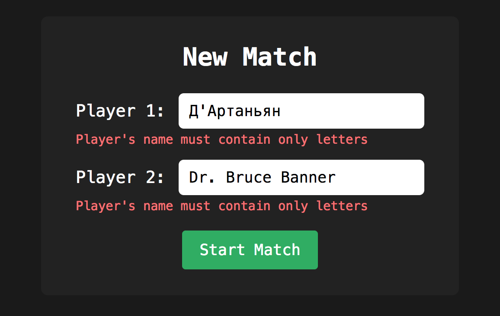
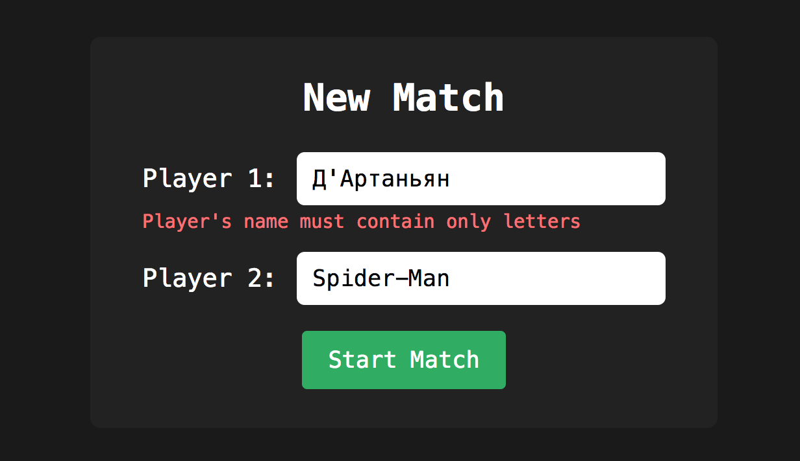
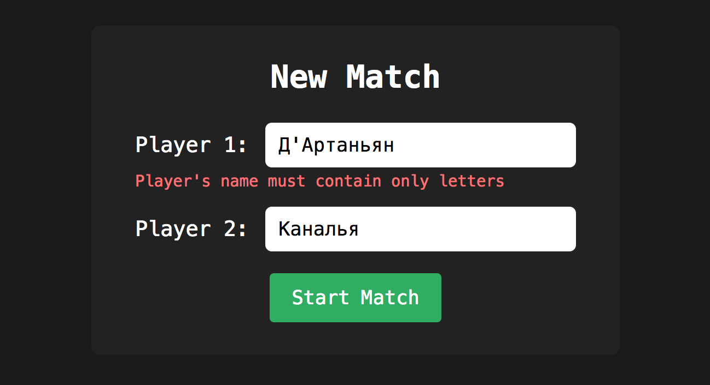
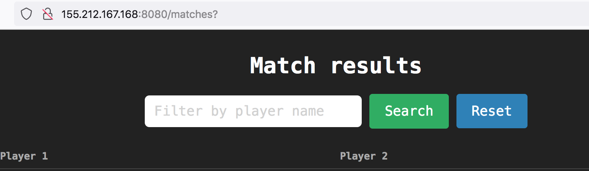
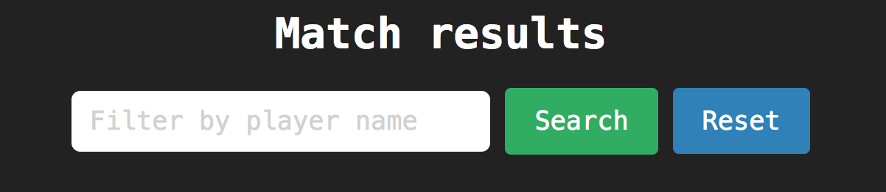

# Review на реализацию от [@kittyfoxxy](https://github.com/KittieFoxxy/tennis-scoreboard) проекта [Табло теннисного матча](https://zhukovsd.github.io/java-backend-learning-course/projects/tennis-scoreboard/)

```text
1. Знаком ❗️ помечены критически важные замечания, а также места нарушения ТЗ.
2. Если ❗️ стоит перед заголовком, значит он относится ко всем пунктам этого раздела.
3. Замечания, указанные в пункте с именем пакета, относятся ко всем классам этого пакета или ко всем классам этого слоя.
4. Знаком 💡 помечены блоки, в которых содержится подсказка по реализации какого-то приёма или части кода. 
   Такие пункты всегда находятся в сворачиваемом блоке и разворачиваются по нажатию. 
   Перед их раскрытием стоит постараться придумать или поискать решение самостоятельно. 
```


## Функциональный обзор

- Слишком строгая валидация имён.







Имена могут иметь дефисы, точки, апострофы, а также могут заканчиваться точкой — стоит разрешить указывать такие имена у игроков.

- При переходе со страницы завершённого матча на страницу списка матчей в адресной строке в конце отображается `?`



- На странице списка матчей текст плейсхолдера в поле фильтра можно заменить на "Enter player name"



## Entity
### Player

<div align="right">

[перейти к упоминанию в Match](#forward-from-player-to-match-1) </div>

<div align="right">

[перейти к упоминанию в NewMatchPayload](#forward-from-player-to-newmatchpayload-1) </div>

- ❗️Публичный конструктор без аргументов и сеттеры для каждого поля позволяют создавать игроков с заданным ID, а также изменять все поля после создания объекта или получения его из БД. Это нарушает инвариант "имя игрока должно быть неизменяемым после создания".

Вместо этого, для создания JPA Entity внутри приложения, лучше создавать специальные конструкторы, которые принимают только поля, необходимые для создания валидного объекта (в данном случае, только `name`).

Также это сделает создание объектов более лаконичным:

```java
/**
 * DefaultPlayerService
 */

public Player findOrRegisterPlayer(String name) {

    // сейчас так
    Player p = new Player();
    p.setName(name);

    // будет так
    Player p = new Player(name);

}
```

- Hibernate достаточно конструктора без параметров с уровнем доступа protected — поэтому можно создать его именно с таким модификатором доступа. Это предотвратит создание пустых, невалидных объектов из других частей приложения и будет сигналом другим разработчикам (потенциально), что этот конструктор предназначен в первую очередь для использования фреймворком, а не для прямого вызова в коде.

```java
@Entity
@Table(name = "PLAYERS")
public class Player {

    // поля

    /**
     * Конструктор без аргументов для использования Hibernate.
     */
    protected Player() {
    }

    /**
     * Публичный конструктор для создания игроков в коде приложения.
     */
    public Player(String name) {
        this.name = name;
    }

    // геттеры
    
}
```

- ❗️Публичный сеттер `setId(Long id)` позволяет создать объект Player c установленным ID. Для полей, которые генерируются в БД, лучше не давать такую возможность. Это может привести к рассинхронизации объекта с его представлением в базе данных и нарушить целостность данных.

- ❗️Публичный сеттер `setName(String name)` позволяет изменить имя игрока после создания или после получения из БД. Вместо публичного конструктора без аргументов и сеттера для каждого поля лучше создавать специальные конструкторы, которые принимают только поля, необходимые для создания валидного объекта (в данном случае, только `name`).

- Можно добавить параметр `updatable = false` в `@Column` для полей которые не должны изменяться в качестве дополнительной защиты целостности данных: `@Column(updatable = false)`.

- ❗️Конфликтующие правила валидации: `@Pattern(regexp = "^$|^[\\p{L}]+([\\s-][\\p{L}]+)*$")` разрешает пустую строку (из-за `^$` в начале регулярного выражения), в то время как `@NotBlank` её запрещает.

Имя игрока не может быть пустым, поэтому стоит удалить `^$` из регулярного выражения.

- Имена могут иметь дефисы, точки, апострофы, а также могут заканчиваться точкой:

```text
Spider-Man
Dr. Bruce Banner
Д'Артаньян
Robert Downey Jr.
```

Раз в приложении есть валидация, стоит учитывать эти варианты и изменить регулярное выражение, например так:

```regexp
^\p{L}+([\s.'-]\p{L}+)*$
```

- ❗️Неоднородные правила валидации длины имени: в классе Player диапазон длины имени `2 - 30` символов, а в классе NewMatchPayload `3 - 20` символов.

```java
/**
 * Player
 */

// здесь длина от 2 до 30
@Size(min = 2, max = 30, message = "Name must be between {min} and {max} characters.")
private String name;

/**
 * NewMatchPayload
 */

// здесь длина от 3 до 20
@Size(min = 3, max = 20, message = "Player name length must be between {min} and {max}")
String p1Name,

// здесь длина от 3 до 20
@Size(min = 3, max = 20, message = "Player name length must be between {min} and {max}")
String p2Name
```

Разные правила валидации на разных слоях (DTO и Entity) могут приводить к тому, что данные, валидные для одного слоя, оказываются невалидными для другого.

Будет уместно разрешить имена от `2` до `30` символов.

Также можно создать Единый источник истины для правил валидации имён.

[**Принцип Single Source of Truth (SSOT)**](#ssot-principle) <a id="back-to-player-from-ssot-principle"></a>

<details>

<summary><b>💡 Например так: 💡</b></summary>

---

```java
// Вынесли все значения в одно место
public final class ValidationConstants {
    private ValidationConstants() {
    }

    public static final int PLAYER_NAME_MIN_LENGTH = 2;
    public static final int PLAYER_NAME_MAX_LENGTH = 30;
    public static final String PLAYER_NAME_LENGTH_MESSAGE = "Player name length must be between {min} and {max}";
    public static final String PLAYER_NAME_PATTERN = "^\\p{L}+([\\s.'-]\\p{L}+)*$";
    public static final String PLAYER_NAME_PATTERN_MESSAGE = "Player's name must contain only letters";
    public static final String PLAYER_NAME_BLANK_MESSAGE = "Player name cannot be empty.";
}

@Entity
@Table(name = "PLAYERS")
public class Player {
    
    @Id
    @GeneratedValue(strategy = GenerationType.IDENTITY)
    private Long id;

    @NotBlank(message = ValidationConstants.PLAYER_NAME_BLANK_MESSAGE)
    @Size(
            min = ValidationConstants.PLAYER_NAME_MIN_LENGTH,
            max = ValidationConstants.PLAYER_NAME_MAX_LENGTH,
            message = ValidationConstants.PLAYER_NAME_LENGTH_MESSAGE)
    @Pattern(
            regexp = ValidationConstants.PLAYER_NAME_PATTERN,
            message = ValidationConstants.PLAYER_NAME_PATTERN_MESSAGE
    )
    @Column(unique = true, nullable = false)
    private String name;

    // конструкторы
    
    // геттеры
    
}

@DifferentPlayers
public record NewMatchPayload(
        @NotBlank(message = ValidationConstants.PLAYER_NAME_BLANK_MESSAGE)
        @Size(
                min = ValidationConstants.PLAYER_NAME_MIN_LENGTH,
                max = ValidationConstants.PLAYER_NAME_MAX_LENGTH,
                message = ValidationConstants.PLAYER_NAME_LENGTH_MESSAGE)
        @Pattern(
                regexp = ValidationConstants.PLAYER_NAME_PATTERN,
                message = ValidationConstants.PLAYER_NAME_PATTERN_MESSAGE
        )
        String p1Name,

        @NotBlank(message = ValidationConstants.PLAYER_NAME_BLANK_MESSAGE)
        @Size(
                min = ValidationConstants.PLAYER_NAME_MIN_LENGTH,
                max = ValidationConstants.PLAYER_NAME_MAX_LENGTH,
                message = ValidationConstants.PLAYER_NAME_LENGTH_MESSAGE)
        @Pattern(
                regexp = ValidationConstants.PLAYER_NAME_PATTERN,
                message = ValidationConstants.PLAYER_NAME_PATTERN_MESSAGE
        )
        String p2Name
) {
}
```

Следующим шагом можно создать отдельную аннотацию, агрегирующую все необходимые правила

```java
@NotBlank(message = ValidationConstants.PLAYER_NAME_BLANK_MESSAGE)
@Size(
        min = ValidationConstants.PLAYER_NAME_MIN_LENGTH,
        max = ValidationConstants.PLAYER_NAME_MAX_LENGTH,
        message = ValidationConstants.PLAYER_NAME_LENGTH_MESSAGE)
@Pattern(
        regexp = ValidationConstants.PLAYER_NAME_PATTERN,
        message = ValidationConstants.PLAYER_NAME_PATTERN_MESSAGE
)
@Target({ElementType.FIELD, ElementType.PARAMETER})
@Retention(RetentionPolicy.RUNTIME)
@Constraint(validatedBy = {})
public @interface PlayerName {
    String message() default "Invalid player name";

    Class<?>[] groups() default {};

    Class<? extends Payload>[] payload() default {};
}
```

И сделать классы ещё чище

```java
@Entity
@Table(name = "PLAYERS")
public class Player {
    
    @Id
    @GeneratedValue(strategy = GenerationType.IDENTITY)
    private Long id;

    @PlayerName
    @Column(unique = true, nullable = false)
    private String name;

    // конструкторы
    
    // геттеры
    
}

@DifferentPlayers
public record NewMatchPayload(
        @PlayerName
        String p1Name,

        @PlayerName
        String p2Name
) {
}
```

Что это даст:
- Соблюдение принципа DRY (Don't Repeat Yourself) — правила валидации определены в одном месте.
- Согласованность — гарантируется, что и на входе в систему (DTO), и перед сохранением в БД (Entity) применяются одни и те же правила.
- Упростит поддержку — для изменения правила (например, максимальной длины имени) достаточно внести правку в одном месте.

---

</details>

### Match

<a id="forward-from-player-to-match-1"></a>
- Пункты про:
    - конструктор без параметров
    - конструктор с параметрами для валидного создания объекта
    - ❗️публичные сеттеры

которые описаны в разделе [**Player**](#player) актуальны и для этого класса.

- Цифры в именах переменных. Переменные с именами `player1` и `player2` проще перепутать при использовании и чтении, чем, например, `firstPlayer` и `secondPlayer`. Вторая причина не использовать цифры в именах переменных (особенно парных) в том, что при начале ввода в Idea имени в первом случае (`player1` и `player2`) она не всегда предложит нужное дополнение (чтобы просто нажать Enter или Tab после начала ввода), а в другом случае (`firstPlayer` и `secondPlayer`) префиксы имён переменных отличаются явно — это немного упрощает и ускоряет написание кода.

- ❗️Слово `MATCHES` (а также `MATCH`) является зарезервированным ключевым словом в некоторых диалектах SQL (например, для оператора `MATCH ... AGAINST` в полнотекстовом поиске). Не стоит использовать зарезервированные слова в качестве имён таблиц. Хотя в конкретно в этом проекте проблем с этим не возникнет, лучше выбрать более безопасное имя для таблицы, например, `TENNIS_MATCHES` или `FINISHED_MATCHES`.

[Использование зарезервированных слов в качестве названий в БД](#sql-keywords) <a id="back-to-match-from-sql-keywords"></a>

- Можно добавить параметр `updatable = false` в `@JoinColumn` для полей которые не должны изменяться в качестве дополнительной защиты целостности данных: `@JoinColumn(..., updatable = false)`.

- Когда название колонки в БД отличается от названия переменной в классе, лучше явно указывать название колонки в аннотации `@JoinColumn`: `@JoinColumn`

Сейчас так
```java
public class Match {
    @ManyToOne(optional = false)
    @JoinColumn(nullable = false)
    private Player player1;

    @ManyToOne(optional = false)
    @JoinColumn(nullable = false)
    private Player player2;

    @ManyToOne(optional = false)
    @JoinColumn(nullable = false)
    private Player winner;
}
```

Лучше так
```java
public class Match {
    @ManyToOne(optional = false)
    @JoinColumn(name = "first_player_id", nullable = false, updatable = false)
    private Player firstPlayer;

    @ManyToOne(optional = false)
    @JoinColumn(name = "second_player_id", nullable = false, updatable = false)
    private Player secondPlayer;

    @ManyToOne(optional = false)
    @JoinColumn(name = "winner_id", nullable = false, updatable = false)
    private Player winner;
}
```

- ❗️Риск нарушения целостности данных. Класс не имеет механизмов, которые бы гарантировали на уровне схемы базы данных выполнение ключевых бизнес-правил:
    - Игрок не может играть сам с собой (`player1` должен отличаться от `player2`).
    - Победителем (`winner`) должен быть один из участников матча (`player1` или `player2`).

Хотя логика в сервисном слое может предотвращать создание некорректных матчей, база данных этого не гарантирует. Прямой SQL-запрос или ошибка в другом модуле приложения могут привести к созданию невалидных данных (например, матч, где `player1_id = 5` и `player2_id = 5`).

Защита должна быть на всех уровнях, поэтому стоит добавить ограничения, проверяющие, что игроки разные и победителем является один из участников матча.

<details>

<summary><b>💡 Например так 💡</b></summary>

---

```java
@Entity
@Table(name = "MATCHES")
@Checks({
        @Check(constraints = "first_player_id <> second_player_id"),
        @Check(constraints = "winner_id = first_player_id OR winner_id = second_player_id")
})
public class Match {
    
}
```

Что это даст:
- Гарантирует целостность данных даже при прямом доступе к БД.
- Снижает риск появления невалидных данных из-за ошибок в коде или внешних вмешательств.
- Схема базы данных будет явно отражать бизнес-правила.

---

</details>

## Model

<div align="right">

[Перейти к упоминанию в ActiveMatches](#back-from-model-to-activematches-1)</div>

- Идея разделить ответственность за обновление счёта по классам матча, сета, гейма и тай-брейка хорошо подходит для этого проекта. Также правильно — вынести общие поля и методы в базовый класс. Но в текущей реализации есть некоторые признаки анемичных доменных моделей — классы предоставляют наружу данные, которые участвуют в логике начисления очков и не должны быть доступны извне. Также некоторым классам нехватает методов, которые сообщали бы нужную для внешней логики инфомацию и при этом не раскрывали внутреннего устройства подсчёта очков.

[**Анемичная vs Богатая модель предметной области**](#reach-anemic-model) <a id="back-to-model-from-reach-anemic-model"></a>

Стоит подумать, как модернизировать текущие классы моделей в сторону полноценных (богатых) доменных моделей.

<details>

<summary><b>💡 Например так 💡</b></summary>

---

1. Классы моделей могут содержать имена игроков, вместо перечисления `PlayerSide`. Тогда в хранилище текущих матчей можно будет хранить доменную модель самого матча и после завершения из доменной модели маппить JPA-Entity, которая сохранится в БД. Это избавит от промежуточных классов с нечёткой ответственностью (`ActiveMatch` и `ActiveMatchModel`).

2. Вместо того чтобы сообщать данные о состоянии матча и позволять внешнему коду принимать решение о завершении игры, класс матча-доменной-модели может иметь метод `boolean isFinished()`, который сам будет сообщать, завершён ли матч. Это сделает модель матча более "богатой" и упростит внешнюю бизнес-логику.

---

</details>

- Вместо суффикса `Score` классам в этом пакете можно подобрать более подходящий по смыслу. Например, `GameLevel`. Тогда состояние (`enum State`) будет не у Счёта (`Score`), а у Игрового уровня, что семантически более оправдано.

- Аргументам методов и переменным `PlayerSide player` лучше дать более подходящее название — `PlayerSide playerSide`, а название `player` употреблять только для объектов класса `Player`.

### Score

<div align="right">

[перейти к упоминанию в PointScore](#forward-from-score-to-pointscore-1) </div>

<div align="right">

[перейти к упоминанию в SetScore](#forward-from-score-to-setscore-1) </div>

<div align="right">

[перейти к упоминанию в MatchScore](#forward-from-score-to-matchscore-1) </div>

- Использование `Map` для двух предопределённых, фиксированных ключей (`PlayerSide.ONE` и `PlayerSide.TWO`) является излишним усложнением (over-engineering). `Map` подразумевает динамическое количество ключей, но в теннисе всегда ровно два игрока (или две стороны), поэтому лучше заменить `Map` на два отдельных поля. (О проблеме с `protected` полями будет сказано ниже, в этом пункте фокусируемся на использовании `Map`).

```java
public abstract class Score<T> {

    protected T firstPlayerScore;
    protected T secondPlayerScore;

    public Score(T firstPlayerScore, T secondPlayerScore) {
        this.firstPlayerScore = firstPlayerScore;
        this.secondPlayerScore = secondPlayerScore;
    }

    public T getScoreForPlayer(PlayerSide player) {
        return player == PlayerSide.ONE ? firstPlayerScore : secondPlayerScore;
    }
    // ...
}
```

- ❗️Публичный конструктор

```java
public Score(T p1Score, T p2Score) {
    score.put(PlayerSide.ONE, p1Score);
    score.put(PlayerSide.TWO, p2Score);
}
```

позволяет создать объект с любым произвольным счётом. Это открывает возможность для создания невалидных состояний (например, `new GameScore(GamePoints.ADVANTAGE, GamePoints.ADVANTAGE)`).

Объект, отвечающий за счёт, должен сам гарантировать свою целостность. Позволяя создавать себя в некорректном начальном состоянии, он перекладывает эту ответственность на внешний код. Это делает систему менее надёжной.

Стоит сделать единственным публичным конструктором — конструктор без аргументов, который гарантированно устанавливает счёт в начальное, валидное состояние.

```java
public abstract class Score<T> {
    protected T firstPlayerScore;
    protected T secondPlayerScore;

    public Score() {
        this.firstPlayerScore = getInitialValue();
        this.secondPlayerScore = getInitialValue();
    }

    protected abstract T getInitialValue();
    // ...
}
```

Это гарантирует, что любой созданный объект счёта всегда находится в корректном начальном состоянии (например, `0-0`). Класс будет сам управлять своим начальным состоянием и не позволит создать себя некорректно.

- Метод `abstract T getStartScore()` имеет сбивающее с толку имя (звучит как геттер для объекта `Score`). Это нарушает Принцип наименьшего удивления — имя метода не соответствует тому, что он возвращает (`T`, а не `Score`). Стоит переименовать метод так, чтобы он точнее отражал свою суть. Например в `abstract T getInitialValue()`

[**Принцип наименьшего удивления (Principle of Least Astonishment, POLA)**](#pola) <a id="back-to-score-from-pola"></a>

- ❗️Метод `public abstract T getStartScore()` имеет неоправданно широкую область видимости (`public`). Это нарушает инкапсуляцию: Метод является деталью внутренней реализации, необходимой для конструктора и метода `reset()`. Делая его `public`, мы выставляем эту деталь наружу, хотя внешнему коду она не нужна. Стоит ограничить его видимость до `protected`: `protected abstract T getInitialValue()`.

- Название метода `T scoreOf(PlayerSide player)` говорит, что метод извлекает счёт из переданного аргумента (как `Integer.valueOf("123")`). Но метод возвращает значение счёта игрока, поэтому стоит дать ему более подходящее название, например `getScoreValueForPlayerSide` или `getPlayerSideScoreValue`.

- Сейчас перечисление `enum State` является важной публичной концепцией (представляет собой общее доменное понятие — состояние матча/сета/гейма), но объявлено как вложенный класс внутри `Score`. `State` — это фундаментальное состояние, которое может быть применимо к различным аспектам теннисного матча (матч, сет, гейм). Привязка его исключительно к абстрактному `Score` может быть неоправданной. Лучше вынести его в отдельный публичный файл `ScoreState` или `GameState`. Это даст более чёткое разделение ответственности и более логичное расположение сущностей.

- Имена состояний `PLAYER_ONE_WINS` / `PLAYER_TWO_WINS` описывают действие в настоящем времени ("игрок выигрывает"), а не свершившийся факт ("игрок выиграл"). Точнее будет назвать их `PLAYER_ONE_WON` и `PLAYER_TWO_WON` (или `FIRST_PLAYER_WON` и `SECOND_PLAYER_WON`).

- Полю `Map<PlayerSide, T> score = new EnumMap<>(PlayerSide.class);` стоит подобрать полее подходящее название, например `values`, а название `score` оставить для переменных типа `Score`.

- ❗️Поле `score` объявлено как `protected`:

```java
public abstract class Score<T> {
    protected final Map<PlayerSide, T> score = new EnumMap<>(PlayerSide.class);
    // ...
}
```

Это позволяет любому подклассу напрямую изменять содержимое карты `score`, обходя методы базового класса (например, `reset()` или будущие методы изменения счёта).

Это нарушает принцип **инкапсуляции** и создает **"хрупкий базовый класс"**. Если логика изменения состояния `score` будет расширяться или изменяться в базовом классе, подклассы, напрямую работающие с полем `score`, могут быть сломаны.

[**Хрупкий базовый класс (The Fragile Base Class)**](#fragile-base-class) <a id="back-from-fragile-base-class-to-score"></a>

**Как исправить:**
Изменить модификатор доступа поля `score` с `protected` на `private`. Если подклассам необходим доступ к карте, следует предоставить `protected` методы-обертки для контролируемого доступа или изменения состояния.

<details>

<summary><b>💡 Например так 💡</b></summary>

---

```java
public abstract class Score<T> {
  private final Map<PlayerSide, T> values = new EnumMap<>(PlayerSide.class); // название score больше соотвествовало

  protected void setValue(PlayerSide playerSide, T value) {
    // Здесь можно добавить базовые проверки, если необходимо
    values.put(playerSide, value);
  }

  protected T getValueFor(PlayerSide playerSide) {
    return values.get(playerSide);
  }
  // ...
}
```

Что это даст:
- Улучшит инкапсуляцию — класс будет полностью контролировать своё внутреннее состояние.
- Повысит надёжность — подклассы не смогут случайно или намеренно нарушить инварианты `Score`.
- Облегчит рефакторинг — изменение внутренней реализации `score` в базовом классе (например, предложоенный переход от Map к отдельным полям) не повлияет на подклассы, пока сохраняется контракт `setScore` / `getScore`.
- Снизит связанность — подклассы будут зависеть от поведения (методов), а не от внутренней реализации (полей).

---

</details>

- Методу `public abstract State up(PlayerSide player)` можно дать более выразительное имя, например `pointWonBy(PlayerSide playerSide)` (а также переименовать аргумент).

### PointScore

- Пункты, касающиеся унаследованных от базового класса полей и методов, которые описаны в разделе [**Score**](#score), актуальны и для этого класса. <a id="forward-from-score-to-pointscore-1"></a>

- В методе `State up(PlayerSide player)` когда у соперника преимущество, то надо только вернуть его счёт до `40`, а игроку, выигравшему очко, менять счёт (или повторно его устанавливать) не надо.

```java
if (opponentPoints == GamePoints.ADVANTAGE) {
    score.put(player, GamePoints.FORTY); // эта строка не нужна
    score.put(opponent, GamePoints.FORTY);
    return State.ON_GOING;
}
```

- Повторяющийся код `return player == PlayerSide.ONE ? State.PLAYER_ONE_WINS : State.PLAYER_TWO_WINS;` можно вынести в метод с понятным названием.

Например такой:

```java
private State getState(PlayerSide player) {
    return player == PlayerSide.ONE ? State.PLAYER_ONE_WINS : State.PLAYER_TWO_WINS;
}
```

- ❗️Вызов `reset()` внутри метода `up()` создаёт неожиданный побочный эффект (нарушает [**Принцип наименьшего удивления (Principle of Least Astonishment, POLA)**](#pola) <a id="back-to-point-score-from-pola"></a>) и нарушает Принцип Единственной Ответственности (SRP) на уровне метода:

    - **Нарушение Принципа наименьшего удивления (Principle of Least Astonishment):**
        - Метод с названием `up()` по своему имени обещает увеличить счёт.
        - Разработчик, вызывающий этот метод, не ожидает, что он, помимо своего основного действия, может внезапно сбросить счёт к нулю.
        - Такое неожиданное поведение, скрытое внутри метода, делает код менее предсказуемым и сложным для отладки.

    - **Нарушение Принципа Единственной Ответственности (SRP) для метода:**
        - Метод `up()` должен отвечать только за одну вещь: обновить счёт на один пункт и определить, к какому исходу это привело в рамках текущего гейма.
        - Метод `reset()` отвечает за другую вещь: приведение счёта в начальное состояние для следующего гейма. `PointScore` начинает неявно управлять жизненным циклом целой серии геймов. Он "знает", что после победы в одном гейме сразу же начнется следующий, и готовит себя к нему. Эта ответственность должна лежать на более высоком уровне (например, на `SetScore`).

Вызов `reset()` внутри метода `up()` — это пример, когда класс берет на себя слишком много ответственности, что приводит к созданию непредсказуемого и менее гибкого кода. Разделение ответственности, когда `PointScore` отвечает только за счёт текущего гейма, а его "владелец" — за переход между геймами, является более чистым и надёжным подходом.

- Метод `up()` можно разделить на несколько маленьких, хорошо именованных методов.

<details>

<summary><b>💡 Например так 💡</b></summary>

---

```java
@Override
public State up(PlayerSide player) {
    GamePoints selfPoints = this.scoreOf(player);
    GamePoints opponentPoints = this.scoreOf(player.opposite());

    if (selfPoints == GamePoints.ADVANTAGE) {
        return handleWinFromAdvantage(player);
    }
    if (opponentPoints == GamePoints.ADVANTAGE) {
        return handleLosingAdvantage(player.opposite());
    }
    if (selfPoints == GamePoints.FORTY && opponentPoints == GamePoints.FORTY) {
        return handleDeuce(player);
    }
    if (selfPoints == GamePoints.FORTY) {
        return handleWinFromForty(player);
    }
    return handleSimplePoint(player);
}

private State handleWinFromAdvantage(PlayerSide winner) {
    reset();
    return winner == PlayerSide.ONE ? State.PLAYER_ONE_WON : State.PLAYER_TWO_WON;
}

private State handleLosingAdvantage(PlayerSide opponent) {
    score.put(opponent, GamePoints.FORTY);
    return State.ON_GOING;
}

private State handleDeuce(PlayerSide player) {
    score.put(player, GamePoints.ADVANTAGE);
    return State.ON_GOING;
}

private State handleWinFromForty(PlayerSide winner) {
    reset();
    return winner == PlayerSide.ONE ? State.PLAYER_ONE_WON : State.PLAYER_TWO_WON;
}

private State handleSimplePoint(PlayerSide player) {
    score.put(player, scoreOf(player).next());
    return State.ON_GOING;
}
```

- Что это даст:
    - Повысит читаемость: Каждый метод выполняет одно простое действие, и его название говорит само за себя. Логика `up()` становится декларативной.
    - Упростит тестирования: Появляется возможность писать юнит-тесты для каждого метода в отдельности, изолированно проверяя логику "ровно" или "больше".
    - Облегчает поддержку: Изменение правил игры (например, правил тай-брейка) затронет только один или два небольших метода, что снижает риск внесения ошибок.

---

</details>

### SetScore

- Пункты, касающиеся унаследованных от базового класса полей и методов, которые описаны в разделе [**Score**](#score), актуальны и для этого класса. <a id="forward-from-score-to-setscore-1"></a>

- Метод `getCurrentScore(PlayerSide player)` своим названием обещает вернуть объект типа `Score`, но на самом деле возвращает его строковое представление (`String`). Стоит переименовать метод так, чтобы его имя чётко отражало тип возвращаемого значения.

- ❗️Присвоение полю класса `Score<?> currentScore` нового объекта тай-брейка `currentScore = new TieBreakScore();` является побочным эффектом для метода `evaluateSetState()`.

- Возможно, блок

```java
if (State.ON_GOING == gameState) {
    return State.ON_GOING;
}
```

лучше читается так

```java
if (gameState == State.ON_GOING) {
    return gameState;
}
```

- Метод `up()` можно разделить на несколько маленьких, хорошо именованных методов.

В таком духе:

```java
@Override
public State up(PlayerSide player) {
    State gameState = currentScore.up(player);

    if (shouldContinueSet(gameState)) {
        return State.ON_GOING;
    }

    increaseScore(player);

    if (shouldStartTieBreak()) {
        startTieBreak();
    }

    return gameState;
}
```

- Ослабленная типобезопасность. Поле `currentScore` объявлено с использованием wildcard `Score<?>`:

```java
private Score<?> currentScore = new PointScore();
```
Использование этого поля требует приведения типов через `switch` выражения:

```java
return switch (currentScore) {
    case PointScore pointScore -> pointScore.scoreOf(player).display();
    case TieBreakScore tieBreakScore -> tieBreakScore.scoreOf(player).toString();
    default -> throw new IllegalStateException("Unexpected value: " + currentScore);
};
```

Такой подход нарушает Принцип Открытости/Закрытости (Open/Closed Principle, OCP). Класс `SetScore` не закрыт для модификации: при добавлении нового типа гейма придётся изменять исходный код `SetScore`, дописывая в него новый `case`.

Кроме того, это указывает на проблемы, связанные с Принципом подстановки Лисков (LSP). Абстракция `Score` оказывается недостаточной для клиента (`SetScore`), который не может работать с ней единообразно. Вместо того чтобы полиморфно вызывать методы, клиент вынужден нарушать абстракцию и запрашивать конкретный тип (`PointScore` или `TieBreakScore`), что говорит о том, что наследники `Score` не являются полностью взаимозаменяемыми в данном контексте.

<details>

<summary><b>💡 Есть несколько способов исправить это 💡</b></summary>

---

1. Паттерн "Состояние" (State Pattern): Создать интерфейс `SetState` (или аналогичный), который будут реализовывать `RegularGameState` (для `PointScore`) и `TieBreakGameState` (для `TieBreakScore`). `SetScore` тогда будет содержать `SetState`. Это позволит убрать `switch` и делегировать поведение текущему состоянию.
2. Композиция с явными полями: `SetScore` может содержать `PointScore` и `TieBreakScore` как отдельные поля, а логика в `up()` будет выбирать, какой из них использовать в зависимости от текущего режима сета (обычный гейм или тай-брейк).
3. Обобщенный интерфейс для `currentScore`: Если `PointScore` и `TieBreakScore` будут иметь общий интерфейс (например, `LowGameLevel`), то поле `currentScore` может быть типа `LowGameLevel`, а не `Score<?>`.

Что это даст:
- Улучшенная типобезопасность: Код станет более надёжным, так как компилятор сможет отлавливать ошибки.
- Более чистый дизайн: Устранение `switch` по типу улучшает читаемость и поддерживаемость кода.
- Соблюдение SOLID: Лучше соответствует LSP и OCP.
- Единообразие в вызове методов: Для получения строкового значения (`LowGameLevel` может содержать метод `String getDisplayValue()`)

---

</details>

- Можно рассмотреть вариант рефакторинга, где класс будет содержать не одно поле текущего гейма (или тай-брейка), а список из геймов. Это будет точнее отображать предметную область и позволит не сбрасывать очки в объекте гейма, а использовать новый объект. А также создаст историю счёта, которая понадобится при развитии проекта.

### MatchScore

- Пункты, касающиеся унаследованных от базового класса полей и методов, которые описаны в разделе [**Score**](#score), актуальны и для этого класса. <a id="forward-from-score-to-matchscore-1"></a>

- Константе `private static final int WIN_POINTS = 2;` можно дать ещё более точное название, например `MIN_POINTS_TO_WIN` или `SETS_TO_WIN`.

- Для хранения используется `Map`, поэтому нет причин присваивать ключам значения, начиная с `0`:

```java
public class MatchScore extends Score<Integer> {
    private static final int SET_ONE = 0;
    private static final int SET_TWO = 1;
    private static final int SET_THREE = 2;
  
    // ...
  
    public MatchScore() {
        super(START_VALUE, START_VALUE);
        sets.put(SET_ONE, new SetScore());
        sets.put(SET_TWO, new SetScore());
        sets.put(SET_THREE, new SetScore());
    }
  
    // ...
  
}
```

Лучше создавать ключи, начиная с `1`. Ещё это сделает значения этих полей соответствующими их названиям.

- Поле `private int CURRENT_SET = SET_ONE;` не является константой, поэтому стоит переименовать его в стиле camelCase.

- Для хранения сетов используется `Map<Integer, SetScore>`, а для отслеживания текущего сета — отдельная переменная-счетчик `CURRENT_SET`. При этом в конструкторе сразу создаются все три объекта `SetScore`, даже если матч может завершиться после двух.

Это ведёт к:

- Несоответствию жизненному циклу: Объекты `SetScore` создаются до того, как в них возникает реальная необходимость.
- Избыточному созданию объектов: Всегда создаётся 3 сета, даже если матч закончится после двух.
- Добавляет возможности для ошибок: Ручное управление индексом текущего сета (`CURRENT_SET++`) — это хрупкий механизм, в котором легко допустить ошибку.
- Создаёт излишнюю сложность: `Map` с целочисленными ключами, начинающимися с 0, семантически является списком. Использование `Map` вместо `List` делает код менее понятным.

Если использовать для хранения сетов коллекцию, поддерживающую порядок добавления элементов и добавлять в неё сеты "лениво", по мере их начала, то можно избавиться от констант для ключей, упростить код и сделать его более соответствующим предметной области.

<details>

<summary><b>💡 Например так 💡</b></summary>

---

```java
public class MatchScore extends Score<Integer> {
    
    private static final int START_VALUE = 0;
    private static final int WIN_POINTS = 2;
    private final Queue<SetScore> sets;
    
    public MatchScore() {
        super(START_VALUE, START_VALUE);
        this.sets = new ArrayDeque<>();
        this.sets.offer(new SetScore());
    }

    @Override
    public State up(PlayerSide player) {
        SetScore currentSetScore = sets.peek();
        State state = currentSetScore.up(player);
        if (State.ON_GOING != state) {

            score.merge(player, 1, Integer::sum);
            sets.offer(new SetScore());

            if (scoreOf(player) == WIN_POINTS) {
                return state;
            }

        }
        return State.ON_GOING;
    }
    
    // ...
  
}
```

Что это даст:
- Эффективность: Объекты `SetScore` создаются только тогда, когда они действительно нужны.
- Упрощение кода: Исчезает необходимость в ручном управлении индексом `CURRENT_SET`.
- Повышение читаемости: `Queue` (или `List`) семантически точно отражает упорядоченную последовательность сетов.

---

</details>

- Значение `1` из `score.put(player, scoreOf(player) + 1);` можно вынести в константу с понятным названием. Например `private static final int INCREMENT_VALUE = 1;`.

- ❗️Публичные методы `getSetScore` и `getPointScore` вызываются из HTML.

```xml
<!-- в match-score.html -->

<div class="score-box current-points" th:text="${view.score.getPointScore(P1)}">0</div>
<div class="score-box" th:text="${view.score.getSetScore(0, P1)}">0</div>
<div class="score-box" th:text="${view.score.getSetScore(1, P1)}">0</div>
<div class="score-box" th:text="${view.score.getSetScore(2, P1)}">0</div>
```

Это смешивает слои приложения. Лучше не передавать доменные модели в слой преставления (view) и использовать для этой цели DTO, которые будут содержать все необходимые данные. Такой подход сделает архитектуру приложения более чистой.

### GamePoints

- ❗️Метод `next()` не полностью отражает логику начисления очков в теннисе. Он не обрабатывает переход от `FORTY` к `ADVANTAGE`, а вместо этого просто возвращает `FORTY`. Такое поведение не соответствует названию метода и перекладывает сложную логику на вызывающий код.

Это нарушает Принцип инкапсуляции и [**Принцип наименьшего удивления (Principle of Least Astonishment, POLA)**](#pola) <a id="back-to-gamepoints-from-pola"></a>. Класс, который использует `GamePoints`, ожидает, что вызов `point.next()` вернёт следующее по порядку значение. Текущая реализация "молча" возвращает неверный результат в случаях `FORTY` и `ADVANTAGE`, заставляя внешний код (например, `PointScore`) содержать логику для обработки этих ситуаций.

Стоит изменить метод так, чтобы он соответствовал своей семантике "дать следующее очко".
- При вызове на `FORTY` он должен возвращать `ADVANTAGE`.
- При вызове на `ADVANTAGE` он должен выбрасывать исключение `IllegalStateException`, так как простого "следующего" очка не существует — это уже выигрыш гейма, что является особым состоянием, обрабатываемым на более высоком уровне.

```java
public GamePoints next() {
    return switch (this) {
        case LOVE -> FIFTEEN;
        case FIFTEEN -> THIRTY;
        case THIRTY -> FORTY;
        case FORTY -> ADVANTAGE;
        case ADVANTAGE -> throw new IllegalStateException("Has not next value for ADVANTAGE");
    };
}
```

Так метод становится более предсказуемым — он явно сообщает об ошибке проектирования (попытка получить "следующее" очко после `ADVANTAGE`), а не молча возвращает некорректный результат.

- Метод `display()` вычисляет строковое представление, используя конструкцию `switch` при каждом своем вызове.

```java
public String display() {
    return switch (this) {
        case LOVE -> "0";
        case FIFTEEN -> "15";
        case THIRTY -> "30";
        case FORTY -> "40";
        case ADVANTAGE -> "AD";
    };
}
```

Это неэффективное и неидиоматичное использование `enum`. `Enum` — это набор статичных синглтон-объектов. Их строковое представление неизменно. Выполнять `switch`-проверку каждый раз — это лишняя вычислительная работа, хотя в данном случае и очень незначительная.

Вместо этого можно хранить строковое представление в `private final` поле и инициализировать его в конструкторе `enum`.

```java
public enum GamePoints {
    LOVE("0"),
    FIFTEEN("15"),
    THIRTY("30"),
    FORTY("40"),
    ADVANTAGE("AD");

    private final String stringValue;

    GamePoints(String stringValue) {
        this.stringValue = stringValue;
    }

    public String stringValue() {
        return stringValue;
    }

    // ... метод next()

}
```

Ещё лучшим подходом будет вынести логику отображения из `enum` в отдельный компонент (например, `Mapper` или `Formatter`), который будет находиться ближе к слою представления.

## web
### view

- Имена классов `FinishedMatchView`, `MatchResultView`, `MatchScoreView` используют суффикс `View`. Хотя это допустимо, суффикс `Dto` является более общепринятым в backend-разработке для объектов, передающих данные.

<a id="forward-from-matchmapper-to-view"></a>
- Большая часть данных в классах `FinishedMatchView`, `MatchResultView`, `MatchScoreView` совпадает. По смыслу это тоже классы, отображающие одну сущность, — теннисный матч. Поэтому будет уместно создать один общий класс представления (например, `MatchDto`) с опциональными полями для специфических данных и использовать его, оставляя пустыми поля, значение для которых ещё не определено. &nbsp; [Перейти к упоминанию в MatchMapper](#back-from-view-to-matchmapper)

<details>

<summary><b>💡 Например такой 💡</b></summary>

---

```java
public record MatchDto(
        UUID matchId,
        PlayerDto firstPlayer,
        PlayerDto secondPlayer,
        PlayerDto winner,
        ScoreDto score
) {
}
```

---

</details>

- Полям `p1` и `p2` стоит дать более информативные имена, например, `firstPlayer` и `secondPlayer`.

- ❗️Классы содержат JPA Entity (`Player`), а их экземпляры напрямую передаются во View (используются как DTO). Прямое использование JPA Entity в слое представления (View) или DTO (Data Transfer Object) не является хорошим подходом и нарушает принцип разделения ответственности между слоями приложения.

Это создает жесткую связь между слоями и усложняет их независимое изменение или замену. А также порождает проблемы с безопасностью: JPA Entity часто содержат поля, которые не должны быть напрямую доступны или отображаться в UI (например, хеши паролей, служебные или конфиденциальные данные).

Слой представления (View), который будет использовать этот DTO, не должен ничего знать о JPA-сущностях или внутренних доменных моделях.

Как исправить: Надо чтобы все поля в DTO были тоже DTO (Data Transfer Objects) или примитивными типами.

Также стоит сделать DTO для объекта счёта (сейчас это объект доменной модели).

[**"Типы моделей" в веб-приложении**](#model-types) <a id="back-from-model-types-to-view"></a>

## persistence

### Queries

- Интерфейс назван `Queries` (запросы), такое название не даёт достаточно информации о том, за какую доменную область отвечает этот DAO. В большом проекте может быть множество подобных "запросов". Хорошее именование — ключ к пониманию кода, поэтому можно подумать о переименовании интерфейса так, чтобы он отражал сущности, с которыми работает, например, в `MatchDAO` или подобрать другое более удачное название.

- Ключевые слова HQL (`select`, `from`, `join fetch` и т.д.) написаны в нижнем регистре. Хотя это и не влияет на работоспособность, написание ключевых слов SQL/HQL в верхнем регистре (`UPPERCASE`) является общепринятым стандартом. Это значительно улучшает читаемость запросов, так как визуально отделяет синтаксические конструкции языка от имён сущностей и полей.

- Для выполнения регистронезависимого поиска используется функция `lower()` как для параметра, так и для поля в базе данных (`lower(m.player1.name)`). Вместо этого можно использовать возможности базы данных для регистронезависимого поиска — в H2 можно использовать ключевое слово `ILIKE`.

- Для получения общего количества записей используется оконная функция `count(m) over()`. Оконные функции на некоторых СУБД могут быть менее производительными, чем простой `COUNT(*)`. Особенно, если база данных вычисляет это значение для каждой строки результата перед его "схлопыванием" (скорее всего в большинстве БД этот процесс оптимизирован и количество не вычисляется заново).

Также, сейчас общее количество записей возвращается в каждой строке результата, что приводит к передаче избыточных данных между базой данных и приложением.

Решением может быть — разделить получение данных для пагинации на два отдельных метода: один для получения списка матчей с пагинацией, другой — для получения общего количества.

```java
@HQL("""
          SELECT m
          FROM Match m
          JOIN FETCH m.player1
          JOIN FETCH m.player2
          JOIN FETCH m.winner
          WHERE (:playerName IS NULL
                 OR m.player1.name ILIKE concat('%', :playerName, '%')
                 OR m.player2.name ILIKE concat('%', :playerName, '%'))
          ORDER BY m.id DESC
      """)
List<Match> findMatchesByPlayerName(String playerName, Page page);

@HQL("""
          SELECT count(m)
          FROM Match m
          WHERE (:playerName IS NULL
                 OR m.player1.name ILIKE concat('%', :playerName, '%')
                 OR m.player2.name ILIKE concat('%', :playerName, '%'))
      """)
long countMatchesByPlayerName(String playerName);
```

Такой подход:
- Упростит HQL-запросы и код в целом (отпадёт необходимость класса `MatchWithTotalCount`).
- Возможно немного повысит производительность (сократит небольшую, но всё-таки необязательную дополнительную передачу данных).

### HibernateSessionFactory

- Сейчас класс имеет стандартный публичный конструктор по умолчанию, что позволяет создавать его экземпляры (`new HibernateSessionFactory()`). Этот класс является утилитным и не предназначен для создания экземпляров. Разрешение инстанцирования может ввести в заблуждение других разработчиков и привести к неправильному использованию класса. Стоит добавить приватный конструктор, чтобы явно запретить создание экземпляров класса извне.

- ❗️В текущей реализации отсутствует метод для закрытия `SessionFactory` при остановке приложения. `SessionFactory` владеет важными ресурсами, включая пул соединений с базой данных. Если эти ресурсы не освободить корректно, это может привести к утечкам памяти и проблемам с подключением к БД, особенно в окружениях, которые не управляют жизненным циклом приложения автоматически.

Стоит добавить статический метод `shutdown()` (покажу в примере к следующему пункту), который будет закрывать `SessionFactory` и вызывать его при завершении работы приложения (например, в `contextDestroyed` для `ServletContextListener`). Такой подход гарантирует, что все ресурсы, удерживаемые Hibernate, будут освобождены при остановке приложения и предотвращает потенциальные утечки и ошибки, связанные с "висячими" соединениями.

- ❗️Класс создаёт новый экземпляр `SessionFactory` при каждом вызове статического метода `build()`. `SessionFactory` — это тяжеловесный и потокобезопасный объект, который спроектирован для существования в единственном экземпляре на всё приложение. Создание `SessionFactory` — очень ресурсозатратная операция. Создание нескольких экземпляров (или даже постоянный вызов метода `build()` для получения объекта `SessionFactory` — сейчас есть такая возможность) приведёт к деградации производительности и утечке ресурсов, так как каждый новый экземпляр будет создавать свой пул соединений. В текущей реализации можно использовать паттерн "Singleton", чтобы гарантировать, что `SessionFactory` создаётся только один раз за всё время жизни приложения.

<details>

<summary><b>💡 Например так 💡</b></summary>

---

```java
public final class HibernateSessionFactory {
    
    private HibernateSessionFactory() {
    }

    private static class SessionFactoryHolder {
        private static final SessionFactory INSTANCE = buildSessionFactory();

        private static SessionFactory buildSessionFactory() {
            try {
                return new Configuration()
                        .addAnnotatedClass(Player.class)
                        .addAnnotatedClass(Match.class)
                        .buildSessionFactory();
            } catch (Throwable ex) {
                throw new ExceptionInInitializerError(ex);
            }
        }
    }

    public static SessionFactory getSessionFactory() {
        return SessionFactoryHolder.INSTANCE;
    }

    public static void shutdown() {
        if (SessionFactoryHolder.INSTANCE != null) {
            SessionFactoryHolder.INSTANCE.close();
        }
    }
}
```

---

</details>

Другой вариант гарантировать существование `SessionFactory` в единственном экземпляре — привязать жизненный цикл `SessionFactory` к жизненному циклу самого приложения. То есть реализовать класс как `ServletContextListener`.

## service

### DefaultPlayerService

- ❗️Сейчас сервис напрямую использует `SessionFactory` для работы с БД. Это создаёт жёсткую зависимость от конкретного ORM-фреймворка. При переходе с Hibernate на другое решение, пришлось бы изменять код сервиса, хотя его бизнес-логика останется прежней. Будет хорошим подходом создать репозиторий, который будет инкапсулировать логику работы с БД, а слой сервисов будет работать с публичными методами репозитория, ничего не зная о его конкретной реализации. &nbsp; [перейти к упоминанию в DefaultFinishedMatchesPersistenceService](#backward-from-defaultplayerservice-to-defaultfinishedmatchespersistenceservice-1)

- Класс передаёт JPA-сущности в контроллер. Это нарушение принципа разделения ответственности между слоями. Но в текущей реализации такой `PlayerService` может быть допустим, если будет служить вспомогательным для другого сервиса. То есть если его методы будут вызываться из слоя сервисов, а не из контроллера.

### DefaultActiveMatchesService

- Методу `public ActiveMatch requireActiveMatch(UUID uuid)` можно дать более понятное название, например `getActiveMatch`.

<a id="forward-from-defaultfinishedmatchespersistenceservice-to-defaultactivematchesservice-1"></a>

- ❗️Класс передаёт JPA-сущности и объекты доменной модели в контроллер. `requireActiveMatch(UUID uuid)` и `finishMatch(UUID uuid)` возвращают `ActiveMatch`, который является `record`, но содержит в себе JPA-сущности `Player` и доменную модель `MatchScore`. Это нарушение принципа разделения ответственности между слоями. Сервисный слой должен служить границей, которая изолирует доменную логику и персистентность от внешнего мира (например, от контроллеров). &nbsp; [перейти к упоминанию в DefaultFinishedMatchesPersistenceService](#backward-from-defaultactivematchesservice-to-defaultfinishedmatchespersistenceservice-1)

Как исправить: сделать так, чтобы API сервиса возвращал только примитивные типы или чистые DTO.

- ❗️Методы `requireActiveMatch` и `finishMatch` используют `.orElseThrow()` без аргументов. В случае, если `Optional` пуст, будет выброшено `NoSuchElementException`. `NoSuchElementException` — это общее исключение, которое не несёт информации о том, что именно пошло не так с точки зрения бизнес-логики (матч не найден). Контроллер, который вызывает этот сервис, вынужден ловить общее исключение и гадать о его причине, вместо того чтобы отреагировать на конкретную ситуацию (например, вернуть статус 404 Not Found).

Как исправить: Создать и выбрасывать специализированное и семантически осмысленное исключение.

<details>

<summary><b>💡 Например так 💡</b></summary>

---

```java
public class MatchNotFoundException extends RuntimeException {
    public MatchNotFoundException(UUID uuid) {
        super("Match not found with ID: " + uuid);
    }
}

@Override
public ActiveMatch requireActiveMatch(UUID uuid) {
    return activeMatches.findById(uuid).orElseThrow(() -> new MatchNotFoundException(uuid));
}
```

---

</details>

### DefaultMatchScoreCalculationService

- Метод `pointWonBy` в `DefaultMatchScoreCalculationService` не содержит собственной бизнес-логики, а просто передаёт вызов в `activeMatches.updateScore(matchId, player)`.

```java
@Override
public Score.State pointWonBy(UUID matchId, PlayerSide player) {
    return activeMatches.updateScore(matchId, player);
}
```

Таким образом, сейчас `DefaultMatchScoreCalculationService` не добавляет проекту никакой ценности: он не выполняет оркестрации, не трансформирует данные, не обеспечивает атомарность (это происходит в `ActiveMatches.updateScore` на уровне лямбды).

Существование класса в проекте будет более оправданным, если перенести в него подходящую часть логики из `ActiveMatches`. Например, ту, которая отвечает за маппинг доменной модели в DTO (подразумеваю, что к этому моменту DTO уже не содержат JPA-сущностей и доменных моделей).

### DefaultFinishedMatchesPersistenceService

<a id="backward-from-defaultactivematchesservice-to-defaultfinishedmatchespersistenceservice-1"></a>

- ❗️Пункт про передачу JPA-сущностей в контроллер, описанный в разделе [DefaultActiveMatchesService](#forward-from-defaultfinishedmatchespersistenceservice-to-defaultactivematchesservice-1), актуален и для этого класса.

<a id="backward-from-defaultplayerservice-to-defaultfinishedmatchespersistenceservice-1"></a>

- ❗️Пункт про использование `SessionFactory`, описанный в разделе [DefaultPlayerService](#defaultplayerservice), актуален и для этого класса.

- При определении победителя нет проверки статуса, означающего победу второго игрока.

```java
Player winner = (state == Score.State.PLAYER_ONE_WINS)
        ? match.getPlayer1() // в случае Score.State.PLAYER_ONE_WINS — победителем устанавливается первый игрок
        : match.getPlayer2(); // при любом другом статусе — второй
```

Сейчас происходит допущение, что если `state` — это не `PLAYER_ONE_WINS`, то это обязательно `PLAYER_TWO_WINS`. Если по ошибке в метод `saveFinishedMatch` будет передан другой `state` (например, `ONGOING` или `DEUCE`, в случае если статусы изменятся), то победителем будет некорректно назначен `player2`.

Стоит добавить явную проверку всех возможных корректных состояний и выбрасывать исключение в случае непредвиденного статуса. Ещё лучше убрать из сервиса логику определения победителя.

- Сервис не должен содержать бизнес-логику определения победителя. Эта логика должна быть в доменной модели (например, в `ActiveMatchModel`, который затем передаёт уже определённого победителя). Сервис (или маппер) должен получать уже определённого победителя из доменной модели.

Сейчас так:

```java
Match match = new Match();
match.setPlayer1(finishedMatch.player1());
match.setPlayer2(finishedMatch.player2());
Player winner = (state == Score.State.PLAYER_ONE_WINS)
        ? match.getPlayer1()
        : match.getPlayer2();
match.setWinner(winner);
```

Лучше так:

```java
Match match = new Match(
        finishedMatch.firstPlayer(),
        finishedMatch.secondPlayer(),
        finishedMatch.winner()
);
```

- Логику преобразования матча из JPA-Entity в DTO стоит вынести в маппер.

Сейчас так:

```java
@Override
public void saveFinishedMatch(ActiveMatch finishedMatch, Score.State state) {
    sessionFactory.inTransaction(session -> {
        Match match = new Match();
        match.setPlayer1(finishedMatch.player1());
        match.setPlayer2(finishedMatch.player2());
        Player winner = (state == Score.State.PLAYER_ONE_WINS)
                ? match.getPlayer1()
                : match.getPlayer2();
        match.setWinner(winner);
        session.persist(match);
    });
}
```

Лучше так:

```java
@Override
public void saveFinishedMatch(ActiveMatch finishedMatch) { // Score.State должен быть не нужен этому методу
    Match match = mapper.map(finishedMatch);
    sessionFactory.inTransaction(session -> {
        session.persist(match);
    });
}
```

- ❗️Метод `findMatches` напрямую вызывает статический метод `Queries_.findMatchesByPlayerNameWithPagination`.

```java
@Override
public List<MatchWithTotalCount> findMatches(String nameFilter, int pageNumber) {
    return sessionFactory.fromTransaction(session ->
            Queries_.findMatchesByPlayerNameWithPagination(
                    session,
                    nameFilter,
                    Page.page(RESULTS_PER_PAGE, pageNumber - 1)
            )
    );
}
```

Это делает сервис жёстко привязанным к конкретному классу (`Queries_`), который содержит реализацию запросов. Стоит ввести интерфейс репозитория (например, `MatchRepository`), который будет инкапсулировать логику запросов и внедрять его в сервис, чтобы запросы к БД шли через него.

- Метод `findMatches` возвращает `List<MatchWithTotalCount>`, который содержит `count` (общее количество элементов), но не содержит `totalPages`. Контроллеру приходится дополнительно запрашивать `totalPages` у этого же сервиса. Вместо этого можно сразу предоставлять DTO со всей необходимой информацией для работы слоя представления.

Например такой:

```java
public record PaginatedMatchesDto(
        List<MatchDto> matches,
        int currentPage,
        long totalMatches,
        int totalPages,
        int pageSize
) {
}
```

- Константу `private static final int RESULTS_PER_PAGE = 5;` лучше перенести в контроллер, так как в идеале это значение приходит с фронтенда. Сервисный слой должен быть независим от деталей представления. Количество элементов на странице — это деталь UI. Если в будущем нужно будет дать пользователю возможность выбирать размер страницы, придётся менять сервисный слой, хотя его бизнес-логика не изменится.

### ServiceBeanFactory

- Класс не является `final` и имеет публичный конструктор. Это утилитный класс, и его экземпляры не должны существовать. Другой разработчик может по ошибке создать экземпляр этого класса или унаследовать его, что не предполагается дизайном. Стоит сделать класс `final` и добавить приватный конструктор, чтобы запретить создание экземпляров и наследование.

- Сейчас класс фабрики находится в пакете `service.impl`. Этот пакет используется для хранения конкретных реализаций интерфейсов. Фабрика по своей сути является публичной точкой доступа для получения сервисов и используется извне. Её размещение в пакете `impl` делает её местоположение неочевидным и может скрыть её от разработчика, который ищет "точку входа" для работы с сервисами. Это снижает читаемость и удобство навигации по проекту.

Стоит переместить класс `ServiceBeanFactory` в более подходящий по семантике пакет. Например, в пакет, отвечающий за общую сборку и инициализацию приложения — `bootstrap`.

- Сейчас фабрика принимает в свои методы необходимые для объектов зависимости, поэтому её существование в текущем виде не имеет смысла. Задача такой фабрики — инкапсулировать сложность создания объектов. Это включает в себя знание о том, какие зависимости нужны объекту и как их получить. Текущая фабрика эту задачу не решает. Методы фабрики служат простыми обёртками над конструкторами.

```java
public class ServiceBeanFactory {

    public static PlayerService playerService(SessionFactory sessionFactory) {
        return new DefaultPlayerService(sessionFactory);
    }

    public static FinishedMatchesPersistenceService finishedMatchesPersistenceService(SessionFactory sessionFactory) {
        return new DefaultFinishedMatchesPersistenceService(sessionFactory);
    }

    public static MatchScoreCalculationService matchScoreCalculationService(ActiveMatches activeMatches) {
        return new DefaultMatchScoreCalculationService(activeMatches);
    }

    public static OngoingMatchesService ongoingMatchesService(ActiveMatches activeMatches) {
        return new DefaultActiveMatchesService(activeMatches);
    }
}
```

Более предпочтительным вариантом было бы реализовать ей как ручной DI-контейнер. Который бы сам управлял полным графом зависимостей: от создания `SessionFactory` до инстанцирования DAO и сервисов. А также управлял бы жизненным циклом объектов, гарантируя, что сервисы де-факто являются синглтонами.

<details>

<summary><b>💡 Например так 💡</b></summary>

---

```java
public final class ServiceBeanFactory {

    private static final SessionFactory SESSION_FACTORY = HibernateSessionFactory.getSessionFactory();
    private static final ActiveMatches ACTIVE_MATCHES = new ActiveMatches();

    private static final PlayerService PLAYER_SERVICE = new DefaultPlayerService(SESSION_FACTORY);
    private static final FinishedMatchesPersistenceService FINISHED_MATCHES_SERVICE = new DefaultFinishedMatchesPersistenceService(SESSION_FACTORY);
    private static final MatchScoreCalculationService MATCH_SCORE_SERVICE = new DefaultMatchScoreCalculationService(ACTIVE_MATCHES);
    private static final OngoingMatchesService ONGOING_MATCHES_SERVICE = new DefaultActiveMatchesService(ACTIVE_MATCHES);

    private ServiceBeanFactory() {
    }

    public static PlayerService getPlayerService() {
        return PLAYER_SERVICE;
    }
    
    // геттеры для остальных сервисов
    
}
```

Это сделало бы ответственность фабрики более полной.

---

</details>

## controller

### BaseServlet

- Неоднородность в именовании классов. Класс называется `BaseServlet`, тогда как все остальные классы в пакете называются контроллерами с суффиксом `*Controller`. Стоит переименовать класс в `BaseController`.

- ❗️Валидатор (`Validator validator`) нужен только в одном контроллере (`NewMatchController`), поэтому не стоит выносить его в базовый для каждого контроллера класс. Поле `protected Validator validator;` стоит сделать private и перенести в `NewMatchController`.

- Поле `protected TemplateEngine templateEngine;` используется только внутри этого сервлета, поэтому стоит дать ему максимально узкий модификатор доступа — private. Дочерним классам вообще не нужен прямой доступ к этому полю — вся необходимая им функциональность предоставляется через `protected` метод `render`.

- Переменным контекста `"P1"` и `"P2"` стоит дать более информативные имена. Например, `"firstPlayer"` и `"secondPlayer"`. А также можно вынести их в константы.

- Помещать `TemplateEngine templateEngine` в контекст и получать из него можно, как и другие бины, через `.class.getSimpleName()`. Это снизит риск опечаток.

### IndexController

- Название `IndexController` подразумевает, что он обрабатывает путь `/index`, но текущий маппинг этого не отражает.

Стоит сделать маппинг более явным и соответствующим названию и роли контроллера. Лучшим решением будет зарегистрировать его сразу на несколько подходящих путей.

Вот так:

```java
// Стало
@WebServlet(urlPatterns = {"", "/", "/index"})
public class IndexController extends BaseServlet {
    // ...
}
```

- Класс явно переопределяет метод `init(ServletConfig config)`, но его реализация состоит только из вызова `super.init(config)`. Если метод в подклассе не добавляет никакой новой функциональности по сравнению с методом в суперклассе, его переопределение является избыточным. Дополнительный код, который ничего не делает, может отвлекать внимание и создавать ложное ощущение, что здесь есть какая-то важная логика.

Стоит удалить метод `init(ServletConfig config)` из `IndexController`. Вызов `super.init(config)` будет автоматически выполняться благодаря механизму наследования, когда контейнер сервлетов вызывает `init()` у экземпляра `IndexController`.

### NewMatchController

<div align="right">

[Перейти к упоминанию в MatchScoreController](#back-from-newmatchcontroller-to-matchscorecontroller-1) </div>

<div align="right">

[Перейти к упоминанию в MatchesController](#back-from-newmatchcontroller-to-matchescontroller-1) </div>

- ❗️После валидации `NewMatchPayload`, контроллер получает `Player` Entity из `playerService` и передает их в `ongoingMatchesService.startMatch(player1, player2)`.

```java
Player player1 = playerService.findOrRegisterPlayer(payload.p1Name());
Player player2 = playerService.findOrRegisterPlayer(payload.p2Name());
UUID newMatchId = ongoingMatchesService.startMatch(player1, player2); // Передача JPA-сущностей
```

Контроллер не должен работать с JPA-сущностями. Он должен провалидировать входящие данные, собрать из них DTO (если нужно) и отдать его в сервисный слой, а оттуда получить уже готовый к передаче в слой представления ответ. Контроллеру достаточно обращаться только к одному сервису и только один раз. Сервис сам должен будет найти или создать `Player` Entity.

- Для создания нового матча контроллер последовательно вызывает два сервиса: сначала `playerService.findOrRegisterPlayer` для каждого игрока, а затем `ongoingMatchesService.startMatch`. Последовательность этих вызовов представляет собой единый бизнес-процесс "Создание матча". Логика этого процесса не должна находиться в контроллере. Контроллер должен быть "тонким" и просто делегировать работу сервисному слою.

Стоит создать единый, более высокоуровневый сервисный метод (в новом или уже сущестующем сервисе), который будет инкапсулировать всю логику создания матча. Это освободит контроллер от этой бизнес-логики и сделает его более "тонким".

[**Архитектурный анти-паттерн: "Толстый контроллер" (Fat Controller)**](#fat-controller) <a id="back-from-fat-controller-to-newmatchcontroller-1"></a>

- Тело блока `if` лучше всегда оборачивать в фигурные скобки. В методе `renderFormWithErrors` тело однострочного оператора `if` не обернуто в фигурные скобки. Хотя синтаксис Java это позволяет, данная практика является опасной и нарушает [конвенцию по стилю кода](https://www.oracle.com/java/technologies/javase/codeconventions-statements.html#449). Она может привести к трудноуловимым ошибкам. Если в будущем кто-то добавит вторую строку кода под `if`, ожидая, что она будет выполняться по условию, но забудет добавить скобки, вторая строка будет выполняться всегда.

Сейчас так:

```java
if (key.isBlank()) key = "global";
```

Лучше так:

```java
if (key.isBlank()) {
    key="global";
}
```

Это улучшит читаемость кода и снизит вероятность ошибок.

- Использование `errors.putIfAbsent` означает, что если для одного поля есть несколько ошибок, отобразится только первая.

```java
Map<String, String> errors = new HashMap<>();
for (ConstraintViolation<NewMatchPayload> v : violations) {
    String key = v.getPropertyPath() == null ? "" : v.getPropertyPath().toString();
    if (key.isBlank()) key = "global";
    errors.putIfAbsent(key, v.getMessage()); // здесь
}
```

Вместо этого можно использовать специальный DTO для ошибок валидации (покажу в примере ниже).

- Все магические строки (`"new-match"`, `"playerOneName"`, `"playerTwoName"`, `"global"` и тд) стоит вынести в константы или переменные с информативными именами. Это улучшит читаемость кода, упростит поддержку (если имя шаблона или ключа изменится, не придется искать и заменять все его вхождения вручную по всему коду) и снизит вероятность ошибок из-за опечаток.

- Имена параметров в HTTP-запросе (`playerOneName`, `playerTwoName`) используют словесное написание числительных, в то время как имена полей в DTO (`p1Name`) и связанные переменные (`player1`) используют цифровое. Стоит привести все именования к единому стилю. И лучше выбрать словесное написание числительных (`playerOneName`, `playerTwoName`).

- Для передачи данных в представление (ошибок валидации и предыдущих значений полей) используется `Map<String, Object>`. Нет никакой гарантии, что в `Map` лежат данные правильных типов и под правильными ключами. Чтобы понять, какие данные доступны в шаблоне, нужно изучать код контроллера. Нет явной структуры, описывающей модель.

Стоит создать специальный DTO (или View Model) для этой цели.

<details>

<summary><b>💡 Например такой 💡</b></summary>

---

```java
public record NewMatchViewModel(
        Map<String, List<String>> errors,
        String firstPlayerName,
        String secondPlayerName
) {
    public static NewMatchViewModel from(NewMatchPayload payload, Set<ConstraintViolation<NewMatchPayload>> violations) {
        Map<String, List<String>> errorMap = new HashMap<>();

        for (ConstraintViolation<NewMatchPayload> violation : violations) {
            String field = violation.getPropertyPath().toString();
            if (field.isBlank()) {
                field = "global";
            }
            // Добавляем ошибку в список. Если списка ещё нет, создаем его.
            errorMap.computeIfAbsent(field, k -> new ArrayList<>()).add(violation.getMessage());
        }

        return new NewMatchViewModel(errorMap, payload.p1Name(), payload.p2Name());
    }
}
```

---

</details>

### MatchScoreController

<div align="right">

[Перейти к упоминанию в MatchesController](#back-from-matchscorecontroller-to-matchscorecontroller-1) </div>

- Пункты про:
    - Перенос бизнес-логики из контроллера в сервисы (Тонкий контроллер)
    - ❗️Использование JPA-сущностей в контроллере (то же относится к доменным моделям)
    - Вынесение магических строк в константы

описанные в разделе [NewMatchController](#newmatchcontroller), актуальны и для этого класса. <a id="back-from-newmatchcontroller-to-matchscorecontroller-1"></a>

- Неконсистентная инициализация полей: сервисы инициализируются в `init()`, а `matchMapper` — при объявлении поля.

```java
private OngoingMatchesService ongoingMatchesService;
private MatchScoreCalculationService scoreService;
private FinishedMatchesPersistenceService finishedMatchesService;
private final MatchMapper matchMapper = MatchMapper.INSTANCE;

@Override
public void init(ServletConfig config) throws ServletException {
    super.init(config);
    ServletContext context = config.getServletContext();
    ongoingMatchesService = (OngoingMatchesService) context.getAttribute(OngoingMatchesService.class.getSimpleName());
    scoreService = (MatchScoreCalculationService) context.getAttribute(MatchScoreCalculationService.class.getSimpleName());
    finishedMatchesService = (FinishedMatchesPersistenceService) context.getAttribute(FinishedMatchesPersistenceService.class.getSimpleName());
}
```

Лучше всю логику инициализации компонента собирать в одном месте (в методе `init()`), чтобы сделать жизненный цикл объекта более предсказуемым.

- ❗️Сейчас если в запросе отсутствует обязательный параметр (например, `uuid`), код бросает `IllegalArgumentException`.

```java
String uuid = request.getParameter("uuid");
if (uuid == null || uuid.isBlank()) {
    throw new IllegalArgumentException("Match's UUID is required");
}
```

Неперехваченный выброс `IllegalArgumentException` приводит к тому, что контейнер сервлетов возвращает клиенту ошибку 500 (Internal Server Error). Однако отсутствие параметра — это ошибка клиента, а не сервера. Клиент должен получить статус 400 (Bad Request).

Решением может быть: не бросать исключение, а вручную устанавливать статус ответа и, возможно, отображать страницу с ошибкой.

Ещё лучше будет разработать специализированные классы исключений и реализовать централизованную обработку ошибок в фильтре.

<details>

<summary><b>💡 В таком духе 💡</b></summary>

---

```java
public class MatchNotFoundException extends RuntimeException {
    // ...
}
public class InvalidRequestException extends RuntimeException {
    // ...
}

@WebFilter("/*")
public class ExceptionHandlingFilter implements Filter {
    @Override
    public void doFilter(ServletRequest request, ServletResponse response, FilterChain chain) throws IOException, ServletException {
        try {
            chain.doFilter(request, response);
        } catch (MatchNotFoundException e) {
            // Отправляем на 404
            ((HttpServletResponse) response).sendError(HttpServletResponse.SC_NOT_FOUND, e.getMessage());
        } catch (InvalidRequestException e) {
            // Отправляем на 400
            ((HttpServletResponse) response).sendError(HttpServletResponse.SC_BAD_REQUEST, e.getMessage());
        } catch (Exception e) {
            // Отправляем на 500
            ((HttpServletResponse) response).sendError(HttpServletResponse.SC_INTERNAL_SERVER_ERROR, "An unexpected error occurred.");
        }
    }
}
```

---

</details>

- ❗️Вызов `UUID.fromString(uuid)` не обернут в `try-catch`. Если клиент передаст строку, которая не является валидным UUID, метод выбросит `IllegalArgumentException`. Некорректный формат UUID — это ошибка на стороне клиента, и она (как и в предыдущем пункте) должна приводить к ошибке 400 (Bad Request), а не 500 (Internal Server Error).

Стоит обернуть вызов `UUID.fromString()` в блок `try-catch` и обрабатывать ошибку.

- ❗️Вызов `PlayerSide.valueOf(winnerParam)` не обернут в `try-catch`. Если клиент передаст некорректное значение (например, `"PLAYER_3"`), метод выбросит `IllegalArgumentException`. Аналогично предыдущим пунктам, это ошибка клиента, которая должна приводить к статусу 400 (Bad Request), а не 500 (Internal Server Error).

Стоит обернуть вызов `PlayerSide.valueOf()` в блок `try-catch` и обрабатывать ошибку.

- Сейчас контроллер сам вызывает `matchMapper` для преобразования доменных объектов и JPA-Entity (`ActiveMatch`, `Player`) в объекты представления (`MatchScoreView`, `MatchResultView`).

```java
// в doGet()
MatchScoreView scoreView = matchMapper.toScoreView(matchUuid, activeMatch);

// в doPost()
MatchResultView resultView = matchMapper.toResultView(finishedMatch, winnerPlayer);
```

Контроллер не должен знать о том, как доменные модели преобразуются в модели для UI. Его задача — координировать, а не выполнять работу по трансформации.

Стоит перенести логику маппинга в сервисный слой. Сервис должен возвращать данные, уже полностью готовые для передачи в представление.

- Код для получения, проверки на `null` и парсинга `uuid` из запроса практически идентичен в методах `doGet` и `doPost`.

```java
// в doGet()
String uuid = request.getParameter("uuid");
if (uuid == null || uuid.isBlank()) {
    throw new IllegalArgumentException("Match's UUID is required");
}

// в doPost()
String uuidParam = request.getParameter("uuid");
if (uuidParam == null || uuidParam.isBlank()) {
    throw new IllegalArgumentException("Match's UUID is required");
}
```

Это нарушение принципа DRY (Don't Repeat Yourself).

> **DRY (Don't Repeat Yourself)** — принцип «Не повторяйся», направленный на снижение повторения кода и логики, так как изменения в повторяющихся участках требуют правок во многих местах, что увеличивает риск ошибок. Централизация логики делает код более поддерживаемым и надёжным.

Дублирование кода приводит к тому, что при необходимости внести изменения (например, улучшить обработку ошибок), их придётся делать в нескольких местах, что увеличивает риск ошибок.

Стоит вынести повторяющуюся логику в отдельный `private` метод.

- В методе `doPost` для редиректа используется `getServletContext().getContextPath()`:

```java
response.sendRedirect(getServletContext().getContextPath() + "/match-score?uuid=" + matchId);
```

Это работающий вариант, но `request.getContextPath()` является более стандартным и предпочтительным способом получения контекстного пути, так как он напрямую связан с текущим запросом.

Лучше использовать `request.getContextPath()`:

```java
response.sendRedirect(request.getContextPath() + "/match-score?uuid=" + matchId);
```

- ❗️Контроллер передаёт в слой представления JPA сущности и доменные модели (через `MatchResultView resultView`).

```java
// в doGet()
MatchScoreView scoreView = matchMapper.toScoreView(matchUuid, activeMatch);
render(request, response, "match-score", Map.of("view", scoreView));

// в doPost()
MatchResultView resultView = matchMapper.toResultView(finishedMatch, winnerPlayer);
render(request, response, "match-result", Map.of("view", resultView));
```

Передача Entity объектов и доменных моделей в JSP не является хорошей практикой. Это нарушает принцип разделения ответственности между слоями и может привести к проблемам производительности (например, ленивая загрузка) и безопасности (например, случайная передача чувствительных данных). Кроме того, это связывает слой представления с моделью данных (что чревато ошибками, например, в случае переименования полей). Лучше использовать DTO (Data Transfer Object) для передачи данных в представление. DTO позволяют контролировать, какие именно данные передаются.

### MatchesController

- Пункты про:
    - Перенос бизнес-логики из контроллера в сервисы (Тонкий контроллер)
    - Вынесение магических строк в константы
    - Создание специального DTO для ответа, вместо `Map<String, Object>`

описанные в разделе [NewMatchController](#newmatchcontroller), актуальны и для этого класса. <a id="back-from-newmatchcontroller-to-matchescontroller-1"></a>

- Пункты про:
    - Неконсистентную инициализацию полей
    - ❗️Пропущенную обработку ошибок (нет обработки NullPointerException при `int p = Integer.parseInt(page);` в методе `parsePage()`)
    - Использование `matchMapper` в контроллере
    - ❗️Передачу JPA сущностей в слой представления

описанные в разделе [MatchScoreController](#matchscorecontroller), актуальны и для этого класса. <a id="back-from-matchscorecontroller-to-matchscorecontroller-1"></a>

## filter

### EncoderFilter

- Метод `doFilter()` устанавливает кодировку только для входящего `ServletRequest`, но игнорирует `ServletResponse`.

```java
@Override
public void doFilter(ServletRequest request, ServletResponse response, FilterChain chain) throws IOException, ServletException {
    request.setCharacterEncoding("UTF-8"); // Кодировка установлена только для запроса
    chain.doFilter(request, response);
}
```

Кодировка для ответа сейчас устанавливается в `BaseServlet`.

Будет уместно перенести её в этот фильтр:

```java
@Override
public void doFilter(ServletRequest request, ServletResponse response, FilterChain chain) throws IOException, ServletException {
    request.setCharacterEncoding("UTF-8");
    chain.doFilter(request, response);
    response.setCharacterEncoding("UTF-8");
}
```

Это сделает ответственность фильтра за кодировку более полной и избавит базовый класс контроллеров от этой ответственности.

## mapper

### MatchMapper

- После изменения DTO (`FinishedMatchView`, `MatchScoreView`, `MatchResultView`) нужно будет также изменить маппер, чтобы он не передавал в DTO сущности JPA или доменные модели, а только извлекал из них необходимые данные.

- В методах `toScoreView` и `toResultView` повторяются одни и те же аннотации `@Mapping`:

```java
// toScoreView
// ...
@Mapping(source = "activeMatch.player1", target = "p1")
@Mapping(source = "activeMatch.player2", target = "p2")
@Mapping(source = "activeMatch.score", target = "score")
MatchScoreView toScoreView(UUID uuid, ActiveMatch activeMatch);

// toResultView
@Mapping(source = "activeMatch.player1", target = "p1")
@Mapping(source = "activeMatch.player2", target = "p2")
@Mapping(source = "activeMatch.score", target = "score")
// ...
MatchResultView toResultView(ActiveMatch activeMatch, Player winner);
```

Это нарушает принцип DRY (Don't Repeat Yourself).

Чтобы избежать этого, можно поискать в MapStruct механизмы для переиспользования конфигураций (например, создание общего метода маппинга, который затем используется в других методах).

<a id="back-from-view-to-matchmapper"></a>
После реализации единого класса DTO (как было предложено в разделе [view](#forward-from-matchmapper-to-view)), дублирование кода исчезнет само.

## validation

### NameNormalizer

- Это утилитный класс, который содержит только статические методы и имеет приватный конструктор, поэтому стоит объявить его как `final`.

- Класс работает со строками и ничего не знает о том, чем являются эти строки, поэтому стоит убрать префикс `Name` из его названия. Можно переименовать, например в `StringNormalizer`.

- Аргумент метода назван `v`. Это однобуквенное имя не несёт никакой смысловой нагрузки. Хотя код метода простой, стоит дать аргументу осмысленное имя, отражающее его суть. Например, `String input` или `String value`.

- Тело блока `if` лучше всегда оборачивать в фигурные скобки. В методе `normalize` тело однострочного оператора `if` не обернуто в фигурные скобки. Хотя синтаксис Java это позволяет, данная практика является опасной и нарушает [конвенцию по стилю кода](https://www.oracle.com/java/technologies/javase/codeconventions-statements.html#449). Она может привести к трудноуловимым ошибкам. Если в будущем кто-то добавит вторую строку кода под `if`, ожидая, что она будет выполняться по условию, но забудет добавить скобки, вторая строка будет выполняться всегда.

Сейчас так:

```java
if (v == null) return null;
```

Лучше так:

```java
if (v == null) {
    return null;
}
```

Это улучшит читаемость кода и снизит вероятность ошибок.

- ❗️Метод `normalize` возвращает `null`, если в результате нормализации получается пустая строка.

```java
return s.isEmpty() ? null : s;
```

Это заставляет каждый клиентский код, вызывающий `normalize()`, выполнять проверку на `null`. Если разработчик забудет эту проверку, приложение упадёт с `NullPointerException`. API, возвращающие `null` для коллекций или строк, считаются хрупкими.

Вместо этого лучше возвращать пустую строку `""`. Пустая строка — это валидный объект `String`, который не вызовет `NullPointerException` при дальнейшей обработке.

Также можно возвращать пустую строку, при получении `null` на входе, чтобы метод всегда гарантированно возвращал не-`null` строку.

Это избавит клиентский код от необходимости проверок на `null` и снизит вероятность `NullPointerException`.

## application

### ActiveMatch

- ❗️`ActiveMatch` — это `record`, который используется как DTO (Data Transfer Object) для передачи данных о текущем матче. При этом `ActiveMatch` напрямую содержит объекты других слоев: `Player` (JPA-сущность) и `MatchScore` (объект доменной модели). Это смешивает слои приложения и делает их более связанными.

- После реализации контроллеров в соответствии с паттерном "Тонкий контроллер", необходимость в этом классе должна исчезнуть.

### ActiveMatchModel

- Класс `ActiveMatchModel` предназначен для представления матча, который находится в процессе. Класс является анемичной доменной моделью. Его главная ценность состоит в том, чтобы связывать игроков со счётом в конкретном матче. Если вместо стороны игрока (PlayerSide) в классе Score хранить имена игроков, то необходимость в этом классе исчезнет. Это сделает архитектуру проекта более чистой и простой для понимания.

### ActiveMatches

- ❗️Использование `AtomicReference` в методе `updateScore()` для обхода синтаксического ограничения лямбда-выражений (локальные переменные, которые используются внутри лямбда-выражения, должны быть final или фактически неизменяемыми) и чтобы вынести статус матча из метода начисления выигранного очка, указывает на недочёты в проектировании доменной модели. Использование `AtomicReference` как "коробки" для передачи значения из лямбды является находчивым, но неидиоматичным решением и усложняет код.

Стоит поискать способ, как отслеживать состояние матча (завершён он или нет) без такого сложного механизма.

<details>

<summary><b>💡 Например так 💡</b></summary>

---

Добавить доменной модели матча метод `isFinished()`, который можно будет вызывать после начисления выигранного очка в методе `updateScore()` в `ActiveMatches` или другом подходящем месте.

---

</details>

- ❗️Класс слишком много знает о внутреннем устройстве класса `ActiveMatchModel` (о том, как обновить счёт — `match.score().up(player)`). Это создаёт высокую связанность и говорит о несовершенстве реализации доменных моделей.

Было бы более удачным вариантом — в методе `updateScore()` вызывать метод обновления очков у доменной модели матча.

- Методы `findById` и `removeById` преобразуют доменную модель `ActiveMatchModel` в DTO `ActiveMatch`. Ответственность за преобразование данных стоит вынести в отдельный маппер.

- Класс содержит в хранилище данные о текущем матче в объектах `ActiveMatchModel`, которые агрегируют данные о счёте и игроках, но не являются полноценными доменными моделями. Вместо этого можно перейти на хранение "богатых" доменных моделей, о которых говорится в разделе [Model](#model) <a id="back-from-model-to-activematches-1"></a>

- Метод `public Score.State updateScore(UUID uuid, PlayerSide player)` возвращает `Score.State`, который является частью внутреннего устройства слоя доменных моделей. После реализации изменений из предыдущего пункта необходимость возвращать что-то из этого метода скорее всего исчезнет.

### NewMatchPayload

<a id="forward-from-player-to-newmatchpayload-1"></a>
- Пункты про:
    - ❗️Конфликтующие правила валидации
    - Изменение регулярного выражения
    - ❗️Неоднородные правила валидации длины имени
    - Создание Единого источника истины для правил валидации

которые описаны в разделе [**Player**](#player) актуальны и для этого класса.

- Поля, представляющие имена игроков, названы `p1Name` и `p2Name`. Использование сокращений (`p1`, `p2`) и цифр в именах переменных снижает читаемость кода.

Стоит переименовать поля, например, `p1Name` в `firstPlayerName` и `p2Name` в `secondPlayerName`.

## bootstrap

- В проекте существует несколько классов, реализующих `ServletContextListener`: `ApplicationContextListener` (для сервисов и Hibernate), `ThymeleafBootstrap` (для Thymeleaf), `ValidatorBootstrap` (для системы валидации). Порядок, в котором контейнер сервлетов вызывает несколько слушателей, не гарантирован, если он не определён явно в `web.xml`. Это может привести к ошибкам, если один слушатель будет зависеть от ресурса, который должен быть создан другим.

Вместо этого можно создать один главный слушатель-оркестратор, который будет вызывать другие, специализированные классы-конфигураторы.

<details>

<summary><b>💡 Например так 💡</b></summary>

---

```java
@WebListener
public class ApplicationInitializer implements ServletContextListener {
    @Override
    public void contextInitialized(ServletContextEvent sce) {
        // Делегируем инициализацию специализированным конфигураторам
        ServicesConfig.initialize(sce.getServletContext());
        ThymeleafConfig.initialize(sce.getServletContext());
        ValidatorConfig.initialize(sce.getServletContext());
    }

    @Override
    public void contextDestroyed(ServletContextEvent sce) {
        ServicesConfig.destroy();
    }
}
```

```java
public final class ThymeleafConfig {
    private ThymeleafConfig() {}

    public static void initialize(ServletContext context) {
      
        // логика настройки Thymeleaf
      
        context.setAttribute("templateEngine", templateEngine);
    }
}

public final class ServicesConfig {
    private static SessionFactory sessionFactory;
    
    private ServicesConfig() {}

    public static void initialize(ServletContext context) {
        // создание SessionFactory, сервисов и помещение их в контекст
    }

    public static void destroy() {
        if (sessionFactory != null) {
            sessionFactory.close();
        }
    }
}
```

Что это даст:
- Централизует всю логику запуска приложения
- Предсказуемый порядок инициализации компонентов
- Улучшит читаемость

---

</details>

### ApplicationContextListener

- ❗️В методе `contextDestroyed` вызов `sessionFactory.close()` выполняется без предварительной проверки на `null`. Это может привести к `NullPointerException` во время остановки приложения, если его инициализация не была завершена успешно.

Если на этапе старта приложения в методе `contextInitialized` произойдёт ошибка до или во время создания `SessionFactory` (`sessionFactory = HibernateSessionFactory.build();`), то поле `sessionFactory` останется `null`. При завершении работы приложения контейнер попытается вызвать `contextDestroyed`, что приведёт к `NullPointerException`. Эта новая ошибка может "замаскировать" исходную, более важную причину сбоя при старте, усложняя диагностику. Код освобождения ресурсов должен быть максимально надёжным и не генерировать собственных ошибок.

Поэтому стоит добавить проверку на `null` перед вызовом метода `close()`.

```java
@Override
public void contextDestroyed(ServletContextEvent sce) {
    if (sessionFactory != null) {
        sessionFactory.close();
    }
}
```

### ThymeleafBootstrap

- В конфигурации `WebApplicationTemplateResolver` кэширование явно отключено:
```java
resolver.setCacheable(false);
```

это удобная настройка для разработки, так как позволяет видеть изменения в HTML-шаблонах без перезапуска сервера, но её стоит изменить на `true` (или просто удалить строку, так как true — значение по умолчанию) перед развёртыванием приложения в рабочей среде, чтобы обеспечить максимальную производительность. Тогда Thymeleaf после первого чтения и парсинга шаблона сохранит его в памяти. И при последующих запросах к этому же шаблону будет использоваться кешированная версия, что ускоряет работу приложения в production-среде.

### ValidatorBootstrap

- В коде используется прямое указание класса `HibernateValidator.class` для получения `ValidatorFactory`.

```java
validatorFactory = Validation.byProvider(HibernateValidator.class).configure().buildValidatorFactory();
```

Это создаёт жёсткую связь с конкретной реализацией (Hibernate Validator). Хотя это эталонная реализация стандарта Jakarta Bean Validation, такой подход лишает гибкости. Если в будущем потребуется сменить провайдера валидации (например, по соображениям лицензирования или производительности), придётся изменять исходный код. Стандарт Bean Validation специально предоставляет механизм автоматического обнаружения провайдера, поэтому стоит использовать стандартный метод `Validation.buildDefaultValidatorFactory()`, который автоматически найдёт подходящего провайдера в classpath.

Сейчас так:

```java
validatorFactory = Validation.byProvider(HibernateValidator.class).configure().buildValidatorFactory();
```

Лучше так:

```java
validatorFactory = Validation.buildDefaultValidatorFactory();
```

- ❗️В методе `contextDestroyed` происходит вызов `validatorFactory.close()` без предварительной проверки на `null`. Хотя в нормальном цикле работы `validatorFactory` всегда будет инициализирована в `contextInitialized`, возможны сценарии, когда `contextInitialized` завершится с ошибкой (например, из-за проблем с classpath или конфигурацией Hibernate Validator). В таком случае `validatorFactory` останется `null`, и при остановке приложения метод `contextDestroyed` упадёт с `NullPointerException`. Это "замусорит" логи и может скрыть исходную причину проблемы при запуске.

Стоит добавить проверку на `null` перед вызовом `close()`.

```java
@Override
public void contextDestroyed(ServletContextEvent sce) {
    if (validatorFactory != null) {
        validatorFactory.close();
    }
}
```

## pom.xml

- Версии зависимостей жёстко прописаны в каждой секции `<dependency>` и `<plugin>`. В некоторых зависимостях одна и та же версия (Hibernate и Log4j) повторяется несколько раз.

```xml
<dependency>
    <groupId>org.hibernate.orm</groupId>
    <artifactId>hibernate-core</artifactId>
    <version>6.6.41.Final</version>
</dependency>
<dependency>
    <groupId>org.hibernate.orm</groupId>
    <artifactId>hibernate-agroal</artifactId>
    <version>6.6.41.Final</version>
</dependency>
<!-- ... -->
<path>
    <groupId>org.hibernate.orm</groupId>
    <artifactId>hibernate-jpamodelgen</artifactId>
    <version>6.6.41.Final</version>
</path>
```

Чтобы обновить версию библиотеки (например, Hibernate), придётся найти и заменить её во всех местах, где она указана. Это трудоёмко и легко допустить ошибку. Также можно случайно обновить версию в одном месте, но забыть в другом, что может стать причиной трудноуловимых ошибок во время выполнения.

Лучше вынести все версии зависимостей в специальный блок `<properties>` в начале `pom.xml`. Затем в секциях `<dependency>` ссылаться на эти свойства.

```xml
<properties>
    <maven.compiler.source>25</maven.compiler.source>
    <maven.compiler.target>25</maven.compiler.target>
    <project.build.sourceEncoding>UTF-8</project.build.sourceEncoding>

    <jakarta.servlet.version>6.1.0</jakarta.servlet.version>
    <hibernate.version>6.6.41.Final</hibernate.version>
    <log4j.version>2.25.3</log4j.version>
    <mapstruct.version>1.5.5.Final</mapstruct.version>
  
    <!-- версии остальных зависимостей -->
  
</properties>
<!-- ... -->
<dependency>
    <groupId>org.hibernate.orm</groupId>
    <artifactId>hibernate-core</artifactId>
    <version>${hibernate.version}</version>
</dependency>
<dependency>
    <groupId>org.hibernate.orm</groupId>
    <artifactId>hibernate-agroal</artifactId>
    <version>${hibernate.version}</version>
</dependency>
<!-- ... -->
<dependencies>
    <dependency>
        <groupId>org.apache.logging.log4j</groupId>
        <artifactId>log4j-core</artifactId>
        <version>${log4j.version}</version>
    </dependency>
    <dependency>
        <groupId>org.apache.logging.log4j</groupId>
        <artifactId>log4j-slf4j2-impl</artifactId>
        <version>${log4j.version}</version>
    </dependency>
</dependencies>
<!-- ... -->
<configuration>
    <annotationProcessorPaths>
        <path>
            <groupId>org.hibernate.orm</groupId>
            <artifactId>hibernate-jpamodelgen</artifactId>
            <version>${hibernate.version}</version>
        </path>
        <path>
            <groupId>org.mapstruct</groupId>
            <artifactId>mapstruct-processor</artifactId>
            <version>${mapstruct.version}</version>
        </path>
    </annotationProcessorPaths>
</configuration>
```

Когда все версии находятся в одном месте, как "оглавление" технологий проекта, легко можно оценить, на каких версиях построен проект и для обновления библиотеки достаточно изменить значение версии в одном месте.

- ❗️Зависимость

```xml
<dependency>
    <groupId>com.fasterxml.jackson.core</groupId>
    <artifactId>jackson-databind</artifactId>
    <version>2.20.0</version>
</dependency>
```

не используется в проекте, поэтому её можно удалить из `pom.xml`

## html

- Структура табло в `match-score.html`, которая по своей природе является таблицей, финальный счет матча в `match-result.html`, который является табличными данными (имя игрока, счёт по сетам), а также другие блоки в остальных html страницах, свёрстаны с помощью `<div>` блоков.

```html
<!-- в match-score.html -->
<div class="scoreboard">
    <div class="player-row" style="...">
        <div class="name"></div>
        <div class="score-box">Game</div>
        <!-- ... -->
    </div>
    <div class="player-row">
        <div class="name" th:text="${view.p1.name}">Player 1</div>
        <div class="score-box" th:text="${view.score.getPointScore(P1)}">0</div>
        <!-- ... -->
    </div>
</div>
```

Вместо этого лучше использовать семантически корректные для табличного представления данных теги `<table>`, `<thead>`, `<tbody>`, `<tr>`, `<th>` и `<td>`.

В таком духе:

```html
<main class="scoreboard">
    <table>
        <caption>Текущий счет матча</caption>
        <thead>
            <tr>
                <th><span class="sr-only">Игрок</span></th>
                <th>Game</th>
                <th>Set 1</th>
                <th>Set 2</th>
                <th>Set 3</th>
                <th><span class="sr-only">Действие</span></th>
            </tr>
        </thead>
        <tbody>
            <tr>
                <th th:text="${view.p1.name}">Player 1</th>
                <td th:text="${view.score.getPointScore(P1)}">0</td>
                <td th:text="${view.score.getSetScore(0, P1)}">0</td>
                <td th:text="${view.score.getSetScore(1, P1)}">0</td>
                <td th:text="${view.score.getSetScore(2, P1)}">0</td>
                <td>
                    <form th:action="@{/match-score(uuid=${view.matchId})}" method="post">
                        <input type="hidden" name="winner" value="ONE">
                        <button type="submit" class="btn btn-win">Win Point</button>
                    </form>
                </td>
            </tr>
            <tr>
                <th th:text="${view.p2.name}">Player 2</th>
                <td th:text="${view.score.getPointScore(P2)}">0</td>
                <td th:text="${view.score.getSetScore(0, P2)}">0</td>
                <td th:text="${view.score.getSetScore(1, P2)}">0</td>
                <td th:text="${view.score.getSetScore(2, P2)}">0</td>
                <td>
                    <form th:action="@{/match-score(uuid=${view.matchId})}" method="post">
                        <input type="hidden" name="winner" value="TWO">
                        <button type="submit" class="btn btn-win">Win Point</button>
                    </form>
                </td>
            </tr>
        </tbody>
    </table>
</main>
```

Код пишется один раз, а читается — десятки раз. Семантическая разметка делает его гораздо более понятным для других разработчиков и для самого автора в будущем.

### match-score.html

- ❗️Несоответствие URL отправки формы требованиям ТЗ. По ТЗ форма должна отправлять POST-запрос по адресу `/match-score?uuid=$match_id`. В текущей реализации `uuid` передается в теле запроса как скрытое поле, а не в URL.

```html
<form th:action="@{/match-score}" method="post">
    <input type="hidden" name="uuid" th:value="${view.matchId}">
    <!-- ... -->
</form>
```

В REST-архитектуре принято идентифицировать ресурс (в данном случае, конкретный матч) через URL, а не через тело POST-запроса. Отправка `uuid` как параметра URL является более стандартным подходом.

Стоит изменить атрибут `th:action` у формы, чтобы он включал `uuid` как параметр запроса, и убрать соответствующее скрытое поле:

```html
<form th:action="@{/match-score(uuid=${view.matchId})}" method="post">
    <input type="hidden" name="winner" th:value="${'ONE'}">
    <button type="submit" class="btn btn-win">Win Point</button>
</form>
```

### match-result.html

- На странице `match-result.html` язык указан как `ru`, хотя многие текстовые элементы на странице на английском: `"Match finished"`, `"Match result"` и другие. Это может создавать путаницу и вызывать проблемы с SEO и вспомогательными технологиями, если язык контента и атрибут `lang` не совпадают.

Стоит выбрать один основной язык для всего проекта (например, `en`) и использовать его последовательно во всех файлах как для атрибута `lang`, так и для всего видимого текста.

## В целом по проекту

- Цифры в именах переменных. Переменные с именами `p1Name` и `p2Name` или `player1` и `player2` проще перепутать при использовании и чтении, чем, например, `firstPlayerName` и `secondPlayerName`. Вторая причина не использовать цифры в именах переменных (особенно парных) в том, что при начале ввода в Idea имени в первом случае (`player1` и `player2`) она не всегда предложит нужное дополнение (чтобы просто нажать Enter или Tab после начала ввода), а в другом случае (`firstPlayer` и `secondPlayer`) префиксы имён переменных отличаются явно — это немного упрощает и ускоряет написание кода.

- В контексте проекта, который сознательно избегает фреймворков, классам одного типа можно дать однообразные суффиксы: `*Dto`, `*Dao`, `*Servlet` и тд. Так имена классов будут более точно описывать их назначение в рамках выбранной архитектуры. Это сделает код проекта более лёгким для понимания.

- Расположение пакетов и классов:

  - Пакет `mapper` можно вынести на уровень выше, поскольку мапперы должны преобразовывать объекты, относящиеся не только к web слою. Другой вариант размещать новые мапперы в том слое, в объекты которого они преобразуют входящие данные (или наоборот — в слое, инициирующем преобразование).

  - JPA-сущности (Player, Match) не должны быть частью доменного слоя, так как привносят зависимость от Hibernate и специфических аннотаций. Доменный слой не должен знать о базах данных. В текущей архитектуре пакет `entity` будет более уместно расположить внутри пакета `persistence`, а не рядом с объектами доменной области. Размещение `entity` внутри `persistence` явно указывает, что это инфраструктурные объекты, и отделяет их от доменных моделей.

  - Класс `MatchWithTotalCount` не является самостоятельной сущностью, управляемой JPA. Это DTO, создаваемый для конкретного HQL-запроса с пагинацией. Класс `MatchWithTotalCount` лучше вынести из пакета `entity` и разместить в пакете `dto` рядом с `entity`.

  - Термин `DTO` (Data Transfer Object) является более стандартным и общепринятым, чем `payload`. Поскольку `NewMatchPayload` представляет данные, приходящие из HTTP-запроса и обрабатываемые в контроллере, он является частью контракта web-слоя. Пакет `payload` можно переименовать в `dto` и расположить его внутри пакета `web`.

  - Класс `ServiceBeanFactory` не является реализацией какого-либо сервиса. Он занимается созданием бинов (сервисов) и их связыванием. Это часть конфигурации приложения, а не бизнес-логики, поэтому класс `ServiceBeanFactory` лучше перенести из `application.service.impl` в `bootstrap`.

  - Классы `ActiveMatch` и `ActiveMatchModel` описывают идущий матч, поэтому (пока они существуют в проекте) лучше перенести их в `domain`.

  - Класс `ActiveMatches` — это не сервис, а хранилище, которое реализует логику хранения активных матчей в памяти. Его лучше перенести в пакет `persistence.inmemory`.

  - Класс `NameNormalizer` — это утилитный класс для нормализации строк. Он не относится напрямую к валидации, хотя и используется в процессе подготовки данных перед валидацией. Его функциональность может быть полезна в разных частях приложения (например, при поиске). Лучше перенести `NameNormalizer` из пакета `validation.normalizer` в `application.util` или в `web.util`.

  - Классы в `web.view` являются DTO для передачи данных из контроллера в шаблонизатор. Поэтому пакет `web.view` можно переименовать в `web.dto` — стандартный термин для объектов, передающих данные между слоями.

## Другое

- ❗️учётные данные из `hibernate.properties`

```properties
hibernate.connection.username=sa
hibernate.connection.password=
```

не должны попадать в github

- ❗️Логика подсчёта очков в матче не покрыта тестами.

## Плюсы
- Имена классов, методов и переменных в основном понятны и отражают их назначение
- Используется декларативный подход (через интерфейс с аннотациями) для запросов к БД
- Минимизировано количество обращений в БД
- Выбрано удачное направление при декомпозиции основной бизнес-логики
- Инкапсуляция логики подсчёта очков в разных классах (хоть и нужна доработка)
- Использование DTO (хоть их и стоит ещё доработать)
- Объекты всех ключевых классов создаются только по одному разу
- Использование фильтра
- Кастомный дизайн фронтенда
- Работает бизнес-логика
- Работает фильтрация матчей по имени игрока
- Работает пагинация на странице поиска матчей
- Отдельные страницы для отображения результатов матча и ошибок
- Чистые страницы html
- Страницы html лежат внутри `/WEB-INF`
- Есть Dockerfile и docker-compose
- Используется PlantUML
- Используется MapStruct
- Успешный деплой приложения

## Сноски

<details>

<summary><b>Принцип Single Source of Truth (SSOT)</b> <a id="ssot-principle"></a> </summary>

<div align="right">

[вернуться в Player](#back-to-player-from-ssot-principle) </div>

---

### Принцип Single Source of Truth (SSOT) <a id="ssot-principle"></a>

Принцип Single Source of Truth (SSOT), или "Единый источник истины", в контексте программирования и управления данными означает архитектурный подход, при котором все данные о конкретной сущности или состоянии системы хранятся и управляются в одном единственном, авторитетном месте.

Суть принципа заключается в том, чтобы избежать дублирования информации и обеспечить ее согласованность. Если данные существуют в нескольких местах, всегда есть риск их расхождения, что приводит к ошибкам, путанице и неверным решениям.

#### Преимущества:

- Согласованность данных: невозможно иметь противоречивое состояние.
- Упрощение отладки и поддержки: данные берутся и изменяются только в одном месте.
- Упрощение тестирования: легче тестировать, так как состояние определяется одним источником.
- Повышение надежности: уменьшает количество ошибок и повышает уверенность в точности информации.

#### Возможные недостатки:
- Производительность: постоянное вычисление может быть дороже, чем хранение поля.
- Сложность вычислений: иногда вычисление сложное.

Следование принципу SSOT делает код более предсказуемым, надёжным и понятным.

---

</details>

---

<details>

<summary><b>Использование зарезервированных слов в качестве названий в БД</b></summary>

<div align="right">

[вернуться в Match](#back-to-match-from-sql-keywords) </div>

---

### Использование зарезервированных слов в качестве названий в БД <a id="sql-keywords"></a>

Использование зарезервированного слова (например, `USER`, `ORDER`, `GROUP`) в качестве названия таблицы в базе данных — это плохая практика, которая может привести к ряду проблем.

Вот основные из них:

### 1. Синтаксические ошибки

Это самая главная и частая проблема. SQL-парсер видит зарезервированное слово и ожидает определённой синтаксической конструкции, а не названия таблицы.

**Пример:**
При попытке получить все записи из таблицы с названием `ORDER`.
```sql
SELECT * FROM ORDER;
```
этот запрос, скорее всего, вызовет ошибку, потому что `ORDER` — это ключевое слово для `ORDER BY` (сортировка). Парсер будет ожидать после него `BY` и не поймёт, что `ORDER` — это название таблицы.

### 2. Необходимость экранирования (Quoting)

Чтобы обойти синтаксические ошибки, придётся постоянно заключать название таблицы в специальные кавычки, которые зависят от конкретной СУБД:

* **MySQL / MariaDB:** обратные кавычки (`` ` ``)
    ```sql
    SELECT * FROM `ORDER`;
    ```
* **PostgreSQL / Стандарт SQL:** двойные кавычки (`" "`)
    ```sql
    SELECT * FROM "ORDER";
    ```
* **SQL Server:** квадратные скобки (`[ ]`)
    ```sql
    SELECT * FROM [ORDER];
    ```

### 3. Снижение читаемости и усложнение кода

Из-за необходимости постоянного экранирования код становится менее читаемым. Разработчики могут легко забыть поставить кавычки, что приведёт к ошибкам, на поиск которых уйдёт время.

### 4. Проблемы с ORM и другими инструментами

Инструменты, которые автоматически генерируют SQL-запросы (например, Hibernate, JPA, SQLAlchemy и другие ORM), а также различные GUI-клиенты и утилиты для миграции, могут не справиться с такими названиями. Они могут не знать, что `ORDER` нужно экранировать, и будут генерировать нерабочий SQL-код. Это потребует дополнительной конфигурации или ручного вмешательства.

### 5. Потеря переносимости

Ключевые слова могут отличаться в разных СУБД. Слово, которое не зарезервировано в одной системе, может быть зарезервировано в другой. Если команда сменит СУБД, проект с такими названиями таблиц потребует значительной доработки.

---

**Лучшая практика:**

**Никогда не использовать зарезервированные слова для названий таблиц, столбцов и других объектов в БД.**

Всегда проверять список зарезервированных слов для основных СУБД. Чтобы избежать случайных совпадений, можно придерживаться соглашений об именовании, например:
* Использовать префиксы: `tbl_order`.
* Использовать множественное число (если слово во множественном числе не зарезервировано): `orders` (слово `orders` не зарезервировано).
* Добавлять суффиксы: `order_data`.

---

</details>

---

<details>

<summary><b>Принцип наименьшего удивления</b></summary>

<div align="right">

[вернуться в Score](#back-to-score-from-pola) </div>


<div align="right">

[вернуться в PointScore](#back-to-point-score-from-pola) </div>


<div align="right">

[вернуться в GamePoints](#back-to-gamepoints-from-pola) </div>

---

### Принцип наименьшего удивления (Principle of Least Astonishment, POLA) <a id="pola"></a>

**Система должна вести себя так, как от неё ожидает большинство пользователей (разработчиков), и не должна вызывать удивление или замешательство.**

Это означает, что API, класс, метод или даже однострочное выражение должны быть **интуитивно понятными** и **предсказуемыми** для другого разработчика.

### Ключевые аспекты принципа

- Следование общепринятым соглашениям и идиомам: Имена методов и классов должны точно отражать их поведение. Геттеры начинаются с `get`/`is`, сеттеры — с `set`. Классы — `CamelCase`, переменные — `camelCase`, константы — `UPPER_SNAKE_CASE`.

- Предсказуемость поведения: Поведение методов должно быть интуитивно понятным и соответствовать тому, что подразумевает их имя и сигнатура.

- Соблюдение контрактов методов:

    - Если метод называется `getSomething()`, он должен возвращать что-то, а не изменять состояние.

    - Если метод называется `calculateSomething(params)`, он должен вычислять и возвращать результат, а не изменять переданные параметры.

- Следование единому стилю: Если в одном методе используется порядок параметров `(source, destination)`, то его следует придерживаться во всех похожих методах. Нельзя в другом методе делать `(destination, source)`.

- Согласованные возвращаемые значения: Если семейство методов возвращает `-1` при ошибке, не стоит в одном из них возвращать `0` или бросать исключение без веской причины.

Принцип наименьшего удивления в программировании — это о снижении когнитивной нагрузки на других разработчиков. Это создание кода, который ведёт себя так, как от него ждут, потому что он следует установленным правилам, здравому смыслу и согласованности. Следование этому принципу напрямую ведёт к созданию более чистого, поддерживаемого и надёжного кода.

---

</details>

---

<details>

<summary><b> Хрупкий базовый класс (The Fragile Base Class) </b></summary> 

<div align="right">

[вернуться в Score](#back-from-fragile-base-class-to-score) </div>

---

### Хрупкий базовый класс (The Fragile Base Class) <a id="fragile-base-class"></a>

Хрупкий базовый класс — это проблема проектирования в ООП, когда изменения в базовом (родительском) классе могут неожиданно сломать поведение производных (дочерних) классов, даже если код дочерних классов не изменялся.

Есть две основные формы проявления хрупкости: из-за состояния и из-за поведения.

### 1. Хрупкость из-за состояния (Coupling of Implementation)

Возникает, когда базовый класс предоставляет подклассам прямой доступ к своим внутренним полям, как правило, через модификатор `protected`.

#### Концепция

Когда подкласс напрямую обращается к полям своего родителя, он становится зависимым не от его публичного контракта (поведения), а от его **деталей реализации**. Базовый класс больше не может свободно изменять свою внутреннюю структуру, так как любое такое изменение рискует сломать все подклассы, которые на эту структуру завязаны.

#### Пример: `DocumentBuilder`

Представим базовый класс для построения документов:

```java
// Базовый класс
public abstract class DocumentBuilder {
    // Поля, "защищённые" для удобства наследников
    protected List<String> header = new ArrayList<>();
    protected List<String> body = new ArrayList<>();
    protected List<String> footer = new ArrayList<>();

    public abstract String build();
}
```

Подкласс для создания HTML-документов может напрямую использовать эти списки:

```java
// Подкласс
public class HtmlDocumentBuilder extends DocumentBuilder {
    @Override
    public String build() {
        StringBuilder doc = new StringBuilder("<html>\n");

        // Прямое обращение к полям родителя
        body.forEach(line -> doc.append("  <p>").append(line).append("</p>\n"));

        doc.append("</html>");
        return doc.toString();
    }
}
```

**В чем хрупкость?**

Код работает. Но со временем автор `DocumentBuilder` замечает, что для больших документов использование `List<String>` неэффективно по памяти. Он решает провести "безопасный" внутренний рефакторинг, заменив списки на `StringBuilder`:

```java
// Базовый класс после рефакторинга
public abstract class DocumentBuilder {
    // Внутренний рефакторинг для оптимизации
    protected StringBuilder header = new StringBuilder();
    protected StringBuilder body = new StringBuilder();
    protected StringBuilder footer = new StringBuilder();

    public abstract String build();
}
```

Это изменение, которое должно было быть внутренним делом `DocumentBuilder`, **полностью ломает `HtmlDocumentBuilder`**. Его метод `build()` больше не компилируется, так как у `StringBuilder` нет метода `forEach`. Базовый класс оказался "хрупким".

#### Решение

Решение заключается в строгой инкапсуляции. Состояние должно быть `private`, а взаимодействие с ним — через `protected` методы.

```java
// Крепкий базовый класс
public abstract class DocumentBuilder {
    private final StringBuilder content = new StringBuilder();

    // Наследники управляют состоянием через методы, не зная о его структуре
    protected void addHeaderLine(String line) {
        content.append("<header>").append(line).append("</header>\n");
    }

    protected void addBodyLine(String line) {
        content.append("<p>").append(line).append("</p>\n");
    }
    
    protected String getFinalContent() {
        return content.toString();
    }

    public abstract String build();
}
```

Теперь базовый класс может менять свою внутреннюю реализацию (например, заменить `StringBuilder` на массив байт), и пока контракт `protected` методов сохраняется, подклассы не сломаются.

### 2. Хрупкость из-за поведения (Implicit Contract Violation)

Возникает, когда подкласс переопределяет метод, нарушая неглавные предположения (implicit contract), на которые опирается базовый класс.

#### Концепция

Методы в базовом классе могут вызывать другие свои же методы (которые могут быть переопределены). Это называется "self-use". Если подкласс переопределяет такой метод и меняет его поведение (например, добавляет побочные эффекты), он может нарушить логику работы базового класса.

#### Пример: `InstrumentedSet` (пример из "Effective Java")

Предположим, мы хотим расширить `HashSet` и посчитать, сколько всего элементов было в него добавлено.

```java
// Неправильный подкласс HashSet
public class InstrumentedSet<E> extends HashSet<E> {
    private int addCount = 0;

    public InstrumentedSet(Collection<E> c) {
        super(c);
    }

    @Override
    public boolean add(E e) {
        addCount++;
        return super.add(e);
    }

    @Override
    public boolean addAll(Collection<? extends E> c) {
        addCount += c.size();
        return super.addAll(c);
    }

    public int getAddCount() {
        return addCount;
    }
}
```

Проверим его работу:
```java
public static void main(String[] args) {
    InstrumentedSet<String> set = new InstrumentedSet<>();
    set.addAll(List.of("apple", "banana", "orange"));
    System.out.println(set.getAddCount()); // Ожидаем 3, но получаем 6!
}
```

**В чем хрупкость?**

Проблема в том, что мы не знали (и не должны были знать) деталь реализации `HashSet`: его метод `addAll` внутри себя вызывает метод `add` для каждого элемента коллекции.

Что происходит:
1.  Вызывается переопределенный `addAll`. Он прибавляет к `addCount` 3.
2.  Затем он вызывает `super.addAll()`.
3.  `super.addAll()` внутри `HashSet` итерируется по списку и трижды вызывает метод `add()`. Но так как `add()` переопределен в классе-наследнике, вызывается `add()` наследника, который ещё три раза инкрементирует `addCount`.

Нарушен неявный контракт. Логика базового класса сломалась из-за вмешательства. Базовый класс (`HashSet`) оказался хрупким по отношению к расширению.

#### Решение

**Композиция**. Вместо наследования нужно создать новый класс, который **содержит** `HashSet` как приватное поле и делегирует ему вызовы.

```java
// Надёжная реализация с использованием композиции
public class CountingSet<E> implements Set<E> {
    private final Set<E> set; // Композиция, а не наследование
    private int addCount = 0;

    public CountingSet(Set<E> set) {
        this.set = set;
    }

    public int getAddCount() {
        return addCount;
    }

    @Override
    public boolean add(E e) {
        if (set.add(e)) {
            addCount++;
            return true;
        }
        return false;
    }

    @Override
    public boolean addAll(Collection<? extends E> c) {
        boolean modified = false;
        for (E e : c) {
            if (add(e)) { // Вызываем свой собственный, контролируемый add
                modified = true;
            }
        }
        return modified;
    }
    
    // ... делегировать все остальные методы интерфейса Set<E> полю "set" ...
    @Override public int size() { return set.size(); }
    @Override public boolean isEmpty() { return set.isEmpty(); }
    // ... и так далее
}
```

При таком подходе подкласс полностью контролирует логику, а `HashSet` используется как "чёрный ящик".

### Резюме

1. **Хрупкость из-за состояния** возникает при использовании `protected` полей и решается строгой инкапсуляцией.
2. **Хрупкость из-за поведения** возникает из-за переопределения методов с неявными контрактами и решается переходом к композиции.

---

</details>

---

<details>

<summary><b>"Типы моделей" в веб-приложении</b></summary>

<div align="right">

[вернуться во view](#back-from-model-types-to-view) </div>

---

#### <center>**"Типы моделей" в веб-приложении**</center> <a id="model-types"></a>

| Тип | Назначение | Контекст |
|---|---|--- |
| Entity (Сущность) | Объекты, соответствующие таблицам базы данных, представляют данные в том виде, в котором они хранятся в базе данных| Уровень персистентности (JPA/Hibernate) | 
| Domain Model (Доменная модель) | Программные абстракции, представляют бизнес-логику, правила и поведение предметной области| Бизнес-уровень приложения |
| DTO (Data Transfer Object) | Объекты, используемые для передачи данных между различными слоями приложения| Уровень представления, API |

---

</details>

---

<details>

<summary><b>Архитектурный анти-паттерн: "Толстый контроллер" (Fat Controller)</b></summary>

<div align="right">

[вернуться в NewMatchController](#back-from-fat-controller-to-newmatchcontroller-1) </div>

---

### Архитектурный анти-паттерн: "Толстый контроллер" (Fat Controller) <a id="fat-controller"></a>

"Толстый контроллер" — это распространенный анти-паттерн в приложениях, построенных на архитектуре MVC (Model-View-Controller). Он возникает, когда слой контроллеров берет на себя слишком много ответственности. Вместо того чтобы быть тонким связующим звеном, он разрастается и вбирает в себя логику, которая должна находиться в других слоях приложения.

#### Как должно быть

В идеальной архитектуре **"Худые контроллеры, толстые модели" (Thin Controllers, Fat Models)**, обязанности строго разделены:

| Слой  | Обязанности |
|:---|:---|
| **Худой Контроллер** (Thin Controller) | - Принять HTTP-запрос и разобрать его параметры.<br>- Вызвать **один** метод в сервисном слое (модели), передав ему эти данные.<br>- Получить от сервиса результат. <br>- Выбрать подходящее представление (View) и передать ему результат для отображения. |
| **Толстая Модель (Сервисный слой)** (Fat Model) | - Бизнес-логика: Сложные вычисления, принятие решений, изменение состояния бизнес-сущностей.<br>- Логика доступа к данным: Прямые запросы к базе данных (например, через DAO или EntityManager).<br>- Оркестрация: Координация работы нескольких сервисов для выполнения одной бизнес-операции.<br>- Управление транзакциями.|

При таком подходе бизнес-логика становится независимой от веб-слоя, легко тестируется и может быть переиспользована где угодно.

"Толстый контроллер" нарушает это разделение. Он начинает содержать в себе бизнес-логику, логику доступа к данным, оркестрацию нескольких сервисов и даже форматирование данных.

#### Последствия "Толстого контроллера"

1. Нарушение Принципа единственной ответственности (SRP): Контроллер начинает делать всё сразу, что делает код запутанным и сложным для понимания.

2. **Низкая тестируемость:** Бизнес-логику внутри контроллера практически невозможно протестировать в изоляции от веб-контекста.

3. **Плохая переиспользуемость:** Логика, "запертая" в контроллере, не может быть повторно использована в других частях системы (например, в фоновых задачах или для мобильного API).

4. **Дублирование кода (нарушение DRY):** Если похожая бизнес-операция понадобится в другом контроллере, высока вероятность, что разработчик просто скопирует кусок кода, вместо того чтобы вынести его в общий сервис.

5. **Сложность в поддержке:** Код становится запутанным, а его обязанности — размытыми, что усложняет отладку и внесение изменений.

#### Решение

Решение заключается в рефакторинге: необходимо переносить всю бизнес-логику и логику оркестрации из контроллеров в соответствующий **сервисный слой**. Контроллер должен оставаться "худым" — его единственная задача быть посредником между миром HTTP и приложением.

---

</details>

---

<details>

<summary><b>Анемичная vs Богатая модель предметной области</b></summary>

<div align="right">

[вернуться в Model](#back-to-model-from-reach-anemic-model) </div>

---

### Анемичная vs Богатая модель предметной области <a id="reach-anemic-model"></a>

> **Богатая модель** инкапсулирует как данные (состояние), так и всю связанную с ними бизнес-логику и поведение внутри классов предметной области, обеспечивая высокий уровень инкапсуляции.
>
> **Анемичная модель**, напротив, содержит только свойства (данные), а логика обработки этих данных вынесена в другие компоненты (как правило, сервисы).
>
> **Богатая модель (Rich Domain Model / Fat Model):**
> - Интегрирует данные и бизнес-логику в единое целое (в классах сущностей).
> - Объекты являются полноценными и самодостаточными, отвечают за собственную консистентность и поведение.
> - Соответствует ключевой идее объектно-ориентированного программирования — инкапсуляции.
> - Основа Domain-Driven Design (DDD) и чистой архитектуры.
>
> **Анемичная модель (Anemic Model):**
> - Хранит только состояние (свойства/поля).
> - Поведение (методы с бизнес-логикой) отсутствует или сведено к минимуму (сеттеры/геттеры).
> - Классы больше напоминают структуры данных (DTO) или записи (record), а не полноценные объекты.
> - Часто приводит к "Сервисному спагетти-коду" (Service Layer Spaghetti), когда сервисы разрастаются, управляя данными извне.

---

</details>

## Заключение

Проект демонстрирует хорошие навыки разработки web-приложений, знание современных подходов и сопутствующих технологий.

Отсутствуют ошибки, исправление которых дало бы принципиально новые знания. Вместе с тем, есть части проекта, доработка которых принесёт ценный опыт и поможет укрепить навыки проектирования. 
