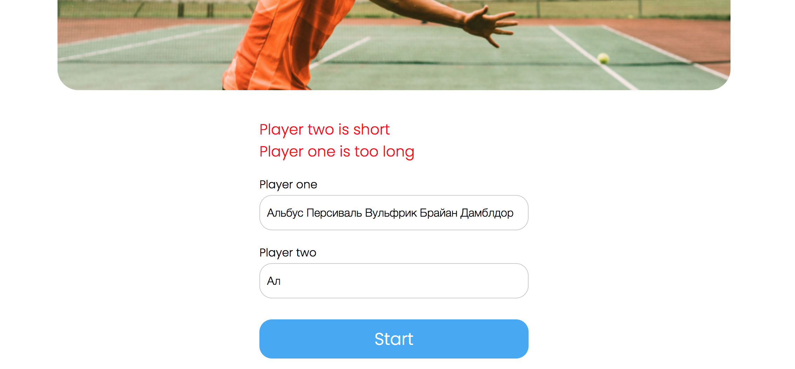
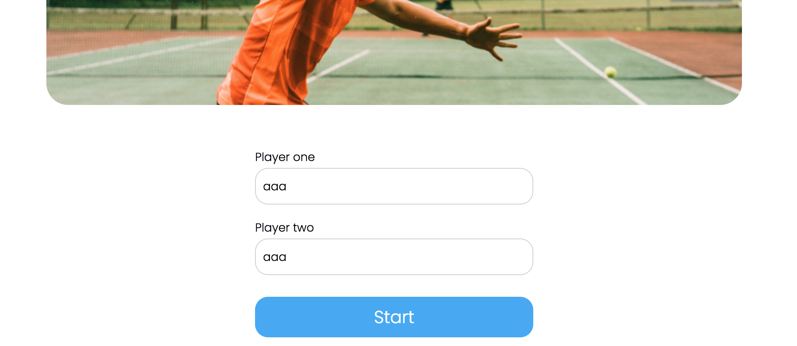
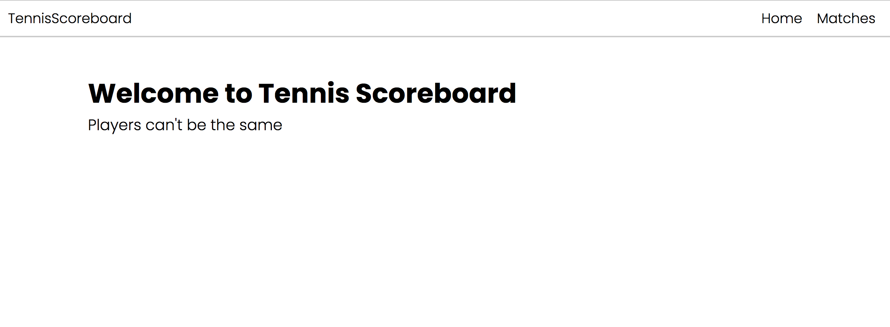
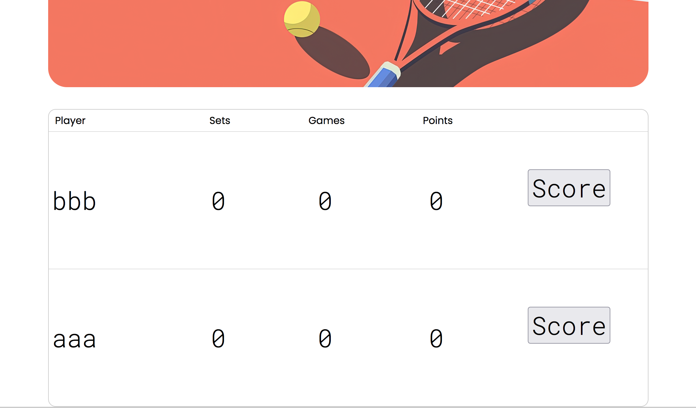
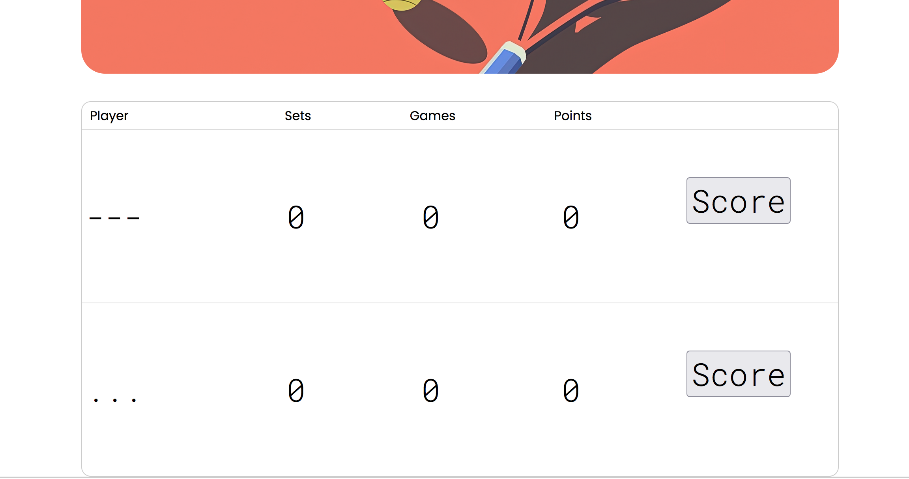
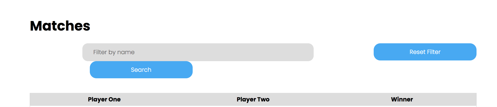
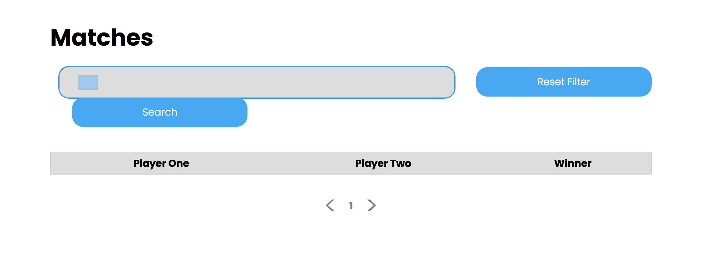
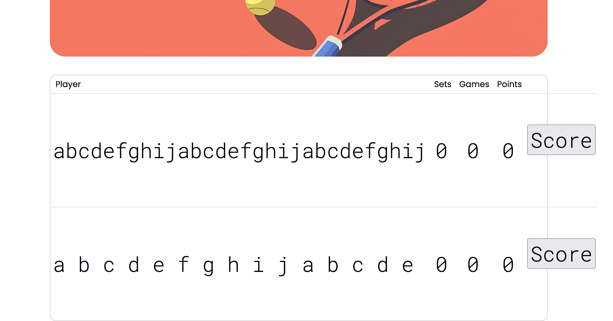
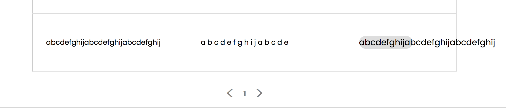

# Review на реализацию от [@nsndxj](https://github.com/AquaProdigy/TennisBoard) проекта [Табло теннисного матча](https://zhukovsd.github.io/java-backend-learning-course/projects/tennis-scoreboard/)

```text
1. Знаком ❗️ помечены критически важные замечания, а также места нарушения ТЗ.
2. Если ❗️ стоит перед заголовком, значит он относится ко всем пунктам этого раздела.
3. Замечания, указанные в пункте с именем пакета, относятся ко всем классам этого пакета или ко всем классам этого слоя.
4. Знаком 💡 помечены блоки, в которых содержится подсказка по реализации какого-то приёма или части кода. 
   Такие пункты всегда находятся в сворачиваемом блоке и разворачиваются по нажатию. 
   Перед их раскрытием стоит постараться придумать или поискать решение самостоятельно. 
```

## Функциональный обзор

- Малоинформативное сообщение об ошибке:



Лучше явно сообщать пользователю диапазон длины имени.

- При вводе одинаковых имён показывается отдельная страница с текстом ошибки:





Вместо этого лучше просто показывать подсказку, как сейчас происходит с другими валидации.

- Кнопки начисления очков выглядят неактивными:



- Раз в проекте есть валидация, стоит добавить ограничения, проверяющие отсутствие цифр, допустимые символы, использование только одного языка и др.

Сейчас можно создать игроков с такими именами:



- Когда фильтр по имени не применён, можно не показывать кнопку сброса фильтра:



- При фильтрации по пустой строке сейчас не показывается ни один матч:



Вместо этого можно считать это за отсутствие фильтра и показывать все матчи. 

- Имена с максимальной длиной не помещаются в разметку текущего матча 



а также в таблицу с результатами



- Последний сыгранный матч отображается последним в списке на странице завершённых матчей — чтобы посмотреть его результат в таблице надо листать до последней страницы. Лучше, чтобы последний завершённый отображался первым в списке (на первой странице).

## entity

### Player

<div align="right">

[Перейти к упоминанию в Match](#match) </div>

- ❗️`@EqualsAndHashCode` (которая входит в `@Data`) обычно не используют в JPA сущностях. Конкретно здесь проблем быть не должно, но использование этих аннотаций вместе с `@Entity` не является хорошей практикой.

[**Использование @Data (Lombok) и @Entity (JPA) в одном классе**](#data-entity) <a id="back-from-data-entity"></a>

Даже если сейчас для генерации `equals()` и `hashCode()` используются все поля, лучше их явно указать в аннотации. Так при добавлении в класс новых полей, они не будут автоматически участвовать в `equals()` и `hashCode()`.

Сейчас так:

```java
@EqualsAndHashCode
public class Player {
    private Long id;
    private String name;
    // ...
}
```

Лучше так:

```java
@EqualsAndHashCode(of = {"id", "name"})
public class Player {
    private Long id;
    private String name;
    // ...
}
```

- ❗️Аннотация `@Setter` (которая входит в `@Data`) генерирует публичные сеттеры для всех полей класса:

  - Поле `id` является первичным ключом, генерируемым базой данных. Публичный сеттер для этого поля позволяет устанавливать и изменять ID на любом этапе жизненного цикла объекта. Предоставление такой возможности может привести к рассинхронизации объекта в приложении с его представлением в базе данных, а также к конфликтам при сохранении.

  - Публичный сеттер для поля `name` позволяет произвольно менять имя игрока, которое должно быть его уникальным и неизменяемым свойством в рамках бизнес-логики.

Как исправить: удалить аннотацию `@Setter`. Инициализация полей должна происходить только один раз в момент создания объекта через конструктор.

- В классе одновременно используются аннотации `@Data` и `@EqualsAndHashCode`. Писать `@EqualsAndHashCode` (которая входит в `@Data`) отдельно от `@Data` имеет смысл только тогда, когда в ней явно указываются поля, на основе которых генерируется `equals()` и `hashCode()`.

- ❗️Спецификация JPA требует наличия конструктора без аргументов для создания экземпляров сущностей, однако ему не обязательно быть `public`. Когда конструктор публичный, он становится частью общедоступного API класса. Это позволяет использовать его для создания "пустых", невалидных объектов (без установки обязательных полей) в любом месте приложения, хотя он предназначен исключительно для внутреннего использования фреймворком (JPA).

Хорошим подходом будет ограничить область видимости этого конструктора до `protected`. Это делает его недоступным для прямого вызова из других пакетов, но оставляет видимым для JPA и дочерних классов. В Lombok это можно сделать с помощью параметра `access`.

Сейчас так:

```java
@Entity
@NoArgsConstructor
public class Player {
    // ...
}
```

Лучше так:

```java
@Entity
@NoArgsConstructor(access = AccessLevel.PROTECTED)
public class Player {
    // ...
}
```

- Уникальность поля `name` обеспечивается атрибутом `unique = true` в аннотации `@Column`. Хотя `unique = true` приводит к созданию уникального индекса, явное определение индекса через аннотацию `@Table` даёт больше контроля и улучшает читаемость кода. В `@Index` можно задать имя для индекса, что упрощает его администрирование в будущем, и сама аннотация явно декларирует намерение создать индекс для оптимизации поиска.

Можно добавить явное определение индекса на уровне класса.

<details>

<summary><b>💡 Например, так 💡</b></summary>

---

```java
@Entity
@Table(name = "players", indexes = @Index(name = "idx_player_name", columnList = "name", unique = true))
public class Player {
    // ...
    @Column(name = "name", length = 30, nullable = false)
    private String name;
}
```

При таком подходе параметр `unique = true` из аннотации `@Column` можно удалить, так как уникальность теперь задана в `@Index`.

---

</details>

- Если имя поля совпадает с названием колонки, то параметр name в аннотации `@Column` можно опустить.

- В классе есть аннотации, функционал которых не используется или не должен быть в проекте. Хорошим подходом будет оставить минимум необходимых аннотаций, достаточных для JPA Entity.

Сейчас так:

```java
@Entity
@Table(name = "players")
@Data
@NoArgsConstructor
@EqualsAndHashCode
public class Player {
    // ...
}
```

Лучше так:

```java
@Getter
@NoArgsConstructor(access = AccessLevel.PROTECTED)
@Entity
@Table(name = "players")
public class Player {
    // ...
}
```

### Match

<div align="right">

[Перейти к упоминанию в CreateMatchRequest](#creatematchrequest) </div>

<div align="right">

[Перейти к упоминанию в MatchDto](#matchdto) </div>

- Пункты про:
  - ❗️Использование `@Data` совместно с `@Entity`
  - ❗️Ограничение области видимости `@NoArgsConstructor`
  - ❗️Публичные сеттеры для всех полей класса
  - Использование только необходимых аннотаций

описанные в разделе [Player](#player), актуальны и для этого класса.

- ❗️Слово `MATCHES` (а также `MATCH`) является зарезервированным ключевым словом в некоторых диалектах SQL (например, для оператора `MATCH ... AGAINST` в полнотекстовом поиске). Хотя в конкретно в этом проекте проблем с этим не возникнет, не стоит использовать зарезервированные слова в качестве имён таблиц. Это может приводить к необходимости экранировать имя таблицы в нативных SQL-запросах или к синтаксическим ошибкам в некоторых СУБД.

[**Использование зарезервированных слов в качестве названий в БД**](#sql-keywords) <a id="back-from-sql-keywords"></a>

Лучше выбирать имена, которые гарантированно не конфликтуют с зарезервированными словами. Учитывая, что в таблице хранятся только завершённые матчи, можно выбрать более описательное и безопасное имя `FINISHED_MATCHES` или более общее `TENNIS_MATCHES`.

- `@EqualsAndHashCode(of = "id")` основывает сравнение объектов на поле `id`, которое равно `null` до сохранения сущности в базу данных.

Это ведёт к проблемам с коллекциями: Если добавить новый `Match` (с `id = null`) в `HashSet`, его хэш-код изменится после сохранения, и объект "потеряется" в коллекции.

А также к неверному сравнению: Все новые, несохранённые матчи будут считаться равными друг другу, что логически неверно.

Хорошим подходом для `equals`/`hashCode` в JPA-сущностях было бы использование стабильного бизнес-ключа. В `Match` такого очевидного ключа нет. В качестве надёжной альтернативы можно было бы добавить поле `UUID`, генерируемое при создании объекта, и использовать его для `equals`/`hashCode`. Но поскольку сравнение сущностей не является бизнес-требованием, самое безопасное — вообще не переопределять `equals` и `hashCode`, оставив реализацию из класса `Object` (сравнение по ссылке).

- Поля игроков используют числительные в виде цифр (`player1`, `player2`), тогда как в другом месте приложения (в сервисе) внутренние переменные, обозначающие тех же игроков, именуются словами (`playerOne`, `playerTwo`).

```java
@Entity
public class Match {
    // ...
    @JoinColumn(name = "player1_id", nullable = false)
    private Player player1;
    
    @JoinColumn(name = "player2_id", nullable = false)
    private Player player2;
    // ...
}

/**
 * В NewMatchService
 */
@Transactional
public UUID createMatch(CreateMatchRequest request) {
    // ...
  
    Player playerOne = ...
  
    Player playerTwo = ...
  
    // ...
}
```

Отсутствие единого, последовательного стиля именования может затруднять чтение кода. В некоторых случаях разработчику придётся потратить дополнительное время и умственные усилия, чтобы убедиться, что `player1` и `playerOne` являются обозначениями одной и той же сущности. Это создаёт ненужную когнитивную нагрузку.

Также непоследовательное именование повышает риск случайных ошибок, особенно при копировании/вставке кода или при работе с большим количеством схожих переменных, когда легко перепутать один стиль с другим.

Стоит привести именование к единому стилю, используя либо только цифры, либо только слова.

Например, так:

```java
@Entity
public class Match {
    // ...
  
    @JoinColumn(name = "first_player_id", nullable = false)
    private Player firstPlayer;
  
    @JoinColumn(name = "second_player_id", nullable = false)
    private Player secondPlayer;
  
    // ...
}

/**
 * В NewMatchService
 */
@Transactional
public UUID createMatch(CreateMatchRequest request) {
    // ...
  
    Player firstPlayer = ...
  
    Player secondPlayer = ...
  
    // ...
}
```

Использование слов (например, `firstPlayer` и `secondPlayer`) даёт несколько преимуществ перед использованием цифр:

  - Визуальное различие и читаемость: Имена `firstPlayer` и `secondPlayer` визуально отличаются друг от друга сильнее, чем `player1` и `player2`. Это снижает вероятность их перепутать при быстром просмотре кода. Кроме того, такие имена читаются более естественно, как обычный текст.

  - Эффективность работы в IDE: При вводе `first...`, IntelliJ IDEA однозначно предложит подсказку `firstPlayer`. При вводе `player...` IDE предложит оба варианта (`player1`, `player2`), что требует дополнительного действия для выбора нужного.

  - Удобство поиска: Искать по кодовой базе переменную тоже `firstPlayer` может быть проще, чем `player1` (по причине, из предыдущего пункта).

- Риск нарушения целостности данных. Класс не имеет механизмов, которые бы гарантировали на уровне схемы базы данных выполнение ключевых бизнес-правил:

  - Игрок не может играть сам с собой (`player1` должен отличаться от `player2`).

  - Победителем (`winner`) должен быть один из участников матча (`player1` или `player2`).

Хотя логика в сервисном слое может предотвращать создание некорректных матчей, база данных этого не гарантирует. Прямой SQL-запрос или ошибка в другом модуле приложения могут привести к созданию невалидных данных (например, матч, где `player1_id = 5` и `player2_id = 5`).

Защита должна быть на всех уровнях, поэтому стоит добавить ограничения, проверяющие, что игроки разные и победителем является один из участников матча.

<details>

<summary><b>💡 Например так 💡</b></summary>

---

```java
@Entity
@Table(name = "FINISHED_MATCHES", check = {
        @CheckConstraint(name = "players_are_different_check", constraint = "player1 != player2"),
        @CheckConstraint(name = "winner_is_participant_check", constraint = "winner = player1 OR winner = player2")
})
public class Match {
    
}
```

Что это даст:

  - Гарантирует целостность данных даже при прямом доступе к БД.
  - Снижает риск появления невалидных данных из-за ошибок в коде или внешних вмешательств.
  - Схема базы данных будет явно отражать бизнес-правила.

---

</details>

- Можно добавить параметр `updatable = false` в `@Column` для полей которые не должны изменяться в качестве дополнительной защиты целостности данных: `@Column(updatable = false)`.

## model

### MatchScore

<div align="right">

[Перейти к упоминанию в PlayerScore](#playerscore) </div>

- `MatchScore` по своей сути представляет текущий, идущий матч. Имя `OngoingMatch` или `CurrentMatch` было бы более точным.

- ❗️`MatchScore` — это анемичная модель. Он представляет собой просто набор полей с геттерами и сеттерами (которые генерирует `@Data`), не содержащий никакой бизнес-логики.

```java
@Data
public class MatchScore {
    private final PlayerScore playerOne;
    private final PlayerScore playerTwo;
    private boolean tieBreak;
}
```

Вся логика подсчёта очков, определения победителя и изменения состояния матча вынесена во внешний сервисный класс.

Почему это проблема:

  - Нарушение инкапсуляции: Любой внешний код может напрямую изменить любое поле объекта, полностью игнорируя правила тенниса. Даже каждое поле `playerScore` хотя оно и объявлено как `final`, что означает, что ему нельзя переприсвоить ссылку на другой объект `PlayerScore`, однако сам объект, на который указывает ссылка, является полностью изменяемым. Это делает состояние объекта ненадёжным.

  - Процедурный стиль: Вместо того чтобы сказать объекту `matchScore.addPointTo(firstPlayer)`, внешний код получает его внутренние данные

  ```java
  /**
   * В MatchScoreCalculationService
   */
  public void makeMove(UUID uuid, int player) {
      // ...
      PlayerScore winner = isFirstPlayer ? match.getPlayerOne() : match.getPlayerTwo();
      PlayerScore loser = isFirstPlayer ? match.getPlayerTwo() : match.getPlayerOne();
  
      scorePoint(match, winner, loser);
  }
  
    private void scorePoint(MatchScore match, PlayerScore winner, PlayerScore loser) {
  
      // ...
  
      if (winner.getPoints() == TennisPoint.ADVANTAGE) {
          winGame(match, winner, loser);
          return;
      }
  
      if (loser.getPoints() == TennisPoint.ADVANTAGE) {
          loser.setPoints(TennisPoint.FORTY);
          return;
      }
  
      // ...
  
      winner.setPoints(winner.getPoints().next());
  }
  
  ```

  и изменяет их по своему усмотрению. Это является антипаттерном в объектно-ориентированном программировании и порождает процедурный, а не объектно-ориентированный подход. Код превращается в набор процедур, которые оперируют над объектом-держателем данных, что лишает преимуществ ООП.

  - Сложность тестирования: Чтобы протестировать логику подсчёта очков, нужно тестировать сервисы, которые её содержат, что может потребовать мокирования зависимостей. Если бы логика была внутри доменного объекта, её можно было бы тестировать в полной изоляции.

[**Анемичная vs Богатая модель предметной области**](#reach-anemic-model) <a id="back-from-reach-anemic-model-to-matchscore"></a>

Решением будет превратить `MatchScore` в "богатую" доменную модель, инкапсулировав в нём и данные, и поведение.

<details>

<summary><b>💡 В таком духе 💡</b></summary>

---

```java
// Концептуальный пример "богатой" модели
public class OngoingMatch {
  private final PlayerScore firstPlayerScore; // PlayerScore тоже должен быть "богатой" моделью
  private final PlayerScore secondPlayerScore; // PlayerScore тоже должен быть "богатой" моделью
  
  // другие поля

  public OngoingMatch(TennisPlayer firstPlayer, TennisPlayer secondPlayer) { // TennisPlayer тоже должен быть моделью (не JPA Entity)
    this.firstPlayerScore = new PlayerScore(firstPlayer);
    this.secondPlayerScore = new PlayerScore(secondPlayer);
  }

  // Публичный метод для изменения состояния
  public void awardPointTo(TennisPlayer player) {
    if (isFinished()) {
      throw new MatchAlreadyFinishedException();
    }

    PlayerScore winnerScore = getScoreFor(player);
    PlayerScore loserScore = getOpponentScoreFor(player);

    // Вся логика подсчёта очков, геймов и сетов находится здесь
    // Она вызывает внутренние методы winnerScore и loserScore
  }

  // Методы, совершающие необходимую работу над полями
  
}
```

При таком подходе от сеттеров стоит избавиться, чтобы состояние счёта управлялось только явно предусмотренными для этого методами. А также стоит оставить только нужные (не раскрывающие внутреннего устройства) геттеры.

---

</details>

Краткий чек-лист проверки успешного проектирования богатой доменной модели матча:

  - Объект сам контролирует своё состояние и не позволяет перевести себя в невалидное состояние.

  - Объектно-ориентированный дизайн: Данные и поведение, которое с ними работает, находятся вместе.

  - Простота тестирования: Можно создать экземпляр матча и протестировать всю логику игры, вызывая для начисления очков всего один метод.

### PlayerScore

- ❗️Пункт про анемичную доменную модель, описанный в разделе [MatchScore](#matchscore), актуален и для этого класса.

- ❗️Класс доменной модели `PlayerScore` напрямую содержит поле типа `Player`. Класс `Player` является JPA-сущностью, то есть частью слоя персистентности (доступа к данным). Это создаёт сильную и нежелательную связь между слоем бизнес-логики и слоем хранения данных, что приводит к нескольким проблемам:

  - Смешение слоёв: Доменная модель, которая должна содержать только чистую бизнес-логику, становится зависимой от технологии доступа к данным (JPA/Hibernate).

  - Хрупкость архитектуры: Любые изменения в сущности `Player` (например, добавление новых связей) могут неожиданным образом повлиять на слой бизнес-логики.

[**Принцип разделения ответственности (Separation of Concerns)**](#soc-principle) <a id="back-from-soc-principle-to-playerscore"></a>

Как исправить: Заменить в `PlayerScore` поле типа `Player` на простой тип данных (например, `String` для имени игрока) или на доменную модель игрока.

- Поле `int tieBreakPoints` присутствует в каждом экземпляре `PlayerScore` на протяжении всего матча, хотя оно имеет смысл и используется только в том случае, если в сете играется тай-брейк. В остальное время это поле является "мёртвым кодом", который может ввести в заблуждение. В более сложной модели логика тай-брейка могла бы быть вынесена в отдельный класс-состояние, который активируется только при счёте 6:6.

- В конструкторе `PlayerScore` начальные значения для `games`, `sets` и `tieBreakPoints` задаются как `0`. Хотя `0` кажется очевидным значением, вынесение его в именованную константу, например `private static final int INITIAL_SCORE = 0;`, улучшило бы читаемость и поддерживаемость кода.

Сейчас так:

```java
public class PlayerScore {
    public PlayerScore(Player player) {
        this.player = player;
        this.games = 0; // "магическое число"
        this.sets = 0;  // "магическое число"
        this.points = TennisPoint.ZERO;
        this.tieBreakPoints = 0; // "магическое число"
    }
}
```

Лучше так:

```java
public class PlayerScore {
    private static final int INITIAL_GAMES = 0;
    private static final int INITIAL_SETS = 0;
    private static final int INITIAL_TIEBREAK_POINTS = 0;

    public PlayerScore(Player player) {
        this.player = player;
        this.games = INITIAL_GAMES;
        this.sets = INITIAL_SETS;
        this.points = TennisPoint.ZERO;
        this.tieBreakPoints = INITIAL_TIEBREAK_POINTS;
    }
}
```

Это делает намерение программиста явным и упрощает изменение начальных значений в будущем, если потребуется.

- Класс `PlayerScore` имеет публичный метод `resetPoints()`. 

```java
public void resetPoints() {
    this.points = TennisPoint.ZERO;
    this.tieBreakPoints = 0;
}
```

Это позволяет любому внешнему сервису в любой момент сбросить очки игрока, что является небезопасным и нарушает инкапсуляцию. Сброс очков должен быть внутренней операцией, происходящей в строго определённый момент (например, после выигрыша гейма), и эта логика должна быть инкапсулирована внутри доменной модели, а не вызываться извне.

В "богатой" доменной модели подобный метод должен быть `private` и вызываться, например, из метода вычисления счёта, который бы находился в этом же классе.

- Метод `resetPoints()` выполняет два действия (сбрасывает очки и очки тай-брейка), а его название отражает только одно из них.

Это нарушает Принцип единственной ответственности на уровне метода и делает код менее читаемым. Разработчик, вызывающий этот метод, может не ожидать, что он также повлияет на `tieBreakPoints`.

Стоит дать методу более точное имя, которое отражает все его действия, или разделить его на два разных метода.

<details>

<summary><b>💡 Вот так 💡</b></summary>

---

Вариант 1 (Точное имя):

```java
public void resetPointsAndTieBreak() {
    this.points = INITIAL_POINTS;
    this.tieBreakPoints = INITIAL_TIEBREAK_POINTS;
}
```

Вариант 2 (Разделение):

```java
public void resetGamePoints() {
    this.points = INITIAL_POINTS;
}

public void resetTieBreakPoints() {
    this.tieBreakPoints = INITIAL_TIEBREAK_POINTS;
}
```

---

</details>

## enums

- Опечатка в названии пакета. Имена пакетов в java пишут в единственном числе. Когда смотришь на набор классов в пакете, кажется естественным использовать множественное число, обобщая то, что в нём находится, но если посмотреть на декларацию пакета в классе и сравнить варианты, например: `*.validation.limits.annotations.MaxLength` и `*.validation.limit.annotation.MaxLength`, то логика названия в единственном числе становится более понятной, так как это отображает полное имя одного (каждого) конкретного класса.

### TennisPoint

- `TennisPoint` является неотъемлемой частью доменной модели, описывающей правила игры. Размещение его в техническом пакете `enums` вместо доменного пакета `model` нарушает принцип группировки по функциональному/доменному признаку. Это усложняет навигацию и понимание архитектуры проекта, так как части одной логической сущности (модели игры) оказываются в разных местах. Класс следует переместить в пакет `org.roadmap.tennisboard.model`.

- ❗️Метод `next()`, который должен возвращать следующее значение счёта, при вызове на экземплярах `FORTY` и `ADVANTAGE` по-тихому возвращает самого себя.

```java
public TennisPoint next() {
    return switch (this) {
        case ZERO -> FIFTEEN;
        case FIFTEEN -> THIRTY;
        case THIRTY -> FORTY;
        default -> this;
    };
}
```

Это нарушает [**Принцип наименьшего удивления (Principle of Least Astonishment, POLA)**](#pola) <a id="back-from-pola"></a>. Программист, вызывающий метод с названием `next()`, интуитивно ожидает получить либо следующий элемент последовательности, либо явную ошибку, если следующего элемента нет. "Тихое" возвращение текущего объекта может привести к скрытым ошибкам в бизнес-логике:

  - Код, вызывающий `playerScore.setPoints(playerScore.getPoints().next())`, может неверно предположить, что счёт всегда увеличивается, что приведёт к неправильному состоянию.
  - Это может стать причиной бесконечного цикла, если условие выхода из него завязано на достижение определённого состояния, которое никогда не будет достигнуто из-за некорректного перехода.

Стоит сделать поведение метода явным и безопасным. Если простого следующего состояния для значения не существует, метод должен сигнализировать об этом, выбрасывая исключение.

<details>

<summary><b>💡 Например, так 💡</b></summary>

---

```java
public TennisPoint next() {
    return switch (this) {
        case ZERO -> FIFTEEN;
        case FIFTEEN -> THIRTY;
        case THIRTY -> FORTY;
        case FORTY -> ADVANTAGE;
        case ADVANTAGE -> throw new IllegalStateException("Cannot call next() on ADVANTAGE");
    };
}
```

---

</details>

### MoveResult

- Класс нигде в кодовой базе проекта не используется, поэтому его можно удалить.

## dto

### CreateMatchRequest

<div align="right">

[Перейти к упоминанию в MatchDto](#matchdto) </div>

- Пункт про использование цифр при именовании полей, описанный в разделе [Match](#match), актуален и для этого класса.

- Класс является изменяемым (mutable), так как аннотация `@Setter` создаёт для его полей публичные сеттеры.

Объекты для передачи данных (DTO), особенно те, что представляют запросы, в идеале должны быть неизменяемыми. Когда DTO изменяем, его состояние может быть случайно или намеренно изменено в любой части приложения после его первоначального создания (например, в сервисном слое или в каком-либо фильтре). Это может привести к трудноуловимым ошибкам и делает поведение системы менее предсказуемым.

Самый современный (начиная с Java 16) и лаконичный способ исправить это — использовать `record`.

Сейчас так:

```java
@Getter
@Setter
public class CreateMatchRequest {
    
    @NotBlank(message = "Player one not be blank")
    @Size(min = 3, message = "Player one is short")
    @Size(max = 30, message = "Player one is too long")
    private String player1;

    @NotBlank(message = "Player two not be blank")
    @Size(min = 3, message = "Player two is short")
    @Size(max = 30, message = "Player two is too long")
    private String player2;

}
```

Лучше так:

```java
public record CreateMatchRequest(
        @NotBlank(message = "Player one not be blank")
        @Size(min = 3, message = "Player one is short")
        @Size(max = 30, message = "Player one is too long")
        String player1,

        @NotBlank(message = "Player two not be blank")
        @Size(min = 3, message = "Player two is short")
        @Size(max = 30, message = "Player two is too long")
        String player2
) {
}
```

Так состояние объекта гарантированно не изменится после создания.

- Можно немного улучшить сообщения в аннотациях, а также объединить две аннотации `@Size` в одну.

Вот так:

```java
@NotBlank(message = "Player one name cannot be blank")
@Size(min = 3, max = 30, message = "Player one name must be between {min} and {max} characters long")
private String player1;

@NotBlank(message = "Player two name cannot be blank")
@Size(min = 3, max = 30, message = "Player two name must be between {min} and {max} characters long")
private String player2;
```

Во время валидации, если длина имени не попадёт в диапазон от 3 до 30, обработчик автоматически подставит значения атрибутов `min` и `max` из аннотации `@Size` в плейсхолдеры `{min}` и `{max}`.

В результате пользователь увидит сообщение: `Player one name must be between 3 and 30 characters long`

- Сейчас набор из трёх аннотаций (`@NotBlank`, `@Size(min=...)`, `@Size(max=...)`) полностью дублируется для полей `player1` и `player2`.

Это прямое нарушение принципа DRY (Don't Repeat Yourself). Если бизнес-требования к имени игрока изменятся (например, минимальная длина станет 2 символа), это изменение придётся вносить в двух местах. Хотя в таком простом классе такие изменения сделать не сложно, это увеличивает трудоёмкость и создаёт риск, что одно поле будет обновлено, а другое — забыто, что приведёт к рассинхронизации правил валидации.

Как исправить: Создать собственную составную аннотацию валидации, которая будет объединять в себе все необходимые проверки для имени игрока.

<details>

<summary><b>💡 Вот так 💡</b></summary>

---

```java
@NotBlank(message = "Player two name cannot be blank")
@Size(min = 3, max = 30, message = "Player two name must be between {min} and {max} characters long")
@Target({ElementType.FIELD, ElementType.PARAMETER})
@Retention(RetentionPolicy.RUNTIME)
@Constraint(validatedBy = {})
public @interface ValidPlayerName {
    String message() default "Incorrect player name";
    Class<?>[] groups() default {};
    Class<? extends Payload>[] payload() default {};
}
```

И использовать новую аннотацию в DTO:

```java
public record CreateMatchRequest(
        @ValidPlayerName
        String player1,

        @ValidPlayerName
        String player2
) {
}
```

Правила валидации имени игрока будут определены в одном единственном месте. Код DTO станет чище и лаконичнее. Поддержка и изменение правил валидации упростятся.

---

</details>

- Отсутствует перекрёстная валидация полей. Игрок не может играть сам с собой, однако текущая валидация на уровне DTO это не проверяет. Эта логика вынесена в `NewMatchService`.

```java
/**
 * В NewMatchService
 */
if (request.getPlayer1().equalsIgnoreCase(request.getPlayer2())) {
    throw new IllegalArgumentException("Players can't be the same");
}
```

Логика валидации оказывается "размазанной" между слоями. В идеале, все правила валидации, относящиеся к запросу, должны быть инкапсулированы в самом DTO. Это делает код более декларативным и соответствующим принципу "Single Source of Truth" (единый источник истины) для правил валидации. Перенос логики в сервис заставляет разработчика искать её в разных местах и смешивает бизнес-логику с логикой проверки корректности данных.

[**Принцип Single Source of Truth (SSOT)**](#ssot-principle) <a id="back-from-ssot-principle"></a>

<details>

<summary><b>💡 Вот как можно это исправить 💡</b></summary>

---

Создать собственную аннотацию для перекрёстной валидации полей на уровне класса.

1. Создать аннотацию

```java
@Target(ElementType.TYPE)
@Retention(RetentionPolicy.RUNTIME)
@Constraint(validatedBy = DifferentPlayersValidator.class)
public @interface DifferentPlayers {
    String message() default "Players must not be the same";
    Class<?>[] groups() default {};
    Class<? extends Payload>[] payload() default {};
}
```

2. Создать валидатор

```java
public class DifferentPlayersValidator implements ConstraintValidator<DifferentPlayers, CreateMatchRequest> {
    @Override
    public boolean isValid(CreateMatchRequest request, ConstraintValidatorContext context) {
        if (request == null || request.player1() == null || request.player2() == null) {
            return true; // Здесь можно не проверять, @NotBlank справится
        }
        return !request.player1().equalsIgnoreCase(request.player2());
    }
}
```

3. Применить аннотацию к DTO

```java
@DifferentPlayers // <-- Над классом
public record CreateMatchRequest(
        @ValidPlayerName
        String player1,

        @ValidPlayerName
        String player2
) {
}
```

---

</details>

### MatchDto

- Пункт про изменяемый DTO, описанный в разделе [CreateMatchRequest](#creatematchrequest), актуален и для этого класса.

- Пункт про использование цифр при именовании полей, описанный в разделе [Match](#match), актуален и для этого класса.

## repository

### PlayerRepository

- Метод `findByName(String name)` по умолчанию будет выполнять поиск, чувствительный к регистру символов.

Это может привести к созданию дубликатов игроков в базе данных. Например, если в базе уже есть игрок с именем "John", а новый матч создаётся с игроком "john", то `findByName("john")` не найдёт существующего игрока, и сервис `NewMatchService` создаст нового. В результате в базе появятся два разных игрока с одинаковыми, по сути, именами, что нарушает целостность данных и логику ТЗ ("имена игроков уникальны").

Как исправить: Использовать ключевое слово `IgnoreCase` в имени метода, чтобы Spring Data JPA автоматически сгенерировал запрос, нечувствительный к регистру ([**Spring Data JPA - Query Creation**](https://docs.spring.io/spring-data/jpa/reference/jpa/query-methods.html#jpa.query-methods.query-creation)).

Сейчас так:

```java
Optional<Player> findByName(String name);
```

Лучше так:

```java
Optional<Player> findByNameIgnoreCase(String name);
```

Так поиск будет работать корректно независимо от регистра, в котором введено имя игрока.

<details>

<summary><b>Вот как это проверить наглядно</b></summary>

---

1. Создать файл с тестами в приложении.

```java
@SpringBootTest
@Transactional
public class PlayerRepositoryTest {

    @Autowired
    private PlayerRepository playerRepository;

    @Test
    void whenFindByName_thenSearchShouldBeCaseSensitive() {
        // Сохраняем игрока с именем "Novak" в базу данных напрямую через репозиторий
        playerRepository.save(new Player("Novak"));

        // Пытаемся найти этого игрока, используя имя в нижнем регистре "novak"
        Optional<Player> foundPlayer = playerRepository.findByName("novak");

        // Проверяем, был ли игрок найден.
        assertThat(foundPlayer).isPresent();

        // Дополнительная проверка, что найден правильный игрок
        assertThat(foundPlayer.get().getName()).isEqualTo("Novak");
    }

    @Test
    void whenFindByName_thenSearchShouldBeCaseInsensitive() {
        // Сохраняем игрока с именем "Novak" в базу данных напрямую через репозиторий
        playerRepository.save(new Player("Novak"));

        // Пытаемся найти этого игрока, используя имя в нижнем регистре "novak"
        Optional<Player> foundPlayer = playerRepository.findByNameIgnoreCase("novak");

        // Проверяем, был ли игрок найден.
        assertThat(foundPlayer).isPresent();

        // Дополнительная проверка, что найден правильный игрок
        assertThat(foundPlayer.get().getName()).isEqualTo("Novak");
    }
}
```

2. Добавить в `PlayerRepository` метод `Optional<Player> findByNameIgnoreCase(String name)`.
3. Запустить тесты: тест, использующий `findByName`, не сможет найти игрока, а тест, использующий findByNameIgnoreCase, — найдёт.

---

</details>

### MatchRepository

- Для выполнения регистронезависимого поиска используется функция `LOWER()` для поля в базе данных (`LOWER(m.player1.name)`). Вместо этого можно использовать возможности базы данных для регистронезависимого поиска — в H2 можно использовать ключевое слово `ILIKE`.

Сейчас так:

```java
"... WHERE LOWER(m.player1.name) LIKE LOWER(CONCAT('%', :name, '%')) OR LOWER(m.player2.name) LIKE LOWER(CONCAT('%', :name, '%'))"
```

Можно так:

```java
"... WHERE m.player1.name ILIKE CONCAT('%', :name, '%') OR m.player2.name ILIKE CONCAT('%', :name, '%')"
```

Тогда не придётся приводить ни значение колонки в БД, ни имя игрока в коде к нижнему регистру.

- Тексты JPQL-запросов определены как строковые литералы непосредственно внутри аннотаций `@Query`.

```java
public interface MatchRepository extends JpaRepository<Match, Long> {

    @Query("SELECT m FROM Match m JOIN FETCH m.player1 JOIN FETCH m.player2 LEFT JOIN FETCH m.winner WHERE LOWER(m.player1.name) LIKE LOWER(CONCAT('%', :name, '%')) OR LOWER(m.player2.name) LIKE LOWER(CONCAT('%', :name, '%'))")
    Page<Match> findAllByPlayerName(@Param("name") String name, Pageable pageable);
    
    @Query("SELECT m FROM Match m JOIN FETCH m.player1 JOIN FETCH m.player2 LEFT JOIN FETCH m.winner")
    Page<Match> findAllMatches(Pageable pageable);

}
```

Это создаёт неудобства:

  - Длинные SQL-подобные строки внутри Java-аннотаций ухудшают читаемость кода и заставляют горизонтально прокручивать экран.

  - В данном случае оба запроса содержат почти идентичную часть (`SELECT m FROM Match m JOIN FETCH m.player1 JOIN FETCH m.player2 LEFT JOIN FETCH m.winner`). Если потребуется добавить ещё одно поле с `FETCH`, придётся вносить правки в двух местах, что нарушает принцип DRY.

  - Редактировать сложные запросы в виде одной строки неудобно.

Можно вынести запросы в константы, а также выделить общую часть запросов в отдельную константу для переиспользования.

<details>

<summary><b>💡 Вот так 💡</b></summary>

---

```java
public interface MatchRepository extends JpaRepository<Match, Long> {

    String SELECT_ALL_JPQL = """
            SELECT m
            FROM Match m
            JOIN FETCH m.player1
            JOIN FETCH m.player2
            LEFT JOIN FETCH m.winner
            """;

    String FILTER_BY_PLAYER_NAME_JPQL = """
            WHERE m.player1.name ILIKE CONCAT('%', :name, '%') 
                OR m.player2.name ILIKE CONCAT('%', :name, '%')
            """;

    String FIND_BY_PLAYER_NAME_JPQL = SELECT_ALL_JPQL + FILTER_BY_PLAYER_NAME_JPQL;
    
    @Query(FIND_BY_PLAYER_NAME_JPQL)
    Page<Match> findAllByPlayerName(@Param("name") String name, Pageable pageable);

    @Query(SELECT_ALL_JPQL)
    Page<Match> findAllMatches(Pageable pageable);
    
}
```

---

</details>

- Сейчас в интерфейсе используются громоздкие, написанные вручную JPQL-запросы в аннотации `@Query` для выборки данных и решения проблемы N+1.

Можно заменить явные `@Query` более декларативным и идиоматичным для Spring Data JPA способом.

<details>

<summary><b>💡 Вот так 💡</b></summary>

---

Для этого можно использовать две вещи:

1.  Производные методы запросов (Derived Query Methods): Spring Data JPA умеет сам генерировать SQL-запросы на основе названия метода.
2.  Аннотация `@EntityGraph`: Стандартные производные методы не делают `JOIN FETCH` автоматически, что приведёт к проблеме N+1. Поэтому можно использовать аннотацию `@EntityGraph`, которая решает эту проблему, позволяя декларативно указать, какие связанные сущности нужно загружать одним запросом.

```java
public interface MatchRepository extends JpaRepository<Match, Long> {

    /**
     * Находит все матчи, где имя первого или второго игрока содержит заданную подстроку, без учёта регистра.
     * Также единым запросом загружает связанные сущности player1, player2 и winner.
     */
    @EntityGraph(attributePaths = {"player1", "player2", "winner"})
    Page<Match> findByPlayer1NameContainingIgnoreCaseOrPlayer2NameContainingIgnoreCase(String name1, String name2, Pageable pageable);

    /**
     * Находит все матчи, единым запросом загружая связанные сущности player1, player2 и winner,
     * чтобы избежать проблемы N+1.
     */
    @Override
    @EntityGraph(attributePaths = {"player1", "player2", "winner"})
    Page<Match> findAll(Pageable pageable);
}
```

Теперь метод для поиска по имени будет принимать два параметра (`String name1`, `String name2`). Это требуется, так как Spring строит запрос по сигнатуре, и для двух условий (`... OR ...`) он ожидает два параметра. При вызове надо будет передавать в оба параметра одно и то же значение имени.

---

</details>

- В методах репозитория отсутствует явная сортировка результатов. Запросы JPQL не содержат `ORDER BY`, поэтому порядок возвращаемых записей зависит от реализации JPA (обычно по первичному ключу в порядке возрастания). Это приводит к тому, что самые новые матчи отображаются в конце списка.

Пользователь, заходящий на страницу завершённых матчей, ожидает увидеть сначала последние завершённые матчи. В текущей реализации ему приходится пролистывать пагинацию до конца, чтобы найти свежие результаты. Это ухудшает пользовательский опыт и делает интерфейс неинтуитивным. При большом количестве матчей добираться до новых данных будет крайне неудобно.

Стоит добавить в JPQL-запросы сортировку по убыванию идентификатора матча, так как это естественный способ упорядочить матчи от новых к старым.

Сейчас так:

```java
@Query("SELECT m FROM Match m JOIN FETCH m.player1 JOIN FETCH m.player2 LEFT JOIN FETCH m.winner WHERE LOWER(m.player1.name) LIKE LOWER(CONCAT('%', :name, '%')) OR LOWER(m.player2.name) LIKE LOWER(CONCAT('%', :name, '%'))")
Page<Match> findAllByPlayerName(@Param("name") String name, Pageable pageable);

@Query("SELECT m FROM Match m JOIN FETCH m.player1 JOIN FETCH m.player2 LEFT JOIN FETCH m.winner")
Page<Match> findAllMatches(Pageable pageable);
```

Лучше так:

```java
String SELECT_ALL_JPQL = """
        SELECT m
        FROM Match m
        JOIN FETCH m.player1
        JOIN FETCH m.player2
        LEFT JOIN FETCH m.winner
        """;

String FILTER_BY_PLAYER_NAME_JPQL = """
        WHERE m.player1.name ILIKE CONCAT('%', :name, '%') 
            OR m.player2.name ILIKE CONCAT('%', :name, '%')
        """;

String ORDER_JPQL = """
        ORDER BY m.id DESC
        """;

String FIND_ALL_QUERY = SELECT_ALL_JPQL + ORDER_JPQL;

String FIND_BY_PLAYER_NAME_QUERY = SELECT_ALL_JPQL + FILTER_BY_PLAYER_NAME_JPQL + ORDER_JPQL;

@Query(FIND_BY_PLAYER_NAME_QUERY)
Page<Match> findAllByPlayerName(@Param("name") String name, Pageable pageable);

@Query(FIND_ALL_QUERY)
Page<Match> findAllMatches(Pageable pageable);
```

<details>

<summary><b>💡 Есть более гибкий способ изменить сортировку 💡</b></summary>

---

В контроллере можно задать сортировку по умолчанию с помощью аннотации `@PageableDefault`:

```java
@GetMapping
public String matches(
        @RequestParam(required = false, defaultValue = "") String filterName,
        @PageableDefault(sort = "id", direction = Sort.Direction.DESC) Pageable pageable,
        Model model
) {
    // ...
}
```

При таком подходе если клиент не передаст параметры сортировки, будет использована сортировка по умолчанию. Если клиент передаст свои параметры (например, `?sort=name,asc`), они переопределят значения по умолчанию.

При этом изменения в репозитории не требуются — достаточно установить `@PageableDefault` в контроллере. Spring Data JPA добавляет `ORDER BY` из `Pageable` в JPQL-запрос автоматически. То есть если в `Pageable` есть сортировка, она будет добавлена в запрос. 

---

</details>

## service

### NewMatchService

<div align="right">

[Перейти к упоминанию в FinishedMatchesPersistenceService](#finishedmatchespersistenceservice) </div>

- В классе используется аннотация `@Transactional` из пакета `jakarta.transaction`, а не из нативного для Spring пакета `org.springframework.transaction.annotation`.

Технически это корректно: Spring (кажется, начиная с версии 4) поддерживает стандартную JTA-аннотацию как альтернативу собственной. При наличии `spring-boot-starter-data-jpa` и автоконфигурации Spring Boot автоматически создаётся подходящий менеджер транзакций (например, JpaTransactionManager), и аннотация `@Transactional` из Jakarta будет корректно обрабатываться.

[Using @Transactional: ](https://docs.spring.io/spring-framework/reference/data-access/transaction/declarative/annotations.html)

> The standard jakarta.transaction.Transactional annotation is also supported as a drop-in replacement for Spring’s own annotation.

> Стандартная аннотация jakarta.transaction.Transactional также поддерживается в качестве замены собственной аннотации Spring.

А также правила отката транзакции по умолчанию идентичны для обеих аннотаций.

[@Transactional Settings: ](https://docs.spring.io/spring-framework/reference/data-access/transaction/declarative/annotations.html#transaction-declarative-attransactional-settings)

> Note that transaction-specific rollback rules override the default behavior but retain the chosen default for unspecified exceptions. This is the case for Spring’s @Transactional as well as JTA’s jakarta.transaction.Transactional annotation.

> Обратите внимание, что правила отката для конкретных транзакций переопределяют поведение по умолчанию, но сохраняют выбранное значение по умолчанию для неуказанных исключений. Это относится к аннотации @Transactional в Spring, а также к аннотации jakarta.transaction.Transactional в JTA.

Однако с точки зрения стиля и лучших практик в проектах на Spring предпочтительнее использовать собственную аннотацию — `org.springframework.transaction.annotation.Transactional`. Вот почему:

  - Расширенные атрибуты, специфичные для Spring: Аннотация Spring предоставляет гораздо больше возможностей для тонкой настройки поведения транзакции, которых нет в стандартной аннотации `jakarta.transaction.Transactional`. Например, `propagation`, `isolation`, `timeout`, `readOnly`, `rollbackFor`, `noRollbackFor` и др.

    Аннотация `jakarta.transaction.Transactional` гораздо более примитивна и не имеет этих атрибутов. Рано или поздно в любом реальном проекте понадобится эта гибкость, и всё равно придётся переключаться на аннотацию Spring.

  - Большая ясность: При работе в экосистеме Spring, использование нативных аннотаций Spring делает код более понятным и предсказуемым для других разработчиков, работающих с этим фреймворком. Использование аннотации из Jakarta EE в Spring-проекте без явной необходимости может сбить с толку.

Стоит заменить импорт `jakarta.transaction.Transactional` на `org.springframework.transaction.annotation.Transactional`.

- Проверка того, что имена игроков не совпадают, выполняется внутри сервисного метода.

```java
@Service
public class NewMatchService {
    @Transactional
    public UUID createMatch(CreateMatchRequest request) {
        if (request.getPlayer1().equalsIgnoreCase(request.getPlayer2())) {
            throw new IllegalArgumentException("Players can't be the same");
        }
        // ...
    }
}
```

Это является нарушением принципа единственной ответственности (SRP). Сервисный слой должен заниматься оркестрацией бизнес-процессов, а не валидацией корректности данных запроса. Вся логика валидации DTO должна быть инкапсулирована в самом DTO с помощью аннотаций `Bean Validation`, как упоминаловь в ревью для `CreateMatchRequest`. Когда валидация "размазана" по разным слоям, её сложнее поддерживать и отслеживать.

Лучше убрать эту проверку из сервиса и реализовать её на уровне DTO с помощью специализированной аннотации.

- В методе `createMatch()` проверка на равенство имён игроков выбрасывает `IllegalArgumentException`. Это исключение перехватывается глобальным обработчиком (`GlobalExceptionHandler`), который возвращает отдельную страницу ошибки. В отличие от ошибок валидации, которые добавляются в `BindingResult` и возвращают форму `new-match` с текстом ошибки.

Это ещё одна причина, чтобы реализовать всю валидацию на уровне DTO. Тогда все ошибки валидации будут отображаться на странице создания нового матча.

- Логика получения игрока (`Player`) полностью идентична и дублируется для обоих игроков.

```java
public UUID createMatch(CreateMatchRequest request) {
    // ...
        
    Player playerOne = playerRepository.findByName(request.getPlayer1())
            .orElseGet(() -> playerRepository.save(new Player(request.getPlayer1())));

    Player playerTwo = playerRepository.findByName(request.getPlayer2())
            .orElseGet(() -> playerRepository.save(new Player(request.getPlayer2())));

    // ...
}
```

Это прямое нарушение принципа DRY (Don't Repeat Yourself). Если в будущем потребуется изменить эту логику (например, добавить логирование или кэширование), придётся вносить изменения в двух местах, что увеличивает вероятность ошибки. Код становится более сложным в поддержке.

Стоит вынести повторяющийся блок кода в отдельный `private`-метод.

<details>

<summary><b>💡 Вот так 💡</b></summary>

---

```java
public UUID createMatch(CreateMatchRequest request) {
    // ...

    Player playerOne = findOrCreatePlayer(request.getPlayer1());
    Player playerTwo = findOrCreatePlayer(request.getPlayer2());
    
    // ...
}

private Player findOrCreatePlayer(String name) {
    return playerRepository.findByName(name)
            .orElseGet(() -> playerRepository.save(new Player(name)));
}
```

---

</details>

- Класс отвечает за две разные бизнес-задачи:

1. Управление жизненным циклом игроков: Он содержит логику "получить или создать" для сущностей `Player`, взаимодействуя с `PlayerRepository`.
2. Создание нового матча: Он создаёт объект `MatchScore` и добавляет его в `OngoingMatchesService`.

Это нарушает Принцип единственной ответственности (Single Responsibility Principle). У класса появляется более одной причины для изменений. Если изменится логика работы с игроками (например, добавится кэширование), придётся менять `NewMatchService`. Если изменится способ создания матча — его тоже придётся менять. Совмещение разных ответственностей делает класс менее сфокусированным и более сложным для понимания и тестирования.

Лучше разделить ответственности. Логику работы с игроками следует вынести в отдельный `PlayerService`.

<details>

<summary><b>💡 Вот так 💡</b></summary>

---

```java
@Service
@RequiredArgsConstructor
public class PlayerService {
    private final PlayerRepository playerRepository;

    public Player findOrCreatePlayer(String name) {
        return playerRepository.findByNameIgnoreCase(name)
            .orElseGet(() -> playerRepository.save(new Player(name)));
    }
}

@Service
@RequiredArgsConstructor
public class NewMatchService {
    private final PlayerService playerService;
    private final OngoingMatchesService ongoingMatchesService;

    @Transactional
    public UUID createMatch(CreateMatchRequest request) {
        // Валидация убрана на уровень DTO

        Player playerOne = playerService.findOrCreatePlayer(request.getPlayer1());
        Player playerTwo = playerService.findOrCreatePlayer(request.getPlayer2());

        MatchScore matchScore = new MatchScore(
                new PlayerScore(playerOne),
                new PlayerScore(playerTwo)
        );

        UUID matchId = UUID.randomUUID();
        ongoingMatchesService.addMatch(matchId, matchScore);
        return matchId;
    }
}
```

Что это даст:

  - Так каждый сервис будет иметь одну, чётко определённую зону ответственности. 
  - `PlayerService` можно будет использовать в других частях приложения, если потребуется работать с игроками. 
  - Можно будет тестировать `NewMatchService` и `PlayerService` по отдельности, подменяя зависимости моками.

---

</details>

- `NewMatchService` самостоятельно генерирует `UUID` для нового матча и передаёт его в `OngoingMatchesService`.

```java
public UUID createMatch(CreateMatchRequest request) {

    // ...
        
    MatchScore matchScore = new MatchScore(
            new PlayerScore(playerOne),
            new PlayerScore(playerTwo)
    );
        
    UUID matchId = UUID.randomUUID();

    ongoingMatchesService.addMatch(matchId, matchScore);

    return matchId;
}
```

`OngoingMatchesService` является хранилищем для текущих матчей, и именно он должен отвечать за управление этим хранилищем, включая генерацию уникальных ключей (идентификаторов). Передавая `ID` извне, `NewMatchService` берёт на себя чужую ответственность и диктует другому сервису, как хранить данные.

Стоит перенести генерацию ID в `OngoingMatchesService`.

<details>

<summary><b>💡 В этом сервисе будет так 💡</b></summary>

---

```java
public UUID createMatch(CreateMatchRequest request) {

    // ...
        
    MatchScore matchScore = new MatchScore(
            new PlayerScore(playerOne),
            new PlayerScore(playerTwo)
    );
        
    UUID matchId = ongoingMatchesService.addMatch(matchScore);

    return matchId;
}
```

---

</details>

### OngoingMatchesService

- Метод `addMatch` в его текущей реализации принимает `UUID` в качестве параметра. Это означает, что идентификатор для нового матча генерируется во внешнем коде (в `NewMatchService`), а `OngoingMatchesService` лишь использует его.

Сейчас так:

```java
public void addMatch(UUID matchId, MatchScore matchScore) {
    matches.put(matchId, matchScore);
}
```

Почему это проблема:

  - Нарушение инкапсуляции: `OngoingMatchesService` отвечает за управление хранилищем текущих матчей. Логика генерации ключей (идентификаторов) для этого хранилища является его внутренней деталью. Позволяя внешнему коду определять эти ключи, сервис частично теряет контроль над своим состоянием.
  - Размывание ответственности: Ответственность за создание уникального идентификатора для текущего матча переносится на `NewMatchService`, хотя он не должен знать о деталях реализации хранилища.
  - Менее удобный API: Клиентскому коду (сервису создания матчей) приходится выполнять лишний шаг — сначала генерировать ID, а затем передавать его. Более естественным был бы поток, где сервис получает данные и сам возвращает сгенерированный идентификатор.

Стоит изменить сигнатуру метода `addMatch` так, чтобы он не принимал `UUID`, а сам создавал его и возвращал в качестве результата.

Должно быть так:

```java
public UUID addMatch(MatchScore matchScore) {
    UUID matchId = UUID.randomUUID();
    
    matches.put(matchId, matchScore);
    
    return matchId;
}
```

### MatchScoreCalculationService

- ❗️Класс `MatchScoreCalculationService` содержит в себе всю бизнес-логику по подсчёту очков, геймов и сетов. Объекты, которыми он оперирует (`MatchScore`, `PlayerScore`), являются "анемичными" моделями — простыми контейнерами данных практически без собственного поведения. Сервис напрямую читает и записывает их поля (`PlayerScore`).

Это главная архитектурная проблема этой части логики. По этим причинам:

  - Нарушение инкапсуляции: Данные (в `PlayerScore`) и поведение (в `MatchScoreCalculationService`) полностью разделены. Любой другой сервис может так же напрямую изменить счёт матча, и объект `PlayerScore` не сможет себя защитить.

  - Процедурный стиль: Вместо объектно-ориентированного подхода, где объекты сами управляют своим состоянием (и начисление очков происходит в духе `matchScore.pointWonBy(player)`), получается процедурный код, который манипулирует внешними структурами данных.

  - Жёсткая связанность (Tight Coupling) и низкая связность (Low Cohesion): Сервис тесно связан с внутренним устройством `PlayerScore`. При этом логика, относящаяся к одному понятию (счёт), размазана по разным классам (модели и сервису).

  - Сложность тестирования: Чтобы протестировать один конкретный сценарий (например, переход от "ровно" к "преимуществу"), нужно разбираться во множестве `if`. Это сложно и хрупко.

Как исправить: Провести рефакторинг классов моделей с переходом к "богатой" доменной модели.

- В коде используются числовые литералы, которые представляют собой бизнес-правила игры в теннис (например, `7` очков для победы в тай-брейке, `6` геймов для начала тай-брейка, разница в `2` очка/гейма).

"Магические числа" делают код менее читаемым. Глядя на `if (winner.getTieBreakPoints() >= 7 ...)` не сразу очевидно, что `7` — это именно количество очков для победы. Кроме того, если правила изменятся, придётся искать и заменять эти числа по всему коду.

Как исправить: Вынести все эти числа в `private static final` константы с говорящими именами.

В таком духе:

```java
public class MatchScoreCalculationService {
    private static final int GAMES_FOR_SET_WIN = 6;
    private static final int GAMES_FOR_TIEBREAK = 6;
    private static final int POINTS_FOR_TIEBREAK_WIN = 7;
    private static final int MIN_DIFFERENT_TO_WIN = 2;
    //...

    private void scoreTieBreak(...) {
        // ...
        if (winner.getTieBreakPoints() >= POINTS_FOR_TIEBREAK_WIN &&
            winner.getTieBreakPoints() - loser.getTieBreakPoints() >= MIN_DIFFERENT_TO_WIN) {
            // ...
        }
    }
}
```

Так код станет более ясным и самодокументируемым. Читая `if (games >= GAMES_FOR_SET_WIN ...)` сразу понятен смысл проверки. Изменение бизнес-правил потребует правки только в одном месте — при объявлении констант.

- Составные условия из `if` требуют усилий для понимания:

```java
if (winner.getTieBreakPoints() >= 7 && winner.getTieBreakPoints() - loser.getTieBreakPoints() >= 2)
```

Сложные логические выражения ухудшают читаемость кода и увеличивают вероятность ошибки при их написании или изменении.

Лучше выносить такие условия в отдельный `private`-метод с понятным названием, которое описывает бизнес-правило (что уже сделано для некоторых других условий).

Например, такой:

```java
private boolean hasWonTieBreak(PlayerScore winner, PlayerScore loser) {
    return winner.getTieBreakPoints() >= POINTS_FOR_TIEBREAK_WIN &&
           (winner.getTieBreakPoints() - loser.getTieBreakPoints()) >= REQUIRED_LEAD_IN_POINTS;
}
```

- Для идентификации игрока используется жёстко закодированное число `1`. Это делает логику хрупкой и привязанной к конкретному способу передачи данных из контроллера.

```java
@Service
public class MatchScoreCalculationService {
    
    private static final int PLAYER_ONE = 1;
    
    public void makeMove(UUID uuid, int player) {
        // ...

        boolean isFirstPlayer = player == PLAYER_ONE;

        // ...
    }
    
    // ...
}
```

Если в будущем способ идентификации игрока изменится (например, вместо `int` будет передаваться строковый ключ), придётся переписывать логику в этом сервисе.

Это исправится автоматически при рефакторинге доменных моделей в сторону "богатой" модели.

- `MatchScoreCalculationService` имеет зависимость от `OngoingMatchesService`, чтобы самому получать объект `MatchScore` по `UUID`.

```java
@Service
@RequiredArgsConstructor
public class MatchScoreCalculationService {
    private final OngoingMatchesService ongoingMatchesService;
    
    public void makeMove(UUID uuid, int player) {

        MatchScore match = ongoingMatchesService
                .getMatch(uuid)
                .orElseThrow(() -> new MatchNotFoundException("Match not found"));

        // ...
    }    
}
```

Это нарушает SRP. Ответственность этого сервиса — вычислять счёт, а не запрашивать или хранить матчи. Он не должен знать, откуда берутся матчи (из `ConcurrentHashMap`, из базы данных или откуда-то ещё).

В текущей реализации стоит удалить зависимость от `OngoingMatchesService` и изменить сигнатуру публичного метода (`makeMove`) так, чтобы он принимал уже готовый объект `MatchScore` в качестве параметра.

- В классе `MatchScoreCalculationService` используется статический импорт для константы `FORTY` из перечисления `TennisPoint`: `import static org.roadmap.tennisboard.enums.TennisPoint.FORTY;`. Это позволяет использовать в коде короткое имя `FORTY` вместо полного `TennisPoint.FORTY`.

Хотя статический импорт делает код короче, в случае с `enum`-константами это может приводить к ухудшению читаемости и потере контекста:

  - Когда в коде встречается просто `FORTY`, возникает вопрос: "Сорок чего?". Это могут быть очки, геймы или что-то ещё. Разработчику, читающему код, приходится делать дополнительное умственное усилие или использовать IDE, чтобы выяснить происхождение константы.
  - Выражение `TennisPoint.FORTY` является самодокументируемым. Оно чётко говорит: "речь идёт о состоянии `FORTY` из перечисления `TennisPoint`". Без имени `enum`-а, теряется этот важный семантический контекст.
  - В этом же классе в других местах используется полное имя, например, `loser.setPoints(TennisPoint.FORTY)`. Использование двух разных стилей в одном файле ухудшает общее восприятие кода.

    ```java
    private void scorePoint(MatchScore match, PlayerScore winner, PlayerScore loser) {
    
        // ...
    
        if (loser.getPoints() == TennisPoint.ADVANTAGE) {
            loser.setPoints(TennisPoint.FORTY); // здесь значение из enum-а
            return;
        }
    
        if (winner.getPoints() == FORTY && loser.getPoints() == FORTY) { // здесь из статического импорта
            winner.setPoints(TennisPoint.ADVANTAGE);
            return;
        }
    
        if (winner.getPoints() == FORTY) { // здесь из статического импорта
            winGame(match, winner, loser);
            return;
        }
    
        // ...
    }
    ```

Статические импорты оправданы для часто используемых утилитных методов (например, `assertEquals` из AssertJ) или когда контекст абсолютно очевиден, но для `enum`-констант, несущих важный смысл, они скорее вредят, чем помогают.

Лучше удалить статический импорт и везде использовать полное имя константы. Это сделает код более явным и однозначным.

### FinishedMatchesPersistenceService

- Пункт про использование аннотации `@Transactional` из `org.springframework.transaction.annotation`, описанный в разделе [NewMatchService](#newmatchservice), актуален и для этого класса.

- Сервис, отвечающий за сохранение данных, содержит в себе бизнес-логику (определение победителя матча), напрямую обращается к внутренним полям доменных моделей и слишком много знает об их внутреннем устройстве:

```java
@Transactional
public void finishMatch(MatchScore match, UUID uuidMatch) {

    PlayerScore winner = match.getPlayerOne().getSets() == 2
            ? match.getPlayerOne()
            : match.getPlayerTwo();

    matchRepository.save(new Match(
            match.getPlayerOne().getPlayer(),
            match.getPlayerTwo().getPlayer(),
            winner.getPlayer()
    ));

    // ...
}
```

Почему это проблема:

  - Нарушение Принципа единственной ответственности (SRP): Сервис персистентности не должен заниматься бизнес-логикой. Его задача — взаимодействовать с репозиторием для сохранения данных, которые он получает.
  - Нарушение инкапсуляции: Сервис глубоко связан с внутренней структурой моделей `MatchScore` и `PlayerScore`. Если их структура изменится, этот сервис тоже придётся переписывать.
  - Следствие анемичной модели: Эта проблема существует только потому, что доменная модель `MatchScore` является "анемичной" и не может сама предоставить информацию о своём победителе.

Как исправить: Перенести логику определения победителя в "богатую" доменную модель `MatchScore`.

- Код `match.getPlayerOne().getPlayer()` выглядит и читается неестественно — "получить игрока у первого игрока".

Это является нарушением "Закона Деметры", который гласит, что объект не должен "разговаривать с незнакомцами" (т.е. глубоко погружаться в структуру других объектов через длинные цепочки вызовов). `FinishedMatchesPersistenceService` знает, что у `MatchScore` есть `PlayerScore`, а у `PlayerScore` есть `Player`. Это ещё одно свидетельство слишком сильной связанности и того, что сервис знает слишком много о внутреннем устройстве моделей.

В идеале, доменные модели не должны содержать JPA Entity, но модель `MatchScore` может иметь метод получения имени игрока — этого достаточно, чтобы сервис (или маппер) создали Entity игрока.

- Сервис вручную преобразует объект доменной модели (`MatchScore`) в JPA Entity (`Match`).

Это нарушает принцип разделения ответственности. Сервис не должен заниматься маппингом (преобразованием) объектов между слоями. Его задача — оркестрация. Когда логика маппинга находится в сервисе, он становится жёстко связанным с внутренней структурой и `MatchScore`, и `Match`. Если в `Match` добавится новое поле, придётся изменять `FinishedMatchesPersistenceService`, хотя логика сохранения не изменилась.

Лучше вынести логику маппинга в отдельный компонент — Mapper.

### MatchesService

<div align="right">

[Перейти к упоминанию в MatchesController](#matchescontroller) </div>

- Параметр, который содержит имя игрока для фильтрации, называется `filterName`.

```java
public Page<MatchDto> getMatches(String filterName, Pageable pageable) {
    // ...
}
```

Имя `filterName` читается как "имя фильтра". Хотя из кода метода его предназначение понятно, именование должно стремиться к максимальной ясности и самодокументируемости.

Лучше переименовать параметр так, чтобы он более точно описывал своё содержимое. Например, в `filterByPlayerName`.

- Для проверки строки `filterName` используется условие `filterName == null || filterName.isEmpty()`.

```java
public Page<MatchDto> getMatches(String filterName, Pageable pageable) {
    if (filterName == null || filterName.isEmpty()) {
        // ...
    }
    // ...
}
```

Метод `String.isEmpty()` возвращает `true` только для строки нулевой длины (`""`). Он не учитывает строки, состоящие исключительно из пробельных символов (`"   "`). Если пользователь введёт в поле фильтра несколько пробелов, `isEmpty()` вернёт `false`, и приложение попытается выполнить поиск по строке из пробелов, что вернёт пустой результат и будет не тем, чего ожидает пользователь.

Лучше использовать метод `String.isBlank()`. Он возвращает `true` как для пустых строк, так и для строк, содержащих только пробелы.

```java
public Page<MatchDto> getMatches(String filterName, Pageable pageable) {
    if (filterName == null || filterName.isBlank()) {
        // ...
    }
    // ...
}
```

## controller

### NewMatchController

<div align="right">

[Перейти к упоминанию в MatchScoreController](#matchscorecontroller) </div>

<div align="right">

[Перейти к упоминанию в MatchesController](#matchescontroller) </div>

- В коде используются строковые литералы для определения имён представлений (`"new-match"`), имён атрибутов, передаваемых в модель (`"request"`, `"uuid"`) и путей для перенаправления (`"redirect:/match-score"`).

Явно именованные константы лучше передают намерение, чем просто строки.

Лучше вынести все строковые литералы в `private static final` константы с понятными именами.

Например, так:

```java
private static final String VIEW_NAME = "new-match";
private static final String REQUEST_ATTR = "request";
private static final String UUID_ATTR = "uuid";
private static final String REDIRECT_URL_MATCH_SCORE = "redirect:/match-score";
```

### MatchScoreController

- Пункт про вынесение строковых литералов в константы, описанный в разделе [NewMatchController](#newmatchcontroller), актуален и для этого класса.

- ❗️Контроллер напрямую зависит от трёх разных сервисов, координируя их работу для выполнения одной бизнес-операции (обработка очка в матче).

```java
@Controller
@RequestMapping("/match-score")
@RequiredArgsConstructor
public class MatchScoreController {
    private final OngoingMatchesService ongoingMatchesService;
    private final MatchScoreCalculationService matchScoreCalculationService;
    private final FinishedMatchesPersistenceService finishedMatchesPersistenceService;
    // ...
}
```

Это является признаком "Толстого контроллера". Контроллер берёт на себя ответственность за оркестрацию бизнес-логики, которая должна быть инкапсулирована в сервисном слое. Это усложняет код контроллера и нарушает принцип единственной ответственности.

[**Архитектурный анти-паттерн: "Толстый контроллер" (Fat Controller)**](#fat-controller) <a id="back-from-fat-controller"></a>

Контроллер должен быть "тонким", делегирующим всю бизнес-логику одному фасадному сервису.

Как исправить: Использовать в этом классе только один сервис, который инкапсулирует всю логику, связанную с созданием матча, и скрыть за ним работу других сервисов и слоёв.

- ❗️Контроллер получает из сервиса, работает с ним и передаёт в слой представления объект доменной модели `MatchScore`.

```java
@GetMapping
public String matchScore(
        @RequestParam("uuid") UUID uuid,
        Model model
) {
    MatchScore matchScore = ongoingMatchesService.getMatch(uuid)
            .orElseThrow(() -> new MatchNotFoundException("Match not found"));
    // ...
}
```

Это нарушает границы между слоями приложения и [**Принцип разделения ответственности (Separation of Concerns)**](#soc-principle) <a id="back-from-soc-principle-to-matchscorecontroller"></a>. Контроллер не должен работать с доменными моделями — ему это не нужно для выполнения его задачи. Он должен общаться с сервисным слоем исключительно через объекты передачи данных (DTO).

А сервисный слой должен возвращать только те данные, которые необходимы контроллеру. Идеальная картина для контроллера — использовать только один сервис (например, `OngoingMatchesService`) — отправлять ему входящие данные и получать ответ, который нужно отдать в представление. А логикой вычисления очков и преобразование моделей в DTO пусть управляет сервисный слой. Такой рефакторинг сделает контроллер "тонким" и его единственной задачей останется обработка HTTP и делегирование бизнес-запроса сервисному слою.

- ❗Контроллер передаёт в слой представления JPA сущности (`MatchScore` содержит `PlayerScore`, которые содержат JPA Entity `Player`).

```java
@GetMapping
public String matchScore(
        @RequestParam("uuid") UUID uuid,
        Model model
) {
    MatchScore matchScore = ongoingMatchesService.getMatch(uuid)
            .orElseThrow(() -> new MatchNotFoundException("Match not found"));

    model.addAttribute("matchScore", matchScore);
    // ...
}
```

Передача Entity объектов в JSP не является хорошей практикой. Это может привести к проблемам производительности (например, ленивая загрузка) и безопасности (например, случайная передача чувствительных данных). Кроме того, это связывает слой представления с моделью данных. Лучше использовать DTO (Data Transfer Object) для передачи данных в представление. DTO позволяют контролировать, какие именно данные передаются.

- Переменная типа `int`, идентифицирующая игрока, названа `player`, что может ввести в заблуждение, так как в проекте есть класс `Player`.

```java
@PostMapping
public String tennisStroke(
        // ...
        @NotNull @RequestParam("player") int player,
        // ...
) {
    // ...
}
```

Лучше переименовать параметр в `playerNumber`, а чистые имена `player` использовать только для переменных типа `Player`.

- Валидация параметра `player` недостаточна — не проверяется диапазон допустимых значений.

```java
@NotNull @RequestParam("player") int player
```

Неполная валидация позволяет передавать некорректные данные (например, `0` или `3`), что может привести к ошибкам в логике.

Можно добавить аннотации для ограничения диапазона значений.

- Для одних и тех же сущностей используются разные имена переменных (`match` и `matchScore`) и атрибутов (`"uuid"` и `"matchUuid"`).

```java
@GetMapping
public String matchScore(
        // ...
) {
    MatchScore matchScore = ongoingMatchesService.getMatch(uuid)
            .orElseThrow(() -> new MatchNotFoundException("Match not found"));
    
    // ...
    model.addAttribute("matchUuid", uuid.toString());
    // ...
}


@PostMapping
public String tennisStroke(
        // ...
) {
    // ...

    MatchScore match = ongoingMatchesService.getMatch(uuid)
            .orElseThrow(() -> new MatchNotFoundException("Match not found"));

    // ...
        
    redirectAttributes.addAttribute("uuid", uuid);
        
    // ...
}
```

Лучше привести все имена к единому стилю и использовать `matchScore` для объекта счёта и `uuid` для его идентификатора во всех методах.

Также стоит убрать передачу `uuid` в модель отдельным атрибутом в методе `matchScore`, так как эта информация должна быть частью DTO.

- Логика по извлечению текущего матча из сервиса дублируется в методах `matchScore` (GET) и `tennisStroke` (POST). (пример кода в предыдущем пункте)

Это нарушает принцип DRY (Don't Repeat Yourself). 

> **DRY (Don't Repeat Yourself)** — принцип «Не повторяйся», направленный на снижение повторения кода и логики, так как изменения в повторяющихся участках требуют правок во многих местах, что увеличивает риск ошибок. Централизация логики делает код более поддерживаемым и надёжным.

Если в будущем логика получения матча или обработки ошибки изменится, придётся вносить правки в двух местах, что увеличивает риск допустить ошибку.

В общем случае стоит выносить повторяющуюся логику в отдельный приватный метод. Здесь оба этих фрагмента должны исчезнуть после рефакторинга в сторону тонкого контроллера.

- В методе `tennisStroke` для валидации параметра `player` используется аннотация `@NotNull` на примитивном типе `int`.

```java
public String tennisStroke(
        // ...
        @NotNull @RequestParam("player") int player,
        // ...
)
```

Аннотация `@NotNull` из пакета `jakarta.validation.constraints` предназначена для проверки на `null` объектных типов. Примитивный тип `int` в Java не может быть `null` по определению (его значение по умолчанию — `0`). Если параметр `player` не будет передан в запросе, Spring выбросит `MissingServletRequestParameterException` ещё до того, как валидация `jakarta.validation` начнёт свою работу. Поэтому аннотация `@NotNull` здесь фактически бесполезна (к тому же над классом нет `@Validated`).

Для более надёжной валидации можно использовать другие подходы:

  - Использовать обёрточный тип `Integer`: Это позволит проверить его на `null`.
  - Использовать `@Validated` на уровне класса и добавить аннотации для валидации значений, например `@Min` и `@Max`.

Вот так:

```java
import org.springframework.validation.annotation.Validated;
import jakarta.validation.constraints.Min;
import jakarta.validation.constraints.Max;

@Controller
@RequestMapping("/match-score")
@RequiredArgsConstructor
@Validated
public class MatchScoreController {
    // ...
    @PostMapping
    public String tennisStroke(
            @RequestParam("uuid") UUID uuid,
            @Min(1) @Max(2) @RequestParam("player") int player,
            RedirectAttributes redirectAttributes
    ) {
        // ...
    }
}
```

### MatchesController

- Пункт про вынесение строковых литералов в константы, описанный в разделе [NewMatchController](#newmatchcontroller), актуален и для этого класса.

- Пункт про именование параметра с фильтром по имени игрока, описанный в разделе [MatchesService](#matchesservice), актуален и для этого класса.

## mapper

### MatchMapper

- Значение атрибута `componentModel` указано как строковый литерал `"spring"`.

```java
@Mapper(componentModel = "spring")
public interface MatchMapper {
    // ...
}
```

Хотя это и корректно, использование строкового литерала ("магической строки") подвержено ошибкам из-за опечаток, которые не отлавливаются компилятором. Константа с этим значением уже определена среди прочих в `org.mapstruct.MappingConstants`, которые предоставляет сама библиотека MapStruct.

Использование предопределённых констант вместо "магических строк" является общепринятой лучшей практикой. Поэтому вместо строкового литерала стоит использовать стандартную константу.

```java
@Mapper(componentModel = MappingConstants.ComponentModel.SPRING)
public interface MatchMapper {
    // ...
}
```

Так код становится самодокументируемым. Можно легко перейти к определению `MappingConstants.ComponentModel`, чтобы увидеть все доступные варианты.

## advice

### GlobalExceptionHandler

- Обработчик перехватывает `Exception.class`, то есть абсолютно все исключения, которые могут возникнуть в приложении, и обрабатывает их одинаково.

```java
@ExceptionHandler(Exception.class)
public String exception(Exception ex, Model model) {
    // ...
}
```

Разные типы ошибок должны обрабатываться по-разному. Например:
  - `MatchNotFoundException` должен приводить к ответу со статусом 404 Not Found.
  - Ошибки валидации должны возвращать статус 400 Bad Request.
  - Непредвиденные ошибки (например, `NullPointerException` или проблемы с базой данных) должны возвращать статус 500 Internal Server Error.

Текущий подход смешивает всё вместе, возвращая для любой ошибки одну и ту же страницу и, по умолчанию, статус 200 OK (поскольку Spring успешно обработал запрос, отдав страницу ошибки). Это лишает API семантической корректности и усложняет отладку.

Можно создать отдельные, более специфичные обработчики для ожидаемых исключений и оставить общий `ExceptionHandler(Exception.class)` только для действительно непредвиденных сбоев.

- ❗️Сообщение из исключения (`ex.getMessage()`) напрямую передаётся в модель и отображается пользователю.

```java
String msg = ex.getMessage() != null ? ex.getMessage() : "Unknown error";
model.addAttribute("errorMessage", msg);
```

Сообщения об ошибках из библиотек, фреймворков или стандартной библиотеки Java могут содержать технические детали, имена внутренних классов, фрагменты SQL-запросов или другую чувствительную информацию. Отображение этой информации конечному пользователю является уязвимостью (Information Exposure), которая может использоваться для изучения внутренней структуры приложения.

Лучше никогда не показывать пользователю "сырые" сообщения об ошибках. Для пользователя следует выводить общее, заранее подготовленное сообщение, а технические детали записывать в лог.

## test

### MatchScoreCalculationServiceTest

- ❗️Набор тестов проверяет только несколько базовых сценариев: начисление первого очка, выигрыш гейма, переход к счёту "Больше" и начало тай-брейка.

Отсутствуют тесты для множества ключевых и более сложных сценариев, что не даёт уверенности в корректной работе основной бизнес-логики приложения.

Чего не хватает:

  - Выигрыш гейма после счёта "Больше" (`ADVANTAGE`).
  - Возврат к счёту "Ровно" (`DEUCE`) после проигрыша очка на "Больше".
  - Начисление очков во время тай-брейка.
  - Выигрыш тай-брейка (включая правило преимущества в 2 очка).
  - Выигрыш сета (например, при счёте 5-4 по геймам и выигрыше следующего).
  - Выигрыш всего матча (достижение 2 сетов).

Стоит добавить новые тестовые методы, покрывающие все перечисленные выше сценарии. Каждый пограничный случай (например, выигрыш тай-брейка со счётом 8-6) заслуживает отдельного теста.

- В каждом тестовом методе повторяются две строки:

```java
UUID uuidMatch = UUID.randomUUID();
when(ongoingMatchesService.getMatch(uuidMatch)).thenReturn(Optional.of(matchScore));
```

Это нарушает принцип DRY (Don't Repeat Yourself). Если логика мокирования изменится, придётся вносить правки во все тесты.

Можно вынести общую логику подготовки в метод, аннотированный `@BeforeEach`.

<details>

<summary><b>💡 Вот так 💡</b></summary>

---

```java
// ...
private MatchScore matchScore;
private UUID uuidMatch; // Сделать поле на уровне класса

@BeforeEach
void setUp() {
    matchScore = new MatchScore(/*...*/);
    uuidMatch = UUID.randomUUID(); // Генерировать один раз для каждого теста
    // Настроить мок один раз для всех тестов
    when(ongoingMatchesService.getMatch(uuidMatch)).thenReturn(Optional.of(matchScore));
}

// Код тестов упростится и станет чище
@Test
void shouldIncreasePointsForPlayerOne() {
    matchScoreCalculationService.makeMove(uuidMatch, 1);
        
    assertEquals(TennisPoint.FIFTEEN, matchScore.getPlayerOne().getPoints());
}
```

---

</details>

- `FinishedMatchesPersistenceService finishedMatchesPersistenceService` объявлен в классе, но нигде не используется. Стоит удалить это поле.

- Мокирование `OngoingMatchesService` в этом классе — это прямое следствие неправильного дизайна `MatchScoreCalculationService`.

`MatchScoreCalculationService` нарушает Принцип единственной ответственности — он делает две вещи: ходит в `OngoingMatchesService` за объектом матча и выполняет логику подсчёта очков.

Поэтому протестировать только вторую часть (обработку данных) в полной изоляции нельзя и приходится мокировать `OngoingMatchesService`.

Эта проблема решится после избавления `MatchScoreCalculationService` от лишней зависимости.

## pom.xml

- Элементы `<url/>`, `<licenses>`, `<developers>`, `<scm>` присутствуют, но пусты или содержат пустые дочерние элементы.

```xml
<url/>
<licenses>
    <license/>
</licenses>
<developers>
    <developer/>
</developers>
<scm>
    <connection/>
    <developerConnection/>
    <tag/>
    <url/>
</scm>
```

Пустые элементы лучше не включать в POM, чтобы не загромождать файл.

- Версии MapStruct (`1.5.5.Final`) указаны прямо в зависимостях, но не вынесены в секцию `<properties>`. 

```xml
<dependency>
    <groupId>org.mapstruct</groupId>
    <artifactId>mapstruct</artifactId>
    <version>1.5.5.Final</version>
</dependency>
<dependency>
    <groupId>org.mapstruct</groupId>
    <artifactId>mapstruct-processor</artifactId>
    <version>1.5.5.Final</version>
    <scope>provided</scope>
</dependency>
```

Это приводит к дублированию, так как одна и та же версия используется в двух зависимостях (`mapstruct` и `mapstruct-processor`).

Если потребуется обновить версию MapStruct, придётся менять её в двух местах, что увеличивает риск ошибки.

Лучше вынести версию в свойства:

```xml
<properties>
    <java.version>21</java.version>
    <mapstruct.version>1.5.5.Final</mapstruct.version>
</properties>
```

И использовать её в зависимостях так:

```xml
<dependency>
    <groupId>org.mapstruct</groupId>
    <artifactId>mapstruct</artifactId>
    <version>${mapstruct.version}</version>
</dependency>
<dependency>
    <groupId>org.mapstruct</groupId>
    <artifactId>mapstruct-processor</artifactId>
    <version>${mapstruct.version}</version>
    <scope>provided</scope>
</dependency>
```

- ❗В некоторых версиях зависимостей обнаружены уязвимости:

  - `org.springframework.boot:spring-boot-starter-webmvc` имеет транзитивную уязвимую зависимость `tools.jackson.core:jackson-core:3.0.4`

  - `org.springframework.boot:spring-boot-starter-data-jpa-test` имеет транзитивную уязвимую зависимость `org.assertj:assertj-core:3.27.6`

Проще всего исправить это обновив Spring Boot до более новой версии (`4.0.3`), которая подтягивает исправленные версии.

Сейчас так:

```xml
<parent>
    <groupId>org.springframework.boot</groupId>
    <artifactId>spring-boot-starter-parent</artifactId>
    <version>4.0.2</version>
    <!-- ... -->
</parent>
```

Будет так:

```xml
<parent>
    <groupId>org.springframework.boot</groupId>
    <artifactId>spring-boot-starter-parent</artifactId>
    <version>4.0.3</version>
    <!-- ... -->
</parent>
```

- Как и из кода, комментарии из файлов конфигураций стоит удалять после завершения разработки.

```xml
<relativePath/> <!-- lookup parent from repository -->
```

## html

### match-score.html

- ❗️Формы отправляют POST-запрос на `/match-score`, а идентификатор матча (`uuid`) передаётся в теле запроса как скрытое поле:

```html
<form th:action="@{/match-score}" th:method="post">
    <input type="hidden" name="uuid" th:value="${matchUuid}">
    <input type="hidden" name="player" value="1">
    <input type="submit" value="Score">
</form>
```

Согласно ТЗ, POST-запрос должен отправляться по адресу `/match-score?uuid=$match_id`, то есть `uuid` должен быть параметром URL, а не частью тела запроса.

Стоит изменить атрибут `th:action` так, чтобы он включал `uuid` как параметр запроса, и убрать скрытое поле (для форм обоих игроков):

```html
<form th:action="@{/match-score(uuid=${matchUuid})}" th:method="post">
    <input type="hidden" name="player" value="1">
    <input type="submit" value="Score">
</form>
```

### matches.html

- Кнопка сброса фильтра отображается при условии:

```html
<a      th:if="${filterName != null || !filterName.isEmpty()}"
        <!-- ... --> >
    <!-- ... -->
</a>
```

Если filterName – пустая строка (значение по умолчанию в контроллере), то условие `!filterName.isEmpty()` даст `false`, но `filterName != null` даст `true`, и в итоге условие выполнится (`true || false = true`). То есть кнопка будет показана даже при пустом фильтре, что нелогично – сбрасывать нечего.

Стоит изменить условие на более точное:

```html
<a th:if="${filterName != null and !filterName.isEmpty()}" ...>
```

Или использовать строку:

```html
<a th:if="${!#strings.isEmpty(filterName)}" ...>
```

Так кнопка сброса будет отображаться только тогда, когда фильтр действительно активен (введено имя).

- В текущей реализации пагинации отображается только текущая страница (номер) и кнопки "предыдущая"/"следующая". При большом количестве страниц пользователь не видит общего контекста и не может перейти на конкретную страницу, кроме как листать по одной.

Отсутствие навигации по номерам может быть неудобно. Ухудшается пользовательский опыт при длинных списках – пользователь вынужден многократно нажимать "следующая", чтобы добраться до нужной страницы.

Как исправить: Реализовать "скользящее окно" пагинации, показывающее несколько страниц вокруг текущей (например, 3 слева и 3 справа), а также первую и последнюю при необходимости.

### error.html

- Заголовок страницы установлен как `"Tennis Scoreboard | Home"`, а основной заголовок – `"Welcome to Tennis Scoreboard"`. Это не соответствует назначению страницы ошибки.

```html
<title>Tennis Scoreboard | Home</title>
<!-- ... -->
<h1>Welcome to Tennis Scoreboard</h1>
```

  - Пользователь, попадая на страницу ошибки, видит приветствие, что может вводить в заблуждение.

  - Это снижает информативность – страница ошибки должна явно сообщать о возникшей проблеме. 

  - Нарушается единообразие интерфейса: все остальные страницы имеют соответствующие заголовки.

Стоит заменить заголовки на соответствующие контексту ошибки, например:

```html
<title>Tennis Scoreboard | Error</title>
<!-- ... -->
<h1>An error occurred</h1>
```

- На странице ошибки отсутствует футер, который присутствует на всех остальных страницах. Это нарушает единообразие дизайна.

Лучше добавить футер аналогично другим страницам:

```html
<footer>
    <div class="footer">
        <p>&copy; Tennis Scoreboard, project from <a href="https://zhukovsd.github.io/java-backend-learning-course/">zhukovsd/java-backend-learning-course</a> roadmap.</p>
    </div>
</footer>
```

## В целом по проекту

- В некоторых классах есть неиспользуемые импорты. Наличие неиспользуемых импортов загрязняет файл и создаёт небольшой визуальный шум.

Лучше удалять их перед коммитом. IntelliJ IDEA позволяет сделать это автоматически (`ctrl + alt + o` на mac os) как в одном классе, так и во всём пакете.

- В названиях некоторых переменных используются цифры. Переменные с именами `player1` и `player2` проще перепутать при использовании и чтении, чем, например, `firstPlayer` и `secondPlayer`. Вторая причина не использовать цифры в именах переменных (особенно парных) в том, что при начале ввода в Idea имени в первом случае (`player1` и `player2`) она не всегда предложит нужное дополнение (чтобы просто нажать Enter или Tab после начала ввода), а в другом случае (`firstPlayer` и `secondPlayer`) префиксы имён переменных отличаются явно — это немного упрощает и ускоряет написание кода.

- ❗️В проекте отсутствуют интерфейсы для некоторых ключевых компонентов (сервисов), что приводит к нарушению принципа инверсии зависимостей (Dependency Inversion). Было бы правильным — выделить интерфейсы для сервисов и внедрять зависимости через них.

## Другое

- ❗️В файле `application.properties` используется подстановка переменных окружения:

```properties
spring.datasource.username=${DATABASE_USERNAME}
spring.datasource.password=${DATABASE_PASSWORD}
```

Это хорошо, но файл `.env`, содержащий значения этих переменных, не должен попадать в публичный репозиторий GitHub.

## Сноски

<details>

<summary><b>Использование `@Data` (Lombok) и `@Entity` (JPA) в одном классе</b></summary>

<div align="right">

[вернуться назад](#player) </div>

---

### @Data и @Entity <a id="data-entity"></a>

Аннотация `@Data` в Lombok — это удобный ярлык, который автоматически генерирует сразу несколько методов: `@Getter`, `@Setter`, `@RequiredArgsConstructor`, `@ToString` и `@EqualsAndHashCode`.

Применение `@Data` к JPA-сущности не рекомендуется в профессиональной разработке из-за автоматической генерации методов `equals()`, `hashCode()` и `toString()`, которые по умолчанию включают все поля класса.

<details>

<summary><b>Использование `@ToString` (Lombok) и `@Entity` (JPA) в одном классе</b></summary>

---

### @ToString и @Entity <a id="tostring-entity"></a>

При совместном использовании `@ToString` (Lombok) и `@Entity` (JPA) необходимо соблюдать определенные правила, чтобы избежать распространенных проблем с JPA и Hibernate.

Основная проблема заключается в том, что `@ToString` по умолчанию включает все поля класса в сгенерированный метод `toString()`. Это может привести к следующим трудностям при работе с JPA-сущностями:

- StackOverflowError: если сущности имеют двунаправленные связи (например, Parent ссылается на Child, а Child на Parent), вызов `toString()` на одном объекте приведет к бесконечной рекурсии вызовов `toString()` между связанными объектами, что быстро исчерпает стек вызовов.
- Проблема N+1 запросов и нежелательная загрузка ленивых коллекций (Lazy Loading Issues): если `@ToString` пытается получить доступ к полям с ленивой загрузкой (`FetchType.LAZY`), которые ещё не были загружены из базы данных в текущей сессии (например, при вызове `toString()` вне транзакции), это приведет к ошибке LazyInitializationException.

Чтобы безопасно использовать `@ToString` с JPA-сущностями, необходимо исключить поля отношений из генерации `toString()`:

с помощью аннотации над полем
```java
@ToString.Exclude
```

или в аннотации над классом (старый подход)
```java
@ToString(exclude = "childEntity")
```

или использовать над классом
```java
@ToString(onlyExplicitlyIncluded = true)
```
и явно указывать нужные поля через аннотацию надо полем
```java
@ToString.Include
```

---

</details>


<details>

<summary><b>Использование @EqualsAndHashCode (Lombok) и @Entity (JPA) в одном классе</b></summary>

---

### @EqualsAndHashCode и @Entity <a id="equalsandhashcode-entity"></a>

При совместном использовании @EqualsAndHashCode (Lombok) и @Entity (JPA/Hibernate) необходимо соблюдать определенные правила, чтобы избежать распространенных проблем, связанных с управлением персистентностью и прокси-объектами.
Основная проблема заключается в том, как JPA/Hibernate создает прокси-объекты (proxy) для ленивой загрузки (lazy loading) связанных сущностей. `@EqualsAndHashCode` по умолчанию генерирует методы `equals()` и `hashCode()`, которые используют все поля класса, включая поля отношений и, что критично, поле ID.
Это может привести к следующим трудностям:

- Проблемы с прокси-объектами Hibernate: Hibernate использует прокси (наследники класса сущности, определённого в проекте) для реализации ленивой загрузки. Если методы `equals()` и `hashCode()` напрямую обращаются к полям ID (до их инициализации) или полям отношений, это может нарушить работу механизма проксирования. Два прокси-объекта, представляющие одну и ту же сущность в базе данных, могут быть признаны неравными, если Lombok сгенерировал методы до того, как Hibernate инициализировал все необходимые поля.
- Неожиданное поведение в коллекциях (Set и Map): Сущности часто хранятся в коллекциях (Set или Map). Если `hashCode()` объекта меняется после его добавления в коллекцию (например, когда объекту присваивается ID после сохранения в БД), поиск и удаление этого объекта из коллекции работать не будет.

Рекомендуемый подход к реализации `equals()` и `hashCode()` для JPA-сущностей:

- Не использовать `@EqualsAndHashCode` по умолчанию — лучше написать эти методы вручную.
- Если всё же используется Lombok, надо исключить все поля отношений и не использовать поле id в вычислениях `equals()`/`hashCode()` до тех пор, пока объект не будет сохранен и ID будет гарантированно не равен null.

Чтобы безопасно использовать `@EqualsAndHashCode` с JPA-сущностями, необходимо исключить все поля отношений и явно указать, какие поля использовать, либо исключить все:

```java
@Entity
@EqualsAndHashCode(onlyExplicitlyIncluded = true) // Использовать только помеченные поля
public class ParentEntity {

    @Id
    @EqualsAndHashCode.Include // Явно включаем ID
    private Long id;

    // Все остальные поля и отношения исключены по умолчанию
    private String name;

    // @EqualsAndHashCode.Include здесь нет, поле игнорируется
    @OneToMany(mappedBy = "parent")
    private List<ChildEntity> children;
}

```

---

</details>

---

</details>

---

<details>

<summary><b>Использование зарезервированных слов в качестве названий в БД</b></summary>

<div align="right">

[вернуться назад](#back-from-sql-keywords) </div>

---

### Использование зарезервированных слов в качестве названий в БД <a id="sql-keywords"></a>

Использование зарезервированного слова (например, `USER`, `ORDER`, `GROUP`) в качестве названия таблицы в базе данных — это плохая практика, которая может привести к ряду проблем.

Вот основные из них:

### 1. Синтаксические ошибки

Это самая главная и частая проблема. SQL-парсер видит зарезервированное слово и ожидает определённой синтаксической конструкции, а не названия таблицы.

**Пример:**
При попытке получить все записи из таблицы с названием `ORDER`.
```sql
SELECT * FROM ORDER;
```
этот запрос, скорее всего, вызовет ошибку, потому что `ORDER` — это ключевое слово для `ORDER BY` (сортировка). Парсер будет ожидать после него `BY` и не поймёт, что `ORDER` — это название таблицы.

### 2. Необходимость экранирования (Quoting)

Чтобы обойти синтаксические ошибки, придётся постоянно заключать название таблицы в специальные кавычки, которые зависят от конкретной СУБД:

* **MySQL / MariaDB:** обратные кавычки (`` ` ``)
    ```sql
    SELECT * FROM `ORDER`;
    ```
* **PostgreSQL / Стандарт SQL:** двойные кавычки (`" "`)
    ```sql
    SELECT * FROM "ORDER";
    ```
* **SQL Server:** квадратные скобки (`[ ]`)
    ```sql
    SELECT * FROM [ORDER];
    ```

### 3. Снижение читаемости и усложнение кода

Из-за необходимости постоянного экранирования код становится менее читаемым. Разработчики могут легко забыть поставить кавычки, что приведёт к ошибкам, на поиск которых уйдёт время.

### 4. Проблемы с ORM и другими инструментами

Инструменты, которые автоматически генерируют SQL-запросы (например, Hibernate, JPA, SQLAlchemy и другие ORM), а также различные GUI-клиенты и утилиты для миграции, могут не справиться с такими названиями. Они могут не знать, что `ORDER` нужно экранировать, и будут генерировать нерабочий SQL-код. Это потребует дополнительной конфигурации или ручного вмешательства.

### 5. Потеря переносимости

Ключевые слова могут отличаться в разных СУБД. Слово, которое не зарезервировано в одной системе, может быть зарезервировано в другой. Если команда сменит СУБД, проект с такими названиями таблиц потребует значительной доработки.

---

**Лучшая практика:**

**Никогда не использовать зарезервированные слова для названий таблиц, столбцов и других объектов в БД.**

Всегда проверять список зарезервированных слов для основных СУБД. Чтобы избежать случайных совпадений, можно придерживаться соглашений об именовании, например:
* Использовать префиксы: `tbl_order`.
* Использовать множественное число (если слово во множественном числе не зарезервировано): `orders` (слово `orders` не зарезервировано).
* Добавлять суффиксы: `order_data`.

---

</details>

---

<details>

<summary><b>Анемичная vs Богатая модель предметной области</b></summary>

<div align="right">

[вернуться назад](#back-from-reach-anemic-model-to-matchscore) </div>

---

### Анемичная vs Богатая модель предметной области <a id="reach-anemic-model"></a>

> **Богатая модель** инкапсулирует как данные (состояние), так и всю связанную с ними бизнес-логику и поведение внутри классов предметной области, обеспечивая высокий уровень инкапсуляции.
>
> **Анемичная модель**, напротив, содержит только свойства (данные), а логика обработки этих данных вынесена в другие компоненты (как правило, сервисы).
>
> **Богатая модель (Rich Domain Model / Fat Model):**
> - Интегрирует данные и бизнес-логику в единое целое (в классах сущностей).
> - Объекты являются полноценными и самодостаточными, отвечают за собственную консистентность и поведение.
> - Соответствует ключевой идее объектно-ориентированного программирования — инкапсуляции.
> - Основа Domain-Driven Design (DDD) и чистой архитектуры.
>
> **Анемичная модель (Anemic Model):**
> - Хранит только состояние (свойства/поля).
> - Поведение (методы с бизнес-логикой) отсутствует или сведено к минимуму (сеттеры/геттеры).
> - Классы больше напоминают структуры данных (DTO) или записи (record), а не полноценные объекты.
> - Часто приводит к "Сервисному спагетти-коду" (Service Layer Spaghetti), когда сервисы разрастаются, управляя данными извне.

---

</details>

---

<details>

<summary><b> Принцип разделения ответственности (Separation of Concerns) </b></summary>

<div align="right">

[вернуться в PlayerScore](#back-from-soc-principle-to-playerscore) </div>

<div align="right">

[вернуться в MatchScoreController](#back-from-soc-principle-to-matchscorecontroller) </div>

---

### Принцип разделения ответственности (Separation of Concerns) в архитектуре MVC(S) <a id="soc-principle"></a>

## Введение

Любое программное приложение со временем усложняется. Чтобы сохранить возможность развивать и поддерживать его, в разработке используют принцип **разделения ответственности (Separation of Concerns, SoC)**. Суть его такая: каждый модуль или слой системы должен отвечать за одну чётко определённую задачу. Это улучшает читаемость кода, упрощает тестирование, позволяет заменять отдельные части без влияния на остальные.

## Общая архитектура MVC(S)

MVC (Model-View-Controller) – архитектурный паттерн для разделения данных приложения и управляющей логики на три отдельных компонента: модель, представление и контроллер. В веб-приложениях его часто расширяют до **MVC(S)**, где отдельно выделяют слой **Service** (бизнес-логика).

- **View (Представление)** – то, что видит пользователь (JSP-страницы).
- **Controller (Контроллер)** – сервлеты, которые принимают HTTP-запросы, вызывают нужные сервисы и передают данные в представление.
- **Model (Модель)** – данные и логика их обработки. В текущем проекте модель состоит из нескольких подуровней:
    - **Domain Model (Доменная модель)** – объекты, отражающие бизнес-сущности и правила.
    - **Service (Сервис)** – слой, содержащий бизнес-логику и координирующий работу с данными.
    - **DAO (Data Access Object)** – объекты доступа к данным, работающие с JPA-сущностями.
    - **JPA-Entity** – сущности, привязанные к таблицам базы данных через JPA-аннотации.
    - **DTO (Data Transfer Object)** – объекты для передачи данных между слоями (например, между сервисом и контроллером).

Такое расслоение позволяет чётко разграничить зоны ответственности каждого компонента.

## Детальный разбор слоёв

### 1. JSP (View)

JSP отвечает только за **отображение данных**, полученных от контроллера, и за формирование HTML-форм для отправки данных на сервер. JSP не должна содержать бизнес-логики, обращений к базе данных или прямых вызовов сервисов. Все необходимые для рендеринга данные контроллер помещает в атрибуты запроса (или сессии).

### 2. Сервлеты (Controller)

Сервлет выступает в роли **контроллера** – точки входа для HTTP-запросов. Его обязанности:
- Прочитать параметры запроса.
- Вызвать соответствующий метод сервиса (передав при необходимости DTO или простые параметры).
- Обработать результат: поместить данные в атрибуты запроса/сессии.
- Выбрать представление (JSP) для ответа и выполнить перенаправление или forward.

Контроллер **не должен содержать** бизнес-логику и код доступа к данным. Всё это делегируется сервисам.

### 3. DTO (Data Transfer Object)

DTO – это простые объекты, которые служат только для **передачи данных** между слоями приложения. Они не содержат бизнес-логики и обычно имеют только поля, конструкторы и геттеры/сеттеры.

Зачем нужны DTO, если есть доменные модели и JPA-сущности? Причины:
- **Изоляция представления от модели данных.** JSP может использовать только те поля, которые действительно нужны на странице, и не видеть, например, методы доменных объектов.
- **Упрощение сериализации.** Если понадобится отдавать данные в формате JSON, DTO удобно преобразовывать в JSON без риска зацикливания (при связях между сущностями).
- **Безопасность.** Нельзя случайно передать на клиент пароль или внутренние флаги.

### 4. Сервисы (Service)

Сервисный слой содержит **бизнес-логику приложения**. Здесь выполняются:
- Проверки правильности данных (валидация, которая не может быть выполнена на уровне БД).
- Координация нескольких DAO (например, перевод денег со счёта на счёт).
- Вычисления, формирование отчётов, отправка уведомлений.
- Преобразование доменных объектов в DTO (и обратно).

Сервис ничего не знает о том, как данные будут отображаться (JSP, REST и т.д.) и откуда пришёл запрос. Он работает с доменными моделями и DAO.

### 5. Доменные модели (Domain Model)

Доменная модель представляет **бизнес-сущности** и правила. В простейшем случае это могут быть POJO-классы, похожие на JPA-сущности, но с дополнительными бизнес-методами. В идеале доменная модель не зависит от способа хранения (БД) и содержит поведение.

### 6. JPA-Entity

Это класс, помеченный аннотациями JPA (@Entity, @Table и т.д.), который **отображается на таблицу базы данных**. Его поля соответствуют колонкам. Он может содержать аннотации связей (@OneToMany, @ManyToOne).

### 7. DAO (Data Access Object)

Слой DAO отвечает исключительно за **доступ к данным**. Он использует JPA EntityManager для выполнения CRUD-операций и запросов. DAO не должен содержать бизнес-логику. В простейшем случае методы: findById, findAll, save, update, delete.

## Принципы взаимодействия слоёв

Чтобы разделение ответственности работало, нужно строго соблюдать правила взаимодействия между слоями. Вот основные принципы:

1. **Контроллер** общается только с **сервисом**. Он передаёт ему данные из запроса (возможно, упакованные в DTO) и получает от сервиса DTO или простые типы.
2. **Сервис** работает с **DAO** и **доменными моделями**. Он может преобразовывать доменные объекты в DTO и обратно, но не должен знать о существовании HTTP-сессии или JSP.
3. **DAO** работает только с **JPA-сущностями** и EntityManager. Он не содержит бизнес-логики.
4. **JSP** использует только те данные, которые передал контроллер (атрибуты запроса). Никаких обращений к сервисам или DAO из JSP быть не должно.
5. **DTO** используются для передачи данных между **сервисом и контроллером** (или контроллером и представлением). Они не должны содержать ссылок на EntityManager или зависеть от JPA.

Такая изоляция позволяет менять реализацию любого слоя без влияния на другие. Например, можно заменить JSP на другой движок представлений (например, Thymeleaf), заменив только контроллер и добавив новые шаблоны. Или заменить Hibernate на другую реализацию JPA, изменив только DAO.

## Преимущества разделения ответственности

Когда каждый класс выполняет строго свою функцию, это даёт ряд преимуществ:

- **Лёгкость поддержки и модификации**. Если нужно изменить способ отображения (например, добавить пагинацию), меняется только JSP и, возможно, контроллер. Бизнес-логика остаётся нетронутой.
- **Тестируемость**. Сервисы можно тестировать с мок-объектами DAO без запуска сервера. DAO можно тестировать с in-memory БД (например, H2).
- **Возможность замены технологий**. Если нужно заменить JSP на Freemarker, понадобится новый контроллер (или модификация существующего), но сервисы и DAO не меняются. Чтобы перейти с Hibernate на EclipseLink меняется только JPA-провайдер и, возможно, настройки – код DAO остаётся тем же (если используется стандартный JPA API).
- **Командная разработка**. Разные разработчики могут параллельно работать над представлением, бизнес-логикой и доступом к данным, если чётко определены интерфейсы взаимодействия.

## Заключение

Разделение ответственности – фундаментальный принцип, который стоит применять даже в небольших проектах, чтобы избежать "каши" из кода и облегчить дальнейшее развитие.

Такой подход готовит почву для перехода на более мощные фреймворки (например, Spring), которые предлагают готовые механизмы для реализации этих слоёв (например, Spring MVC, Spring Data, Spring Web Services). Но даже без фреймворков, при следовании принципам SoC, получается чистый, понятный и гибкий код.

Главная цель разделения ответственности – упростить жизнь разработчикам и обеспечить долгосрочную жизнеспособность приложения.

---

</details>

---

<details>

<summary><b>Принцип Single Source of Truth (SSOT)</b></summary>

<div align="right">

[вернуться назад](#back-from-ssot-principle) </div>

---

### Принцип Single Source of Truth (SSOT) <a id="ssot-principle"></a>

Принцип Single Source of Truth (SSOT), или "Единый источник истины", в контексте программирования и управления данными означает архитектурный подход, при котором все данные о конкретной сущности или состоянии системы хранятся и управляются в одном единственном, авторитетном месте.

Суть принципа заключается в том, чтобы избежать дублирования информации и обеспечить ее согласованность. Если данные существуют в нескольких местах, всегда есть риск их расхождения, что приводит к ошибкам, путанице и неверным решениям.

#### Преимущества:

- Согласованность данных: невозможно иметь противоречивое состояние.
- Упрощение отладки и поддержки: данные берутся и изменяются только в одном месте.
- Упрощение тестирования: легче тестировать, так как состояние определяется одним источником.
- Повышение надежности: уменьшает количество ошибок и повышает уверенность в точности информации.

#### Возможные недостатки:
- Производительность: постоянное вычисление может быть дороже, чем хранение поля.
- Сложность вычислений: иногда вычисление сложное.

Следование принципу SSOT делает код более предсказуемым, надёжным и понятным.

---

</details>

---

<details>

<summary><b>Принцип наименьшего удивления</b></summary>

<div align="right">

[вернуться назад](#back-from-pola) </div>

---

### Принцип наименьшего удивления (Principle of Least Astonishment, POLA) <a id="pola"></a>

**Система должна вести себя так, как от неё ожидает большинство пользователей (разработчиков), и не должна вызывать удивление или замешательство.**

Это означает, что API, класс, метод или даже однострочное выражение должны быть **интуитивно понятными** и **предсказуемыми** для другого разработчика.

### Ключевые аспекты принципа

- Следование общепринятым соглашениям и идиомам: Имена методов и классов должны точно отражать их поведение. Геттеры начинаются с `get`/`is`, сеттеры — с `set`. Классы — `CamelCase`, переменные — `camelCase`, константы — `UPPER_SNAKE_CASE`.

- Предсказуемость поведения: Поведение методов должно быть интуитивно понятным и соответствовать тому, что подразумевает их имя и сигнатура.

- Соблюдение контрактов методов: 

  - Если метод называется `getSomething()`, он должен возвращать что-то, а не изменять состояние.

  - Если метод называется `calculateSomething(params)`, он должен вычислять и возвращать результат, а не изменять переданные параметры.

- Следование единому стилю: Если в одном методе используется порядок параметров `(source, destination)`, то его следует придерживаться во всех похожих методах. Нельзя в другом методе делать `(destination, source)`.

- Согласованные возвращаемые значения: Если семейство методов возвращает `-1` при ошибке, не стоит в одном из них возвращать `0` или бросать исключение без веской причины.

Принцип наименьшего удивления в программировании — это о снижении когнитивной нагрузки на других разработчиков. Это создание кода, который ведёт себя так, как от него ждут, потому что он следует установленным правилам, здравому смыслу и согласованности. Следование этому принципу напрямую ведёт к созданию более чистого, поддерживаемого и надёжного кода.

---

</details>

---

<details>

<summary><b>Архитектурный анти-паттерн: "Толстый контроллер" (Fat Controller)</b></summary>

<div align="right">

[вернуться назад](#back-from-fat-controller) </div>

---

### Архитектурный анти-паттерн: "Толстый контроллер" (Fat Controller) <a id="fat-controller"></a>

"Толстый контроллер" — это распространенный анти-паттерн в приложениях, построенных на архитектуре MVC (Model-View-Controller). Он возникает, когда слой контроллеров берет на себя слишком много ответственности. Вместо того чтобы быть тонким связующим звеном, он разрастается и вбирает в себя логику, которая должна находиться в других слоях приложения.

#### Как должно быть

В идеальной архитектуре **"Худые контроллеры, толстые модели" (Thin Controllers, Fat Models)**, обязанности строго разделены:

| Слой  | Обязанности |
|:---|:---|
| **Худой Контроллер** (Thin Controller) | - Принять HTTP-запрос и разобрать его параметры.<br>- Вызвать **один** метод в сервисном слое (модели), передав ему эти данные.<br>- Получить от сервиса результат. <br>- Выбрать подходящее представление (View) и передать ему результат для отображения. |
| **Толстая Модель (Сервисный слой)** (Fat Model) | - Бизнес-логика: Сложные вычисления, принятие решений, изменение состояния бизнес-сущностей.<br>- Логика доступа к данным: Прямые запросы к базе данных (например, через DAO или EntityManager).<br>- Оркестрация: Координация работы нескольких сервисов для выполнения одной бизнес-операции.<br>- Управление транзакциями.|

При таком подходе бизнес-логика становится независимой от веб-слоя, легко тестируется и может быть переиспользована где угодно.

"Толстый контроллер" нарушает это разделение. Он начинает содержать в себе бизнес-логику, логику доступа к данным, оркестрацию нескольких сервисов и даже форматирование данных.

#### Последствия "Толстого контроллера"

1. Нарушение Принципа единственной ответственности (SRP): Контроллер начинает делать всё сразу, что делает код запутанным и сложным для понимания.

2. **Низкая тестируемость:** Бизнес-логику внутри контроллера практически невозможно протестировать в изоляции от веб-контекста.

3. **Плохая переиспользуемость:** Логика, "запертая" в контроллере, не может быть повторно использована в других частях системы (например, в фоновых задачах или для мобильного API).

4. **Дублирование кода (нарушение DRY):** Если похожая бизнес-операция понадобится в другом контроллере, высока вероятность, что разработчик просто скопирует кусок кода, вместо того чтобы вынести его в общий сервис.

5. **Сложность в поддержке:** Код становится запутанным, а его обязанности — размытыми, что усложняет отладку и внесение изменений.

#### Решение

Решение заключается в рефакторинге: необходимо переносить всю бизнес-логику и логику оркестрации из контроллеров в соответствующий **сервисный слой**. Контроллер должен оставаться "худым" — его единственная задача быть посредником между миром HTTP и приложением.

---

</details>

## Может быть полезным

- Посмотреть записи стримов по декомпозиции в ООП (наиболее полезным для этого проекта может оказаться стрим по игре Орёл и решка)
- Изучить паттерн Chain of responsibility
- Посмотреть, что такое record в Java

## Плюсы

- Имена классов, методов и переменных понятны и отражают их назначение
- Логичное разделение классов проекта по пакетам
- Хорошее разделение на слои (Controller -> Service -> Repository)
- Нет проблемы N+1 в запросах к БД
- Использование DTO (хоть и и стоит ещё доработать)
- Используется ConcurrentHashMap для хранения текущих матчей
- Корректная реализация основной бизнес-логики
- Есть валидация имён игроков
- Используется Lombok для уменьшения boilerplate-кода
- Используется MapStruct
- Наличие тестов (хотя они и не покрывают всю бизнес-логику)
- Работает фильтрация матчей по имени игрока
- Работает пагинация на странице поиска матчей
- Версии зависимостей вынесены в секцию properties в pom.xml
- credentials не находятся в application.properties
- БД наполняется тестовыми данными при запуске приложения 
- Стабильный деплой приложения

## Заключение

Проект соответствует архитектуре MVC, описанной в ТЗ, успешно реализует основную функциональность и демонстрирует уверенное владение используемыми технологиями. Решение использовать Spring Boot позволило избежать многих типичных для проекта проблем и ошибок.

Реализация изменений, связанных с критически важными замечаниями (и в особенности с рефакторингом доменных моделей), может дать важный опыт и укрепить навыки проектирования приложений.

