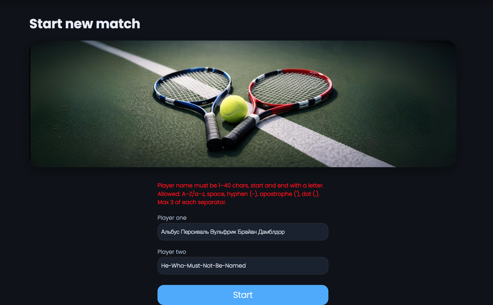
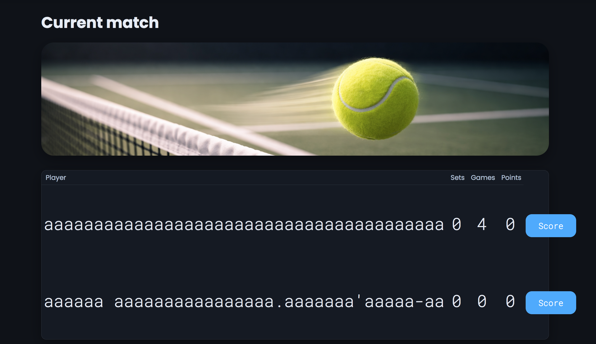
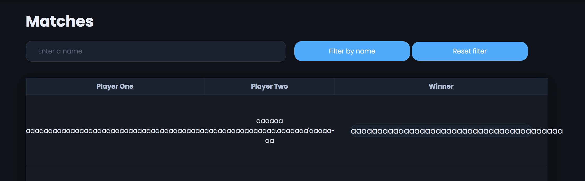
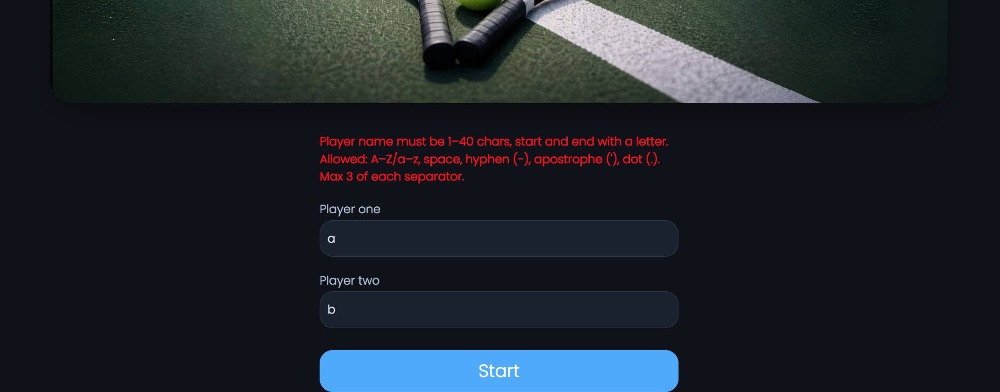

# Review на реализацию от [@prplhd](https://github.com/prplhd/TennisScoreboard) проекта [Табло теннисного матча](https://zhukovsd.github.io/java-backend-learning-course/projects/tennis-scoreboard/)

```text
1. Знаком ❗️ помечены критически важные замечания, а также места нарушения ТЗ.
2. Если ❗️ стоит перед заголовком, значит он относится ко всем пунктам этого раздела.
3. Замечания, указанные в пункте с именем пакета, относятся ко всем классам этого пакета или ко всем классам этого слоя.
4. Знаком 💡 помечены блоки, в которых содержится подсказка по реализации какого-то приёма или части кода. 
   Такие пункты всегда находятся в сворачиваемом блоке и разворачиваются по нажатию. 
   Перед их раскрытием стоит постараться придумать или поискать решение самостоятельно. 
```

## Функциональный обзор

- Сообщение об ошибке описывает все правила валидации, но не сообщает, что именно сейчас не так.



Лучше сообщать какое именно правило валидации сейчас нарушает имя.

- Имена с максимальной длиной не помещаются в разметку текущего матча 



а также в таблицу с результатами



- Невозможно создать игроков с однобуквенными именами, хотя сообщение говорит об обратном



## storage.db.hibernate.entity

### BaseEntity

- ❗️Интерфейс `BaseEntity` обязывает все сущности реализовывать публичный метод `setId(ID id)`. Для сущностей, у которых идентификатор генерируется базой данных (как в `PlayerEntity` и `MatchEntity` с аннотацией `@GeneratedValue`), предоставление публичного сеттера является опасной практикой. Это позволяет изменять идентификатор уже существующего в базе данных объекта, что может привести к рассинхронизации состояния и нарушению целостности данных. Ответственность за присвоение `id` лежит на JPA-провайдере (Hibernate), а не на коде приложения.

Стоит удалить метод `setId(ID id)` из интерфейса `BaseEntity`. Контракт (пока интерфейс остаётся в проекте) должен гарантировать только наличие геттера.

- Этот интерфейс не решает ни одной конкретной задачи в текущей реализации. Он является заделом на будущее, описывая контракт для любых JPA-Entity. Это не соответствует принципу YAGNI (You Ain't Gonna Need It / "Вам это не понадобится"). 

> **YAGNI (You Aren't Gonna Need It)** — принцип разработки ПО, гласящий: «Вам это не понадобится» и призывающий не добавлять избыточную функциональность «на всякий случай», а реализовывать только то, что нужно сейчас. Это помогает избежать лишней сложности и сосредоточиться на текущих требованиях.

Код должен решать существующие проблемы, а не гипотетические. Введение `BaseEntity` вероятно основано на предположении, что в будущем может потребоваться единообразная работа с ID разных сущностей, однако на данный момент такой потребности нет.

Любая дополнительная абстракция, даже самая простая, увеличивает когнитивную нагрузку на разработчиков. Вместо того чтобы нести пользу, она заставляет задаваться вопросом "Зачем это здесь?", ответа на который нет в текущем коде.

Стоит полностью удалить данный интерфейс и все его упоминания из кодовой базы:

1.  Удалить файл `src/main/java/ru/prplhd/tennisscoreboard/storage/db/hibernate/entity/BaseEntity.java`.

2.  Убрать объявление `implements BaseEntity<...>` из классов-сущностей.

3.  Убрать соответствующее ограничение дженерика из класса `BaseRepository`.

    Сейчас так:
    ```java
    public abstract class BaseRepository<ID extends Serializable, E extends BaseEntity<ID>> implements Repository<ID, E>
    ```
    
    Станет так:
    ```java
    public abstract class BaseRepository<ID extends Serializable, E> implements Repository<ID, E>
    ```

В коде останутся только те элементы, которые необходимы для решения текущих задач.

### PlayerEntity

<div align="right">

[Перейти к упоминанию в MatchEntity](#matchentity) </div>

- ❗️️Аннотация `@AllArgsConstructor` позволяет создать объект PlayerEntity c установленным ID. Поле `id` является первичным ключом, генерируемым базой данных. Предоставление возможности устанавливать его напрямую в коде может привести к рассинхронизации объекта в приложении с его представлением в базе данных, а также к конфликтам при сохранении.

Стоит удалить аннотацию `@AllArgsConstructor`. Для создания новых, ещё не сохранённых в БД, игроков создать более безопасный и корректный конструктор вручную.

<details>

<summary><b>💡 Вот такой 💡</b></summary>

---

```java
public PlayerEntity(String name) {
    this.name = name;
}
```

---

</details>

По этой же причине в классе не должно быть аннотации `@Builder`. 

- ❗️Аннотация `@Builder` предоставляет гибкий, но неконтролируемый способ создания объектов. 

Как и `@AllArgsConstructor` или `@Setter`, стандартный `@Builder` позволяет установить любое поле, включая `id`. Он также позволяет создать объект, не установив обязательные поля (например, `name`), что приведёт к ошибке на этапе сохранения в базу данных. Для сущностей, где важно обеспечить валидное состояние при создании, `@Builder` часто бывает слишком "разрешающим".

Стоит удалить аннотацию `@Builder` и использовать для создания объектов определённый в предыдущем пункте публичный конструктор (со всеми полями, кроме ID).

- ❗️Аннотация `@NoArgsConstructor` без параметров создаёт `public` конструктор, позволяющий создавать невалидные объекты (без установки обязательных полей) в любом месте приложения. Hibernate достаточно конструктора без параметров с уровнем доступа protected — поэтому можно именно это значение установить в аннотации: `@NoArgsConstructor(access = AccessLevel.PROTECTED)`.

  Это предотвратит создание пустых, невалидных объектов из других частей приложения и будет сигналом другим разработчикам (потенциально), что этот конструктор предназначен в первую очередь для использования фреймворком, а не для прямого вызова в коде.

- ❗️Аннотация `@Setter` генерирует публичные сеттеры для всех полей класса:

  - Публичный сеттер для поля `id` позволяет изменять первичный ключ объекта, что может привести к полной рассинхронизации состояния сущности в приложении и её записи в базе данных.

  - Публичный сеттер для поля `name` позволяет произвольно менять имя игрока, которое должно быть его уникальным и неизменяемым свойством в рамках бизнес-логики.

Как исправить: удалить аннотацию `@Setter`. Инициализация полей должна происходить только один раз в момент создания объекта через конструктор.

- Использование `@EqualsAndHashCode(of = "name")` является одним из приемлемых подходов на JPA-Entity, но он не лишён недостатков, особенно в сочетании с изменяемыми полями. Контракт методов `equals()` и `hashCode()` подразумевает, что их результат не должен меняться в течение жизненного цикла объекта, если он используется в коллекциях (например, `HashSet` или в качестве ключа в `HashMap`). В текущем классе есть аннотация `@Setter`, которая позволяет изменить поле `name`. Если объект `PlayerEntity` был помещён в `HashSet`, а затем его `name` изменили, то поиск этого объекта в `HashSet` (например, через `contains()`) может вернуть `false`, даже если объект там находится. Это приводит к непредсказуемому поведению и трудноуловимым ошибкам.

Хорошим решением будет — сделать сущность неизменяемой (immutable), удалив `@Setter`, как было предложено в предыдущем пункте. Это гарантирует, что хеш-код, рассчитанный по полю `name`, никогда не изменится.

- Поле `id` имеет тип `Integer`, который имеет максимальное значение `~2.1` миллиарда. Хотя `Integer` соответствует ТЗ (`Int`), в долгосрочной перспективе это может стать проблемой. Максимальное значение `Integer` может быть исчерпано в системах с большим количеством записей. Общепринятой и хорошей практикой для первичных ключей является использование типа `Long`. Лучше заменить тип поля `id` на `Long`.

- Класс перегружен аннотациями Lombok, часть из которых не нужна или даже вредна для JPA-сущности. Хорошим подходом будет оставить минимум необходимых аннотаций, достаточных для JPA Entity.

Сейчас так:

```java
@NoArgsConstructor
@AllArgsConstructor
@Getter
@Setter
@EqualsAndHashCode(of = "name")
@ToString(of = {"id","name"})
@Builder
@Table(name = "players")
@Entity
public class PlayerEntity implements BaseEntity<Integer> {
    // поля
}
```

Лучше так:

```java
@NoArgsConstructor(access = AccessLevel.PROTECTED)
@Getter
@EqualsAndHashCode(of = "name")
@ToString(of = {"id","name"})
@Table(name = "players")
@Entity
public class PlayerEntity implements BaseEntity<Integer> {
    // поля
    public PlayerEntity(String name) {
        this.name = name;
    }
}
```

- ❗️Противоречивые ограничения на максимальную длину имени игрока (`name`) между тремя уровнями приложения:
  - Бизнес-валидация (в классе `Validator`): Максимальная длина 40 символов.
  - Схема БД (в файле `V1__init_tables.sql`): Поле определено как `VARCHAR(180)`.
  - JPA-Entity (в классе `PlayerEntity`): В аннотации `@Column` не указан параметр `length`, что означает значение по умолчанию 255 символов.

Такое несоответствие создаёт хрупкую и непредсказуемую систему. Например, разработчик, смотрящий только на `PlayerEntity`, будет думать, что лимит — 255 символов, что не соответствует ни бизнес-требованиям, ни реальной схеме БД.

Сейчас самая строгая проверка находится на уровне бизнес-логики (40 символов) и она предотвращает ошибки. Если в будущем эта валидация будет изменена, ослаблена или обойдена (например, при пакетном импорте данных), система столкнётся с неожиданным поведением. Попытка сохранить имя длиной 200 символов пройдёт валидацию JPA (лимит 255), но вызовет ошибку `JdbcSQLDataException` (`"Value too long for column "NAME CHARACTER VARYING(180)"`) из-за ограничений на уровне базы данных (лимит 180).

Стоит привести все три уровня к единому, консистентному значению. Логичным выбором будет ограничение в 40 символов.

- Уникальность поля `name` обеспечивается атрибутом `unique = true` в аннотации `@Column`. Хотя `unique = true` приводит к созданию уникального индекса, явное определение индекса через аннотацию `@Table` даёт больше контроля и улучшает читаемость кода. В `@Index` можно задать имя для индекса, что упрощает его администрирование в будущем, и сама аннотация явно декларирует намерение создать индекс для оптимизации поиска.

Можно добавить явное определение индекса на уровне класса.

<details>

<summary><b>💡 Вот так 💡</b></summary>

---

```java
@Table(name = "players", indexes = @Index(name = "idx_player_name", columnList = "name", unique = true))
@Entity
public class PlayerEntity {
    // ...
    @Column(nullable = false, length = 40)
    private String name;
}
```

При таком подходе параметр `unique = true` из аннотации `@Column` можно удалить, так как уникальность теперь задана в `@Index`.

---

</details>

### MatchEntity

- Пункты про:
  - ❗️Создание конструктора без ID вместо `@AllArgsConstructor`
  - ❗️Добавление `access = AccessLevel.PROTECTED` в `@NoArgsConstructor`
  - ❗️Избавление от `@Setter` и `@Builder`
  - Замену типа поля `id` на `Long`
  - Избавление от лишних аннотаций

описанные в разделе [PlayerEntity](#playerentity), актуальны и для этого класса.

- `@EqualsAndHashCode(of = "id")` основывает сравнение объектов на поле `id`, которое равно `null` до сохранения сущности в базу данных.

Это ведёт к проблемам с коллекциями: Если добавить новый `MatchEntity` (с `id = null`) в `HashSet`, его хэш-код изменится после сохранения, и объект "потеряется" в коллекции.

А также к неверному сравнению: Все новые, несохранённые матчи будут считаться равными друг другу, что логически неверно.

Хорошей практикой для `equals`/`hashCode` в JPA-сущностях является использование стабильного бизнес-ключа. В `MatchEntity` такого очевидного ключа нет. В качестве надёжной альтернативы можно было бы добавить поле `UUID`, генерируемое при создании объекта, и использовать его для `equals`/`hashCode`. Но поскольку сравнение сущностей не является бизнес-требованием, самое безопасное — вообще не переопределять `equals` и `hashCode`, оставив реализацию из класса `Object` (сравнение по ссылке).

- `@ToString(of = "id")` генерирует неинформативное текстовое представление объекта (например, `MatchEntity(id=1)`), что бесполезно для отладки. Основная цель `toString()` — предоставлять полезную информацию для логов и отладки. `toString()`, основанный только на `id`, не даёт никакого представления о содержимом матча, особенно если `id` ещё не присвоен.

Лучше включить в `toString()` более полезные поля. Чтобы избежать `LazyInitializationException` при обращении к связанным сущностям, лучше использовать их ID.

Для большей безопасности можно написать метод вручную.

<details>

<summary><b>💡 Вот так 💡</b></summary>

---

```java
@Override
public String toString() {
    return "MatchEntity{" +
           "id=" + id +
           ", player1Id=" + (player1 != null ? player1.getId() : null) +
           ", player2Id=" + (player2 != null ? player2.getId() : null) +
           ", winnerId=" + (winner != null ? winner.getId() : null) +
           '}';
}
```

---

</details>

- ❗️Слово `MATCHES` (а также `MATCH`) является зарезервированным ключевым словом в некоторых диалектах SQL (например, для оператора `MATCH ... AGAINST` в полнотекстовом поиске). Хотя в конкретно в этом проекте проблем с этим не возникнет, не стоит использовать зарезервированные слова в качестве имён таблиц. Это может приводить к необходимости экранировать имя таблицы в нативных SQL-запросах или к синтаксическим ошибкам в некоторых СУБД.

[**Использование зарезервированных слов в качестве названий в БД**](#sql-keywords) <a id="back-from-sql-keywords"></a>

Лучше выбирать имена, которые гарантированно не конфликтуют с зарезервированными словами. Учитывая, что в таблице хранятся только завершённые матчи, можно выбрать более описательное и безопасное имя `FINISHED_MATCHES` или более общее `TENNIS_MATCHES`.

- Колонки, связывающие матч с игроками (`player1`, `player2`, `winner`), по умолчанию являются изменяемыми (`updatable = true`).

По логике, после того как матч завершён и сохранён, его участники и победитель меняться не должны. Разрешение на их изменение на уровне JPA является избыточным и потенциально небезопасным.

Можно явно указать, что эти колонки не должны обновляться, добавив `updatable = false` в аннотации `@JoinColumn`.

Сейчас так:

```java
@JoinColumn(name = "player1")
```

Лучше так:

```java
@JoinColumn(name = "player1", updatable = false)
```

- Поля игроков используют числительные в виде цифр (`player1`, `player2`), тогда как в другом месте приложения (в сервисе) внутренние переменные, обозначающие тех же игроков, именуются словами (`firstPlayer`, `secondPlayer`).

```java
public class MatchEntity implements BaseEntity<Integer> {
    // ...
    private PlayerEntity player1;

    // ...
    private PlayerEntity player2;

    // ...
}

/**
 * В FinishedMatchesPersistenceServiceImpl
 */
@Override
public void saveMatch(MatchDto matchDto) {
    PlayerEntity firstPlayer = ...

    PlayerEntity secondPlayer = ...

    PlayerEntity winner = ...

    MatchEntity matchEntity = MatchEntity.builder()
            .player1(firstPlayer)
            .player2(secondPlayer)
            .winner(winner)
            .build();

    // ...
}
```

Отсутствие единого, последовательного стиля именования может затруднять чтение кода. Разработчику приходится тратить дополнительное время и умственные усилия, чтобы убедиться, что `player1` и `firstPlayer` являются обозначениями одной и той же сущности. Это создаёт ненужную когнитивную нагрузку.

Также непоследовательное именование повышает риск случайных ошибок, особенно при копировании/вставке кода или при работе с большим количеством схожих переменных, когда легко перепутать один стиль с другим.

Стоит привести именование к единому стилю, используя либо только цифры, либо только слова.

Например, так:

```java
public class MatchEntity implements BaseEntity<Integer> {
    // ...
    private PlayerEntity firstPlayer;

    // ...
    private PlayerEntity secondPlayer;

    // ...
}
```

Использование слов (например, `firstPlayer` и `secondPlayer`) даёт несколько преимуществ перед использованием цифр:

  - Визуальное различие и читаемость: Имена `firstPlayer` и `secondPlayer` визуально отличаются друг от друга сильнее, чем `player1` и `player2`. Это снижает вероятность их перепутать при быстром просмотре кода. Кроме того, такие имена читаются более естественно, как обычный текст.

  - Эффективность работы в IDE: При вводе `first...`, IntelliJ IDEA однозначно предложит подсказку `firstPlayer`. При вводе `player...` IDE предложит оба варианта (`player1`, `player2`), что требует дополнительного действия для выбора нужного.

  - Удобство поиска: Искать по кодовой базе переменную тоже `firstPlayer` может быть проще, чем `player1` (по причине, из предыдущего пункта).

- Колонки для внешних ключей названы `player1`, `player2`, `winner`. Ещё более читаемым был бы стиль `snake_case` с суффиксом `_id`, чтобы явно показать, что колонка хранит идентификатор.

Сейчас так:

```java
@JoinColumn(name = "player1")
private PlayerEntity player1;

@JoinColumn(name = "player2")
private PlayerEntity player2;

@JoinColumn(name = "winner")
private PlayerEntity winner;
```

Лучше так:

```java
@JoinColumn(name = "first_player_id")
private PlayerEntity firstPlayer;

@JoinColumn(name = "second_player_id")
private PlayerEntity secondPlayer;

@JoinColumn(name = "winner_id")
private PlayerEntity winner;
```

После этого надо будет изменить названия колонок в файле миграции (`V1__init_tables.sql`).

## domain

### Player

- Даже если сейчас у класса есть только final поля, то всё равно лучше использовать максимально "узкую" аннотацию `@RequiredArgsConstructor` вместо `@AllArgsConstructor`. Чтобы при добавлении новых non-final полей они автоматически не попадали в параметры конструктора.

- ❗️Доменная модель `Player` содержит поле `id`, которое является деталью реализации слоя персистентности (базы данных). Это является "протечкой" деталей инфраструктуры (в данном случае, ключа из БД) в доменную модель.

Доменная модель должна оперировать понятиями и идентификаторами из предметной области. В данном случае, бизнес-идентификатором является `name`. `id` — это артефакт, нужный для оптимизации работы реляционной базы данных. Его присутствие в доменном объекте `Player` загрязняет модель.

Для доменной логики может быть достаточно уникального имени игрока, поэтому можно вообще удалить поле `id` из доменного модели `Player`.

Сейчас так:

```java
public class Player {
    private final Integer id;
    private final String name;
}
```

Лучше так:

```java
public class Player {
    private final String name;
}
```

Так граница между доменной логикой (`Player`) и слоем данных (`PlayerEntity`) станет более строгой.

### Match

- ❗️Текущая реализация концентрирует всю логику оркестрации в классе `Score`, в то время как данные о счёте "размазаны" по не связанным иерархически классам (`*PointScore`, `GameScore`, `SetScore`).

Почему это проблема:

  - Класс `Score` становится слишком сложным и нарушает принцип единственной ответственности (SRP). Он отвечает за координацию всех уровней счёта (очки, геймы, сеты, тай-брейки), что делает его трудным для понимания и изменения.

  - Иерархия "матч -> сет -> гейм -> очко" является фундаментальной для тенниса, но в текущей модели она выражена неявно, через логику в классе `Score`. Более объектно-ориентированный подход — это отразить эту иерархию напрямую в структуре классов.

<details>

<summary><b>💡 Вот так 💡</b></summary>

---

Можно сделать этот класс (`Match`) верхним уровнем в цепочке классов, отвечающих за счёт на конкретном этапе теннисного матча (отвечающим за общий счёт в матче). Базовый для всех уровней класс будет хранить игроков, а также коллекцию объектов нижнего уровня (которая будет наполняться по мере игры). Тогда логика будет такой: матч вызывает начисление очка в текущем сете, сет вызывает начисление очка в текущем гейме (или тайбрейке), и если нижний уровень оказывается завершён после очередного очка, то верхний уровень увеличивает счёт конкретного игрока у себя.

Помимо прочего такая модель станет более гибкой для анализа (например, для сбора статистики по геймам) и расширения (например, для введения правил коротких сетов).

---

</details>

PS: Возможно предложенный в этом пункте рефакторинг сделает неактуальными все последующие замечания, в том числе в классах других моделей, но сейчас они есть в проекте, поэтому тоже будут рассмотрены.

- Победитель матча (`winner`) хранится как поле класса `Match`, которое устанавливается в момент завершения игры. 

Это создаёт дублирование информации: Информация о том, кто победил, уже содержится в объекте `score`. Поле `winner` лишь дублирует эти данные.

Нужно дополнительно следить, чтобы при завершении матча устанавливалось значение в это поле:

```java
ScoreEffect result = score.pointWonBy(playerSide);
if (result == ScoreEffect.MATCH_WON) {
    isFinished = true;
    winner = winnerCandidate;
}
```

Существует (хоть и малая) вероятность, что логика в методе `pointWonByPlayerId` изменится, и возникнет состояние, когда матч по счёту завершён, а поле `winner` осталось `null`, или наоборот.

Можно заменить это поле методом, который будет вычислять победителя по счёту.

<details>

<summary><b>💡 В таком духе 💡</b></summary>

---

```java
public Optional<Player> getWinner() {
    if (didFirstPlayerWin()) {
        return Optional.of(firstPlayer);
    }
    if (didSecondPlayerWin()) {
        return Optional.of(secondPlayer);
    }
    return Optional.empty();
}
```

---

</details>

Так класс `Match` станет проще, так как в нём будет меньше полей, состояние которых нужно отслеживать.

Победитель всегда будет вычисляться напрямую из счёта, что устраняет саму возможность рассинхронизации и создаст Единый источник истины (SSoT).

[**Принцип Single Source of Truth (SSOT)**](#ssot-principle) <a id="back-from-ssot-principle"></a>

- Статус завершения матча (`isFinished`) хранится как отдельное `boolean` поле.

По тем же причинам, что и в случае с полем `winner`, это является избыточным состоянием. Матч считается завершённым тогда и только тогда, когда определён победитель. Хранение этого флага отдельно создаёт риск рассогласования (например, `winner != null`, а `isFinished == false`).

Стоит удалить поле `isFinished` и заменить его методом `isFinished()`, который будет основываться на наличии победителя.

<details>

<summary><b>💡 Например, так 💡</b></summary>

---

```java
public boolean isFinished() {
    return getWinner().isPresent(); // подразумевается метод getWinner() из примера к предыдущему пункту
}
```

---

</details>

Это сделает невозможными неконсистентные состояния.

- ❗️Метод `getScoreboard()` создаёт и возвращает `MatchDto`, что создаёт зависимость доменного слоя от слоя DTO.

```java
public class Match {
    // ...
    public MatchDto getScoreboard() {
        return new MatchDto(
            //...
        );
    }
}
```

Такая зависимость нарушает принципы чистой архитектуры. Если в будущем формат DTO изменится (например, для другого API), придётся изменять доменную модель, чего быть не должно. Доменный слой (`domain`) должен быть ядром приложения и не должен ничего знать о вышестоящих слоях, таких как DTO (Data Transfer Objects) или слой представления. DTO — это структуры для передачи данных, а не часть бизнес-логики.

Преобразование доменного объекта `Match` в `MatchDto` должно происходить вне класса `Match`. Обычно для этого создают отдельный класс-маппер или делают это в сервисном слое. Метод `getScoreboard()` следует удалить, а вместо него предоставить геттеры для необходимых полей, чтобы внешний маппер мог собрать из них DTO.

- В коде используются стандартные, неконкретные исключения `IllegalArgumentException` и `IllegalStateException`.

```java
public Match(Player firstPlayer, Player secondPlayer) {
    if (Objects.equals(firstPlayer.getId(), secondPlayer.getId())) {
        throw new IllegalArgumentException("firstPlayer and secondPlayer must be different");
    }
    // ...
}

public ScoreEffect pointWonByPlayerId(Integer id) {
    if (isFinished) {
        throw new IllegalStateException("Match already finished");
    }
    // ...
}
```

Хотя эти исключения технически корректны, они являются слишком общими. Если вызывающий код захочет обработать ошибку "матч уже завершён" отдельно от других ошибок `IllegalStateException`, он не сможет этого сделать. Код становится менее надёжным, так как он не может избирательно реагировать на конкретные бизнес-ситуации.

Стоит создать и использовать собственные, семантически богатые исключения, наследуемые от стандартных.

<details>

<summary><b>💡 Вот так 💡</b></summary>

---

```java
public class MatchAlreadyFinishedException extends IllegalStateException {
    public MatchAlreadyFinishedException() {
        super("Match already finished");
    }
}

if (isFinished) {
    throw new MatchAlreadyFinishedException();
}
```

Аналогично можно создать `SamePlayerException extends IllegalArgumentException`.

---

</details>

- Метод `pointWonByPlayerId` в качестве аргумента принимает примитивный тип `Integer id` вместо доменного объекта.

```java
public ScoreEffect pointWonByPlayerId(Integer id) {
    // ...
}
```

`Integer` не несёт в себе никакого смысла, кроме того, что это число. Это может быть ID игрока, ID матча или чего-то ещё. Использование доменного объекта `Player` сделало бы API более выразительным и типобезопасным.

При выполнении рефакторинга, предложенного в первом пункте, скорее всего, эта проблема исчезнет сама.

- Публичный метод `public ScoreEffect pointWonByPlayerId(Integer id)` возвращает значение типа `ScoreEffect`. `ScoreEffect` является внутренней деталью реализации системы подсчёта очков, а не частью публичного контракта доменного объекта `Match`.

`ScoreEffect` (со значениями `GAME_WON`, `SET_WON` и т.д.) — это внутренний компонент доменной логики. Выставление его наружу через публичный API класса `Match`, раскрывает детали внутреннего устройства. Клиенты класса `Match` (например, сервисный слой) не должны знать об этих служебных эффектах — они должны оперировать на более высоком уровне: "матч завершён?", "какой текущий счёт?".

Также вызывающий код (`InMemoryOngoingMatchRepository`) никак не использует возвращаемое значение `ScoreEffect`. Это делает API запутанным — он предоставляет данные, которые никому не нужны. Это может сбить с толку разработчика, который будет пытаться понять, зачем нужен этот результат и не упускает ли он какую-то важную логику.

Стоит изменить сигнатуру метода так, чтобы он ничего не возвращал (`void`).

### PlayerSide

- Для определения противоположной стороны используется `switch`-выражение, что для случая с двумя вариантами является немного многословным.

```java
public PlayerSide getOpponent() {
    return switch (this) {
        case FIRST -> SECOND;
        case SECOND -> FIRST;
    };
}
```

`switch` наиболее удобен, когда нужно обработать три и более случая, а для простого бинарного выбора "или-или" существует более лаконичный способ:

<details>

<summary><b>💡 Вот такой 💡</b></summary>

---

Поскольку новых значений в enum не предвидится, можно заменить `switch`-выражение на тернарный оператор.

```java
public PlayerSide getOpponent() {
    return this == FIRST ? SECOND : FIRST;
}
```

В таких простых методах это может немного улучшить читаемость, так как вся логика умещается в одной строке и сразу понятна суть — "если это `FIRST`, вернуть `SECOND`, иначе — `FIRST`". Это делает код чуть более лаконичным без потери ясности.

---

</details>

- Сейчас в проекте присутствует enum `PlayerSide`, который определяет сторону игрока в матче, а также доменная модель игрока — класс `Player`.

  - Наличие двух разных абстракций (сторона и сам игрок) для описания участников матча усложняет модель. В этом проекте это не выглядит оправданным.
  - Требуется постоянное преобразование между `PlayerSide` и конкретным игроком, что добавляет лишний код (например, в методе `pointWonByPlayerId` в `Match` приходится по ID определять сторону, а затем передавать её в `Score`).

Можно обойтись без отдельного enum, используя непосредственно объекты `Player`: удалить enum `PlayerSide`, а везде, где требуется указать, какой игрок совершил действие, передавать ссылку на объект `Player` (или его имя). Логику получения противника (метод `getOpponent(Player player)`) можно перенести в базовый для всех уровней класс (например `AbstractTennisLevel`).

## domain.score

- Названия классов `*PointScore`, `GameScore` и `SetScore` не в полной мере отражают уровень абстракции, за который они отвечают.

Сейчас названия описывают единицу, которую класс считает (очки, геймы, сеты), а не иерархический уровень, который он представляет (счёт в гейме, счёт в сете, счёт в матче). Это расходится с естественным языком предметной области. Например, когда говорят "счёт в гейме", имеют в виду очки, а не геймы. Разработчикам придётся постоянно мысленно "переводить" названия, что замедляет понимание кода и может приводить к ошибкам.

Стоит переименовать классы так, чтобы их название соответствовало уровню счёта, который они моделируют.

Сейчас так:

```java
// Считает очки в обычном гейме
public class DefaultPointScore implements PointScore {
    private PointValue firstPlayerPoints = PointValue.LOVE;
    private PointValue secondPlayerPoints = PointValue.LOVE;
    // ...
}

// Считает очки в тай-брейке
public class TiebreakPointScore implements PointScore {
    private int firstPlayerPoints = 0;
    private int secondPlayerPoints = 0;
    // ...
}

// Считает геймы (очки в сете)
public class GameScore {
    private int firstPlayerGames = 0;
    private int secondPlayerGames = 0;
    // ...
}

// Считает сеты (очки в матче)
public class SetScore {
    private int firstPlayerSets = 0;
    private int secondPlayerSets = 0;
    // ...
}
```

Лучше так:

```java
// Класс для подсчёта очков в гейме
public class GameScore {
    private PointValue firstPlayerPoints = PointValue.LOVE;
    private PointValue secondPlayerPoints = PointValue.LOVE;
    // ...
}

// Класс для подсчёта очков в тай-брейке
public class TiebreakScore {
    private int firstPlayerPoints = 0;
    private int secondPlayerPoints = 0;
    // ...
}

// Класс для подсчёта геймов в сете
public class SetScore {
    private int firstPlayerGames = 0;
    private int secondPlayerGames = 0;
    // ...
}

// Класс для подсчёта сетов в матче
public class MatchScore {
    private int firstPlayerSets = 0;
    private int secondPlayerSets = 0;
    // ...
}
```

Новые имена будут точнее соответствовать своему контексту. `GameScore` будет отвечать за счёт внутри гейма, `SetScore` — за счёт внутри сета, а `MatchScore` — за счёт внутри матча. Именование будет полностью совпадать с общепринятой теннисной терминологией и код станет самодокументируемым и будет легче восприниматься.

### PointScore

- Методы `getFirstPlayerPoints()` и `getSecondPlayerPoints()` возвращают `String`.

```java
String getFirstPlayerPoints();

String getSecondPlayerPoints();
```

Интерфейс `PointScore` является частью доменного слоя, который должен отвечать за бизнес-логику (как считаются очки), а не за их представление (как они отображаются на экране). Возвращая `String`, интерфейс берёт на себя ответственность за форматирование, что является задачей слоя представления (View) или специальных мапперов. Это смешивает ответственности и делает доменную модель менее "чистой".

Вместо этого можно изменить методы так, чтобы они возвращали не `String`, а более структурированный доменный объект, который представляет очко как концепцию.

<details>

<summary><b>💡 Например, так 💡</b></summary>

---

1. Создать общую абстракцию для "очка": Нужен не-дженерик базовый тип, чтобы интерфейс `PointScore` мог его возвращать без wildcards (`?`).

```java
public abstract class GamePoint {
    // Общий контракт: любое очко можно представить в виде строки
    public abstract String asString();
}
```

На первый взгляд может показаться, что так проблема просто переносится на один шаг дальше (метод `abstract String asString()` возвращает строку, как и методы интерфейса `PointScore` cейчас), но на самом деле разница фундаментальна.

<details>

<summary><b>Вот почему</b></summary>

---

Проблема оригинального дизайна не в том, что где-то в коде существует метод, возвращающий `String`, а в том, что возвращает основной интерфейс `PointScore`. Ключевая разница заключается в контракте, который предоставляет интерфейс `PointScore`, и в типе информации, который он передаёт своим клиентам (в данном случае, классу `Score` или будущему мапперу).

#### Подход 1: `getFirstPlayerPoints()` возвращает `String` (текущая реализация)

  - Контракт интерфейса: `PointScore` обещает: "Кто бы меня ни реализовывал (`DefaultPointScore` или `TiebreakPointScore`), я гарантирую, что в ответ на запрос об очках он получит готовую `String`".
  - Потеря информации: В момент, когда `TiebreakPointScore` преобразует свой `int` в `String` или `DefaultPointScore` возвращает строковое представление своего `enum PointValue`, вся информация о природе очков теряется. Клиент, получивший строку "40", не знает, является ли это числом, специальным значением или чем-то ещё. Он не может спросить у этой строки: "Ты являешься гейм-пойнтом?".
  - Реализация (`DefaultPointScore` или `TiebreakPointScore`) полностью диктует клиенту, что он может делать с результатом — ничего, кроме как отобразить его. Гибкость отсутствует.

Это похоже на то, как если бы метод, возвращающий информацию о пользователе, возвращал одну большую строку `“Имя: Иван, Возраст: 30”` вместо объекта `User`. Было бы невозможно программно получить возраст, не распарсив эту строку.

#### Подход 2: `getFirstPlayerPoints()` возвращает `GamePoint` (предлагаемый вариант)

  - Контракт интерфейса: `PointScore` обещает: "Кто бы меня ни реализовывал, я гарантирую, что он получит в ответ объект типа `GamePoint` — полноценный доменный объект, представляющий очко".
  - Сохранение информации: Клиент получает объект, который сохраняет всю информацию о своей природе. Клиент знает, что у него в руках именно "очко", а не просто набор символов.
  - Гибкость у клиента: Теперь у клиента, получившего объект `GamePoint`, появляется выбор:
    - Просто отобразить: Если ему нужна строка для UI, он вызывает `gamePoint.asString()`.
    - Принять решение: Он может проверить реальный тип объекта: `if (gamePoint instanceof RegularPoint)`, чтобы выполнить какую-то особую логику.
    - Получить специфичные данные: Он может безопасно привести тип и вызвать уникальный метод: например, `boolean isAdv = ((RegularPoint) gamePoint).isAdvantage();`.

#### ---

Иными словами, суть не в том, что в конце цепочки вызовов появляется `String`, а в том, на каком уровне происходит необратимая потеря информации.

  - В первом подходе `PointScore` сразу возвращает плоские данные (`String`), лишая клиентов какой-либо гибкости.
  - Во втором подходе `PointScore` возвращает богатый доменный объект (`GamePoint`), а уже клиент решает, как его использовать. Метод `asString()` в этом случае — это лишь одна из возможностей (опциональная проекция объекта), а не единственно возможный результат.

---

</details>

2. Создать конкретные реализации для каждого типа очков:

```java
public class RegularPoint extends GamePoint {
    private final PointValue value;
    
    public RegularPoint(PointValue value) { 
        this.value = value; 
    }
    
    @Override
    public String asString() { 
        return value.getDisplayValue(); 
    }
}

public class TiebreakPoint extends GamePoint {
    private final int value;
    
    public TiebreakPoint(int value) { 
        this.value = value; 
    }
    
    @Override
    public String asString() { 
        return String.valueOf(value); 
    }
}
```

3. Обновить интерфейс `PointScore`: Теперь его методы могут возвращать богатую доменную модель, представляющую очки.

```java
public interface PointScore {
    // ...
    GamePoint getFirstPlayerPoints();
    GamePoint getSecondPlayerPoints();
}
```

#### Сравнение с текущим решением (возврат `String`)

| Аспект | Текущее решение (`String`) | Предлагаемое решение (`GamePoint`)                                                                                                                                              |
| :--- | :--- |:--------------------------------------------------------------------------------------------------------------------------------------------------------------------------------|
| **Простота** | Максимально простое. Не требует новых классов. | Более сложное. Требует создания 3 новых классов/типов.                                                                                                                          |
| **Объектно-ориентированность** | Низкая. Возвращается примитивный тип `String`, теряется вся информация о контексте. | **Высокая.** Возвращается полноценный доменный объект (`GamePoint`), который инкапсулирует в себе и значение, и поведение.                                                      |
| **Расширяемость** | Нулевая. `String` нельзя расширить новой логикой. | **Высокая.** В классы `RegularPoint` или `TiebreakPoint` можно легко добавлять новые методы (`isGamePoint()`, `isAdvantage()` и тд), обогащая доменную модель.                  |
| **Безопасность типов** | Низкая. Клиент получает строку и должен сам её интерпретировать. | **Высокая.** Клиент получает объект `GamePoint` и может через `instanceof` безопасно определить, с каким именно типом очков он работает, и вызвать специфичные для него методы. |

Текущий подход с возвратом `String` — это прагматичный компромисс в пользу простоты, но он делает доменную модель более плоской и лишает её гибкости.

Предложенный вариант создаёт более полноценную, расширяемую и типобезопасную модель для представления очков. Небольшое увеличение количества классов является оправданной платой за значительное улучшение качества и чистоты архитектуры.

---

</details>

- Интерфейс содержит метод `getMode()`, который возвращает `enum PointScoreMode`. Клиент этого интерфейса (класс `Score`) использует этот метод, чтобы понять, с какой реализацией (`DefaultPointScore` или `TiebreakPointScore`) он в данный момент работает.

```java
/**
 * В Score
 */
private void switchToDefaultIfTiebreak() {
    if (pointScore.getMode() == PointScoreMode.TIEBREAK) { // Клиент спрашивает о типе
        pointScore = defaultPointScore;
    }
}

private void switchToTiebreakIfStarted(ScoreEffect gameScoreEffect) {
    if (gameScoreEffect == ScoreEffect.TIEBREAK_STARTED) { // Клиент спрашивает о типе
        pointScore = tiebreakPointScore;
    }
}
```

Вместо того чтобы полностью полагаться на полиморфное поведение, клиент вынужден спрашивать у объекта: "Какого ты типа?". Это является признаком того, что абстракция (интерфейс `PointScore`) неполная, и нарушает идею, что клиент должен работать с интерфейсом, не зная о его конкретных реализациях.

Хотя для текущего проекта существующее решение может быть приемлемо, можно подумать, как избавиться от `getMode()`. 

<details>

<summary><b>💡 Например, так 💡</b></summary>

---

Попробовать реализовать здесь паттерн состояние (State).

---

</details>

- Метод `pointWonBy` одновременно изменяет состояние объекта (является **командой**) и возвращает значение-результат (является **запросом**).

```java
ScoreEffect pointWonBy(PlayerSide scorerPlayerSide);
```

Это является небольшим нарушением принципа Command-Query Separation (CQS), который гласит, что метод должен либо изменять состояние системы (команда), либо возвращать данные (запрос), но не делать и то, и другое одновременно. Методы, которые и меняют состояние, и возвращают значение, могут быть менее предсказуемыми и сложнее в тестировании.

Как можно реализовать иначе: Можно разделить этот метод на два. Один будет командой, а другой — запросом.

```java
// Команда, которая только меняет состояние
void awardPointTo(PlayerSide scorerPlayerSide);

// Запрос, который возвращает текущий результат/эффект
ScoreEffect getCurrentEffect(); 
```

В этом случае клиентский код выглядел бы так: 

Сейчас так:

```java
/**
 * В Score
 */
ScoreEffect pointScoreEffect = pointScore.pointWonBy(playerSide);
```

Можно так:

```java
/**
 * В Score
 */
pointScore.pointWonBy(player); 
ScoreEffect effect = pointScore.getCurrentEffect();
```

Хотя это и более многословно, но строже следует принципу CQS.

В текущей реализации смешение команды и запроса может быть прагматичным компромиссом, но строгое разделение помогает строить более предсказуемые и надёжные компоненты.

- Интерфейс определяет два отдельных метода для получения очков каждого игрока: `getFirstPlayerPoints()` и `getSecondPlayerPoints()`.

Очки первого и второго игрока — это две части единого целого, "текущего счёта в гейме". Они почти всегда запрашиваются вместе. Наличие двух отдельных методов заставляет клиента делать два вызова, чтобы получить полную картину. Это также является признаком "группы данных" ([Data Clump](https://martinfowler.com/bliki/DataClump.html)) — набора переменных, которые постоянно используются вместе.

Можно объединить эти два метода в один, который будет возвращать единый объект-значение (Value Object), представляющий счёт.

- Метод `resetPoints()` описывает техническое действие ("сбросить очки"), а не бизнес-событие.

В "богатой" доменной модели имена методов в идеале должны отражать язык предметной области. Сброс очков происходит не просто так, а по конкретной бизнес-причине — гейм завершился.

Поэтому можно переименовать метод, чтобы он отражал бизнес-событие.

Сейчас так:

```java
void resetPoints();
```

Можно так:

```java
void completeGame(); 
// или
void prepareForNextGame();
```

Внутри этот метод по-прежнему будет сбрасывать очки, но для клиента интерфейса его название будет нести больше смысла. 

Когда названия методов отражают язык предметной области, код становится более выразительным и лучше отражает бизнес-процессы. Это упрощает понимание логики для разработчиков, которые знакомятся с кодом, так как они могут читать его в терминах предметной области ("завершить гейм"), а не в технических терминах ("сбросить очки").

- Хотя интерфейс `PointScore` и решает задачу полиморфизма для `DefaultPointScore` и `TiebreakPointScore`, в проекте остаётся значительное дублирование структуры и логики между всеми классами, отвечающими за счёт (`PointScore`, `GameScore`, `SetScore`).

Классы `GameScore` и `SetScore` по своей структуре практически идентичны: оба хранят два `int` поля для счёта каждого игрока, имеют геттеры, логику инкремента и тд. `DefaultPointScore` и `TiebreakPointScore` также имеют схожие повторяющиеся элементы. Это нарушает принцип DRY (Don't Repeat Yourself).

> **DRY (Don't Repeat Yourself)** — принцип «Не повторяйся», направленный на снижение повторения кода и логики, так как изменения в повторяющихся участках требуют правок во многих местах, что увеличивает риск ошибок. Централизация логики делает код более поддерживаемым и надёжным.

Все эти классы по своей сути являются разными реализациями одной и той же концепции — "счёт в рамках какой-то игровой единицы между двумя сторонами". Текущая архитектура не отражает эту общность. Интерфейс `PointScore` является шагом в верном направлении, но сейчас эта идея не доведена до конца и не охватывает `GameScore` и `SetScore`.

<details>

<summary><b>💡 Вот одна из идей, как это исправить 💡</b></summary>

---

Провести рефакторинг, введя общий базовый (возможно, абстрактный) класс, который инкапсулирует общую логику для "считающих" компонентов. Возможно, потребуется два класса — отдельно для "верхнего" уровня, который содержит подуровни, и отдельно для нижнего уровня — обычного гейма и тайбрейка. 

---

</details>

### DefaultPointScore

<div align="right">

[Перейти к упоминанию в TiebreakPointScore](#tiebreakpointscore) </div>

<div align="right">

[Перейти к упоминанию в GameScore](#gamescore) </div>

<div align="right">

[Перейти к упоминанию в SetScore](#setscore) </div>

<div align="right">

[Перейти к упоминанию в Score](#score) </div>

- Слово `Regular` ("обычный") лучше противопоставляется слову `Tiebreak` ("особый случай"), чем `Default` ("по умолчанию"). Поэтому можно переименовать класс в `RegularPointScore`.

- Для подготовки к новому гейму используется метод `resetPoints()`, который обнуляет состояние существующего экземпляра `DefaultPointScore`.

Переиспользование изменяемых (mutable) объектов через такие методы как `reset()` является менее надёжной и чистой практикой по сравнению с созданием новых объектов для каждой новой задачи.

Главная опасность этого подхода — если в методе `resetPoints()` будет допущена ошибка (например, он забудет сбросить один из счётчиков), состояние из предыдущего гейма перейдёт в следующий. Это может привести к очень трудноуловимым багам, которые проявятся не сразу.

Что можно сделать: Вместо сброса состояния создавать новый экземпляр `DefaultPointScore` для каждого нового гейма.

Кроме прочего, это улучшит читаемость: Создание нового объекта (`new DefaultPointScore()`) яснее говорит о начале нового этапа, чем вызов метода `reset()`, скрывающего мутацию (обнуление счёта). 

А также даст возможность хранения истории: Завершённый объект `DefaultPointScore` можно не просто выбросить (потерять, переназначив другой объект в переменную), а добавить в коллекцию (например, `List<PointScore>`), сохранив таким образом полную историю розыгрышей по очкам для каждого гейма. При подходе с `reset()` вся предыдущая история безвозвратно затирается.

- Имя поля `displayedValue` во вложенном `enum PointValue` не совсем точно отражает его семантику.

  - `displayedValue` "отображаемое значение" описывает значение, которое уже было отображено.

  - `displayValue` описывает "значение, предназначенное для отображения".

Поскольку поле хранит строковое представление, которое предназначено для отображения, а не является результатом уже произошедшего отображения, вариант `displayValue` будет семантически более корректен.

Сейчас так:

```java
private enum PointValue {
    // ...

    private final String displayedValue;

    PointValue(String displayedValue) {
        this.displayedValue = displayedValue;
    }

    String getDisplayedValue() {
        return displayedValue;
    }
}
```

Лучше так:

```java
private enum PointValue {
    // ...

    private final String displayValue;

    PointValue(String displayValue) {
        this.displayValue = displayValue;
    }

    String getDisplayValue() {
        return displayValue;
    }
}
```

- Сейчас вся логика подсчёта очков сосредоточена в одном большом методе `pointWonBy`, внутри которого находится сложная и вложенная `switch`-конструкция.

```java
@Override
public ScoreEffect pointWonBy(PlayerSide scorerPlayerSide) {
    PointValue scorerPoints = getPoints(scorerPlayerSide);
    PlayerSide opponentPlayerSide = scorerPlayerSide.getOpponent();
    PointValue opponentPoints = getPoints(opponentPlayerSide);

    switch (scorerPoints) {
        case LOVE -> scorerPoints = PointValue.FIFTEEN;
        case FIFTEEN -> scorerPoints = PointValue.THIRTY;
        case THIRTY -> scorerPoints = PointValue.FORTY;
        case FORTY -> {
            if (opponentPoints == PointValue.ADVANTAGE) {
                setPoints(opponentPlayerSide, PointValue.FORTY);
                break;
            }

            if (opponentPoints == PointValue.FORTY) {
                scorerPoints = PointValue.ADVANTAGE;
                break;
            }

            return ScoreEffect.GAME_WON;
        }
        case ADVANTAGE -> {
            return ScoreEffect.GAME_WON;
        }

    }
    setPoints(scorerPlayerSide, scorerPoints);

    return ScoreEffect.NONE;
}
```

Можно разделить его на несколько небольших приватных методов с понятными названиями, каждый из которых отвечает за свой сценарий.

<details>

<summary><b>💡 В таком духе 💡</b></summary>

---

```java
@Override
public ScoreEffect pointWonBy(PlayerSide scorerPlayerSide) {
    PointValue scorerPoints = getPoints(scorerPlayerSide);
    PointValue opponentPoints = getPoints(scorerPlayerSide.getOpponent());

    if (scorerPoints == PointValue.ADVANTAGE) {
        return ScoreEffect.GAME_WON;
    }

    if (scorerPoints == PointValue.FORTY) {
        return handlePointAtForty(scorerPlayerSide, opponentPoints);
    }
    
    // Простое начисление очков
    setPoints(scorerPlayerSide, scorerPoints.next());
    return ScoreEffect.NONE;
}

private ScoreEffect handlePointAtForty(PlayerSide scorerPlayerSide, PointValue opponentPoints) {
    if (opponentPoints == PointValue.ADVANTAGE) {
        // Счёт становится "ровно"
        setPoints(scorerPlayerSide.getOpponent(), PointValue.FORTY);
        return ScoreEffect.NONE;
    }
    
    if (opponentPoints == PointValue.FORTY) {
        // Счёт становится "больше"
        setPoints(scorerPlayerSide, PointValue.ADVANTAGE);
        return ScoreEffect.NONE;
    }
    
    // Выигрыш гейма
    return ScoreEffect.GAME_WON;
}
```

---

</details>

- Внутренний `enum PointValue` содержит только данные, но не поведение.

```java
private enum PointValue {
    LOVE("0"),
    FIFTEEN("15"),
    THIRTY("30"),
    FORTY("40"),
    ADVANTAGE("AD");

    private final String displayedValue;

    PointValue(String displayedValue) {
        this.displayedValue = displayedValue;
    }

    String getDisplayedValue() {
        return displayedValue;
    }
}
```

`enum` не имеет методов, описывающих его поведение, что является признаком анемичной модели. Например, логика "какое очко идёт после `FIFTEEN`?" реализована в `switch` внутри `pointWonBy`, а не в самом `enum`.

Это упущенная возможность для лучшей инкапсуляции и более чистого кода. Логика, относящаяся к очкам, находится в другом классе.

Можно добавить в `enum` поведенческий метод `next()`.

<details>

<summary><b>💡 Например, такой 💡</b></summary>

---

```java
public enum PointValue {
    
    // ...

    public PointValue next() {
        if (this == ADVANTAGE) {
            throw new IllegalStateException("Cannot get next point after ADVANTAGE");
        }
        return values()[this.ordinal() + 1];
    }
}
```

---

</details>

- В классе есть два приватных метода `getPoints` и `setPoints`, которые используют `switch` для выбора между полями `firstPlayerPoints` и `secondPlayerPoints`.

```java
private PointValue getPoints(PlayerSide playerSide) {
    return switch (playerSide) {
        case FIRST -> firstPlayerPoints;
        case SECOND -> secondPlayerPoints;
    };
}

private void setPoints(PlayerSide playerSide, PointValue pointValue) {
    switch (playerSide) {
        case FIRST -> firstPlayerPoints = pointValue;
        case SECOND -> secondPlayerPoints = pointValue;
    }
}
```

Этот паттерн повторяется и в других классах (`GameScore`, `SetScore`).

Это дублирование кода. Один из вариантов избежать этого — создать небольшой переиспользуемый класс-контейнер для хранения значений для двух игроков.

<details>

<summary><b>💡 Например, такой 💡</b></summary>

---

```java
public class PlayerScores<T> {
    private T firstPlayerValue;
    private T secondPlayerValue;

    // конструктор

    public T get(PlayerSide playerSide) {
        return playerSide == PlayerSide.FIRST ? firstPlayerValue : secondPlayerValue;
    }

    public void set(PlayerSide playerSide, T value) {
        if (playerSide == PlayerSide.FIRST) {
            firstPlayerValue = value;
        } else {
            secondPlayerValue = value;
        }
    }
}
```

Тогда в DefaultPointScore и других классах будет так:

```java
public class DefaultPointScore implements PointScore {
    private PlayerScores<PointValue> points = new PlayerScores<>(PointValue.LOVE, PointValue.LOVE);
    
    // методы getPoints/setPoints больше не нужны
    // Вместо них используются points.get() и points.set()
}
```

---

</details>

Это устранит дублирования кода и сделает его более чистым и соответствующим принципу DRY (Don't Repeat Yourself).

### TiebreakPointScore

<div align="right">

[Перейти к упоминанию в GameScore](#gamescore) </div>

- Пункты про:
  - Использование нового экземпляра для каждого гейма (тай-брейка)
  - Дублирование логики доступа к полям (в методах `getPoints` и `addPoint`)

описанные в разделе [DefaultPointScore](#defaultpointscore), актуальны и для этого класса.

- Константы `MIN_POINTS_TO_WIN` и `MIN_POINTS_LEAD_TO_WIN` объявлены после полей экземпляра (`firstPlayerPoints`, `secondPlayerPoints`).

Сейчас так:

```java
public class TiebreakPointScore implements PointScore {
    private int firstPlayerPoints = 0;
    private int secondPlayerPoints = 0;

    private static final int MIN_POINTS_TO_WIN = 7;
    private static final int MIN_POINTS_LEAD_TO_WIN = 2;
```

Константы принять объявлять первыми в классе — перед всеми полями экземпляра и конструкторами.

Должно быть так:

```java
public class TiebreakPointScore implements PointScore {
    private static final int MIN_POINTS_TO_WIN = 7;
    private static final int MIN_POINTS_LEAD_TO_WIN = 2;

    private int firstPlayerPoints = 0;
    private int secondPlayerPoints = 0;
```

- Хотя часть чисел вынесена в константы (`MIN_POINTS_TO_WIN`, `MIN_POINTS_LEAD_TO_WIN`), в классе всё равно остаются числа, значение которых можно сделать ещё более явным.

Даже в простом методе

```java
@Override
public void resetPoints() {
    firstPlayerPoints = 0;
    secondPlayerPoints = 0;
}
```

понятные названия констант улучшают читаемость

```java
@Override
public void resetPoints() {
    firstPlayerPoints = INITIAL_TIEBREAK_POINT;
    secondPlayerPoints = INITIAL_TIEBREAK_POINT;
}
```

Также, чтобы изменить эти значения (в случае необходимости), достаточно будет поменять их в одном месте, а не искать по всему коду (возможно ещё и отдельно) для каждого игрока.

- В коде есть сложное, составное условия в блоках `if` в методе `pointWonBy`:

```java
@Override
public ScoreEffect pointWonBy(PlayerSide scorerPlayerSide) {
    addPoint(scorerPlayerSide);

    int scorerPoints = getPoints(scorerPlayerSide);
    //...
    int leadPoints = scorerPoints - opponentPoints;
    if (scorerPoints >= MIN_POINTS_TO_WIN && leadPoints >= MIN_POINTS_LEAD_TO_WIN) {
        return ScoreEffect.GAME_WON;
    }

    return ScoreEffect.NONE;
}
```

Составные логические выражения труднее читать и понимать. Они могут скрывать бизнес-правило, которое за ними стоит.

Лучше выносить такие условия в отдельные `private` методы или переменные с "говорящими" названиями.

```java
@Override
public ScoreEffect pointWonBy(PlayerSide scorerPlayerSide) {
    addPoint(scorerPlayerSide);

    if (isWin(scorerPlayerSide)) {
        return ScoreEffect.GAME_WON;
    }

    return ScoreEffect.NONE;
}

private boolean isWin(PlayerSide scorerPlayerSide) {
    int scorerPoints = getPoints(scorerPlayerSide);
    int opponentPoints = getPoints(scorerPlayerSide.getOpponent());
    int leadPoints = scorerPoints - opponentPoints;

    return scorerPoints >= MIN_POINTS_TO_WIN && leadPoints >= MIN_POINTS_LEAD_TO_WIN;
}
```

Это сделает код более декларативным и читаемым, а также даст возможность переиспользовать повторяющиеся условия.

### GameScore

<div align="right">

[Перейти к упоминанию в SetScore](#setscore) </div>

- Пункты про:
  - Использование нового экземпляра для каждого гейма (сета)
  - Дублирование логики доступа к полям (в методах `getGames` и `addGame`)
  - Упрощение метода подсчёта очков (относится к `gameWonBy`)

описанные в разделе [DefaultPointScore](#defaultpointscore), актуальны и для этого класса.

- Пункты про:
  - Расположение констант
  - Вынесение магических значений в константы
  - Вынесение составных условий из `if` во вспомогательные методы (относится к сочетанию внешнего и вложенных `if` в методе `gameWonBy`)

описанные в разделе [TiebreakPointScore](#tiebreakpointscore), актуальны и для этого класса.

- Метод подсчёта очков называется `gameWonBy`. Это имя подразумевает, что ему сообщают об уже свершившемся факте "гейм был выигран". Однако, на самом деле, этот метод вызывается после выигрыша очка, и его задача — обработать это событие. Поэтому стоит переименовать его в `pointWonBy` — это название может стать общим для каждого уровня.

- Условие `if (opponentGames < (GAMES_TO_WIN_SET - 1))` в методе `gameWonBy` использует неявное вычисление для проверки необходимого разрыва в счёте. Оно скрывает бизнес-правило "разница должна быть не менее 2 геймов".

Разработчику, читающему код, приходится мысленно вычислять и интерпретировать это выражение (`6 - 1 = 5`, значит `opponentGames` должен быть меньше 5, т.е. 4 или меньше), чтобы понять заложенное в него бизнес-правило. Код не является самодокументируемым.

Если бизнес-правило изменится (например, разрыв должен будет составлять 3 гейма), придётся искать и исправлять это "магическое" вычисление, что повышает риск ошибки.

Стоит ввести именованную константу для минимального разрыва в счёте и переписать условие так, чтобы оно стало явным и понятным.

```java
private static final int MIN_GAMES_LEAD_TO_WIN = 2;

public ScoreEffect gameWonBy(PlayerSide scorerPlayerSide) {
    // ...
    if (scorerGames >= GAMES_TO_WIN_SET) {
        if ((scorerGames - opponentGames) >= MIN_GAMES_LEAD_TO_WIN) {
            return ScoreEffect.SET_WON;
        }
        if (scorerGames == GAMES_TO_WIN_SET && opponentGames == GAMES_TO_WIN_SET) {
            return ScoreEffect.TIEBREAK_STARTED;
        }
    }
    // ...
}
```

- То же относится и к выражению `GAMES_TO_WIN_SET + 1`:

Сейчас так:

```java
public ScoreEffect gameWonBy(PlayerSide scorerPlayerSide) {
    if (scorerGames == GAMES_TO_WIN_SET + 1) {
        return ScoreEffect.SET_WON;
    }
}
```

Лучше так:

```java
private static final int GAMES_TO_WIN_EXTENDED_SET = 7;
        
public ScoreEffect gameWonBy(PlayerSide scorerPlayerSide) {
    if (scorerGames == GAMES_TO_WIN_EXTENDED_SET) {
        return ScoreEffect.SET_WON;
    }
}
```

### SetScore

- Пункт про дублирование логики доступа к полям (в методах `getSets` и `addSet`), описанный в разделе [DefaultPointScore](#defaultpointscore), актуален и для этого класса.

- Пункт про расположение констант, описанный в разделе [TiebreakPointScore](#tiebreakpointscore), актуален и для этого класса.

- Пункт про переименование метода подсчёта очков (`setWonBy` —> `pointWonBy`), описанный в разделе [GameScore](#gamescore), актуален и для этого класса.

### PointScoreMode

- ❗️`enum PointScoreMode` используется для того, чтобы клиент (класс `Score`) мог спросить у объекта `PointScore`, какого он типа (`DEFAULT` или `TIEBREAK`), и на основе этого принять решение.

```java
/**
 * В интерфейсе PointScore
 */
PointScoreMode getMode();

/**
 * В классе Score
 */
private void switchToDefaultIfTiebreak() {
    if (pointScore.getMode() == PointScoreMode.TIEBREAK) { // Клиент спрашивает о типе
        pointScore = defaultPointScore;
    }
}
```

Текущий подход имеет несколько важных недостатков:

  - Нарушение принципа "Tell, Don't Ask" ("Говори, не спрашивай"): Класс `Score` "спрашивает" у объекта `pointScore` о его типе (`getMode()`), чтобы принять решение. Правильный объектно-ориентированный подход — "сказать" объекту, какое событие произошло (например, "гейм завершён"), и позволить ему самому решить, как на это реагировать.
  - Нарушение принципа Открытости/Закрытости: Если в будущем появится новый тип гейма (например, `CHAMPIONSHIP_TIEBREAK`), придётся изменять существующий код класса `Score`, добавляя в него новые проверки `if-else`. В идеале, система должна быть открыта для расширения (путём добавления нового класса), но закрыта для модификации (не трогая старый код).
  - "Запах кода" (Code Smell): Проверка типа объекта через `instanceof` или, как в данном случае, через специальный метод `getMode()`, является признаком того, что в коде не хватает полиморфизма.

В полиморфном дизайне этот `enum` и метод `getMode()` были бы не нужны.

<details>

<summary><b>💡 Вот одна из идей, как это реализовать 💡</b></summary>

---

Удалить enum `PointScoreMode` и реализовать логику перехода между состояниями полиморфно. Это хорошо ложится в паттерн "Состояние" (State).

---

</details>

### ScoreEffect

- Значение `GAME_WON` используется в двух разных контекстах: для обозначения победы в обычном гейме (`DefaultPointScore`) и для победы в тай-брейке (`TiebreakPointScore`).

Победа в обычном гейме и победа в тай-брейке — это события разного уровня значимости. Победа в тай-брейке фактически означает победу в сете. Использование одного и того же значения `GAME_WON` для обоих случаев создаёт семантическую неоднозначность. Вызывающий код (класс `Score`) вынужден помнить, из какого объекта (`PointScore` или `TiebreakPointScore`) пришёл этот эффект, чтобы правильно его интерпретировать.

В текущей реализации можно было бы добавить более конкретное значение для победы в тай-брейке, чтобы сделать намерения более явными.

<details>

<summary><b>💡 Например, так 💡</b></summary>

---

```java
public enum ScoreEffect {
    NONE, 
    GAME_WON, 
    SET_WON,
    TIEBREAK_STARTED,
    TIEBREAK_AND_SET_WON, // <— вот это
    MATCH_WON
}
```

---

</details>

- `enum` смешивает в себе эффекты, обозначающие результат (`GAME_WON`, `SET_WON`), и эффект, обозначающий изменение состояния/режима (`TIEBREAK_STARTED`).

Смешивание в одном `enum ScoreEffect` эффектов, обозначающих результат (`GAME_WON`, `SET_WON`), и эффектов, обозначающих изменение внутреннего состояния (`TIEBREAK_STARTED`), является нарушением Принципа единственной ответственности (SRP).

Принцип единственной ответственности гласит, что у каждого модуля (в данном случае, `enum`) должна быть только одна причина для изменения. У `ScoreEffect` их как минимум две:

1.  Изменение правил завершения игры: Могут появиться новые способы выиграть (например, `MATCH_WON_BY_DISQUALIFICATION`). Это одна ось изменений, связанная с результатами.
2.  Изменение правил подсчёта очков: Могут появиться новые режимы игры (например, "супер-тай-брейк до 10 очков" — `CHAMPIONSHIP_TIEBREAK_STARTED`). Это другая ось изменений, связанная с процессом игры.

Когда в одном `enum` смешаны константы, отвечающие за разные концепции, он становится менее сфокусированным и более хрупким. Клиентский код (класс `Score`), который обрабатывает этот `enum`, вынужден содержать сложную логику, чтобы различать эти концепции: "если эффект — это `GAME_WON`, делаем одно, а если `TIEBREAK_STARTED` — совсем другое".

Более чистым подходом было бы разделить эти концепции.

- ❗️`enum ScoreEffect` используется как "код возврата" для связи между разными уровнями логики, смешивая уровни абстракции. Это заставляет класс-оркестратор `Score` содержать сложную условную логику для интерпретации этих кодов, что является признаком процедурного, а не объектно-ориентированного дизайна.

Это ключевой архитектурный недостаток текущей реализации, создающий несколько проблем:

1.  Нарушение Принципа единственной ответственности (SRP): Класс `Score` становится "всезнающим" центром, который координирует взаимодействие всех остальных компонентов счёта. Он знает, что после `GAME_WON` нужно обратиться к `GameScore`, а после `TIEBREAK_STARTED` — подменить реализацию `PointScore`. Это делает его слишком сложным и хрупким.
2.  Нарушение принципа Открытости/Закрытости: Если в будущем появится новое игровое правило, генерирующее новый "эффект", придётся изменять код класса `Score`, вместо того чтобы просто добавить новый компонент.
3.  Слабая инкапсуляция: Логика "что происходит после выигрыша гейма", вынесена из `GameScore` и `PointScore` в `Score`. Компоненты не являются полностью самостоятельными.

Как исправить: Отказаться от `enum ScoreEffect` и класса-оркестратора `Score`. Вместо этого можно построить иерархическую структуру объектов, которые общаются друг с другом напрямую. <a id="forward-from-score-to-scoreeffect"></a>

<div align="right">

[Перейти к упоминанию в Score](#score) </div>

<details>

<summary><b>💡 Например, так 💡</b></summary>

---

Комбинировать паттерны **Composite**, **Chain of Responsibility** и **Observer**.

1.  **Создать иерархию:** `Match` -> `Set` -> `Game`. `Match` содержит список сетов, `Set` — список геймов.
2.  **Делегировать вызов:** `Match` делегирует вызов `pointWonBy` текущему `Set`, а тот — текущему `Game`.
3.  **Использовать обратную связь:** Вместо возврата `enum`, нижний объект, завершив свою работу (например, `Game` был выигран), уведомляет свой верхний компонент (`Set`) о событии, вызывая его метод.

```java
// Концептуальный пример

// Интерфейс для верхнего компонента
public interface HighScore<T> {
    void onNetherComplete(T result);
}

// Класс сета. Является верхним компонентом для гейма.
public class Set implements HighScore<GameResult> {
    private Game currentGame;
    
    public void pointWonBy(...) {
        currentGame.pointWonBy(...); // Делегирование вниз
    }

    @Override
    public void onNetherComplete(GameResult result) {
        // Вызывается из currentGame, когда гейм завершён.
        // 1. Обновляет свой счёт геймов.
        // 2. Проверяет, не выигран ли сет.
        // 3. Если нет, создаёт новый гейм:
        //    this.currentGame = new Game(this); // Передаёт себя как верхний компонент
    }
}

// Класс гейма.
public class Game {
    private final HighScore<GameResult> high; // Ссылка на верхний (Set)
    
    public Game(HighScore<GameResult> high) {
        this.high = high;
    }

    public void pointWonBy(...) {
        if (/* гейм выигран */) {
            high.onNetherComplete(new GameResult(...)); // Уведомление наверх
        }
    }
}
```

Что это даст:

  - Правильный ООП-дизайн: Система будет построена на взаимодействии автономных объектов, делегирующих друг другу ответственность, а не на анализе кодов возврата в центральном оркестраторе.
  - Устранение "божественного" объекта: Сложный и запутанный класс `Score` исчезнет, а его логика будет естественно распределена по компонентам, которые за неё отвечают.
  - Гибкость и ясность: Каждый класс будет сфокусированным и отвечать только за свой уровень (гейм, сет или матч). Логику станет проще понимать, тестировать и расширять.

---

</details>

### Score

- Класс `Score` управляет изменяемыми объектами `PointScore`, `GameScore` и `SetScore`, сбрасывая их состояние (`resetPoints()`, `resetGames()`) по ходу матча. Вместо этого можно перейти на подход "новый этап — новый экземпляр", как предложено в разделе [DefaultPointScore](#defaultpointscore).

- ❗️Класс `Score` является "божественным объектом" (God Object), который централизованно управляет всей сложной логикой переходов между очками, геймами и сетами.

Это процедурный подход, нарушающий ключевые принципы solid (SRP, OCP). Класс становится чрезвычайно сложным, хрупким и трудным для понимания и расширения.

Как исправить: Отказаться от класса `Score` в пользу иерархической модели (`Match` -> `Set` -> `Game`), где каждый объект отвечает только за свой уровень и делегирует вызовы дочерним элементам, получая от них уведомления о завершении. Например, как предложено в разделе [ScoreEffect](#forward-from-score-to-scoreeffect) 

- Экземпляр `TiebreakPointScore` создаётся в конструкторе `Score` в любом случае, даже если до тай-брейка в матче дело не дойдёт.

Создаётся объект, который может никогда не понадобиться. Хотя в данном случае его создание очень "дешёвое", в более сложных сценариях такой подход (eager initialization) мог бы приводить к лишнему расходу памяти или ресурсов.

Вместо этого можно использовать "ленивую" инициализацию (lazy initialization). Создавать объект `TiebreakPointScore` только в тот момент, когда он действительно нужен.

Сейчас так:

```java
private final TiebreakPointScore tiebreakPointScore = new TiebreakPointScore();
// ...
private void switchToTiebreakIfStarted(...) {
    pointScore = tiebreakPointScore;
}
```

Лучше так:

```java
private TiebreakPointScore tiebreakPointScore;
// ...
private void switchToTiebreakIfStarted(...) {
    if (tiebreakPointScore == null) {
        tiebreakPointScore = new TiebreakPointScore(); // Создаётся при первом использовании
    }
    pointScore = tiebreakPointScore;
}
```

- Некоторым методам можно дать более описательные и точные имена, отражающие их действие. Например, такие:

  - `saveFinishedSet()` —> `recordFinishedSetScore()`
  - `switchToDefaultIfTiebreak()` —> `revertToDefaultScoreAfterTiebreak()`
  - `switchToTiebreakIfStarted()` —> `startTiebreakIfRequired()`

- Для хранения результата завершённого сета используется сложная и невыразительная структура `List<EnumMap<PlayerSide, Integer>>`.

```java
/**
 * В Score
 */
private final List<EnumMap<PlayerSide, Integer>> finishedSets = new ArrayList<>();
```

Код, работающий с такой структурой, трудно читать. Чтобы понять, что `finishedSets.get(PlayerSide.FIRST)` — это геймы первого игрока, нужно держать в голове эту неявную договорённость. Также это небезопасно — в `Integer` можно по ошибке положить что-то другое.

Вместо этого можно создать специальный `record` или класс для представления результата сета.

<details>

<summary><b>💡 Например, так 💡</b></summary>

---

```java
public record FinishedSetScore(
        int firstPlayerGames, 
        int secondPlayerGames
) {
}
    
/**
 * В Score
 */
private final List<FinishedSetScore> finishedSets = new ArrayList<>();
```

Так код станет типобезопасным, самодокументируемым и гораздо более читаемым. Появится новая явная концепция `FinishedSet`, что улучшит дизайн доменной модели.

---

</details>

- Метод `pointWonBy` слишком длинный и выполняет много разнородных задач: делегирует подсчёт очков, сбрасывает очки, делегирует подсчёт геймов, сохраняет сеты, сбрасывает геймы, делегирует подсчёт сетов, переключает режимы.

Это нарушение принципа единственной ответственности на уровне метода. Такой метод трудно понять и поддерживать.

Стоит разбить метод `pointWonBy` на несколько приватных методов с понятными именами.

- Метод `pointWonBy` содержит тройную вложенность `if`-блоков, что также делает его сложным для чтения и понимания.

```java
public ScoreEffect pointWonBy(PlayerSide playerSide) {
    // ...

    if (pointScoreEffect == ScoreEffect.GAME_WON) {
        // ...
        if (gameScoreEffect == ScoreEffect.SET_WON) {
            // ...
            if (setScoreEffect == ScoreEffect.MATCH_WON) {
                // ...
            }
        }

        // ...
    }

    // ...
}
```

Высокая цикломатическая сложность является "запахом кода". Она указывает на то, что метод, вероятно, делает слишком много вещей одновременно. Это прямое следствие того, что класс `Score` является центральным оркестратором.

Как исправить: Устранить саму причину сложности — провести архитектурный рефакторинг с отказом от класса `Score` в пользу иерархической модели.

- Публичный метод `getFinishedSets()` нигде не используется в кодовой базе.

Это "мёртвый код". Он загромождает публичный API класса, создавая иллюзию функциональности, которая на самом деле нигде не используется. Это может запутать будущих разработчиков и усложнить поддержку.

Стоит удалить метод `getFinishedSets()`. Если в будущем он понадобится, его можно будет восстановить из системы контроля версий.

- ❗️Доменный объект `Score` содержит метод `getScore()`, который создаёт и возвращает `ScoreDto`.

```java
public ScoreDto getScore(boolean isFinished) {
    // ...
    return new ScoreDto(
            pointScore.getFirstPlayerPoints(),
            pointScore.getSecondPlayerPoints(),
            gameScore.getFirstPlayerGames(),
            gameScore.getSecondPlayerGames(),
            setScore.getFirstPlayerSets(),
            setScore.getSecondPlayerSets(),
            finishedSetsScore
    );
}
```

Это смешение слоёв и нарушение принципа разделения ответственностей. Доменная модель не должна знать о существовании и структуре DTO, которые являются частью слоя представления/API. Это создаёт жёсткую связь между доменом и представлением.

Как исправить: Вынести логику преобразования в отдельный класс-маппер, который будет принимать на вход доменный объект `Score` и возвращать `ScoreDto`.

[**Принцип разделения ответственности (Separation of Concerns)**](#soc-principle) <a id="back-from-soc-principle-1"></a>

- Метод `getScore(boolean isFinished)` принимает `boolean` флаг, который управляет его поведением.

Поведение метода `getScore` зависит не от состояния самого объекта `Score`, а от внешнего флага, который передаёт ему клиент (класс `Match`). Класс `Match` говорит классу `Score`, завершён ли матч, хотя сам `Score` должен быть источником истины для этого. Если `setScore.setWonBy()` возвращает `MATCH_WON`, то именно `Score` должен знать, что матч завершён.

Как исправить: Убрать параметр `isFinished` из метода `getScore`. Класс `Score` должен сам определять, завершён ли матч, на основе своего внутреннего состояния.

## dto.match.ongoing

### ScoreDto

- Сейчас все поля, относящиеся к счету игрока (`firstPlayerPoints`, `firstPlayerGames`, `firstPlayerSets`), дублируются для первого и второго игрока. 

```java
public record ScoreDto(
        String firstPlayerPoints,
        String secondPlayerPoints,
        int firstPlayerGames,
        int secondPlayerGames,
        int firstPlayerSets,
        int secondPlayerSets,
        // ...
) {
}
```

Это признак того, что в классе отсутствует важная абстракция. Из-за этого класс становится большим и громоздким и нарушает принцип DRY (Don't Repeat Yourself). А также, если понадобится добавить новое поле к счету игрока (например, количество эйсов), придётся добавить два поля (`firstPlayerAces`, `secondPlayerAces`).

Все данные, относящиеся к счёту одного игрока, логически связаны между собой, поэтому можно сгруппировать их в отдельный класс.

Например, такой:

```java
public record PlayerScoreDto(
        String points, 
        int games, 
        int sets
) {
}
```

Тогда класс упростится до:

```java
public record ScoreDto(
    PlayerScoreDto firstPlayerScore,
    PlayerScoreDto secondPlayerScore,
    List<SetScoreDto> finishedSetsScore) {
}
```

### FinishedMatchesDto

- Имя `FinishedMatchesDto` (во множественном числе) не соответствует роли этого класса, так как он описывает данные одного объекта.

Стоит переименовать класс с использованием единственного числа — `FinishedMatchDto`.

### MatchDto

- Сейчас класс содержит доменные модели игроков (`Player`). Это смешивает слои. Все поля в DTO тоже должны быть DTO или примитивными/простыми типами.

Более чистым подходом было бы хранить DTO игроков или просто их имена.

## repository

### Repository

- ❗️Метод `findAll()` в его текущей сигнатуре подразумевает возврат абсолютно всех сущностей из таблицы базы данных одним запросом.

```java
public interface Repository<ID extends Serializable, E> {
    // ...
    List<E> findAll();
    // ...
}
```

Это опасный подход с точки зрения производительности и потребления памяти. Если таблица вырастет до значительных размеров (тысячи или миллионы записей), вызов этого метода почти гарантированно приведёт к деградации производительности. Загрузка огромного объёма данных из БД будет чрезвычайно медленной, создавая колоссальную нагрузку и на приложение, и на сервер БД. Что в конечном итоге вызовет `OutOfMemoryError` — попытка загрузить все записи в память приложения приведёт к переполнению кучи (heap).

Стоит удалить метод `findAll()` из этого интерфейса. Если конкретному репозиторию (например, `MatchRepository`) нужен метод для поиска множества сущностей, он должен с самого начала реализовывать пагинацию (принимать параметры `offset` и `limit` или `page` и `size`), как это уже частично сделано в `MatchRepositoryImpl`.

- Методы `delete`, `update`, `findById` и `findAll` нигде не используются в проекте.

"Мёртвый" код нарушает принцип YAGNI ("You Ain't Gonna Need It"). Он создаёт информационный шум, увеличивает объём кодовой базы, требует времени на поддержку и может вводить в заблуждение разработчиков, которые могут подумать, что эта функциональность используется.

Стоит удалить эти методы, а если они понадобятся в будущем, их всегда можно будет восстановить из системы контроля версий.

- В проекте существует базовый интерфейс `Repository`, но конкретные репозитории (`MatchRepository`, `PlayerRepository`) хотя и наследуют его, используют только один метод (`save`).

Создание базового репозитория только ради одного общего метода кажется избыточным.

Можно перенести метод `save` в более специализированные интерфейсы репозиториев и удалить этот интерфейс.

### BaseRepository

- Класс реализует множество методов базового интерфейса репозиториев (`Repository`), которые нигде не используются в проекте.

Создание базового класса ради реализации только одного общего метода (`save`) является избыточным.

Можно перенести метод `save` в более специализированные классы репозиториев и удалить этот класс.

### PlayerRepository

- Из имени метода `findPlayerByName(String name)` можно удалить инфикс `Player` — этот контекст понятен из названия класса и типа возвращаемого значения.

### PlayerRepositoryImpl

<div align="right">

[Перейти к упоминанию в MatchRepositoryImpl](#matchrepositoryimpl) </div>

- Текст HQL-запроса определён как локальная строка внутри метода `findPlayerByName` и имеет не слишком информативное имя.

```java
String hql = """
        SELECT p FROM PlayerEntity p
        WHERE p.name = :name
        """;
```

Если такой же запрос понадобится в другом месте, его придётся скопировать, что приведёт к дублированию. При изменении сущности придётся искать и исправлять все такие строки вручную.

Лучше вынести текст запроса из переменной метода в `private static final` константу и дать ей понятное имя.

```java
private static final String FIND_BY_NAME_HQL = """
        SELECT p 
        FROM PlayerEntity p
        WHERE p.name = :name
        """;
```

Когда запросы собраны в одном месте (в начале класса), их легко найти и изменить, а также снижается риск опечаток и исключается дублирование этой части кода. Даже если сейчас запрос только один, стоит придерживаться этого подхода.

- Имя именованного параметра `:name` используется как "магическая строка" в двух местах: в HQL-запросе и в вызове метода `.setParameter("name", name)`.

Это создаёт неявную связь между двумя строковыми литералами. Если нужно будет переименовать параметр в HQL-запросе (например, с `:name` на `:playerName`), можно забыть обновить его в вызове метода `.setParameter()`. Компилятор такую ошибку не поймает, и она проявится только во время выполнения в виде исключения, что усложнит отладку.

Можно вынести имя параметра в `private static final` константу с осмысленным именем и использовать её в обоих местах.

<details>

<summary><b>💡 Вот так 💡</b></summary>

---

```java
public class PlayerRepositoryImpl extends BaseRepository<Integer, PlayerEntity> implements PlayerRepository {

    private static final String NAME_PARAM = "name";
    
    private static final String FIND_BY_NAME_HQL = """
            SELECT p
            FROM PlayerEntity p
            WHERE p.name = :""" + NAME_PARAM;

    // ...

    public Optional<PlayerEntity> findPlayerByName(String name) {
        Session session = sessionFactory.getCurrentSession();
        return session.createQuery(FIND_BY_NAME_HQL, clazz)
                .setParameter(NAME_PARAM, name)
                .uniqueResultOptional();
    }
}
```

---

</details>

- Метод `findPlayerByName` реализует метод из интерфейса `PlayerRepository`, но не помечен аннотацией `@Override`.

Аннотация `@Override` в Java используется для указания, что метод переопределяет метод суперкласса или реализует метод интерфейса.

Хотя её указание не является обязательным, стоит всегда это делать. Так другие разработчики сразу видят, что метод предназначен для реализации интерфейса (или переопределения родительского метода). А также это будет соответствовать общепринятому подходу.

### MatchRepository

- Имя метода `findMatches` не в полной мере соответствует общепринятой практике именования для методов репозитория.

```java
List<MatchEntity> findMatches(int offset, int limit);
```

Стандартным названием для методов, которые извлекают коллекцию сущностей (с пагинацией или без), является `findAll`.

А также название интерфейса `MatchRepository` и тип возвращаемого значения уже дают понять, что метод работает с сущностями `Match`. Поэтому слово `Matches` в названии метода является избыточным. 

Можно переименовать метод `findMatches` в `findAll`.

- Имя метода `findMatchesByName` также является избыточным. Как и в предыдущем пункте, инфикс `Matches` здесь не нужен. Метод можно переименовать в `findAllByPlayerName`.

### MatchRepositoryImpl

- Пункт про вынесение имени параметра в константу, описанный в разделе [PlayerRepositoryImpl](#playerrepositoryimpl), актуален и для этого класса.

- В многострочных константах `FIND_ALL_MATCHES` и `COUNT_ALL_MATCHES_HQL` ключевое слово `FROM` находится на той же строке, что и `SELECT`.

```java
private static final String FIND_ALL_MATCHES = """
        SELECT m FROM MatchEntity m
        JOIN FETCH m.player1
        JOIN FETCH m.player2
        """;

private static final String COUNT_ALL_MATCHES_HQL = """
        SELECT COUNT (m) FROM MatchEntity m
        """;
```

Общепринятая практика форматирования SQL-подобных запросов — размещать каждое основное ключевое слово (`SELECT`, `FROM`, `JOIN`, `WHERE` и тд) на новой строке. Это облегчает визуальное восприятие структуры запроса.

Можно перенести `FROM MatchEntity m` на новую строку.

```java
private static final String FIND_ALL_MATCHES = """
        SELECT m 
        FROM MatchEntity m
        JOIN FETCH m.player1
        JOIN FETCH m.player2
        """;

private static final String COUNT_ALL_MATCHES_HQL = """
        SELECT COUNT (m) 
        FROM MatchEntity m
        """;
```

- В запросе `FIND_ALL_MATCHES` используется `JOIN FETCH`, который по своей природе является `INNER JOIN`.

[**JOIN FETCH и LEFT JOIN FETCH в JPA/Hibernate**](#join-fetch-left-join-fetch) <a id="back-from-join-fetch-left-join-fetch"></a>

`INNER JOIN` вернёт только те записи о матчах, у которых все связанные сущности (`player1`, `player2`) гарантированно существуют в базе. В данном проекте, благодаря ограничениям `NOT NULL` в схеме БД, это поведение эквивалентно `LEFT JOIN`. Однако, если по какой-либо причине (например, ошибка при импорте или ручное вмешательство) в таблице `matches` окажется запись со значением `NULL` в колонке `player1`, то такой матч будет молчаливо исключён из выборки. `LEFT JOIN` является более безопасным подходом:

  - Он вернёт все матчи, даже если у них нарушена связь с игроком.
  - Это позволит приложению либо упасть с `NullPointerException` (что явно укажет на проблему с целостностью данных), либо корректно обработать такую ситуацию, если она допустима. "Падать громко и рано" часто лучше, чем молча скрывать проблемы.

Стоит заменить `JOIN FETCH` на `LEFT JOIN FETCH` для большей устойчивости запроса к потенциально некорректным данным.

- Имена констант `FIND_ALL_MATCHES` и `DESC_ORDER_BY_ID` не содержат суффикса `_HQL`, что нарушает единообразие с другими константами в классе.

```java
private static final String FIND_ALL_MATCHES = ...

private static final String COUNT_ALL_MATCHES_HQL = ...

private static final String FILTER_BY_NAME_HQL = ...

private static final String DESC_ORDER_BY_ID = ...
```

Введение единого стандарта именования для однотипных констант (в данном случае, для строк с HQL-запросами) улучшает читаемость и позволяет быстрее ориентироваться в коде.

Лучше добавить суффикс `_HQL`.

```java
private static final String FIND_ALL_MATCHES_HQL = ...

private static final String COUNT_ALL_MATCHES_HQL = ...

private static final String FILTER_BY_NAME_HQL = ...

private static final String DESC_ORDER_BY_ID_HQL = ...
```

- ❗️HQL-запрос для поиска по имени пытается выполнить регистронезависимый поиск, но делает это некорректно. Он сравнивает имя игрока в нижнем регистре со значением параметра, которое не было приведено к нижнему регистру.

```java
private static final String FILTER_BY_NAME_HQL = """
        WHERE (lower(m.player1.name) = :name OR lower(m.player2.name) = :name)
        """;
// ...
return session.createQuery(..., clazz)
              .setParameter("name", name) // name здесь в оригинальном регистре
              .getResultList();
```

Этот запрос почти никогда не будет работать так, как ожидается. Он найдёт совпадение только в том случае, если пользователь случайно введёт имя для поиска в нижнем регистре. Например, поиск по "John" не найдёт "John", так как `lower('John')` ("john") не равно `"John"`.

В текущей реализации можно привести к нижнему регистру значение параметра в методе перед передачей в запрос.

```java
return session.createQuery(..., clazz)
              .setParameter("name", name.toLowerCase()) // Привести параметр к нижнему регистру
              .getResultList();
```

PS: в `FinishedMatchesServlet` имя уже приводится к нижнему регистру, но слой DAO не должен полагаться на это. Он должен сам гарантировать корректность своей работы.

- Для выполнения регистронезависимого поиска используется функция `lower()` для поля в базе данных (`lower(m.player1.name)`). Вместо этого можно использовать возможности базы данных для регистронезависимого поиска — в H2 можно использовать ключевое слово `ILIKE`.

Сейчас так:

```java
private static final String FILTER_BY_NAME_HQL = """
        WHERE (lower(m.player1.name) = :name OR lower(m.player2.name) = :name)
        """;
```

Можно так:

```java
private static final String FILTER_BY_NAME_HQL = """
        WHERE m.player1.name ILIKE :name OR m.player2.name ILIKE :name
        """;
```

Тогда не придётся приводить ни значение колонки в БД, ни имя игрока в коде к нижнему регистру.

### OngoingMatchRepository

- Имя параметра типа `UUID` в методах интерфейса (`id`) не совпадает с именем, используемым в классе-реализации `InMemoryOngoingMatchRepository` (`uuid`).

Лучше привести имена параметров к единому стилю. Имя `uuid` является более точным и описательным для типа `UUID`, чем универсальное `id`. Поэтому следует переименовать параметры в интерфейсе.

- Метод `findById` возвращает `Match`, который может быть `null`, если матч с таким ID не найден.

```java
Match findById(UUID id);
```

Возвращение `null` является устаревшей и небезопасной практикой в Java. Это заставляет вызывающий код в обязательном порядке выполнять проверку на `null`. Если разработчик забудет это сделать, приложение упадёт с `NullPointerException` в неожиданном месте. `Optional<T>` был введён в Java как раз для того, чтобы явно и безопасно обрабатывать ситуации возможного отсутствия значения.

Стоит изменить сигнатуру метода `findById` в интерфейсе и его реализацию так, чтобы он возвращал `Optional<Match>`.

```java
/**
 * В OngoingMatchRepository
 */
Optional<Match> findById(UUID uuid);

/**
 * В InMemoryOngoingMatchRepository
 */
@Override
public Optional<Match> findById(UUID uuid) {
    return Optional.ofNullable(ongoingMatches.get(uuid));
}
```

- Метод `save` принимает два отдельных параметра: `UUID id` и `Match match`, что требует от вызывающего кода заранее сгенерировать `UUID` для нового матча и передать его в качестве ключа. 

```java
Match save(UUID id, Match match);
```

Ответственность за генерацию уникального идентификатора должна лежать на самом хранилище (в данном случае, на `OngoingMatchRepository`), а не на клиенте этого класса. Клиент должен просто передать объект для сохранения (или DTO) и получить в ответ его идентификатор.

Лучше изменить метод создания матча так, чтобы он принимал только матч, генерировал для него `UUID`, сохранял матч в `Map` и возвращал сгенерированный `UUID`.

<details>

<summary><b>💡 Например, так 💡</b></summary>

---

```java
/**
 * В InMemoryOngoingMatchRepository
 */
public UUID save(Match match) {
    UUID matchId = UUID.randomUUID();
    ongoingMatches.put(matchId, match);
    return matchId;
}
```

---

</details>

- Метод `applyPoint` принимает `Integer playerId` для идентификации игрока, заработавшего очко.

Это смешивает слои, создавая зависимость API репозитория от деталей реализации персистентности (`id`, который является ключом из БД). Репозиторий `OngoingMatchRepository` работает с доменными объектами (`Match`, `Player`), и будет логично если его API быть выражен в терминах доменной логики, а не в терминах инфраструктуры (БД). Более чистым и абстрактным подходом было бы использование `PlayerSide`. 

Сейчас так:

```java
Match applyPoint(UUID id, Integer playerId);
```

Лучше так (в текущей реализации):

```java
Match applyPoint(UUID uuid, PlayerSide playerSide);
```

Также можно использовать объект `Player` или имя игрока.

### InMemoryOngoingMatchRepository

- В методе `applyPoint(UUID uuid, Integer id)` имена параметров (`uuid`, `id`) недостаточно описательны и могут вводить в заблуждение.

Имя `id` является слишком общим. В контексте метода оно может относиться к ID матча или ID игрока. Когда в одной сигнатуре встречаются `uuid` и `id`, не сразу становится очевидно, какой из них к чему относится.

Лучше дать параметрам более явные и осмысленные имена.

Сейчас так:

```java
public Match applyPoint(UUID uuid, Integer id)
```

Лучше так:

```java
public Match applyPoint(UUID matchUuid, Integer playerId)
```

Так с первого взгляда на сигнатуру метода будет абсолютно ясно, какой параметр за что отвечает (`matchUuid` — это UUID матча, `playerId` — ID игрока).

- Метод `save` реализован с помощью `putIfAbsent`.

```java
@Override
public Match save(UUID uuid, Match match) {
    return ongoingMatches.putIfAbsent(uuid, match);
}
```

`putIfAbsent` добавляет элемент, только если ключа ещё нет в Map. Если же матч с таким `UUID` уже существует, этот метод ничего не сделает и вернёт старое значение. Название `save` вводит в заблуждение: оно подразумевает операцию "сохранить или обновить" (upsert). Текущая реализация — это "сохранить, если не существует". Это может привести к трудноуловимым багам, когда сервис попытается обновить состояние матча, но `save` молча не выполнит операцию.

Лучше использовать `put` вместо `putIfAbsent`. Метод `put` всегда перезаписывает значение по ключу.

```java
@Override
public void save(UUID uuid, Match match) {
    ongoingMatches.put(uuid, match);
}
```

## service

### OngoingMatchService

- Имя метода `getMatchScoreboard` неточно отражает тип возвращаемого им значения, которым является `MatchDto`.

Метод возвращает не доменный объект "табло" (`Scoreboard`), а объект передачи данных (DTO) — `MatchDto`. Имя `getMatchScoreboard` создаёт ложное впечатление о том, что возвращается некая доменная сущность, в то время как на самом деле это "снимок" состояния матча, подготовленный для передачи на уровень представления.

Распространённой и понятной практикой для методов, которые преобразуют доменные объекты в DTO, является использование суффикса `Dto` в названии. Например, `getMatchDto` или `findMatchDtoById`.

Стоит переименовать метод так, чтобы его название точно соответствовало возвращаемому типу, например в `getMatchDto`.

### OngoingMatchServiceImpl

- Валидация имён игроков (`Validator.validatePlayerName(...)`) происходит внутри метода сервисного слоя `createNewMatch`, а не на "входе" в приложение.

Это не соответствует принципу быстрого отказа ("Fail Fast"): Проверку корректности данных, пришедших от пользователя, следует проводить как можно раньше. Валидация на уровне сервлета позволяет немедленно прервать обработку некорректного запроса и вернуть клиенту ошибку `400 Bad Request`. Текущий подход заставляет приложение выполнять лишнюю работу, передавая заведомо невалидные данные дальше в сервисный слой.

Стоит перенести логику запуска валидации из `OngoingMatchServiceImpl` в `NewMatchServlet`.

- Метод `getMatchScoreboard` не обрабатывает случай, когда матч с указанным `UUID` не найден.

```java
@Override
public MatchDto getMatchScoreboard(UUID matchUUID) {
    Match match = ongoingMatchRepository.findById(matchUUID); // ongoingMatchRepository.findById(matchUUID) может вернуть null
        
    return match.getScoreboard(); // Если match == null, здесь произойдёт NullPointerException
}
```

Если пользователь попытается открыть страницу матча с неверным `UUID` или матча, который был удалён из хранилища, `findById` вернёт `null`, и приложение упадёт с 500-й ошибкой (`NullPointerException`). Приложение должно обрабатывать такие ситуации.

Как исправить:

  - Изменить `OngoingMatchRepository.findById` так, чтобы он возвращал `Optional<Match>` (как было предложено в ревью репозитория).
  - В сервисе обрабатывать пустой `Optional` и выбрасывать осмысленное исключение, например, `NotFoundException`.

```java
@Override
public MatchDto getMatchScoreboard(UUID matchUUID) {
    Match match = ongoingMatchRepository.findById(matchUUID)
            .orElseThrow(() -> new NotFoundException("Match not found with ID: " + matchUUID));

    return match.getScoreboard();
}
```

- Метод `getOrCreateByName` содержит риск состояния гонки (race condition).

```java
private Player getOrCreateByName(String name) {
    PlayerEntity playerEntity = playerRepository.findPlayerByName(name)
            .orElseGet(() -> playerRepository.save(
                    PlayerEntity.builder()
                                .name(name)
                                .build()
                    )
            );

    return new Player(playerEntity.getId(), playerEntity.getName());
}
```

Если два пользователя одновременно попытаются начать матч с одним и тем же новым игроком, один из запросов завершится ошибкой базы данных (`Unique Constraint Violation`), и пользователь увидит 500-ю ошибку.

Вместо того чтобы сохранять игроков при создании матча, можно сохранять их вместе с сохранением уже завершённого матча. Это можно сделать в одном запросе к БД и избежать состояния гонки.

### FinishedMatchesPersistenceService

- Имя параметра `pageParameterValue` в обоих методах `getMatchesPage` является избыточно многословным.

Имя параметра содержит избыточные слова (`Parameter`, `Value`). В контексте метода `getMatchesPage` уже понятно, что этот параметр связан с номером страницы.

Можно переименовать параметр на более лаконичный вариант — `page` или `pageNumber`.

- Сервисный слой принимает номер страницы в виде `String` и делегирует его разбор (парсинг) утилитному классу.

`String pageParameterValue` — это "сырое" значение, пришедшее из HTTP-запроса. Сервисный слой не должен заниматься парсингом и валидацией строковых параметров из веб-запросов. Его задача — работать с уже подготовленными, чистыми данными (например, `int page`). Ответственность за преобразование строки в число лежит на веб-слое (сервлете/контроллере).

Также это нарушение принципа "Fail Fast": Если пользователь передаст некорректное значение (например, `?page=abc`), ошибка парсинга должна быть обнаружена и обработана как можно раньше — в сервлете, который может сразу вернуть ответ `400 Bad Request`.

Стоит изменить сигнатуру методов в сервисном интерфейсе и его реализации, чтобы они принимали `int`. А логику парсинга (с помощью утилитного класса) перенести в `FinishedMatchesServlet`.

Сейчас так:

```java
FinishedMatchesPageDto getMatchesPage(String pageParameterValue, String name);
```

Лучше так:

```java
FinishedMatchesPageDto getMatchesPage(int page, String name);
```

- Имя параметра `name` в методе `FinishedMatchesPageDto getMatchesPage(String pageParameterValue, String name)` является неоднозначным и недостаточно описательным.

Хотя из контекста можно догадаться, что это имя игрока для фильтрации, явное и точное имя параметра значительно улучшает читаемость API и устраняет любую двусмысленность. Название `playerNameFilter` точно описывает роль этого параметра, поэтому можно назвать его именно так.

### FinishedMatchesPersistenceServiceImpl

- Переменная `matchesCount` объявлена как `int`, в то время как метод репозитория `countAll()` возвращает `long`. Для преобразования используется `Math.toIntExact()`, который может выбросить `ArithmeticException`.

Если общее количество матчей в базе данных превысит максимальное значение для `int` (~2.1 миллиарда), `Math.toIntExact()` выбросит исключение, что приведёт к падению приложения. Хотя такое количество матчей маловероятно, использование `long` для счётчиков, получаемых из БД, является более безопасной и правильной практикой, так как SQL-функция `COUNT` возвращает 64-битное число.

Стоит использовать тип `long` для переменной `matchesCount` и передавать её дальше по цепочке вызовов без небезопасного преобразования. Это потребует также адаптации `PaginationHelper` для работы с `long`.

Сейчас так:

```java
int matchesCount = Math.toIntExact(matchRepository.countAll());
```

Лучше так:

```java
long matchesCount = matchRepository.countAll();
```

- Переменная `totalPages` также объявлена как `int`, хотя она вычисляется на основе `matchesCount`, который должен быть `long`.

Если `matchesCount` будет очень большим, количество страниц также может превысить лимит `Integer.MAX_VALUE`.

Стоит использовать `long` для `totalPages` и адаптировать `PaginationHelper` для работы с `long`.

- Метод `PaginationHelper.getPagesWindow` возвращает `Map<String, Integer>`, используя в качестве ключей "магические" строковые литералы `"start"` и `"end"`. [Перейти к упоминанию в PaginationHelper](#backward-from-finishedmatchespersistenceserviceimpl-to-paginationgelper) <a id="forward-from-paginationgelper-to-finishedmatchespersistenceserviceimpl"></a> 

Почему это проблема:

  - Отсутствие типобезопасности: Компилятор не может проверить корректность ключей. Опечатка в строке `"start"` приведёт к ошибке времени выполнения (`NullPointerException`).
  - Неявный контракт: Чтобы понять, какие ключи и значения содержит `Map`, разработчику нужно заглянуть в реализацию метода `getPagesWindow`.
  - Неудобство использования: Код `pagesWindow.get("start")` более многословный и менее безопасный, чем вызов метода специального объекта (например, `pagesWindow.getStart()`).

Стоит создать специальный `record` или класс для хранения результата и возвращать его.

<details>

<summary><b>💡 Например, такой 💡</b></summary>

---

```java
public record PagesWindow(
        int start, 
        int end
) {
}

// Изменить PaginationHelper
public static PagesWindow getPagesWindow(int currentPage, int totalPages) {
    // ...
    return new PagesWindow(start, end);
}

// Изменить использование в сервисе
PagesWindow pagesWindow = PaginationHelper.getPagesWindow(page, totalPages);
// ...
return new FinishedMatchesPageDto(..., pagesWindow.start(), pagesWindow.end()); // или передавать в DTO сам PagesWindow
```

---

</details>

- Два метода `getMatchesPage` (с фильтром по имени и без) содержат большое количество дублирующегося кода.

```java
@Override
public FinishedMatchesPageDto getMatchesPage(String pageParameterValue) {
    int matchesCount = Math.toIntExact(matchRepository.countAll());
    int totalPages = PaginationHelper.getTotalPages(matchesCount);

    int page = PaginationHelper.getPage(pageParameterValue, totalPages);

    int offset = PaginationHelper.getOffset(page);

    List<MatchEntity> matches = matchRepository.findMatches(offset, PaginationHelper.DEFAULT_PAGE_LIMIT_SIZE);
    List<FinishedMatchesDto> matchesDtos = toDtos(matches);

    Map<String, Integer> pagesWindow = PaginationHelper.getPagesWindow(page, totalPages);

    return new FinishedMatchesPageDto(
            matchesDtos,
            page,
            totalPages,
            pagesWindow.get("start"),
            pagesWindow.get("end")
    );
}

@Override
public FinishedMatchesPageDto getMatchesPage(String pageParameterValue, String name) {
    int matchesCount = Math.toIntExact(matchRepository.countAllByPlayerName(name));
    int totalPages = PaginationHelper.getTotalPages(matchesCount);

    int page = PaginationHelper.getPage(pageParameterValue, totalPages);

    int offset = PaginationHelper.getOffset(page);

    List<MatchEntity> matches = matchRepository.findMatchesByName(offset, PaginationHelper.DEFAULT_PAGE_LIMIT_SIZE, name);
    List<FinishedMatchesDto> matchesDtos = toDtos(matches);

    Map<String, Integer> pagesWindow = PaginationHelper.getPagesWindow(page, totalPages);

    return new FinishedMatchesPageDto(
            matchesDtos,
            page,
            totalPages,
            pagesWindow.get("start"),
            pagesWindow.get("end")
    );
}
```

Это нарушение принципа DRY. Поддержка и изменение логики пагинации потребует внесения одинаковых правок в два разных места, что увеличивает риск ошибок.

Стоит придумать, как это исправить.

<details>

<summary><b>💡 Вот один из вариантов 💡</b></summary>

---

Можно использовать функциональные интерфейсы (`Supplier`, `BiFunction`) для передачи поведения (какие методы репозитория вызывать) в один приватный метод.

```java
@Override
public FinishedMatchesPageDto getMatchesPage(String pageParameterValue) {
    // Передаём в приватный метод лямбды, которые соответствуют вызовам без фильтра
    return getMatchesPageInternal(pageParameterValue,
            () -> matchRepository.countAll(),
            (offset, limit) -> matchRepository.findMatches(offset, limit)
    );
}

@Override
public FinishedMatchesPageDto getMatchesPage(String pageParameterValue, String name) {
    // Передаём лямбды, которые соответствуют вызовам с фильтром по имени
    return getMatchesPageInternal(pageParameterValue,
            () -> matchRepository.countAllByPlayerName(name),
            (offset, limit) -> matchRepository.findMatchesByName(offset, limit, name)
    );
}

private FinishedMatchesPageDto getMatchesPageInternal(String pageParameterValue,
                                                    Supplier<Long> countSupplier, 
                                                    BiFunction<Integer, Integer, List<MatchEntity>> findFunction) {
    
    // Получаем общее количество, вызывая переданный Supplier
    long matchesCount = countSupplier.get();

    int totalPages = PaginationHelper.getTotalPages((int) matchesCount);
    int page = PaginationHelper.getPage(pageParameterValue, totalPages);
    int offset = PaginationHelper.getOffset(page);
    int limit = PaginationHelper.DEFAULT_PAGE_LIMIT_SIZE;
    
    // Получаем список матчей, вызывая переданную BiFunction
    List<MatchEntity> matches = findFunction.apply(offset, limit);
    
    List<FinishedMatchesDto> matchesDtos = toDtos(matches);
    Map<String, Integer> pagesWindow = PaginationHelper.getPagesWindow(page, totalPages);

    return new FinishedMatchesPageDto(
            matchesDtos,
            page,
            totalPages,
            pagesWindow.get("start"),
            pagesWindow.get("end")
    );
}
```

---

</details>

- Метод `saveMatch` для сохранения одного матча выполняет 3 запроса к БД: два `findPlayerByName` и один `save` для `MatchEntity`.

Это приемлемое количество для текущего проекта, но можно подумать как выполнить один запрос к БД, который сохранит одновременной и игроков (если их ещё нет в БД) и завершённый матч.

- Метод `saveMatch` для получения имени игрока использует цепочку вызовов `matchDto.firstPlayer().getName()`. 

```java
@Override
public void saveMatch(MatchDto matchDto) {
    PlayerEntity firstPlayer = playerRepository.findPlayerByName(matchDto.firstPlayer().getName())
            .orElseThrow(RuntimeException::new);

    PlayerEntity secondPlayer = playerRepository.findPlayerByName(matchDto.secondPlayer().getName())
            .orElseThrow(RuntimeException::new);

    // ...
}
```

Это исправится если поля класса MatchDto будут либо DTO, либо простыми типами (например строками с именами игроков).

- ❗️Метод `saveMatch` использует `orElseThrow(RuntimeException::new)`.

```java
PlayerEntity firstPlayer = playerRepository.findPlayerByName(matchDto.firstPlayer().getName())
        .orElseThrow(RuntimeException::new);
```

Вызов `orElseThrow(RuntimeException::new)` без аргументов выбрасывает стандартное исключение. Это не является хорошим подходом:

  - Исключение `RuntimeException` не даёт никакой информации о том, что именно не было найдено. Это затрудняет отладку.

  - Сервисный слой должен транслировать технические события (пустой `Optional` от DAO) в осмысленные бизнес-исключения. `RuntimeException` таковым не является.

  - Если это исключение "прорвётся" до конечного пользователя, он увидит общую ошибку 500, а не понятное сообщение о том, что игрок не найден.

Как исправить: Следует выбрасывать собственное, семантически понятное исключение.

<details>

<summary><b>💡 Например, так 💡</b></summary>

---

```java
String playerName = matchDto.firstPlayer().getName();
PlayerEntity firstPlayer = playerRepository.findPlayerByName(playerName)
        .orElseThrow(() -> new NotFoundException("Player '" + playerName + "' not found."));
```

---

</details>

Так в логах и при отладке будет сразу понятно, что произошло. И появляется возможность создать глобальный обработчик для `NotFoundException` и возвращать пользователю осмысленную ошибку (например, со статусом 404 Not Found).

- ❗️Приватный метод `toDtos` для преобразования `MatchEntity` в `FinishedMatchesDto` находится внутри сервисного класса.

```java
private List<FinishedMatchesDto> toDtos(List<MatchEntity> matches) {
    List<FinishedMatchesDto> finishedMatchesDtos = new ArrayList<>();

    for (MatchEntity match : matches) {
        FinishedMatchesDto finishedMatchesDto = new FinishedMatchesDto(
                match.getPlayer1().getName(),
                match.getPlayer2().getName(),
                match.getWinner().getName()
        );

        finishedMatchesDtos.add(finishedMatchesDto);
    }

    return finishedMatchesDtos;
}
```

Это нарушение SRP. Ответственность сервиса — бизнес-логика, а ответственность за преобразование одного типа объектов в другой должна лежать в отдельном классе-маппере.

Даже если в проекте не используется специальная библиотека для мапперов, стоит вручную создать класс маппера и перенести эту логику туда.

- ❗️Код `match.getPlayer1().getName()` в методе `toDtos` представляет собой цепочку вызовов.

Компонент, выполняющий маппинг, знает о внутренней структуре `MatchEntity` (что у него есть `PlayerEntity`) и о внутренней структуре `PlayerEntity` (что у него есть `name`). Это создаёт сильную связность между маппером и внутренним устройством нескольких сущностей.

Решением было бы добавить в `MatchEntity` делегирующие методы, которые скроют эту цепочку.

<details>

<summary><b>💡 Например, так 💡</b></summary>

---

```java
/**
 * В MatchEntity
 */
public String getFirstPlayerName() {
    return getPlayerName(firstPlayer);
}

public String getSecondPlayerName() {
    return getPlayerName(secondPlayer);
}

public String getWinnerName() {
    return getPlayerName(winner);
}

private String getPlayerName(PlayerEntity player) {
    return player != null ? player.getName() : null;
}
```

---

</details>

## servlet

### HomeServlet

- Название `HomeServlet` подразумевает, что он обрабатывает путь `/home`, но текущий маппинг этого не отражает.

Можно сделать маппинг более явным и соответствующим названию и роли контроллера. Например, зарегистрировать его сразу на несколько подходящих путей.

Вот так:

```java
@WebServlet(urlPatterns = {"", "/home"})
public class HomeServlet extends HttpServlet {
    // ...
}
```

- Класс называется `HomeServlet`, а связанная с ним JSP страница `index.jsp`. Можно переименовать сервлет или JSP страницу, чтобы их названия соответствовали друг другу.

- Путь к файлу `index.jsp` (`"/WEB-INF/jsp/index.jsp"`) жёстко закодирован прямо в методе `doGet`.

Жёстко закодированные строковые литералы ("магические строки") затрудняют рефакторинг и поддержку кода. Если путь к странице изменится, его придётся искать и исправлять внутри логики метода. Кроме того, если этот же путь будет использоваться в другом месте, возникнет дублирование, что может привести к ошибкам (например, при изменении пути в одном месте, но не в другом).

Можно вынести путь к JSP-странице в приватную статическую константу с осмысленным именем.

Сейчас так:

```java
@WebServlet("")
public class HomeServlet extends HttpServlet {

    @Override
    protected void doGet(HttpServletRequest req, HttpServletResponse resp) throws ServletException, IOException {
        req.getRequestDispatcher("/WEB-INF/jsp/index.jsp").forward(req, resp);
    }
}
```

Лучше так:

```java
@WebServlet(urlPatterns = {"", "/home"})
public class HomeServlet extends HttpServlet {
    private static final String HOME_PAGE_JSP = "/WEB-INF/jsp/home.jsp";
    
    @Override
    protected void doGet(HttpServletRequest req, HttpServletResponse resp) throws ServletException, IOException {
        req.getRequestDispatcher(HOME_PAGE_JSP).forward(req, resp);
    }
}
```

### NewMatchServlet

<div align="right">

[Перейти к упоминанию в MatchScoreServlet](#matchscoreservlet) </div>

<div align="right">

[Перейти к упоминанию в FinishedMatchesServlet](#finishedmatchesservlet) </div>

<div align="right">

[Перейти к упоминанию в SessionFilter](#sessionfilter) </div>

- Для сохранения и извлечения зависимостей (сервисов, репозиториев) из `ServletContext` используются строковые константы, вынесенные в отдельный класс `ServletContextKeys`.

Сейчас так:

```java
public class NewMatchServlet extends HttpServlet {
    private OngoingMatchService ongoingMatchService;

    @Override
    public void init(ServletConfig config) throws ServletException {
        super.init(config);
        ongoingMatchService = (OngoingMatchService) getServletContext().getAttribute(ServletContextKeys.ONGOING_MATCH_SERVICE);
    }
}
```

Вместо этого можно использовать в качестве ключа естественную "константу", например, полное имя класса интерфейса (`SomeInterface.class.getName()`). В этом проекте можно использовать и простые имена (`SomeInterface.class.getSimpleName()`).

Можно так:

```java
public class NewMatchServlet extends HttpServlet {
    private OngoingMatchService ongoingMatchService;

    @Override
    public void init(ServletConfig config) throws ServletException {
        super.init(config);
        ongoingMatchService = (OngoingMatchService) getServletContext().getAttribute(OngoingMatchService.class.getSimpleName());
    }
}
```

Это гарантирует уникальность ключа и избавляет от необходимости поддерживать отдельный класс с константами.

- Все повторяющиеся или важные строковые литералы (например, `"firstPlayerName"`, `"errorMessage"`, `"/WEB-INF/jsp/new-match.jsp"` и др), которые используются в качестве ключей для атрибутов и параметров, а также для указания путей, лучше вынести в `private static final` константы с понятными именами. Именованная константа делает код более семантически понятным.

- Логика валидации (проверка на `null` или `blank`) смешана с логикой обработки HTTP-запроса прямо в методе `doPost`. А также валидируются отдельные строки, а не целостный объект запроса.

```java
if (firstPlayerName == null  || firstPlayerName.isBlank() || secondPlayerName == null || secondPlayerName.isBlank()) {
    req.setAttribute("errorMessage", "Player name must not be empty");
    resp.setStatus(HttpServletResponse.SC_BAD_REQUEST);
    req.getRequestDispatcher("/WEB-INF/jsp/new-match.jsp").forward(req, resp);
    return;
}
```

Ответственность сервлета будет более строгой, если он не будет реализовывать бизнес-правила валидации.

Также если логика валидации находится в конкретном сервлете, то её нельзя переиспользовать в других при необходимости.

Как исправить: 

  - Собрать параметры запроса в `NewMatchRequestDto` в самом начале.
  - Создать отдельный класс-валидатор, который инкапсулирует всю логику проверки этого DTO.
  - Вызывать валидатор из сервлета.

- Блок `catch (ValidationException e)` повторяет код ответа с ошибкой, который уже есть выше для проверки на пустоту.

```java
} catch (ValidationException e) {
    req.setAttribute("errorMessage", e.getMessage());
    resp.setStatus(HttpServletResponse.SC_BAD_REQUEST);
    req.getRequestDispatcher("/WEB-INF/jsp/new-match.jsp").forward(req, resp);
}
```

Это приводит к дублированию кода. Если потребуется изменить способ отображения страницы с ошибкой, это придётся делать в нескольких местах.

Можно централизовать обработку ошибок.

<details>

<summary><b>💡 Вот так 💡</b></summary>

---

  - Создать `ExceptionHandlingFilter`, который будет оборачивать вызов `chain.doFilter(req, res)` в `try-catch`.
  - В блоке `catch` фильтр будет проверять тип исключения (например, `instanceof ValidationException`), устанавливать нужный HTTP-статус (400) и перенаправлять на страницу ошибки.
  - Из сервлета `NewMatchServlet` полностью убрать блоки `try-catch` для `ValidationException`, а также ручные проверки, отправляющие на страницу ошибки. Просто позволить исключению "всплывать" наверх.

---

</details>

- URL для `sendRedirect` формируется как абсолютный путь от корня сервера (`/match-score?...`).

```java
resp.sendRedirect("/match-score?uuid=" + matchUUID, HttpServletResponse.SC_SEE_OTHER);
```

Если приложение будет развёрнуто не в корневом контексте сервера (например, по адресу `http://localhost:8080/tennis-app/`), этот редирект попытается направить браузер на `http://localhost:8080/match-score?...`, что приведёт к ошибке 404.

Лучше всегда конструировать URL для редиректа с использованием контекстного пути приложения.

```java
String redirectUrl = req.getContextPath() + "/match-score?uuid=" + matchUUID;
resp.sendRedirect(redirectUrl, HttpServletResponse.SC_SEE_OTHER);
```

Так приложение будет работать корректно независимо от того, в каком контекстном пути оно развёрнуто.

### MatchScoreServlet

<div align="right">

[Перейти к упоминанию в FinishedMatchesServlet](#finishedmatchesservlet) </div>

- Пункты про:
  - Использование имён классов в качестве ключей для получения зависимостей из контекста
  - Вынесение строковых литералов в константы
  - Централизованную обработку исключений
  - Использование контекстного пути для редиректа

описанные в разделе [NewMatchServlet](#newmatchservlet), актуальны и для этого класса.

- ❗️Сервлет имеет два поля-зависимости от сервисного слоя:

```java
public class MatchScoreServlet extends HttpServlet {
    private OngoingMatchService ongoingMatchService;
    private FinishedMatchesPersistenceService finishedMatchesPersistenceService;
    // ...
}
```

Сервлет берёт на себя лишнюю ответственность — оркестрирует взаимодействие между несколькими сервисами, хотя его задача — только принимать HTTP-запросы и делегировать их обработку. Это нарушает принцип единственной ответственности (SRP) и делает код сервлета более сложным и трудным для тестирования.

[**Архитектурный антипаттерн: "Толстый контроллер" (Fat Controller)**](#fat-controller) <a id="back-from-fat-controller"></a>

Сервлет должен быть "тонким контроллером", делегирующим всю бизнес-логику одному фасадному сервису.

Как исправить: Использовать в этом классе только один сервис, который инкапсулирует всю логику, связанную с созданием матча, и скрыть за ним работу других сервисов и слоёв.

- Логика парсинга `UUID` дублируется в методах `doGet` и `doPost`.

```java
@Override
protected void doGet(HttpServletRequest req, HttpServletResponse resp) throws ServletException, IOException {
    UUID matchUUID = UUID.fromString(req.getParameter("uuid"));
}

@Override
protected void doPost(HttpServletRequest req, HttpServletResponse resp) throws ServletException, IOException {
    UUID matchUUID = UUID.fromString(req.getParameter("uuid"));
}
```

Это нарушение принципа DRY (Don't Repeat Yourself). Повторение одного и того же кода затрудняет поддержку и увеличивает вероятность ошибок, если логика парсинга когда-либо изменится.

Стоит вынести эту логику в приватный вспомогательный метод внутри сервлета.

```java
private UUID getMatchUuidFromRequest(HttpServletRequest req) {
    String uuidParam = req.getParameter(MATCH_UUID_PARAM);
    if (uuidParam == null || uuidParam.isBlank()) {
        throw new ValidationException("Parameter '" + MATCH_UUID_PARAM + "' is empty.");
    }
    try {
        return UUID.fromString(uuidParam);
    } catch (IllegalArgumentException e) {
        throw new ValidationException("Illegal UUID format for parameter '" + MATCH_UUID_PARAM + "'.", e);
    }
}
```

Так логика парсинга будет находиться в одном месте и код методов `doGet` и `doPost` станет чище.

```java
@Override
protected void doGet(HttpServletRequest req, HttpServletResponse resp) throws ServletException, IOException {
    UUID matchUUID = getMatchUuidFromRequest(req);
}

@Override
protected void doPost(HttpServletRequest req, HttpServletResponse resp) throws ServletException, IOException {
    UUID matchUUID = getMatchUuidFromRequest(req);
}
```

- Логика установки атрибутов и форварда дублируется в методах `doGet` и `doPost`.

```java
@Override
protected void doGet(HttpServletRequest req, HttpServletResponse resp) throws ServletException, IOException {
    // ...
    req.setAttribute("matchDto", matchDto);
    req.setAttribute("matchUUID", matchUUID);
    req.getRequestDispatcher("/WEB-INF/jsp/match-score.jsp").forward(req, resp);
}

@Override
protected void doPost(HttpServletRequest req, HttpServletResponse resp) throws ServletException, IOException {
    try {
        // ...
        req.setAttribute("matchDto", matchDto);
        req.setAttribute("matchUUID", matchUUID);
        req.getRequestDispatcher("/WEB-INF/jsp/match-score.jsp").forward(req, resp);
    } catch (...) {
        // ...
    }
}
```

Стоит вынести эту логику в приватный вспомогательный метод, по аналогии с предыдущим пунктом.

Например, такой:

```java
private void forwardToMatchScorePage(HttpServletRequest req, HttpServletResponse resp, MatchDto matchDto, UUID matchUUID) throws ServletException, IOException {
    req.setAttribute("matchDto", matchDto);
    req.setAttribute("matchUUID", matchUUID);
    req.getRequestDispatcher("/WEB-INF/jsp/match-score.jsp").forward(req, resp);
}
```

- ❗️В классе есть несколько проблем с обработкой ошибок:

  - Метод `UUID.fromString()` может выбросить `IllegalArgumentException` при получении некорректной строки, что в текущей реализации приведёт к `500 Internal Server Error`.

  ```java
  UUID matchUUID = UUID.fromString(req.getParameter("uuid"));
  ```

  Приложение должно правильно обрабатывать некорректный ввод от пользователя. `IllegalArgumentException` (или любой другой RuntimeException) не должен приводить к падению приложения с ошибкой `500`, а должен быть обработан и преобразован в понятный ответ `400 Bad Request`.

  Стоит обернуть вызов `UUID.fromString()` в `try-catch` блок, обрабатывая `IllegalArgumentException`. Лучше всего это сделать в предложенном в предыдущем пункте приватном методе `getMatchUuidFromRequest`.

  - Вызов `Integer.valueOf(req.getParameter("scorerId"))` может выбросить `NumberFormatException` (если параметр не число) или `NullPointerException` (если параметр отсутствует).

  Аналогично проблеме с парсингом `UUID`, приложение должно правильно обрабатывать некорректный ввод, а не падать с `500 Internal Server Error`.

  Стоит обернуть вызов в `try-catch` блок. Использовать `try-catch` и перехватывать `NumberFormatException`.

  ```java
  private Integer getScorerIdFromRequest(HttpServletRequest req) {
      String idParam = req.getParameter(SCORER_ID_PARAM);
      if (idParam == null || idParam.isBlank()) {
          throw new ValidationException("Parameter '" + SCORER_ID_PARAM + "' is empty.");
      }
      try {
          return Integer.parseInt(idParam);
      } catch (NumberFormatException e) {
          throw new ValidationException("Illegal number format for parameter '" + SCORER_ID_PARAM + "'.", e);
      }
  }
  ```

Неправильная обработка ошибок вводит в заблуждение клиента API (браузер) и разработчиков. Ошибки 500 должны сигнализировать о проблемах на сервере, а ошибки формата данных или отсутствия параметров (4xx) — о проблемах в запросе клиента.

- ID матча (`matchUUID`) и `MatchDto` передаются в JSP по отдельности.

`MatchDto` представляет собой "снимок" состояния матча. `matchUUID` является уникальным идентификатором этого матча. Логично, чтобы DTO содержало свой собственный идентификатор. Текущий подход приводит к расщеплению данных об одной сущности.

Можно добавить поле `UUID matchUUID` в `MatchDto`.

```java
public record MatchDto(
        UUID matchUUID, 
        Player firstPlayer, 
        Player secondPlayer, 
        ScoreDto scoreDto, 
        Player winner
) {
}

/**
 * В doGet и doPost MatchScoreServlet
 */
MatchDto matchDto = someMatchService.applicableMethod(matchUUID); // Предполагается, что сервис вернёт MatchDto с заполненным matchUUID
req.setAttribute("matchDto", matchDto);
```

### FinishedMatchesServlet

- Пункты про:
  - Использование имён классов в качестве ключей для получения зависимостей из контекста
  - Вынесение строковых литералов в константы

описанные в разделе [NewMatchServlet](#newmatchservlet), актуальны и для этого класса.

- ❗️Пункт про реализацию сервлета как "тонкого контроллера" (здесь относится к бизнес-логике, определяющей наличие фильтра по имени игрока и вызывающей разные методы сервиса в зависимости от этого), описанный в разделе [MatchScoreServlet](#matchscoreservlet), актуален и для этого класса.

## util

### Validator

- Класс называется `Validator`, что является слишком общим и неспецифичным именем. Имя `Validator` не даёт информации о том, что именно он валидирует. Лучше дать классу более конкретное имя, отражающее его текущую ответственность, например, `PlayerNameValidator`.

- ❗️Метод `validatePlayerName` не проверяет, является ли входящая строка `name` равной `null`.

```java
public static void validatePlayerName(String name) {
    if (!PLAYER_NAME_PATTERN.matcher(name).matches()) {
        throw new ValidationException("Player name must be 1–40 chars, start and end with a letter. Allowed: A–Z/a–z, space, hyphen (-), apostrophe ('), dot (.). Max 3 of each separator.");
    }
}
```

Если передать в метод `null`, вызов `PLAYER_NAME_PATTERN.matcher(name)` немедленно выбросит `NullPointerException`. Это приведёт к 500-й ошибке сервера, скрывая истинную причину — невалидные входные данные.

Стоит добавить явную проверку на `null` в самом начале метода.

```java
public static void validatePlayerName(String name) {
    if (name == null) {
        throw new ValidationException("Имя игрока не может быть пустым");
    }
    // остальные проверки
}
```

- Сложное регулярное выражение для валидации имени игрока определено как единая, конкатенированная строка. Его логика объясняется в отдельном Javadoc-комментарии, что создаёт риск рассинхронизации между кодом и документацией.

```java
/**
 * Rules for player name:
 * - Total length: 1..40 characters.
 * - Allowed characters: English letters (A-Z, a-z), space, hyphen (-), apostrophe ('), dot (.).
 * - The name must start and end with an English letter.
 * - Limits: at most 3 spaces, 3 hyphens, 3 apostrophes, and 3 dots in total (each counted independently).
 */
private static final Pattern PLAYER_NAME_PATTERN = Pattern.compile(
        "^(?=.{2,40}$)"
            + "(?!.*(?:[^ ]* ){4})"
            + "(?!.*(?:[^-]*-){4})"
            + "(?!.*(?:[^']*'){4})"
            + "(?!.*(?:[^.]*\\.){4})"
            + "[A-Za-z](?:[A-Za-z .'-]*[A-Za-z])?$"
);
```

Длинные, монолитные регулярные выражения очень трудны для чтения, отладки и модификации.

Также это несёт риск рассинхронизации: Разработчик может изменить регулярное выражение, но забыть обновить Javadoc-комментарий, что приведёт к тому, что документация будет вводить в заблуждение.

Например, сейчас комментарий к правилам гласит "Total length: 1..40 characters", но само выражение проверяет `(?=.{2,40}$)` — то есть от 2 до 40 символов. Имя из одной буквы не пройдёт валидацию.

Стоит отказаться от попытки решить сложную бизнес-логику одним регулярным выражением. Вместо этого следует разбить валидацию на последовательность простых и понятных проверок в Java-коде.

<details>

<summary><b>💡 В таком духе 💡</b></summary>

---

```java
public static void validatePlayerName(String name) {
    // Проверка на null
    if (name == null) {
        throw new ValidationException("Имя не может быть null");
    }
    
    // Проверка длины
    if (name.length() < 2 || name.length() > 40) {
        throw new ValidationException("Длина имени должна быть от 1 до 40 символов");
    }
    
    // Проверка на разрешённые символы
    if (!name.matches("[A-Za-z .'-]+")) {
        throw new ValidationException("Имя содержит недопустимые символы");
    }
    
    // и так далее для остальных проверок
}
```

---

</details>

Так логика валидации станет абсолютно прозрачной, читаемой и лёгкой для поддержки. Каждое правило будет проверяться отдельно, что также позволит выдавать более точные сообщения об ошибках.

- Неинформативное сообщение об ошибке: В случае ошибки валидации выбрасывается исключение с одним и тем же длинным сообщением, которое перечисляет все возможные правила.

```java
throw new ValidationException("Player name must be 1–40 chars, start and end with a letter. Allowed: A–Z/a–z, space, hyphen (-), apostrophe ('), dot (.). Max 3 of each separator.");
```

Это не даёт пользователю понять, какое именно правило он нарушил и ухудшает пользовательский опыт. Если проблема в том, что имя слишком длинное, ему не нужно знать о дефисах и апострофах.

Вместо этого лучше выбрасывать исключение с конкретным сообщением для каждого нарушенного правила, как показано в примере в предыдущем пункте.

### PaginationHelper

- Класс помечен аннотацией `@UtilityClass`. 

```java
@UtilityClass
public final class PaginationHelper {
    // ...
}
```

Аннотация Lombok `@UtilityClass` делает следующее:
 
  - Объявляет класс как `final`.
  - Создаёт приватный конструктор, который выбрасывает исключение при попытке вызова (предотвращая создание экземпляров).
  - Делает все методы и поля в классе статическими.

При этом класс уже объявлен как `final` и его методы и поля объявлены как `static`.

Чтобы использовать возможности Lombok в полной мере и сделать код лаконичнее, следует убрать `final` из объявления класса и `static` из всех методов и констант, оставив только аннотацию `@UtilityClass`.

Другой вариант заменить `@UtilityClass` на `@NoArgsConstructor(access = AccessLevel.PRIVATE)`.

- В названии константы `DEFAULT_PAGE_LIMIT_SIZE` не нужно слово `LIMIT`. Можно переименовать её в `DEFAULT_PAGE_SIZE`. `ELEMENTS_PER_PAGE` также является хорошей, описательной альтернативой.

- Размер страницы жёстко задан константой `DEFAULT_PAGE_LIMIT_SIZE` и не может быть изменён извне.

```java
public final class PaginationHelper {
    // ...
    public static final int DEFAULT_PAGE_LIMIT_SIZE = 4;
    // ...
}
```

Это снижает гибкость API. В реальных приложениях фронтенд часто должен иметь возможность запрашивать разное количество элементов на странице (например, 10, 25 или 50). Текущая реализация не предоставляет такой возможности.

Как исправить:

  - Добавить параметр `pageSize` во все релевантные методы (`getTotalPages`, `getOffset`).
  - Добавить этот параметр в методы репозитория (`findAll`).
  - Использовать `DEFAULT_PAGE_SIZE` как значение по умолчанию, если `pageSize` не передан или некорректен.

- Имя константы `WINDOW_SIZE` является слишком общим. Непонятно, к какому "окну" относится это значение.

Эта константа отвечает за количество отображаемых страниц в пагинации, поэтому стоит дать ей более описательное для этого имя, например, `PAGINATION_WINDOW_SIZE`.

- Значение `PAGES_AROUND_CURRENT` вычисляется через целочисленное деление `WINDOW_SIZE / 2`.

```java
public final class PaginationHelper {
    // ...
    public static final int WINDOW_SIZE = 5;
    public static final int PAGES_AROUND_CURRENT = WINDOW_SIZE / 2;
    // ...
}
```

Целочисленное деление `5 / 2` даёт `2`. Это работает, но является неявным способом получить "округление вниз".

> Явное лучше неявного.

Лучше сразу указать нужное значение или использовать стандартную функцию из класса `Math` с конкретным способом округления.

- В методе `getPage` используется блок `else` после блока `if`, который уже содержит `return`.

Если `if`-блок гарантированно завершает выполнение метода (через `return` или `throw`), то последующий код и так будет выполняться только в случае, если условие `if` было ложным. Оборачивание этого кода в `else` является избыточным.

Сейчас так:

```java
if (pageParameterValue == null || pageParameterValue.isBlank()) {
    return FIRST_PAGE;
} else {
    try {
        page = Integer.parseInt(pageParameterValue.trim());
        if (page < FIRST_PAGE) {
            page = FIRST_PAGE;
        }
    } catch (NumberFormatException ignored) {
        return FIRST_PAGE;
    }
}
```

Лучше так:

```java
if (pageParameterValue == null || pageParameterValue.isBlank()) {
    return FIRST_PAGE;
}
try {
    page = Integer.parseInt(pageParameterValue.trim());
    if (page < FIRST_PAGE) {
        page = FIRST_PAGE;
    }
} catch (NumberFormatException ignored) {
    return FIRST_PAGE;
}
```

- Несколько многословный способ выразить простую идею "вернуть меньшее из двух чисел":

```java
if (page > totalPages) {
    return totalPages;
}
return page;
```

Можно записать более лаконичным и выразительным образом:

```java
return Math.min(page, totalPages);
```

- Метод `getPagesWindow` возвращает `Map<String, Integer>`, используя в качестве ключей "магические" строковые литералы `"start"` и `"end"`. Пункт про использование специального объекта вместо стандартной структуры данных, описанный в разделе [FinishedMatchesPersistenceServiceImpl](#forward-from-paginationgelper-to-finishedmatchespersistenceserviceimpl) <a id="backward-from-finishedmatchespersistenceserviceimpl-to-paginationgelper"></a>, напрямую относится к этому класссу.

## filter

### SessionFilter

- Пункт про использование имён классов в качестве ключей для получения зависимостей из контекста, описанный в разделе [NewMatchServlet](#newmatchservlet), актуален и для этого класса.

- ❗️В блоке `catch` вызов `session.getTransaction().rollback()` не обёрнут в `try-catch`. А также нет проверки на `isActive()` перед откатом.

```java
@Override
public void doFilter(ServletRequest req, ServletResponse res, FilterChain chain) throws IOException, ServletException {
    Session session = null;
    try {
        // ...
    } catch (Exception e) {
        if (session != null && session.isOpen()) {
            session.getTransaction().rollback();
        }
        throw e;
    }
}
```

Если во время отката транзакции произойдёт ещё одно исключение (например, из-за проблем с сетевым соединением с БД), это новое исключение "замаскирует" исходную ошибку, которая инициировала откат. В логах останется только ошибка отката, и разработчик не сможет узнать, что послужило первопричиной сбоя, что сильно усложняет отладку.

Стоит обернуть `session.getTransaction().rollback()` в собственный блок `try-catch` и, в случае ошибки, добавить новое исключение к исходному с помощью `originalException.addSuppressed(rollbackException)`.

<details>

<summary><b>💡 Например, так 💡</b></summary>

---

```java
@Override
public void doFilter(ServletRequest req, ServletResponse res, FilterChain chain) throws IOException, ServletException {
    Session session = null;
    try {
        // ...
    } catch (Exception e) {
        if (session != null && session.isOpen()) {
            safeRollback(session.getTransaction(), e);
        }
        throw e;
    }
}

private void safeRollback(Transaction transaction, Exception originalException) {
    if (transaction != null && transaction.isActive()) {
        try {
            transaction.rollback();
        } catch (Exception rollbackException) {
            originalException.addSuppressed(rollbackException);
        }
    }
}
```

---

</details>

- Сейчас `SessionFactory` извлекается из `ServletContext` при каждом входящем запросе.

```java
@Override
public void doFilter(...) {
    // ...
    SessionFactory sessionFactory = (SessionFactory) req.getServletContext().getAttribute(...);
    // ...
}
```

Нет никакой необходимости искать фабрику в `ServletContext` на каждый запрос. Это лишняя, хоть и небольшая, работа.

Можно получить `SessionFactory` один раз в методе `init()` фильтра и сохранить её в поле класса.

<details>

<summary><b>💡 Вот так 💡</b></summary>

---

```java
public class SessionFilter extends HttpFilter {
    private SessionFactory sessionFactory;

    @Override
    public void init(FilterConfig config) throws ServletException {
        super.init(config);
        this.sessionFactory = (SessionFactory) getServletContext().getAttribute(SessionFactory.class.getSimpleName());
    }
}
```

---

</details>

### ErrorLoggingFilter

- Фильтр логирует только ошибки со статусом `500 (SC_INTERNAL_SERVER_ERROR)`.

```java
if (status == HttpServletResponse.SC_INTERNAL_SERVER_ERROR) {
    log.error("500 UNEXPECTED ERROR {} {} msg={}", req.getMethod(), uri, message, ex);
}
```

В спецификации HTTP есть и другие серверные ошибки (5xx), например, `502 Bad Gateway`, `503 Service Unavailable`, `504 Gateway Timeout`. Все они указывают на проблему на стороне сервера и, как правило, тоже требуют внимания и логирования.

Стоит расширить условие, чтобы оно охватывало весь диапазон 5xx ошибок.

<details>

<summary><b>💡 Например, так 💡</b></summary>

---

```java
if (status != null && status >= 500 && status < 600) {
    log.error("{} Server Error on {} {}: {}", status, req.getMethod(), uri, message, ex);
}
```

Это даст более полное логирование серверных ошибок.

---

</details>

- Фильтр выполняет только одну узкую задачу: логирует ошибки со статусом `500 INTERNAL_SERVER_ERROR`. 

Можно превратить этот фильтр из простого логгера в обработчика исключений (например, `ExceptionHandlingFilter`), который станет центральной точкой обработки всех исключений в приложении.

Это централизует логику обработки ошибок из всего приложения. Код других компонентов станет значительно чище и короче, так как они избавятся от блоков `try-catch`.

- В классе вручную определены строковые константы для атрибутов ошибок.

```java
private static final String STATUS_ATTRIBUTE = "jakarta.servlet.error.status_code";
private static final String URI_ATTRIBUTE = "jakarta.servlet.error.request_uri";
private static final String MESSAGE_ATTRIBUTE = "jakarta.servlet.error.message";
private static final String EXCEPTION_ATTRIBUTE = "jakarta.servlet.error.exception";
```

Эти константы уже определены в стандартном API Jakarta Servlet, в интерфейсе `jakarta.servlet.RequestDispatcher`.

```java
public interface RequestDispatcher {
    // ...
    String ERROR_STATUS_CODE = "jakarta.servlet.error.status_code";
    String ERROR_REQUEST_URI = "jakarta.servlet.error.request_uri";
    String ERROR_MESSAGE = "jakarta.servlet.error.message";
    String ERROR_EXCEPTION = "jakarta.servlet.error.exception";
    // ...
}
```

Стоит удалить константы, объявленные в этом классе и использовать стандартные константы из `RequestDispatcher`.

## storage.db.hibernate

### HibernateSessionFactoryProvider

- Класс является утилитным (содержит только `static` методы), но не объявлен как `final`, что позволяет наследовать его. Это семантически неверно для утилитного класса, который предназначен только для предоставления статических методов. Такой дизайн может ввести в заблуждение других разработчиков и привести к неправильному использованию класса.

Стоит сделать класс `final` или заменить `@NoArgsConstructor(access = AccessLevel.PRIVATE)` на `@UtilityClass` и убрать модификатор `static` из всех его методов.

- Для добавления классов-сущностей в конфигурацию Hibernate используется цикл `for-each`.

Это более многословный и менее идиоматичный способ по сравнению со встроенным методом API Hibernate. Текущий цикл также содержит проверку `if (entity == null)`, которая избыточна, так как `addAnnotatedClasses` сам обрабатывает такие случаи.

Можно заменить весь цикл `for` на один вызов одного метода.

Сейчас так:

```java
for (Class<?> entity : entities) {
    if (entity == null) {
        throw new IllegalArgumentException("Entity class must not be null");
    }

    configuration.addAnnotatedClass(entity);
}
```

Можно так:

```java
configuration.addAnnotatedClasses(entities);
```

- Метод `configure()` вызывается на отдельной строке, а затем на следующей строке возвращается тот же самый объект `configuration`.

Можно объединить вызов метода и оператор `return`.

Сейчас так:

```java
configuration.configure();

return configuration;
```

Можно так:

```java
return configuration.configure();
```

- ❗️Класс создаёт новый экземпляр `SessionFactory` при каждом вызове статического метода `createSessionFactory()`. `SessionFactory` — это тяжеловесный и потокобезопасный объект, который спроектирован для существования в единственном экземпляре на всё приложение. Создание `SessionFactory` — очень ресурсозатратная операция. Создание нескольких экземпляров (или даже постоянный вызов метода `createSessionFactory()` для получения объекта `SessionFactory` — сейчас есть такая возможность) приведёт к деградации производительности и утечке ресурсов, так как каждый новый экземпляр будет создавать свой пул соединений. В текущей реализации один из вариантов — использовать паттерн "Singleton", чтобы гарантировать, что `SessionFactory` создаётся только один раз за всё время жизни приложения.

<details>

<summary><b>💡 Например, так 💡</b></summary>

---

```java
public final class HibernateUtil {
    
    private HibernateUtil() {
    }
    
    // ...

    private static class SessionFactoryHolder {
        private static final SessionFactory INSTANCE = buildSessionFactory();

        private static SessionFactory createSessionFactory(Configuration configuration) {
            if (configuration == null) {
                throw new IllegalArgumentException("Configuration must not be null");
            }
    
            try {
                return configuration.buildSessionFactory();
            } catch (Exception e) {
                throw new InitializationException("Hibernate initialization error." + e.getMessage(), e);
            }
        }
    }

    public static SessionFactory getSessionFactory() {
        return SessionFactoryHolder.INSTANCE;
    }

    public static void shutdown() {
        if (SessionFactoryHolder.INSTANCE != null) {
            SessionFactoryHolder.INSTANCE.close();
        }
    }
}
```

---

</details>

- Класс помечен аннотацией `@Slf4j`, но в его коде нет ни одного вызова `log.info()`, `log.error()` и др.

Стоит либо удалить аннотацию `@Slf4j`, если логирование в этом классе не требуется, либо добавить полезные логи, например, при успешном создании `Configuration` или `SessionFactory`.

- Текущая архитектура инициализации персистентного слоя заставляет `AppContextListener` (клиента) выполнять роль оркестратора: он вынужден знать о промежуточных шагах (создание `Configuration`, запуск миграций) и вызывать соответствующие утилитные классы (`HibernateSessionFactoryProvider`, `DatabaseMigrator`) в правильном порядке. Это нарушает инкапсуляцию и делает API неудобным.

Логика инициализации "протекает" в клиентский код (`AppContextListener`), который не должен знать об этих деталях. Его задача — получить готовый к работе `SessionFactory`, а не конструировать его по частям. Это делает код в `AppContextListener` более сложным, хрупким и тесно связанным с процессом инициализации.

<details>

<summary><b>💡 Вот несколько вариантов исправления с разными компромиссами (и объяснениями) 💡</b></summary>

---

#### Вариант 1: Инкапсуляция всего в `HibernateSessionFactoryProvider`

Создать единый метод `HibernateSessionFactoryProvider.createSessionFactory`, который внутри себя выполняет все шаги: создаёт конфигурацию, запускает мигратор и создаёт фабрику сессий.

```java
/**
 * В HibernateSessionFactoryProvider
 */
@NoArgsConstructor(access = AccessLevel.PRIVATE)
public class HibernateSessionFactoryProvider {
    public static SessionFactory createSessionFactory(Class<?>... entities) {
        // Создаём конфигурацию
        Configuration configuration = new Configuration();
        configuration.addAnnotatedClasses(entities);
        configuration.configure();
        
        // Запускаем миграции прямо здесь
        DatabaseMigrator.runMigrations(configuration);
        
        // Создаём и возвращаем SessionFactory
        return configuration.buildSessionFactory();
    }
}

/**
 * В AppContextListener
 */
@Override
public void contextInitialized(ServletContextEvent sce) {
    // ...
    log.info("Initializing Hibernate and running migrations...");
    SessionFactory sessionFactory = HibernateSessionFactoryProvider
            .createSessionFactory(PlayerEntity.class, MatchEntity.class); // Только один вызов

    context.setAttribute(ServletContextKeys.SESSION_FACTORY, sessionFactory);
    log.info("Startup completed successfully");
    // ...
}
```

- Плюсы:
  - Чистый API: `AppContextListener` делает всего один вызов.
  - Полная инкапсуляция: Вся логика инициализации скрыта от клиента.

- Минус (критичный):
  - Нарушение SRP: `HibernateSessionFactoryProvider` начинает отвечать сразу за две разные вещи: за работу с Hibernate и за миграцию базы данных.

#### Вариант 2: Введение класса-оркестратора

Создать новый класс `PersistenceInitializer` с единственным методом `initialize()`, который инкапсулирует в себе последовательность вызовов `HibernateSessionFactoryProvider` и `DatabaseMigrator`. `AppContextListener` вызывает только этот метод.

```java
public class PersistenceInitializer {
    public static SessionFactory initialize(Class<?>... entities) {
        // Делегирует создание конфигурации
        Configuration config = HibernateSessionFactoryProvider.createConfiguration(entities);
        
        // Делегирует запуск миграций
        DatabaseMigrator.runMigrations(config);
        
        // Делегирует создание SessionFactory
        return HibernateSessionFactoryProvider.createSessionFactory(config);
    }
}

/**
 * В AppContextListener
 */
@Override
public void contextInitialized(ServletContextEvent sce) {
    // ...
    SessionFactory sessionFactory = PersistenceInitializer.initialize(PlayerEntity.class, MatchEntity.class);
    context.setAttribute(ServletContextKeys.SESSION_FACTORY, sessionFactory);
    // ...
}
```
- Плюсы:
  - Чистый API для `AppContextListener`.
  - Сохраняется соблюдение SRP для `HibernateSessionFactoryProvider` и `DatabaseMigrator`.

- Минус:
  - Неполное разделение: `DatabaseMigrator` всё ещё зависит от класса `org.hibernate.cfg.Configuration`, хотя ему нужны только данные для подключения (URL, логин, пароль). Связь между слоем миграции и Hibernate остаётся.

#### Вариант 3: Избавление от зависимости от Configuration

Этот вариант развивает предыдущий, разрывая последнюю нежелательную связь.

1.  Сохраняется класс-оркестратор `PersistenceInitializer`.
2.  Метод `DatabaseMigrator.runMigrations` изменяется так, чтобы принимать не объект `Configuration`, а простые строки: `runMigrations(String url, String username, String password)`.
3.  `PersistenceInitializer` теперь отвечает за то, чтобы создать `Configuration` один раз, извлечь из неё нужные строки и передать их в `DatabaseMigrator`, а сам объект `Configuration` — в `HibernateSessionFactoryProvider.createSessionFactory`.

```java
public class DatabaseMigrator {
    
    // Метод теперь принимает простые строки, а не объект Hibernate
    public static void runMigrations(String url, String username, String password) {
        if (url == null || url.isBlank()) {
            throw new IllegalStateException("DB url is missing...");
        }

        Flyway flyway = Flyway.configure()
                .dataSource(url, username, password)
                .locations("classpath:db/migration")
                .load();
        flyway.migrate();
    }
}

public class PersistenceInitializer {
    public static SessionFactory initialize(Class<?>... entities) {
        // Конфигурация по-прежнему создаётся один раз
        Configuration config = HibernateSessionFactoryProvider.createConfiguration(entities);

        // Из неё извлекаются только нужные данные
        Properties props = config.getProperties();
        String url = props.getProperty("hibernate.hikari.jdbcUrl");
        String username = props.getProperty("hibernate.hikari.username");
        String password = props.getProperty("hibernate.hikari.password");

        // Мигратор получает только то, что ему нужно
        DatabaseMigrator.runMigrations(url, username, password);

        // Вторая часть провайдера использует полную конфигурацию
        return HibernateSessionFactoryProvider.createSessionFactory(config);
    }
}

// AppContextListener остаётся чистым
@Override
public void contextInitialized(ServletContextEvent sce) {
    SessionFactory sessionFactory = PersistenceInitializer.initialize(PlayerEntity.class, MatchEntity.class);
    sce.getServletContext().setAttribute(SessionFactory.class.getName(), sessionFactory);
}
```

Применение последнего решения обеспечивает наиболее чистую и гибкую архитектуру и даёт:
  - Высокую инкапсуляцию: `AppContextListener` делает один простой вызов и не знает о деталях.
  - Строгое соблюдение SRP: Каждый из трёх классов (`HibernateSessionFactoryProvider`, `DatabaseMigrator`, `PersistenceInitializer`) имеет ровно одну, чётко определённую зону ответственности.
  - Слабую связанность: `DatabaseMigrator` больше не зависит от Hibernate.
  - Сохранение "единого источника истины": Конфигурация базы данных по-прежнему загружается и обрабатывается только один раз.

---

</details>

## web.bootstrap

### AppContextListener

- Для сохранения (сервисов, репозиториев) из `ServletContext` используются строковые константы, вынесенные в отдельный класс `ServletContextKeys`.

Сейчас так:

```java
@Override
public void contextInitialized(ServletContextEvent sce) {
    // ...
    try {
        // ...
        context.setAttribute(ServletContextKeys.SESSION_FACTORY, sessionFactory);
        // ...
    }
    // ...
    context.setAttribute(ServletContextKeys.MATCH_REPOSITORY, matchRepository);
    context.setAttribute(ServletContextKeys.PLAYER_REPOSITORY, playerRepository);
    context.setAttribute(ServletContextKeys.ONGOING_MATCH_REPOSITORY, ongoingMatchRepository);

    context.setAttribute(ServletContextKeys.ONGOING_MATCH_SERVICE, ongoingMatchService);
    context.setAttribute(ServletContextKeys.FINISHED_MATCHES_PERSISTENCE_SERVICE, finishedMatchesPersistenceService);

}
```

Вместо этого можно использовать в качестве ключа естественную "константу", например, полное имя класса интерфейса (`SomeInterface.class.getName()`). В этом проекте можно использовать и простые имена (`SomeInterface.class.getSimpleName()`).

Можно так:

```java
@Override
public void contextInitialized(ServletContextEvent sce) {
    // ...
    try {
        // ...
        context.setAttribute(SessionFactory.class.getSimpleName(), sessionFactory);
        // ...
    }
    // ...
    context.setAttribute(MatchRepository.class.getSimpleName(), matchRepository);
    context.setAttribute(PlayerRepository.class.getSimpleName(), playerRepository);
    context.setAttribute(OngoingMatchRepository.class.getSimpleName(), ongoingMatchRepository);

    context.setAttribute(OngoingMatchService.class.getSimpleName(), ongoingMatchService);
    context.setAttribute(FinishedMatchesPersistenceService.class.getSimpleName(), finishedMatchesPersistenceService);

}
```

Это гарантирует уникальность ключа и избавляет от необходимости поддерживать отдельный класс с константами.

## pom.xml

- ❗️В секции `<build>` указано имя для итогового `war`-файла: `CurrencyExchange`. Это имя не соответствует названию проекта (`tennis-scoreboard`).

```xml
<artifactId>tennis-scoreboard</artifactId>
<name>TennisScoreboard</name>
<!-- ... -->
<build>
    <finalName>CurrencyExchange</finalName>
    <!-- ... -->
</build>
```

При сборке проекта будет создан файл `CurrencyExchange.war`, хотя весь проект посвящён теннисному табло. Это может ввести в заблуждение при развёртывании приложения и усложнить автоматизацию, так как имя артефакта не соответствует его `artifactId`.

Можно удалить тег `<finalName>`. В этом случае Maven по умолчанию назовёт артефакт, используя стандартный паттерн `${project.artifactId}-${project.version}.war` (например, `tennis-scoreboard-1.0-SNAPSHOT.war`), что является предсказуемым и правильным поведением.

- ❗️Зависимость `junit-jupiter-engine` использует версию `milestone`:

```xml
<dependency>
    <groupId>org.junit.jupiter</groupId>
    <artifactId>junit-jupiter-engine</artifactId>
    <version>6.1.0-M1</version>
    <scope>test</scope>
</dependency>
```

Alpha и milestone версии программного обеспечения являются предварительными выпусками. Они:

  - Нестабильны: Могут содержать большое количество ошибок, которые ещё не обнаружены и не исправлены.
  - Неполноценны: Могут иметь нереализованный функционал или неполный API.
  - Быстро меняются: API может измениться в любой момент без обратной совместимости.

Использование таких версий в проекте может приводить к непредсказуемому поведению, ошибкам и усложнить поддержку.

Как исправить: Использовать стабильные (GA - General Availability) версии зависимостей. Всегда стоит выбирать последнюю стабильную совместимую версию.

Например, такую:

```xml
<dependency>
    <groupId>org.junit.jupiter</groupId>
    <artifactId>junit-jupiter-engine</artifactId>
    <version>6.0.3</version>
    <scope>test</scope>
</dependency>
```

- В `pom.xml` объявлены зависимости, которые не используются в проекте:

```xml
<dependency>
    <groupId>com.google.code.gson</groupId>
    <artifactId>gson</artifactId>
    <version>2.13.2</version>
</dependency>
<!-- ... -->
<dependency>
    <groupId>org.mapstruct</groupId>
    <artifactId>mapstruct</artifactId>
    <version>${mapstruct.version}</version>
</dependency>
```

  - `com.google.code.gson`: В кодовой базе нет импортов или использования этой библиотеки для работы с JSON.
  - `org.mapstruct:mapstruct`: MapStruct — это кодогенератор для мапперов. В проекте они не используются, а маппинг происходит вручную.

"Мёртвый код" и лишние зависимости загромождают проект, увеличивают время сборки и потенциально могут приводить к конфликтам версий. Каждая зависимость — это также потенциальный вектор для уязвимостей.

- Версии для некоторых зависимостей (`lombok`, `hibernate` и др) вынесены в секцию `<properties>`, но для многих других они жёстко прописаны в секции `<dependencies>`.

```xml
<properties>
    <maven.compiler.release>17</maven.compiler.release>
    <lombok.version>1.18.42</lombok.version>
    <mapstruct.version>1.6.3</mapstruct.version>
    <hibernate.version>7.2.0.Final</hibernate.version>
</properties>

<dependencies>
    <dependency>
        <groupId>jakarta.servlet</groupId>
        <artifactId>jakarta.servlet-api</artifactId>
        <version>6.1.0</version>
        <scope>provided</scope>
    </dependency>

    <dependency>
        <groupId>com.zaxxer</groupId>
        <artifactId>HikariCP</artifactId>
        <version>7.0.2</version>
    </dependency>

    <dependency>
        <groupId>org.projectlombok</groupId>
        <artifactId>lombok</artifactId>
        <version>${lombok.version}</version>
        <scope>provided</scope>
    </dependency>

    <dependency>
        <groupId>org.slf4j</groupId>
        <artifactId>slf4j-api</artifactId>
        <version>2.0.17</version>
    </dependency>
    
    <dependency>
        <groupId>com.h2database</groupId>
        <artifactId>h2</artifactId>
        <version>2.4.240</version>
        <scope>runtime</scope>
    </dependency>
    
    <dependency>
        <groupId>jakarta.servlet.jsp.jstl</groupId>
        <artifactId>jakarta.servlet.jsp.jstl-api</artifactId>
        <version>3.0.1</version>
    </dependency>

    <dependency>
        <groupId>org.glassfish.web</groupId>
        <artifactId>jakarta.servlet.jsp.jstl</artifactId>
        <version>3.0.1</version>
    </dependency>

</dependencies>
```

Лучше вынести все версии зависимостей в специальный блок `<properties>` в начале `pom.xml`. Затем в секциях `<dependency>` ссылаться на эти свойства.

Когда все версии находятся в одном месте, как "оглавление" технологий проекта, легко можно оценить, на каких версиях построен проект и для обновления библиотеки достаточно изменить значение версии в одном месте.

- ❗В некоторых версиях зависимостей обнаружены уязвимости:

  - `ch.qos.logback:logback-classic:1.5.21` имеет транзитивную уязвимую зависимость `ch.qos.logback:logback-core:1.5.21`

  - `org.flywaydb:flyway-core:11.20.1` имеет транзитивную уязвимую зависимость `com.fasterxml.jackson.core:jackson-core:2.19.1`

Поэтому стоит использовать более надёжные версии.

Сейчас так:

```xml
<dependency>
    <groupId>ch.qos.logback</groupId>
    <artifactId>logback-classic</artifactId>
    <version>1.5.21</version>
</dependency>
<dependency>
    <groupId>org.flywaydb</groupId>
    <artifactId>flyway-core</artifactId>
    <version>11.20.1</version>
</dependency>
```

Лучше так:

```xml
<dependency>
    <groupId>ch.qos.logback</groupId>
    <artifactId>logback-classic</artifactId>
    <version>1.5.32</version>
</dependency>
<dependency>
    <groupId>org.flywaydb</groupId>
    <artifactId>flyway-core</artifactId>
    <version>12.1.0</version>
</dependency>
```

## В целом по проекту

- Местами в некоторых классах немного не хватает форматирования, а также встречаются лишние пустые строки. Перед `git commit` можно нажимать (`cmd + alt + l` в Idea на mac os)

- ❗️Не все исключения от Hibernate и БД (а также некоторые другие) обрабатываются должным образом, поэтому, при любой такой ошибке во время работы приложения, пользователь видит страницу с неинформативным сообщением. Следует использовать специализированные исключения, чтобы оборачивать в них возникающие ошибки и убедиться, что они обрабатываются в фильтре (или другом предусмотренном месте), чтобы улучшить пользовательский опыт, доступно информируя о том, что пошло не так.

- Цифры в именах переменных. Переменные с именами `player1` и `player2` проще перепутать при использовании и чтении, чем, например, `firstPlayer` и `secondPlayer`. Вторая причина не использовать цифры в именах переменных (особенно парных) в том, что при начале ввода в Idea имени в первом случае (`player1` и `player2`) она не всегда предложит нужное дополнение (чтобы просто нажать Enter или Tab после начала ввода), а в другом случае (`firstPlayer` и `secondPlayer`) префиксы имён переменных отличаются явно — это немного упрощает и ускоряет написание кода.

- Структура пакетов. 

1. Сейчас интерфейсы репозиториев (`repository`) полностью отделены от их реализаций (`storage/db/hibernate/repository` и `storage/inmemory`). Это затрудняет навигацию по коду и понимание того, какой класс реализует какой интерфейс. Также это отличается от подхода, применяемого в сервисах, где интерфейсы и их реализации находятся рядом.

2. В пакете `storage` смешаны разные уровни ответственности:
    -   JPA-сущности (`.../entity`).
    -   Реализации репозиториев (`.../repository`).
    -   Конфигурация БД (`.../hibernate`).
    -   Миграции (`.../migrator`).
    -   In-memory реализация.
    
Такая структура не является интуитивной и её сложно поддерживать.

Можно реорганизовать пакеты, чтобы сделать слои более чёткими и логичными, а также сгруппировать связанные компоненты вместе.

<details>

<summary><b>💡 Вот примерный вариант 💡</b></summary>

---

```
└── ru/prplhd/tennisscoreboard/
    ├── config/                 # (НОВЫЙ) Конфигурация и запуск приложения
    │   ├── AppContextListener.java
    │   ├── DatabaseMigrator.java
    │   ├── HibernateSessionFactoryProvider.java
    │   ├── ErrorLoggingFilter.java
    │   └── SessionFilter.java
    │
    ├── data/                   # (НОВЫЙ) Слой доступа к данным (бывшие storage и repository)
    │   ├── entity/             # JPA-сущности
    │   │   └── PlayerEntity.java
    │   │   └── MatchEntity.java
    │   │
    │   ├── repository/         # Интерфейсы и их реализации
    │   │   ├── MatchRepository.java
    │   │   ├── PlayerRepository.java
    │   │   ├── OngoingMatchRepository.java
    │   │   │
    │   │   ├── impl/           # Пакет для реализаций
    │   │   │   ├── MatchRepositoryImpl.java
    │   │   │   ├── PlayerRepositoryImpl.java
    │   │   │
    │   │   └── inmemory/       # In-memory реализации
    │   │       └── InMemoryOngoingMatchRepository.java
    │   
    ├── domain/                 # Ядро бизнес-логики (остаётся как есть)
    │   ├── Match.java
    │   ├── Player.java
    │   └── score/
    │
    ├── exception/              # Пользовательские исключения (остаётся как есть)
    │
    ├── service/                # Сервисный слой (остаётся как есть)
    │   ├── OngoingMatchService.java
    │   └── OngoingMatchServiceImpl.java
    │
    ├── web/                    # Веб-слой
    │   ├── dto/                # DTO, используемые для веба
    │   │   └── ...
    │   │
    │   ├── mapper/             # (НОВЫЙ) Мапперы (если появятся)
    │   │
    │   └── servlet/            # Сервлеты
    │       └── HomeServlet.java
    │
    └── util/                   # Утилиты (остаётся как есть)
        └── PaginationHelper.java
```

---

</details>

## Сноски

<details>

<summary><b>Использование зарезервированных слов в качестве названий в БД</b></summary>

<div align="right">

[вернуться назад](#back-from-sql-keywords) </div>

---

### Использование зарезервированных слов в качестве названий в БД <a id="sql-keywords"></a>

Использование зарезервированного слова (например, `USER`, `ORDER`, `GROUP`) в качестве названия таблицы в базе данных — это плохая практика, которая может привести к ряду проблем.

Вот основные из них:

### 1. Синтаксические ошибки

Это самая главная и частая проблема. SQL-парсер видит зарезервированное слово и ожидает определённой синтаксической конструкции, а не названия таблицы.

**Пример:**
При попытке получить все записи из таблицы с названием `ORDER`.
```sql
SELECT * FROM ORDER;
```
этот запрос, скорее всего, вызовет ошибку, потому что `ORDER` — это ключевое слово для `ORDER BY` (сортировка). Парсер будет ожидать после него `BY` и не поймёт, что `ORDER` — это название таблицы.

### 2. Необходимость экранирования (Quoting)

Чтобы обойти синтаксические ошибки, придётся постоянно заключать название таблицы в специальные кавычки, которые зависят от конкретной СУБД:

* **MySQL / MariaDB:** обратные кавычки (`` ` ``)
    ```sql
    SELECT * FROM `ORDER`;
    ```
* **PostgreSQL / Стандарт SQL:** двойные кавычки (`" "`)
    ```sql
    SELECT * FROM "ORDER";
    ```
* **SQL Server:** квадратные скобки (`[ ]`)
    ```sql
    SELECT * FROM [ORDER];
    ```

### 3. Снижение читаемости и усложнение кода

Из-за необходимости постоянного экранирования код становится менее читаемым. Разработчики могут легко забыть поставить кавычки, что приведёт к ошибкам, на поиск которых уйдёт время.

### 4. Проблемы с ORM и другими инструментами

Инструменты, которые автоматически генерируют SQL-запросы (например, Hibernate, JPA, SQLAlchemy и другие ORM), а также различные GUI-клиенты и утилиты для миграции, могут не справиться с такими названиями. Они могут не знать, что `ORDER` нужно экранировать, и будут генерировать нерабочий SQL-код. Это потребует дополнительной конфигурации или ручного вмешательства.

### 5. Потеря переносимости

Ключевые слова могут отличаться в разных СУБД. Слово, которое не зарезервировано в одной системе, может быть зарезервировано в другой. Если команда сменит СУБД, проект с такими названиями таблиц потребует значительной доработки.

---

**Лучшая практика:**

**Никогда не использовать зарезервированные слова для названий таблиц, столбцов и других объектов в БД.**

Всегда проверять список зарезервированных слов для основных СУБД. Чтобы избежать случайных совпадений, можно придерживаться соглашений об именовании, например:
* Использовать префиксы: `tbl_order`.
* Использовать множественное число (если слово во множественном числе не зарезервировано): `orders` (слово `orders` не зарезервировано).
* Добавлять суффиксы: `order_data`.

---

</details>

---

<details>

<summary><b>Принцип Single Source of Truth (SSOT)</b></summary>

<div align="right">

[вернуться назад](#back-from-ssot-principle) </div>

---

### Принцип Single Source of Truth (SSOT) <a id="ssot-principle"></a>

Принцип Single Source of Truth (SSOT), или "Единый источник истины", в контексте программирования и управления данными означает архитектурный подход, при котором все данные о конкретной сущности или состоянии системы хранятся и управляются в одном единственном, авторитетном месте.

Суть принципа заключается в том, чтобы избежать дублирования информации и обеспечить ее согласованность. Если данные существуют в нескольких местах, всегда есть риск их расхождения, что приводит к ошибкам, путанице и неверным решениям.

#### Преимущества:

- Согласованность данных: невозможно иметь противоречивое состояние.
- Упрощение отладки и поддержки: данные берутся и изменяются только в одном месте.
- Упрощение тестирования: легче тестировать, так как состояние определяется одним источником.
- Повышение надежности: уменьшает количество ошибок и повышает уверенность в точности информации.

#### Возможные недостатки:
- Производительность: постоянное вычисление может быть дороже, чем хранение поля.
- Сложность вычислений: иногда вычисление сложное.

Следование принципу SSOT делает код более предсказуемым, надёжным и понятным.

---

</details>

---

<details>

<summary><b> Принцип разделения ответственности (Separation of Concerns) </b></summary>

<div align="right">

[вернуться назад](#back-from-soc-principle-1) </div>

---

### Принцип разделения ответственности (Separation of Concerns) в архитектуре MVC(S) <a id="soc-principle"></a>

## Введение

Любое программное приложение со временем усложняется. Чтобы сохранить возможность развивать и поддерживать его, в разработке используют принцип **разделения ответственности (Separation of Concerns, SoC)**. Суть его такая: каждый модуль или слой системы должен отвечать за одну чётко определённую задачу. Это улучшает читаемость кода, упрощает тестирование, позволяет заменять отдельные части без влияния на остальные.

## Общая архитектура MVC(S)

MVC (Model-View-Controller) – архитектурный паттерн для разделения данных приложения и управляющей логики на три отдельных компонента: модель, представление и контроллер. В веб-приложениях его часто расширяют до **MVC(S)**, где отдельно выделяют слой **Service** (бизнес-логика).

- **View (Представление)** – то, что видит пользователь (JSP-страницы).
- **Controller (Контроллер)** – сервлеты, которые принимают HTTP-запросы, вызывают нужные сервисы и передают данные в представление.
- **Model (Модель)** – данные и логика их обработки. В текущем проекте модель состоит из нескольких подуровней:
    - **Domain Model (Доменная модель)** – объекты, отражающие бизнес-сущности и правила.
    - **Service (Сервис)** – слой, содержащий бизнес-логику и координирующий работу с данными.
    - **DAO (Data Access Object)** – объекты доступа к данным, работающие с JPA-сущностями.
    - **JPA-Entity** – сущности, привязанные к таблицам базы данных через JPA-аннотации.
    - **DTO (Data Transfer Object)** – объекты для передачи данных между слоями (например, между сервисом и контроллером).

Такое расслоение позволяет чётко разграничить зоны ответственности каждого компонента.

## Детальный разбор слоёв

### 1. JSP (View)

JSP отвечает только за **отображение данных**, полученных от контроллера, и за формирование HTML-форм для отправки данных на сервер. JSP не должна содержать бизнес-логики, обращений к базе данных или прямых вызовов сервисов. Все необходимые для рендеринга данные контроллер помещает в атрибуты запроса (или сессии).

### 2. Сервлеты (Controller)

Сервлет выступает в роли **контроллера** – точки входа для HTTP-запросов. Его обязанности:
- Прочитать параметры запроса.
- Вызвать соответствующий метод сервиса (передав при необходимости DTO или простые параметры).
- Обработать результат: поместить данные в атрибуты запроса/сессии.
- Выбрать представление (JSP) для ответа и выполнить перенаправление или forward.

Контроллер **не должен содержать** бизнес-логику и код доступа к данным. Всё это делегируется сервисам.

### 3. DTO (Data Transfer Object)

DTO – это простые объекты, которые служат только для **передачи данных** между слоями приложения. Они не содержат бизнес-логики и обычно имеют только поля, конструкторы и геттеры/сеттеры.

Зачем нужны DTO, если есть доменные модели и JPA-сущности? Причины:
- **Изоляция представления от модели данных.** JSP может использовать только те поля, которые действительно нужны на странице, и не видеть, например, методы доменных объектов.
- **Упрощение сериализации.** Если понадобится отдавать данные в формате JSON, DTO удобно преобразовывать в JSON без риска зацикливания (при связях между сущностями).
- **Безопасность.** Нельзя случайно передать на клиент пароль или внутренние флаги.

### 4. Сервисы (Service)

Сервисный слой содержит **бизнес-логику приложения**. Здесь выполняются:
- Проверки правильности данных (валидация, которая не может быть выполнена на уровне БД).
- Координация нескольких DAO (например, перевод денег со счёта на счёт).
- Вычисления, формирование отчётов, отправка уведомлений.
- Преобразование доменных объектов в DTO (и обратно).

Сервис ничего не знает о том, как данные будут отображаться (JSP, REST и т.д.) и откуда пришёл запрос. Он работает с доменными моделями и DAO.

### 5. Доменные модели (Domain Model)

Доменная модель представляет **бизнес-сущности** и правила. В простейшем случае это могут быть POJO-классы, похожие на JPA-сущности, но с дополнительными бизнес-методами. В идеале доменная модель не зависит от способа хранения (БД) и содержит поведение.

### 6. JPA-Entity

Это класс, помеченный аннотациями JPA (@Entity, @Table и т.д.), который **отображается на таблицу базы данных**. Его поля соответствуют колонкам. Он может содержать аннотации связей (@OneToMany, @ManyToOne).

### 7. DAO (Data Access Object)

Слой DAO отвечает исключительно за **доступ к данным**. Он использует JPA EntityManager для выполнения CRUD-операций и запросов. DAO не должен содержать бизнес-логику. В простейшем случае методы: findById, findAll, save, update, delete.

## Принципы взаимодействия слоёв

Чтобы разделение ответственности работало, нужно строго соблюдать правила взаимодействия между слоями. Вот основные принципы:

1. **Контроллер** общается только с **сервисом**. Он передаёт ему данные из запроса (возможно, упакованные в DTO) и получает от сервиса DTO или простые типы.
2. **Сервис** работает с **DAO** и **доменными моделями**. Он может преобразовывать доменные объекты в DTO и обратно, но не должен знать о существовании HTTP-сессии или JSP.
3. **DAO** работает только с **JPA-сущностями** и EntityManager. Он не содержит бизнес-логики.
4. **JSP** использует только те данные, которые передал контроллер (атрибуты запроса). Никаких обращений к сервисам или DAO из JSP быть не должно.
5. **DTO** используются для передачи данных между **сервисом и контроллером** (или контроллером и представлением). Они не должны содержать ссылок на EntityManager или зависеть от JPA.

Такая изоляция позволяет менять реализацию любого слоя без влияния на другие. Например, можно заменить JSP на другой движок представлений (например, Thymeleaf), заменив только контроллер и добавив новые шаблоны. Или заменить Hibernate на другую реализацию JPA, изменив только DAO.

## Преимущества разделения ответственности

Когда каждый класс выполняет строго свою функцию, это даёт ряд преимуществ:

- **Лёгкость поддержки и модификации**. Если нужно изменить способ отображения (например, добавить пагинацию), меняется только JSP и, возможно, контроллер. Бизнес-логика остаётся нетронутой.
- **Тестируемость**. Сервисы можно тестировать с мок-объектами DAO без запуска сервера. DAO можно тестировать с in-memory БД (например, H2).
- **Возможность замены технологий**. Если нужно заменить JSP на Freemarker, понадобится новый контроллер (или модификация существующего), но сервисы и DAO не меняются. Чтобы перейти с Hibernate на EclipseLink меняется только JPA-провайдер и, возможно, настройки – код DAO остаётся тем же (если используется стандартный JPA API).
- **Командная разработка**. Разные разработчики могут параллельно работать над представлением, бизнес-логикой и доступом к данным, если чётко определены интерфейсы взаимодействия.

## Заключение

Разделение ответственности – фундаментальный принцип, который стоит применять даже в небольших проектах, чтобы избежать "каши" из кода и облегчить дальнейшее развитие.

Такой подход готовит почву для перехода на более мощные фреймворки (например, Spring), которые предлагают готовые механизмы для реализации этих слоёв (например, Spring MVC, Spring Data, Spring Web Services). Но даже без фреймворков, при следовании принципам SoC, получается чистый, понятный и гибкий код.

Главная цель разделения ответственности – упростить жизнь разработчикам и обеспечить долгосрочную жизнеспособность приложения.

---

</details>

---

<details>

<summary><b>JOIN FETCH и LEFT JOIN FETCH в JPA/Hibernate</b></summary>

<div align="right">

[вернуться назад](#back-from-join-fetch-left-join-fetch) </div>

---

### JOIN FETCH и LEFT JOIN FETCH в JPA/Hibernate <a id="join-fetch-left-join-fetch"></a>

#### 1. Что такое JOIN FETCH?

`JOIN FETCH` – это специальная конструкция в JPQL (Java Persistence Query Language), которая позволяет загрузить связанные сущности (ассоциации) в одном запросе с основной сущностью, избегая так называемой проблемы N+1 запроса. Обычно, если у сущности есть ленивая (LAZY) ассоциация, при обращении к ней Hibernate выполняет отдельный SQL-запрос для каждой такой сущности. Использование `JOIN FETCH` заставляет Hibernate выполнить SQL JOIN (объединение) и сразу получить все необходимые данные, заполнив ассоциацию в объекте.

Синтаксис:

```postgres-sql
SELECT e FROM Entity e JOIN FETCH e.association
```

Здесь `association` – это поле сущности, помеченное аннотациями `@OneToMany`, `@ManyToOne` и т.п.

#### 2. JOIN FETCH (INNER JOIN FETCH)

По умолчанию `JOIN FETCH` эквивалентен **INNER JOIN** в SQL. Это означает, что в результат попадут только те записи основной сущности, для которых существует связанная запись (по условию соединения). Сами связанные сущности будут загружены и инициализированы.

**Пример:**  

Допустим, есть сущности `Order` (заказ) и `OrderItem` (позиция заказа). У заказа может быть много позиций. Чтобы получить все заказы, у которых **есть хотя бы одна позиция**, и сразу загрузить эти позиции, используем:

```postgres-sql
SELECT o FROM Order o JOIN FETCH o.items
```

Такой запрос вернет только заказы с позициями. Если у заказа нет позиций, он не будет включён в результат.

#### 3. LEFT JOIN FETCH

`LEFT JOIN FETCH` соответствует **LEFT OUTER JOIN** в SQL. Он возвращает все записи основной сущности, даже если для них нет связанных записей. Для тех, у кого связь отсутствует, ассоциация будет заполнена пустой коллекцией (или `null` для одиночных связей), но сама основная сущность попадёт в результат.

**Пример:**
```jpql
SELECT o FROM Order o LEFT JOIN FETCH o.items
```
Этот запрос вернёт **все** заказы, включая те, у которых нет позиций. Для заказов без позиций поле `items` будет пустым списком (если тип коллекции) или `null` (если это одиночная связь).

#### 4. Основные отличия

| Характеристика           | JOIN FETCH (INNER)                     | LEFT JOIN FETCH                        |
|--------------------------|----------------------------------------|----------------------------------------|
| Тип SQL JOIN             | INNER JOIN                             | LEFT OUTER JOIN                        |
| Включение сущностей без связи | Не включаются                        | Включаются, ассоциация пустая/null     |
| Результат запроса        | Только сущности, имеющие связанные     | Все сущности основной таблицы          |
| Использование            | Когда нужны только те, у кого есть связь | Когда нужны все, но с загрузкой связи  |

---

</details>

---

<details>

<summary><b>Архитектурный анти-паттерн: "Толстый контроллер" (Fat Controller)</b></summary>

<div align="right">

[вернуться назад](#back-from-fat-controller) </div>

---

### Архитектурный анти-паттерн: "Толстый контроллер" (Fat Controller) <a id="fat-controller"></a>

"Толстый контроллер" — это распространенный анти-паттерн в приложениях, построенных на архитектуре MVC (Model-View-Controller). Он возникает, когда слой контроллеров берет на себя слишком много ответственности. Вместо того чтобы быть тонким связующим звеном, он разрастается и вбирает в себя логику, которая должна находиться в других слоях приложения.

#### Как должно быть

В идеальной архитектуре **"Худые контроллеры, толстые модели" (Thin Controllers, Fat Models)**, обязанности строго разделены:

| Слой  | Обязанности |
|:---|:---|
| **Худой Контроллер** (Thin Controller) | - Принять HTTP-запрос и разобрать его параметры.<br>- Вызвать **один** метод в сервисном слое (модели), передав ему эти данные.<br>- Получить от сервиса результат. <br>- Выбрать подходящее представление (View) и передать ему результат для отображения. |
| **Толстая Модель (Сервисный слой)** (Fat Model) | - Бизнес-логика: Сложные вычисления, принятие решений, изменение состояния бизнес-сущностей.<br>- Логика доступа к данным: Прямые запросы к базе данных (например, через DAO или EntityManager).<br>- Оркестрация: Координация работы нескольких сервисов для выполнения одной бизнес-операции.<br>- Управление транзакциями.|

При таком подходе бизнес-логика становится независимой от веб-слоя, легко тестируется и может быть переиспользована где угодно.

"Толстый контроллер" нарушает это разделение. Он начинает содержать в себе бизнес-логику, логику доступа к данным, оркестрацию нескольких сервисов и даже форматирование данных.

#### Последствия "Толстого контроллера"

1. Нарушение Принципа единственной ответственности (SRP): Контроллер начинает делать всё сразу, что делает код запутанным и сложным для понимания.

2. **Низкая тестируемость:** Бизнес-логику внутри контроллера практически невозможно протестировать в изоляции от веб-контекста.

3. **Плохая переиспользуемость:** Логика, "запертая" в контроллере, не может быть повторно использована в других частях системы (например, в фоновых задачах или для мобильного API).

4. **Дублирование кода (нарушение DRY):** Если похожая бизнес-операция понадобится в другом контроллере, высока вероятность, что разработчик просто скопирует кусок кода, вместо того чтобы вынести его в общий сервис.

5. **Сложность в поддержке:** Код становится запутанным, а его обязанности — размытыми, что усложняет отладку и внесение изменений.

#### Решение

Решение заключается в рефакторинге: необходимо переносить всю бизнес-логику и логику оркестрации из контроллеров в соответствующий **сервисный слой**. Контроллер должен оставаться "худым" — его единственная задача быть посредником между миром HTTP и приложением.

---

</details>

## Плюсы

- Имена классов, методов и переменных понятны и отражают их назначение
- Хорошее разделение на слои (Servlet -> Service -> DAO)
- Используются интерфейсы в слое DAO
- Используются интерфейсы в слое сервисов
- Нет проблемы N+1 в запросах к БД
- Хорошо оптимизировано количество обращений в БД
- Использование транзакций при работе с БД
- Хорошая работа с сессиями и транзакциями
- Использование DTO
- Объекты всех ключевых классов создаются только по одному разу
- Используется ConcurrentHashMap для хранения текущих матчей
- Корректная реализация основной бизнес-логики
- Логика подсчёта очков находится в доменных моделях
- Используется Lombok для уменьшения boilerplate-кода
- Понятные и проработанные тесты
- Работает фильтрация матчей по имени игрока
- Работает пагинация на странице поиска матчей
- Страницы JSP лежат внутри `/WEB-INF`
- Вариативные блоки вынесены в отдельные JSP файлы
- Есть отдельные JSP страницы для ошибок
- Используются миграции
- Есть логирование
- Красивый и очень атмосферный фронтенд

## Заключение

Реализация полностью покрывает требования ТЗ, демонстрирует хорошее понимание Java EE, Hibernate и паттерна MVC. Код чистый, структурированный, легко расширяемый. 

Наиболее значимый учебный потенциал связан с предложениями по рефакторингу доменных моделей.

