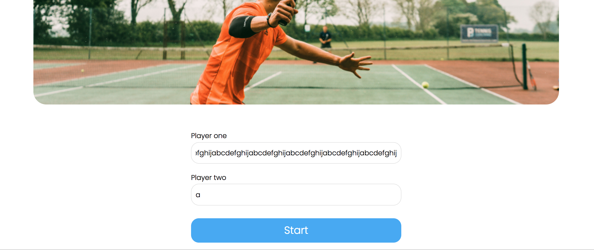
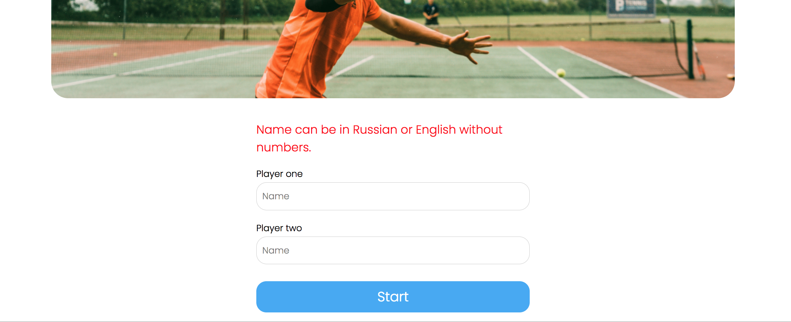
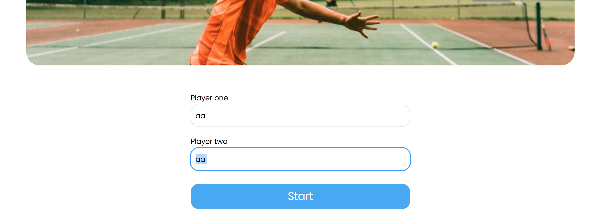
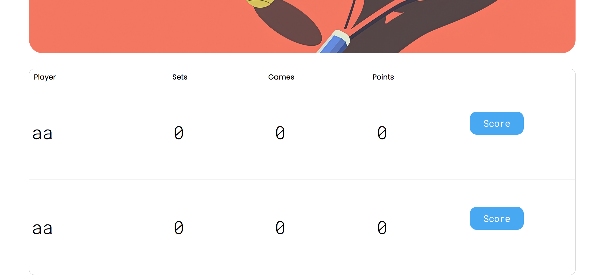
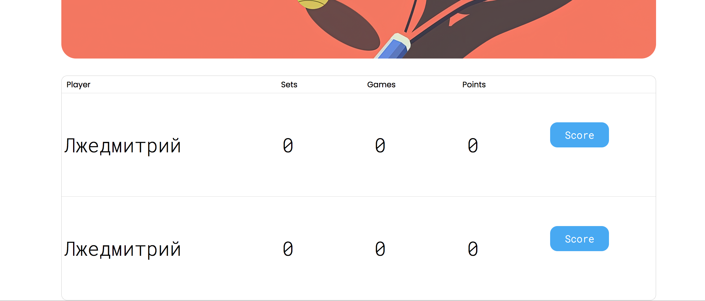
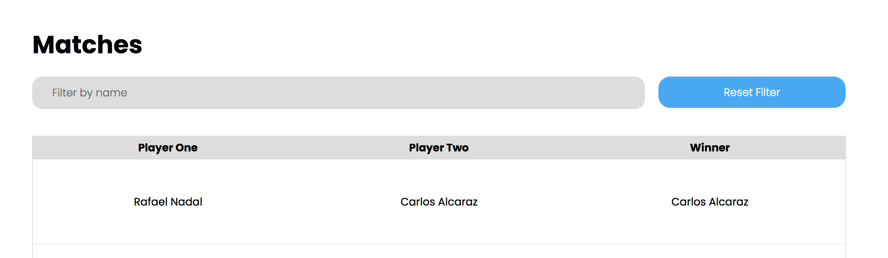
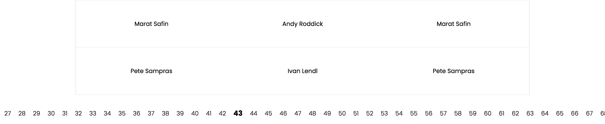

# Review на реализацию от [@qwerty0629](https://github.com/aneG200229/Tennis-Scoreboard) проекта [Табло теннисного матча](https://zhukovsd.github.io/java-backend-learning-course/projects/tennis-scoreboard/)

> [!NOTE]
> 1. Знаком ❗️ помечены критически важные замечания, а также места нарушения ТЗ. 
> 2. Если ❗️ стоит перед заголовком, значит он относится ко всем пунктам этого раздела.
> 3. Замечания, указанные в пункте с именем пакета, относятся ко всем классам этого пакета или ко всем классам этого слоя.
> 4. Знаком 💡 помечены блоки, в которых содержится подсказка по реализации какого-то приёма или части кода.
> Такие пункты всегда находятся в сворачиваемом блоке и разворачиваются по нажатию. 
   Перед их раскрытием стоит постараться придумать или поискать решение самостоятельно. 

## Функциональный обзор

- Сообщение об ошибке описывает только часть правил валидации



и в случае нарушения длины имени не сообщает, что именно сейчас не так



Лучше сообщать какое именно правило валидации сейчас нарушает имя.

- Можно добавить пробел в конец имени и создать игроков с визуально одинаковыми именами





Того же эффекта можно достичь, если заменить букву кириллицы латиницей



- На странице завершённых матчей нет кнопки для применения фильтра и есть кнопка сброса фильтра, даже когда он не применён и поле пустое.



Хотя фильтрация работает при нажатии на `Enter`, лучше явно добавить кнопку, применяющую фильтр.

> [!CAUTION]
> - ❗️В пагинации на странице завершённых матчей отображаются все страницы, что плохо выглядит при большом количестве страниц и делает недоступными страницы за пределами экрана.
> 
> 
> 
> Лучше сделать отображение текущей и +-2 страниц вокруг неё.

## entity

- Класс сущности для игрока назван `Player`, в то время как для матча — `MatchEntity`. Это нарушает единообразие кодовой базы. Когда нет чёткого соглашения, разработчики могут тратить время на размышления, как назвать новый класс, или на поиск существующих, так как их имена непредсказуемы.

Лучше выбрать один из подходов и придерживаться его во всём проекте. Например, либо все сущности получают суффикс `Entity` (`PlayerEntity`, `MatchEntity`), либо ни одна из них его не имеет (`Player`, `Match`).

### Player

<div align="right">

[Перейти к упоминанию в MatchEntity](#matchentity) </div>

> [!CAUTION]
> - ❗️`@EqualsAndHashCode` (которая входит в `@Data`) обычно не используют в JPA сущностях. Конкретно здесь проблем быть не должно, но использование этих аннотаций вместе с `@Entity` не является хорошей практикой.
> 
> [**Использование @Data (Lombok) и @Entity (JPA) в одном классе**](#data-entity) <a id="back-from-data-entity"></a>
> 
> Даже если сейчас для генерации `equals()` и `hashCode()` используются все поля, лучше их явно указать в аннотации. Так при добавлении в класс новых полей, они не будут автоматически участвовать в `equals()` и `hashCode()`.
> 
> Сейчас так:
> 
> ```java
> @Data
> public class Player {
>     private Long id;
>     private String name;
>     // ...
> }
> ```
> 
> Лучше так:
> 
> ```java
> @EqualsAndHashCode(of = {"id", "name"})
> public class Player {
>     private Long id;
>     private String name;
>     // ...
> }
> ```
> 
> Поскольку сравнение сущностей не является бизнес-требованием, самое безопасное — вообще не переопределять `equals` и `hashCode` (удалить `@Data`), оставив реализацию из класса `Object` (сравнение по ссылке).

> [!CAUTION]
> - ❗️Аннотация `@Setter` (которая входит в `@Data`) генерирует публичные сеттеры для всех полей класса:
> 
>   - Поле `id` является первичным ключом, генерируемым базой данных. Публичный сеттер для этого поля позволяет устанавливать и изменять ID на любом этапе жизненного цикла объекта. Предоставление такой возможности может привести к рассинхронизации объекта в приложении с его представлением в базе данных, а также к конфликтам при сохранении.
> 
>   - Публичный сеттер для поля `name` позволяет произвольно менять имя игрока, которое должно быть его уникальным и неизменяемым свойством в рамках бизнес-логики.
> 
> Как исправить: удалить аннотацию `@Data`. Инициализация полей должна происходить только один раз в момент создания объекта через конструктор.

> [!CAUTION]
> - ❗️Спецификация JPA требует наличия конструктора без аргументов для создания экземпляров сущностей, однако ему не обязательно быть `public`. Когда конструктор публичный, он становится частью общедоступного API класса. Это позволяет использовать его для создания "пустых", невалидных объектов (без установки обязательных полей) в любом месте приложения, хотя он предназначен исключительно для внутреннего использования фреймворком (JPA).
> 
> Хорошим подходом будет ограничить область видимости этого конструктора до `protected`. Это делает его недоступным для прямого вызова из других пакетов, но оставляет видимым для JPA и дочерних классов. В Lombok это можно сделать с помощью параметра `access`.
> 
> Сейчас так:
> 
> ```java
> @NoArgsConstructor
> @Entity
> public class Player {
>     // ...
> }
> ```
> 
> Лучше так:
> 
> ```java
> @NoArgsConstructor(access = AccessLevel.PROTECTED)
> @Entity
> public class Player {
>     // ...
> }
> ```

> [!CAUTION]
> - ❗️️Аннотация `@AllArgsConstructor` позволяет создать объект Player c установленным ID. Поле `id` является первичным ключом, генерируемым базой данных. Предоставление возможности устанавливать его напрямую в коде может привести к рассинхронизации объекта в приложении с его представлением в базе данных, а также к конфликтам при сохранении.
> 
> Стоит удалить аннотацию `@AllArgsConstructor`. Для создания новых, ещё не сохранённых в БД, игроков создать более безопасный и корректный конструктор вручную.
> 
> <details>
> 
> <summary><b>💡 Вот такой 💡</b></summary>
> 
> ---
> 
> ```java
> public Player(String name) {
>     this.name = name;
> }
> ```
> 
> ---
> 
> </details>
> 
> По этой же причине в классе не должно быть аннотации `@Builder`. 

> [!CAUTION]
> - ❗️Аннотация `@Builder` предоставляет гибкий, но неконтролируемый способ создания объектов. 
> 
> Как и `@AllArgsConstructor` или `@Setter`, стандартный `@Builder` позволяет установить любое поле, включая `id`. Он также позволяет создать объект, не установив обязательные поля (например, `name`), что приведёт к ошибке на этапе сохранения в базу данных. Для сущностей, где важно обеспечить валидное состояние при создании, `@Builder` часто бывает слишком "разрешающим".
> 
> Стоит удалить аннотацию `@Builder` и использовать для создания объектов определённый в предыдущем пункте публичный конструктор (со всеми полями, кроме ID).

- Уникальность поля `name` обеспечивается атрибутом `unique = true` в аннотации `@Column`. Хотя `unique = true` приводит к созданию уникального индекса, явное определение индекса через аннотацию `@Table` даёт больше контроля и улучшает читаемость кода. В `@Index` можно задать имя для индекса, что упрощает его администрирование в будущем, и сама аннотация явно декларирует намерение создать индекс для оптимизации поиска.

Можно добавить явное определение индекса на уровне класса.

> [!TIP]
> <details>
> 
> <summary><b>💡 Например, так 💡</b></summary>
> 
> ---
> 
> ```java
> @Entity
> @Table(name = "players", indexes = @Index(name = "idx_player_name", columnList = "name", unique = true))
> public class Player {
>     // ...
>     @Column(nullable = false, length = 100)
>     private String name;
> }
> ```
> 
> При таком подходе параметр `unique = true` из аннотации `@Column` можно удалить, так как уникальность теперь задана в `@Index`.
> 
> ---
> 
> </details>

- В классе есть аннотации, функционал которых не используется или не должен быть в проекте. Хорошим подходом будет оставить минимум необходимых аннотаций, достаточных для JPA Entity.

Сейчас так:

```java
@Data
@NoArgsConstructor
@AllArgsConstructor
@Builder
@Entity
@Table(name = "players")
public class Player {
    // ...
}
```

Лучше так:

```java
@Getter
@NoArgsConstructor(access = AccessLevel.PROTECTED)
@Entity
@Table(name = "players")
public class Player {
    // ...
}
```

> [!CAUTION]
> - ❗️Противоречивые ограничения на максимальную длину имени игрока (`name`) между двумя уровнями приложения:
> 
>   - Бизнес-валидация (в классе `Validator`): Максимальная длина 50 символов.
> 
>   ```java
>   public final class Validator {
>       private static final Pattern NAME_PATTERN = Pattern.compile("^[a-zA-Zа-яА-Я ]{2,50}$");
>       // ...
>   }
>   ```
> 
>   - JPA-Entity (в классе `Player`): В аннотации `@Column` указан параметр `length = 100`, что означает значение ограничение в 100 символов.
> 
>   ```java
>   public class Player {
>       // ...
>       @Column(unique = true, nullable = false, length = 100)
>       private String name;
>   }
>   ```
> 
> Такое несоответствие может вводить в заблуждение. Например, разработчик, смотрящий только на `Player`, будет думать, что лимит — 100 символов, что не соответствует бизнес-требованиям (в классе `Validator`).
> 
> Стоит привести оба уровня к единому, консистентному значению. Логичным выбором будет ограничение в 50 символов.

### MatchEntity

- Пункты про:

> [!CAUTION]
>   - ❗️Использование `@EqualsAndHashCode` (которая входит в `@Data`) вместе с `@Entity`


> [!CAUTION]
>   - ❗️Наличие сеттеров (которые генерирует `@Data`) для всех полей


> [!CAUTION]
>   - ❗️Наличие публичного конструктора без аргументов


> [!CAUTION]
>   - ❗️Использование `@AllArgsConstructor` в JPA Entity


> [!CAUTION]
>   - ❗️Использование `@Builder` в JPA Entity

  - Избавление от избыточных аннотаций

описанные в разделе [Player](#player), актуальны и для этого класса.

> [!CAUTION]
> - ❗️Слово `MATCHES` (а также `MATCH`) является зарезервированным ключевым словом в некоторых диалектах SQL (например, для оператора `MATCH ... AGAINST` в полнотекстовом поиске). Хотя в конкретно в этом проекте проблем с этим не возникнет, не стоит использовать зарезервированные слова в качестве имён таблиц. Это может приводить к необходимости экранировать имя таблицы в нативных SQL-запросах или к синтаксическим ошибкам в некоторых СУБД.
> 
> [**Использование зарезервированных слов в качестве названий в БД**](#sql-keywords) <a id="back-from-sql-keywords"></a>
> 
> Лучше выбирать имена, которые гарантированно не конфликтуют с зарезервированными словами. Учитывая, что в таблице хранятся только завершённые матчи, можно выбрать более описательное и безопасное имя `FINISHED_MATCHES` или более общее `TENNIS_MATCHES`.
> 
> Сейчас так:
> 
> ```java
> @Table(name = "matches")
> public class MatchEntity {
>     // ...
> }
> ```
> 
> Лучше так:
> 
> ```java
> @Table(name = "FINISHED_MATCHES")
> public class MatchEntity {
>     // ...
> }
> ```

- Риск нарушения целостности данных. Класс не имеет механизмов, которые бы гарантировали на уровне схемы базы данных выполнение ключевых бизнес-правил:

  - Игрок не может играть сам с собой (`player1` должен отличаться от `player2`).

  - Победителем (`winner`) должен быть один из участников матча (`player1` или `player2`).

Хотя логика в сервисном слое может предотвращать создание некорректных матчей, база данных этого не гарантирует. Прямой SQL-запрос или ошибка в другом модуле приложения могут привести к созданию невалидных данных (например, матч, где `player1_id = 5` и `player2_id = 5`).

Защита должна быть на всех уровнях, поэтому стоит добавить ограничения, проверяющие, что игроки разные и победителем является один из участников матча.

> [!TIP]
> <details>
> 
> <summary><b>💡 Например так 💡</b></summary>
> 
> ---
> 
> ```java
> @Entity
> @Table(name = "FINISHED_MATCHES", check = {
>         @CheckConstraint(name = "players_are_different_check", constraint = "player1 != player2"),
>         @CheckConstraint(name = "winner_is_participant_check", constraint = "winner = player1 OR winner = player2")
> })
> public class MatchEntity {
>     
> }
> ```
> 
> Что это даст:
> 
>   - Гарантирует целостность данных даже при прямом доступе к БД.
>   - Снижает риск появления невалидных данных из-за ошибок в коде или внешних вмешательств.
>   - Схема базы данных будет явно отражать бизнес-правила.
> 
> ---
> 
> </details>

- Поля игроков используют числительные в виде цифр (`player1`, `player2`), тогда как в другом месте приложения (в сервисе и сервлете) внутренние переменные, обозначающие тех же игроков, именуются словами (`playerOne`, `playerTwo`).

```java
@Entity
public class MatchEntity {
    // ...
    @JoinColumn(name = "player1_id", nullable = false)
    private Player player1;
    
    @JoinColumn(name = "player2_id", nullable = false)
    private Player player2;
    // ...
}

/**
 * В OngoingMatchesService
 */
public UUID createMatch(Player playerOne, Player playerTwo) {
    // ...
  
    Match match = new Match(playerOne, playerTwo);
  
    // ...
}

/**
 * В NewMatchServlet
 */
@Override
protected void doPost(HttpServletRequest req, HttpServletResponse resp) throws ServletException, IOException {
    // ...
    Player playerOne = PlayerRepository.getInstance().findOrCreate(playerOneName);
    Player playerTwo = PlayerRepository.getInstance().findOrCreate(playerTwoName);    
    // ...
}
```

Отсутствие единого, последовательного стиля именования может затруднять чтение кода. В некоторых случаях разработчику придётся потратить дополнительное время и умственные усилия, чтобы убедиться, что `player1` и `playerOne` являются обозначениями одной и той же сущности. Это создаёт ненужную когнитивную нагрузку.

Также непоследовательное именование повышает риск случайных ошибок, особенно при копировании/вставке кода или при работе с большим количеством схожих переменных, когда легко перепутать один стиль с другим.

Стоит привести именование к единому стилю, используя либо только цифры, либо только слова.

Например, так:

```java
@Entity
public class MatchEntity {
    // ...
  
    @JoinColumn(name = "first_player_id", nullable = false)
    private Player firstPlayer;
  
    @JoinColumn(name = "second_player_id", nullable = false)
    private Player secondPlayer;
  
    // ...
}

/**
 * В OngoingMatchesService
 */
public UUID createMatch(Player firstPlayer, Player secondPlayer) {
    // ...
  
    Match match = new Match(firstPlayer, secondPlayer);
  
    // ...
}

/**
 * В NewMatchServlet
 */
@Override
protected void doPost(HttpServletRequest req, HttpServletResponse resp) throws ServletException, IOException {
    // ...
    Player firstPlayer = PlayerRepository.getInstance().findOrCreate(firstPlayerName);
    Player secondPlayer = PlayerRepository.getInstance().findOrCreate(secondPlayerName);    
    // ...
}
```

Использование слов (например, `firstPlayer` и `secondPlayer`) даёт несколько преимуществ перед использованием цифр:

  - Визуальное различие и читаемость: Имена `firstPlayer` и `secondPlayer` визуально отличаются друг от друга сильнее, чем `player1` и `player2`. Это снижает вероятность их перепутать при быстром просмотре кода. Кроме того, такие имена читаются более естественно, как обычный текст.

  - Эффективность работы в IDE: При вводе `first...`, IntelliJ IDEA однозначно предложит подсказку `firstPlayer`. При вводе `player...` IDE предложит оба варианта (`player1`, `player2`), что требует дополнительного действия для выбора нужного.

  - Удобство поиска: Искать по кодовой базе переменную тоже `firstPlayer` может быть проще, чем `player1` (по причине, из предыдущего пункта).

- Для поля `winner` не указано имя колонки в `@JoinColumn`.

Сейчас так:

```java
public class MatchEntity {
    // ...
    @JoinColumn(name = "player1_id", nullable = false)
    private Player player1;
    
    @JoinColumn(name = "player2_id", nullable = false)
    private Player player2;
    
    @JoinColumn(nullable = false)
    private Player winner;
}
```

Hibernate сгенерирует имя автоматически (`winner_id`), но явное указание имени делает маппинг более предсказуемым, читаемым и не зависящим от стратегии именования JPA-провайдера.

Лучше так:

```java
public class MatchEntity {
    // ...
    @JoinColumn(name = "player1_id", nullable = false)
    private Player player1;
    
    @JoinColumn(name = "player2_id", nullable = false)
    private Player player2;
    
    @JoinColumn(name = "winner_id", nullable = false)
    private Player winner;
}
```

- Связи `@ManyToOne` не имеют явного указания о стратегии загрузки. По умолчанию для `@ManyToOne` используется `FetchType.EAGER`, что приводит к немедленной загрузке связанных сущностей при загрузке `MatchEntity`. Это может вызывать проблемы производительности (N+1 запросов) и излишнюю загрузку данных, особенно если связанные объекты не всегда нужны.

Как исправить: добавить `fetch = FetchType.LAZY` для каждого `@ManyToOne` поля.

Сейчас так:

```java
public class MatchEntity {
    // ...
    @ManyToOne
    private Player player1;
    
    @ManyToOne
    private Player player2;
    
    @ManyToOne
    private Player winner;
}
```

Лучше так:

```java
public class MatchEntity {
    // ...
    @ManyToOne(fetch = FetchType.LAZY)
    private Player player1;
    
    @ManyToOne(fetch = FetchType.LAZY)
    private Player player2;
    
    @ManyToOne(fetch = FetchType.LAZY)
    private Player winner;
}
```

Это даст более тонкий контроль над тем, какие данные загружаются и в некоторых ситуациях оптимизирует загрузку и предотвратит проблемы с производительностью.

## model

### Match

<div align="right">

[Перейти к упоминанию в SetScore](#setscore) </div>

> [!CAUTION]
> - ❗️Класс хранит ссылки на JPA-сущности (`Player`). Использование объектов JPA Entity в доменной логике создаёт прямую зависимость доменного слоя от слоя персистентности (долговременного хранения данных) и смешивает слои приложения, что нарушает чистоту архитектуры. Это может привести к проблемам с ленивой загрузкой (`LazyInitializationException`) или к неожиданным изменениям в базе данных, если состояние `Player` будет изменено в ходе бизнес-логики. Доменные модели должны оперировать "чистыми" объектами (POJO) или объектами-значениями (`Value Object`), а не сущностями, привязанными к базе данных.
> 
> Вместо `Player` (JPA Entity) в доменной модели `Match` следует использовать специальный `Value Object`, например:
> 
> ```java
> public record TennisPlayer(
>         String name
> ) {
> }
> ```
> 
> который будет содержать только необходимые данные и не будет привязан к Hibernate. Преобразование из `Player` в `TennisPlayer` должно происходить на границе сервисного слоя.

- В методе `pointWonBy` используется ключевое слово `this` для обращения к полям экземпляра, хотя конфликта имён с параметрами конструктора нет.

Сейчас так:

```java
public void pointWonBy(PlayerNumber scoringPlayer) {
    // ...
    this.winner = playerOne;
    this.finished = true;
    // ...
    this.winner = playerTwo;
    this.finished = true;
    // ...
}
```

Хотя использование `this` не является ошибкой, его отсутствие в данном контексте делает код чище и лаконичнее, не теряя при этом в читаемости.

Можно убрать ключевое слово `this` там, где оно не является необходимым для разрешения неоднозначности.

Можно так:

```java
public void pointWonBy(PlayerNumber scoringPlayer) {
    // ...
    winner = playerOne;
    finished = true;
    // ...
    winner = playerTwo;
    finished = true;
    // ...
}
```

- Константа `SETS_TO_WIN` объявлена после полей экземпляра.

Сейчас так:

```java
public class Match {
    private int playerOneSets;
    private int playerTwoSets;
    private final Player playerOne;
    private final Player playerTwo;
    // ...
    private static final int SETS_TO_WIN = 2;
```

Это нарушает общепринятые конвенции стиля кода в Java, согласно которым статические поля (включая константы) должны объявляться в самом начале класса, перед полями экземпляра и конструкторами.

Должно быть так:

```java
public class Match {
    private static final int SETS_TO_WIN = 2;
    private final Player playerOne;
    private final Player playerTwo;
    private int playerOneSets;
    private int playerTwoSets;
    // ...
```

Это улучшает читаемость и помогает быстрее находить основные "настройки" класса.

- Некоторым переменным можно подобрать более понятные имена.

Сейчас так:

```java
public class Match {
    private int playerOneSets;
    private int playerTwoSets;
    // ...
    private static final int SETS_TO_WIN = 2;
```

Можно так:

```java
public class Match {
    private int firstPlayerScore;
    private int secondPlayerScore;
    // ...
    private static final int SCORES_TO_WIN = 2;
```

Тогда условия в боках `if-else` станут ещё более понятными:

Сейчас так:

```java
public void pointWonBy(PlayerNumber scoringPlayer) {
    // ...
    if (playerOneSets == SETS_TO_WIN) {
        // ...
    } else if (playerTwoSets == SETS_TO_WIN) {
        // ...
    }
    // ...
}
```

Будет так:

```java
public void pointWonBy(PlayerNumber scoringPlayer) {
    // ...
    if (firstPlayerScore == SCORES_TO_WIN) {
        // ...
    } else if (secondPlayerScore == SCORES_TO_WIN) {
        // ...
    }
    // ...
}
```

- Победитель матча и флаг завершения матча (`winner`, `finished`) хранятся как поля класса `Match`, которые устанавливаются в момент завершения игры. 

Это создаёт дублирование информации: Информация о том, кто победил и завершён ли матч, уже содержится в объекте. Поля `winner` и `finished` лишь дублируют эти данные.

Приходится дополнительно следить, чтобы при завершении матча устанавливались значения в эти поля:

```java
public void pointWonBy(PlayerNumber scoringPlayer) {
    // ...
    if (currentSet.isFinished()) {
        // ...
        if (playerOneSets == SETS_TO_WIN) {
            this.winner = playerOne;
            this.finished = true;
        } else if (playerTwoSets == SETS_TO_WIN) {
            this.winner = playerTwo;
            this.finished = true;
        }
        // ...
    }
}
```

А также хранение вычисляемого состояния создаёт риск рассинхронизации. Нужно постоянно следить за тем, чтобы оба поля обновлялись синхронно. Существует (хоть и малая) вероятность, что возникнет состояние, когда матч по счёту завершён, а поле `winner` осталось `null`, или наоборот, что приведёт к ошибкам в логике.

Вместо хранения этих полей лучше реализовать методы, которые будут вычислять их значения "на лету" — по счёту в момент запроса.

> [!TIP]
> <details>
> 
> <summary><b>💡 В таком духе 💡</b></summary>
> 
> ---
> 
> ```java
> public boolean isFinished() {
>     return playerOneSets == SETS_TO_WIN || playerTwoSets == SETS_TO_WIN;
> }
> 
> public Optional<Player> getWinner() {
>     if (!isFinished()) {
>         return Optional.empty();
>     }
>     
>     if (playerOneSets == SETS_TO_WIN) {
>         return Optional.of(playerOne);
>     }
>     
>     return Optional.of(playerTwo);
> }
> ```
> 
> ---
> 
> </details>

Так логика станет более надёжной и предсказуемой. Класс `Match` станет проще, так как в нём будет меньше полей, состояние которых нужно отслеживать.

Победитель и состояние всегда будут вычисляться напрямую из счёта, что устраняет саму возможность рассинхронизации.

- В конструкторе для инициализации счёта `playerOneSets` и `playerTwoSets` используется числовой литерал `0`.

```java
public class Match {
    // ...
    public Match(Player playerOne, Player playerTwo) {
        this.playerOneSets = 0;
        this.playerTwoSets = 0;
        // ...
    }
    // ...
}
```

Хотя `0` для начального счёта является интуитивно понятным значением, явное использование литералов ("магических чисел") в коде не считается хорошей практикой. Если это значение потребуется изменить, придётся искать все его вхождения. Вынесение в именованную константу улучшает читаемость и упрощает поддержку.

Можно создать константу с понятным именем, например `INITIAL_SCORE`.

```java
public class Match {
    private static final int INITIAL_SCORE = 0;
    // ...
    public Match(Player playerOne, Player playerTwo) {
        this.playerOneSets = INITIAL_SCORE;
        this.playerTwoSets = INITIAL_SCORE;
        // ...
    }
    // ...
}
```

- Метод `pointWonBy` не проверяет, был ли матч уже завершён. Если его вызвать после определения победителя, он продолжит обрабатывать очки, создавая новые сеты.

```java
public void pointWonBy(PlayerNumber scoringPlayer) {
    currentSet.pointWonBy(scoringPlayer); // сразу идёт обработка очка
    // ...
}
```

Завершённый матч не должен изменять свой счёт. Это может привести к некорректным результатам (например, счёт 3:0 при игре до двух побед) и сложным в отладке ошибкам.

Стоит добавить в начало метода `pointWonBy` проверку и прекращать выполнение, если матч окончен.

> [!TIP]
> <details>
> 
> <summary><b>💡 Например, так 💡</b></summary>
> 
> ---
> 
> ```java
> public void pointWonBy(PlayerNumber scoringPlayer) {
>     if (isFinished()) {
>         throw new IllegalStateException("Match is already finished. Cannot award more points.");
>     }
>     // остальная логика метода
> }
> ```
> 
> Так класс будет сам гарантировать корректность своего состояния, защищая систему от невалидных действий.
> 
> ---
> 
> </details>

- Метод `pointWonBy` принимает в качестве параметра `PlayerNumber` (enum), который является внутренней абстракцией модели, а не доменной моделью игрока.

```java
public class Match {
    // ...
    public void pointWonBy(PlayerNumber scoringPlayer) {
        currentSet.pointWonBy(scoringPlayer);
        if (currentSet.isFinished()) {
            PlayerNumber setWinner = currentSet.getWinner();
            completedSets.add(currentSet);
            if (setWinner == PlayerNumber.PLAYER_ONE) {
                playerOneSets++;
            } else {
                playerTwoSets++;
            }

            if (playerOneSets == SETS_TO_WIN) {
                this.winner = playerOne;
                this.finished = true;
            } else if (playerTwoSets == SETS_TO_WIN) {
                this.winner = playerTwo;
                this.finished = true;
            } else {
                currentSet = new SetScore();
            }
        }
    }
    // ...
}
```

Внешний код должен преобразовывать более осмысленную сущность (DTO игрока или его имя) в этот `enum`, что создаёт дополнительную точку сопряжения и усложняет использование модели. Модель должна оперировать своими основными понятиями, одним из которых является игрок.

Метод должен принимать более естественную для доменной модели сущность — саму модель игрока (`TennisPlayer`).

> [!TIP]
> <details>
> 
> <summary><b>💡 Например, так 💡</b></summary>
> 
> ---
> 
> ```java
> public record TennisPlayer(
>         String name
> ) {
> }
> 
> public class Match {
>     // ...
>     
>     private List<SetScore> sets;
>     
>     // ...
> 
>     public void pointWonBy(TennisPlayer winner) {
>         if (isFinished()) {
>             throw new IllegalStateException("Match is already finished. Cannot award more points.");
>         }
>         
>         SetScore currentSet = getLastSet();
>         if (currentSet.isFinished()) {
>             addNewSet();
>             currentSet = getLastSet();
>         }
> 
>         currentSet.pointWonBy(winner);
> 
>         if (currentSet.isFinished()) {
>             incrementScoreFor(winner);
>         }
>     }
> 
>     private SetScore getLastSet() {
>         if (sets.isEmpty()) {
>             throw new IllegalStateException("Sets is empty.");
>         }
>         return sets.getLast();
>     }
> 
>     private void addNewSet() {
>         SetScore newSet = new SetScore();
>         sets.add(newSet);
>     }
>     // ...
> }
> ```
> 
> ---
> 
> </details>

- В методе `pointWonBy` большая часть логики выполняется в блоке `if`, после которого нет другого кода.

Сейчас так:

```java
public void pointWonBy(PlayerNumber scoringPlayer) {
    currentSet.pointWonBy(scoringPlayer);
    
    if (currentSet.isFinished()) {
        // логика метода
    }
}
```

Можно инвертировать условие и использовать ранний выход из метода, чтобы уменьшить вложенность.

Лучше так:

```java
public void pointWonBy(PlayerNumber scoringPlayer) {
    currentSet.pointWonBy(scoringPlayer);
    
    if (!currentSet.isFinished()) {
        return;
    }    
        
    // логика метода
}
```

Это улучшит читаемость кода.

- Для отслеживания текущего сета используется отдельное поле `currentSet`, а для завершённых — список `completedSets`.

Сейчас так:

```java
public class Match {
    // ...
    private SetScore currentSet;
    private final List<SetScore> completedSets;

    // ...
    public Match(Player playerOne, Player playerTwo) {
        // ...
        this.currentSet = new SetScore();
        // ...
        this.completedSets = new ArrayList<>();
    }
    // ...
}
```

Это создаёт необязательную дополнительную переменную и усложняет логику. При завершении сета его нужно не забыть поместить в `completedSets` и создать новый `currentSet`. Проще всегда считать текущим сетом последний элемент в общем списке сетов.

> [!TIP]
> <details>
> 
> <summary><b>💡 Вот так 💡</b></summary>
> 
> ---
> 
> ```java
> public class Match {
>     // ...
>     private final List<SetScore> sets;
> 
>     // ...
>     public Match(Player playerOne, Player playerTwo) {
>         // ...
>         this.sets = new ArrayList<>();
>         this.sets.add(new SetScore()); // Добавляем первый сет
>     }
>     
>     // ...
>     private SetScore getLastSet() {
>         if (sets.isEmpty()) {
>             throw new IllegalStateException("Sets is empty.");
>         }
>         return sets.getLast();
>     }
>     
>     // ...
> }
> ```
> 
> ---
> 
> </details>

> [!CAUTION]
> - ❗️Класс помечен аннотацией `@Getter`, которая генерирует публичный метод `getCompletedSets()`. Этот метод возвращает прямую ссылку на внутренний, изменяемый список `completedSets`.
> 
> ```java
> @Getter
> public class Match {
>     // ...
>     private final List<SetScore> completedSets;
>     // ...
> }
> ```
> 
> Это нарушает инкапсуляцию. Любой внешний код может получить эту ссылку и напрямую манипулировать списком: добавлять, удалять или изменять его элементы в обход всей логики класса `Match`. Например, `match.getCompletedSets().clear()` уничтожит всю историю сетов.
> 
> Лучше никогда не возвращать прямые ссылки на изменяемые внутренние коллекции. Вместо этого, при необходимости, следует возвращать их неизменяемую копию или обёртку.
> 
> <details>
> 
> <summary><b>💡 Вот так 💡</b></summary>
> 
> ---
> 
> ```java
> public class Match {
>     // ...
>     private final List<SetScore> completedSets;
>     // ...
>     
>     // Вариант 1: Неизменяемая обёртка
>     public List<SetScore> getCompletedSets() {
>         return Collections.unmodifiableList(completedSets);
>     }
>     
>     // Вариант 2: Копия списка
>     public List<SetScore> getCompletedSets() {
>          return new ArrayList<>(completedSets);
>     }
> }
> ```
> 
> Так класс `Match` сохранит полный контроль над своим внутренним состоянием. Это сделает его надёжным и предсказуемым, устранив целый набор потенциальных багов.
> 
> ---
> 
> </details>

### PlayerNumber

- Для идентификации игроков в доменной логике используется перечисление `PlayerNumber` со значениями `PLAYER_ONE` и `PLAYER_TWO`, вместо того чтобы использовать полноценный класс, представляющий игрока.

```java
public enum PlayerNumber {
    PLAYER_ONE,
    PLAYER_TWO
}
```

Почему это проблема:

  - Избыточные и хрупкие преобразования: Это вынуждает другие слои приложения постоянно выполнять преобразования между реальными данными (имя игрока или DTO) и этим `enum`. Такие преобразования усложняют код, делают его менее читаемым и являются потенциальным источником ошибок.

  Например, в сервлетах (`MatchScoreServlet`) значение из HTTP-запроса преобразуется в `PlayerNumber` с помощью `PlayerNumber.valueOf(req.getParameter("player"))`. Это означает, что в HTML-форме значение кнопки или скрытого поля должно в точности соответствовать имени константы (`"PLAYER_ONE"`).

  Это создаёт хрупкую связь между кодом домена и представлением (view). Если в будущем разработчик решит переименовать константу `PLAYER_ONE` в `FIRST_PLAYER` для большей ясности, он сломает работу веб-интерфейса, так как `PlayerNumber.valueOf("PLAYER_ONE")` перестанет работать.

  - Обеднение доменной модели: Ключевые концепции должны быть смоделированы явно. "Игрок" — это фундаментальная сущность в домене тенниса. Сведение её к простому перечислению обедняет доменную модель и снижает её выразительность.

Стоит заменить `enum PlayerNumber` на полноценный класс доменной модели. Этот класс будет нести в себе все необходимые для бизнес-логики атрибуты игрока, в первую очередь — имя.

> [!TIP]
> <details>
> 
> <summary><b>💡 Например, такой 💡</b></summary>
> 
> ---
> 
> ```java
> public record TennisPlayer(
>         String name
> ) {
> }
> ```
> 
> Что это даст:
> 
>   - Доменная модель станет богаче и выразительнее, так как будет оперировать ключевой сущностью — игроком (`TennisPlayer`), а не абстрактными номерами. 
>   - Исчезнет необходимость в слое преобразования "имя → номер" и "номер → имя", что сделает код проще и чище. 
>   - Передача в методы конкретного объекта `TennisPlayer` вместо `enum` устраняет целый набор потенциальных ошибок, связанных с неверной конвертацией или перепутанными номерами игроков.
> 
> ---
> 
> </details>

- Имя `PlayerNumber` (Номер Игрока) не совсем точно отражает суть. Этот `enum` не представляет реальный номер игрока (например, его ID), а скорее его позицию или сторону в рамках одного конкретного матча: первый или второй. Это может привести к недопониманию. Например, новый разработчик может спутать это с `playerId`. Чистый код требует, чтобы имена были максимально точными и отражали концепцию, которую они представляют. Поэтому классу больше подошло бы имя, точнее отражающее роль. Например, `PlayerSide` (Сторона Игрока).

Также можно упростить имена констант.

Сейчас так:

```java
PlayerNumber.PLAYER_ONE // "Номер игрока — игрок первый"
```

Можно так:

```java
public enum PlayerSide {
    ONE,
    TWO
}
```

Будет читаться так:

```java
PlayerSide.ONE // "Сторона игрока — первая"
```

### SetScore

- Пункты про:
  - Переименование полей для счёта
  - Вычисление победителя и статуса сета "на лету"
  - Использование "магических чисел" при инициализации счёта
  - Тип параметра в методе `pointWonBy`
  - Добавление проверки, завершён ли сет, в методе `pointWonBy`, перед обработкой очка
  - Использование раннего выхода для уменьшения вложенности

описанные в разделе [Match](#match), актуальны и для этого класса.

- Класс `SetScore` для важных операций своей бизнес-логики (проверка завершения сета, определение победителя, выбор типа следующего гейма) обращается к статическим методам внешнего утилитного класса `SetRules`.

```java
public class SetScore {
    public void pointWonBy(PlayerNumber scoringPlayer) {
        currentGame.pointWonBy(scoringPlayer);
        if (currentGame.isFinished()) {
            // ...

            if (SetRules.isSetFinished(playerOneGames, playerTwoGames)) {
                finished = true;
                winner = SetRules.getSetWinner(playerOneGames, playerTwoGames);
            } else {
                currentGame = SetRules.nextGameRule(playerOneGames, playerTwoGames);
            }
        }
    }
}
```

Почему это проблема:

  - Это нарушает Принцип единственной ответственности (SRP), так как ответственность за правила сета фактически делегируется другому классу. Класс `SetScore` становится не самодостаточным — его логика размазана по двум классам.
  - Нарушение инкапсуляции: Принцип объединения данных и методов, которые с ними работают, нарушен. Данные (`playerOneGames`, `playerTwoGames`) находятся в `SetScore`, а логика (`isSetFinished`, `getSetWinner`) — в `SetRules`. 
  - Сам `SetScore` становится похожим на простой контейнер для данных (счёт по геймам), а не полноценный объект домена. Это является признаком антипаттерна "Анемичная доменная модель" (Anemic Domain Model).

  [**Анемичная vs Богатая модель предметной области**](#reach-anemic-model) <a id="back-from-reach-anemic-model"></a>

  - Низкая связанность (Low Cohesion): Логика, которая по смыслу должна быть едина (правила и состояние сета), искусственно разделена на два класса. Это делает код менее понятным, так как для анализа логики сета нужно изучать два файла.
  - Ухудшение тестируемости: Тестировать логику правил сета в отрыве от объекта, который хранит состояние, сложнее и менее наглядно.

Как исправить: "Обогатить" модель `SetScore`, переместив в неё всю соответствующую бизнес-логику из `SetRules`. Класс `SetRules` после этого стоит полностью удалить.

> [!TIP]
> <details>
> 
> <summary><b>💡 В таком духе 💡</b></summary>
> 
> ---
> 
> ```java
> public class SetScore {
>     private static final int GAMES_FOR_TIEBREAK = 6;
>     // ...
>     private int playerOneGames;
>     private int playerTwoGames;
>     private AbstractGameScore currentGame;
>     // Поля winner и finished удаляются в пользу методов isFinished() и getWinner()
> 
>     // ...
> 
>     public void pointWonBy(PlayerNumber scoringPlayer) {
>         currentGame.pointWonBy(scoringPlayer);
> 
>         if (!currentGame.isFinished()) {
>             return;
>         }
>         
>         // Логика обновления счёта геймов
> 
>         // Вместо вызова SetRules.isSetFinished() вызывает собственный метод
>         if (isFinished()) {
>             // Логика завершения сета
>         } else {
>             // Вместо вызова SetRules.nextGameRule() вызывает собственный метод
>             currentGame = createNextGame();
>         }
>     }
> 
>     // Логика из SetRules переносится сюда:
>     public boolean isFinished() {
>         // ...
>     }
> 
>     public PlayerNumber getWinner() {
>         if (!isFinished()) {
>             throw new IllegalStateException("Сет не завершён");
>         }
>         // ...
>     }
> 
>     private AbstractGameScore createNextGame() {
>         if (playerOneGames == GAMES_FOR_TIEBREAK && playerTwoGames == GAMES_FOR_TIEBREAK) {
>             return new Tiebreak();
>         }
>         return new GameScore();
>     }
> }
> ```
> 
> Так класс станет полностью самодостаточным и будет инкапсулировать всю логику, относящуюся к сету. И будет иметь одну, чётко определённую ответственность — управление счётом и правилами теннисного сета.
> 
> ---
> 
> </details>

### SetRules

> [!CAUTION]
> - ❗️Класс `SetRules` содержит логику, которая определяет правила игры в сете. Он знает о других классах модели, таких как `PlayerNumber`, `AbstractGameScore`, `Tiebreak` и `GameScore`, и предоставляет статические методы для использования этой логики.
> 
> ```java
> public class SetRules {
>     // ...
>     static boolean isSetFinished(int p1, int p2) {
>         // ...
>     }
> 
>     static PlayerNumber getSetWinner(int p1, int p2) {
>         // ...
>     }
> 
>     static AbstractGameScore nextGameRule(int p1, int p2) {
>         if (...) {
>             return new Tiebreak();
>         } else {
>             return new GameScore();
>         }
>     }
> }
> ```
> 
> Это пример низкой связанности (low cohesion) и нарушения Принципа единственной ответственности (SRP). Логика, тесно связанная с состоянием сета (которое находится в классе `SetScore`), вынесена во внешний утилитный класс. Это делает класс `SetScore` не самодостаточным, а `SetRules` — процедурным набором функций. Такой дизайн затрудняет понимание, тестирование и поддержку кода, так как для анализа логики сета нужно изучать два класса вместо одного.
> 
> Стоит полностью устранить класс `SetRules`, переместив всю его логику внутрь класса `SetScore`, который и должен быть ответственным за свои собственные правила и изменение состояния.

- Все методы в классе (`isSetFinished`, `getSetWinner`, `nextGameRule`) объявлены без явного модификатора доступа, что делает их доступными в пределах пакета (`package-private`).

> Явное лучше неявного.

Отсутствие явного модификатора может быть непреднамеренным и вводить в заблуждение. Если методы должны быть доступны отовсюду (что, является распространённым для статических методов), у них должен быть модификатор `public`. Если они предназначены только для внутреннего использования и не нужны наследникам, то лучше явно указать модификатор `protected` и запретить наследование класса, объявив его как `final`.

- Класс `SetRules` содержит только статические методы и константы, что делает его по факту утилитным классом. Однако он не оформлен как такой класс: у него нет `final` модификатора и есть публичный конструктор по умолчанию.

Сейчас так:

```java
public class SetRules {
    // ...
}
```

Это позволяет создавать экземпляры этого класса (`new SetRules()`), что не имеет никакого смысла, так как у него нет состояния. Это может ввести в заблуждение и привести к неправильному использованию класса.

Лучше так:

```java
public final class SetRules {
    private SetRules() {
    }
    // ...
}
```

Это сделает дизайн класса более строгим и явно покажет его предназначение — быть исключительно контейнером для статических методов.

- Во всех методах класса (`isSetFinished`, `getSetWinner`, `nextGameRule`) используются сокращённые неинформативные имена параметров: `p1` и `p2`.

```java
public class SetRules {
    // ...
    static boolean isSetFinished(int p1, int p2) {
        // ...
    }

    static PlayerNumber getSetWinner(int p1, int p2) {
        // ...
    }

    static AbstractGameScore nextGameRule(int p1, int p2) {
        // ...
    }
}
```

Такие имена заставляют разработчика, читающего код, догадываться, что они означают. Это снижает читаемость и повышает риск допустить ошибку, например, перепутав параметры местами при вызове метода.

Лучше использовать полные, осмысленные имена, отражающие суть параметра.

> [!TIP]
> <details>
> 
> <summary><b>💡 Например, так 💡</b></summary>
> 
> ---
> 
> ```java
> public class SetRules {
>     // ...
>     static boolean isSetFinished(int firstPlayerGames, int secondPlayerGames) {
>         // ...
>     }
> 
>     static PlayerNumber getSetWinner(int firstPlayerGames, int secondPlayerGames) {
>         // ...
>     }
> 
>     static AbstractGameScore nextGameRule(int firstPlayerGames, int secondPlayerGames) {
>         // ...
>     }
> }
> ```
> 
> ---
> 
> </details>

- Константам `GAMES_TO_WIN`, `DIFFERENCE_GAMES_TO_WIN` и др. можно дать более понятные имена:

`GAMES_TO_WIN` —> `MIN_SCORE_TO_WIN`

`DIFFERENCE_GAMES_TO_WIN` —> `MIN_SCORE_DIFFERENCE`

`GAMES_FOR_TIEBREAK` —> `SCORE_TO_START_TIEBREAK`

`TIEBREAK_WINNER_GAMES` —> `TIEBREAK_WINNER_SCORE`

`TIEBREAK_LOSER_GAMES` —> `TIEBREAK_LOSER_SCORE`

- В коде есть сложные, многосоставные условия в блоках `if`.

```java
if ((p1 >= GAMES_TO_WIN || p2 >= GAMES_TO_WIN)
                && (p1 - p2 >= DIFFERENCE_GAMES_TO_WIN || p2 - p1 >= DIFFERENCE_GAMES_TO_WIN))
// ...
if ((p1 == TIEBREAK_WINNER_GAMES && p2 == TIEBREAK_LOSER_GAMES)
                || (p2 == TIEBREAK_WINNER_GAMES && p1 == TIEBREAK_LOSER_GAMES))
```

Длинные логические выражения трудно читать и понимать. Они скрывают бизнес-правило, которое за ними стоит.

Лучше выносить такие условия в отдельные `private` методы или переменные с "говорящими" именами.

> [!TIP]
> <details>
> 
> <summary><b>💡 В таком духе 💡</b></summary>
> 
> ---
> 
> ```java
> static boolean isSetFinished(int firstPlayerGames, int secondPlayerGames) {
>     boolean standardWin = isStandardWin(firstPlayerGames, secondPlayerGames);
>     boolean tiebreakWin = isTiebreakWin(firstPlayerGames, secondPlayerGames);
>     return standardWin || tiebreakWin;
> }
> 
> private static boolean isStandardWin(int firstPlayerGames, int secondPlayerGames) {
>     boolean isMinimumGamesReached = firstPlayerGames >= GAMES_TO_WIN || secondPlayerGames >= GAMES_TO_WIN;
>     boolean hasRequiredDifference = Math.abs(firstPlayerGames - secondPlayerGames) >= DIFFERENCE_GAMES_TO_WIN;
>     return isMinimumGamesReached && hasRequiredDifference;
> }
> ```
> 
> Это сделает код более декларативным и читаемым, а также даст возможность переиспользовать повторяющиеся условия.
> 
> ---
> 
> </details>

- Для проверки разницы в счёте используется громоздкая конструкция `p1 - p2 >= DIFFERENCE_GAMES_TO_WIN || p2 - p1 >= DIFFERENCE_GAMES_TO_WIN`.

Есть стандартный подход для таких задач: Использовать метод `Math.abs()` для получения абсолютной разницы.

Сейчас так:

```java
(p1 - p2 >= DIFFERENCE_GAMES_TO_WIN || p2 - p1 >= DIFFERENCE_GAMES_TO_WIN)
```

Лучше так:

```java
Math.abs(p1 - p2) >= DIFFERENCE_GAMES_TO_WIN
```

- Метод `getSetWinner` просто проверяет, у кого больше очков, и объявляет его победителем. Он не учитывает, завершён ли сет на самом деле. Например, при счёте 2-3 или 6-6 он всё равно вернёт "победителя".

```java
static PlayerNumber getSetWinner(int p1, int p2) {
    if (p1 > p2) {
        return PlayerNumber.PLAYER_ONE;
    }
    return PlayerNumber.PLAYER_TWO;

}
```

Метод возвращает некорректные данные в большинстве случаев, кроме тех, когда сет действительно завершён. Использование такого метода может привести к неверному поведению всей системы.

Прежде чем определять победителя, метод должен убедиться, что сет завершён, вызвав, например, `isSetFinished`.

> [!TIP]
> <details>
> 
> <summary><b>💡 Вот так 💡</b></summary>
> 
> ---
> 
> ```java
> public PlayerNumber getWinner() {
>     if (!isFinished()) {
>         throw new IllegalStateException("Нельзя определить победителя, так как сет не завершён.");
>     }
>     return firstPlayerGames > secondPlayerGames ? PlayerNumber.PLAYER_ONE : PlayerNumber.PLAYER_TWO;
> }
> ```
> 
> ---
> 
> </details>

- Метод `nextGameRule` имеет неочевидное имя. Непонятно, что значит "правило следующей игры".

Неточные имена затрудняют понимание кода. 

Методу больше подошло бы имя, отражающее его суть, например, `createNextGame` или `determineNextGameType`.

- Когда в блоке `if` происходит выход из метода (`return`, `throw`), то остальной код можно писать без блока `else`.

Сейчас так:

```java
static AbstractGameScore nextGameRule(int p1, int p2) {
    if (p1 == GAMES_FOR_TIEBREAK && p2 == GAMES_FOR_TIEBREAK) {
        return new Tiebreak();
    } else {
        return new GameScore();
    }
}
```

Если условие `if` истинно, выполнение метода прерывается. Следовательно, код после `if` будет выполнен только в том случае, если условие ложно — дополнительный `else` для этого не нужен.

Лучше так:

```java
static AbstractGameScore nextGameRule(int p1, int p2) {
    if (p1 == GAMES_FOR_TIEBREAK && p2 == GAMES_FOR_TIEBREAK) {
        return new Tiebreak();
    }
    return new GameScore();
}
```

Это уменьшает вложенность и улучшает читаемость кода.

### AbstractGameScore

- Класс хранит в полях `finished` и `winner` данные, которые являются производными от основного состояния (счёта).

```java
public abstract class AbstractGameScore {
    @Getter
    protected boolean finished;
    @Getter
    protected PlayerNumber winner;
    //...
}
```

Это нарушает [**Принцип Единого источника истины (Single Source of Truth, SSOT)**](#ssot-principle) <a id="back-from-ssot-principle-to-abstractgamescore"></a>. Источником истины является счёт. Флаг `finished` и поле `winner` — это лишь следствие. Хранение производных данных создаёт риск рассинхронизации: можно изменить счёт, но забыть обновить эти поля, и объект окажется в неконсистентном состоянии.

Лучше удалить поля `finished` и `winner` и заменить их методами, которые вычисляют результат на лету из текущего счёта.

> [!TIP]
> <details>
> <summary><b>💡 Например, так 💡</b></summary>
> 
> ---
> 
> ```java
> public abstract class AbstractGameScore {
>     // ...
>     public abstract Optional<PlayerNumber> getWinner();
> 
>     public boolean isFinished() {
>         return getWinner().isPresent();
>     }
>     // ...
> }
> ```
> 
> Так состояние объекта всегда будет консистентным, так как оно будет вычисляться из единственного источника истины.
> 
> ---
> </details>

- Имена методов `getPlayerOnePointsDisplay` и `getPlayerTwoPointsDisplay` содержат слово "Display" (отображение). Это говорит о том, что методы отвечают не только за предоставление данных, но и за их представление, то есть смешивают логику доменной модели и логику представления (view).

Лучше переименовать методы так, чтобы их имена отражали суть возвращаемых данных, а не их предназначение для отображения.

```java
public abstract class AbstractGameScore {
    // ...
    public abstract String getFirstPlayerPointsAsString();
    public abstract String getSecondPlayerPointsAsString();
    // или 
    public abstract String getPointsAsString(TennisPlayer player);
}
```

- После удаления полей состояния (`finished`, `winner`) из абстрактного класса `AbstractGameScore`, он будет содержать только абстрактные методы. В таком случае его можно безболезненно преобразовать в интерфейс.

> [!TIP]
> <details>
> 
> <summary><b>💡 Например, так 💡</b></summary>
> 
> ---
> 
> ```java
> public interface GameScore {
>     void pointWonBy(PlayerNumber scoringPlayer);
>     Points getPlayerOnePoints();
>     Points getPlayerTwoPoints();
>     Optional<PlayerNumber> getWinner();
>     boolean isFinished();
> }
> ```
> 
> ---
> 
> </details>

Использование интерфейса вместо абстрактного класса сделает контракт более гибким, так как классы-реализации (`GameScore`, `Tiebreak`) не будут связаны общей иерархией наследования.

- Метод `pointWonBy` в качестве аргумента принимает `enum PlayerNumber` вместо доменного объекта игрока.

```java
public abstract void pointWonBy(PlayerNumber scoringPlayer);
```

`PlayerNumber` не несёт в себе никакой информации об игроке, кроме его порядкового номера (первый или второй). Это заставляет код, использующий `AbstractGameScore`, постоянно заниматься преобразованием между реальным игроком и этим `enum`-ом.

Использование полноценного доменного объекта сделало бы API более выразительным.

> [!TIP]
> <details>
> 
> <summary><b>💡 Например, так 💡</b></summary>
> 
> ---
> 
> ```java
> public record TennisPlayer(
>         String name
> ) {
> }
> 
> /**
>  * В AbstractGameScore
>  */
> public abstract void pointWonBy(TennisPlayer scoringPlayer);
> ```
> 
> ---
> 
> </details>

- Поля `finished` и `winner` имеют модификатор доступа `protected`.

`protected` поля — это «протечка» инкапсуляции. Любой класс в этом же пакете, а также любой класс-наследник в любом другом пакете, может напрямую изменять эти поля. Это может привести к несогласованному или невалидному состоянию объекта, так как изменение происходит в обход его внутренней логики. Например, другой класс в пакете `model` мог бы выполнить `gameScore.finished = false;` после того, как игра уже была завершена.

Поля всегда должны быть `private`. Если дочерним классам нужен контролируемый доступ для их изменения, следует предоставить `protected` сеттеры. Однако наилучшим решением (которое было предложено ранее) является переход к вычислению этих состояний.

### GameScore

<div align="right">

[Перейти к упоминанию в Tiebreak](#tiebreak) </div>

> [!CAUTION]
> - ❗️Класс `GameScore` делегирует всю основную логику подсчёта очков другому классу — `enum`-у `Points`. Сам `GameScore` в основном только вызывает методы `onWin` и `onLose` и обновляет состояние.
> 
> ```java
> // Логика в основном в Points
> PointResult result = playerOnePoints.onWin(playerTwoPoints);
> playerOnePoints = result.Point();
> // ...
> ```
> 
> Это делает модель `GameScore` отчасти анемичной и является нарушением Принципа единственной ответственности (SRP). Класс `GameScore` отвечает за состояние гейма, но его ключевая логика (изменение этого состояния) делегируется другому, не предназначенному для этого классу (`Points`). Более удачным подходом было бы инкапсулировать правила начисления очков (переходы от 15 к 30, логику "больше-меньше" и т.д.) непосредственно в методах класса `GameScore`, а `Points` оставить простым `enum`-ом, представляющим только сами значения очков (`ZERO`, `FIFTEEN` и др.), без поведения.

- В конструкторе `GameScore` начальное значение для очков задаётся напрямую через `Points.ZERO`.

Сейчас так:

```java
public class GameScore extends AbstractGameScore {
    // ...
    public GameScore() {
        this.playerOnePoints = Points.ZERO;
        this.playerTwoPoints = Points.ZERO;
    }
}
```

Хотя `Points.ZERO` кажется очевидным значением, вынесение его в именованную константу, улучшило бы читаемость и поддерживаемость кода. Это делает намерение программиста явным и упрощает изменение начального значения в будущем.

Лучше так:

```java
public class GameScore extends AbstractGameScore {
    private static final Points INITIAL_SCORE = Points.ZERO;
    // ...
    public GameScore() {
        this.playerOnePoints = INITIAL_SCORE;
        this.playerTwoPoints = INITIAL_SCORE;
    }
}
```

- Метод `pointWonBy` содержит два почти идентичных блока кода в ветках `if` и `else` для `PLAYER_ONE` и `PLAYER_TWO`.

```java
public void pointWonBy(PlayerNumber scoringPlayer) {
    if (scoringPlayer == PlayerNumber.PLAYER_ONE) {
        // Блок логики для первого игрока
    } else {
        // Почти идентичный блок логики для второго игрока
    }
}
```

Такое дублирование нарушает принцип DRY (Don't Repeat Yourself). Если потребуется изменить логику начисления очков, правки придётся вносить в двух местах, что увеличивает вероятность ошибки.

> [!TIP]
> **DRY (Don't Repeat Yourself)** — принцип «Не повторяйся», направленный на снижение повторения кода и логики, так как изменения в повторяющихся участках требуют правок во многих местах, что увеличивает риск ошибок. Централизация логики делает код более поддерживаемым и надёжным.

Стоит провести рефакторинг, чтобы избавиться от дублирования. Например, можно определить, кто является выигравшим (`scoringPlayer`) и проигравшим (`opponent`) игроком в начале метода, а затем выполнить общую логику один раз, оперируя этими ролями.

- Поля для хранения очков названы `playerOnePoints` и `playerTwoPoints`.

Сейчас так:

```java
private Points playerOnePoints;
private Points playerTwoPoints;
```

Использование имён `firstPlayerScore`/`secondPlayerScore` может улучшить единообразие кода во всём проекте, сделав его более консистентным.

Можно так:

```java
private Points firstPlayerScore;
private Points secondPlayerScore;
```

- Аннотация `@Getter` применена ко всему классу. Это означает, что Lombok сгенерирует публичные геттеры для всех полей: `isFinished()`, `getWinner()` (для унаследованных), а также `getPlayerOnePoints()` и `getPlayerTwoPoints()` (для полей этого класса).

```java
@Getter
public class GameScore extends AbstractGameScore {
    // ...
}
```

Почему это проблема:

  - Геттеры `getPlayerOnePoints()` и `getPlayerTwoPoints()` возвращают внутренний тип `Points`, который является деталью реализации. Публичный контракт класса требует возвращать `String` через методы `getPlayerOnePointsDisplay()` и `getPlayerTwoPointsDisplay()`. Сгенерированные геттеры не используются (используются только в тестах, что не является достаточной причиной для раскрытия внутреннего устройства класса), но при этом "загрязняют" публичный API класса и могут ввести в заблуждение.
  - Это создаёт видимость, что получить доступ к полям `playerOnePoints` и `playerTwoPoints` — нормальная практика, хотя на самом деле это не так.

Стоит убрать аннотацию `@Getter` с уровня класса. Вместо этого следует явно указать, для каких полей нужны геттеры, или, ещё лучше, если класс-родитель будет заменён на интерфейс, реализовать эти геттеры явно.
Публичный API класса станет чище и будет соответствовать только той информации, которую он действительно должен предоставлять. Это предотвратит путаницу и случайное использование внутренних деталей реализации.

- Метод `pointWonBy` не проверяет, завершилась ли уже игра. Если после завершения игры по ошибке вызвать этот метод ещё раз, он продолжит изменять счёт, что приведёт к невалидному состоянию.

```java
public class GameScore extends AbstractGameScore {
    // ...
    @Override
    public void pointWonBy(PlayerNumber scoringPlayer) {
        if (scoringPlayer == PlayerNumber.PLAYER_ONE) {
            //...
        } else {
            //...
        }
    }    
    // ...
}
```

Это нарушает инварианты класса. Объект, представляющий завершённый гейм, не должен иметь возможности изменять свой счёт. Отсутствие такой проверки делает класс хрупким и перекладывает ответственность за контроль состояния на клиента, что не является хорошей практикой.

Стоит добавить в самое начало метода `pointWonBy` проверку на состояние завершённости.

```java
public class GameScore extends AbstractGameScore {
    // ...
    @Override
    public void pointWonBy(PlayerNumber scoringPlayer) {
        if (isFinished()) {
            throw new IllegalStateException("Cannot award a point. The game is already finished.");
        }
        
        if (scoringPlayer == PlayerNumber.PLAYER_ONE) {
            //...
        } else {
            //...
        }
    }    
    // ...
}
```

Так класс будет сам защищать свою целостность. Это сделает его более надёжным и предсказуемым в использовании, а также упростит клиентский код.

### Tiebreak

- Пункты про:
  - Вынесение начального значения счёта в константу
  - Дублирование логики в методе `pointWonBy`
  - Переименование полей для хранения очков
  - Отсутствие проверки на завершённость в методе `pointWonBy`

описанные в разделе [GameScore](#gamescore), актуальны и для этого класса.

- Константы `POINTS_TO_WIN_TIEBREAK` и `POINTS_DIFFERENCE` объявлены после полей экземпляра (`playerOnePoints`, `playerTwoPoints`).

Сейчас так:

```java
public class Tiebreak extends AbstractGameScore {
    private int playerOnePoints;
    private int playerTwoPoints;

    private static final int POINTS_TO_WIN_TIEBREAK = 7;
    private static final int POINTS_DIFFERENCE = 2;
    // ...
}
```

Это нарушает общепринятые соглашения о стиле кода в Java. Статические поля (включая константы) должны объявляться в самом начале класса, перед полями экземпляра, конструкторами и методами. Это улучшает структуру и читаемость класса.

Должно быть так:

```java
public class Tiebreak extends AbstractGameScore {
    private static final int POINTS_TO_WIN_TIEBREAK = 7;
    private static final int POINTS_DIFFERENCE = 2;
    private int playerOnePoints;
    private int playerTwoPoints;
    // ...
}
```

- В коде есть сложные, многосоставные условия в блоках `if`.

```java
@Override
public void pointWonBy(PlayerNumber scoringPlayer) {
    if (scoringPlayer == PlayerNumber.PLAYER_ONE) {
        // ...
        if (playerOnePoints >= POINTS_TO_WIN_TIEBREAK && playerOnePoints - playerTwoPoints >= POINTS_DIFFERENCE) {
            // ...
        }
    } else {
        // ...
        if (playerTwoPoints >= POINTS_TO_WIN_TIEBREAK && playerTwoPoints - playerOnePoints >= POINTS_DIFFERENCE) {
            // ...
        }
    }
}
```

Длинные логические выражения трудно читать и понимать. Они скрывают бизнес-правило, которое за ними стоит — читающему приходится мысленно парсить это выражение, чтобы понять его суть.

Лучше выносить такие условия в отдельные `private` методы или переменные с говорящими именами.

> [!TIP]
> <details>
> 
> <summary><b>💡 В таком духе 💡</b></summary>
> 
> ---
> 
> ```java
> @Override
> public void pointWonBy(PlayerNumber scoringPlayer) {
>     if (scoringPlayer == PlayerNumber.PLAYER_ONE) {
>         // ...
>         if (playerHasWon(playerOnePoints, playerTwoPoints)) {
>             // ...
>         }
>     } else {
>         // ...
>         if (playerHasWon(playerTwoPoints, playerOnePoints)) {
>             // ...
>         }
>     }
> }
> 
> private boolean playerHasWon(int playerScore, int opponentScore) {
>     return playerScore >= POINTS_TO_WIN_TIEBREAK && (playerScore - opponentScore) >= POINTS_DIFFERENCE;
> }
> ```
> 
> Условие `if (playerHasWon(playerScore, opponentScore))` читается почти как обычное предложение, что упрощает понимание логики метода.
> 
> ---
> 
> </details>

Это сделает код более декларативным и читаемым, а также даст возможность переиспользовать повторяющиеся условия.

### Points

> [!CAUTION]
> - ❗️`enum Points` нарушает Принцип единственной ответственности (SRP). Его задача — представлять возможные значения очков в гейме (`ZERO`, `FIFTEEN` и т.д.). Однако, он также содержит в себе сложную бизнес-логику для начисления очков (`onWin`) и имеет зависимость от другого класса (`PointResult`).
> 
> ```java
> public enum Points {
>     // ...
>     public PointResult onWin(Points opponentPoint) {
>         return switch (this) {
>             // логика начисления очков
>         };
>     }
>     // ...
> }
> ```
> 
> Логика подсчёта очков должна быть инкапсулирована в классе, который отвечает за гейм (`GameScore`), а `Points` должен остаться простым перечислением значений.

- Метод `getDisplayValue()` вычисляет строковое представление, используя конструкцию `switch` при каждом своем вызове.

```java
public String getDisplayValue() {
    return switch (this) {
        case ZERO -> "0";
        // ...
    };
}
```

Это неэффективное и неидиоматичное использование `enum`. Поскольку строковое представление для каждого элемента `enum` неизменно, его лучше хранить в `private final` поле и инициализировать в конструкторе.

> [!TIP]
> <details>
> 
> <summary><b>💡 Вот так 💡</b></summary>
> 
> ---
> 
> ```java
> public enum Points {
>     ZERO("0"),
>     FIFTEEN("15"),
>     THIRTY("30"),
>     FORTY("40"),
>     AD("AD");
>   
>     private final String value;
>   
>     Points(String value) {
>         this.value = value;
>     }
>   
>     public String getValue() {
>         return value;
>     }
>     // ...
> }
> ```
> 
> ---
> 
> </details>

- Сокращённое имя константы `AD` не соответствует стилю остальных (`ZERO`, `FIFTEEN`, и др.), написанных полностью. Для консистентности её можно переименовать в `ADVANTAGE`.

- Метод `onLose()` имеет небезопасный и неочевидный контракт. Он корректно работает только при вызове на состоянии `AD`. При вызове на любом другом состоянии он "молча" возвращает `this`, что может привести к скрытым ошибкам в логике.

```java
public Points onLose() {
    if (this == AD) {
        return FORTY;
    }
    return this;
}
```

Это нарушает [**Принцип наименьшего удивления (Principle of Least Astonishment, POLA)**](#pola) <a id="back-from-pola"></a>. Вызывающий код не может быть уверен в результате работы метода без знания его внутренней реализации. Такая логика должна быть частью более общего механизма подсчёта очков в классе `GameScore`, а не узкоспециализированным методом в `enum`.

## dto

### OngoingMatchDto

<div align="right">

[Перейти к упоминанию в SetResultDto](#setresultdto) </div>

<div align="right">

[Перейти к упоминанию в MatchListDto](#matchlistdto) </div>

<div align="right">

[Перейти к упоминанию в FinishedMatchDto](#finishedmatchdto) </div>

<div align="right">

[Перейти к упоминанию в PageDto](#pagedto) </div>

- Класс реализован с использованием аннотации `@Builder` из Lombok. Паттерн Строитель имеет смысл тогда, когда нужно создавать разные представления объекта или когда нужно собирать сложные составные объекты. Объекты же класса `OngoingMatchDto` всегда создаются с полным набором параметров и в одном месте. Поэтому стоит удалить аннотацию `@Builder` и преобразовать класс в `record`.

`record` автоматически генерирует конструктор, геттеры, `equals()`, `hashCode()` и `toString()` и отлично подходит для классов DTO.

Сейчас так:

```java
@Builder
@Getter
public class OngoingMatchDto {
    // ...
}
```

Лучше так:

```java
public record OngoingMatchDto(
        // ...
) {
}
```

- Класс содержит множество дублирующихся полей для каждого игрока: `player1Name`/`player2Name`, `player1Sets`/`player2Sets` и другие:

```java
public class OngoingMatchDto {
    private String player1Name;
    private String player2Name;
    private int player1Sets;
    private int player2Sets;
    private int player1Games;
    private int player2Games;
    private String player1Points;
    private String player2Points;
    // ...
}
```

Это является нарушением принципа DRY (Don't Repeat Yourself) и признаком отсутствия важной абстракции. Код становится громоздким. Если потребуется добавить новый атрибут для игрока или его счёта, придётся добавлять два новых поля и обновлять логику маппинга в двух местах.

> [!TIP]
> **DRY (Don't Repeat Yourself)** — принцип «Не повторяйся», направленный на снижение повторения кода и логики, так как изменения в повторяющихся участках требуют правок во многих местах, что увеличивает риск ошибок. Централизация логики делает код более поддерживаемым и надёжным.

Стоит создать отдельный, более мелкий DTO, который будет инкапсулировать все данные, относящиеся к одному игроку и его счёту.

> [!TIP]
> <details>
> 
> <summary><b>💡 Например, так 💡</b></summary>
> 
> ---
> 
> ```java
> // Новый DTO для игрока и его счёта
> public record PlayerInMatchDto(
>     String name,
>     int sets,
>     int games,
>     String points
> ) {}
> 
> // Обновлённый OngoingMatchDto
> public record OngoingMatchDto(
>     String uuid,
>     PlayerInMatchDto firstPlayer,
>     PlayerInMatchDto secondPlayer
> ) {}
> ```
> 
> ---
> 
> </details>

### SetResultDto

- Пункт про преобразование класса DTO в `record`, описанный в разделе [OngoingMatchDto](#ongoingmatchdto), актуален и для этого класса.

### MatchListDto

<div align="right">

[Перейти к упоминанию в FinishedMatchDto](#finishedmatchdto) </div>

- Пункты про:
  - Преобразование класса DTO в `record`
  - Избыточность аннотации `@Builder`

описанные в разделе [OngoingMatchDto](#ongoingmatchdto), актуальны и для этого класса.

- Класс назван `MatchListDto`. Инфикс `List` вводит в заблуждение, создавая впечатление, что объект представляет собой целый список матчей, хотя на самом деле он содержит данные одного матча для отображения в списке. Это снижает читаемость и интуитивность кода.

Стоит переименовать класс так, чтобы его имя отражало содержимое. Подходящими вариантами будут `FinishedMatchDto` или просто `MatchDto`.

- Поле, хранящее имя победителя, названо `winner`. Тогда как поля, хранящие имена игроков имеют суффикс `name`.

```java
public class MatchListDto {
    private String player1Name;
    private String player2Name;
    private String winner;
}
```

Имя `winner` неявно указывает на объект-победитель, в то время как поле хранит лишь его имя (`String`). Это может быть неочевидным. Для консистентности с полями `player1Name` и `player2Name` имя этого поля также должно явно указывать на то, что это имя. Поэтому стоит переименовать поле в `winnerName`.

### FinishedMatchDto

- Пункты про:
  - Преобразование класса DTO в `record`
  - Избыточность аннотации `@Builder`

описанные в разделе [OngoingMatchDto](#ongoingmatchdto), актуальны и для этого класса.

- Пункт про переименование поля `String winner`, описанный в разделе [MatchListDto](#matchlistdto), актуален и для этого класса.

### PageDto

- Пункты про:
  - Преобразование класса DTO в `record`
  - Избыточность аннотации `@Builder`

описанные в разделе [OngoingMatchDto](#ongoingmatchdto), актуальны и для этого класса.

## repository

<div align="right">

[Перейти к упоминанию в service](#service) </div>

> [!CAUTION]
> - ❗️В пакете `repository` отсутствуют интерфейсы для классов-репозиториев. Все классы являются конкретными реализациями, от которых напрямую зависят другие компоненты приложения (например, сервисы).
> 
> Почему это проблема:
> 
>   - Нарушение Принципа инверсии зависимостей (Dependency Inversion Principle): Принцип гласит, что модули верхних уровней не должны зависеть от модулей нижних уровней, а оба должны зависеть от абстракций. В данном случае вышестоящие модули (сервисы) напрямую зависят от конкретных реализаций репозиториев, что делает систему жёстко связанной и хрупкой.
> 
>   - Низкая тестируемость: Невозможно провести полноценное модульное тестирование компонентов, которые зависят от этих репозиториев. Например, чтобы протестировать сервис, использующий `MatchRepository`, необходимо создавать полный экземпляр этого репозитория со всеми его реальными зависимостями (например, `SessionFactory`), что превращает модульный тест в сложный интеграционный. Использование моков (заглушек) для репозиториев становится невозможным.
> 
>   - Низкая гибкость и невозможность расширения: Если потребуется создать альтернативную реализацию какого-либо репозитория (например, для тестов или для перехода на другую технологию доступа к данным), это потребует изменения кода во всех местах, где использовалась оригинальная реализация.
> 
>   - В классе-реализации публичные методы смешиваются с его внутренними или вспомогательными методами. Интерфейс же служит чётким, явным контрактом, который показывает, что репозиторий предоставляет внешнему миру, скрывая детали его внутренней работы.
> 
> Для каждого класса в этом пакете стоит создать интерфейс, который будет определять его публичный контракт, и изменить все зависимые классы так, чтобы они использовали этот интерфейс.

### PlayerRepository

<div align="right">

[Перейти к упоминанию в MatchRepository](#matchrepository) </div>

<div align="right">

[Перейти к упоминанию в OngoingMatchesService](#ongoingmatchesservice) </div>

<div align="right">

[Перейти к упоминанию в MatchesHistoryService](#matcheshistoryservice) </div>

- Класс, реализованный как Singleton, не объявлен как `final`.

Это позволяет создавать классы-наследники, что может нарушить логику Singleton. Если класс спроектирован так, чтобы иметь только один экземпляр, он не должен быть расширяемым.

Стоит добавить модификатор `final` к объявлению класса.

Сейчас так:

```java
public class PlayerRepository {
    // ...
}
```

Лучше так:

```java
public final class PlayerRepository {
    // ...
}
```

- Класс реализован как Singleton (через статическое поле `INSTANCE` и метод `getInstance()`).

Паттерн Singleton для сервисов и репозиториев в современном приложении считается антипаттерном. Он приводит к сильной связанности кода (компоненты зависят от конкретной реализации `PlayerRepository`), затрудняет или делает невозможным модульное тестирование (нельзя подменить реализацию на mock-объект) и усложняет управление зависимостями.

Лучше отказаться от паттерна Singleton. Класс `PlayerRepository` должен быть обычным классом, а его экземпляр должен создаваться и внедряться в зависимые компоненты (сервисы) с помощью механизма Dependency Injection (DI). В простом веб-приложении это можно эмулировать, создавая экземпляры в `AppContextListener` и складывая их в `ServletContext`.

> [!CAUTION]
> - ❗️Класс использует `sessionFactory.openSession()` для получения сессии.
> 
> ```java
> public Player save(Player player) {
>     try (Session session = HibernateUtil.getSessionFactory().openSession()) {
>         // ...
>     }
> }
> 
> public Optional<Player> findByName(String playerName) {
>     try (Session session = HibernateUtil.getSessionFactory().openSession()) {
>         // ...
>     }
> }
> ```
> 
> Это ведёт к антипаттерну "Session-per-Operation" ("сессия на операцию"), который имеет два критических недостатка:
> 
>   - Низкая производительность: Создание объекта `Session` в Hibernate — это относительно "дорогая" операция. Она включает в себя получение соединения с базой данных из пула, инициализацию кэшей и тд. Создавать и уничтожать сессию при каждом вызове метода DAO неэффективно и создаёт лишнюю нагрузку.
> 
>   - Невозможность управления транзакциями: Самое главное — этот подход делает невозможным объединение нескольких операций DAO в одну бизнес-транзакцию. Например, если сервису нужно сохранить двух игроков, каждый вызов `playerRepository.save()` будет выполнен в отдельной, независимой транзакции. Если второй вызов не удастся, первый уже будет закоммичен, что нарушает атомарность бизнес-операции и приводит к несогласованности данных.
> 
> Один из вариантов исправления — перейти на паттерн "Session-per-Request" ("сессия на запрос"). Его суть в том, что одна сессия Hibernate используется всеми сервисами и DAO на протяжении всей обработки HTTP-запроса.
> 
> <details>
> 
> <summary><b>💡 Вот как это можно реализовать 💡</b></summary>
> 
> ---
> 
> Использовать `getCurrentSession()` (`sessionFactory.getCurrentSession()`) — этот метод возвращает сессию текущего контекста. Так в одном потоке (HTTP-запросе) будет использоваться одна и та же сессия. В этом случае закрытие сессии будет происходить автоматически (даже без try-with-resources).
> 
> Для получения сессии через `getCurrentSession()` в `hibernate.cfg.xml` нужно добавить свойство `hibernate.current_session_context_class`.
> 
> ```xml
> <property name="hibernate.current_session_context_class">thread</property>
> ```
> 
> ---
> 
> </details>

> [!CAUTION]
> - ❗️Метод, изменяющий данные (`save`), самостоятельно открывает и коммитит транзакцию (`session.beginTransaction()`, `session.getTransaction().commit()`).
> 
> ```java
> public Player save(Player player) {
>     try (...) {
>         session.beginTransaction();
>         // ...
>         session.getTransaction().commit();
>         // ...
>     }
> }
> ```
> 
> Границы транзакции должны определяться бизнес-операцией, а не технической операцией доступа к данным. Бизнес-операция может требовать нескольких вызовов DAO (например, сохранить двух игроков). При текущем подходе эти вызовы произойдут в разных транзакциях, что нарушит атомарность. Если второй вызов упадёт, первый уже будет закоммичен, оставляя данные в несогласованном состоянии.
> 
> Лучше полностью убрать управление транзакциями из DAO (репозиториев). Управление транзакциями (`beginTransaction`, `commit`, `rollback`) стоит перенести на уровень выше — в сервисный слой. Сервисный метод должен начинать транзакцию, вызывать один или несколько методов DAO, а затем коммитить или откатывать транзакцию в зависимости от результата.

- Метод `findOrCreate` содержит в себе бизнес-логику: "найти игрока; если его нет, то создать нового и сохранить".

```java
public Player findOrCreate(String playerName) {
    Optional<Player> playerOptional = findByName(playerName);
    if (playerOptional.isEmpty()) {
        Player player = Player.builder().name(playerName).build();
        return save(player);
    }
    return playerOptional.get();
}
```

Это нарушает Принцип единственной ответственности (SRP). Задача слоя DAO (репозитория) — предоставлять CRUD-подобные операции для работы с хранилищем данных. Он не должен принимать решений. Логика координации вызовов `find` и `save` — это ответственность бизнес-слоя (Service). Смешение слоёв делает код запутанным и сложным для тестирования.

Стоит убрать метод `findOrCreate` из `PlayerRepository`. Логику по его реализации перенести в соответствующий сервисный класс (например, `PlayerService` или `OngoingMatchesService`), который будет использовать два простых метода репозитория: `findByName` и `save`. Это улучшит разделение ответственности между слоями. DAO будет заниматься только доступом к данным, а Service — оркестрацией и бизнес-логикой.

> [!CAUTION]
> - ❗️Для обработки ошибок используется конструкция `catch (Exception e)`. Этот подход является антипаттерном, так как он перехватывает абсолютно все исключения, а не только те, которые связаны с операциями доступа к данным.
> 
> Блок `catch (Exception e)` перехватывает не только ожидаемые ошибки Hibernate (например, сбой подключения к БД), но и любые другие ошибки времени выполнения (`RuntimeException`), такие, как `NullPointerException`, `IllegalArgumentException` или `ClassCastException`. Эти исключения почти всегда указывают на наличие бага в коде. Когда такой баг "ловится", он неверно классифицируется как ошибка базы данных и заворачивается в `DatabaseException`. Это скрывает истинную причину проблемы и направляет разработчика по ложному следу при отладке.
> 
> Код, содержащий программную ошибку, должен "падать" как можно быстрее (Принцип Fail Fast) и с максимально понятным сообщением об ошибке (например, `NullPointerException` с точным указанием строки). Перехват `Exception` мешает этому, затягивая обнаружение и исправление дефектов.
> 
> Стоит заменить `catch (Exception e)` на перехват более специфичного исключения, которое является базовым для ошибок используемой технологии персистентности. Поскольку в проекте используется Hibernate, таким исключением является `org.hibernate.HibernateException`. Также можно ловить `jakarta.persistence.PersistenceException`.
> 
> Это даст возможность чётко различать ошибки доступа к данным (которые будут перехвачены и обёрнуты в `DatabaseException`) и программные баги (которые вызовут падение с оригинальным `RuntimeException`, указывая прямо на проблему в коде). Код становится более предсказуемым и устойчивым, так как его логика обработки ошибок сфокусирована исключительно на тех проблемах, для которых она предназначена — сбоях при работе с базой данных.

> [!CAUTION]
> - ❗️В методе `save` в блоке `catch` не происходит откат транзакции.
> 
> ```java
> public Player save(Player player) {
>     try (Session session = HibernateUtil.getSessionFactory().openSession()) {
>         session.beginTransaction();
>         session.persist(player);
>         session.getTransaction().commit();
>         return player;
>     } catch (Exception e) {
>         throw new DatabaseException("Database is unavailable", e);
>     }
> }
> ```
> 
> Если во время `session.persist()` или `session.getTransaction().commit()` произойдёт ошибка, транзакция останется в активном, но невалидном состоянии. Ресурсы не будут освобождены корректно, и пул соединений может истощиться.
> 
> В текущей реализации в блоке `catch` необходимо откатывать транзакцию.
> 
> <details>
> 
> <summary><b>💡 Например, так 💡</b></summary>
> 
> ---
> 
> ```java
> public Player save(Player player) {
>     Transaction transaction = null;
>     try (Session session = HibernateUtil.getSessionFactory().openSession()) {
>         transaction = session.beginTransaction();
>         session.persist(player);
>         transaction.commit();
>         return player;
>     } catch (HibernateException e) {
>         safeRollback(transaction, e);
>         throw new DatabaseException("An error occurred while saving a player.", e);
>     }
> }
> 
> private void safeRollback(Transaction transaction, Exception originalException) {
>     if (transaction != null && transaction.isActive()) {
>         try {
>             transaction.rollback();
>         } catch (Exception rollbackException) {
>             originalException.addSuppressed(rollbackException);
>         }
>     }
> }
> ```
> 
> ---
> 
> </details>

> [!CAUTION]
> - ❗️При любой ошибке в методах выбрасывается исключение с одним и тем же сообщением: `"Database is unavailable"`.
> 
> ```java
> public class PlayerRepository {
>     public Player save(Player player) {
>         try (Session session = HibernateUtil.getSessionFactory().openSession()) {
>             // ...
>         } catch (Exception e) {
>             throw new DatabaseException("Database is unavailable", e);
>         }        
>     }
>     
>     public Optional<Player> findByName(String playerName) {
>         try (Session session = HibernateUtil.getSessionFactory().openSession()) {
>             // ...
>         } catch (Exception e) {
>             throw new DatabaseException("Database is unavailable", e);
>         }        
>     }
> }
> ```
> 
> Это сообщение не соответствует действительности. Например, ошибка уникальности имени (`ConstraintViolationException`) или любая другая ошибка персистентности не означает, что база данных недоступна. Такие сообщения вводят в заблуждение и сильно затрудняют диагностику проблем.
> 
> Стоит в каждом случае формировать более конкретное сообщение об ошибке.
> 
> ```java
> public class PlayerRepository {
>     public Player save(Player player) {
>         try (Session session = HibernateUtil.getSessionFactory().openSession()) {
>             // ...
>         } catch (Exception e) {
>             throw new DatabaseException("An error occurred while saving a player.", e);
>         }        
>     }
>     
>     public Optional<Player> findByName(String playerName) {
>         try (Session session = HibernateUtil.getSessionFactory().openSession()) {
>             // ...
>         } catch (Exception e) {
>             throw new DatabaseException("Error when searching for a player by name: " + playerName, e);
>         }        
>     }
> }
> ```

- Для визуального разделения запросов на строки лучше использовать текстовые блоки

Вместо этого:

```java
"FROM Player WHERE name = :name"
```

Лучше так:

```java
"""
FROM Player
WHERE name = :name
"""
```

Текст запроса удобнее читать, когда он логично разбит на строки, даже если он короткий.

- Текст HQL-запроса `"FROM Player WHERE name = :name"` жёстко закодирован внутри метода `findByName` и является "магической строкой" (неназванным строковым литералом).

```java
public Optional<Player> findByName(String playerName) {
    // ...
    Query<Player> query = session.createQuery("FROM Player WHERE name = :name"
            , Player.class);
    // ...
}
```

"Магические строки" в коде — источник ошибок. В них легко допустить опечатку, которую компилятор не сможет проверить. Также, если такой же запрос понадобится в другом месте, его придётся скопировать, что приведёт к дублированию. При изменении сущности придётся искать и исправлять все такие строки вручную.

Лучше вынести текст запроса в `private static final` константу и дать ей понятное имя.

```java
private static final String FIND_BY_NAME_HQL = """
        FROM Player
        WHERE name = :name
        """;
```

Когда запросы собраны в одном месте, их легко найти и изменить, а также снижается риск опечаток и исключается дублирование этой части кода. Даже если сейчас запрос только один, стоит придерживаться этого подхода.

- Имя именованного параметра `:name` используется как "магическая строка" в двух местах: в HQL-запросе и в вызове метода `.setParameter("name", name)`.

Это создаёт неявную связь между двумя строковыми литералами. Если нужно будет переименовать параметр в HQL-запросе (например, с `:name` на `:playerName`), можно забыть обновить его в вызове метода `.setParameter()`. Компилятор такую ошибку не поймает, и она проявится только во время выполнения в виде исключения, что усложнит отладку.

Можно вынести имя параметра в `private static final` константу с осмысленным именем и использовать её в обоих местах.

> [!TIP]
> <details>
> 
> <summary><b>💡 Вот так 💡</b></summary>
> 
> ---
> 
> ```java
> public class PlayerRepository {
> 
>     private static final String NAME_PARAM = "name";
>     
>     private static final String FIND_BY_NAME_HQL = """
>             FROM Player
>             WHERE name = :""" + NAME_PARAM;
> 
>     // ...
> 
>     public Optional<Player> findByName(String playerName) {
>         // ...
>         Query<Player> query = session.createQuery(FIND_BY_NAME_HQL, Player.class);
>         query.setParameter(NAME_PARAM, name);
>         // ...
>     }
> }
> ```
> 
> ---
> 
> </details>

- Тело метода `findByName()` можно записать лаконичнее (через цепочку вызовов сразу вернуть результат)

Сейчас так:

```java
public Optional<Player> findByName(String playerName) {
    try (Session session = HibernateUtil.getSessionFactory().openSession()) {
        Query<Player> query = session.createQuery("FROM Player WHERE name = :name"
                , Player.class);
        query.setParameter("name", playerName);
        return query.uniqueResultOptional();
    } catch (Exception e) {
        throw new DatabaseException("Database is unavailable", e);
    }
}
```

Можно так:

```java
public Optional<Player> findByName(String playerName) {
    try (Session session = HibernateUtil.getSessionFactory().openSession()) {
        return session.createQuery(FIND_BY_NAME_HQL, Player.class)
                .setParameter(NAME_PARAM, playerName)
                .uniqueResultOptional();
    } catch (Exception e) {
        throw new DatabaseException("Database is unavailable", e);
    }
}
```

API для построения запросов в Hibernate спроектирован как "текучий" (fluent), где каждый метод настройки возвращает сам объект, позволяя выстраивать вызовы в цепочку.

- Параметр в методе `public Optional<Player> findByName(String playerName)` назван `playerName`. В контексте класса с именем `PlayerRepository` и метода `findByName` понятно, что передаваемое имя относится к игроку. Поэтому можно без потери смысла использовать для параметра более короткое имя — `name`.

- Объект `SessionFactory` получается через статический метод `HibernateUtil.getSessionFactory()` внутри методов репозитория.

Сейчас так:

```java
public class PlayerRepository {
    public Player save(Player player) {
        try (Session session = HibernateUtil.getSessionFactory().openSession()) {
            // ...
        }        
    }
    
    public Optional<Player> findByName(String playerName) {
        try (Session session = HibernateUtil.getSessionFactory().openSession()) {
            // ...
        }        
    }
}
```

Это приводит к тесной связанности класса `PlayerRepository` с утилитарным классом `HibernateUtil`. Это означает, что для тестирования `PlayerRepository` потребуется запуск реальной инфраструктуры Hibernate.

А также сейчас класс `PlayerRepository` имеет две обязанности: управление игроками и знание о том, как получить `SessionFactory`.

Как исправить:

Внедрить `SessionFactory` через конструктор.

Лучше так:

```java
public class PlayerRepository {
    private final SessionFactory sessionFactory;
    
    private PlayerRepository(SessionFactory sessionFactory) {
        this.sessionFactory = sessionFactory;
    }
    
    public Player save(Player player) {
        try (Session session = sessionFactory.openSession()) {
            // ...
        }        
    }
    
    public Optional<Player> findByName(String playerName) {
        try (Session session = sessionFactory.openSession()) {
            // ...
        }        
    }
}
```

### MatchRepository

- Пункты про:

> [!CAUTION]
>   - ❗️Переход на паттерн "Session-per-Request"


> [!CAUTION]
>   - ❗️Перенос управления транзакциями на сервисный слой


> [!CAUTION]
>   - ❗️Необходимость отката транзакции при ошибке


> [!CAUTION]
>   - ❗️Перехват всех возможных исключений в методах (`catch (Exception e)`)


> [!CAUTION]
>   - ❗️Формирование специфических сообщений об ошибке

  - Объявление класса синглтона как `final`
  - Отказ от паттерна Singleton в репозитории
  - Вынос HQL запросов в константы
  - Использование текстовых блоков для текста HQL запросов
  - Вынос "магических строк" в именованные константы
  - Внедрение `SessionFactory` через конструктор

описанные в разделе [PlayerRepository](#playerrepository), актуальны и для этого класса.

> [!CAUTION]
> - ❗️Проблема N+1 запросов в методах выборки матчей. Методы `findAll` и `findByPlayerName` выполняют HQL-запросы вида `"SELECT m FROM MatchEntity m ..."`. Сущность `MatchEntity` имеет связи `@ManyToOne` с `Player`, поэтому при выполнении такого запроса Hibernate сначала получит список матчей (1 запрос), а затем он будет выполнять по 2 дополнительных `SELECT` запроса для каждого матча. Если на странице 5 матчей, это приведёт к 11 запросам вместо одного.
> 
> <details>
> 
> <summary><b>Сейчас запросы выглядят так</b></summary>
> 
> ---
> 
> Запросы, при загрузке списка матчей (на странице есть 5 матчей и в них 10 уникальных игроков)
> 
> ```postgres-sql
> -- один запрос на получение списка матчей
> Hibernate: 
>     select
>         me1_0.id,
>         me1_0.player1_id,
>         me1_0.player2_id,
>         me1_0.winner_id 
>     from
>         matches me1_0 
>     order by
>         me1_0.id desc 
>     offset
>         ? rows 
>     fetch
>         first ? rows only
>         
> -- 10 запросов на получение каждого уникального игрока
> Hibernate: 
>     select
>         p1_0.id,
>         p1_0.name 
>     from
>         players p1_0 
>     where
>         p1_0.id=?
> Hibernate: 
>     select
>         p1_0.id,
>         p1_0.name 
>     from
>         players p1_0 
>     where
>         p1_0.id=?
> Hibernate: 
>     select
>         p1_0.id,
>         p1_0.name 
>     from
>         players p1_0 
>     where
>         p1_0.id=?
> Hibernate: 
>     select
>         p1_0.id,
>         p1_0.name 
>     from
>         players p1_0 
>     where
>         p1_0.id=?
> Hibernate: 
>     select
>         p1_0.id,
>         p1_0.name 
>     from
>         players p1_0 
>     where
>         p1_0.id=?
> Hibernate: 
>     select
>         p1_0.id,
>         p1_0.name 
>     from
>         players p1_0 
>     where
>         p1_0.id=?
> Hibernate: 
>     select
>         p1_0.id,
>         p1_0.name 
>     from
>         players p1_0 
>     where
>         p1_0.id=?
> Hibernate: 
>     select
>         p1_0.id,
>         p1_0.name 
>     from
>         players p1_0 
>     where
>         p1_0.id=?
> Hibernate: 
>     select
>         p1_0.id,
>         p1_0.name 
>     from
>         players p1_0 
>     where
>         p1_0.id=?
> Hibernate: 
>     select
>         p1_0.id,
>         p1_0.name 
>     from
>         players p1_0 
>     where
>         p1_0.id=?
> ```
> 
> ---
> 
> </details>
> 
> Как исправить: изменить запросы так, чтобы сразу загружать связанные сущности.
> 
> <details>
> 
> <summary><b>💡 Вот пример такого запроса 💡</b></summary>
> 
> ---
> 
> Использовать `JOIN FETCH` в HQL-запросах для "жадной" загрузки связанных сущностей одним запросом.
> 
> ```java
> private static final String FIND_ALL_HQL = """
>         SELECT m FROM Match m
>         LEFT JOIN FETCH m.firstPlayer
>         LEFT JOIN FETCH m.secondPlayer
>         LEFT JOIN FETCH m.winner
>         ORDER BY m.id DESC
>         """;
> ```
> 
> Это значительно повысит производительность — все необходимые данные для отображения списка матчей будут загружаться одним-единственным запросом к базе данных.
> 
> ---
> 
> </details>

## service

> [!CAUTION]
> - ❗️Пункт про отсутствие интерфейсов, описанный в разделе [repository](#repository), актуален и для этого класса.

### OngoingMatchesService

- Пункты про:
  - Объявление класса синглтона как `final`
  - Отказ от паттерна Singleton в репозитории

описанные в разделе [PlayerRepository](#playerrepository), актуальны и для этого класса.

- Валидация имён игроков происходит внутри метода сервисного слоя (`validateDifferentPlayers()`), а не на "входе" в приложение.

Это не соответствует принципу быстрого отказа ("Fail Fast"): Проверку корректности данных, пришедших от пользователя, следует проводить как можно раньше. Валидация на уровне сервлета позволяет немедленно прервать обработку некорректного запроса и вернуть клиенту ошибку `400 Bad Request`. Текущий подход заставляет приложение выполнять лишнюю работу, передавая заведомо невалидные данные дальше в сервисный слой.

Ответственность за валидацию входных данных или бизнес-правил стоит вынести в отдельный компонент — валидатор, и запускать её из сервлета.

- Переменная для хранения `UUID` матча названа `randomUuid`. Имя `randomUuid` описывает способ получения значения (случайный UUID), а не его смысл или предназначение.

Сейчас так:

```java
UUID randomUuid = UUID.randomUUID();
```

Можно переименовать переменную так, чтобы она отражала суть хранимого значения. В данном контексте `UUID` — это идентификатор матча.

Можно так:

```java
UUID matchUuid = UUID.randomUUID();
```

> [!CAUTION]
> - ❗️Метод `createMatch` принимает в качестве параметров `Player playerOne` и `Player playerTwo`, которые являются JPA-сущностями. Это создаёт нежелательную сильную связь между классом, отвечающим за хранение данных в памяти (in-memory), и слоем персистентности (JPA).
> 
> Задача `OngoingMatchesService` — хранить информацию о текущих матчах, а не оперировать JPA-сущностями.
> 
> Передача управляемых сессией Hibernate сущностей в другой слой, не связанный с транзакцией, может привести к ошибкам `LazyInitializationException` при попытке доступа к лениво загружаемым полям или к другим неожиданным побочным эффектам.
> 
> Класс становится жёстко привязан к модели данных JPA. Его нельзя будет легко переиспользовать в другом контексте, где нет сущности `Player`.
> 
> Как исправить: Метод `createMatch` должен принимать более простые, изолированные типы данных, а не JPA-сущности. Возможные варианты:
> 
>   - Принимать простые строки: `createMatch(String firstPlayerName, String secondPlayerName)`.
>   - Принимать специальные DTO игроков: `createMatch(PlayerDto firstPlayer, PlayerDto secondPlayer)`.
>   - Принимать специальный DTO матча: `createMatch(NewMatchDto matchDto)`.
> 
> Сейчас так:
> 
> ```java
> public UUID createMatch(Player playerOne, Player playerTwo) {
>     // ...
> }
> ```
> 
> Лучше так:
> 
> ```java
> public record NewMatchDto(
>         String firstPlayerName,
>         String secondPlayerName
> ) {
> }
> 
> /**
>  * В OngoingMatchesService
>  */
> public UUID createMatch(NewMatchDto matchDto) {
>     // ...
> }
> ```
> 
> Так сервис станет изолированным от классов персистентности и его публичный контракт станет чище. Это упростит поддержку и независимую модификацию каждого слоя.

- Из названий методов `getMatch` и `removeMatch` можно убрать суффикс `Match` — этот контекст понятен из названия класса `OngoingMatchesService`. Повторение его в каждом имени метода удлиняет код без добавления новой информации.

### MatchesHistoryService

<div align="right">

[Перейти к упоминанию в NewMatchServlet](#newmatchservlet) </div>

<div align="right">

[Перейти к упоминанию в MatchScoreServlet](#matchscoreservlet) </div>

<div align="right">

[Перейти к упоминанию в MatchesServlet](#matchesservlet) </div>

- Пункты про:
  - Объявление класса синглтона как `final`
  - Отказ от паттерна Singleton в репозитории

описанные в разделе [PlayerRepository](#playerrepository), актуальны и для этого класса.

- Константу `private static final int PAGE_SIZE = 5;` лучше перенести в контроллер (сервлет), так как в идеале это значение приходит с фронтенда. Сервисный слой должен быть независим от деталей представления. Количество элементов на странице — это деталь UI. Если в будущем нужно будет дать пользователю возможность выбирать размер страницы, придётся менять сервисный слой, хотя его бизнес-логика не изменится.

Лучше передавать размер страницы и страницу по умолчанию как параметры метода из слоя контроллеров (сервлетов).

- В методе `getMatches(Integer page, String nameFilter)` параметр `page` имеет тип `Integer` (обёртка), а не `int` (примитив).

```java
public PageDto getMatches(Integer page, String nameFilter) {
    // ...
    if (page == null || page < 1) {
        // ...
    }        
    // ...
}
```

Использование `Integer` допускает передачу `null`, что заставляет сервис заниматься обработкой этого случая (`if (page == null ...)`). Логика обработки отсутствующих или неверных параметров запроса должна находиться на "входе" в приложение — в сервлете или специальном фильтре. Сервисный слой в идеале должен получать уже проверенные и готовые к использованию данные, например, примитив `int`.

Стоит изменить тип параметра на `int`. Обработку `null` и парсинг строки перенести в сервлет.

- Метод `getMatches` слишком большой и выполняет множество разнородных задач: обработку параметров по умолчанию, получение общего количества записей, вычисление количества страниц, валидацию номера страницы, получение самих данных и маппинг в DTO.

```java
public PageDto getMatches(Integer page, String nameFilter) {
    long totalCount;
    boolean hasNext;
    boolean hasPrevious;
    List<MatchEntity> matchEntities;
    if (page == null || page < 1) {
        page = DEFAULT_PAGE;
    }
    if (nameFilter == null || nameFilter.isBlank()) {
        totalCount = MatchRepository.getInstance().countAll();
    } else {
        totalCount = MatchRepository.getInstance().countByPlayerName(nameFilter);
    }

    int totalPages = (int) ((totalCount + PAGE_SIZE - 1) / PAGE_SIZE);

    if (totalPages == 0) {
        totalPages = DEFAULT_PAGE;
    }

    if (totalPages > 0 && page > totalPages) {
        page = totalPages;
    }

    int offset = (page - 1) * PAGE_SIZE;

    if (nameFilter == null || nameFilter.isBlank()) {
        matchEntities = MatchRepository.getInstance().findAll(PAGE_SIZE, offset);
    } else {
        matchEntities = MatchRepository.getInstance().findByPlayerName(PAGE_SIZE, offset, nameFilter);
    }

    List<MatchListDto> matchDtoList = matchEntities.stream().map(MatchMapper::toMatchListDto).toList();

    hasPrevious = page > 1;
    hasNext = page < totalPages;

    return PageDto.builder().matches(matchDtoList).currentPage(page)
            .totalPages(totalPages).hasNext(hasNext).hasPrevious(hasPrevious)
            .filter(nameFilter).build();
}
```

Это нарушает Принцип единственной ответственности на уровне метода. Длинные методы сложны для чтения, понимания и модификации. Когда в одном месте смешано несколько уровней абстракции (работа с сырыми параметрами, бизнес-решения, математические расчёты, маппинг), внесение изменений в одну часть может легко сломать другую.

Стоит разбить метод на несколько небольших, хорошо именованных `private`-методов, каждый из которых решает одну конкретную подзадачу. Тогда код станет декларативным — публичный метод `getMatches` будет читаться как последовательность бизнес-шагов, а детали реализации каждого шага будут скрыты в `private`-методах. Это значительно улучшит читаемость, тестируемость и поддерживаемость.

- Переменная `matchEntities` объявляется в самом начале метода, а используется только более чем через 20 строк.

```java
public PageDto getMatches(Integer page, String nameFilter) {
    // ...
    List<MatchEntity> matchEntities;
    
    // прошло 20+ строк ...

    if (nameFilter == null || nameFilter.isBlank()) {
        matchEntities = MatchRepository.getInstance().findAll(PAGE_SIZE, offset);
    } else {
        matchEntities = MatchRepository.getInstance().findByPlayerName(PAGE_SIZE, offset, nameFilter);
    }

    // ...
}
```

Это ухудшает читаемость. Когда переменная объявлена далеко от места её использования, приходится прокручивать код, чтобы найти её объявление и понять её тип и назначение.

Лучше объявлять переменные как можно ближе к месту их первого использования.

- Преобразование списка `List<MatchEntity>` в `List<MatchListDto>` выполняется внутри сервиса с помощью `stream().map(...)`.

```java
List<MatchListDto> matchDtoList = matchEntities.stream().map(MatchMapper::toMatchListDto).toList();
```

Это смешивает ответственность сервиса (бизнес-логика) и маппера (преобразование данных). Логику маппинга коллекций тоже можно инкапсулировать в самом классе-маппере.

Стоит создать в классе `MatchMapper` дополнительный метод, который будет принимать на вход коллекцию сущностей и возвращать коллекцию DTO.

- Создание объекта `PageDto` через `PageDto.builder()` выполняется в одну длинную, трудночитаемую строку.

```java
return PageDto.builder().matches(matchDtoList).currentPage(page)
                .totalPages(totalPages).hasNext(hasNext).hasPrevious(hasPrevious)
                .filter(nameFilter).build();
```

Длинные цепочки вызовов в одну строку ухудшают читаемость. Трудно быстро понять, какие значения присваиваются каким полям.

Если для построения объекта испольуется buider, стоит отформатировать цепочку вызовов, размещая каждый вызов `.field()` на новой строке с отступом.

```java
return PageDto.builder()
        .matches(matchDtoList)
        .currentPage(page)
        .totalPages(totalPages)
        .hasNext(hasNext)
        .hasPrevious(hasPrevious)
        .filter(nameFilter)
        .build();
```

Это улучшит читаемость кода.

> [!CAUTION]
> - ❗️Метод `getMatches` для формирования одной страницы выполняет как минимум два независимых обращения к репозиторию: сначала для подсчёта общего количества записей (`countAll` или `countByPlayerName`), а затем для получения самой порции данных (`findAll` или `findByPlayerName`). Поскольку репозиторий использует анти-паттерн "Session-per-Operation", эти два вызова происходят в разных, не связанных друг с другом сессиях и транзакциях.
> 
> Между моментом, когда был выполнен запрос на подсчёт, и моментом, когда был выполнен запрос на получение данных, в базе может появиться новая запись (или удалиться старая). Это приведёт к рассинхронизации: пагинация может "съехать", пользователь может пропустить запись или увидеть её дважды на разных страницах, а общее количество страниц будет рассчитано неверно относительно отображаемого содержимого.
> 
> Как исправить: Вся бизнес-операция "получить страницу матчей" должна выполняться в рамках одной транзакции. Для этого необходимо перенести управление транзакциями из DAO в сервисный слой.

> [!CAUTION]
> - ❗️Сервис напрямую зависит от конкретной реализации `MatchRepository`, а не от абстрактного интерфейса (`MatchDao` или `MatchRepository`).
> 
> ```java
> public PageDto getMatches(Integer page, String nameFilter) {
>     // ...
>     if (nameFilter == null || nameFilter.isBlank()) {
>         totalCount = MatchRepository.getInstance().countAll();
>     } else {
>         totalCount = MatchRepository.getInstance().countByPlayerName(nameFilter);
>     }
>     // ...
>     if (nameFilter == null || nameFilter.isBlank()) {
>         matchEntities = MatchRepository.getInstance().findAll(PAGE_SIZE, offset);
>     } else {
>         matchEntities = MatchRepository.getInstance().findByPlayerName(PAGE_SIZE, offset, nameFilter);
>     }
>     // ...
> }
> ```
> 
> Это:
> 
>   - Является нарушением Принципа инверсии зависимостей (Dependency Inversion Principle). Высокоуровневые модули (сервисы) не должны зависеть от низкоуровневых (реализации DAO), оба должны зависеть от абстракций (интерфейсов).
> 
>   - Создаёт жёсткую связанность (Tight Coupling): Сервисный слой привязан к `MatchRepository`. Если нужно будет поменять реализацию DAO, придётся изменять код `MatchesHistoryService`.
> 
>   - Не позволяет тестировать `MatchesHistoryService` в изоляции. Поскольку он жёстко связан с `MatchRepository`, для его тестирования потребуется реальная сессия Hibernate и база данных.
> 
> Как исправить: объявить зависимость от интерфейса (например, `MatchRepository` или `MatchDao`) и внедрять её через конструктор, а не получать через статический метод `getInstance()`.

> [!CAUTION]
> - ❗️Переменная `totalPages` объявлена как `int`, в то время как `totalCount` имеет тип `long`. Для преобразования используется явное приведение к `(int)`, которое может выбросить `ArithmeticException` при переполнении.
> 
> ```java
> public PageDto getMatches(Integer page, String nameFilter) {
>     long totalCount;
>     // ...
>     totalCount = MatchRepository.getInstance().countAll();
>     // ...
>     int totalPages = (int) ((totalCount + PAGE_SIZE - 1) / PAGE_SIZE);
>     // ...
> }
> ```
> 
> Если общее количество матчей в базе данных превысит максимальное значение для `int` (~2.1 миллиарда), `totalPages` также может переполниться. Хоть такое количество матчей маловероятно, использование `long` для счётчиков, получаемых из БД, является более безопасной и правильной практикой, так как SQL-функция `COUNT` возвращает 64-битное число.
> 
> Стоит использовать тип `long` для переменной `totalPages` и передавать её дальше по цепочке вызовов без небезопасного преобразования.

- Условие `nameFilter == null || nameFilter.isBlank()` и логика для случаев с фильтром по имени и без него  повторяется дважды.

```java
public PageDto getMatches(Integer page, String nameFilter) {
    long totalCount;
    // ...
    List<MatchEntity> matchEntities;
    // ...
    if (nameFilter == null || nameFilter.isBlank()) {
        totalCount = MatchRepository.getInstance().countAll();
    } else {
        totalCount = MatchRepository.getInstance().countByPlayerName(nameFilter);
    }

    // ...

    if (nameFilter == null || nameFilter.isBlank()) {
        matchEntities = MatchRepository.getInstance().findAll(PAGE_SIZE, offset);
    } else {
        matchEntities = MatchRepository.getInstance().findByPlayerName(PAGE_SIZE, offset, nameFilter);
    }

    // ...
}
```

Поддержка и изменение этой части логики может потребовать внесения одинаковых правок в два разных места, что увеличивает риск ошибок.

Можно придумать, как это исправить.

> [!TIP]
> <details>
> 
> <summary><b>💡 Вот один из вариантов 💡</b></summary>
> 
> ---
> 
> Можно использовать функциональные интерфейсы (`Supplier`, `BiFunction`) для передачи поведения (какие методы репозитория вызывать) в один основной метод.
> 
> ```java
> public PageDto getMatches(Integer page, String nameFilter) {
>     Supplier<Long> countSupplier;
>     BiFunction<Integer, Integer, List<MatchEntity>> findFunction;
> 
>     if (isNameFilterPresent(nameFilter)) {
>         countSupplier = () -> MatchRepository.getInstance().countByPlayerName(nameFilter);
>         findFunction = (limit, offset) -> MatchRepository.getInstance().findByPlayerName(limit, offset, nameFilter);
>     } else {
>         countSupplier = () -> MatchRepository.getInstance().countAll();
>         findFunction = (limit, offset) -> MatchRepository.getInstance().findAll(limit, offset);
>     }
>     
>     return getMatchesPageInternal(page, nameFilter, countSupplier, findFunction);
> }
> 
> private boolean isNameFilterPresent(String nameFilter) {
>     return nameFilter != null && !nameFilter.isBlank();
> }
> 
> private PageDto getMatchesPageInternal(Integer page, 
>                                        String nameFilter,
>                                        Supplier<Long> countSupplier,
>                                        BiFunction<Integer, Integer, List<MatchEntity>> findFunction) {
>     long totalCount = countSupplier.get();
>     
>     // остальная логика пагинации
>     
>     List<MatchEntity> matchEntities = findFunction.apply(PAGE_SIZE, offset);
> 
>     // остальная логика маппинга и сборки DTO
> }
> ```
> 
> ---
> 
> </details>

## servlets

- Опечатка в названии пакета. Имена пакетов в java пишут в единственном числе. Когда смотришь на набор классов в пакете, кажется естественным использовать множественное число, обобщая то, что в нём находится, но если посмотреть на декларацию пакета в классе и сравнить варианты, например: `*.validation.limits.annotations.MaxLength` и `*.validation.limit.annotation.MaxLength`, то логика названия в единственном числе становится более понятной, так как это отображает полное имя одного (каждого) конкретного класса.

PS: этот же пункт относится и к пакету `entities`.

### HomePageServlet

- Название `HomePageServlet` подразумевает, что он обрабатывает путь `/home`, но текущий маппинг этого не отражает.

Можно сделать маппинг более явным и соответствующим названию и роли сервлета. Например, зарегистрировать его сразу на несколько подходящих путей.

Вот так:

```java
@WebServlet(urlPatterns = {"", "/home"})
public class HomePageServlet extends HttpServlet {
    // ...
}
```

- Класс называется `HomePageServlet`, а связанная с ним JSP страница `index.jsp`. Логично ожидать, что `HomePageServlet` будет работать с `home.jsp`. Поэтому можно переименовать сервлет или JSP страницу, чтобы их названия соответствовали друг другу.

- Имя файла `index.jsp` жёстко закодировано прямо в методе `doGet`.

Жёстко закодированные строковые литералы ("магические строки") затрудняют рефакторинг и поддержку кода. Если название страницы изменится, его придётся искать и исправлять внутри логики метода. Кроме того, если эта же страница будет использоваться в другом месте, возникнет дублирование, что может привести к ошибкам (например, при изменении названия в одном месте, но не в другом).

Можно вынести название JSP-страницы в приватную статическую константу с осмысленным именем, даже если сейчас оно используется только в одном месте.

Сейчас так:

```java
@WebServlet("")
public class HomePageServlet extends HttpServlet {

    @Override
    protected void doGet(HttpServletRequest req, HttpServletResponse resp) throws ServletException, IOException {
        req.getRequestDispatcher("/WEB-INF/jsp/index.jsp").forward(req, resp);
    }

}
```

Лучше так:

```java
@WebServlet("")
public class HomePageServlet extends HttpServlet {
    private static final String INDEX_PAGE_JSP = "/WEB-INF/jsp/index.jsp";
    
    @Override
    protected void doGet(HttpServletRequest req, HttpServletResponse resp) throws ServletException, IOException {
        req.getRequestDispatcher(INDEX_PAGE_JSP).forward(req, resp);
    }

}
```

### NewMatchServlet

<div align="right">

[Перейти к упоминанию в MatchScoreServlet](#matchscoreservlet) </div>

<div align="right">

[Перейти к упоминанию в MatchesServlet](#matchesservlet) </div>

<div align="right">

[Перейти к упоминанию в Validator](#validator) </div>

- Пункт про зависимоть от конкретных реализаций, вместо интерфейсов, описанный в разделе [MatchesHistoryService](#matcheshistoryservice), актуален и для этого класса.

> [!CAUTION]
> - ❗️Сервлет имеет две скрытых зависимости от сервисного слоя и от слоя DAO (репозитория):
> 
> ```java
> public class NewMatchServlet extends HttpServlet {
>     // ...
>     @Override
>     protected void doPost(HttpServletRequest req, HttpServletResponse resp) throws ServletException, IOException {
>         // ...
>         Player playerOne = PlayerRepository.getInstance().findOrCreate(playerOneName);
>         Player playerTwo = PlayerRepository.getInstance().findOrCreate(playerTwoName);
> 
>         UUID uuidMatch = OngoingMatchesService.getInstance().createMatch(playerOne, playerTwo);
>         // ...
>     }    
> }
> ```
> 
> Сервлет берёт на себя лишнюю ответственность — оркестрирует взаимодействие между несколькими слоями, а также выполняет несколько шагов бизнес-валидации, хотя его задача — только принимать HTTP-запросы и делегировать их обработку. Это нарушает принцип единственной ответственности (SRP) и делает код сервлета более сложным и трудным для тестирования.
> 
> [**Архитектурный антипаттерн: "Толстый контроллер" (Fat Controller)**](#fat-controller) <a id="back-from-fat-controller"></a>
> 
> Сервлет должен быть "тонким контроллером", делегирующим всю бизнес-логику одному фасадному сервису.
> 
> Как исправить: Использовать в этом классе только один сервис, который инкапсулирует всю логику, связанную с созданием матча, и скрыть за ним работу других сервисов и слоёв.

> [!CAUTION]
> - ❗️Сервлет напрямую вызывает методы репозитория (`PlayerRepository.getInstance().findOrCreate(...)`) и работает с JPA-сущностями (`Player`).
> 
> ```java
> public class NewMatchServlet extends HttpServlet {
>     // ...
>     @Override
>     protected void doPost(HttpServletRequest req, HttpServletResponse resp) throws ServletException, IOException {
>         // ...
>         Player playerOne = PlayerRepository.getInstance().findOrCreate(playerOneName);
>         Player playerTwo = PlayerRepository.getInstance().findOrCreate(playerTwoName);
>         // ...
>     }    
> }
> ```
> 
> Это нарушение принципов слоистой архитектуры (Controller-Service-DAO) и [**Принципа разделения ответственности (Separation of Concerns)**](#soc-principle) <a id="back-from-soc-principle"></a>. Слой контроллеров (сервлеты) не должен знать о существовании слоя доступа к данным (DAO/Repository) или о деталях его реализации (JPA-сущностях). Его задача — принять запрос, передать управление сервисному слою и вернуть ответ. Прямое обращение к DAO делает код сильно связанным, запутанным и трудным для тестирования и поддержки.
> 
> Как исправить: Всю логику по поиску/созданию игроков и созданию матча инкапсулировать в методе сервисного слоя. Сервлет должен вызывать только этот метод и иметь зависимость только от одного сервиса.

> [!CAUTION]
> - ❗️Зависимости от `PlayerRepository` и `OngoingMatchesService` получаются через статические методы `getInstance()` прямо в теле метода `doPost`.
> 
> Вместо этого стоит внедрять зависимости через `init()` метод сервлета, получая их из `ServletContext`. Это будет соответствовать принципу инверсии зависимостей (Dependency Inversion), сделает зависимости класса явными и позволит легче тестировать сервлет.
> 
> Сейчас так:
> 
> ```java
> @Override
> protected void doPost(HttpServletRequest req, HttpServletResponse resp) throws ServletException, IOException {
>     try {
>         // ...
>         Player playerOne = PlayerRepository.getInstance().findOrCreate(playerOneName);
>         // ...
>         UUID uuidMatch = OngoingMatchesService.getInstance().createMatch(playerOne, playerTwo);
>         // ...
>     } // ...
> }
> ```
> 
> Лучше так (только с точки зрения внедрения зависимостей):
> 
> ```java
> public class NewMatchServlet extends HttpServlet {
>     private PlayerRepository playerRepository;
>     private OngoingMatchesService ongoingMatchesService;
> 
>     @Override
>     public void init() throws ServletException {
>         this.playerRepository = (PlayerRepository) getServletContext().getAttribute("playerRepository");
>         this.ongoingMatchesService = (OngoingMatchesService) getServletContext().getAttribute("ongoingMatchesService");
>     }
> 
>     @Override
>     protected void doPost(HttpServletRequest req, HttpServletResponse resp) throws ServletException, IOException {
>         try {
>             // ...
>             Player playerOne = playerRepository.findOrCreate(playerOneName);
>             // ...
>             UUID uuidMatch = ongoingMatchesService.createMatch(playerOne, playerTwo);
>             // ...
>         } // ...
>     }
> }
> ```

> [!CAUTION]
> - ❗️После валидации имён игроков, сервлет получает JPA Entity игроков (`Player`) из `PlayerRepository` только для того, чтобы передать их в `OngoingMatchesService.createMatch(playerOne, playerTwo)`.
> 
> ```java
> @Override
> protected void doPost(HttpServletRequest request, HttpServletResponse response) throws IOException, ServletException {
>     // ...
>     Player playerOne = PlayerRepository.getInstance().findOrCreate(playerOneName);
>     Player playerTwo = PlayerRepository.getInstance().findOrCreate(playerTwoName);
> 
>     UUID uuidMatch = OngoingMatchesService.getInstance().createMatch(playerOne, playerTwo);
>     // ...
> }
> ```
> 
> Это нарушает границы между слоями приложения. Сервлет не должен работать с JPA сущностями и знать о существовании класса `Player` — ему это не нужно для выполнения его задачи. Он должен общаться с сервисным слоем исключительно через объекты передачи данных (DTO).
> 
> Сервисный слой должен возвращать только те данные, которые необходимы контроллеру. В данном случае, сервлету нужен только ID созданного матча для редиректа. Идеальная картина для него — использовать только один сервис, которому он передаст DTO с именами игроков, а в ответ получит UUID созданного матча.

- Все повторяющиеся или важные строковые литералы (например, `"player1"`, `"player2"`, `"error"`, `"/WEB-INF/jsp/new-match.jsp"` и др.), которые используются в качестве ключей для атрибутов и параметров, а также для указания путей, лучше вынести в `private static final` константы с понятными именами. Именованная константа делает код более семантически понятным и защищает от ошибок из-за опечаток.

- Строковый литерал с путём к `"/WEB-INF/jsp/new-match.jsp"` дублируется в методах `doGet` и `doPost` (в блоке `catch`).

```java
// в doGet
req.getRequestDispatcher("/WEB-INF/jsp/new-match.jsp").forward(req, resp);

// в doPost
req.getRequestDispatcher("/WEB-INF/jsp/new-match.jsp").forward(req, resp);
```

Это небольшое нарушение принципа DRY (Don't Repeat Yourself). Если путь к файлу изменится, его придётся менять в двух местах, что увеличивает риск забыть одно из них и получить ошибку.

Вынесение пути в `private static final` константу решит эту проблему.

- Оркестрация валидации находится прямо в методе `doPost`, а также валидируются отдельные строки, а не целостный объект запроса.

```java
@Override
protected void doPost(HttpServletRequest req, HttpServletResponse resp) throws ServletException, IOException {
    try {
        String playerOneName = req.getParameter("player1");
        Validator.validateName(playerOneName);
        String playerTwoName = req.getParameter("player2");
        Validator.validateName(playerTwoName);
        //...
    } catch (ValidateException | DatabaseException | DuplicateNameException e) {
        //...
    }
}
```

Ответственность сервлета будет более строгой, если он не будет заниматься оркестрацией бизнес-правил валидации.

Как исправить:

  - Собрать параметры запроса в `NewMatchRequestDto` в самом начале.

  <details>
  
  <summary><b>💡 Например, такой 💡</b></summary>
  
  ---
  
  ```java
  public record NewMatchRequestDto(
          String firstPlayerName,
          String secondPlayerName
  ) {}
  ```
  
  ---
  
  </details>

  - Создать единый класс-валидатор (или использовать существующий `Validator`), который инкапсулирует всю логику проверки этого DTO.
  - Вызывать валидатор из сервлета.

- Обработка исключений (`ValidateException`, `DatabaseException`, `DuplicateNameException`) находится в блоке `try-catch` внутри метода `doPost`.

```java
catch (ValidateException | DatabaseException | DuplicateNameException e) {
    req.setAttribute("error", e.getMessage());
    req.getRequestDispatcher("/WEB-INF/jsp/new-match.jsp").forward(req, resp);
}
```

Если подобная логика понадобится в других сервлетах, её придётся дублировать, что нарушит принцип DRY (Don't Repeat Yourself).

Можно создать фильтр, который будет оборачивать все запросы и централизованно обрабатывать все исключения, устанавливая нужный статус и перенаправляя на страницу ошибки.

- Имена параметров в HTTP-запросе (`"player1"`, `"player2"`) используют цифровое написание числительных, в то время как имена переменных (`playerOneName`, `playerTwoName`) — словесное.

```java
String playerOneName = req.getParameter("player1");
String playerTwoName = req.getParameter("player2");
```

Отсутствие единого, последовательного стиля именования затрудняет чтение кода и повышает риск случайных ошибок. Стоит привести именование к единому стилю.

> [!CAUTION]
> - ❗️Сервлет отправляет сообщение из исключения (`e.getMessage()`) напрямую пользователю для `ValidateException`, `DatabaseException` и `DuplicateNameException`.
> 
> ```java
> catch (ValidateException | DatabaseException | DuplicateNameException e) {
>     req.setAttribute("error", e.getMessage());
>     req.getRequestDispatcher("/WEB-INF/jsp/new-match.jsp").forward(req, resp);
> }
> ```
> 
> Сообщения об ошибках из исключений могут содержать технические детали, которые не предназначены для конечного пользователя и могут представлять угрозу безопасности. Например, сообщение может быть `"No entity found for query 'SELECT ...'"` или `"Validation failed for field 'internalFieldName'"`, что раскрывает структуру БД или внутренние имена полей.
> 
> Лучше не отправлять необработанное сообщение из исключения на клиент. Вместо этого можно использовать заранее определённые, безопасные сообщения или коды ошибок. Само исключение при этом нужно логировать для разработчиков.
> 
> <details>
> 
> <summary><b>💡 В таком духе 💡</b></summary>
> 
> ---
> 
> ```java
> catch (ValidateException e) {
>     log.warn("Ошибка валидации при создании матча: {}", e.getMessage()); // Логирование
>     req.setAttribute("error", "Некорректные данные. Пожалуйста, проверьте имена игроков."); // Сообщение для пользователя
>     req.getRequestDispatcher(NEW_MATCH_JSP).forward(req, resp);
> }
> ```
> 
> ---
> 
> </details>
> 
> Это повысит безопасность приложения и улучшит пользовательский опыт при возникновении ошибок.

### MatchScoreServlet

<div align="right">

[Перейти к упоминанию в MatchesServlet](#matchesservlet) </div>

- Пункт про зависимоть от конкретных реализаций, вместо интерфейсов, описанный в разделе [MatchesHistoryService](#matcheshistoryservice), актуален и для этого класса.

- Пункты про:

> [!CAUTION]
>   - ❗️Антипаттерн Толстый контроллер (относится ко всей бизнес-логике в сервлете)


> [!CAUTION]
>   - ❗️Работу напрямую со слоем DAO


> [!CAUTION]
>   - ❗️Внедрение зависимостей через `init()` метод


> [!CAUTION]
>   - ❗️Работу с JPA Entity в сервлете (это же относится к доменным моделям)


> [!CAUTION]
>   - ❗️Передачу оригинального сообщения из исключения во view

  - Вынос строковых литералов в константы
  - Централизованную обработку исключений

описанные в разделе [NewMatchServlet](#newmatchservlet), актуальны и для этого класса.

- ID матча (`uuid`) и `FinishedMatchDto` передаются в JSP по отдельности.

```java
req.setAttribute("uuid", uuid);
// ...
req.setAttribute("dto", finishedDto);
```

`FinishedMatchDto` представляет собой DTO завершённого матча. `uuid` является уникальным идентификатором этого матча. Логично, чтобы DTO содержало свой собственный идентификатор. Текущий подход приводит к расщеплению данных об одной сущности.

Можно добавить поле `UUID uuid` в `FinishedMatchDto`.

```java
public record FinishedMatchDto(
        UUID uuid, 
        String player1Name, 
        String player2Name, 
        String winner, 
        List<SetResultDto> sets
) {
}

/**
 * В doPost MatchScoreServlet
 */
req.setAttribute("dto", finishedDto);
```

> [!CAUTION]
> - ❗️Вызов `PlayerNumber.valueOf(req.getParameter("player"))` в `doPost` не обернут в `try-catch`.
> 
> Если клиент передаст некорректное значение (например, `"PLAYER_1"` вместо `"PLAYER_ONE"`), метод выбросит `IllegalArgumentException`. Хотя это исключение и перехватывается общим блоком `catch`, семантически это ошибка клиента (400 Bad Request), а не общая ошибка, требующая перенаправления на главную. Это должно обрабатываться как ошибка валидации.

> [!CAUTION]
> - ❗️Блок `catch` в `doPost` ловит сразу несколько разнородных исключений (`ValidateException`, `NotFoundException`, `IllegalArgumentException`) и обрабатывает их одинаково: устанавливает атрибут с сообщением об ошибке и перенаправляет пользователя на главную страницу `index.jsp`.
> 
> ```java
> catch (ValidateException | NotFoundException | IllegalArgumentException e) {
>     req.setAttribute("error", e.getMessage());
>     req.getRequestDispatcher("/WEB-INF/jsp/index.jsp").forward(req, resp);
> }
> ```
> 
> Почему это проблема:
> 
>   - Потеря контекста: Пользователь, который следил за матчем и нажал на кнопку, в случае любой ошибки (например, невалидный UUID в URL, что маловероятно, но возможно) будет "выброшен" на главную страницу. Он потеряет страницу матча, за которым следил. Это ухудшает пользовательский опыт.
> 
>   - Неинформативность: Разные исключения сигнализируют о разных проблемах. `ValidateException` и `IllegalArgumentException` — это ошибки клиента (400 Bad Request), а `NotFoundException` — это ошибка "ресурс не найден" (404 Not Found). Обрабатывая их одинаково, теряется эта информация. В случае ошибки пользователь должен оставаться на странице `match-score.jsp` и видеть сообщение об ошибке там.
> 
> Лучше разделить обработку исключений. В случае ошибки, связанной с текущим матчем, нужно делать `forward` обратно на страницу счёта (`match-score.jsp`), а не на главную.

### MatchesServlet

> [!CAUTION]
> - ❗️Пункт про зависимоть от конкретных реализаций, вместо интерфейсов, описанный в разделе [MatchesHistoryService](#matcheshistoryservice), актуален и для этого класса.

- Пункты про:

> [!CAUTION]
>   - ❗️Внедрение зависимостей через `init()` метод


> [!CAUTION]
>   - ❗️Передачу оригинального сообщения из исключения во view

  - Вынос строковых литералов в константы
  - Централизованную обработку исключений

описанные в разделе [NewMatchServlet](#newmatchservlet), актуальны и для этого класса.

> [!CAUTION]
> - ❗️Пункт про одинаковую обработку разнородных исключений, описанный в разделе [MatchScoreServlet](#matchscoreservlet), актуален и для этого класса.

## util

### Validator

- Пункт про вынос строковых литералов в константы (то же относится и к "магическим числам"), описанный в разделе [NewMatchServlet](#newmatchservlet), актуален и для этого класса.

- Класс `Validator` содержит только статические методы и объявлен как `final`, что делает его утилитным классом. Однако у него остался публичный конструктор по умолчанию, что позволяет создавать его экземпляры (`new Validator()`).

Создание экземпляров утилитного класса не имеет смысла, так как у него нет состояния. Это может ввести в заблуждение других разработчиков и привести к неправильному использованию класса.

Лучше явно определить приватный конструктор, чтобы запретить создание экземпляров извне.

Так:

```java
public final class Validator {
    
    private Validator() {
    }

    // ...
}
```

Или так:

```java
@NoArgsConstructor(access = AccessLevel.PRIVATE)
public final class Validator {
    // ...
}
```

- Регулярное выражение `NAME_PATTERN` для валидации имён игроков слишком строгое. Оно разрешает только буквы русского и английского алфавитов и пробелы.

```java
private static final Pattern NAME_PATTERN = Pattern.compile("^[a-zA-Zа-яА-Я ]{2,50}$");
```

Реальные имена и фамилии могут содержать и другие символы, такие как дефисы (Анна-Мария), апострофы (O'Connor), точки (в инициалах) и букву "ё", которая отсутствует в указанных диапазонах `а-яА-Я`. Текущая валидация будет отклонять такие корректные имена.

Стоит изменить правила валидации, включив в них допустимые символы.

> [!TIP]
> <details>
> 
> <summary><b>💡 Например, так 💡</b></summary>
> 
> ---
> 
> Можно расширить регулярное выражение:
> 
> ```java
> private static final Pattern NAME_PATTERN = Pattern.compile("^[a-zA-Zа-яА-ЯёЁ.'\\- ]{2,50}$");
> ```
> 
> ---
> 
> </details>

- Текущее регулярное выражение позволяет смешивать в одном имени символы из разных алфавитов (например, "Alex Смирнов").

Обычно это не является желаемым поведением. Такие "смешанные" имена могут быть результатом опечатки или попыткой обойти какие-либо ограничения. Это может приводить к трудностям при поиске и отображении.

Лучше усложнить логику валидации, чтобы она разрешала символы только одного алфавита в имени.

> [!TIP]
> <details>
> 
> <summary><b>💡 Например, так 💡</b></summary>
> 
> ---
> 
> Это можно сделать с помощью нескольких регулярных выражений.
> 
> ```java
> private static final Pattern ENG_NAME_PATTERN = Pattern.compile("^[a-zA-Z.'\\- ]{2,50}$");
> private static final Pattern RUS_NAME_PATTERN = Pattern.compile("^[а-яА-ЯёЁ.'\\- ]{2,50}$");
> 
> public static void validateName(String name) {
>     if (name == null || name.isBlank()) {
>         throw new ValidateException("Имя не должно быть пустым.");
>     }
>     if (!ENG_NAME_PATTERN.matcher(name).matches() && !RUS_NAME_PATTERN.matcher(name).matches()) {
>         throw new ValidateException("Имя может содержать только русские или только английские буквы.");
>     }
> }
> ```
> 
> ---
> 
> </details>

- Методы `validateUuid` и `validatePage` не только проверяют строку, но и преобразуют её в другой тип (`UUID`, `Integer`).

```java
public static UUID validateUuid(String uuid) {
    if (uuid == null || uuid.isBlank()) {
        throw new ValidateException("UUID should not be empty.");
    }
    try {
        return UUID.fromString(uuid);
    } catch (IllegalArgumentException e) {
        throw new ValidateException("Invalid UUID format.");
    }
}

public static Integer validatePage(String pageStr) {
    try {
        Integer page = Integer.parseInt(pageStr);
        if (page < 1) {
            throw new ValidateException("Page starts with 1.");
        }
        return page;
    } catch (NumberFormatException e) {
        throw new ValidateException("Invalid page format.");
    }
}
```

Это нарушение принципа разделения команд и запросов [Command-Query Separation (CQS)](https://martinfowler.com/bliki/CommandQuerySeparation.html) на концептуальном уровне. Метод с названием `validate...` должен только валидировать и в случае неудачи выбрасывать исключение. Он не должен возвращать преобразованное значение. Смешение двух разных обязанностей (проверка и преобразование) в одном методе делает его менее предсказуемым и переиспользуемым.

Лучше создать отдельные методы для парсинга (в сервлете) и валидации (в валидаторе).

- В методах `validateUuid` и `validatePage` при перехвате стандартных исключений (`IllegalArgumentException`, `NumberFormatException`) создаётся новое `ValidateException` без передачи в него исходного исключения-причины.

```java
public static UUID validateUuid(String uuid) {
    // ...
    } catch (IllegalArgumentException e) {
        throw new ValidateException("Invalid UUID format.");
    }
}

public static Integer validatePage(String pageStr) {
    // ...
    } catch (NumberFormatException e) {
        throw new ValidateException("Invalid page format.");
    }
}
```

Это "проглатывание" исключения. Теряется вся информация о первопричине ошибки, включая полный стектрейс. При анализе логов будет видно только "Invalid UUID format" или "Invalid page format.", но не будет видно, в какой именно строке кода и почему `UUID.fromString()` или `Integer.parseInt()` выбросили исключение. Это значительно усложняет отладку.

Лучше всегда передавать исходное исключение в конструктор нового исключения, чтобы сохранить цепочку вызовов. Для этого нужно убедиться, что у `ValidateException` есть соответствующий конструктор.

> [!TIP]
> <details>
> 
> <summary><b>💡 В таком духе 💡</b></summary>
> 
> ---
> 
> ```java
> // В ValidateException
> public ValidateException(String message, Throwable cause) {
>     super(message, cause);
> }
> 
> // В Validator
> catch (IllegalArgumentException e) {
>     throw new ValidateException("Invalid UUID format.", e);
> }
> ```
> 
> ---
> 
> </details>

Полная и информативная трассировка ошибок в логах важна для быстрой диагностики и исправления проблем в работающем приложении.

- В коде жёстко закодированы числовые и строковые литералы:
  - Числа `2`, `50`, `1` в логике валидации.
  - Все сообщения об ошибках.

Это усложняет поддержку и рефакторинг. Если потребуется изменить минимальную длину имени с 2 до 3, придётся искать это число по всему коду, включая строки сообщений. Хардкод сообщений затрудняет их централизованное изменение и локализацию.

Лучше вынести все "магические" значения в `private static final` константы с осмысленными именами.

```java
private static final int MIN_NAME_LENGTH = 2;
private static final int MAX_NAME_LENGTH = 50;
private static final int MIN_PAGE_NUMBER = 1;

private static final String ERROR_NAME_EMPTY = "Player name must not be empty.";
private static final String ERROR_NAME_LENGTH = String.format(
    "Player name must be between %d and %d characters long.", MIN_NAME_LENGTH, MAX_NAME_LENGTH
);
// ...
```

### HibernateUtil

- Метод `shutdown()` вызывает `sessionFactory.close()` без предварительной проверки на `null`.

```java
public static void shutdown() {
    sessionFactory.close();
}
```

Если метод `init()` по какой-либо причине не будет вызван или завершится с ошибкой до присвоения значения полю `sessionFactory`, оно останется `null`. В этом случае вызов `shutdown()` при остановке приложения приведёт к `NullPointerException`, что "замусорит" логи и может скрыть реальную причину проблемы.

Стоит добавить проверку на `null` перед вызовом метода `close()`.

```java
public static void shutdown() {
    if (sessionFactory != null) {
        sessionFactory.close();
    }
}
```

## mapper

### MatchScoreMapper

<div align="right">

[Перейти к упоминанию в MatchMapper](#matchmapper) </div>

- Класс не является `final` и имеет публичный конструктор, что позволяет создавать его экземпляры и наследовать его. Это семантически неверно для утилитного класса, который предназначен только для предоставления статических методов. Такой дизайн может ввести в заблуждение других разработчиков и привести к неправильному использованию класса.

Стоит сделать класс `final` и добавить приватный конструктор, чтобы запретить создание экземпляров и наследование.

Сейчас так:

```java
public class MatchScoreMapper {
    // методы класса
}
```

Лучше так:

```java
public final class MatchScoreMapper {
    private MatchScoreMapper() {
    }
    // методы класса
}
```

- Маппер "знает" слишком много о внутреннем устройстве доменной модели `Match`. Он использует длинные цепочки вызовов, такие как `match.getCurrentSet().getCurrentGame().getPlayerOnePointsDisplay()`, чтобы получить необходимые данные.

```java
public static OngoingMatchDto toOnGoingDto(Match match, UUID uuid) {
    return OngoingMatchDto.builder().player1Name(match.getPlayerOne().getName())
            // ...
            .player1Games(match.getCurrentSet().getPlayerOneGames())
            .player2Games(match.getCurrentSet().getPlayerTwoGames())
            .player1Points(match.getCurrentSet().getCurrentGame().getPlayerOnePointsDisplay())
            .player2Points(match.getCurrentSet().getCurrentGame().getPlayerTwoPointsDisplay())
            // ...
}
```

Маппер сильно связан с внутренней структурой классов `Match`, `SetScore` и `GameScore`. Любое изменение в этой структуре (например, рефакторинг `SetScore`) немедленно сломает маппер. Доменная модель должна предоставлять высокоуровневые методы для получения данных, а не выставлять наружу свои "внутренности".

- Класс назван `MatchScoreMapper`, что не до конца отражает его суть. Имя не даёт понять, из какой модели (`Entity` или `Model`) и в какую (`DTO`) происходит преобразование.

Можно дать классу более конкретное имя, например `MatchModelToDtoMapper`, чтобы было ясно, что он преобразует доменную модель `Match` в объекты DTO.

- В методе `toFinishedDto` логика преобразования `SetScore` в `SetResultDto` (`new SetResultDto(...)`) находится прямо внутри лямбда-выражения в потоке (`stream`).

```java
public static FinishedMatchDto toFinishedDto(Match match) {
    return FinishedMatchDto.builder().player1Name(match.getPlayerOne().getName())
            .player2Name(match.getPlayerTwo().getName())
            .winner(match.getWinner().getName())
            .sets(match.getCompletedSets().stream()
                    .map(set -> new SetResultDto(set.getPlayerOneGames()
                            , set.getPlayerTwoGames())).collect(Collectors.toList())).build();
}
```

Это снижает читаемость.

Можно вынести логику маппинга в отдельный метод.

> [!TIP]
> <details>
> 
> <summary><b>💡 Вот так 💡</b></summary>
> 
> ---
> 
> ```java
> public static FinishedMatchDto toFinishedDto(Match match) {
>     return FinishedMatchDto.builder()
>             .player1Name(match.getPlayerOne().getName())
>             .player2Name(match.getPlayerTwo().getName())
>             .winner(match.getWinner().getName())
>             .sets(map(match.getCompletedSets()))
>             .build();
> }
> 
> private static List<SetResultDto> map(List<SetScore> completedSets) {
>     return completedSets.stream()
>             .map(MatchScoreMapper::map)
>             .collect(Collectors.toList());
> }
> 
> private static SetResultDto map(SetScore set) {
>     return new SetResultDto(set.getPlayerOneGames(), set.getPlayerTwoGames());
> }
> ```
> 
> Так код станет чище и читаемее.
> 
> ---
> 
> </details>

### MatchMapper

- Пункты про:
  - Дизайн утилитного класса
  - Длинные цепочки вызовов для получения данных из преобразуемого объекта
  - Улучшение именования

описанные в разделе [MatchScoreMapper](#matchscoremapper), актуальны и для этого класса.

## listener

### AppContextListener

- `AppContextListener` используется только для инициализации `HibernateUtil`. Этот класс является идеальным местом для создания и управления жизненным циклом всех основных компонентов приложения (репозиториев, сервисов) и их размещения в `ServletContext` для последующего использования в сервлетах.

В текущей реализации сервлеты и другие компоненты получают свои зависимости через статические методы (`getInstance()`), что не является хорошим подходом. Это приводит к сильной связанности кода, делает его негибким и сложным для модульного тестирования. `AppContextListener` не использует свой потенциал как точка для ручной реализации Dependency Injection.

Будет уместно в методе `contextInitialized` создать экземпляры всех необходимых сервисов и репозиториев и положить их в `ServletContext`. А в сервлетах получать эти зависимости из контекста в методе `init()`.

> [!TIP]
> <details>
> 
> <summary><b>💡 В таком духе 💡</b></summary>
> 
> ---
> 
> ```java
> @WebListener
> public class AppContextListener implements ServletContextListener {
> 
>     @Override
>     public void contextInitialized(ServletContextEvent sce) {
>         HibernateUtil.init();
>         
>         ServletContext servletContext = sce.getServletContext();
>         
>         PlayerRepository playerRepository = new PlayerRepository();
>         servletContext.setAttribute("playerRepository", playerRepository);
>         
>         MatchRepository matchRepository = new MatchRepository();
>         servletContext.setAttribute("matchRepository", matchRepository);
>         
>         OngoingMatchesService ongoingMatchesService = new OngoingMatchesService();
>         servletContext.setAttribute("ongoingMatchesService", ongoingMatchesService);
>         
>         // ...
>     }
> 
>     // ...
> }
> ```
> 
> ---
> 
> </details>

- В классе объявлено приватное поле `Server h2Server`, которое нигде не используется.

Это "мёртвый код". Он не выполняет никакой функции, но занимает место, может вводить в заблуждение разработчиков, которые будут пытаться понять его предназначение, и создаёт лишний "шум" в классе.

Стоит удалять неиспользуемые поля из классов.

## exception

### ValidateException

- Имя `ValidateException` можно прочитать как "исключение, которое что-то валидирует" (`validate` — глагол). Общепринятой практикой в Java является именование исключений, связанных с процессом валидации, с использованием существительного — `ValidationException` ("исключение, произошедшее в процессе валидации"). Это более интуитивно и соответствует именам в стандартных библиотеках (например, `jakarta.validation.ValidationException`).

Поэтому можно переименовать класс в `ValidationException`.

### DuplicateNameException

- Для обработки ошибки дублирующегося имени создан отдельный класс исключения `DuplicateNameException`, который напрямую наследуется от `RuntimeException`.

Ошибка, связанная с дублированием имени, по своей сути является частным случаем ошибки валидации. Создание множества узкоспециализированных классов исключений, не связанных общей иерархией, может усложнить код. Например, блокам `catch` придётся перехватывать несколько разных типов исключений (`ValidateException`, `DuplicateNameException` и т.д.), хотя все они относятся к одной категории — ошибкам валидации.

Можно:

  - Или сделать `DuplicateNameException` наследником `ValidationException` (после его переименования из `ValidateException`). Это позволит обрабатывать как конкретный случай дублирования имени, так и все ошибки валидации в целом.

  - Или, если в приложении не требуется никакой особой логики для обработки именно этого типа ошибки, можно полностью удалить класс `DuplicateNameException` и вместо него выбрасывать `ValidationException` с соответствующим сообщением.

## hibernate.cfg.xml

> [!CAUTION]
> - ❗️Имя пользователя и пароль для доступа к базе данных жёстко закодированы в конфигурационном файле.
> 
> ```xml
> <property name="connection.username">
>     sa
> </property>
> 
> <property name="connection.password"/>
> ```
> 
> Хранение учётных данных в коде или конфигурационных файлах, которые попадают в систему контроля версий (например, Git), является уязвимостью. Это создаёт риск того, что любой, у кого есть доступ к репозиторию, может получить доступ к базе данных.
> 
> <details>
> 
> <summary><b>💡 Вот как это можно исправить 💡</b></summary>
> 
> ---
> 
> Использовать переменные окружения.
> 
> Установить в `hibernate.cfg.xml` плейсхолдеры
> 
> ```xml
> <property name="hibernate.connection.username">${env.DB_USER}</property>
> <property name="hibernate.connection.password">${env.DB_PASSWORD}</property>
> ```
> 
> Добавить программную установку этих свойств в конфигурацию
> 
> ```java
> String dbUser = System.getenv("DB_USER");
> String dbPassword = System.getenv("DB_PASSWORD");
> 
> if (dbUser != null) {
>     configuration.setProperty("hibernate.connection.username", dbUser);
> } else {
>     // Если переменная не задана, можно выдать предупреждение или использовать значение по умолчанию
> }
> 
> if (dbPassword != null) {
>     configuration.setProperty("hibernate.connection.password", dbPassword);
> } else {
>     // Если переменная не задана, можно выдать предупреждение или использовать значение по умолчанию
> }
> ```
> 
> И перед запуском приложения установить переменные окружения `DB_USER` и `DB_PASSWORD`.
> 
> ---
> 
> </details>

- Для отладки можно добавить подсветку SQL синтаксиса

```xml
<property name="hibernate.highlight_sql">true</property>
```

## JSP

### matches.jsp

> [!CAUTION]
> - ❗️Пагинация реализована через простой цикл от 1 до `totalPages`, который выводит ссылки на абсолютно все существующие страницы.
> 
> ```html
> <c:forEach begin="1" end="${dto.totalPages}" var="pageNum">
>     <c:choose>
>         <c:when test="${pageNum == dto.currentPage}">
>             <span class="num-page current">${pageNum}</span>
>         </c:when>
>         <c:otherwise>
>             <a class="num-page" href="?page=${pageNum}&filter_by_player_name=${dto.filter}">${pageNum}</a>
>         </c:otherwise>
>     </c:choose>
> </c:forEach>
> ```
> 
> Если в базе данных будет 100, 1000 или больше страниц с матчами, на странице будут отрисованы все 1000 ссылок. Это загромождает интерфейс, делая его непригодным для использования.
> 
> Как исправить: Реализовать "скользящее окно" пагинации, которое показывает только несколько страниц вокруг текущей, а также первую и последнюю страницы. Например: `[1] ... [5] [6] [7] ... [100]`.

## Test

- Классы тестов находятся в пакете по умолчанию — `src/test/java`. Структура пакетов в директории `src/test/java` должна в точности повторять структуру пакетов в `src/main/java`. Это упрощает навигацию по тестам.

## Другое

- Чтобы визуально протестировать пагинацию на странице списка матчей надо вручную завести много матчей. И ещё больше — чтобы протестировать пагинацию при фильтрации по имени игрока. Поэтому было бы хорошо добавлять при старте приложения (или деплое) нужное количество матчей в БД.

## Сноски

> [!NOTE]
> <details>
> 
> <summary><b>Использование `@Data` (Lombok) и `@Entity` (JPA) в одном классе</b></summary>
> 
> <div align="right">
> 
> [вернуться назад](#back-from-data-entity) </div>
> 
> ---
> 
> ### @Data и @Entity <a id="data-entity"></a>
> 
> Аннотация `@Data` в Lombok — это удобный ярлык, который автоматически генерирует сразу несколько методов: `@Getter`, `@Setter`, `@RequiredArgsConstructor`, `@ToString` и `@EqualsAndHashCode`.
> 
> Применение `@Data` к JPA-сущности не рекомендуется в профессиональной разработке из-за автоматической генерации методов `equals()`, `hashCode()` и `toString()`, которые по умолчанию включают все поля класса.
> 
> <details>
> 
> <summary><b>Использование `@ToString` (Lombok) и `@Entity` (JPA) в одном классе</b></summary>
> 
> ---
> 
> ### @ToString и @Entity <a id="tostring-entity"></a>
> 
> При совместном использовании `@ToString` (Lombok) и `@Entity` (JPA) необходимо соблюдать определенные правила, чтобы избежать распространенных проблем с JPA и Hibernate.
> 
> Основная проблема заключается в том, что `@ToString` по умолчанию включает все поля класса в сгенерированный метод `toString()`. Это может привести к следующим трудностям при работе с JPA-сущностями:
> 
> - StackOverflowError: если сущности имеют двунаправленные связи (например, Parent ссылается на Child, а Child на Parent), вызов `toString()` на одном объекте приведет к бесконечной рекурсии вызовов `toString()` между связанными объектами, что быстро исчерпает стек вызовов.
> - Проблема N+1 запросов и нежелательная загрузка ленивых коллекций (Lazy Loading Issues): если `@ToString` пытается получить доступ к полям с ленивой загрузкой (`FetchType.LAZY`), которые ещё не были загружены из базы данных в текущей сессии (например, при вызове `toString()` вне транзакции), это приведет к ошибке LazyInitializationException.
> 
> Чтобы безопасно использовать `@ToString` с JPA-сущностями, необходимо исключить поля отношений из генерации `toString()`:
> 
> с помощью аннотации над полем
> ```java
> @ToString.Exclude
> ```
> 
> или в аннотации над классом (старый подход)
> ```java
> @ToString(exclude = "childEntity")
> ```
> 
> или использовать над классом
> ```java
> @ToString(onlyExplicitlyIncluded = true)
> ```
> и явно указывать нужные поля через аннотацию надо полем
> ```java
> @ToString.Include
> ```
> 
> ---
> 
> </details>
> 
> <details>
> 
> <summary><b>Использование @EqualsAndHashCode (Lombok) и @Entity (JPA) в одном классе</b></summary>
> 
> ---
> 
> ### @EqualsAndHashCode и @Entity <a id="equalsandhashcode-entity"></a>
> 
> При совместном использовании @EqualsAndHashCode (Lombok) и @Entity (JPA/Hibernate) необходимо соблюдать определенные правила, чтобы избежать распространенных проблем, связанных с управлением персистентностью и прокси-объектами.
> Основная проблема заключается в том, как JPA/Hibernate создает прокси-объекты (proxy) для ленивой загрузки (lazy loading) связанных сущностей. `@EqualsAndHashCode` по умолчанию генерирует методы `equals()` и `hashCode()`, которые используют все поля класса, включая поля отношений и, что критично, поле ID.
> Это может привести к следующим трудностям:
> 
> - Проблемы с прокси-объектами Hibernate: Hibernate использует прокси (наследники класса сущности, определённого в проекте) для реализации ленивой загрузки. Если методы `equals()` и `hashCode()` напрямую обращаются к полям ID (до их инициализации) или полям отношений, это может нарушить работу механизма проксирования. Два прокси-объекта, представляющие одну и ту же сущность в базе данных, могут быть признаны неравными, если Lombok сгенерировал методы до того, как Hibernate инициализировал все необходимые поля.
> - Неожиданное поведение в коллекциях (Set и Map): Сущности часто хранятся в коллекциях (Set или Map). Если `hashCode()` объекта меняется после его добавления в коллекцию (например, когда объекту присваивается ID после сохранения в БД), поиск и удаление этого объекта из коллекции работать не будет.
> 
> Рекомендуемый подход к реализации `equals()` и `hashCode()` для JPA-сущностей:
> 
> - Не использовать `@EqualsAndHashCode` по умолчанию — лучше написать эти методы вручную.
> - Если всё же используется Lombok, надо исключить все поля отношений и не использовать поле id в вычислениях `equals()`/`hashCode()` до тех пор, пока объект не будет сохранен и ID будет гарантированно не равен null.
> 
> Чтобы безопасно использовать `@EqualsAndHashCode` с JPA-сущностями, необходимо исключить все поля отношений и явно указать, какие поля использовать, либо исключить все:
> 
> ```java
> @Entity
> @EqualsAndHashCode(onlyExplicitlyIncluded = true) // Использовать только помеченные поля
> public class ParentEntity {
> 
>     @Id
>     @EqualsAndHashCode.Include // Явно включаем ID
>     private Long id;
> 
>     // Все остальные поля и отношения исключены по умолчанию
>     private String name;
> 
>     // @EqualsAndHashCode.Include здесь нет, поле игнорируется
>     @OneToMany(mappedBy = "parent")
>     private List<ChildEntity> children;
> }
> 
> ```
> 
> ---
> 
> </details>
> 
> ---
> 
> </details>

---

> [!NOTE]
> <details>
> 
> <summary><b>Использование зарезервированных слов в качестве названий в БД</b></summary>
> 
> <div align="right">
> 
> [вернуться назад](#back-from-sql-keywords) </div>
> 
> ---
> 
> ### Использование зарезервированных слов в качестве названий в БД <a id="sql-keywords"></a>
> 
> Использование зарезервированного слова (например, `USER`, `ORDER`, `GROUP`) в качестве названия таблицы в базе данных — это плохая практика, которая может привести к ряду проблем.
> 
> Вот основные из них:
> 
> ### 1. Синтаксические ошибки
> 
> Это самая главная и частая проблема. SQL-парсер видит зарезервированное слово и ожидает определённой синтаксической конструкции, а не названия таблицы.
> 
> **Пример:**
> При попытке получить все записи из таблицы с названием `ORDER`.
> ```sql
> SELECT * FROM ORDER;
> ```
> этот запрос, скорее всего, вызовет ошибку, потому что `ORDER` — это ключевое слово для `ORDER BY` (сортировка). Парсер будет ожидать после него `BY` и не поймёт, что `ORDER` — это название таблицы.
> 
> ### 2. Необходимость экранирования (Quoting)
> 
> Чтобы обойти синтаксические ошибки, придётся постоянно заключать название таблицы в специальные кавычки, которые зависят от конкретной СУБД:
> 
> * **MySQL / MariaDB:** обратные кавычки (`` ` ``)
>     ```sql
>     SELECT * FROM `ORDER`;
>     ```
> * **PostgreSQL / Стандарт SQL:** двойные кавычки (`" "`)
>     ```sql
>     SELECT * FROM "ORDER";
>     ```
> * **SQL Server:** квадратные скобки (`[ ]`)
>     ```sql
>     SELECT * FROM [ORDER];
>     ```
> 
> ### 3. Снижение читаемости и усложнение кода
> 
> Из-за необходимости постоянного экранирования код становится менее читаемым. Разработчики могут легко забыть поставить кавычки, что приведёт к ошибкам, на поиск которых уйдёт время.
> 
> ### 4. Проблемы с ORM и другими инструментами
> 
> Инструменты, которые автоматически генерируют SQL-запросы (например, Hibernate, JPA, SQLAlchemy и другие ORM), а также различные GUI-клиенты и утилиты для миграции, могут не справиться с такими названиями. Они могут не знать, что `ORDER` нужно экранировать, и будут генерировать нерабочий SQL-код. Это потребует дополнительной конфигурации или ручного вмешательства.
> 
> ### 5. Потеря переносимости
> 
> Ключевые слова могут отличаться в разных СУБД. Слово, которое не зарезервировано в одной системе, может быть зарезервировано в другой. Если команда сменит СУБД, проект с такими названиями таблиц потребует значительной доработки.
> 
> ---
> 
> **Лучшая практика:**
> 
> **Никогда не использовать зарезервированные слова для названий таблиц, столбцов и других объектов в БД.**
> 
> Всегда проверять список зарезервированных слов для основных СУБД. Чтобы избежать случайных совпадений, можно придерживаться соглашений об именовании, например:
> * Использовать префиксы: `tbl_order`.
> * Использовать множественное число (если слово во множественном числе не зарезервировано): `orders` (слово `orders` не зарезервировано).
> * Добавлять суффиксы: `order_data`.
> 
> ---
> 
> </details>

---

> [!NOTE]
> <details>
> 
> <summary><b>Принцип Единого источника истины (Single Source of Truth, SSOT)</b></summary>
> 
> <div align="right">
> 
> [вернуться назад](#back-from-ssot-principle-to-abstractgamescore) </div>
> 
> ---
> 
> ### Принцип Единого источника истины (Single Source of Truth, SSOT) <a id="ssot-principle"></a>
> 
> Принцип Single Source of Truth (SSOT), или "Единый источник истины", в контексте программирования и управления данными означает архитектурный подход, при котором все данные о конкретной сущности или состоянии системы хранятся и управляются в одном единственном, авторитетном месте.
> 
> Суть принципа заключается в том, чтобы избежать дублирования информации и обеспечить ее согласованность. Если данные существуют в нескольких местах, всегда есть риск их расхождения, что приводит к ошибкам, путанице и неверным решениям.
> 
> #### Преимущества:
> 
> - Согласованность данных: невозможно иметь противоречивое состояние.
> - Упрощение отладки и поддержки: данные берутся и изменяются только в одном месте.
> - Упрощение тестирования: легче тестировать, так как состояние определяется одним источником.
> - Повышение надежности: уменьшает количество ошибок и повышает уверенность в точности информации.
> 
> #### Возможные недостатки:
> - Производительность: постоянное вычисление может быть дороже, чем хранение поля.
> - Сложность вычислений: иногда вычисление сложное.
> 
> Следование принципу SSOT делает код более предсказуемым, надёжным и понятным.
> 
> ---
> 
> </details>

---

> [!NOTE]
> <details>
> 
> <summary><b>Анемичная vs Богатая модель предметной области</b></summary>
> 
> <div align="right">
> 
> [вернуться назад](#back-from-reach-anemic-model) </div>
> 
> ---
> 
> ### Анемичная vs Богатая модель предметной области <a id="reach-anemic-model"></a>
> 
> **Богатая модель** инкапсулирует как данные (состояние), так и всю связанную с ними бизнес-логику и поведение внутри классов предметной области, обеспечивая высокий уровень инкапсуляции.
> 
> **Анемичная модель**, напротив, содержит только свойства (данные), а логика обработки этих данных вынесена в другие компоненты (как правило, сервисы).
> 
> **Богатая модель (Rich Domain Model / Fat Model):**
> - Интегрирует данные и бизнес-логику в единое целое (в классах сущностей).
> - Объекты являются полноценными и самодостаточными, отвечают за собственную консистентность и поведение.
> - Соответствует ключевой идее объектно-ориентированного программирования — инкапсуляции.
> - Основа Domain-Driven Design (DDD) и чистой архитектуры.
> 
> **Анемичная модель (Anemic Model):**
> - Хранит только состояние (свойства/поля).
> - Поведение (методы с бизнес-логикой) отсутствует или сведено к минимуму (сеттеры/геттеры).
> - Классы больше напоминают структуры данных (DTO) или записи (record), а не полноценные объекты.
> - Часто приводит к "Сервисному спагетти-коду" (Service Layer Spaghetti), когда сервисы разрастаются, управляя данными извне.
> 
> ---
> 
> </details>

---

> [!NOTE]
> <details>
> 
> <summary><b>Принцип наименьшего удивления</b></summary>
> 
> <div align="right">
> 
> [вернуться назад](#back-from-pola) </div>
> 
> ---
> 
> ### Принцип наименьшего удивления (Principle of Least Astonishment, POLA) <a id="pola"></a>
> 
> **Система должна вести себя так, как от неё ожидает большинство пользователей (разработчиков), и не должна вызывать удивление или замешательство.**
> 
> Это означает, что API, класс, метод или даже однострочное выражение должны быть **интуитивно понятными** и **предсказуемыми** для другого разработчика.
> 
> ### Ключевые аспекты принципа
> 
> - Следование общепринятым соглашениям и идиомам: Имена методов и классов должны точно отражать их поведение. Геттеры начинаются с `get`/`is`, сеттеры — с `set`. Классы — `CamelCase`, переменные — `camelCase`, константы — `UPPER_SNAKE_CASE`.
> 
> - Предсказуемость поведения: Поведение методов должно быть интуитивно понятным и соответствовать тому, что подразумевает их имя и сигнатура.
> 
> - Соблюдение контрактов методов: 
> 
>   - Если метод называется `getSomething()`, он должен возвращать что-то, а не изменять состояние.
> 
>   - Если метод называется `calculateSomething(params)`, он должен вычислять и возвращать результат, а не изменять переданные параметры.
> 
> - Следование единому стилю: Если в одном методе используется порядок параметров `(source, destination)`, то его следует придерживаться во всех похожих методах. Нельзя в другом методе делать `(destination, source)`.
> 
> - Согласованные возвращаемые значения: Если семейство методов возвращает `-1` при ошибке, не стоит в одном из них возвращать `0` или бросать исключение без веской причины.
> 
> Принцип наименьшего удивления в программировании — это о снижении когнитивной нагрузки на других разработчиков. Это создание кода, который ведёт себя так, как от него ждут, потому что он следует установленным правилам, здравому смыслу и согласованности. Следование этому принципу напрямую ведёт к созданию более чистого, поддерживаемого и надёжного кода.
> 
> ---
> 
> </details>

---

> [!NOTE]
> <details>
> 
> <summary><b>Архитектурный анти-паттерн: "Толстый контроллер" (Fat Controller)</b></summary>
> 
> <div align="right">
> 
> [вернуться назад](#back-from-fat-controller) </div>
> 
> ---
> 
> ### Архитектурный анти-паттерн: "Толстый контроллер" (Fat Controller) <a id="fat-controller"></a>
> 
> "Толстый контроллер" — это распространенный анти-паттерн в приложениях, построенных на архитектуре MVC (Model-View-Controller). Он возникает, когда слой контроллеров берет на себя слишком много ответственности. Вместо того чтобы быть тонким связующим звеном, он разрастается и вбирает в себя логику, которая должна находиться в других слоях приложения.
> 
> #### Как должно быть
> 
> В идеальной архитектуре **"Худые контроллеры, толстые модели" (Thin Controllers, Fat Models)**, обязанности строго разделены:
> 
> | Слой  | Обязанности |
> |:---|:---|
> | **Худой Контроллер** (Thin Controller) | - Принять HTTP-запрос и разобрать его параметры.<br>- Вызвать **один** метод в сервисном слое (модели), передав ему эти данные.<br>- Получить от сервиса результат. <br>- Выбрать подходящее представление (View) и передать ему результат для отображения. |
> | **Толстая Модель (Сервисный слой)** (Fat Model) | - Бизнес-логика: Сложные вычисления, принятие решений, изменение состояния бизнес-сущностей.<br>- Логика доступа к данным: Прямые запросы к базе данных (например, через DAO или EntityManager).<br>- Оркестрация: Координация работы нескольких сервисов для выполнения одной бизнес-операции.<br>- Управление транзакциями.|
> 
> При таком подходе бизнес-логика становится независимой от веб-слоя, легко тестируется и может быть переиспользована где угодно.
> 
> "Толстый контроллер" нарушает это разделение. Он начинает содержать в себе бизнес-логику, логику доступа к данным, оркестрацию нескольких сервисов и даже форматирование данных.
> 
> #### Последствия "Толстого контроллера"
> 
> 1. Нарушение Принципа единственной ответственности (SRP): Контроллер начинает делать всё сразу, что делает код запутанным и сложным для понимания.
> 
> 2. **Низкая тестируемость:** Бизнес-логику внутри контроллера практически невозможно протестировать в изоляции от веб-контекста.
> 
> 3. **Плохая переиспользуемость:** Логика, "запертая" в контроллере, не может быть повторно использована в других частях системы (например, в фоновых задачах или для мобильного API).
> 
> 4. **Дублирование кода (нарушение DRY):** Если похожая бизнес-операция понадобится в другом контроллере, высока вероятность, что разработчик просто скопирует кусок кода, вместо того чтобы вынести его в общий сервис.
> 
> 5. **Сложность в поддержке:** Код становится запутанным, а его обязанности — размытыми, что усложняет отладку и внесение изменений.
> 
> #### Решение
> 
> Решение заключается в рефакторинге: необходимо переносить всю бизнес-логику и логику оркестрации из контроллеров в соответствующий **сервисный слой**. Контроллер должен оставаться "худым" — его единственная задача быть посредником между миром HTTP и приложением.
> 
> ---
> 
> </details>

---

> [!NOTE]
> <details>
> 
> <summary><b> Принцип разделения ответственности (Separation of Concerns) </b></summary>
> 
> <div align="right">
> 
> [вернуться назад](#back-from-soc-principle) </div>
> 
> ---
> 
> ### Принцип разделения ответственности (Separation of Concerns) в архитектуре MVC(S) <a id="soc-principle"></a>
> 
> ## Введение
> 
> Любое программное приложение со временем усложняется. Чтобы сохранить возможность развивать и поддерживать его, в разработке используют принцип **разделения ответственности (Separation of Concerns, SoC)**. Суть его такая: каждый модуль или слой системы должен отвечать за одну чётко определённую задачу. Это улучшает читаемость кода, упрощает тестирование, позволяет заменять отдельные части без влияния на остальные.
> 
> ## Общая архитектура MVC(S)
> 
> MVC (Model-View-Controller) – архитектурный паттерн для разделения данных приложения и управляющей логики на три отдельных компонента: модель, представление и контроллер. В веб-приложениях его часто расширяют до **MVC(S)**, где отдельно выделяют слой **Service** (бизнес-логика).
> 
> - **View (Представление)** – то, что видит пользователь (JSP-страницы).
> - **Controller (Контроллер)** – сервлеты, которые принимают HTTP-запросы, вызывают нужные сервисы и передают данные в представление.
> - **Model (Модель)** – данные и логика их обработки. В текущем проекте модель состоит из нескольких подуровней:
>     - **Domain Model (Доменная модель)** – объекты, отражающие бизнес-сущности и правила.
>     - **Service (Сервис)** – слой, содержащий бизнес-логику и координирующий работу с данными.
>     - **DAO (Data Access Object)** – объекты доступа к данным, работающие с JPA-сущностями.
>     - **JPA-Entity** – сущности, привязанные к таблицам базы данных через JPA-аннотации.
>     - **DTO (Data Transfer Object)** – объекты для передачи данных между слоями (например, между сервисом и контроллером).
> 
> Такое расслоение позволяет чётко разграничить зоны ответственности каждого компонента.
> 
> ## Детальный разбор слоёв
> 
> ### 1. JSP (View)
> 
> JSP отвечает только за **отображение данных**, полученных от контроллера, и за формирование HTML-форм для отправки данных на сервер. JSP не должна содержать бизнес-логики, обращений к базе данных или прямых вызовов сервисов. Все необходимые для рендеринга данные контроллер помещает в атрибуты запроса (или сессии).
> 
> ### 2. Сервлеты (Controller)
> 
> Сервлет выступает в роли **контроллера** – точки входа для HTTP-запросов. Его обязанности:
> - Прочитать параметры запроса.
> - Вызвать соответствующий метод сервиса (передав при необходимости DTO или простые параметры).
> - Обработать результат: поместить данные в атрибуты запроса/сессии.
> - Выбрать представление (JSP) для ответа и выполнить перенаправление или forward.
> 
> Контроллер **не должен содержать** бизнес-логику и код доступа к данным. Всё это делегируется сервисам.
> 
> ### 3. DTO (Data Transfer Object)
> 
> DTO – это простые объекты, которые служат только для **передачи данных** между слоями приложения. Они не содержат бизнес-логики и обычно имеют только поля, конструкторы и геттеры/сеттеры.
> 
> Зачем нужны DTO, если есть доменные модели и JPA-сущности? Причины:
> - **Изоляция представления от модели данных.** JSP может использовать только те поля, которые действительно нужны на странице, и не видеть, например, методы доменных объектов.
> - **Упрощение сериализации.** Если понадобится отдавать данные в формате JSON, DTO удобно преобразовывать в JSON без риска зацикливания (при связях между сущностями).
> - **Безопасность.** Нельзя случайно передать на клиент пароль или внутренние флаги.
> 
> ### 4. Сервисы (Service)
> 
> Сервисный слой содержит **бизнес-логику приложения**. Здесь выполняются:
> - Проверки правильности данных (валидация, которая не может быть выполнена на уровне БД).
> - Координация нескольких DAO (например, перевод денег со счёта на счёт).
> - Вычисления, формирование отчётов, отправка уведомлений.
> - Преобразование доменных объектов в DTO (и обратно).
> 
> Сервис ничего не знает о том, как данные будут отображаться (JSP, REST и т.д.) и откуда пришёл запрос. Он работает с доменными моделями и DAO.
> 
> ### 5. Доменные модели (Domain Model)
> 
> Доменная модель представляет **бизнес-сущности** и правила. В простейшем случае это могут быть POJO-классы, похожие на JPA-сущности, но с дополнительными бизнес-методами. В идеале доменная модель не зависит от способа хранения (БД) и содержит поведение.
> 
> ### 6. JPA-Entity
> 
> Это класс, помеченный аннотациями JPA (@Entity, @Table и т.д.), который **отображается на таблицу базы данных**. Его поля соответствуют колонкам. Он может содержать аннотации связей (@OneToMany, @ManyToOne).
> 
> ### 7. DAO (Data Access Object)
> 
> Слой DAO отвечает исключительно за **доступ к данным**. Он использует JPA EntityManager для выполнения CRUD-операций и запросов. DAO не должен содержать бизнес-логику. В простейшем случае методы: findById, findAll, save, update, delete.
> 
> ## Принципы взаимодействия слоёв
> 
> Чтобы разделение ответственности работало, нужно строго соблюдать правила взаимодействия между слоями. Вот основные принципы:
> 
> 1. **Контроллер** общается только с **сервисом**. Он передаёт ему данные из запроса (возможно, упакованные в DTO) и получает от сервиса DTO или простые типы.
> 2. **Сервис** работает с **DAO** и **доменными моделями**. Он может преобразовывать доменные объекты в DTO и обратно, но не должен знать о существовании HTTP-сессии или JSP.
> 3. **DAO** работает только с **JPA-сущностями** и EntityManager. Он не содержит бизнес-логики.
> 4. **JSP** использует только те данные, которые передал контроллер (атрибуты запроса). Никаких обращений к сервисам или DAO из JSP быть не должно.
> 5. **DTO** используются для передачи данных между **сервисом и контроллером** (или контроллером и представлением). Они не должны содержать ссылок на EntityManager или зависеть от JPA.
> 
> Такая изоляция позволяет менять реализацию любого слоя без влияния на другие. Например, можно заменить JSP на другой движок представлений (например, Thymeleaf), заменив только контроллер и добавив новые шаблоны. Или заменить Hibernate на другую реализацию JPA, изменив только DAO.
> 
> ## Преимущества разделения ответственности
> 
> Когда каждый класс выполняет строго свою функцию, это даёт ряд преимуществ:
> 
> - **Лёгкость поддержки и модификации**. Если нужно изменить способ отображения (например, добавить пагинацию), меняется только JSP и, возможно, контроллер. Бизнес-логика остаётся нетронутой.
> - **Тестируемость**. Сервисы можно тестировать с мок-объектами DAO без запуска сервера. DAO можно тестировать с in-memory БД (например, H2).
> - **Возможность замены технологий**. Если нужно заменить JSP на Freemarker, понадобится новый контроллер (или модификация существующего), но сервисы и DAO не меняются. Чтобы перейти с Hibernate на EclipseLink меняется только JPA-провайдер и, возможно, настройки – код DAO остаётся тем же (если используется стандартный JPA API).
> - **Командная разработка**. Разные разработчики могут параллельно работать над представлением, бизнес-логикой и доступом к данным, если чётко определены интерфейсы взаимодействия.
> 
> ## Заключение
> 
> Разделение ответственности – фундаментальный принцип, который стоит применять даже в небольших проектах, чтобы избежать "каши" из кода и облегчить дальнейшее развитие.
> 
> Такой подход готовит почву для перехода на более мощные фреймворки (например, Spring), которые предлагают готовые механизмы для реализации этих слоёв (например, Spring MVC, Spring Data, Spring Web Services). Но даже без фреймворков, при следовании принципам SoC, получается чистый, понятный и гибкий код.
> 
> Главная цель разделения ответственности – упростить жизнь разработчикам и обеспечить долгосрочную жизнеспособность приложения.
> 
> ---
> 
> </details>

## Плюсы

- Имена классов, методов и переменных понятны и отражают их назначение
- Логичное разделение классов проекта по пакетам
- Использование DTO
- Реализованы специализированные классы исключений
- Объекты всех ключевых классов создаются только по одному разу
- Используется ConcurrentHashMap для хранения текущих матчей
- Корректная реализация основной бизнес-логики
- Проведена декомпозиция предметной области
- Реализованы мапперы
- Реализованы валидаторы
- Есть хорошее количество тестов
- Работает фильтрация матчей по имени игрока и по части имени игрока
- Работает пагинация на странице поиска матчей (хоть и стоит её доработать)
- Страницы JSP лежат внутри `/WEB-INF`
- Используется Lombok для уменьшения boilerplate-кода
- Версии зависимостей вынесены в секцию properties в pom.xml

## Заключение

Функциональные требования выполнены в полном объёме, основная бизнес-логика работает корректно.

При этом в проекте остаются точки роста, связанные главным образом с укреплением архитектурных навыков.

Доработка проекта в соответствии с предложенными рекомендациями станет хорошей практикой рефакторинга и поможет закрепить важные принципы проектирования.
Доработка проекта в соответствии с предложенными рекомендациями станет хорошей практикой рефакторинга и поможет закрепить важные принципы проектирования.
