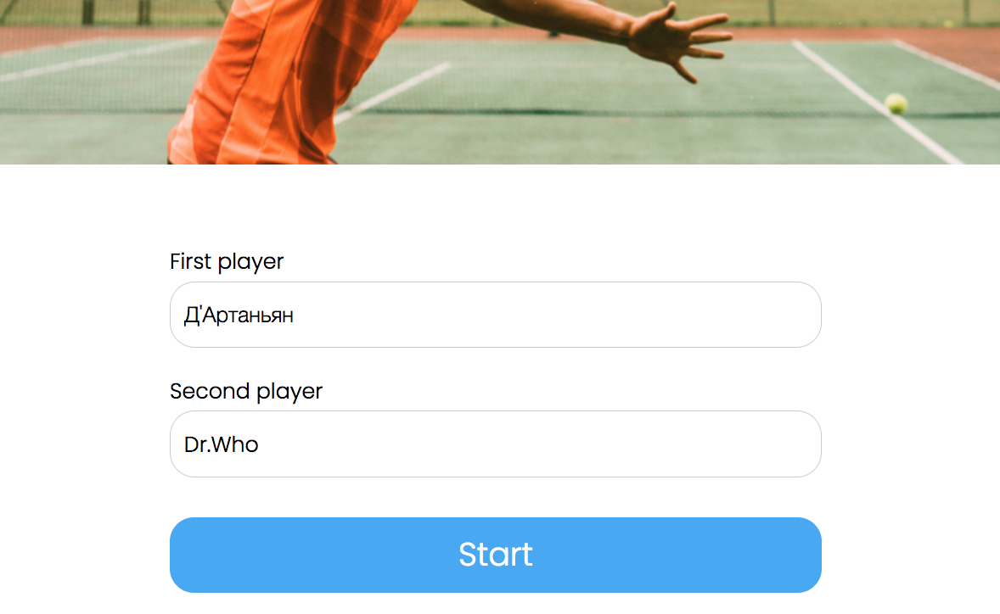
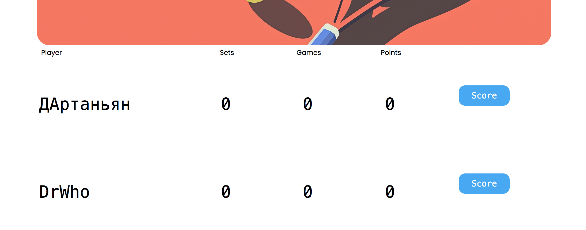
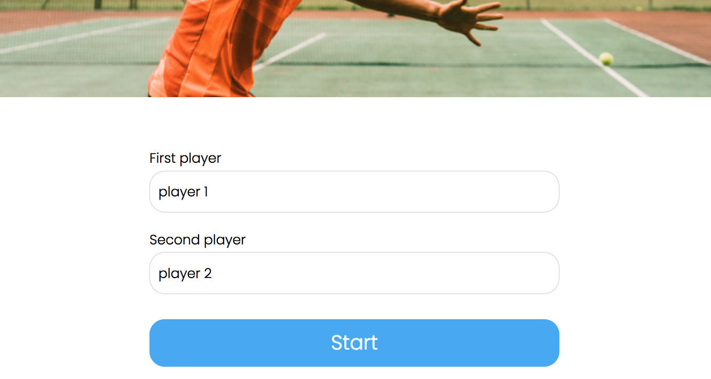
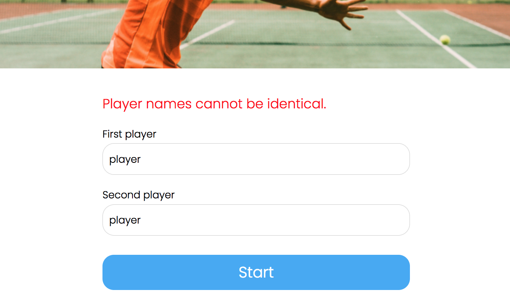
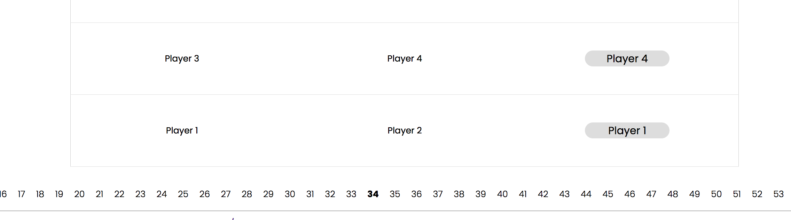

# Review на реализацию от [@ramaoao](https://github.com/ramaoao/TennisScoreboard) проекта [Табло теннисного матча](https://zhukovsd.github.io/java-backend-learning-course/projects/tennis-scoreboard/)

```text
1. Знаком ❗️ помечены критически важные замечания, а также места нарушения ТЗ.
2. Если ❗️ стоит перед заголовком, значит он относится ко всем пунктам этого раздела.
3. Замечания, указанные в пункте с именем пакета, относятся ко всем классам этого пакета или ко всем классам этого слоя.
4. Знаком 💡 помечены блоки, в которых содержится подсказка по реализации какого-то приёма или части кода. 
   Такие пункты всегда находятся в сворачиваемом блоке и разворачиваются по нажатию. 
   Перед их раскрытием стоит постараться придумать или поискать решение самостоятельно. 
```

## Функциональный обзор

- ❗️Цифры, апострофы и точки молча вырезаются из имени, которое ввёл пользователь.





Такое поведение является неожиданным для пользователя и ухудшает пользовательский опыт. А также может приводить к конфликту имён:





Вместо этого лучше показывать пользователю информативное сообщение об ошибке, в котором указывать разрешённые символы.

- ❗️В пагинации на странице завершённых матчей отображаются все страницы, что плохо выглядит при большом количестве страниц и делает недоступными страницы за пределами экрана.



## model

### Player

<div align="right">

[Перейти к упоминанию в Match](#match) </div>

- Класс является сущностью, связанной с БД (JPA Entity), поэтому можно поместить его в пакет `entity`.

- ❗️️Аннотация `@AllArgsConstructor` позволяет создать объект Player c установленным ID. Поле `id` является первичным ключом, генерируемым базой данных. Предоставление возможности устанавливать его напрямую в коде может привести к рассинхронизации объекта в приложении с его представлением в базе данных, а также к конфликтам при сохранении.

Стоит удалить аннотацию `@AllArgsConstructor`. Для создания новых, ещё не сохранённых в БД, игроков уже существует более безопасный и корректный конструктор.

- ❗️Аннотация `@NoArgsConstructor` без параметров создаёт `public` конструктор, позволяющий создавать невалидные объекты (без установки обязательных полей) в любом месте приложения. Hibernate достаточно конструктора без параметров с уровнем доступа protected — поэтому можно именно это значение установить в аннотации: `@NoArgsConstructor(access = AccessLevel.PROTECTED)`.

  Это предотвратит создание пустых, невалидных объектов из других частей приложения и будет сигналом другим разработчикам (потенциально), что этот конструктор предназначен в первую очередь для использования фреймворком, а не для прямого вызова в коде.

- Аннотация `@GeneratedValue` используется без указания `strategy`. JPA-провайдер сам решает, как генерировать ключи, что может привести к выбору не самой оптимальной стратегии (например, если по какой-то причине это окажется `TABLE`, которая требует дополнительных запросов к БД и блокировок). Это снижает производительность и предсказуемость поведения.

> Явное лучше неявного.

Лучше явно указать стратегию, которая хорошо подходит для приложения. Например, правильно будет выбрать `IDENTITY`.

Сейчас так:

```java
public class Player {
    @Id
    @GeneratedValue
    Long id;
}
```

Лучше так:

```java
public class Player {
    @Id
    @GeneratedValue(strategy = GenerationType.IDENTITY)
    Long id;
}
```

- В аннотацию `@Column` стоит добавить параметр `length` (например, `length = 30`), чтобы Hibernate тоже (помимо валидатора) выполнял проверку перед вставкой в БД. А также это влияет на DDL при создании таблицы. Целостность данных должна обеспечиваться на всех уровнях: в приложении (валидация) и в БД (constraints). Отсутствие ограничений в БД означает, что данные могут быть испорчены из-за ошибок в приложении или при прямом доступе к БД.

- Если имя поля совпадает с названием колонки, то параметр name в аннотации `@Column` можно опустить.

Сейчас так:

```java
public class Player {
    // ...
    @Column(name = "name", unique = true, nullable = false)
    String name;
    // ...
}
```

Можно так:

```java
public class Player {
    // ...
    @Column(unique = true, nullable = false, length = 30)
    String name;
    // ...
}
```

### Match

- Пункты про:
  - Помещение класса в пакет `entity`
  - ❗️Аннотацию `@AllArgsConstructor`
  - ❗️Аннотацию `@NoArgsConstructor`
  - Указание стратегии в аннотации `@GeneratedValue`

описанные в разделе [Player](#player), актуальны и для этого класса.

- ❗️Аннотация `@Setter` генерирует публичные сеттеры для всех полей класса:

  - Поле `id` является первичным ключом, генерируемым базой данных. Предоставление возможности устанавливать или менять его напрямую в коде может привести к рассинхронизации объекта в приложении с его представлением в базе данных, а также к конфликтам при сохранении.

  - Публичные сеттеры для полей игроков и победителя дают возможность любому коду изменить игрока или победителя после создания Entity матча, что нарушает инварианты (состав игроков, а также победитель должны быть неизменяемыми после завершения матча).

Как исправить: удалить аннотацию `@Setter`. Инициализация полей должна происходить только один раз в момент создания объекта через конструктор.

- ❗️Слово `MATCHES` (а также `MATCH`) является зарезервированным ключевым словом в некоторых диалектах SQL (например, для оператора `MATCH ... AGAINST` в полнотекстовом поиске). Хотя в конкретно в этом проекте проблем с этим не возникнет, не стоит использовать зарезервированные слова в качестве имён таблиц. Это может приводить к необходимости экранировать имя таблицы в нативных SQL-запросах или к синтаксическим ошибкам в некоторых СУБД.

[**Использование зарезервированных слов в качестве названий в БД**](#sql-keywords) <a id="back-from-sql-keywords-to-match"></a>

Лучше выбирать имена, которые гарантированно не конфликтуют с зарезервированными словами. Учитывая, что в таблице хранятся только завершённые матчи, можно выбрать более описательное и безопасное имя `FINISHED_MATCHES` или более общее `TENNIS_MATCHES`.

- Риск нарушения целостности данных. Класс не имеет механизмов, которые бы гарантировали на уровне схемы базы данных выполнение ключевых бизнес-правил:

  - Игрок не может играть сам с собой (`player1` должен отличаться от `player2`).

  - Победителем (`winner`) должен быть один из участников матча (`player1` или `player2`).

Хотя логика в сервисном слое может предотвращать создание некорректных матчей, база данных этого не гарантирует. Прямой SQL-запрос или ошибка в другом модуле приложения могут привести к созданию невалидных данных (например, матч, где `player1_id = 5` и `player2_id = 5`).

Защита должна быть на всех уровнях, поэтому стоит добавить ограничения, проверяющие, что игроки разные и победителем является один из участников матча.

<details>

<summary><b>💡 Например так 💡</b></summary>

---

```java
@Entity
@Table(name = "FINISHED_MATCHES", check = {
        @CheckConstraint(name = "players_are_different_check", constraint = "player1 != player2"),
        @CheckConstraint(name = "winner_is_participant_check", constraint = "winner = player1 OR winner = player2")
})
public class Match {
    
}
```

Что это даст:

  - Гарантирует целостность данных даже при прямом доступе к БД.
  - Снижает риск появления невалидных данных из-за ошибок в коде или внешних вмешательств.
  - Схема базы данных будет явно отражать бизнес-правила.

---

</details>

- Связи `@ManyToOne` не имеют явного указания о стратегии загрузки. По умолчанию для `@ManyToOne` используется `FetchType.EAGER`, что приводит к немедленной загрузке связанных сущностей при загрузке `Match`. Это может вызывать проблемы производительности (N+1 запросов) и излишнюю загрузку данных, особенно если связанные объекты не всегда нужны.

Как исправить: добавить `fetch = FetchType.LAZY` для каждого `@ManyToOne` поля.

Это даст более тонкий контроль над тем, какие данные загружаются и в некоторых ситуациях оптимизирует загрузку и предотвратит проблемы с производительностью.

- ❗️Для обязательных полей стоит добавить `optional = false` в `@ManyToOne` или `nullable = false` в `@JoinColumn` (можно добавить оба параметра). Целостность данных должна обеспечиваться на всех уровнях: в приложении (валидация) и в БД (constraints). Отсутствие ограничений в БД означает, что данные могут быть испорчены из-за ошибок в приложении или при прямом доступе к БД.

А также можно добавить атрибут `updatable = false`. Это атрибут запрещает изменять колонку после её первоначальной вставки. Игроки матча и победитель не должны меняться, поэтому эти колонки стоит защитить от обновлений.

Сейчас так:

```java
@FieldDefaults(level = AccessLevel.PRIVATE)
@Entity
@Table(name = "matches")
public class Match {

    // ...
  
    @ManyToOne
    @JoinColumn(name = "player1", referencedColumnName = "id")
    Player player1;

    @ManyToOne
    @JoinColumn(name = "player2", referencedColumnName = "id")
    Player player2;

    @ManyToOne
    @JoinColumn(name = "winner", referencedColumnName = "id")
    Player winner;
  
    // ...
}
```

Лучше так:

```java
@FieldDefaults(level = AccessLevel.PRIVATE)
@Entity
@Table(name = "matches")
public class Match {
    
    // ...

    @ManyToOne(optional = false)
    @JoinColumn(name = "player1", referencedColumnName = "id", nullable = false, updatable = false)
    Player player1;

    @ManyToOne(optional = false)
    @JoinColumn(name = "player2", referencedColumnName = "id", nullable = false, updatable = false)
    Player player2;

    @ManyToOne(optional = false)
    @JoinColumn(name = "winner", referencedColumnName = "id", nullable = false, updatable = false)
    Player winner;

    // ...
}
```

Сейчас таблица матчей создаётся так:

```postgres-sql
create table matches (
    id bigint not null,
    player1 bigint,
    player2 bigint,
    winner bigint,
    primary key (id)
)
```

При `optional = false` или `nullable = false` — Hibernate генерирует `NOT NULL` ограничение в БД и делает проверку перед вставкой в БД (если значение поля null, то Hibernate не будет обращаться в БД для вставки и сам выбросит исключение PropertyValueException)

Будет так:

```postgres-sql
create table matches (
    id bigint not null,
    player1 bigint not null,
    player2 bigint not null,
    winner bigint not null,
    primary key (id)
)
```

Это позволит избежать риска создания некорректных записей (например, матчи без игроков) в БД.

### Point

- Имя поля `displayed` не совсем ясно отражает его суть. Оно хранит строковое представление очка для отображения.

Можно переименовать поле `displayed` в `displayValue`. Геттер, генерируемый Lombok, также станет более понятным (`getDisplayValue()`).

Сейчас так:

```java
private final String displayed;

Point(String displayed) {
    this.displayed = displayed;
}
```

Можно так:

```java
private final String displayValue;

Point(String displayValue) {
    this.displayValue = displayValue;
}
```

- Метод `isStandardPoint()` используется для проверки, можно ли безопасно вызвать метод `next()`.

```java
/**
 * Point
 */
public boolean isStandardPoint() {
    return this == LOVE || this == FIFTEEN || this == THIRTY;
}

/**
 * В MatchScoreCalculationService
 */
private void handlePoint(PlayerScore playerScore, boolean isFirstPlayer) {
    // ...
    if (scorerPlayer.isStandardPoint()) {
        playerScore.setPoint(isFirstPlayer, scorerPlayer.next());
    }
    // ...
}
```

Наличие такого "проверяющего" метода является признаком того, что метод `next()` спроектирован небезопасно и его использование требует от вызывающего кода дополнительных знаний о внутренней логике `Point`.

Идеальным решением было бы реорганизовать логику так, чтобы необходимость в `isStandardPoint()` отпала. Например, инкапсулировать всю логику гейма в отдельный класс `Game`, который бы управлял очками `Point` и знал о состояниях "Deuce" и "Advantage".

Рефакторинг в сторону более богатой доменной модели уменьшит связанность кода и сделает его более надёжным, убрав необходимость для клиентов `Point` знать о его внутреннем устройстве.

- Метод `next()` некорректно реализует логику начисления очков в теннисе и имеет слишком широкую обработку ошибок.

```java
public Point next() {
    return switch (this) {
        case LOVE -> FIFTEEN;
        case FIFTEEN -> THIRTY;
        case THIRTY -> FORTY;
        default -> throw new IllegalStateException("No standard next point after " + this); // исправил опечатку в тексте сообщения
    };
}
```

Он не учитывает возможность перехода в состояние `ADVANTAGE` после `FORTY`: выбрасывает `IllegalStateException` для любого очка, которое не является `LOVE`, `FIFTEEN` или `THIRTY`, что неверно для `FORTY`.

Это перекладывает сложную бизнес-логику на вызывающий код. Клиентский код вынужден будет ловить исключение и реализовывать `switch` или `if-else` для обработки особых случаев (`FORTY` и `ADVANTAGE`), что нарушает принцип инкапсуляции.

Стоит переписать метод `next()` так, чтобы он правильно отражал правила тенниса: `THIRTY` -> `FORTY`, `FORTY` -> `ADVANTAGE`. Вызов `next()` на `ADVANTAGE` должен оставаться исключением, так как это терминальное состояние в рамках простого начисления очков.

<details>

<summary><b>💡 Вот так 💡</b></summary>

---

```java
public Point next() {
    return switch (this) {
        case LOVE -> FIFTEEN;
        case FIFTEEN -> THIRTY;
        case THIRTY -> FORTY;
        case FORTY -> ADVANTAGE;
        case ADVANTAGE -> throw new IllegalStateException("Cannot call next() on ADVANTAGE");
    };
}
```

Логика начисления очков будет инкапсулирована внутри `enum Point`, делая его более "богатым" и самодостаточным. Клиентский код станет проще и чище, так как ему больше не придётся обрабатывать особые случаи вручную.

---

</details>

### PlayerScore

- Класс называется `PlayerScore`, хотя отвечает за счёт обоих игроков во всём матче. Было бы уместно назвать его (в текущей реализации) `Score` или `MatchScore`.

- ❗️Использование аннотации `@Setter` из Lombok предоставляет публичные сеттеры для всех полей класса, таких как `player1Sets`, `player2Games`, `isTieBreak` и тд.

Это позволяет любому внешнему коду напрямую и бесконтрольно изменять внутреннее состояние счёта, полностью обходя игровую логику. Например, можно вызвать `setPlayer1Sets(10)`, что является невалидным состоянием для теннисного матча. Это превращает класс в простую структуру данных ("анемичную" модель) и делает систему хрупкой и подверженной ошибкам.

Как исправить: удалить аннотацию `@Setter`. Все изменения состояния должны производиться исключительно через методы, описывающие бизнес-логику (`addWinGame`, `resetPoints` и тд.), при этом их видимость тоже стоит пересмотреть.

- ❗️Класс является анемичной доменной моделью. Он представляет собой набор полей данных с геттерами и сеттерами и другими сеттеро-подобными публичными методами, в то время как вся основная бизнес-логика (например, как начисляется очко, как это влияет на геймы и сеты) вынесена во внешний сервисный класс.

Это нарушает ключевой принцип ООП — инкапсуляцию, согласно которому данные и поведение, работающее с этими данными, должны быть объединены. Код становится процедурным, менее читаемым и сложным для поддержки. Ответственность за целостность состояния `PlayerScore` перекладывается на внешних клиентов.

[**Анемичная vs Богатая модель предметной области**](#reach-anemic-model) <a id="back-from-reach-anemic-model-to-playerscore"></a>

Как исправить: Провести декомпозицию этой части бизнес-логики (разделение на классы значимых сущностей) и рефакторинг классов в сторону богатых доменных моделей. Разделить обязанности и наделить каждый класс полной ответственностью за управление своим состоянием.

- ❗️Класс `PlayerScore` нарушает Принцип единой ответственности, так как берёт на себя слишком много разнородных задач.

Он одновременно отвечает за:

  - хранение счёта первого игрока
  - хранение счёта второго игрока
  - знание правил выигрыша сета
  - знание правил выигрыша матча
  - управление состоянием тай-брейка

Такая концентрация ответственности в одном месте создаёт "Божественный объект" (God Class), который трудно тестировать, поддерживать и изменять.

Дублирование полей для двух одинаковых сущностей является признаком того, что в этой части логики отсутствует важная абстракция (отдельный класс), где были бы инкапсулированы состояние и поведение для одного объекта.

Декомпозиция предметной области и разделение ответственности решит эту проблему.

<details>

<summary><b>💡 Вот пара идей 💡</b></summary>

---

### Вариант 1

Можно оставить `PlayerScore` для счёта одного игрока, и создать отдельный класс, который сделать контейнером для двух таких объектов. А логику правил попробовать вынести в отдельные классы-стратегии.

### Вариант 2

Разделить класс на иерархию или композицию более мелких классов, каждый из которых отвечает за свой уровень:

  - `GameScore`: управляет очками (0, 15, 30, 40, AD).
  - `SetScore`: управляет геймами и, возможно, содержит экземпляр `GameScore`.
  - `MatchScore`: управляет сетами и содержит экземпляр `SetScore`.

---

</details>

- Блок `static final` констант (`SETS_TO_WIN_MATCH` и др.) объявлен в середине класса, после полей экземпляра. Константы принято объявлять в самом начале тела класса.

- В методе `isTieBreakBegun()` можно убрать скобки из логического выражения.

Сейчас так:

```java
public boolean isTieBreakBegun() {
    return (player1Games == GAMES_TO_WIN_SET && player2Games == GAMES_TO_WIN_SET);
}
```

Можно так:

```java
public boolean isTieBreakBegun() {
    return player1Games == GAMES_TO_WIN_SET && player2Games == GAMES_TO_WIN_SET;
}
```

- Метод `isTieBreakBegun()` имеет модификатор доступа `public`, но используется только внутри этого же класса (в методе `addWinGame`). Это "засоряет" публичный API класса и нарушает инкапсуляцию. Методы, являющиеся частью внутренней реализации, должны быть скрыты. Стоит изменить модификатор доступа метода на `private`.

- Число `2` из метода `isWinGame()` лучше заменить на уже объявленную и подходящую по смыслу константу `MIN_GAME_DIFF_TO_WIN_SET` (которая объявлена, но сейчас нигде не используется).

Сейчас так:

```java
public boolean isWinGame() {
    return (player1Games >= GAMES_TO_WIN_SET || player2Games >= GAMES_TO_WIN_SET) && Math.abs(player1Games - player2Games) >= 2;
}
```

Лучше так:

```java
static final int MIN_GAME_DIFF_TO_WIN_SET = 2;

public boolean isWinGame() {
    return (player1Games >= GAMES_TO_WIN_SET || player2Games >= GAMES_TO_WIN_SET) && Math.abs(player1Games - player2Games) >= MIN_GAME_DIFF_TO_WIN_SET;
}
```

- ❗️Методы `resetPoints()`, `resetGames()`, `resetTieBreakPoints()` объявлены как `public`, что позволяет любому внешнему коду в любой момент обнулить счёт. Сброс счёта определённого этапа — это внутренняя операция, которая должна происходить только в определённый момент (например, при начале нового сета). Публичный доступ позволяет легко нарушить логику игры. Эти методы должны быть `private` и вызываться только из других методов этого класса, управляющих ходом игры.

- Хотя часть чисел вынесена в константы (`SETS_TO_WIN_MATCH`, `GAMES_TO_WIN_SET`), в классе всё равно остаются числа, значение которых можно сделать ещё более явным.

Даже в простом методе

```java
public void resetGames() {
    this.player1Games = 0;
    this.player2Games = 0;
}
```

понятные названия констант улучшают читаемость

```java
public void resetGames() {
    this.player1Games = INITIAL_GAMES_SCORE;
    this.player2Games = INITIAL_GAMES_SCORE;
}
```

Также, чтобы изменить эти значения, достаточно будет поменять их в одном месте, а не искать по всему коду (возможно ещё и отдельно) для каждого игрока.

- Класс содержит повторяющиеся поля для каждого из двух игроков: `player1Sets`/`player2Sets`, `player1Games`/`player2Games`, `player1Points`/`player2Points` и тд. Это нарушение принципа DRY (Don't Repeat Yourself) и признак отсутствия важной абстракции в доменной модели.

> **DRY (Don't Repeat Yourself)** — принцип «Не повторяйся», направленный на снижение повторения кода и логики, так как изменения в повторяющихся участках требуют правок во многих местах, что увеличивает риск ошибок. Централизация логики делает код более поддерживаемым и надёжным.

Нет объекта, который бы отвечал за счёт одного игрока. Если потребуется добавить к счёту игрока новый атрибут (например, количество эйсов), придётся добавить два новых поля (`player1aces`, `player2aces`) и обновить всю логику, которая с ними работает. Это трудоёмко и чревато ошибками.

При разрастании класса, будет всё сложнее понять, какие поля относятся к игроку.

Рефакторинг с разделением ответственности полностью устранит эту проблему.

- Многие методы класса принимают флаг `boolean isFirstPlayer`.

```java
public void setPoint(boolean isFirstPlayer, Point newPoint) {
    if (isFirstPlayer) {
        // ...
    } else {
        // ...
    }
}

public void addWinSet(boolean isFirstPlayer) {
    if (isFirstPlayer) {
        // ...
    } else {
        // ...
    }
}

public void addWinGame(boolean isFirstPlayer) {
    if (isFirstPlayer) {
        // ...
    } else {
        // ...
    }
    // ...
}

public void addTieBreakPoint(boolean isFirstPlayer) {
    if (isFirstPlayer) {
        // ...
    } else {
        // ...
    }
}
```

Это указывает на то, что один класс пытается выполнять работу двух. Вместо того чтобы говорить конкретному объекту, что делать (`playerOneScore.addGame()`), вызывающий код говорит общему объекту, над кем выполнить действие (`matchScore.addWinGame(true)`). Это усложняет код и делает его менее объектно-ориентированным.

Рефакторинг с разделением ответственности полностью устранит эту проблему.

- Нет защиты инвариантов: Методы, изменяющие состояние, не проверяют текущее состояние перед его изменением. Например, можно вызвать `addWinSet`, даже если правила для выигрыша сета не выполнены. Это позволяет перевести объект в невалидное состояние. Ответственность за проверку правил перекладывается на вызывающий код.

Внутри "богатой" доменной модели методы изменения состояния должны сначала проверять все необходимые условия, прежде чем изменять состояние. Если условие не выполнено, метод должен ничего не делать или выбрасывать исключение.

### MatchScore

- `MatchScore` по своей сути представляет текущий, идущий матч. Имя `OngoingMatch` или `CurrentMatch` было бы более точным.

- ❗️`MatchScore` — это анемичная модель. Он представляет собой просто набор полей с геттерами и сеттерами, не содержащий никакой бизнес-логики.

```java
@Getter
@Setter
@FieldDefaults(level = AccessLevel.PRIVATE)
public class MatchScore {
    UUID uuid;
    Player player1;
    Player player2;
    Player winner;
    final PlayerScore playerScore;

    // конструктор
}
```

Вся логика подсчёта очков, определения победителя и изменения состояния матча вынесена во внешний сервисный класс.

Почему это проблема:

  - Нарушение инкапсуляции: Любой внешний код может напрямую изменить любое поле объекта, полностью игнорируя правила тенниса. Даже поле `playerScore` хотя оно и объявлено как `final`, что означает, что ему нельзя переприсвоить ссылку на другой объект `PlayerScore`, однако сам объект, на который указывает ссылка, является полностью изменяемым. Это делает состояние объекта ненадёжным.

  - Процедурный стиль: Вместо того чтобы сказать объекту `matchScore.addPointTo(firstPlayer)`, внешний код получает его внутренние данные

  ```java
  /**
   * В MatchScoreCalculationService
   */
  public void calculateMatchScore(MatchScore matchScore, Long scorerId) {
      // ...
      PlayerScore playerScore = matchScore.getPlayerScore();
      // ...
  
      if (playerScore.isTieBreak()) {
          handleTieBreak(playerScore, isFirstPlayer);
      } else {
          handlePoint(playerScore, isFirstPlayer);
      }
  
      updateMatchStatus(matchScore, playerScore, isFirstPlayer);
  }
  ```

  и изменяет их по своему усмотрению. Это является антипаттерном в объектно-ориентированном программировании и порождает процедурный, а не объектно-ориентированный подход. Код превращается в набор процедур, которые оперируют над объектом-держателем данных, что лишает преимуществ ООП.

  - Сложность тестирования: Чтобы протестировать логику подсчёта очков, нужно тестировать сервисы, которые её содержат, что может потребовать мокирования зависимостей. Если бы логика была внутри доменного объекта, её можно было бы тестировать в полной изоляции.

[**Анемичная vs Богатая модель предметной области**](#reach-anemic-model) <a id="back-from-reach-anemic-model-to-matchscore"></a>

Решением будет превратить `MatchScore` в "богатую" доменную модель, инкапсулировав в нём и данные, и поведение.

<details>

<summary><b>💡 В таком духе 💡</b></summary>

---

```java
// Концептуальный пример "богатой" модели
public class OngoingMatch {
  private final UUID id;
  private final PlayerScore firstPlayerScore; // PlayerScore тоже должен быть "богатой" моделью
  private final PlayerScore secondPlayerScore; // PlayerScore тоже должен быть "богатой" моделью
  
  // другие поля

  public OngoingMatch(UUID id, TennisPlayer firstPlayer, TennisPlayer secondPlayer) { // TennisPlayer тоже должен быть моделью (не JPA Entity)
    this.id = id;
    this.firstPlayerScore = new PlayerScore(firstPlayer);
    this.secondPlayerScore = new PlayerScore(secondPlayer);
  }

  // Публичный метод для изменения состояния
  public void awardPointTo(TennisPlayer player) {
    if (isFinished()) {
      throw new MatchAlreadyFinishedException();
    }

    PlayerScore winnerScore = getScoreFor(player);
    PlayerScore loserScore = getOpponentScoreFor(player);

    // Вся логика подсчёта очков, геймов и сетов находится здесь
    // Она вызывает внутренние методы winnerScore и loserScore
  }

  // Методы, совершающие необходимую работу над полями
  
}
```

При таком подходе от сеттеров стоит избавиться, чтобы состояние счёта управлялось только явно предусмотренными для этого методами. А также стоит оставить только нужные (не раскрывающие внутреннего устройства) геттеры.

---

</details>

Краткий чек-лист проверки успешного проектирования богатой доменной модели матча:

  - Объект сам контролирует своё состояние и не позволяет перевести себя в невалидное состояние.

  - Объектно-ориентированный дизайн: Данные и поведение, которое с ними работает, находятся вместе.

  - Простота тестирования: Можно создать экземпляр матча и протестировать всю логику игры, вызывая для начисления очков всего один метод.

- ❗️Поля `uuid` и `winner` имеют публичные сеттеры. `uuid` — это уникальный идентификатор матча, он должен быть присвоен один раз при создании и никогда не меняться. `winner` — это результат, который должен быть вычислен на основе счёта, а не установлен извне.

Как исправить:

  - Сделать поле `uuid` `final`, генерировать его и передавать через конструктор.

  - Убрать поле `winner` и его сеттер. Вместо этого создать метод `Optional<Player> getWinner()`, который будет возвращать победителя только в том случае, если матч завершён (логика завершения должна быть внутри этого класса).

- ❗️Класс хранит ссылки на JPA-сущности (`Player`). Использование объектов JPA Entity в доменной логике создаёт прямую зависимость доменного слоя от слоя персистентности и смешивает слои приложения, что нарушает чистоту архитектуры. Это может привести к проблемам с ленивой загрузкой (`LazyInitializationException`) или к неожиданным изменениям в базе данных, если состояние `Player` будет изменено в ходе бизнес-логики. Доменные модели должны оперировать "чистыми" объектами (POJO) или объектами-значениями (`Value Object`), а не сущностями, привязанными к базе данных.

Вместо `Player` (JPA Entity) в доменной модели `MatchScore` следует использовать специальный `Value Object`, например:

```java
public record TennisPlayer(
        String name
) {
}
```

который будет содержать только необходимые данные и не будет привязан к Hibernate. Преобразование из `Player` в `TennisPlayer` должно происходить на границе сервисного слоя.

- Поле `playerScore` объявлено как `final`, в то время как поля `uuid`, `player1`, `player2`, которые по своей сути также являются неизменяемыми после создания матча, не помечены как `final`.

Это создаёт несогласованность в дизайне класса и вводит в заблуждение. Другой разработчик не сможет с первого взгляда понять, какие поля можно изменять, а какие — нет. Это может привести к ошибкам, если кто-то попытается изменить поле, которое не предполагалось изменять.

Все поля, которые не должны меняться после инициализации объекта, следует объявить с модификатором `final`.

```java
// Только в контексте текущей реализации
@Getter
@FieldDefaults(level = AccessLevel.PRIVATE)
public class MatchScore {
    final UUID uuid;
    final Player player1;
    final Player player2;
    Player winner;
    final PlayerScore playerScore;

    // конструктор
}
```

Поле `winner` не должно быть `final`, так как оно определяется в конце матча.

- Поле `UUID uuid` можно не хранить в этом классе — достаточно будет в `OngoingMatchesService` помещать в хранилище объект конкретного матча по ключу UUID.

## dto

### PlayerNameDto

- В файле присутствует неиспользуемый импорт `import lombok.Getter;` — его можно удалить. Idea позволяет делать это автоматически с помощью функции "Optimize Imports" (`ctrl + alt + o` в Idea на mac os).

- Этот DTO используется для передачи данных обоих игроков при создании нового матча. Можно переименовать класс так, чтобы его имя отражало выполняемую операцию. Хорошими вариантами будут `CreateMatchDto`, `NewMatchRequest` или `StartMatchDto`.

- Поля `player1Name` и `player2Name` в DTO не имеют никаких аннотаций для валидации. DTO, представляющие входные данные (в данном случае, имена игроков для нового матча), являются первой линией защиты приложения. Без валидации в систему могут попасть некорректные данные: `null`, пустые строки (`""`) или строки, состоящие из пробелов. Это может привести к ошибкам `NullPointerException` на более глубоких слоях приложения и к записи некачественных данных в базу.

<details>

<summary><b>💡 Вот что можно сделать 💡</b></summary>

---

Добавить аннотации из пакета `jakarta.validation.constraints` для полей `player1Name` и `player2Name` (для этого нужно, чтобы в проекте была зависимость `jakarta.validation:jakarta-validation-api`). Как минимум, можно использовать `@NotBlank` и `@Size`.

```java
import jakarta.validation.constraints.NotBlank;
import jakarta.validation.constraints.Size;

public record CreateMatchDto(
    @NotBlank(message = "Player name cannot be blank")
    @Size(min = 2, max = 30, message = "Player name length must be between {min} and {max}")
    String firstPlayerName,

    @NotBlank(message = "Player name cannot be blank")
    @Size(min = 2, max = 30, message = "Player name length must be between {min} and {max}")
    String secondPlayerName
) {
}
```

---

</details>

- Класс реализован с использованием аннотации `@Value` из Lombok. Хотя это обеспечивает неизменяемость, более современным и идиоматичным подходом в Java 16+ является использование `record`. [Перейти к упоминанию в FinishedMatchDto](#finishedmatchdto) <a id="forward-from-finishedmatchdto-to-playernamedto"></a>

`record` предоставляет те же гарантии неизменяемости и автоматически генерирует конструктор, геттеры, `equals()`, `hashCode()` и `toString()`. `record` был специально разработан для таких классов-носителей данных.

Стоит преобразовать класс в `record`.

Сейчас так:

```java
@Value
public class PlayerNameDto {
    String player1Name;
    String player2Name;
}
```

Лучше так:

```java
public record CreateMatchDto(
        String firstPlayerName,
        String secondPlayerName
) {
}
```

### MatchScoreViewDto

- В классе используется аннотация `@Builder` вместе с `@Value`.

`@Builder` позволяет создавать объект по частям, что может привести к созданию неполного (невалидного) объекта, если не все обязательные поля будут установлены. Для DTO, которые являются простыми носителями данных, предпочтительнее использовать канонический конструктор, который требует передачи всех полей сразу. Это гарантирует, что объект будет создан в валидном состоянии.

Что сделать: Удалить аннотацию `@Builder` и использовать конструктор, который автоматически генерируется аннотацией `@Value` (или `record`).

- Класс реализован с использованием аннотации `@Value` из Lombok. Хотя это обеспечивает неизменяемость, более современным и идиоматичным подходом в Java 16+ является использование `record`.

`record` предоставляет те же гарантии неизменяемости и автоматически генерирует конструктор, геттеры, `equals()`, `hashCode()` и `toString()`. `record` был специально разработан для таких классов-носителей данных.

Стоит преобразовать класс в `record`.

- Класс содержит множество дублирующихся полей для каждого игрока: `player1Id`/`player2Id`, `player1Name`/`player2Name`, `player1Sets`/`player2Sets` и другие:

```java
public class MatchScoreViewDto {
    // ...

    Long player1Id;
    Long player2Id;

    String player1Name;
    String player2Name;

    int player1Sets;
    int player2Sets;

    int player1Games;
    int player2Games;

    String player1Points;
    String player2Points;
}
```

Это является нарушением принципа DRY (Don't Repeat Yourself) и признаком отсутствия важной абстракции. Код становится громоздким. Если потребуется добавить новый атрибут для игрока или его счёта, придётся добавлять два новых поля и обновлять логику маппинга в двух местах.

Стоит создать отдельный, более мелкий DTO, который будет инкапсулировать все данные, относящиеся к одному игроку и его счёту.

<details>

<summary><b>💡 Например, так 💡</b></summary>

---

```java
// Новый DTO для игрока и его счёта
public record PlayerInMatchDto(
    Long id,
    String name,
    int sets,
    int games,
    String points
) {}

// Обновлённый MatchScoreViewDto
public record MatchScoreViewDto(
    UUID uuid,
    PlayerInMatchDto firstPlayer,
    PlayerInMatchDto secondPlayer
) {}
```

---

</details>

### FinishedMatchDto

- Пункт про использование аннотации `@Value` и преобразование класса в `record`, описанные в разделе [PlayerNameDto](#forward-from-finishedmatchdto-to-playernamedto) актуален и для этого класса.

## dao

### PlayerDao

<div align="right">

[Перейти к упоминанию в MatchDao](#matchdao) </div>

- Методы имеют суффиксы `Player`: `findPlayerByName` и `savePlayer`. Работа с `Player` уже подразумевается контекстом названия самого класса `PlayerDao` и типом возвращаемых значений. Поэтому можно удалить этот суффикс из названий методов: `findPlayerByName` —> `findByName` и `savePlayer` —> `save`.

- ❗️Все методы интерфейса `PlayerDao` (`findPlayerByName`, `savePlayer`) в качестве первого аргумента принимают объект `org.hibernate.Session`.

Это является "протекающей абстракцией" (leaky abstraction). Слой доступа к данным (DAO) не должен выставлять наружу детали своей реализации. Интерфейс `PlayerDao` должен определять контракт (что можно сделать с данными игроков), но не должен диктовать, как это будет сделано (с помощью Hibernate `Session`, JPA `EntityManager` или чего-то ещё). Клиенты этого интерфейса (сервисный слой) теперь жёстко привязаны к Hibernate.

Как исправить: Убрать параметр `Session` из сигнатур всех методов в интерфейсе. Ответственность за управление сессией должна быть полностью инкапсулирована внутри класса-реализации (`HibernatePlayerDao`).

Сейчас так:

```java
public interface PlayerDao {
    Optional<Player> findPlayerByName(Session session, String name);
    Player savePlayer(Session session, Player player);
}
```

Лучше так:

```java
public interface PlayerDao {
    Optional<Player> findByName(String name);
    Player save(Player player);
}
```

### HibernatePlayerDao

<div align="right">

[Перейти к упоминанию в FinishedMatchesPersistenceService](#finishedmatchespersistenceservice) </div>

- ❗️Класс реализует интерфейс, который заставляет его принимать объект `Session` извне. Это делает класс зависимым от вызывающего кода, который должен знать, как создать и передать сессию Hibernate. Это нарушает инкапсуляцию и создаёт сильную связь между сервисным слоем и слоем DAO.

<details>

<summary><b>💡 Вот как это можно исправить 💡</b></summary>

---

DAO может сам получать `Session` из `SessionFactory`. Для этого надо:

1. Параметр `Session` удалить из методов.
2. Внедрять `SessionFactory` в `HibernatePlayerDao` через конструктор.

```java
public class HibernatePlayerDao implements PlayerDao {
    private final SessionFactory sessionFactory;

    public HibernatePlayerDao(SessionFactory sessionFactory) {
        this.sessionFactory = sessionFactory;
    }

    @Override
    public Optional<Player> findByName(String name) {
        Session session = sessionFactory.getCurrentSession();
        // логика запроса
    }
    // ...
}
```

---

</details>

- Ключевые слова в тексте HQL-запроса (`from`, `where`) написаны в нижнем регистре. Хотя это и не влияет на работоспособность, написание ключевых слов SQL/HQL в верхнем регистре (`UPPERCASE`) является общепринятым стандартом. Это значительно улучшает читаемость запросов, так как визуально отделяет синтаксические конструкции языка от имён сущностей и полей.

Сейчас так:

```java
"from Player where name = :name"
```

Лучше так:

```java
"FROM Player WHERE name = :name"
```

- Для визуального разделения запросов на строки лучше использовать текстовые блоки

Вместо этого:

```java
"FROM Player WHERE name = :name"
```

Лучше так:

```java
"""
FROM Player 
WHERE name = :name
"""
```

Текст запроса удобнее читать, когда он логично разбит на строки, даже если он короткий.

- Текст HQL-запроса `"from Player where name = :name"` жёстко закодирован внутри метода `findPlayerByName` и является "магической строкой" (неназванным строковым литералом).

```java
public Optional<Player> findPlayerByName(Session session, String name) {
    Query<Player> query = session.createQuery("from Player where name = :name", Player.class)
}
```

"Магические строки" в коде — источник ошибок. В них легко допустить опечатку, которую компилятор не сможет проверить. Также, если такой же запрос понадобится в другом месте, его придётся скопировать, что приведёт к дублированию. При изменении сущности придётся искать и исправлять все такие строки вручную.

Лучше вынести текст запроса в `private static final` константу и дать ей понятное имя.

```java
private static final String FIND_BY_NAME_HQL = """
        FROM Player 
        WHERE name = :name
        """;
```

Когда запросы собраны в одном месте, их легко найти и изменить, а также снижается риск опечаток и исключается дублирование этой части кода. Даже если сейчас запрос только один, стоит придерживаться этого подхода.

- Код в методах не обёрнут в блоки `try-catch`. А значит, любое исключение, возникшее во время работы с базой данных (`HibernateException`), будет без обработки проброшено наверх. Слой DAO должен перехватывать специфичные для технологии исключения (например, `HibernateException`) и оборачивать их в свои, более общие исключения слоя доступа к данным (например, `DataAccessException`). Это скрывает детали реализации от верхних слоёв и делает их независимыми от деталей реализации DAO.

Как исправить: Обернуть вызовы Hibernate в `try-catch` и пробрасывать специализированное исключение.

<details>

<summary><b>💡 В таком духе 💡</b></summary>

---

```java
public Something doSomeOperation(Parameters params) {
    try {
        Session session = ...
    } catch (HibernateException e) {
        throw new DataAccessException("Database operation failed", e);
    }
}
```

---

</details>

- Для получения опционального результата используется `Optional.ofNullable(query.uniqueResult())`. Метод `uniqueResult()` возвращает `null`, если результат не найден и затем заворачивается в `Optional<T>`. В методе, который возвращает `Optional<T>` лучше использовать более идиоматичный метод `uniqueResultOptional()`, который сразу возвращает `Optional<T>`.

Сейчас так:

```java
public Optional<Player> findPlayerByName(Session session, String name) {
        
    // ...
        
    return Optional.ofNullable(query.uniqueResult());
}
```

Лучше так:

```java
public Optional<Player> findPlayerByName(Session session, String name) {
        
    // ...
        
    return query.uniqueResultOptional();
}
```

- Тело метода `findPlayerByName()` можно записать лаконичнее (продолжить цепочку вызовов и сразу вернуть результат)

Сейчас так:

```java
@Override
public Optional<Player> findPlayerByName(Session session, String name) {
    Query<Player> query = session.createQuery("from Player where name = :name", Player.class)
            .setParameter("name", name);
    return Optional.ofNullable(query.uniqueResult());
}
```

Можно так:

```java
@Override
public Optional<Player> findPlayerByName(Session session, String name) {
    return session.createQuery(FIND_BY_NAME_HQL, Player.class)
            .setParameter("name", name)
            .uniqueResultOptional();
}
```

API для построения запросов в Hibernate спроектирован как "текучий" (fluent), где каждый метод настройки возвращает сам объект, позволяя выстраивать вызовы в цепочку.

### MatchDao

- Пункты про:
  - Избыточный суффикс в названии метода
  - ❗️Протекающую абстракцию (`org.hibernate.Session`)

описанные в разделе [PlayerDao](#playerdao), актуальны и для этого класса.

- ❗️Интерфейс `MatchDao` объявляет только один метод — `saveMatch`.

```java
public interface MatchDao {
    Match saveMatch(Session session, Match match);
}
```

Он не соответствует требованиям технического задания. Согласно ТЗ, для страницы `/matches` необходим следующий функционал:

  - Постраничный вывод списка сыгранных матчей.

  - Поиск матчей по имени игрока.

Для реализации этих требований DAO-интерфейс для матчей должен содержать методы, которые позволяют это сделать. Сейчас интерфейс `MatchDao` не предоставляет ничего из этого.

Стоит добавить в интерфейс все методы, необходимые для реализации бизнес-требований.

<details>

<summary><b>💡 Например, так 💡</b></summary>

---

```java
public interface MatchDao {
    /**
     * Сохраняет матчи в базу.
     * @param match объект, который надо сохранить.
     * @return сохранённый матч.
     */
    Match save(Match match);
    
    /**
     * Находит матчи с участием игрока с заданным именем (с пагинацией).
     * @param playerName имя игрока для поиска.
     * @param offset смещение (количество пропускаемых записей).
     * @param limit максимальное количество записей на странице.
     * @return список найденных матчей.
     */
    List<Match> findByPlayerName(String playerName, int offset, int limit);

    /**
     * Возвращает общее количество матчей, в которых участвовал игрок.
     * @param playerName имя игрока.
     * @return общее количество матчей.
     */
    long countByPlayerName(String playerName);
    
    /**
     * Находит все матчи с пагинацией.
     * @param offset смещение.
     * @param limit лимит.
     * @return список матчей на странице.
     */
    List<Match> findAll(int offset, int limit);
    
    /**
     * Возвращает общее количество всех матчей в базе.
     * @return общее количество матчей.
     */
    long count();
}
```

С этими методами приложение сможет оптимально реализовать требуемый функционал. Интерфейс будет чётко и полно описывать все возможные операции с сущностью `Match`. Слой доступа к данным будет соответствовать бизнес-требованиям.

---

</details>

## service

### PlayerService

<div align="right">

[Перейти к упоминанию в FinishedMatchesPersistenceService](#finishedmatchespersistenceservice) </div>

- Для внедрения зависимостей используется конструктор, написанный вручную. Поскольку в проекте уже используется Lombok, этот шаблонный код можно сократить.

Стоит добавить аннотацию `@RequiredArgsConstructor` на уровне класса, тогда Lombok автоматически сгенерирует публичный конструктор для всех `final` полей.

Сейчас так:

```java
public class PlayerService {
    private final PlayerDao playerDAO;
    private final TransactionalExecutor transactionalExecutor;

    public PlayerService(PlayerDao playerDAO, TransactionalExecutor transactionalExecutor) {
        this.playerDAO = playerDAO;
        this.transactionalExecutor = transactionalExecutor;
    }
    // ...
}
```

Можно так:

@RequiredArgsConstructor
```java
public class PlayerService {
    private final PlayerDao playerDAO;
    private final TransactionalExecutor transactionalExecutor;
    // ...
}
```

- Логика метода `getOrCreatePlayer` пытается обработать возможное состояние гонки (race condition) при создании игрока через блок `try-catch`.

```java
// 1. Попытка найти
Optional<Player> found = playerDAO.findPlayerByName(session, name);
if (found.isPresent()) {
    return found.get();
}

try {
    // 2. Если не нашли, пытаемся сохранить
    Player newPlayer = new Player(name);
    playerDAO.savePlayer(session, newPlayer);
    // ...
} catch (PersistenceException e) {
    if (e.getCause() instanceof ConstraintViolationException) {
        // 3. Если сохранение не удалось из-за дубликата, ищем снова
        session.clear();
        return playerDAO.findPlayerByName(session, name)
                .orElseThrow(...);
    }
    throw e;
}
```

Хотя это рабочее решение, можно использовать другой подход.

<details>

<summary><b>💡 Например, такой 💡</b></summary>

---

Вместо обработки исключения, можно положиться на уникальный `constraint` в базе данных. Более простой подход для этого сценария: всегда сначала пытаться найти игрока, а если его нет — создавать. Если в редком случае конкурентный поток создаст игрока между проверкой и сохранением первого, транзакция просто не удастся, и её можно будет безопасно откатить.

Возможно, это даже лучше, чем использовать исключения для управления потоком выполнения для обработки этого редкого случая.

---

</details>

- ❗️Сервис напрямую работает с `Session`, передавая её в DAO: `playerDAO.findPlayerByName(session, name)`. Это нарушает инкапсуляцию слоя DAO. Сервис не должен знать, что DAO для своей работы использует `Session` — он должен работать с "чистым" интерфейсом DAO.

Как исправить:

  - Провести рефакторинг `PlayerDao` — убрать `Session` из параметров методов. DAO должен сам управлять своей сессией.
  - Провести рефакторинг `TransactionalExecutor` — вместо `Function<Session, T> work` передавать в метод `executeInTransaction()` `Supplier<T> work`. (пример будет в разделе TransactionalExecutor)

- В блоке `catch` код пробрасывает `PersistenceException` (`throw e;`), если это не `ConstraintViolationException`.

`PersistenceException` — это исключение, специфичное для JPA/Hibernate. Сервисный слой не должен пропускать такие исключения наверх. Он должен оборачивать их в свои, специфичные для домена или приложения исключения.

Лучше оборачивать любое `PersistenceException` в специализированное исключение, например, `DataAccessException`, как это уже сделано в `TransactionalExecutor`.

Сейчас так:

```java
public Player getOrCreatePlayer(String name) {
    // ...
    try {
        // ...
    } catch (PersistenceException e) {
        if (e.getCause() instanceof ConstraintViolationException) {
            // ...
        }
        throw e;
    }
}
```

Лучше так:

```java
public Player getOrCreatePlayer(String name) {
    // ...
    try {
        // ...
    } catch (PersistenceException e) {
        if (e.getCause() instanceof ConstraintViolationException) {
            // ...
        }
        throw new DataAccessException("Couldn't get or create player with the name: " + name, e);
    }
}
```

### OngoingMatchesService

- Класс `OngoingMatchesService` располагается в пакете `service`, однако его функциональность заключается в хранении данных (текущих матчей) в памяти (in-memory). По своей сути, он является реализацией паттерна "Репозиторий" или "DAO", а не бизнес-сервисом. Такое расположение нарушает общепринятые принципы слоистой архитектуры. Пакет `service` предназначен для классов, содержащих бизнес-логику, оркестрацию и управление транзакциями, в то время как классы, отвечающие за доступ и хранение данных, должны находиться в пакете `dao` или `repository`.

Что можно сделать:

  - Создать интерфейс `OngoingMatchDao` с методами `find`, `create`, `remove`.

  - Переименовать класс `OngoingMatchesService` в `InMemoryOngoingMatchDao` и реализовать в нём этот интерфейс.

  - Переместить новый класс и интерфейс в соответствующий пакет, например, `dao.inmemory`.

- ❗️Метод `createNewMatch` принимает в качестве параметров `Player firstPlayer` и `Player secondPlayer`, которые являются JPA-сущностями. Это создаёт нежелательную сильную связь между слоем, отвечающим за хранение данных в памяти (in-memory), и слоем персистентности (JPA).

Задача `OngoingMatchesService` — хранить информацию о текущих матчах, а не оперировать JPA-сущностями.

Передача управляемых сессией Hibernate сущностей в другой слой, не связанный с транзакцией, может привести к ошибкам `LazyInitializationException` при попытке доступа к лениво загружаемым полям или к другим неожиданным побочным эффектам.

Класс становится жёстко привязан к модели данных JPA. Его нельзя будет легко переиспользовать в другом контексте, где нет сущности `Player`.

Как исправить: Метод `createNewMatch` должен принимать более простые, изолированные типы данных, а не JPA-сущности. Возможные варианты:

  - Принимать простые строки: `createNewMatch(String firstPlayerName, String secondPlayerName)`.
  - Принимать специальные DTO игроков: `createNewMatch(PlayerDto firstPlayer, PlayerDto secondPlayer)`.
  - Принимать специальный DTO матча: `createNewMatch(NewMatchDto matchDto)`.

Сейчас так:

```java
public UUID createNewMatch(Player firstPlayer, Player secondPlayer) {
    // ...
}
```

Лучше так:

```java
public record NewMatchDto(
        String firstPlayerName,
        String secondPlayerName
) {
}

/**
 * В OngoingMatchesService
 */
public UUID createNewMatch(NewMatchDto matchDto) {
    // ...
}
```

### FinishedMatchesPersistenceService

- Пункты про:
  - Генерацию конструктора через Lombok
  - ❗️Прямую работу с `Session`

описанные в разделе [PlayerService](#playerservice), актуальны и для этого класса.

- Пункты про:
  - Использование текстовых блоков для HQL запросов
  - Вынесение HQL запросов в константы

описанные в разделе [HibernatePlayerDao](#hibernateplayerdao), актуальны и для этого класса.

- ❗️Логика формирования и выполнения HQL-запросов (`session.createQuery(...)`) находится непосредственно в классе `FinishedMatchesPersistenceService`.

```java
public List<Match> getFinishedMatchesByPlayerName(String name, int currentPage, int PAGE_SIZE) {
    // ...

    StringBuilder hql = new StringBuilder();
    hql.append("SELECT m FROM Match m ")
            .append("JOIN FETCH m.player1 ")
            .append("JOIN FETCH m.player2 ")
            .append("JOIN FETCH m.winner ");

    if (hasFilter) {
        hql.append("WHERE m.player1.name = :name OR m.player2.name = :name ");
    }

    hql.append("ORDER BY m.id DESC ");

    ... = session.createQuery(hql.toString(), Match.class);

    // ...
}
```

Это нарушает принцип единственной ответственности. `Service` должен содержать бизнес-логику, а вся работа с запросами к БД (формирование, выполнение) должна быть инкапсулирована в слое DAO (`MatchDao`). `FinishedMatchesPersistenceService` должен вызывать методы DAO, передавая им параметры (имя, `offset`, `limit`), а не собирать запрос и запускать его выполнение самостоятельно.

Как исправить: Перенести всю логику HQL-запросов в `HibernateMatchDao`.

- В методе `saveMatch` вызывается `session.flush()`. Этот вызов принудительно синхронизирует состояние сессии Hibernate с базой данных, выполняя накопленные SQL-запросы. В текущей реализации он избыточен, так как Hibernate автоматически вызовет `flush` перед коммитом транзакции. Ручной вызов может помешать оптимизациям Hibernate (например, пакетной вставке) и без веской причины не должен использоваться.

- Условие `name == null || name.isBlank()` и его инвертированная версия `name != null && !name.isBlank()` повторяются в методах `countMatchesByPlayerName` и `getFinishedMatchesByPlayerName`.

Это является нарушением принципа DRY (Don't Repeat Yourself). Хотя логика проста, её дублирование означает, что при необходимости внесения изменений (например, добавить `.trim()`), их придётся делать в нескольких местах, что увеличивает риск ошибки.

Можно вынести эту логику в небольшой вспомогательный `private` метод.

Сейчас так:

```java
public long countMatchesByPlayerName(String name) {
    if (name == null || name.isBlank()) {
        // ...
    }
    // ...
}

public List<Match> getFinishedMatchesByPlayerName(String name, int currentPage, int PAGE_SIZE) {
    // ...

    boolean hasFilter = name != null && !name.isBlank();

    // ...

    if (hasFilter) {
        // ...
    }

    // ...
}
```

Лучше так:

```java
public long countMatchesByPlayerName(String name) {
    if (!isNameFilterPresent(name)) {
        // ...
    }
    // ...
}

public List<Match> getFinishedMatchesByPlayerName(String name, int currentPage, int PAGE_SIZE) {
    // ...
        
    if (isNameFilterPresent(name)) {
        // ...
    }

    // ...
}

private boolean isNameFilterPresent(String name) {
    return name != null && !name.isBlank();
}
```

- В методах `calculateTotalPages` и `getFinishedMatchesByPlayerName` имя параметра `PAGE_SIZE` написано в стиле `UPPER_SNAKE_CASE`, что не соответствует соглашениям по написанию кода на Java. В Java принято использовать `camelCase` для имён переменных, параметров и методов. Нарушение этой конвенции делает код менее читаемым для Java-разработчиков и выбивается из общего стиля.

Стоит переименовать параметр в стиле `camelCase`.

- В методе `calculateTotalPages` название параметра `long currentPage` не соответствует передаваемому значению.

```java
/**
 * В MatchHistoryServlet
 */
int totalPages = finishedMatchesPersistenceService.calculateTotalPages(totalMatchesCount, PAGE_SIZE);

/**
 * В FinishedMatchesPersistenceService
 */
public int calculateTotalPages(long currentPage, int PAGE_SIZE) {
    // ...
}
```

Стоит переименовать его, например, в `totalItems` (общее количество записей).

- ❗️Метод `getFinishedMatchesByPlayerName` возвращает `List<Match>`, то есть список JPA-сущностей.

```java
public List<Match> getFinishedMatchesByPlayerName(String name, int currentPage, int PAGE_SIZE) {
    // ...
}
```

Сервисный слой должен служить границей между доменной моделью и слоем контроллеров. Передача объектов JPA-Entity наружу смешивает слои и является антипаттерном ("протекающая абстракция").

  - Если JSP-страница попытается получить доступ к лениво загружаемому полю `Match` (например, к `match.getFirstPlayer().getName()`), произойдёт ошибка, так как сессия Hibernate к этому моменту уже будет закрыта.

  - Слой представления становится зависимым от структуры таблиц в базе данных. Любое изменение в `Match` Entity потребует изменений во View.

  - Метод возвращает только список матчей, но для отрисовки пагинации на странице необходима дополнительная информация: общее количество страниц, номер текущей страницы и тд.

Как исправить:

Сервис должен возвращать DTO, специально созданный для этой задачи (например, `PagedResponseDto`, содержащий и список DTO-матчей, и мета-информацию). Вся логика преобразования из `Entity` в DTO должна быть инкапсулирована в маппере.

Это сделает сервис более соответствующим принципу разделения слоёв, исключит `LazyInitializationException` и утечку внутренних данных (которые могут содержаться в JPA-Entity) наружу.

### MatchScoreCalculationService

> Многие пункты, относящиеся к этому классу, исправятся или потеряют смысл после проведения рефакторинга классов моделей и перехода к "богатой" доменной модели. Но так как многие рекомендации могут быть полезны и вне этого класса, они тоже будут описаны.

- ❗️Класс `MatchScoreCalculationService` содержит в себе всю бизнес-логику по подсчёту очков, геймов и сетов. Объекты, которыми он оперирует (`MatchScore`, `PlayerScore`), являются "анемичными" моделями — простыми контейнерами данных практически без собственного поведения. Сервис напрямую читает и записывает их поля (`PlayerScore`).

Это главная архитектурная проблема этой части логики. По этим причинам:

  - Нарушение инкапсуляции: Данные (в `PlayerScore`) и поведение (в `MatchScoreCalculationService`) полностью разделены. Любой другой сервис может так же напрямую изменить счёт матча, и объект `PlayerScore` не сможет себя защитить.

  - Процедурный стиль: Вместо объектно-ориентированного подхода, где объекты сами управляют своим состоянием (и начисление очков происходит в духе `matchScore.pointWonBy(player)`), получается процедурный код, который манипулирует внешними структурами данных.

  - Жёсткая связанность (Tight Coupling) и низкая связность (Low Cohesion): Сервис тесно связан с внутренним устройством `PlayerScore`. При этом логика, относящаяся к одному понятию (счёт), размазана по разным классам (модели и сервису).

  - Сложность тестирования: Чтобы протестировать один конкретный сценарий (например, переход от "ровно" к "преимуществу"), нужно разбираться во многоступенчатой логике `if-else`. Это сложно и хрупко.

Как исправить: Провести рефакторинг классов моделей с переходом к "богатой" доменной модели.

- Методы сервиса (`calculateMatchScore`, `handlePoint` и др.) изменяют состояние объектов (`matchScore`, `playerScore`), переданных им в качестве параметров.

```java
public class MatchScoreCalculationService {

    public void calculateMatchScore(MatchScore matchScore, Long scorerId) {
        // ...
    }

    private void handlePoint(PlayerScore playerScore, boolean isFirstPlayer) {
        // ...
    }


    private void handleTieBreak(PlayerScore playerScore, boolean isFirstPlayer) {
        // ...
    }

    private void winGame(PlayerScore playerScore, boolean isFirstPlayer) {
        // ...
    }

    private void winSet(PlayerScore playerScore, boolean isFirstPlayer) {
        // ...
    }

    public void updateMatchStatus(MatchScore match, PlayerScore playerScore, boolean isFirstPlayer) {
        // ...
    }
}
```

Это является побочным эффектом (side effect). Код, вызывающий такой метод, может не ожидать, что переданный им объект будет изменён. В сложных системах отслеживание таких неявных мутаций становится источником трудноуловимых ошибок. Более предсказуемым является функциональный подход, когда метод не меняет исходный объект, а возвращает новый с изменённым состоянием.

В этом проекте проблема исчезнет сама после рефакторинга доменных моделей.

- Тело блока `if` лучше всегда оборачивать в фигурные скобки. В методе `calculateMatchScore` тело однострочного оператора `if` не обернуто в фигурные скобки. Хотя синтаксис Java это позволяет, данная практика является опасной и нарушает [конвенцию по стилю кода](https://www.oracle.com/java/technologies/javase/codeconventions-statements.html#449). Она может привести к трудноуловимым ошибкам.

Сейчас так:

```java
if (matchScore.getWinner() != null) return;
```

Лучше так:

```java
if (matchScore.getWinner() != null) {
    return;
}
```

Это улучшит читаемость кода и снизит вероятность ошибок.

- Метод `calculateMatchScore` и вызываемые им `private` методы (`handlePoint`, `winGame` и тд) представляют собой одну большую процедуру, которая последовательно изменяет данные. Это не соответствует объектно-ориентированному подходу и лишает его преимуществ. Такой код труднее читать, так как он состоит из цепочки вызовов, передающих друг другу флаги (`isFirstPlayer`) и объекты.

Рефакторинг в сторону "богатой" доменной модели автоматически исправит эту проблему.

- Метод `updateMatchStatus` объявлен как `public`, но используется только внутри этого класса, а также не должен являться частью публичного контракта `MatchScoreCalculationService`, поэтому стоит изменить его модификатор доступа на `private`

- В коде используется синхронизация на объекте, переданном в метод в качестве параметра.

```java
public void calculateMatchScore(MatchScore matchScore, Long scorerId){
    synchronized (matchScore) {
        // ...
    }
}
```

Обычно это не является хорошим подходом из-за:

  - Непредсказуемого поведения: объект, на котором происходит синхронизация, может быть изменён или передан другому коду, который тоже попытается захватить его монитор.

  - Сложности отладки: трудно отследить все места, где используется данный монитор.

  - Потенциальных deadlock-ов: если два разных метода будут синхронизироваться на одном и том же объекте, но в разном порядке, возможна взаимная блокировка.

  - Нарушения инкапсуляции: блокировка должна быть внутренним механизмом класса, а не зависеть от внешних объектов.

Что можно сделать:

  - Синхронизироваться на другом объекте

  - Использовать другой механизм потокобезопасности

  - Перепроектировать дизайн так, чтобы явная синхронизация не потребовалась

## servlet

### HomeServlet

- Название `HomeServlet` подразумевает, что он обрабатывает путь `/home`, но текущий маппинг этого не отражает.

Можно сделать маппинг более явным и соответствующим названию и роли контроллера. Например, зарегистрировать его сразу на несколько подходящих путей.

Вот так:

```java
@WebServlet(name = "HomeServlet", urlPatterns = {"", "/home"})
public class HomeServlet extends HttpServlet {
    // ...
}
```

- Класс называется `HomeServlet`, а связанная с ним JSP страница `index.jsp`. Можно переименовать сервлет или JSP страницу, чтобы привести их названия в соответствие.

- Путь к файлу `index.jsp` (`"WEB-INF/views/index.jsp"`) жёстко закодирован прямо в методе `doGet`.

Жёстко закодированные строковые литералы ("магические строки") затрудняют рефакторинг и поддержку кода. Если путь к странице изменится, его придётся искать и исправлять внутри логики метода. Кроме того, если этот же путь будет использоваться в другом месте, возникнет дублирование, что может привести к ошибкам (например, при изменении пути в одном месте, но не в другом).

Можно вынести путь к JSP-странице в приватную статическую константу с осмысленным именем.

Сейчас так:

```java
@WebServlet(name = "HomeServlet", urlPatterns = "")
public class HomeServlet extends HttpServlet {
    public void doGet(HttpServletRequest request, HttpServletResponse response) throws IOException, ServletException {
        request.getRequestDispatcher("WEB-INF/views/index.jsp").forward(request, response);
    }
}
```

Лучше так:

```java
@WebServlet(name = "HomeServlet", urlPatterns = {"", "/home"})
public class HomeServlet extends HttpServlet {
    private static final String HOME_PAGE_JSP = "WEB-INF/views/home.jsp";

    public void doGet(HttpServletRequest request, HttpServletResponse response) throws IOException, ServletException {
        request.getRequestDispatcher(HOME_PAGE_JSP).forward(request, response);
    }
}
```

### NewMatchServlet

<div align="right">

[Перейти к упоминанию в MatchScoreServlet](#matchscoreservlet) </div>

<div align="right">

[Перейти к упоминанию в MatchHistoryServlet](#matchhistoryservlet) </div>

- Зависимости класса извлекается из `ServletContext` по жёстко закодированным строкам.

Сейчас так:

```java
public class NewMatchServlet extends HttpServlet {
    private PlayerService playerService;
    private OngoingMatchesService ongoingMatchesService;
    private Validate validate;

    public void init() {
        this.ongoingMatchesService = (OngoingMatchesService) getServletContext().getAttribute("ongoingMatchesService");
        this.playerService = (PlayerService) getServletContext().getAttribute("playerService");
        this.validate = (Validate) getServletContext().getAttribute("validation");
    }
}
```

Такой подход не защищён от опечаток и затрудняет рефакторинг. Если имя класса или ключ изменятся, связь между слушателем контекста (где зависимость устанавливается) и сервлетом (где она извлекается) будет нарушена, что приведёт к `NullPointerException` во время выполнения.

Вместо этого можно использовать в качестве ключа "константу", например, полное имя класса интерфейса (`SomeInterface.class.getName()`). В этом проекте можно использовать и простые имена (`SomeInterface.class.getSimpleName()`).

Можно так:

```java
public class NewMatchServlet extends HttpServlet {
    private PlayerService playerService;
    private OngoingMatchesService ongoingMatchesService;
    private Validate validate;

    public void init() {
        this.ongoingMatchesService = (OngoingMatchesService) getServletContext().getAttribute(OngoingMatchesService.class.getSimpleName());
        this.playerService = (PlayerService) getServletContext().getAttribute(PlayerService.class.getSimpleName());
        this.validate = (Validate) getServletContext().getAttribute(Validate.class.getSimpleName());
    }
}
```

Это создаст более строгую и безопасную связь.

- ❗️Сервлет имеет два поля-зависимости от сервисного слоя:

```java
public class NewMatchServlet extends HttpServlet {
    private PlayerService playerService;
    private OngoingMatchesService ongoingMatchesService;
    // ...
}
```

Сервлет берёт на себя лишнюю ответственность — оркестрирует взаимодействие между несколькими сервисами, хотя его задача — только принимать HTTP-запросы и делегировать их обработку. Это нарушает принцип единственной ответственности (SRP) и делает код сервлета более сложным и трудным для тестирования.

[**Архитектурный антипаттерн: "Толстый контроллер" (Fat Controller)**](#fat-controller) <a id="back-from-fat-controller"></a>

Сервлет должен быть "тонким контроллером", делегирующим всю бизнес-логику одному фасадному сервису.

Как исправить: Использовать в этом классе только один сервис, который инкапсулирует всю логику, связанную с созданием матча, и скрыть за ним работу других сервисов и слоёв.

- ❗️После валидации имён игроков, сервлет получает JPA Entity игроков (`Player`) из `PlayerService` только для того, чтобы передать их в `ongoingMatchesService.createNewMatch(name1, name2)`.

```java
@Override
protected void doPost(HttpServletRequest request, HttpServletResponse response) throws IOException, ServletException {
    // ...
        
    Player name1 = playerService.getOrCreatePlayer(requestDto.getPlayer1Name());
    Player name2 = playerService.getOrCreatePlayer(requestDto.getPlayer2Name());

    UUID newMatchId = ongoingMatchesService.createNewMatch(name1, name2);

    // ...
}
```

Это нарушает границы между слоями приложения и [**Принцип разделения ответственности (Separation of Concerns)**](#soc-principle) <a id="back-from-soc-principle"></a>. Сервлет не должен работать с JPA сущностями и знать о существовании класса `Player` — ему это не нужно для выполнения его задачи. Он должен общаться с сервисным слоем исключительно через объекты передачи данных (DTO).

Сервисный слой должен возвращать только те данные, которые необходимы контроллеру. В данном случае, сервлету нужен только ID созданного матча для редиректа. Идеальная картина для него — использовать только один сервис (например, `OngoingMatchesService`) — отправлять ему входящие данные и получать ответ, который нужно отдать в представление. А логикой создания матча пусть управляет сервисный слой. Такой рефакторинг сделает контроллер "тонким" и его единственной задачей останется обработка HTTP и делегирование бизнес-запроса сервисному слою.

- Строковые литералы (например, `"player1"`, `"prevName1"`, `"errorMessage"`, `"WEB-INF/views/new-match.jsp"` и др), которые используются в качестве ключей для атрибутов и параметров, а также для указания путей, лучше вынести в константы с понятными именами. Именованная константа делает код более семантически понятным.

- ❗️Класс напрямую зависит от конкретной реализации сервисов и валидатора, а не от абстрактных интерфейсов.

Это:

  - Является нарушением Принципа инверсии зависимостей (Dependency Inversion Principle). Высокоуровневые модули (сервлеты) не должны зависеть от более низкоуровневых (реализации сервисов), оба должны зависеть от абстракций (интерфейсов).

 - Создаёт жёсткую связанность (Tight Coupling): Слой сервлетов привязан к `Validate` и `OngoingMatchesService` (реальной необходимости в `PlayerService` нет, поэтому он исчезнет из класса при рефакторинге). Если нужно будет поменять реализацию этих классов, придётся переписывать код сервлета.

Как исправить: Создать интерфейсы для классов сервисов и валидатора и объявить зависимости от них.

- Строковый литерал с путём к `"WEB-INF/views/new-match.jsp"` дублируется в методах `doGet` и `doPost`.

```java
// в doGet
request.getRequestDispatcher("WEB-INF/views/new-match.jsp").forward(request, response);

// в doPost
request.getRequestDispatcher("WEB-INF/views/new-match.jsp").forward(request, response);
```

Это небольшое нарушение принципа DRY (Don't Repeat Yourself).

> **DRY (Don't Repeat Yourself)** — принцип «Не повторяйся», направленный на снижение повторения кода и логики, так как изменения в повторяющихся участках требуют правок во многих местах, что увеличивает риск ошибок. Централизация логики делает код более поддерживаемым и надёжным.

Если путь к файлу изменится, его придётся менять в двух местах, что увеличивает риск забыть одно из них и получить ошибку.

Вынесение пути в `private static final` константу решит эту проблему.

### MatchScoreServlet

<div align="right">

[Перейти к упоминанию в MatchHistoryServlet](#matchhistoryservlet) </div>

- Пункты про:
  - ❗️Оркестрацию сервисов ("Толстый контроллер") и другую бизнес-логику в сервлете
  - Получение зависимостей по `class.getSimpleName()`
  - Вынесение "магический строк" в константы
  - ❗️Смешение слоёв (относится к использованию доменных моделей в сервлете)
  - ❗️Зависимость от классов-реализаций, а не от интерфейсов
  - Дублирование кода (относится к логике получения ID матча из запроса)

описанные в разделе [NewMatchServlet](#newmatchservlet), актуальны и для этого класса.

- Все поля в классе (`ongoingMatchesService`, `matchScoreCalculationService` и т.д.) объявлены с модификатором доступа по умолчанию (package-private), а не `private`.

```java
public class MatchScoreServlet extends HttpServlet {
    OngoingMatchesService ongoingMatchesService;
    MatchScoreCalculationService matchScoreCalculationService;
    FinishedMatchesPersistenceService finishedMatchesPersistenceService;
    MatchMapper mapper;
    Validate validate;
    // ...
}
```

Это нарушает принцип инкапсуляции. Поля класса должны быть скрыты от внешнего доступа, если только нет веской причины делать их видимыми. Предоставление доступа на уровне пакета позволяет другим классам в том же пакете напрямую изменять состояние сервлета, что может привести к непредсказуемому поведению и усложнит отладку.

Стоит добавить модификатор `private` ко всем полям класса.

- Сейчас проверка `validateScorerBelongsToPlayers` выполняется внешним классом `Validate`, который "заглядывает" внутрь объекта `MatchScore`.

Это признак "анемичной" доменной модели. Объект `MatchScore` выступает в роли простой структуры данных, а логика, которая должна быть его неотъемлемой частью, вынесена наружу. Объект должен сам контролировать свою консистентность.

Если такая проверка останется нужна, стоит перенести эту логику внутрь самой модели (`MatchScore`).

### MatchHistoryServlet

- Пункты про:
  - Получение зависимостей по `class.getSimpleName()`
  - Вынесение "магический строк" в константы
  - ❗️Смешение слоёв (относится к использованию JPA Entity `Match` в сервлете)
  - ❗️Зависимость от класса-реализации, а не от интерфейса
  - ❗️Бизнес-логику в сервлете ("Толстый контроллер")

описанные в разделе [NewMatchServlet](#newmatchservlet), актуальны и для этого класса.

- Пункт про отсутствие модификатора доступа `private` на полях класса, описанный в разделе [MatchScoreServlet](#matchscoreservlet), актуален и для этого класса.

- Вместо того чтобы передавать данные для отображения (текущая страница, фильтр, общее количество страниц, список матчей) по частям

```java
request.setAttribute("currentPage", page);
request.setAttribute("filterByPlayerName", name);
request.setAttribute("totalPages", totalPages);
request.setAttribute("matches", matchesDtos);
```

можно создать специальный объект, например такой:

```java
record PaginationDto(
        List<FinishedMatchDto> matches,
        int currentPage,
        int totalPages,
        String filterValue
) {
}
```

и передавать в JSP его в таком духе:

```java
PaginationDto paginationDto = finishedMatchesPersistenceService.getFinishedMatchesPage(name, page, PAGE_SIZE);
request.setAttribute(PAGINATION_DATA_ATTR, paginationDto);
```

Это сделает код контроллера более лаконичным. А также, если для страницы понадобится новое поле, то не придётся менять контроллер (добавлять новый атрибут).

- Константа `PAGE_SIZE` объявлена как поле экземпляра (`private final int`), а не как статическая константа класса (`private static final int`) — пропущено ключевое слово `static`.

- Для именования параметров и атрибутов используются разные стили: `snake_case` для параметра запроса (`filter_by_player_name`) и `camelCase` для атрибута (`filterByPlayerName`).

```java
String name = request.getParameter("filter_by_player_name");
// ...
request.setAttribute("filterByPlayerName", name);
```

Это создаёт визуальный шум и путаницу. Код становится труднее читать и поддерживать. Единообразие стиля — один из признаков качественного кода.

Можно привести все имена к единому стилю, принятому в проекте (например, `camelCase`).

## filter

### ErrorHandlingFilter

<div align="right">

[Перейти к упоминанию в ApplicationContextListener](#applicationcontextlistener) </div>

- ❗️Для логирования исключений `DataAccessException` и всех остальных непредвиденных ошибок используется `rootCause.printStackTrace()`.

```java
// ...
} else if (rootCause instanceof DataAccessException) {
    sendError(request, response, SC_INTERNAL_SERVER_ERROR, "An error has occurred with the database.");
    rootCause.printStackTrace();
} else {
    sendError(request, response, SC_INTERNAL_SERVER_ERROR, "Internal server error.");
    rootCause.printStackTrace();
}
```

Вывод `printStackTrace()` направляется в стандартный поток ошибок сервера. Этим выводом невозможно управлять: нельзя настроить уровень логирования, формат или направить его в определённый файл.

А также в stack trace отсутствует какая-либо информация о запросе, который вызвал ошибку (URL, HTTP-метод, параметры), что делает отладку затруднительной.

Лучше использовать специальную библиотеку логирования (например, SLF4J с реализацией Logback или Log4j2).

- ❗️Фильтр отправляет сообщение из исключения (`e.getMessage()`) напрямую пользователю для `ValidationException` и `ResourceNotFoundException`.

```java
if (rootCause instanceof ValidationException) {
    sendError(request, response, SC_BAD_REQUEST, e.getMessage());
} else if (rootCause instanceof ResourceNotFoundException) {
    sendError(request, response, SC_NOT_FOUND, e.getMessage());
}
```

Сообщения об ошибках из исключений могут содержать технические детали, которые не предназначены для конечного пользователя и могут представлять угрозу безопасности. Например, сообщение может быть `"No entity found for query 'SELECT ...'"` или `"Validation failed for field 'internalFieldName'"`, что раскрывает структуру БД или внутренние имена полей.

Лучше не отправлять необработанное сообщение из исключения на клиент. Вместо этого можно использовать заранее определённые, безопасные сообщения или коды ошибок. Само исключение при этом нужно логировать для разработчиков.

<details>

<summary><b>💡 Вот так 💡</b></summary>

---

```java
if (rootCause instanceof ValidationException) {
    log.warn("Validation error on request [{}]: {}", request.getRequestURI(), e.getMessage());
    sendError(request, response, SC_BAD_REQUEST, "Invalid data provided.");
} else if (rootCause instanceof ResourceNotFoundException) {
    log.warn("Resource not found on request [{}]: {}", request.getRequestURI(), e.getMessage());
    sendError(request, response, SC_NOT_FOUND, "The requested resource could not be found.");
}
```

---

</details>

- `ErrorHandlingFilter` реализует базовый интерфейс `Filter` и затем выполняет приведение типов `(HttpServletRequest) request`.

```java
public void doFilter(ServletRequest request, ServletResponse response, FilterChain chain) throws IOException, ServletException {
    // ...
    handleException((HttpServletRequest) request, (HttpServletResponse) response, e);
}
```

Это приведение является небезопасным (хоть и маловероятно, что вызовет ошибку в веб-приложении) и избыточным. Наследование от `jakarta.servlet.http.HttpFilter` является лучшей практикой, так как он предоставляет переопределяемый метод `doFilter` уже с типизированными параметрами `HttpServletRequest` и `HttpServletResponse`, что делает код чище и безопаснее.

- Строковые литералы, которые используются в качестве имён для атрибутов, параметров кодировки, а также для указания путей, лучше вынести в константы с понятными именами. Именованные константы делают код более семантически понятным.

- Тип контента и кодировка для ответа устанавливаются дважды.

```java
@Override
public void doFilter(ServletRequest request, ServletResponse response, FilterChain chain) throws IOException, ServletException {
    response.setContentType("text/html; charset=UTF-8");
    // ...
}

// вызывается по цепочке из doFilter
private void sendError(HttpServletRequest request, HttpServletResponse response, int status, String message) throws IOException, ServletException {
    // ...
    response.setContentType("text/html; charset=UTF-8");
    // ...
}
```

Установка заголовка ответа во второй раз не имеет смысла и является нарушением принципа DRY (Don't Repeat Yourself).

Как исправить: Удалить вызов `response.setContentType(...)` из метода `sendError`.

## mapper

### MatchMapper

- ❗️`default`-методы `mapPlayer1Points` и `mapPlayer2Points` содержат логику, которая решает как отображать очки в зависимости от того, идёт ли в матче тай-брейк.

```java
@Named("mapPlayer1Points")
default String mapPlayer1Points(PlayerScore playerScore) {
    return playerScore.isTieBreak()
            ? String.valueOf(playerScore.getPlayer1TieBreakPoints())
            : playerScore.getPlayer1Points().getDisplayed();
}

@Named("mapPlayer2Points")
default String mapPlayer2Points(PlayerScore playerScore) {
    return playerScore.isTieBreak()
            ? String.valueOf(playerScore.getPlayer2TieBreakPoints())
            : playerScore.getPlayer2Points().getDisplayed();
}
```

Это является смешением ответственности. Задача маппера — преобразовывать структуру данных (модель в DTO), а не принимать решения о логике их отображения. Такая бизнес-логика или логика представления должна находиться либо в модели, либо в слое представления, либо в специальном классе-хелпере для отображения. Когда эта логика "спрятана" в маппере, её сложно найти, тестировать и изменять.

Лучше перенести логику отображения в более подходящее для неё место.

- Методы `mapPlayer1Points` и `mapPlayer2Points` почти полностью идентичны. Они повторяют одну и ту же логику проверки на тай-брейк, отличаясь только полями, из которых извлекаются данные (`getPlayer1TieBreakPoints` vs `getPlayer2TieBreakPoints`).

Это нарушает принцип DRY (Don't Repeat Yourself). Если логика отображения очков изменится, правки придётся вносить в двух местах, что увеличивает вероятность ошибки.

Можно создать один общий `private`-метод или вынести логику в отдельный класс-хелпер, который будет принимать все необходимые данные для принятия решения.

Однако лучшим решением будет устранение самой причины дублирования — как описано в предыдущем пункте. После этого `default`-методы и дублирование в них исчезнут.

- Методы `mapPlayer1Points` и `mapPlayer2Points` не выполняют проверку на `null` для входящего параметра `playerScore`. Если MapStruct вызовет этот метод с `null`, произойдёт `NullPointerException`.

Маппер, как и любой утилитарный компонент, должен быть устойчив к некорректным данным.

В текущей реализации стоит добавить проверку на `null` в начале каждого `default`-метода.

- Аннотацию `@Mapping(target = "uuid", source = "uuid")` можно удалить. MapStruct автоматически сопоставляет поля с одинаковыми именами. Эта аннотация является избыточной, она не добавляет новой информации и делает код более многословным.

Убедиться в корректной реализации можно, посмотрев сгенерированный код в `target/generated-sources/annotations/com/rama/tennisscoreboard/mapper/MatchMapperImpl.java` после компиляции (`mvn compile`).

- Для значения параметра `componentModel` в аннотации `@Mapper` используется строковый литерал `"default"`.

Сейчас так:

```java
@Mapper(componentModel = "default")
public interface MatchMapper {
}
```

Вместо этого можно использовать константы из `org.mapstruct.MappingConstants.ComponentModel`.

Лучше так:

```java
@Mapper(componentModel = MappingConstants.ComponentModel.DEFAULT)
public interface MatchMapper {
}
```

В текущей реализации параметр `componentModel` можно удалить, поскольку его значением умолчанию и так является `MappingConstants.ComponentModel.DEFAULT`.

## validation

### Validate

- ❗️Нарушение Принципа единственной ответственности (SRP): Класс отвечает за совершенно разные типы проверок: валидацию простых строковых параметров (`UUID`, `scorerId`), DTO (`PlayerNameDto`) и бизнес-правил, связанных с доменной моделью (`MatchScore`).

Класс имеет несколько причин для изменения. Если изменятся правила валидации имён игроков, или формат UUID, или бизнес-логика, связанная с `MatchScore`, — во всех случаях придётся изменять этот класс.

Можно разделить класс на несколько более мелких и сфокусированных валидаторов, каждый из которых отвечает за свою область.

- Класс назван глаголом (`Validate`), а не существительным. Это нарушает общепринятые соглашения об именовании в Java. Классы принято называть существительными, описывающими, чем является объект (например, `Validator`, `String`, `PlayerService`). Глаголы используются для именования методов, описывающих, что они делают (`validate()`, `calculate()`). Такое несоответствие ухудшает читаемость кода.

Стоит переименовать класс в `Validator` или в более специфичное имя после разделения его на части.

- Непоследовательная логика обработки ошибок: Если строковый параметр `null` — метод возвращает значение по умолчанию (`1`). Если же строка не является числом — выбрасывается `ValidationException`.

```java
public int validatePageParameter(String pageString) {
    int defaultPage = 1;

    if (pageString == null) {
        return defaultPage;
    } else {
        try {
            return Integer.parseInt(pageString);
        } catch (NumberFormatException e) {
            throw new ValidationException(...);
        }
    }
}
```

Поведение метода непредсказуемо для вызывающего кода — он не может быть уверен, получит ли он в ответ корректное значение или исключение. Не понятно, почему отсутствие параметра (`null`) — это штатная ситуация, а наличие нечисловых символов — исключительная. Оба случая являются примерами невалидного ввода.

Стоит привести к единой стратегии. Либо всегда выбрасывать исключение при невалидных данных, либо всегда возвращать значение по умолчанию.

- Все сообщения об ошибках, выбрасываемые в `ValidationException`, являются строковыми литералами, прописанными прямо в методах.

Стоит вынести все сообщения в константы (а в идеале — в файлы ресурсов `.properties`, из которых они будут считываться). Это повысит читаемость кода (а в случае с выносом в ресурсы, даст возможность локализации сообщений).

- Класс `Validate` реализует стратегию "fail-fast" — выбрасывает исключение при обнаружении первой же ошибки. Например, в методе `validateNames` сначала проверяется имя первого игрока, и только если оно валидно, начинается проверка второго.

```java
public void validateNames(PlayerNameDto dto) {
    validateSinglePlayerName(dto.getPlayer1Name(), "First player"); // Упадёт здесь, если имя первого игрока невалидно
    validateSinglePlayerName(dto.getPlayer2Name(), "Second player"); // До этой проверки дело не дойдёт
    // ...
}
```

Такая стратегия приводит к плохому пользовательскому опыту. Пользователю придётся отправлять форму несколько раз, чтобы исправить все ошибки по одной.

<details>

<summary><b>💡 Вот как это можно исправить 💡</b></summary>

---

Более удачным решением может быть — собирать все ошибки валидации в список и выбрасывать одно общее исключение, содержащее этот список. Это позволит отобразить все ошибки на форме за один раз.

---

</details>

- Класс не проверяет, из каких символов состоит имя игрока. Валидация ограничивается только проверкой на пустоту и длину строки.

```java
private void validateSinglePlayerName(String name, String label) {
    validateNotBlank(name, label + " name cannot be empty.");
    validateNameLength(name, label);
}
```

Это означает, что в качестве имени можно указать строку из спецсимволов, цифр или смайликов (`"!!!$$$^^^"`, `"12345"`), и она успешно пройдёт валидацию, если уложится в рамки длины. Это приведёт к записи нерелевантных и некачественных данных в базу (сейчас спецсимволы удаляет InputSanitizer).

Стоит добавить проверку на разрешённые символы, например, с помощью регулярного выражения.

- ❗️Метод `validateScorerBelongsToPlayers` напрямую зависит от структуры модели `MatchScore`. Он использует цепочку вызовов `matchScore.getPlayer1().getId()` для получения данных.

```java
public void validateScorerBelongsToPlayers(MatchScore matchScore, Long scorerId) {
    Long player1Id = matchScore.getPlayer1().getId();
    Long player2Id = matchScore.getPlayer2().getId();
    // ...
}
```

Это создаёт сильную связь между слоем валидации и слоем модели. Валидатор не должен проверять внутренние поля доменной модели.

Что можно делать: Передавать в метод валидации только необходимые ему примитивные данные, а не весь объект.

## util

### InputSanitizer

<div align="right">

[Перейти к упоминанию в HibernateUtil](#hibernateutil) </div>

- Класс не является `final` и имеет публичный конструктор, что позволяет создавать его экземпляры и наследовать его. Это семантически неверно для утилитного класса, который предназначен только для предоставления статических методов. Такой дизайн может ввести в заблуждение других разработчиков и привести к неправильному использованию класса.

Стоит сделать класс `final` и добавить приватный конструктор, чтобы запретить создание экземпляров и наследование.

Сейчас так:

```java
public class InputSanitizer {
    // методы класса
}
```

Лучше так:

```java
public final class InputSanitizer {
    private InputSanitizer() {
    }
    // методы класса
}
```

- Тело блока `if` лучше всегда оборачивать в фигурные скобки. В методе `sanitizeName` тело однострочного оператора `if` не обернуто в фигурные скобки. Хотя синтаксис Java это позволяет, данная практика является опасной и нарушает [конвенцию по стилю кода](https://www.oracle.com/java/technologies/javase/codeconventions-statements.html#449).

Сейчас так:

```java
if (name == null) return null;
```

Лучше так:

```java
if (name == null) {
    return null;
}
```

Это улучшит читаемость кода и снизит вероятность ошибок.

- ❗️Метод `sanitizeName` использует регулярное выражение `"[^\\p{L}\\s\\-]"`, которое удаляет все символы, не являющиеся буквой, пробелом или дефисом.

```java
return name.strip().replaceAll("[^\\p{L}\\s\\-]", "");
```

Этот подход удаляет легитимные символы, которые могут встречаться в именах, например, апостроф (в именах типа `"Д'Артаньян"`) и точки (`"Dr. Who"`).

Стоит пересмотреть подход к очистке. Вместо удаления символов, лучше использовать подход "белого списка" (в валидаторе) и разрешать только определённый набор символов, включая апостроф и точку.

- Если на вход метода `sanitizeName` приходит `null`, он также возвращает `null`.

```java
public static String sanitizeName(String name) {
    if (name == null) return null;
    // ...
}
```

Это заставляет любой код, вызывающий этот метод, выполнять дополнительную проверку на `null`. Если программист забудет эту проверку, приложение упадёт с `NullPointerException`. API, возвращающие `null` для строк или коллекций, являются хрупкими.

Можно возвращать пустую строку (`""`) в случае, если на вход пришёл `null`. Это гарантирует, что метод никогда не вернёт `null`.

```java
public static String sanitizeName(String name) {
    if (name == null) {
        return "";
    }
    // ...
}
```

- Можно вынести регулярное выражение в `private static final Pattern` константу.

Сейчас так:

```java
public static String sanitizeName(String name) {
    // ...
    return name.strip().replaceAll("[^\\p{L}\\s\\-]", "");
}
```

Лучше так:

```java
private static final Pattern INVALID_CHARS_PATTERN = Pattern.compile("[^\\p{L}\\s\\-]");

public static String sanitizeName(String name) {
    // ...
    return INVALID_CHARS_PATTERN.matcher(name).replaceAll("");
}
```

Это устранит повторные компиляции одного и того же паттерна и даст паттерну осмысленное имя.

### TransactionalExecutor

- ❗️В блоке `catch` вызов `transaction.rollback()` не обёрнут в `try-catch`.

```java
public <T> T executeInTransaction(Function<Session, T> work) {
    Transaction transaction = null;
    try {
        // ...
    } catch (Exception e) {
        if (transaction != null && transaction.isActive()) {
            transaction.rollback();
        }
        throw new DataAccessException(...);
    }
}
```

Если во время отката транзакции произойдёт ещё одно исключение (например, из-за проблем с сетевым соединением с БД), это новое исключение "замаскирует" исходную ошибку, которая инициировала откат. В логах останется только ошибка отката, и разработчик не сможет узнать, что послужило первопричиной сбоя, что сильно усложняет отладку.

Стоит обернуть `transaction.rollback()` в собственный блок `try-catch` и, в случае ошибки, добавить новое исключение к исходному с помощью `originalException.addSuppressed(rollbackException)`.

<details>

<summary><b>💡 Например, так 💡</b></summary>

---

```java
public <T> T executeInTransaction(Function<Session, T> work) {
    Transaction transaction = null;
    try {
        // ...
    } catch (Exception e) {
        safeRollback(transaction, e);
        throw new DataAccessException(...);
    }
}

private void safeRollback(Transaction transaction, Exception originalException) {
    if (transaction != null && transaction.isActive()) {
        try {
            transaction.rollback();
        } catch (Exception rollbackException) {
            originalException.addSuppressed(rollbackException);
        }
    }
}
```

---

</details>

- ❗️Класс использует `sessionFactory.openSession()` для получения сессии.

```java
public <T> T executeInTransaction(Function<Session, T> work) {
    // ...
    try (Session session = sessionFactory.openSession()) {
        // ...
    }
}
```

Это ведёт к антипаттерну "Session-per-Operation" ("сессия на операцию"), который имеет два критических недостатка:

  - Низкая производительность: Создание объекта `Session` в Hibernate — это относительно "дорогая" операция. Она включает в себя получение соединения с базой данных из пула, инициализацию кэшей и тд. Создавать и уничтожать сессию при каждом вызове метода DAO неэффективно и создаёт лишнюю нагрузку.

  - Невозможность управления транзакциями: Самое главное — этот подход делает невозможным объединение нескольких операций DAO в одну бизнес-транзакцию. Например, если сервису нужно сохранить двух игроков, каждый вызов `playerDao.save()` будет выполнен в отдельной, независимой транзакции. Если второй вызов не удастся, первый уже будет закоммичен, что нарушает атомарность бизнес-операции и приводит к несогласованности данных.

Один из вариантов исправления — перейти на паттерн "Session-per-Request" ("сессия на запрос"). Его суть в том, что одна сессия Hibernate используется всеми сервисами и DAO на протяжении всей обработки HTTP-запроса.

<details>

<summary><b>💡 Вот как это можно реализовать 💡</b></summary>

---

Использовать `getCurrentSession()` (`sessionFactory.getCurrentSession()`) — этот метод возвращает сессию текущего контекста. Так в одном потоке (HTTP-запросе) будет использоваться одна и та же сессия. В этом случае закрытие сессии будет происходить автоматически (даже без try-with-resources).

Для получения сессии через `getCurrentSession()` надо добавить в `hibernate.cfg.xml` свойство `hibernate.current_session_context_class`.

```xml
<property name="hibernate.current_session_context_class">thread</property> <!-- thread — для режима одна-сессия-на-поток -->
```

---

</details>

- ❗️Для обработки ошибок используется конструкция `catch (Exception e)`. Этот подход является антипаттерном, так как он перехватывает абсолютно все исключения, а не только те, которые связаны с операциями доступа к данным.

Блок `catch (Exception e)` перехватывает не только ожидаемые ошибки Hibernate (например, сбой подключения к БД), но и любые другие ошибки времени выполнения (`RuntimeException`), такие как `NullPointerException`, `IllegalArgumentException` или `ClassCastException`. Эти исключения почти всегда указывают на наличие бага в коде. Когда такой баг "ловится", он неверно классифицируется как ошибка базы данных и заворачивается в `DataAccessException`. Это скрывает истинную причину проблемы и направляет разработчика по ложному следу при отладке.

Код, содержащий программную ошибку, должен "падать" как можно быстрее (Принцип Fail Fast) и с максимально понятным сообщением об ошибке (например, `NullPointerException` с точным указанием строки). Перехват `Exception` мешает этому, затягивая обнаружение и исправление дефектов.

Стоит заменить `catch (Exception e)` на перехват более специфичного исключения, которое является базовым для ошибок используемой технологии персистентности. Поскольку в проекте используется Hibernate, таким исключением является `org.hibernate.HibernateException`. Также можно ловить `jakarta.persistence.PersistenceException`.

Это даст возможность чётко различать ошибки доступа к данным (которые будут перехвачены и обёрнуты в `DataAccessException`) и программные баги (которые вызовут падение с оригинальным `RuntimeException`, указывая прямо на проблему в коде). Код становится более предсказуемым и устойчивым, так как его логика обработки ошибок сфокусирована исключительно на тех проблемах, для которых она предназначена — сбоях при работе с базой данных.

- ❗️Текущая реализация метода `public <T> T executeInTransaction(Function<Session, T> work)` заставляет слой бизнес-логики (сервисы) напрямую зависеть от низкоуровневой детали реализации — `org.hibernate.Session` и делает его жёстко привязанным к Hibernate.

Стоит подумать, как оставить в сервисном слое управление транзакциями, но при этом избавить его от зависимости от Hibernate (`Session`).

<details>

<summary><b>💡 Вот один из вариантов 💡</b></summary>

---

Изменить `TransactionalExecutor` и DAO, чтобы они использовали `sessionFactory.getCurrentSession()` (предполагаю, что к этому моменту классы DAO уже принимают `SessionFatory` в конструктор), и реализовать метод в `TransactionalExecutor`, принимающий `Supplier<T>`.

Вот так:

```java
public <T> T executeInTransaction(Supplier<T> work) {
    Session session = sessionFactory.getCurrentSession();
    Transaction transaction = null;
    try {
        transaction = session.beginTransaction();

        T result = work.get();

        transaction.commit();
        return result;
    } catch (PersistenceException e) {
        safeRollback(transaction, e);
        throw new DataAccessException("Error when executing a transaction in the database.", e);
    }
}
```

Это позволит сервисному слою управлять границами бизнес-транзакций и отделит его от деталей реализации персистентности. Такая архитектура будет более гибкой и чистой.

Например, в текущей реализации метод `getOrCreatePlayer()` в `PlayerService` будет выглядеть так:

```java
public Player getOrCreatePlayer(String name) {
    return transactionalExecutor.executeInTransaction(() -> {
        Optional<Player> found = playerDAO.findPlayerByName(name);
        if (found.isPresent()) {
            return found.get();
        }

        try {
            Player newPlayer = new Player(name);
            playerDAO.savePlayer(newPlayer);

            return newPlayer;
        } catch (PersistenceException e) {
            // ...
        }
    });
}
```

---

</details>

### HibernateUtil

<div align="right">

[Перейти к упоминанию в ApplicationContextListener](#applicationcontextlistener) </div>

- Пункт про запрет на создание экземпляров и наследование, описанный в разделе [InputSanitizer](#inputsanitizer), актуален и для этого класса.

- ❗️В текущей реализации отсутствует метод для закрытия `SessionFactory` при остановке приложения. `SessionFactory` владеет важными ресурсами, включая пул соединений с базой данных. Если эти ресурсы не освободить корректно, это может привести к утечкам памяти и проблемам с подключением к БД, особенно в окружениях, которые не управляют жизненным циклом приложения автоматически.

Стоит добавить статический метод `shutdown()` (покажу в примере к следующему пункту), который будет закрывать `SessionFactory` и вызывать его при завершении работы приложения (например, в `contextDestroyed` для `ServletContextListener`). Такой подход гарантирует, что все ресурсы, удерживаемые Hibernate, будут освобождены при остановке приложения и предотвращает потенциальные утечки и ошибки, связанные с "висячими" соединениями.

- ❗️Класс создаёт новый экземпляр `SessionFactory` при каждом вызове статического метода `buildSessionFactory()`. `SessionFactory` — это тяжеловесный и потокобезопасный объект, который спроектирован для существования в единственном экземпляре на всё приложение. Создание `SessionFactory` — очень ресурсозатратная операция. Создание нескольких экземпляров (или даже постоянный вызов метода `buildSessionFactory()` для получения объекта `SessionFactory` — сейчас есть такая возможность) приведёт к деградации производительности и утечке ресурсов, так как каждый новый экземпляр будет создавать свой пул соединений. В текущей реализации можно использовать паттерн "Singleton", чтобы гарантировать, что `SessionFactory` создаётся только один раз за всё время жизни приложения.

<details>

<summary><b>💡 Например так 💡</b></summary>

---

```java
public final class HibernateUtil {
    
    private HibernateUtil() {
    }

    private static class SessionFactoryHolder {
        private static final SessionFactory INSTANCE = buildSessionFactory();

        private static SessionFactory buildSessionFactory() {
            final StandardServiceRegistry registry = new StandardServiceRegistryBuilder()
                    .configure()
                    .build();
            try {
                return new MetadataSources(registry).buildMetadata().buildSessionFactory();
            } catch (Exception e) {
                StandardServiceRegistryBuilder.destroy(registry);
                throw new RuntimeException("Hibernate initialization error." + e.getMessage(), e);
            }
        }
    }

    public static SessionFactory getSessionFactory() {
        return SessionFactoryHolder.INSTANCE;
    }

    public static void shutdown() {
        if (SessionFactoryHolder.INSTANCE != null) {
            SessionFactoryHolder.INSTANCE.close();
        }
    }
}
```

---

</details>

Другой вариант гарантировать существование `SessionFactory` в единственном экземпляре — привязать жизненный цикл `SessionFactory` к жизненному циклу самого приложения. То есть реализовать класс как `ServletContextListener`.

- Опечатки в сообщении, генерируемом при ошибке инициализации:

Сейчас так:

```java
throw new RuntimeException("Hibernate inizialization erroe." + e.getMessage(), e);
```

Верно так:

```java
throw new RuntimeException("Hibernate initialization error. " + e.getMessage(), e);
```

- В случае ошибки инициализации `SessionFactory` выбрасывается обобщённое исключение `java.lang.RuntimeException`.

```java
public static SessionFactory buildSessionFactory() {
    // ...
    try {
        // ...
    } catch (Exception e) {
        // ...
        throw new RuntimeException("Hibernate inizialization erroe." + e.getMessage(), e);
    }
}
```

Выбрасывание такого общего типа исключения скрывает специфику проблемы. Вызывающий код (например, `ApplicationContextListener`) не сможет отловить и обработать именно ошибку, связанную с инициализацией базы данных, так как ему придётся ловить все `RuntimeException`. Это затрудняет построение надёжной логики запуска приложения.

Стоит создать и использовать специализированное исключение.

```java
public class HibernateInitializationException extends RuntimeException {
    public HibernateInitializationException(String message, Throwable cause) {
        super(message, cause);
    }
}

/**
 * В HibernateUtil
 */
} catch (Exception e) {
    StandardServiceRegistryBuilder.destroy(registry);
    throw new HibernateInitializationException("Hibernate initialization error.", e);
}
```

Это позволит вызывающему коду выборочно перехватывать именно ошибки инициализации Hibernate, не затрагивая другие возможные `RuntimeException`.

- Создание `StandardServiceRegistry` происходит вне блока `try-catch`.

```java
public static SessionFactory buildSessionFactory() {
    StandardServiceRegistry registry = new StandardServiceRegistryBuilder()
            .configure()
            .build();
    try {
        // ...
    } catch (Exception e) {
        StandardServiceRegistryBuilder.destroy(registry);
        // ...
    }
}
```

Методы `.configure()` и `.build()` класса `StandardServiceRegistryBuilder` могут выбросить исключение (например `ConfigurationException`, если файл `hibernate.cfg.xml` не найден). В текущем коде такое исключение не будет поймано. Это означает, что `StandardServiceRegistryBuilder.destroy(registry)` никогда не будет вызван, что может привести к утечке ресурсов, удерживаемых частично созданным `registry`.

Стоит переместить создание `StandardServiceRegistry` внутрь блока `try`.

```java
public static SessionFactory buildSessionFactory() {
    StandardServiceRegistry registry = null;
    try {
        registry = new StandardServiceRegistryBuilder()
                .configure()
                .build();
        
        // ...
    } catch (Exception e) {
        if (registry != null) {
            StandardServiceRegistryBuilder.destroy(registry);
        }
        // ...
    }
}
```

Это гарантирует, что все ресурсы будут корректно освобождены даже в случае ошибки на любом из этапов инициализации.

<details>

<summary><b>💡 Или перейти на другой способ создания SessionFactory 💡</b></summary>

---

```java
private static SessionFactory buildSessionFactory() {
    try {
        return new Configuration()
                .configure()
                .addAnnotatedClass(Player.class)
                .addAnnotatedClass(Match.class)
                .buildSessionFactory();
    } catch (Throwable ex) {
        throw new ExceptionInInitializerError(ex);
    }
}
```

---

</details>

- Сущности `Player` и `Match` регистрируются двумя способами одновременно:

программно в `HibernateUtil`:

```java
public static SessionFactory buildSessionFactory() {
    // ...
    try {
        return new MetadataSources(registry)
                .addAnnotatedClass(Player.class)
                .addAnnotatedClass(Match.class)
                // ...
    } catch (Exception e) {
        // ...
    }
}
```

и декларативно в `hibernate.cfg.xml`:

```xml
<mapping class="com.rama.tennisscoreboard.model.Player"/>
<mapping class="com.rama.tennisscoreboard.model.Match"/>
```

Это нарушает принцип DRY (Don't Repeat Yourself) и создаёт путаницу:

  - Непонятно, какой способ является "главным".
  - При добавлении новой сущности её, возможно, придётся добавлять в двух местах, а при удалении — удалять из двух.

Стоит оставить только один подход, например, программный способ.

### ApplicationContextListener

- ❗️Пункт про использование `printStackTrace()` вместо логгера, описанный в разделе [ErrorHandlingFilter](#errorhandlingfilter), актуален и для этого класса.

- Пункт про использование общего `RuntimeException` для ошибок инициализации, описанный в разделе [HibernateUtil](#hibernateutil), актуален и для этого класса.

- ❗️`ApplicationContextListener` не реализует метод `contextDestroyed`, который вызывается при остановке приложения.

В приложении есть ресурсы, которые требуют явного освобождения (например, `SessionFactory` в Hibernate, которая управляет пулом соединений). Без реализации `contextDestroyed` нет гарантированного способа их закрыть. Это приведёт к утечкам ресурсов, особенно в окружении сервера приложений, где приложение может многократно перезапускаться.

Как исправить: Реализовать метод `contextDestroyed` и вызывать в нём методы для освобождения всех ресурсов, созданных при старте.

```java
@Override
public void contextDestroyed(ServletContextEvent sce) {
    HibernateUtil.shutdown();
}
```

- При сохранении объектов в `ServletContext` в качестве ключей используются жёстко закодированные строки (`"playerDAO"`, `"playerService"` и тд).

```java
// ...
context.setAttribute("playerDAO", playerDAO);
context.setAttribute("playerService", playerService);
// ...
```

Такой подход не защищён от опечаток и затрудняет рефакторинг. Если имя класса или ключ изменятся, связь между слушателем контекста (где зависимость устанавливается) и сервлетом (где она извлекается) будет нарушена, что приведёт к `NullPointerException` во время выполнения.

Вместо этого можно использовать в качестве ключа "константу", например, полное имя класса интерфейса (`SomeInterface.class.getName()`). В этом проекте можно использовать и простые имена (`SomeInterface.class.getSimpleName()`).

```java
context.setAttribute(PlayerDao.class.getSimpleName(), playerDAO);
context.setAttribute(PlayerService.class.getSimpleName(), playerService);
```

Это создаст более строгую и безопасную связь.

## hibernate.cfg.xml

- ❗️Имя пользователя и пароль для доступа к базе данных жёстко закодированы в конфигурационном файле.

```xml
<property name="hibernate.connection.username">rama</property>
<property name="hibernate.connection.password"></property>
```

Хранение учётных данных в коде или конфигурационных файлах, которые попадают в систему контроля версий (например, Git), является уязвимостью. Это создаёт риск того, что любой, у кого есть доступ к репозиторию, может получить доступ к базе данных.

<details>

<summary><b>💡 Вот как это можно исправить 💡</b></summary>

---

Использовать переменные окружения.

Установить в hibernate.cfg.xml плейсхолдеры

```xml
<property name="hibernate.connection.username">${env.DB_USER}</property>
<property name="hibernate.connection.password">${env.DB_PASSWORD}</property>
```

Добавить программную установку этих свойств в конфигурацию

```java
String dbUser = System.getenv("DB_USER");
String dbPassword = System.getenv("DB_PASSWORD");

if (dbUser != null) {
    configuration.setProperty("hibernate.connection.username", dbUser);
} else {
    // Если переменная не задана, можно выдать предупреждение или использовать значение по умолчанию
}

if (dbPassword != null) {
    configuration.setProperty("hibernate.connection.password", dbPassword);
} else {
    // Если переменная не задана, можно выдать предупреждение или использовать значение по умолчанию
}
```

И перед запуском приложения установить переменные окружения `DB_USER` и `DB_PASSWORD`.

---

</details>

- Для отладки можно добавить форматирование SQL запросов и подсветку синтаксиса

```xml
<property name="hibernate.format_sql">true</property>
<property name="hibernate.highlight_sql">true</property>
```

Тогда запросы в консоли будут выглядеть не так:

```postgres-sql
[Hibernate] create table matches (id bigint generated by default as identity, player1 bigint not null, player2 bigint not null, winner bigint not null, primary key (id))
[Hibernate] create table players (id bigint not null, name varchar(255) not null, primary key (id))
```

а так:

```postgres-sql
[Hibernate] 
    create table matches (
        id bigint generated by default as identity,
        player1 bigint not null,
        player2 bigint not null,
        winner bigint not null,
        primary key (id)
    )
[Hibernate] 
    create table players (
        id bigint not null,
        name varchar(255) not null,
        primary key (id)
    )
```

## pom.xml

- В плагине `maven-compiler-plugin` явно не указана его версия.

```xml
<plugins>
    <plugin>
        <groupId>org.apache.maven.plugins</groupId>
        <artifactId>maven-compiler-plugin</artifactId>
        <configuration>
            <!-- ... -->
        </configuration>
    </plugin>
</plugins>
```

Когда версия плагина не указана, Maven использует версию по умолчанию, определённую в своём Super POM (текущую версию можно посмотреть через команду `mvn help:effective-pom`, которая выведет в консоль объединённый POM).

Версия по умолчанию может измениться в новой версии Maven, что сломает сборку, которая раньше работала. Поэтому лучше всегда явно указывать версию используемого плагина.

Вот так:

```xml
<properties>
    <!-- ... -->
    <maven.compiler.plugin.version>3.15.0</maven.compiler.plugin.version>
</properties>

<plugins>
    <plugin>
        <groupId>org.apache.maven.plugins</groupId>
        <artifactId>maven-compiler-plugin</artifactId>
        <version>${maven.compiler.plugin.version}</version>
        <configuration>
            <!-- ... -->
        </configuration>
    </plugin>
</plugins>
```

- В `pom.xml` для плагина компиляции используются свойства `maven.compiler.source` и `maven.compiler.target`.

```xml
<properties>
    <maven.compiler.source>23</maven.compiler.source>
    <maven.compiler.target>23</maven.compiler.target>
    <!-- ... -->
</properties>
```

В текущей реализации можно оставить так, но стоит иметь в виду, что начиная с Maven Compiler Plugin версии 3.6 и Java 9+, предпочтительнее использовать свойство `maven.compiler.release`.

Можно заменить `maven.compiler.source` и `maven.compiler.target` на `maven.compiler.release`.

```xml
<properties>
    <maven.compiler.release>23</maven.compiler.release>
    <!-- ... -->
</properties>
```

Это гарантированно предотвратит ошибки совместимости, так как компилятор будет использовать только API, доступные в целевой версии Java.

- Версии зависимостей жёстко прописаны в каждой секции `<dependency>` и `<plugin>`. В некоторых зависимостях одна и та же версия (Lombok и MapStruct) повторяется несколько раз.

```xml
<dependencies>
    <dependency>
        <groupId>org.projectlombok</groupId>
        <artifactId>lombok</artifactId>
        <version>1.18.42</version>
        <scope>provided</scope>
    </dependency>
    <dependency>
        <groupId>org.mapstruct</groupId>
        <artifactId>mapstruct</artifactId>
        <version>1.5.5.Final</version>
        <scope>compile</scope>
    </dependency>
</dependencies>
<!-- ... -->
<annotationProcessorPaths>
    <path>
        <groupId>org.projectlombok</groupId>
        <artifactId>lombok</artifactId>
        <version>1.18.42</version>
    </path>
    <path>
        <groupId>org.mapstruct</groupId>
        <artifactId>mapstruct-processor</artifactId>
        <version>1.5.5.Final</version>
    </path>
</annotationProcessorPaths>
```

Чтобы обновить версию библиотеки (например, MapStruct), придётся найти и заменить её во всех местах, где она указана. Это трудоёмко и легко допустить ошибку. Также можно случайно обновить версию в одном месте, но забыть в другом, что может стать причиной трудноуловимых ошибок во время выполнения.

Лучше вынести все версии зависимостей в специальный блок `<properties>` в начале `pom.xml`. Затем в секциях `<dependency>` ссылаться на эти свойства.

```xml
<properties>
    <maven.compiler.source>23</maven.compiler.source>
    <maven.compiler.target>23</maven.compiler.target>
    <lombok.version>1.18.42</lombok.version>
    <mapstruct.version>1.5.5.Final</mapstruct.version>
    <!-- версии остальных зависимостей -->
</properties>
<dependencies>
    <dependency>
        <groupId>org.projectlombok</groupId>
        <artifactId>lombok</artifactId>
        <version>${lombok.version}</version>
        <scope>provided</scope>
    </dependency>
    <dependency>
        <groupId>org.mapstruct</groupId>
        <artifactId>mapstruct</artifactId>
        <version>${mapstruct.version}</version>
        <scope>compile</scope>
    </dependency>
</dependencies>
<!-- ... -->
<annotationProcessorPaths>
    <path>
        <groupId>org.projectlombok</groupId>
        <artifactId>lombok</artifactId>
        <version>${lombok.version}</version>
    </path>
    <path>
        <groupId>org.mapstruct</groupId>
        <artifactId>mapstruct-processor</artifactId>
        <version>${mapstruct.version}</version>
    </path>
</annotationProcessorPaths>
```

Когда все версии находятся в одном месте, как "оглавление" технологий проекта, легко можно оценить, на каких версиях построен проект и для обновления библиотеки достаточно изменить значение версии в одном месте.

- `artifactId` и `finalName` используют верхний регистр и подчёркивания (`Tennis_scoreboard`).

```xml
<artifactId>Tennis_scoreboard</artifactId>
<!-- ... -->
<finalName>Tennis_scoreboard</finalName>
```

Распространённой практикой является использование `lower-kebab-case` (строчные буквы и дефис) для `artifactId`.

Можно переименовать артефакты:

```xml
<artifactId>tennis-scoreboard</artifactId>
<!-- ... -->
<finalName>tennis-scoreboard</finalName>
```

## JSP

### match-score.jsp

- В скрытом поле для `uuid` значение атрибута `value` подставляется без кавычек.

```html
<input type="hidden" name="uuid" value=${match.uuid}>
```

Согласно спецификации HTML, значения атрибутов должны быть заключены в кавычки. Хотя большинство современных браузеров простят эту ошибку и обработают её корректно, такой код является невалидным. Он может привести к непредсказуемому поведению в менее распространённых браузерах или при автоматической обработке документа.

Стоит заключить значение атрибута в двойные кавычки.

```html
<input type="hidden" name="uuid" value="${match.uuid}">
```

- ❗️Несоответствие URL отправки формы требованиям ТЗ. По ТЗ форма должна отправлять POST-запрос по адресу `/match-score?uuid=$match_id`. В текущей реализации `uuid` передается в теле запроса как скрытое поле, а не в URL.

```html
<form method="POST" action="${pageContext.request.contextPath}/match-score">
    <input type="hidden" name="uuid" value=${match.uuid}>
    <!-- ... -->
</form>
```

Стоит изменить атрибут `th:action` у формы, чтобы он включал `uuid` как параметр запроса, и убрать соответствующее скрытое поле:

```html
<form method="POST" action="${pageContext.request.contextPath}/match-score?uuid=${match.uuid}">
    <!-- ... -->
</form>
```

### matches.jsp

- ❗️Пагинация реализована через простой цикл от 1 до `totalPages`, который выводит ссылки на абсолютно все существующие страницы.

```html
<c:forEach begin="1" end="${totalPages}" var="i">
```

Если в базе данных будет 100, 1000 или больше страниц с матчами, на странице будут отрисованы все 1000 ссылок. Это загромождает интерфейс, делая его непригодным для использования.

Как исправить: Реализовать "скользящее окно" пагинации, которое показывает только несколько страниц вокруг текущей, а также первую и последнюю страницы. Например: `[1] ... [5] [6] [7] ... [100]`.

### error.jsp

- В сообщении об ошибке по умолчанию допущена опечатка: "Iternal" вместо "Internal".

Сейчас так:

```html
<p>${errorMessage != null ? errorMessage : "Iternal Server Error."}</p>
```

Должно быть так:

```html
<p><c:out value="${errorMessage}" default="Internal Server Error."/></p>
```

## В целом по проекту

- Цифры в именах переменных. Переменные с именами `player1Name` и `player2Name` или `player1` и `player2` проще перепутать при использовании и чтении, чем, например, `firstPlayerName` и `secondPlayerName`. Вторая причина не использовать цифры в именах переменных (особенно парных) в том, что при начале ввода в Idea имени в первом случае (`player1` и `player2`) она не всегда предложит нужное дополнение (чтобы просто нажать Enter или Tab после начала ввода), а в другом случае (`firstPlayer` и `secondPlayer`) префиксы имён переменных отличаются явно — это немного упрощает и ускоряет написание кода.

- ❗️В проекте отсутствуют интерфейсы для некоторых ключевых компонентов (сервисов), что приводит к нарушению принципа инверсии зависимостей (Dependency Inversion). Было бы правильным — выделить интерфейсы для сервисов и внедрять зависимости через них. Также выделение интерфейсов помогает сделать названия и сигнатуры методов более понятными.

- Местами в некоторых классах немного не хватает форматирования, а также встречаются лишние пустые строки. Перед `git commit` можно нажимать (`cmd + alt + l` в Idea на mac os)

## Другое

- Чтобы визуально протестировать пагинацию на странице списка матчей надо вручную завести много матчей. И ещё больше — чтобы протестировать пагинацию при фильтрации по имени игрока. Поэтому было бы хорошо добавлять при старте приложения (или деплое) нужное количество матчей в БД.

- Папка `.idea` не нужна в репозитории github.

- ❗️Не выполнен деплой приложения.

## Плюсы

- Имена классов, методов и переменных понятны и отражают их назначение
- Логичное разделение классов проекта по пакетам
- Есть разделение на слои (Servlet -> Service -> DAO)
- Используются интерфейсы в слое DAO
- Нет проблемы N+1 в запросах к БД
- Минимизировано количество обращений в БД
- Использование транзакций при работе с БД
- Использование DTO (хоть их и стоит ещё доработать)
- Объекты всех ключевых классов создаются только по одному разу
- Используется ConcurrentHashMap для хранения текущих матчей
- Корректная реализация основной бизнес-логики
- Используется Lombok для уменьшения boilerplate-кода
- Используется MapStruct
- Наличие тестов
- Работает фильтрация матчей по имени игрока
- Работает пагинация на странице поиска матчей
- Страницы JSP лежат внутри `/WEB-INF`
- Footer и Header вынесены в отдельные JSP файлы
- Есть отдельная JSP страница для ошибок

## Может быть полезным

- Посмотреть записи стримов по декомпозиции в ООП (наиболее полезным для этого проекта может оказаться стрим по игре Орёл и решка)
- Изучить паттерн Chain of responsibility
- Посмотреть, что такое record в Java
- Посмотреть, что такое Hibernate Validator

## Сноски

<details>

<summary><b>Использование зарезервированных слов в качестве названий в БД</b></summary>

<div align="right">

[вернуться назад](#back-from-sql-keywords-to-match) </div>

---

### Использование зарезервированных слов в качестве названий в БД <a id="sql-keywords"></a>

Использование зарезервированного слова (например, `USER`, `ORDER`, `GROUP`) в качестве названия таблицы в базе данных — это плохая практика, которая может привести к ряду проблем.

Вот основные из них:

### 1. Синтаксические ошибки

Это самая главная и частая проблема. SQL-парсер видит зарезервированное слово и ожидает определённой синтаксической конструкции, а не названия таблицы.

**Пример:**
При попытке получить все записи из таблицы с названием `ORDER`.
```sql
SELECT * FROM ORDER;
```
этот запрос, скорее всего, вызовет ошибку, потому что `ORDER` — это ключевое слово для `ORDER BY` (сортировка). Парсер будет ожидать после него `BY` и не поймёт, что `ORDER` — это название таблицы.

### 2. Необходимость экранирования (Quoting)

Чтобы обойти синтаксические ошибки, придётся постоянно заключать название таблицы в специальные кавычки, которые зависят от конкретной СУБД:

* **MySQL / MariaDB:** обратные кавычки (`` ` ``)
    ```sql
    SELECT * FROM `ORDER`;
    ```
* **PostgreSQL / Стандарт SQL:** двойные кавычки (`" "`)
    ```sql
    SELECT * FROM "ORDER";
    ```
* **SQL Server:** квадратные скобки (`[ ]`)
    ```sql
    SELECT * FROM [ORDER];
    ```

### 3. Снижение читаемости и усложнение кода

Из-за необходимости постоянного экранирования код становится менее читаемым. Разработчики могут легко забыть поставить кавычки, что приведёт к ошибкам, на поиск которых уйдёт время.

### 4. Проблемы с ORM и другими инструментами

Инструменты, которые автоматически генерируют SQL-запросы (например, Hibernate, JPA, SQLAlchemy и другие ORM), а также различные GUI-клиенты и утилиты для миграции, могут не справиться с такими названиями. Они могут не знать, что `ORDER` нужно экранировать, и будут генерировать нерабочий SQL-код. Это потребует дополнительной конфигурации или ручного вмешательства.

### 5. Потеря переносимости

Ключевые слова могут отличаться в разных СУБД. Слово, которое не зарезервировано в одной системе, может быть зарезервировано в другой. Если команда сменит СУБД, проект с такими названиями таблиц потребует значительной доработки.

---

**Лучшая практика:**

**Никогда не использовать зарезервированные слова для названий таблиц, столбцов и других объектов в БД.**

Всегда проверять список зарезервированных слов для основных СУБД. Чтобы избежать случайных совпадений, можно придерживаться соглашений об именовании, например:
* Использовать префиксы: `tbl_order`.
* Использовать множественное число (если слово во множественном числе не зарезервировано): `orders` (слово `orders` не зарезервировано).
* Добавлять суффиксы: `order_data`.

---

</details>

---

<details>

<summary><b>Анемичная vs Богатая модель предметной области</b></summary>

<div align="right">

[вернуться в PlayerScore](#back-from-reach-anemic-model-to-playerscore) </div>

<div align="right">

[вернуться в MatchScore](#back-from-reach-anemic-model-to-matchscore) </div>

---

### Анемичная vs Богатая модель предметной области <a id="reach-anemic-model"></a>

**Богатая модель** инкапсулирует как данные (состояние), так и всю связанную с ними бизнес-логику и поведение внутри классов предметной области, обеспечивая высокий уровень инкапсуляции.

**Анемичная модель**, напротив, содержит только свойства (данные), а логика обработки этих данных вынесена в другие компоненты (как правило, сервисы).

**Богатая модель (Rich Domain Model / Fat Model):**
- Интегрирует данные и бизнес-логику в единое целое (в классах сущностей).
- Объекты являются полноценными и самодостаточными, отвечают за собственную консистентность и поведение.
- Соответствует ключевой идее объектно-ориентированного программирования — инкапсуляции.
- Основа Domain-Driven Design (DDD) и чистой архитектуры.

**Анемичная модель (Anemic Model):**
- Хранит только состояние (свойства/поля).
- Поведение (методы с бизнес-логикой) отсутствует или сведено к минимуму (сеттеры/геттеры).
- Классы больше напоминают структуры данных (DTO) или записи (record), а не полноценные объекты.
- Часто приводит к "Сервисному спагетти-коду" (Service Layer Spaghetti), когда сервисы разрастаются, управляя данными извне.

---

</details>

---

<details>

<summary><b>Архитектурный анти-паттерн: "Толстый контроллер" (Fat Controller)</b></summary>

<div align="right">

[вернуться назад](#back-from-fat-controller) </div>

---

### Архитектурный анти-паттерн: "Толстый контроллер" (Fat Controller) <a id="fat-controller"></a>

"Толстый контроллер" — это распространенный анти-паттерн в приложениях, построенных на архитектуре MVC (Model-View-Controller). Он возникает, когда слой контроллеров берет на себя слишком много ответственности. Вместо того чтобы быть тонким связующим звеном, он разрастается и вбирает в себя логику, которая должна находиться в других слоях приложения.

#### Как должно быть

В идеальной архитектуре **"Худые контроллеры, толстые модели" (Thin Controllers, Fat Models)**, обязанности строго разделены:

| Слой  | Обязанности |
|:---|:---|
| **Худой Контроллер** (Thin Controller) | - Принять HTTP-запрос и разобрать его параметры.<br>- Вызвать **один** метод в сервисном слое (модели), передав ему эти данные.<br>- Получить от сервиса результат. <br>- Выбрать подходящее представление (View) и передать ему результат для отображения. |
| **Толстая Модель (Сервисный слой)** (Fat Model) | - Бизнес-логика: Сложные вычисления, принятие решений, изменение состояния бизнес-сущностей.<br>- Логика доступа к данным: Прямые запросы к базе данных (например, через DAO или EntityManager).<br>- Оркестрация: Координация работы нескольких сервисов для выполнения одной бизнес-операции.<br>- Управление транзакциями.|

При таком подходе бизнес-логика становится независимой от веб-слоя, легко тестируется и может быть переиспользована где угодно.

"Толстый контроллер" нарушает это разделение. Он начинает содержать в себе бизнес-логику, логику доступа к данным, оркестрацию нескольких сервисов и даже форматирование данных.

#### Последствия "Толстого контроллера"

1. Нарушение Принципа единственной ответственности (SRP): Контроллер начинает делать всё сразу, что делает код запутанным и сложным для понимания.

2. **Низкая тестируемость:** Бизнес-логику внутри контроллера практически невозможно протестировать в изоляции от веб-контекста.

3. **Плохая переиспользуемость:** Логика, "запертая" в контроллере, не может быть повторно использована в других частях системы (например, в фоновых задачах или для мобильного API).

4. **Дублирование кода (нарушение DRY):** Если похожая бизнес-операция понадобится в другом контроллере, высока вероятность, что разработчик просто скопирует кусок кода, вместо того чтобы вынести его в общий сервис.

5. **Сложность в поддержке:** Код становится запутанным, а его обязанности — размытыми, что усложняет отладку и внесение изменений.

#### Решение

Решение заключается в рефакторинге: необходимо переносить всю бизнес-логику и логику оркестрации из контроллеров в соответствующий **сервисный слой**. Контроллер должен оставаться "худым" — его единственная задача быть посредником между миром HTTP и приложением.

---

</details>

---

<details>

<summary><b> Принцип разделения ответственности (Separation of Concerns) </b></summary>

<div align="right">

[вернуться назад](#back-from-soc-principle) </div>

---

### Принцип разделения ответственности (Separation of Concerns) в архитектуре MVC(S) <a id="soc-principle"></a>

## Введение

Любое программное приложение со временем усложняется. Чтобы сохранить возможность развивать и поддерживать его, в разработке используют принцип **разделения ответственности (Separation of Concerns, SoC)**. Суть его такая: каждый модуль или слой системы должен отвечать за одну чётко определённую задачу. Это улучшает читаемость кода, упрощает тестирование, позволяет заменять отдельные части без влияния на остальные.

## Общая архитектура MVC(S)

MVC (Model-View-Controller) – архитектурный паттерн для разделения данных приложения и управляющей логики на три отдельных компонента: модель, представление и контроллер. В веб-приложениях его часто расширяют до **MVC(S)**, где отдельно выделяют слой **Service** (бизнес-логика).

- **View (Представление)** – то, что видит пользователь (JSP-страницы).
- **Controller (Контроллер)** – сервлеты, которые принимают HTTP-запросы, вызывают нужные сервисы и передают данные в представление.
- **Model (Модель)** – данные и логика их обработки. В текущем проекте модель состоит из нескольких подуровней:
    - **Domain Model (Доменная модель)** – объекты, отражающие бизнес-сущности и правила.
    - **Service (Сервис)** – слой, содержащий бизнес-логику и координирующий работу с данными.
    - **DAO (Data Access Object)** – объекты доступа к данным, работающие с JPA-сущностями.
    - **JPA-Entity** – сущности, привязанные к таблицам базы данных через JPA-аннотации.
    - **DTO (Data Transfer Object)** – объекты для передачи данных между слоями (например, между сервисом и контроллером).

Такое расслоение позволяет чётко разграничить зоны ответственности каждого компонента.

## Детальный разбор слоёв

### 1. JSP (View)

JSP отвечает только за **отображение данных**, полученных от контроллера, и за формирование HTML-форм для отправки данных на сервер. JSP не должна содержать бизнес-логики, обращений к базе данных или прямых вызовов сервисов. Все необходимые для рендеринга данные контроллер помещает в атрибуты запроса (или сессии).

### 2. Сервлеты (Controller)

Сервлет выступает в роли **контроллера** – точки входа для HTTP-запросов. Его обязанности:
- Прочитать параметры запроса.
- Вызвать соответствующий метод сервиса (передав при необходимости DTO или простые параметры).
- Обработать результат: поместить данные в атрибуты запроса/сессии.
- Выбрать представление (JSP) для ответа и выполнить перенаправление или forward.

Контроллер **не должен содержать** бизнес-логику и код доступа к данным. Всё это делегируется сервисам.

### 3. DTO (Data Transfer Object)

DTO – это простые объекты, которые служат только для **передачи данных** между слоями приложения. Они не содержат бизнес-логики и обычно имеют только поля, конструкторы и геттеры/сеттеры.

Зачем нужны DTO, если есть доменные модели и JPA-сущности? Причины:
- **Изоляция представления от модели данных.** JSP может использовать только те поля, которые действительно нужны на странице, и не видеть, например, методы доменных объектов.
- **Упрощение сериализации.** Если понадобится отдавать данные в формате JSON, DTO удобно преобразовывать в JSON без риска зацикливания (при связях между сущностями).
- **Безопасность.** Нельзя случайно передать на клиент пароль или внутренние флаги.

### 4. Сервисы (Service)

Сервисный слой содержит **бизнес-логику приложения**. Здесь выполняются:
- Проверки правильности данных (валидация, которая не может быть выполнена на уровне БД).
- Координация нескольких DAO (например, перевод денег со счёта на счёт).
- Вычисления, формирование отчётов, отправка уведомлений.
- Преобразование доменных объектов в DTO (и обратно).

Сервис ничего не знает о том, как данные будут отображаться (JSP, REST и т.д.) и откуда пришёл запрос. Он работает с доменными моделями и DAO.

### 5. Доменные модели (Domain Model)

Доменная модель представляет **бизнес-сущности** и правила. В простейшем случае это могут быть POJO-классы, похожие на JPA-сущности, но с дополнительными бизнес-методами. В идеале доменная модель не зависит от способа хранения (БД) и содержит поведение.

### 6. JPA-Entity

Это класс, помеченный аннотациями JPA (@Entity, @Table и т.д.), который **отображается на таблицу базы данных**. Его поля соответствуют колонкам. Он может содержать аннотации связей (@OneToMany, @ManyToOne).

### 7. DAO (Data Access Object)

Слой DAO отвечает исключительно за **доступ к данным**. Он использует JPA EntityManager для выполнения CRUD-операций и запросов. DAO не должен содержать бизнес-логику. В простейшем случае методы: findById, findAll, save, update, delete.

## Принципы взаимодействия слоёв

Чтобы разделение ответственности работало, нужно строго соблюдать правила взаимодействия между слоями. Вот основные принципы:

1. **Контроллер** общается только с **сервисом**. Он передаёт ему данные из запроса (возможно, упакованные в DTO) и получает от сервиса DTO или простые типы.
2. **Сервис** работает с **DAO** и **доменными моделями**. Он может преобразовывать доменные объекты в DTO и обратно, но не должен знать о существовании HTTP-сессии или JSP.
3. **DAO** работает только с **JPA-сущностями** и EntityManager. Он не содержит бизнес-логики.
4. **JSP** использует только те данные, которые передал контроллер (атрибуты запроса). Никаких обращений к сервисам или DAO из JSP быть не должно.
5. **DTO** используются для передачи данных между **сервисом и контроллером** (или контроллером и представлением). Они не должны содержать ссылок на EntityManager или зависеть от JPA.

Такая изоляция позволяет менять реализацию любого слоя без влияния на другие. Например, можно заменить JSP на другой движок представлений (например, Thymeleaf), заменив только контроллер и добавив новые шаблоны. Или заменить Hibernate на другую реализацию JPA, изменив только DAO.

## Преимущества разделения ответственности

Когда каждый класс выполняет строго свою функцию, это даёт ряд преимуществ:

- **Лёгкость поддержки и модификации**. Если нужно изменить способ отображения (например, добавить пагинацию), меняется только JSP и, возможно, контроллер. Бизнес-логика остаётся нетронутой.
- **Тестируемость**. Сервисы можно тестировать с мок-объектами DAO без запуска сервера. DAO можно тестировать с in-memory БД (например, H2).
- **Возможность замены технологий**. Если нужно заменить JSP на Freemarker, понадобится новый контроллер (или модификация существующего), но сервисы и DAO не меняются. Чтобы перейти с Hibernate на EclipseLink меняется только JPA-провайдер и, возможно, настройки – код DAO остаётся тем же (если используется стандартный JPA API).
- **Командная разработка**. Разные разработчики могут параллельно работать над представлением, бизнес-логикой и доступом к данным, если чётко определены интерфейсы взаимодействия.

## Заключение

Разделение ответственности – фундаментальный принцип, который стоит применять даже в небольших проектах, чтобы избежать "каши" из кода и облегчить дальнейшее развитие.

Такой подход готовит почву для перехода на более мощные фреймворки (например, Spring), которые предлагают готовые механизмы для реализации этих слоёв (например, Spring MVC, Spring Data, Spring Web Services). Но даже без фреймворков, при следовании принципам SoC, получается чистый, понятный и гибкий код.

Главная цель разделения ответственности – упростить жизнь разработчикам и обеспечить долгосрочную жизнеспособность приложения.

---

</details>

## Заключение

Проект демонстрирует уверенное понимание используемых технологий и архитектуры MVC, а также умение проектировать веб-приложения.

Выполнение предложенных рекомендаций укрепит навыки разработки и может ещё повысить качество реализации.

