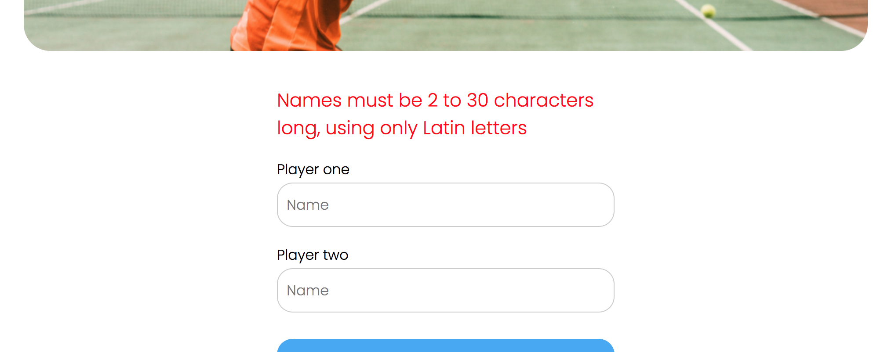
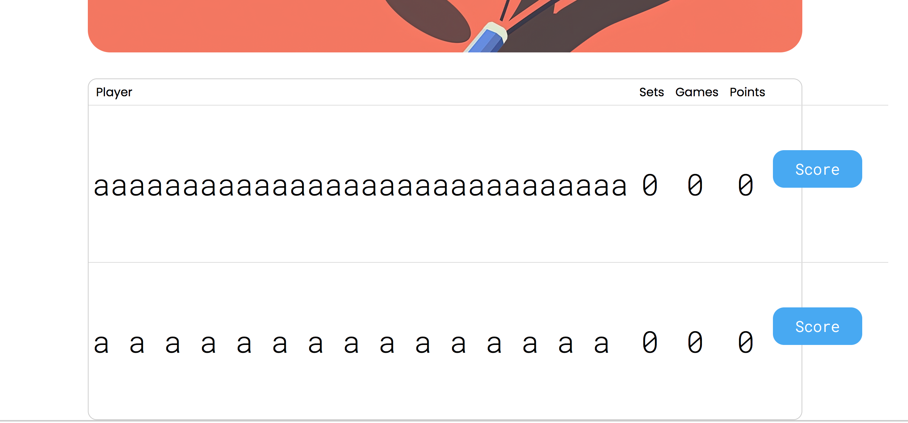
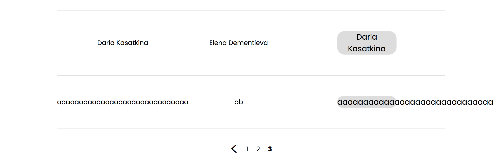
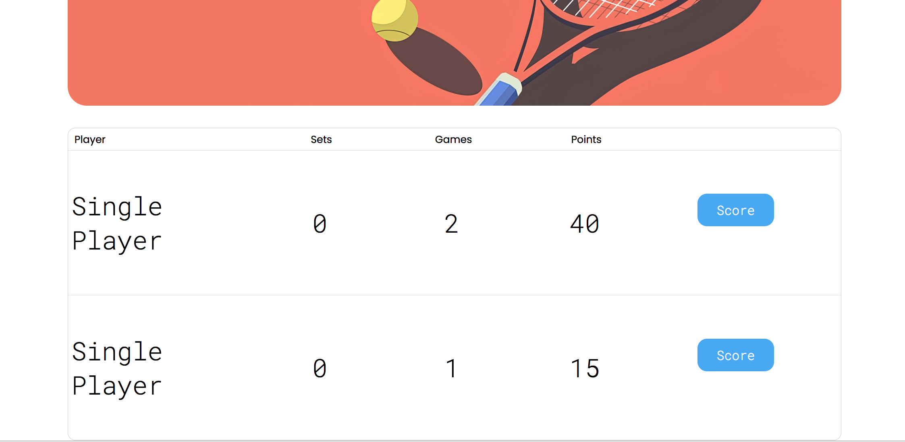
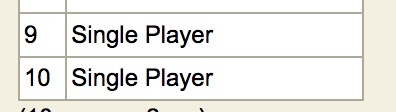
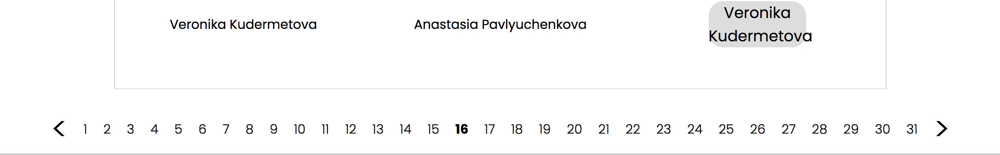

# Review на реализацию от [@tttraderrr](https://github.com/phoboy725/TennisScoreBoard) проекта [Табло теннисного матча](https://zhukovsd.github.io/java-backend-learning-course/projects/tennis-scoreboard/)

```text
1. Знаком ❗️ помечены критически важные замечания, а также места нарушения ТЗ.
2. Если ❗️ стоит перед заголовком, значит он относится ко всем пунктам этого раздела.
3. Замечания, указанные в пункте с именем пакета, относятся ко всем классам этого пакета или ко всем классам этого слоя.
4. Знаком 💡 помечены блоки, в которых содержится подсказка по реализации какого-то приёма или части кода. 
   Такие пункты всегда находятся в сворачиваемом блоке и разворачиваются по нажатию. 
   Перед их раскрытием стоит постараться придумать или поискать решение самостоятельно. 
```

## Функциональный обзор
- В поле ввода не сохраняется имя при ошибке — пользователю приходится набирать заново вместо того, чтобы просто исправить ошибку 
- При вводе максимально длинного имени без пробелов, кнопки `Score` съезжают за пределы разметки 
- Последний сыгранный матч отображается последним в списке на странице завершённых матчей — чтобы посмотреть его результат в таблице надо листать до последней страницы. Лучше, чтобы последний завершённый отображался первым в списке (на первой странице)
- Имя победителя выходит за пределы разметки, если оно имеет максимальную длину и записано без пробелов 
- Сейчас ограничения для имён слишком строгие — только латинские буквы и пробелы. Реальные имена и фамилии могут содержать дефисы и апострофы, а также использовать кириллицу. Стоит разрешить их использование.

## Model
- Название `entity` лучше подошло бы этому пакету, так как классы в нём — это сущности, связанные с БД (JPA Entity). А в пакет `model` можно будет поместить доменные модели.

### Player
- Если имя поля совпадает с названием колонки, то параметр name в аннотации `@Column` можно опустить: `@Column(name = "id")` -> `@Column`

- Можно добавить параметр `updatable = false` в `@Column` для поля ID в качестве дополнительной защиты целостности данных: `@Column(updatable = false)`

- ❗️Класс имеет публичные сеттеры для всех полей — `id` и `name`:
    - сеттер для `id` позволяет создать объект Player c установленным  `id`. Для полей, которые генерируются в БД, лучше не давать такую возможность, поэтому его стоит удалить.
    - сеттер для `name` позволяет изменить имя игрока, что нарушает инварианты (имя игрока должно быть неизменяемым после создания).

Решением будет не создавать сеттеры для полей и устанавливать данные один раз через конструктор.

<a id="forward-from-match-to-player-2"></a>
- Конструктор без аргументов объявлен как `public`, что позволяет создать "пустой", невалидный объект `Player`. Конструктор без аргументов требуется только для внутреннего использования JPA/Hibernate, поэтому стоит изменить уровень доступа на `protected`. &nbsp;[перейти к упоминанию в Match](#backward-from-player-to-match-2)

А для создания игрока вручную использовать:
```java
public Player(String name) {
    this.name = name;
}
```

<a id="forward-from-match-to-player-1"></a>
- Поле `id` имеет тип `int`, который имеет максимальное значение `~2.1` миллиарда. В высоконагруженных системах этот лимит может быть достигнут, поэтому обычно для первичных ключей используют `Long`. Лучше изменить тип поля `id` (и его геттера) на `Long`. &nbsp;[перейти к упоминанию в Match](#backward-from-player-to-match-1)

- Для поля `id` лучше использовать обёртку `Long`, вместо примитивного типа `long`. `Long` (обёртка) может быть `null` и для нового объекта поле `id` будет `null` до тех пор, пока Hibernate не присвоит ему значение после сохранения. А `long` (примитив) не может быть `null` и для нового, ещё не сохраненного объекта, поле `id` будет иметь значение по умолчанию `0`. Использование обертки `Long` является предпочтительным для генерируемых ID, потому что позволяет легко и надёжно определить, является ли сущность новой, просто проверив `if (id == null)`. С использованием примитива `0` может оказаться валидным значением ID (хотя и редко), что создаст путаницу.

- Сейчас ограничения для имён неоправданно строгие — только латинские буквы и пробелы (`regexp = "^[\\sa-zA-Z]+$"`). Реальные имена и фамилии могут содержать дефисы, апострофы или пробелы, а также использовать кириллицу, поэтому стоит ослабить регулярное выражение. Например до `"^[a-zA-Zа-яА-Я'\\-\\s]+$"`

- ❗️В аннотации `@Size` у сущности `Player` указан минимальный размер имени `min = 1`, в то время как в классе `PlayerNamesValidation` используется минимальное значение `2`:
```java
// в Player
@Size(min = 1, max = 30, message = "Name must be 1 - 30 characters long")

// в PlayerNamesValidation
private static final Pattern NAME_PATTERN = Pattern.compile("^[\\sa-zA-Z]{2,30}$");
```

Это создаёт неоднородность правил валидации — данные, которые пройдут проверку в одном месте, могут не пройти её в другом. При таком подходе целостность бизнес-правил нарушается, что может приводить к трудноуловимым багам.

Стоит унифицировать все правила валидации — выбрать одно значение (например, `min = 2`) и применить его везде: и в аннотации на сущности, и в классе-валидаторе.

<a id="forward-from-match-to-player-3"></a>
- Строковое представление из метода `toString()` начинается с символа переноса строки

```java
return "\nid ='" + id + '\'' +
        ", name ='" + name + '\'';
```

Форматирование вывода (добавление отступов, переносов строк) — это ответственность вызывающего кода, а не самого метода. Метод `toString()` должен возвращать чистое строковое представление объекта. Например то, которое генерируется для выбранных полей по умолчанию:

```java
@Override
public String toString() {
    return "Player{" +
           "id=" + id +
           ", name='" + name + '\'' +
           '}';
}
```
[перейти к упоминанию в Match](#backward-from-player-to-match-3)

### Match
- ❗️Слово `MATCH` (а также `MATCHES`) является зарезервированным ключевым словом в некоторых диалектах SQL (например, для оператора `MATCH ... AGAINST` в полнотекстовом поиске). Не стоит использовать зарезервированные слова в качестве имён таблиц.

[Использование зарезервированных слов в качестве названий в БД](#sql-keywords) <a id="back-from-sql-keywords"></a>

- Можно добавить ограничения, проверяющие, что игроки разные и победителем является один из участников матча <a id="forward-from-matchesdao"></a>

<div align="right">

[перейти к упоминанию в MatchesDao](#forward-from-match-to-matchesdao) </div>

<details>

<summary><b>💡 Например так 💡</b></summary>

---

```java
@Checks({
        @Check(constraints = "playerOne != playerTwo"),
        @Check(constraints = "winner = playerOne OR winner = playerTwo")
})
public class Match { 
    // ...
}
```

---

</details>

Это гарантирует целостность данных даже при прямом доступе к БД.

<a id="backward-from-player-to-match-1"></a>
- Для поля `id` лучше использовать `Long` по причинам, описанным в разделе [Player](#forward-from-match-to-player-1)

- Названия колонок имеет смысл писать в стиле snake_case — это часто является стандартом де-факто, а также при написании запросов (например, createNativeQuery) это будет визуально подчёркивать, что идёт обращение к колонке БД, а не полю сущности (как в JPQL запросах).

```java
// camelCase может запутать:
entityManager.createQuery("SELECT p.firstName, p.lastName FROM Player p", Player.class); // JPQL
entityManager.createNativeQuery("SELECT firstName, lastName FROM players", Player.class); // SQL

// snake_case отличие явно:
entityManager.createQuery("SELECT p.firstName, p.lastName FROM Player p", Player.class); // JPQL
entityManager.createNativeQuery("SELECT first_name, first_name FROM players", Player.class); // SQL
```

- ❗️Класс имеет публичные сеттеры для всех полей (кроме `id`), что нарушает инварианты — позволяет изменить состав игроков или победителя в завершённом матче. Решением будет не создавать сеттеры для полей и устанавливать данные один раз через конструктор.

- ❗️Для обязательных полей стоит добавить `optional = false` в `@ManyToOne` или `nullable = false` в `@JoinColumn`. Целостность данных должна обеспечиваться на всех уровнях: в приложении (валидация) и в БД (constraints). Отсутствие ограничений в БД означает, что данные могут быть испорчены из-за ошибок в приложении или при прямом доступе к БД.

Сейчас таблица матчей создаётся так:
```sqlite-sql
create table match (
    id integer generated by default as identity,
    playerOne integer,
    playerTwo integer,
    winner integer,
    primary key (id)
)
```

При `optional = false` или `nullable = false` — Hibernate генерирует `NOT NULL` ограничение в БД и делает проверку перед вставкой в БД (если значение поля null, то Hibernate не будет обращаться в БД для вставки и сам выбросит исключение PropertyValueException)

Это позволит избежать риска создания некорректных записей (например, матчи без игроков) в БД.

<a id="backward-from-player-to-match-2"></a>
- Конструктор без аргументов объявлен как `public` — стоит сделать его `protected` по причинам, описанным в разделе [Player](#forward-from-match-to-player-2)

<a id="backward-from-player-to-match-3"></a>
- Строковое представление из метода `toString()` лучше привести к стандартному виду и не начинать с переноса строки по причинам, описанным в разделе [Player](#forward-from-match-to-player-3)

## DTO
### PlayerRequestDto
- Сейчас в этом dto только одно поле, поэтому в текущей реализации можно напрямую использовать String в PlayerService, где сейчас используется PlayerRequestDto.

Вообще выбор использовать DTO является правильным, но чтобы сделать его более полезным можно добавить аннотации, задающие правила для валидации данных этого DTO. Будет логичным, если DTO станет отвечать за описание структуры и контракта данных, включая их ограничения.

Например, так:

```java
import jakarta.validation.constraints.NotBlank;
import jakarta.validation.constraints.Pattern;
import jakarta.validation.constraints.Size;

public record PlayerRequestDto(
        @NotBlank(message = "Player name must not be empty or blank")
        @Size(min = 2, max = 30, message = "Player name must be between 2 and 30 characters")
        @Pattern(regexp = "^[\sa-zA-Z]+$", message = "Player name must contains only Latin letters")
        String name
) {
}
```

Это позволит использовать фреймворк валидации (например, `hibernate-validator`) без необходимости писать кастомные валидаторы или аннотации.

### MatchCurrentState
- ❗️Сейчас класс нарушает принцип единственной ответственности (Single Responsibility Principle) и смешивает архитектурные роли DTO и доменной модели (анемичной в текущей реализации): он передаётся в слой представления (View), где из него извлекается информация, а также участвует в бизнес-логике в сервисах. Будет лучшим подходом разделить эту ответственность на DTO и модель: например OngoingMatch — внутренний, изменяемый доменный объект для вычислений и MatchDTO публичный, неизменяемый DTO для передачи данных контроллеру.

["Типы моделей" в веб-приложении](#model-types) <a id="back-from-model-types"></a>

- В качестве DTO будет уместным сделать класс record (как PlayerRequestDto) — это сделает его неизменяемым и избавит от шаблонного кода.

- Для DTO класса будет уместным добавить в название суффикс `DTO`. Это явно классифицирует его роль в архитектуре и сделает код более консистентным и понятным для других разработчиков.

- Сейчас у полей `isMatchFinished` и `isTieBreak`и их геттеров одинаковые имена:

```java
private boolean isMatchFinished = false;
private boolean isTieBreak = false;

public boolean isMatchFinished() {
    return isMatchFinished;
}

public boolean isTieBreak() {
    return isTieBreak;
}
```

Хорошей практикой является называть `boolean` поля как прилагательные или существительные без префикса `is` (например, `tiebreak` вместо `isTieBreak`). Это позволяет избежать путаницы с геттером `isTiebreak()` и делает код чище.

- Сейчас все поля, относящиеся к счету игрока (`playerOneSets`, `playerOneGames`, `playerOnePoints` и т.д.), дублируются для первого и второго игрока. Это признак того, что в классе отсутствует важная абстракция. Из-за этого класс становится большим и громоздким и нарушает принцип DRY (Don't Repeat Yourself). А также, если понадобится добавить новое поле к счету игрока (например, количество эйсов), придётся добавить два поля (`playerOneAces`, `playerTwoAces`) и два набора геттеров/сеттеров.

Все данные, относящиеся к счёту одного игрока, логически связаны между собой и можно сгруппировать их в отдельный класс.

Например такой:
```java
public record PlayerScoreDto(
    int id,
    int sets,
    int games,
    String points,
    List<Integer> setsResult
) {}
```

Тогда класс упростится до:
```java
public record MatchStateDto(
    PlayerScoreDto playerOneScore, // Вместо 5 полей - одно
    PlayerScoreDto playerTwoScore, // Вместо 5 полей - одно
    boolean isMatchFinished,
    boolean isTieBreak,
    Integer winnerId
) {}
```

> **DRY (Don't Repeat Yourself)** — принцип «Не повторяйся», направленный на снижение повторения кода и логики, так как изменения в повторяющихся участках требуют правок во многих местах, что увеличивает риск ошибок. Централизация логики делает код более поддерживаемым и надёжным.

- Методы `getPlayerOneSetsResultSafe()` и `getPlayerTwoSetsResultSafe()` содержат логику, относящуюся к слою представления. DTO должен быть простым носителем данных и не должен принимать решения о том, как эти данные будут отображаться (например, через дефис `-`). Стоит удалить эти методы и предоставлять "сырые" данные (`List<Integer>`), а логика их отображения должна находиться в JSP.

- ❗️Сеттеры для результатов сетов `setPlayerOneSetsResult()` и `setPlayerTwoSetsResult()` добавляют элемент в список, а не устанавливают его (сам список), что нарушает ожидания от метода с именем `set...`. В текущей реализации лучше было бы переименовать методы в `add...`.

- Непоследовательное использование примитивов и оберток: В классе смешаны `int` (`playerOneId`) и `Integer` (`winnerId`). Лучше выбрать один подход и для идентификаторов, которые могут отсутствовать, всегда использовать классы-обертки (`Integer`, `Long`).

- ❗️Класс имеет выраженные признаки анемичной модели — он представляет собой просто контейнер с данными, обладающий геттерами и сеттерами, но не содержащий никакой бизнес-логики. Вся логика подсчёта очков, определения победителя и т.д. вынесена во внешний сервис (`MatchScoreService`), который манипулирует этим объектом. Это нарушает принцип инкапсуляции в ООП, согласно которому данные и поведение, работающее с этими данными, должны быть инкапсулированы вместе (реализованы в одном классе), и способствует процедурному стилю программирования.

[Анемичная vs Богатая модель предметной области](#reach-anemic-model) <a id="back-from-reach-anemic-model"></a>

Чтобы это исправить стоит превратить `MatchCurrentState` (или создать новый класс) в "богатую" доменную модель, которая сама управляет своим состоянием.

<details>

<summary><b>💡 Вот упрощённый пример подобного класса 💡</b></summary>

---

```java
public class PlayerScore {
    private static final Point INITIAL_POINTS = Point.LOVE;
    private static final int VICTORY_TIEBREAK_POINTS = 7;
    private static final int VICTORY_SET_POINTS = 6;
    private static final int MIN_ADVANTAGE_TO_WIN = 2;
    private Point points;
    private int games = 0;
    private int sets = 0;
    private int tieBreakPoints = 0;

    public PlayerScore() {
        this.points = INITIAL_POINTS;
    }

    public void increment() {
        // логика добавления очков
    }

    public boolean hasAdvantage() {
        return points == Point.ADVANTAGE;
    }

    public String getPointsValue() {
        return points.value();
    }

    private void incrementGamePoints() {
        games++;
    }

    private void incrementSetPoints() {
        sets++;
    }

    private void incrementTieBreakPoints() {
        tieBreakPoints++;
    }

    private void resetPoints() {
        points = INITIAL_POINTS;
    }

    enum Point {
        LOVE("0"),
        FIFTEEN("15"),
        THIRTY("30"),
        FORTY("40"),
        ADVANTAGE("AD");

        private final String value;

        Point(String value) {
            this.value = value;
        }

        public Point next() {
            if (this == ADVANTAGE) {
                throw new IllegalStateException("Has no points after advantage.");
            }
            return values()[ordinal() + 1];
        }

        public String value() {
            return value;
        }
    }
}
```

При таком подходе от сеттеров стоит избавиться, чтобы состояние счёта управлялось только явно предусмотренными для этого методами. Это больше соответствовало бы ООП стилю и обязанности класса (в роли доменной модели). Также, эту часть логики было бы легче тестировать.

---

</details>

- ❗️Благодаря публичным сеттерам, объект `MatchCurrentState` можно перевести в любое, даже невалидное, состояние из любой точки приложения. Это делает всю систему хрупкой, так как целостность данных не гарантируется. Доменный объект всегда должен защищать свои инварианты (бизнес-правила, которые всегда должны быть истинными).

Как исправить:
- Удалить все публичные сеттеры.
- Все изменения состояния проводить только через публичные методы с бизнес-логикой (как `increment()` в примере выше).

- Поля `boolean isTieBreak` и `boolean isMatchFinished` отражают разные состояния матча. Для этой цели (если останется такая необходимость) лучше подойдёт перечисление, например такое:
```java
public enum MatchStage {
    REGULAR,
    TIEBREAK,
    FINISHED;
}
```

Использование отдельных `boolean` флагов вместо перечислений для представления взаимоисключающих состояний — плохая практика. Это не защищает от невалидных комбинаций, например, когда `isMatchFinished = true` и `isTieBreak = true` одновременно.

Enum делает код более выразительным и гарантирует, что матч будет находиться только в одном из допустимых состояний.

- ❗️Класс отвечает за хранение очков на всех этапах игрового процесса в матче, а также состояния игры — это слишком большая ответственность для одного класса и нарушает SRP (Single Responsibility Principle). Лучшим решением в этом направлении было бы, чтобы за счёт на каждом уровне отвечал отдельный класс. Такой подход больше соответствовал бы ООП-стилю и принципу единственной ответственности для каждого класса.

- Поля `String playerOnePoints` и `String playerTwoPoints` объявлены как String, хотя в них может быть только определённый набор значений. Поскольку класс предоставляет публичные сеттеры для этих полей сейчас в них можно установить любое невалидное значение без контроля.

Тип String для этих полей уместен для DTO, но в классе доменной модели вместо String здесь больше подойдёт перечисление (enum).

<details>

<summary><b>💡 Например такой 💡</b></summary>

---

```java
enum Point {
    LOVE,
    FIFTEEN,
    THIRTY,
    FORTY,
    ADVANTAGE;
}
```

---

</details>

Использование строк вместо перечислений делает код менее читаемым и более подверженным ошибкам.

- ❗️Текущая архитектура нарушает принцип "Tell, Don't Ask". Вместо того, чтобы говорить матчу "обработай очко", внешний код спрашивает у матча состояние и сам принимает решения. Проведение декомпозиции и реализация богатой модели исправит это.

> **Tell, Don't Ask (Говори, не спрашивай)** — принцип ООП, который призывает объекты к выполнению действий над своими собственными данными, а не к запросу этих данных для последующей обработки извне. Это помогает инкапсулировать поведение и данные внутри объекта, уменьшая связанность и делая систему более гибкой и расширяемой.

## Repositories

<div align="right">

[перейти к упоминанию в PlayerService](#citation-in-playerservice) </div>

- Имена пакетов в java пишут в единственном числе. Когда смотришь на набор классов в пакете, кажется естественным использовать множественное число, обобщая то, что в нём находится, но если посмотреть на декларацию пакета в классе и сравнить варианты, например: `*.validation.limits.annotations.MaxLength` и `*.validation.limit.annotation.MaxLength`, то название в единственном числе становится более логичным как полное имя конкретного класса.

- Пакет называется `repositories`, но классы в нём имеют суффиксы `...Dao`. Для единообразия в названиях лучше переименовать пакет в `dao` или классы в `...Repository`.

- ❗В текущей реализации классы DAO не имеют интерфейсов. Внедрение интерфейсов позволило бы легче подменять реализации, например, для тестирования (моки) или для будущих изменений.

- В текущей реализации методы сохранения сущностей `createPlayer(Player player)` и `saveFinishedMatch(Match match)` возвращают void. Это допустимо, но обычно в таких методах возвращают сохранённую сущность (особенно если у неё генерируется ID) или, по крайней мере, тот же объект. Это позволяет получить сгенерированный идентификатор или сохранённый объект более явно.

Например, в PlayerService в методе `createPlayerIfNotExists()` сейчас так:
```java
Player player = playerDao.getPlayerByName(playerName);
if (player == null) {
    // ...
    playerDao.createPlayer(player);
}
return player;
```

лучше читается так:
```java
public Player getOrCreatePlayerNew(String playerName) {
    Player foundPlayer = playerDao.findByName(playerName);
    if (foundPlayer != null) {
        return foundPlayer;
    }
    Player newPlayer = new Player(playerName);
    Player savedPlayer = playerDao.save(newPlayer);
    return savedPlayer; // или return playerDao.save(newPlayer);
}
```

### PlayerDao

<div align="right">

[перейти к упоминанию в MatchesDao](#forward-from-player-dao-1) </div>

- JPQL-запросы написаны прямо в методах в виде строковых литералов. Лучше вынести их в константы и дать понятные имена, это сделает код методов более читаемым.

- Текст запроса удобнее читать, когда он логично разбит на строки:

```sqlite-sql
SELECT p 
FROM Player p 
WHERE p.name = :name
```

- Части
```sqlite-sql
SELECT p 
FROM Player p
```
дублируются в нескольких запросах — можно вынести их в отдельные переменные
```java
private static final String SELECT_ALL_JPQL = """
        SELECT p
        FROM Player p
        """;
private static final String FILTER_BY_ID_JPQL = """
        WHERE p.id = :id
        """;
private static final String FILTER_BY_NAME_JPQL = """
        WHERE p.name = :name
        """;
private static final String FIND_BY_ID_JPQL = 
        SELECT_ALL_JPQL + 
        FILTER_BY_ID_JPQL;
private static final String FIND_BY_NAME_JPQL = 
        SELECT_ALL_JPQL + 
        FILTER_BY_NAME_JPQL;
```

- ❗️Новый EntityManager создаётся и закрывается в каждом методе, что может привести к тому, что несколько операций в рамках одного запроса будут использовать разные EntityManager. Это является безопасным с точки зрения предотвращения утечек ресурсов, однако, поскольку вызов `entityManagerFactory.createEntityManager()` — это относительно дорогая операция, создавать его в каждом методе — не самый эффективный подход.

Более производительным является паттерн Session-per-Request, где один `EntityManager` используется для всего HTTP-запроса, что сокращает накладные расходы на его создание. Затем `EntityManager` используется всеми сервисами и DAO, участвующими в обработке этого запроса и в конце запроса `EntityManager` закрывается.

- Методы `getPlayerById()` и `getPlayerByName()` можно переименовать в `findById()` и `findByName()` без потери смысла, а метод `createPlayer()` — в `save()`.

Названия `getPlayerById()`, `getPlayerByName()` и `createPlayer()` тоже понятны, но переименование в `findById`, `findByName` и `save()` сделает код более идиоматичным и понятным для разработчиков, знакомых со стандартными паттернами репозиториев.

- ❗В методах `getPlayerById()` и `getPlayerByName()` создается `EntityManager`, но он никогда не закрывается. <a id="playerdao-1"></a>

<div align="right">

[перейти к упоминанию в MatchesDao](#forward-from-player-dao-2) </div>

```java
public Player getPlayerById(Integer id) {
    EntityManager entityManager = entityManagerFactory.createEntityManager(); // EntityManager создан...
    List<Player> players = entityManager.createQuery("...", Player.class)
            // ...
            .getResultList();
    return players.isEmpty() ? null : players.get(0);
    // ... но не закрыт
}
```

`EntityManager` (и лежащая в его основе сессия Hibernate) удерживает соединение с базой данных из пула соединений. Если его не закрыть, соединение может не вернуться в пул. При достаточном количестве запросов пул исчерпается, и приложение перестанет отвечать на запросы к базе данных.

Необходимо гарантировать закрытие `EntityManager` после использования. Лучший способ — использовать конструкцию `try-with-resources`.
```java
public Player getPlayerById(Integer id) {
    // EntityManager реализует AutoCloseable, поэтому его можно использовать в try-with-resources
    try (EntityManager entityManager = entityManagerFactory.createEntityManager()) {
        List<Player> players = entityManager.createQuery("SELECT p FROM Player p WHERE p.id = :id", Player.class)
                .setParameter("id", id)
                .getResultList();
        return players.isEmpty() ? null : players.get(0);
    }
    // Здесь entityManager будет автоматически закрыт, даже если произойдет исключение
}
```
Такое же изменение необходимо внести и в `getPlayerByName()`.

Устранение утечек соединений гарантирует, что приложение сможет стабильно работать под нагрузкой.

- Для поиска игрока по уникальному полю (`id` или `name`) используется метод `getResultList()`. Вместо этого лучше использовать метод `getSingleResult()`. Он специально разработан для случаев, когда запрос должен вернуть ровно один результат. Он выбрасывает исключение `NoResultException`, если ничего не найдено, и `NonUniqueResultException`, если найдено больше одного результата.
```java
// В методе getPlayerById
try (EntityManager entityManager = entityManagerFactory.createEntityManager()) {
    return entityManager.createQuery("...", Player.class)
        .setParameter("id", id)
        .getSingleResult();
}
```
Такое же изменение необходимо внести и в `getPlayerByName()`.

При таком подходе код становится более строгим. Он "упадёт" с понятным исключением (`NonUniqueResultException`), если целостность данных будет нарушена, что поможет быстрее обнаружить и исправить ошибку.

- Для поиска игрока по ID можно использовать более короткий и предпочтительный способ получения по ID через EntityManager.

Сейчас в методе `getPlayerById()` так:
```java
List<Player> players = entityManager.createQuery("SELECT p FROM Player p WHERE p.id = :id", Player.class)
        .setParameter("id", id)
        .getResultList();
```

лучше так:
```java
Player player = entityManager.find(Player.class, id);
```

- ❗Методы `getPlayerById()` и `getPlayerByName()` возвращают `null`, если игрок не найден. Возвращение `null` — это источник потенциальных `NullPointerException` в вызывающем коде. Код, использующий DAO, вынужден постоянно помнить о необходимости проверок на `null`.

Лучше из методов возвращать `Optional<Player>`. `Optional` был введен в Java 8 как раз для того, чтобы явно и безопасно обрабатывать ситуации возможного отсутствия значения. При таком подходе, вызывающий код может использовать удобные методы `Optional` (`isPresent()`, `isEmpty()`, `ifPresent()`, `orElse()` и т.д.), что делает его более читаемым и менее подверженным ошибкам.

<details>

<summary><b>💡 Методы `getPlayerById()` и `getPlayerByName()` после всех изменений могут выглядеть так 💡</b></summary>

---

```java
public Optional<Player> findByName(String name) {
    try (EntityManager entityManager = entityManagerFactory.createEntityManager()) {
        Player player = entityManager.createQuery("...", Player.class)
                .setParameter("name", name)
                .getSingleResult();
        return Optional.of(player); // Возвращаем Optional с результатом
    } catch (NoResultException e) {
        return Optional.empty(); // Возвращаем пустой Optional, если ничего не найдено
    }
}

public Optional<Player> findById(Integer id) {
    try (EntityManager entityManager = entityManagerFactory.createEntityManager()) {
        Player player = entityManager.find(Player.class, id);
        return Optional.ofNullable(player); // ofNullable() сам обработает null, если find ничего не найдет
    }
}
```

---

</details>

- В методе `createPlayer()` перехватывается исключение `Exception`, а затем выбрасывается слишком общее `RuntimeException`:

```java
} catch (Exception e) {
    // ... rollback
    throw new RuntimeException(e);
}
```

Слой доступа к данным должен транслировать специфичные исключения нижележащего уровня (JPA/Hibernate) в свои, понятные для остального приложения.

Лучшим подходом будет использовать специализированное исключение, например `DatabaseException`, чтобы оборачивать в него исходное.

```java
// В методе createPlayer()
} catch (Exception e) {
    if (entityManager.getTransaction().isActive()) {
        entityManager.getTransaction().rollback();
    }
    // Оборачиваем в своё, сохраняя исходную причину
    throw new DatabaseException("Failed to create player: " + player.getName(), e);
}
```
Это позволит централизованно ловить `DatabaseException` и выводить пользователю осмысленное сообщение, при этом логируя полную причину (`e`).

- ❗Вызов `transaction.rollback()` стоит тоже обернуть в try, иначе при возникновении исключения в этом методе оно замаскирует оригинальное исключение из основного блока try. <a id="playerdao-2"></a>

<div align="right">

[перейти к упоминанию в MatchesDao](#forward-from-player-dao-3) </div>

Например, так:
```java
public Player save(Player player) {
    EntityTransaction transaction = null;
    try (EntityManager entityManager = entityManagerFactory.createEntityManager()) {
        transaction = entityManager.getTransaction();
        
        transaction.begin();
        entityManager.persist(player);
        transaction.commit();
        
        return player;
    } catch (Exception e) {
        safeRollback(transaction, e);
        throw new DatabaseException("Failed to save player", e);
    }
}

private void safeRollback(EntityTransaction transaction, Exception originalException) {
    if (transaction != null && transaction.isActive()) {
        try {
            transaction.rollback();
        } catch (Exception rollbackException) {
            originalException.addSuppressed(rollbackException);
        }
    }
}
```

### MatchesDao
- JPQL-запросы лучше вынести в константы с использованием текстовых блоков и дать понятные имена по аналогии с примерами из раздела [PlayerDao](#playerdao) <a id="forward-from-player-dao-1"></a>

- ❗Создавать и закрывать EntityManager лучше в блоках `try-with-resources`, как описано в разделе [PlayerDao](#playerdao-1) <a id="forward-from-player-dao-2"></a>

Это позволит гарантировать, что даже в случае ошибки при выполнении запроса (в методе `entityManager.createQuery()`) EntityManager будет корректно закрыт.

- ❗В метод `saveFinishedMatch()` стоит добавить безопасный откат транзакции, как описано в разделе [PlayerDao](#playerdao-2) <a id="forward-from-player-dao-3"></a>

- ❗Методы `countByPlayerName()` и `countAll()` реализованы путём полной загрузки всех сущностей из БД в `List` и последующего вызова `.size()`.

```java
public int countByPlayerName(String playerNameFilter) {
    EntityManager entityManager = entityManagerFactory.createEntityManager();
    List<Match> matches = entityManager.createQuery( /* ... */ ).
            getResultList();
    // ...
    return matches.size();
}

public int countAll() {
    EntityManager entityManager = entityManagerFactory.createEntityManager();
    List<Match> matches = entityManager.createQuery( /* ... */ ).
            getResultList();
    // ...
    return matches.size();
}
```
Это чрезвычайно неэффективно и на больших объемах данных приведёт к ошибке `OutOfMemoryError` и отказу всего приложения из-за попытки загрузить в память сотни тысяч объектов.

Для получения выборки матчей лучше всегда использовать запрос с пагинацией, а для того, чтобы узнать общее количество матчей в БД, следует сделать запрос, который вернёт `Long count` из самой базы.

- Тип возвращаемого значения методов `countByPlayerName()` и `countAll()` стоит изменить на `long`, чтобы избежать возможного переполнения `int`.

- Для визуального разделения запросов на строки лучше использовать текстовые блоки вместо конкатенации строк.

Сейчас так:
```java
"SELECT m FROM Match m "
"JOIN FETCH m.playerOne  " +
"JOIN FETCH m.playerTwo  " +
"JOIN FETCH m.winner"
```

лучше так:
```java
"""
SELECT m FROM Match m
JOIN FETCH m.playerOne
JOIN FETCH m.playerTwo
JOIN FETCH m.winner
"""
```

- ❗В методах `readAll` и `findByPlayerName` размер страницы жестко прописан в коде (`.setMaxResults(5)`). DAO не должен принимать решения о размере страницы. Его задача — предоставить данные с заданными смещением (`offset`) и лимитом (`limit`). Поэтому стоит передавать `limit` в качестве параметра метода.
```java
public List<Match> findAll(int offset, int limit) {
    try (EntityManager entityManager = entityManagerFactory.createEntityManager()) {
        return entityManager.createQuery(..., Match.class)
                .setFirstResult(offset)
                .setMaxResults(limit) // Используем параметр
                .getResultList();
    }
}
```

- Названия методов (`readAll()`, `saveFinishedMatch()`) не полностью соответствуют общепринятому подходу (а также неоднородны с названиями в PlayerDao, где используются префиксы `get...` и `create...`).

Стоит переименовать:
- `readAll` —> `findAll`
- `findByPlayerName` —> `findAllByPlayerName` (чтобы отличать от поиска одной сущности)
- `saveFinishedMatch` —> `save`

Использование стандартных имён (`find...`, `save`, `count...`) делает код мгновенно понятным для любого разработчика, знакомого с паттерном Repository.

- ❗️В методах `readAll()` и `findByPlayerName()` используются `.setFirstResult(offset)` и `.setMaxResults(5)`, но в запросе нет сортировки — не указывается `ORDER BY`. Это может привести к пропускам или дублированию записей между страницами потому что базы данных не гарантируют порядок возврата строк, если он не задан явно.

Стоит добавить сортировку — `ORDER BY` (например, по ID), в текст запросов:
```java
String jpql = """
    SELECT m FROM Match m
    ...
    ORDER BY m.id DESC
    """;
```
Сортировка по уникальному ключу является самым надёжным вариантом.

- ❗Тела методов `readAll()`, `findByPlayerName()`, `countByPlayerName()` и `countAll()` стоит обернуть в `try-catch`, в которых ловить возникающие исключения и оборачивать в специализированное `DatabaseException`.

- В запросах в методах `findByPlayerName()` и `countByPlayerName()` используется конструкция `LOWER(column) LIKE LOWER(:name)`. Это хороший способ сделать регистронезависимый поиск, совместимый с большинством СУБД. Поскольку в проекте используется H2, которая поддерживает оператор `ILIKE`, вместо функции `LOWER()` можно использовать ключевое слово `ILIKE` — тогда также будет выполняться регистронезависимый поиск.

Сейчас так:
```sqlite-sql
WHERE LOWER(m.playerOne.name) LIKE LOWER(:name)
```

можно так:
```sqlite-sql
WHERE m.playerOne.name ILIKE :name
```

Это сделает запрос немного чище и более читаемым. Однако, `ILIKE` не является частью стандарта JPA, поэтому такой запрос будет менее переносимым на другие СУБД (например, MySQL или Oracle).

- Проверка `OR LOWER(m.winner.name) LIKE LOWER(:name)` избыточна, так как имя победителя всегда совпадает с именем одного из игроков (что можно гарантировать и на уровне БД, добавив предложенные в разделе [Match](#forward-from-matchesdao) ограничения). <a id="forward-from-match-to-matchesdao"></a>

## Service
- ❗Сервисы зависят от конкретных реализаций DAO классов, а не от интерфейсов. Это нарушает Принцип инверсии зависимостей (Dependency Inversion Principle, DIP) и затрудняет тестирование. Решением будет создать интерфейсы для DAO классов и сделать сервисы зависимыми от интерфейсов.

### PlayerService
- Поле `PlayerDao playerDao` стоит сделать final. Компилятор Java заставляет инициализировать все final поля — если не присвоить ему значение в конструкторе (или при объявлении), то код просто не скомпилируется. Это является гарантией того, что объект PlayerService никогда не будет создан без своей ключевой зависимости — playerDao. Если забыть инициализировать final поле, происходит ошибка на этапе компиляции, а не NullPointerException во время работы приложения, когда какой-либо метод попытается вызвать `playerDao.someMethod()`.

- ❗Race condition в методе `getOrCreatePlayer()`: метод реализует логику "проверить наличие, затем создать" (`check-then-act`).
```java
public Player getOrCreatePlayer(String playerName) {
    // Сначала проверка
    Player player = playerDao.getPlayerByName(playerName); 
    if (player == null) {
        // Затем действие
        // ...
        playerDao.createPlayer(player);
    }
    return player;
}
```
В многопоточной среде (то есть на любом веб-сервере) этот подход не является потокобезопасным. Если два пользователя одновременно пытаются создать матч с новым игроком "Новак Джокович", то может произойти следующее:

Шаг 1: Поток 1 вызывает `playerDao.getPlayerByName("Новак Джокович")`. Ничего не находит, `player` равен `null`.

Шаг 2: Поток 2 в тот же самый момент времени вызывает `playerDao.getPlayerByName("Новак Джокович")`. Тоже ничего не находит, `player` равен `null`.

Шаг 3: Поток 1 входит в блок `if`, создает объект `Player` и вызывает `playerDao.createPlayer(player)`. Игрок успешно сохраняется в БД.

Шаг 4: Поток 2 также входит в блок `if` (поскольку для него `player` тоже был `null`), создает второй объект `Player` и пытается вызвать `playerDao.createPlayer(player)`.

Шаг 5: В результате база данных выбрасывает исключение `ConstraintViolationException`, так как игрок с таким именем уже существует. Это исключение не обрабатывается, и второй пользователь видит неинформативную страницу от томката с ошибкой `500 Internal Server Error`.

Вместо этого стоит сразу пытаться сохранить игрока и обрабатывать исключение от БД, если игрок уже существует.

- ❗Сервисный слой — это подходящее место для определения границ транзакций. Одна бизнес-операция ("получить или создать игрока") должна выполняться в рамках одной атомарной транзакции. Без этого невозможно гарантировать консистентность данных, что и приводит к ошибкам, вроде описанной выше гонки.

Имеет смысл обернуть логику метода `getOrCreatePlayer()` в транзакцию.

- ❗Статические методы можно использовать без экземпляра класса, что подсказывает уведомление `Static member 'com.tennis.mapper.CreatePlayerMapper.mapFrom(com.tennis.dto.PlayerRequestDto)' accessed via instance reference` на строке `CreatePlayerMapper.INSTANCE.mapFrom(playerRequestDto)`.

- Внутри метода `getOrCreatePlayer()` создаётся `PlayerRequestDto` только для того, чтобы немедленно передать его в статический маппер. Это лишний код — создаётся промежуточный объект, который не несёт никакой дополнительной пользы в данном контексте, так как вся необходимая информация — это `playerName`. Было бы хорошо — упростить код, создавая объект `Player` напрямую. И ещё лучше принимать `PlayerRequestDto` в качестве аргумента (а создавать в контроллере).

- Из метода `getOrCreatePlayer()` лучше возвращать тот экземпляр, который вернул репозиторий/DAO после операции сохранения, как было описано в разделе [Repositories](#repositories) <a id="citation-in-playerservice"></a>

### MatchService
- В методе `updateScore()` для получения `MatchScoreService` используется вызов `MatchScoreService.getInstance()`. Это делает `MatchService` жёстко связанным с конкретной реализацией `MatchScoreService` — нельзя легко подменить его на другую реализацию или mock-объект в тестах. Также зависимость от `MatchScoreService` не видна в конструкторе `MatchService` — это усложняет понимание того, от чего зависит класс.

Вместо этого `MatchScoreService` должен быть обычной зависимостью, которая внедряется через конструктор. Это устранит жёсткую связь, сделает зависимости явными и позволит легко тестировать `MatchService`, подменяя `MatchScoreService` мок-объектом. При таком подходе класс будет больше соответствовать принципу инверсии зависимостей (Dependency Inversion Principle, DIP).

- ❗Race condition в методе `updateScore()`: в методе присутствует уязвимость "проверь-потом-действуй" (check-then-act). Сначала код проверяет `!match.isMatchFinished()`, а затем выполняет логику подсчета очков.
  Один поток может пройти проверку `!match.isMatchFinished()`, но перед тем, как он успеет обновить счёт, другой поток может завершить этот же матч. В итоге первый поток будет пытаться обновить счёт уже завершенного матча, что может привести к некорректному состоянию или ошибкам.

Стоит сделать операцию обновления счёта атомарной. Поскольку состояние хранится в `ConcurrentHashMap`, хорошим подходом будет реализовать логику обработки выигранного очка в классах моделей (например, через паттерн Chain of responsibility) и выполнять её в методе `ConcurrentHashMap.compute()`, который гарантирует атомарное выполнение операции для одного ключа.

- Метод `finishMatch()` содержит проверки, после которых происходит "тихий" выход из метода:
```java
MatchCurrentState currentState = currentMatches.get(matchId);
if (currentState == null) {
    return;
}

if (!currentState.isMatchFinished() || currentState.getWinnerId() == null) {
    return;
}
```

"Тихое" завершение работы скрывает потенциальные ошибки в логике приложения. Если другой компонент вызывает `finishMatch()` для матча, который еще не готов к завершению, он не получит никакой обратной связи. Ошибка будет замаскирована, что сильно усложнит отладку. Вместо `return;` стоит выбрасывать исключение, явно сообщающее о некорректном состоянии. Так ошибки в логике будут проявляться сразу в виде исключений, что значительно ускоряет их обнаружение и исправление.

- ❗В методе `finishMatch()` для получения объектов игроков выполняются три запроса к базе данных: один для `playerOne`, один для `playerTwo` и еще один для `winner`. Это избыточная нагрузка на базу данных. Победителем матча (`winner`) может быть только один из двух игроков (`playerOne` или `playerTwo`), объекты которых уже были загружены. Делать третий запрос для получения тех же данных неэффективно.

После получения объектов `playerOne` и `playerTwo`, можно определить, кто из них победитель, сравнивая их ID с `winnerId`. Это уменьшит количество запросов к БД и, следовательно, снизит нагрузку и увеличит производительность.

- В методе `finishMatch()` объект `Match` создается с помощью конструктора по умолчанию, а затем его поля заполняются через сеттеры.
```java
Match match = new Match();
match.setPlayerOne(playerOne);
match.setPlayerTwo(playerTwo);
match.setWinner(winner);
```
Такой подход позволяет создать объект `Match` в невалидном, неполном состоянии. Лучшая практика — создавать объекты сразу в корректном, готовом к использованию состоянии через конструктор, принимающий все необходимые параметры.
```java
Match match = new Match(playerOne, playerTwo, winner);
```

- В методе `finishMatch()` происходит 4 запроса к БД, чтобы сохранить завершённый матч.
```java
public void finishMatch(UUID matchId) {
    // ...
    Player playerOne = playerDao.getPlayerById(currentState.getPlayerOneId()); // Запрос 1
    Player playerTwo = playerDao.getPlayerById(currentState.getPlayerTwoId()); // Запрос 2
    Player winner = playerDao.getPlayerById(currentState.getWinnerId());       // Запрос 3

    Match match = new Match();
    // ...
    matchesDao.saveFinishedMatch(match); // Запрос 4
    
    currentMatches.remove(matchId);
}
```
Стоит поискать решение, как сохранять матч с игроками в одном запросе — это снизит нагрузку на БД и увеличит производительность.

- ❗️Стоит реализовать управление транзакциями в слое сервисов, чтобы все обращения к БД в рамках одного запроса происходили в одной транзакции.

В текущей реализации метод `finishMatch()` выполняет несколько операций с базой данных (как уже сказано выше): три чтения из `playerDao` и одну запись в `matchesDao.saveFinishedMatch(match)`. Эти операции не обернуты в единую транзакцию.

Если после успешного чтения данных игроков произойдет сбой при записи матча в `matchesDao` (например, из-за проблем с соединением), система окажется в несогласованном состоянии. Логическая операция "завершить матч" не будет атомарной.

Сервисный слой — подходящее место для управления транзакциями, чтобы гарантировать, что вся бизнес-операция либо выполняется полностью, либо полностью откатывается.

- В методах `getMatches()` и `getTotalMatchesCount()` повторяется блок проверки `if (filterByPlayerName != null && !filterByPlayerName.trim().isEmpty())`.

Можно вынести проверку в отдельный метод с понятным названием:
```java
public List<Match> getMatches(String filterByPlayerName, int offset) {
    if (isPlayerFilterApplied(filterByPlayerName) {
        return matchesDao.findByPlayerName(filterByPlayerName, offset);
    }
    return matchesDao.readAll(offset);
}

public int getTotalMatchesCount(String filterByPlayerName) {
    if (isPlayerFilterApplied(filterByPlayerName) {
        return matchesDao.countByPlayerName(filterByPlayerName);
    }
    return matchesDao.countAll();
}

private boolean isPlayerFilterApplied(String filterByPlayerName) {
    return filterByPlayerName != null && !filterByPlayerName.isBlank();
}
```

- ❗Сейчас класс `MatchService` отвечает одновременно за две разные бизнес-задачи:
    - Управление текущими матчами: хранение матчей в памяти (`currentMatches`), создание новых, обновление счёта.
    - Получение истории матчей: предоставление доступа к завершённым матчам из базы данных (`getMatches`, `getTotalMatchesCount`).

Это нарушает Принцип единственной ответственности (SRP).

Решением будет разделить класс на два, каждый со своей чёткой зоной ответственности, например:
- `OngoingMatchService` — будет отвечать только за матчи в памяти
- `FinishedMatchService` — будет отвечать только за запросы к DAO

### MatchScoreService
- ❗Главная архитектурная проблема класса в том, что он содержит всю без исключения бизнес-логику по подсчёту очков, в то время как объект, чьё состояние он изменяет (`MatchCurrentState`), является просто "анемичным" контейнером данных с геттерами и сеттерами.

    - Сервис знает всё о внутреннем устройстве `MatchCurrentState` и любое изменение в `MatchCurrentState` потребует изменения сервиса.
    - Данные (в `MatchCurrentState`) и поведение (в `MatchScoreService`) разделены, хотя по сути они неразрывно связаны.
    - Чтобы протестировать логику подсчёта гейма, нужно создать экземпляр `MatchScoreService` и передать ему полностью сконфигурированный `MatchCurrentState`, что неудобно.

Это больше соответствует процедурному стилю программирования, а не ООП.

Решением будет реализовать всю бизнес-логику в "богатой" доменной модели (например, `OngoingMatch`). Сервис должен только вызывать ее высокоуровневые методы (в идеале — один метод, который запустит цепочку вычислений).

В таком духе:
```java
// "Богатая" доменная модель
public class OngoingMatch {
    private Score score;
    // ...
    public void addPointFor(int playerId) {
        // Вся логика подсчета очков, геймов, сетов инкапсулирована здесь
        this.score = score.incrementFor(playerId);
        // ...
    }
}

// "Тонкий" сервис
public class MatchScoreService {
    public void processPoint(OngoingMatch match, int winningPlayerId) {
        match.addPointFor(winningPlayerId); // Просто запускает у модели выполнение логики
    }
}
```

- ❗Класс предоставляет множество `public` методов, которые являются деталями реализации, а не законченными бизнес-операциями. Методы, которые используются только внутри класса и не должны быть частью публичного API (`countPoints()`, `countGames()`, `countDeuce()`, `countAdvantage()`, `incrementPoints()`, `incrementGames()`, `incrementSets()`, `checkAndFinishMatch()`, `saveSetsResults()`, `resetScore()`, `winGameAndResetPoints()`, `winSetAndResetGames()`, `countTieBreak()`) стоит делать private.

Удобство использования метода в тестах не является достаточной причиной, чтобы расширить его видимость.

Решение (для текущей реализации) — оставить только один публичный метод, который представляет собой полноценный use case. Все остальные методы сделать `private`.
```java
public class MatchScoreService {
    // Единственный публичный метод, который является точкой входа
    public void processPoint(MatchCurrentState match, int winningPlayerId) {
        if (match.isTieBreak()) {
            countTieBreak(match, winningPlayerId);
        } else {
            countPoints(match, winningPlayerId);
        }
    }
    
    // Все остальные методы сделать приватными
    private void countPoints() {}
    private void countGames() {}
    // ...
}
```

- ❗Метод `countPoints` представляет собой цепочку из `if-else if-else`, которая пытается реализовать машину состояний теннисного гейма.
```java
public void countPoints(MatchCurrentState match, int scoreButtonId) {
    int playerOnePoints = convertPointsFromTennis(match.getPlayerOnePoints());
    int playerTwoPoints = convertPointsFromTennis(match.getPlayerTwoPoints());
    if (playerOnePoints == 3 && playerTwoPoints == 3) {
        countDeuce(match, scoreButtonId);
    } else if (playerOnePoints == 3 && playerTwoPoints == 4) {
        countAdvantage(match, scoreButtonId, 2, 1);
    } else if (playerOnePoints == 4 && playerTwoPoints == 3) {
        countAdvantage(match, scoreButtonId, 1, 2);
    } else if ((playerOnePoints == 3 && scoreButtonId == 1) || (playerTwoPoints == 3 && scoreButtonId == 2)) {
        winGameAndResetPoints(match, scoreButtonId);
    } else {
        incrementPoints(match, scoreButtonId);
    }
}
```
Такой код очень сложно читать, отлаживать и изменять. Добавление нового состояния или правила превращается в поиск нужной ветки в череде запутанных условий.

Одним из вариантов более удачной реализации может быть применение паттерна проектирования "Состояние" (State):
- Создать интерфейс `GameState` с методом `addPoint()`.
- Создать классы-реализации: `RegularState`, `DeuceState`, `TieBreakState`.
- Доменный объект `OngoingMatch` будет хранить ссылку на текущий объект состояния.
- При вызове `OngoingMatch.addPoint()`, он делегирует вызов текущему объекту-состоянию. Объект-состояние выполняет логику и возвращает новый объект-состояние, в которое должен перейти матч.

При таком подходе добавление нового состояния сведётся к созданию нового класса, а не изменению существующей сложной логики.

Другими вариантами могут быть:
- Стратегия (Strategy): можно создать интерфейс `ScoringStrategy` и его реализации: `RegularPointStrategy`, `DeuceStrategy`, `TieBreakStrategy`. В отличие от паттерна "Состояние", здесь "контекст" (сервис) сам решает, какую стратегию выбрать в данный момент, основываясь на состоянии матча.
- Цепочка обязанностей (Chain of Responsibility): можно создать цепочку обработчиков (`TieBreakHandler` -> `DeuceHandler` -> `RegularHandler`). Каждый обработчик проверяет, применим ли он к текущей ситуации. Если да — он выполняет логику и останавливает цепочку. Если нет — передает управление следующему обработчику в цепи.

Все три паттерна (`State`, `Strategy`, `Chain of Responsibility`) являются подходящими объектно-ориентированными решениями для замены сложной условной логики.

- ❗Использование "магических" значений: класс использует `int` (1, 2) для идентификации игроков и `String` ("points", "games") для управления логикой.

При таком подходе легко допустить опечатку (`"point"` вместо `"points"`) или передать невалидное значение (например, `playerId = 3`), и компилятор этого не заметит.

Также, код `incrementGames(match, 1)` менее понятен, чем например `incrementGames(match, PlayerNumber.ONE)`.

Правильным подходом будет использовать перечисления `enum` для всех подобных значений.

```java
public enum PlayerNumber {
    ONE,
    TWO;
}

public enum ScoreType {
    POINTS,
    GAMES;
}
```

Тогда компилятор не позволит передать в метод невалидное значение. А также код станет более самодокументируемым — `enum`-ы делают код гораздо более понятным без необходимости комментариев.

- ❗Представление теннисных очков: логика преобразования числового счета в строковый ("1" -> "15", "4" -> "AD") разбросана по статическим коллекциям `tennisToInt` и `intToTennis`.

Данные и логика их представления разделены. Если понадобится добавить новое значение, придётся править обе коллекции. Это хрупко.

Решением будет инкапсулировать всё, что связано с теннисным счётом в гейме, в один `enum`.

```java
public enum TennisPoint {
    LOVE("0"),
    FIFTEEN("15"),
    THIRTY("30"),
    FORTY("40"),
    ADVANTAGE("AD");

    private final String displayValue;

    TennisPoint(String displayValue) {
        this.displayValue = displayValue;
    }

    public String getDisplayValue() {
        return displayValue;
    }

    public TennisPoint next() {
        // Логика перехода к следующему очку
        if (this == ADVANTAGE) { 
            throw new IllegalStateException(...); 
        }
        return values()[this.ordinal() + 1];
    }
}
```

Это создаст Единый источник правды — вся информация об очках (их названия, порядок) находится в одном месте. И сделает понимание и поддержку кода более простой и удобной.

- ❗Все публичные методы (`countPoints()`, `countGames()` и т.д.) принимают объект `MatchCurrentState` и модифицируют его по ссылке, что является побочным эффектом (side effect).

Это нарушает принцип Command-Query Separation (CQS), который гласит, что метод должен быть либо командой (выполняет действие, меняет состояние, ничего не возвращает), либо запросом (возвращает данные, ничего не меняет). Сейчас методы пытаются быть и тем, и другим: они выполняют расчёты и в то же время неявно меняют состояние переданного объекта. Вызывающий код не ожидает, что объект, который он передал в метод, внезапно изменится. Становится трудно отследить, какой именно из множества методов изменил состояние объекта, если это происходит неявно.

Лучшее решение — рефакторинг в сторону "богатой" доменной модели, где объект сам будет изменять своё состояние.

Если же оставаться в рамках текущей реализации, то методы могут возвращать новый, измененный объект, а не мутировать старый.

Сейчас так:
```java
// Вызывающий код
service.countPoints(matchState, 1);
// Здесь объект matchState изменен, но это не очевидно из вызова
```

Чуть лучше так (с неизменяемыми объектами):
```java
// Вызывающий код
MatchCurrentState newState = service.calculateNextState(matchState, 1);
// Явно получен новый объект состояния и можно решать, что с ним делать
```

- Потребность в комментариях в коде подчёркивает необходимость рефакторинга для упрощения логики.

Идеальный код — это самодокументируемый код, который настолько ясен и выразителен, что комментарии для объяснения того, что он делает, становятся излишними. Если приходится писать комментарий, чтобы объяснить сложный участок логики, это часто является "запахом" (code smell), указывающим на то, что этот участок можно и нужно улучшить.

- Блоки проверки со сложными условиями, например
```java
if ((playerOnePoints == 3 && scoreButtonId == 1) || (playerTwoPoints == 3 && scoreButtonId == 2))
```
Можно вынести в отдельные методы с понятными названиями:
```java
private boolean isGameWinningPoint(int scoreButtonId, int playerOnePoints, int playerTwoPoints) {
    return (playerOnePoints == 3 && scoreButtonId == 1) || (playerTwoPoints == 3 && scoreButtonId == 2);
}
```
Это даст коду большую читаемость: намерение кода становится очевидным из названия метода. Код начинает "говорить" на языке бизнес-логики ("если это очко выигрывает гейм"), а не на языке низкоуровневых сравнений, что делает его более понятным (даже если не знать, что значит число 3).

А также снизит сложность: основной метод, из которого извлекли эту логику, становится короче и проще для понимания. Сложное условие заменяется одним вызовом метода с понятным названием, что позволяет легче следить за общей логикой работы.

Также если подобная проверка понадобится в другом месте, можно будет повторно использовать уже готовый метод `isGameWinningPoint()`, а не копировать сложное логическое условие.

## Controller
- Сейчас в контролерах используется жёстко заданный путь для редиректа. Это может привести к проблемам, если приложение будет развернуто не в корневом контексте веб-сервера.

Лучше всегда использовать контекстный путь для редиректа.

Сейчас так:
```java
response.sendRedirect("/match-score?uuid=" + matchId);
```
лучше так:
```java
response.sendRedirect(request.getContextPath() + "/match-score?uuid=" + matchId);
```
Использование `request.getContextPath()` гарантирует, что URL для редиректа будет построен правильно, независимо от того, где развернуто приложение.

- Логику форварда и редиректа, которая повторяется в каждом классе, можно реализовать в общем контроллере

<details>

<summary><b>💡 Например в таком 💡</b></summary>

---

```java
public class BaseController {
    private static final String PATH_DELIMITER = "/";
    private static final String PARAMETER_PREFIX = "?";
    private static final String PARAMETER_EQUAL = "=";
    private static final String PARAMETER_DELIMITER = "&";
    private static final String JSP_SUB_PATH = "/WEB-INF" + PATH_DELIMITER;
    private static final String JSP_EXTENSION = ".jsp";

    protected void forwardTo(
            String pageName,
            HttpServletRequest request,
            HttpServletResponse response
    ) throws ServletException, IOException {

        request.getRequestDispatcher(JSP_SUB_PATH + pageName + JSP_EXTENSION)
                .forward(request, response);
    }

    protected void redirectTo(
            String subPath,
            Map<String, ?> requestParameters,
            HttpServletRequest request,
            HttpServletResponse response
    ) throws IOException {

        String parameters = buildParameters(requestParameters);
        response.sendRedirect(request.getContextPath() + PATH_DELIMITER + subPath + parameters);
    }

    private String buildParameters(Map<String, ?> requestParameters) {
        if (requestParameters.isEmpty()) {
            return "";
        }

        return PARAMETER_PREFIX +
               requestParameters.entrySet().stream()
                       .filter(this::isValidEntry)
                       .map(this::buildParameter)
                       .collect(Collectors.joining(PARAMETER_DELIMITER));
    }

    private boolean isValidEntry(Map.Entry<String, ?> entry) {
        return isNotEmpty(entry.getKey()) && isNotEmpty(entry.getValue());
    }

    private boolean isNotEmpty(Object object) {
        return object != null && !object.toString().isBlank();
    }

    private String buildParameter(Map.Entry<String, ?> parameterEntry) {
        String encodedKey = encodeForUrl(parameterEntry.getKey());
        String encodedValue = encodeForUrl(parameterEntry.getValue().toString());

        return encodedKey + PARAMETER_EQUAL + encodedValue;
    }

    private String encodeForUrl(String raw) {
        return URLEncoder.encode(raw, StandardCharsets.UTF_8);
    }
}
```

После чего каждый контроллер может наследоваться от BaseController, хранить название JSP страницы в виде константы и передавать его в родительский метод.

---

</details>

Другой вариант — расширить класс `JSPUtil`, добавив в него соответствующие статические методы.


### NewMatchController
<div align="right">

[перейти к упоминанию в MatchScoreController](#forward-from-matchscorecontroller-1) </div>

<div align="right">

[перейти к упоминанию в FinishedMatchesController](#forward-from-finishedmatchescontroller-1) </div>

- ❗Зависимости `PlayerDao` и `MatchService` получаются через статические методы `ApplicationContext` напрямую в месте объявления. Вместо этого стоит внедрять зависимости через `init()` метод сервлета. Это будет соответствовать принципу инверсии зависимостей (Dependency Inversion).
```java
private PlayerDao playerDao;
private MatchService matchService;

@Override
public void init() throws ServletException {
    this.playerDao = ApplicationContext.playerDao();
    this.matchService = ApplicationContext.matchService();
}
```

- ❗Контроллер напрямую работает с `PlayerDao` (имеет экземпляр его реализации) — компонентом слоя доступа к данным (DAO/Repository), что смешивает слои архитектуры.

Решением будет убрать из контроллера зависимость `PlayerDao`.

- ❗Поле `PlayerDao playerDao` используется только для создания объекта PlayerService. Контроллер не должен знать о слое DAO и иметь его экземпляры. Вместо этого лучше создавать PlayerService один раз на старте приложения, передавая в него все необходимые зависимости, а в контроллере внедрять экземпляр PlayerService в поле через метод `init()`.
```java
private PlayerService playerService;
private MatchService matchService;

@Override
public void init() throws ServletException {
    this.playerService = ApplicationContext.playerService();
    this.matchService = ApplicationContext.matchService();
}
```

- ❗️В методе `doPost()` создаётся новый объект PlayerService — это избыточное создание объектов и порождает лишние накладные расходы. PlayerService по своей природе является stateless (не хранит состояние) и может быть переиспользован для всех запросов, поэтому стоит сделать PlayerService полем класса.

- ❗Метод `doPost` выполняет несколько последовательных шагов бизнес-логики: валидация, получение или создание одного игрока, получение или создание второго игрока, создание матча. Это является оркестрацией (координацией) работы разных сервисов и логических блоков и соответствует анти-паттерну "Толстый контроллер".

[**Архитектурный анти-паттерн: "Толстый контроллер" (Fat Controller)**](#fat-controller) <a id="back-from-fat-controller"></a>

Идеальная картина для контроллера: вызывать только один метод и только у одного сервиса, отдать ему данные из запроса и получить объект для передачи в слой представления (JSP).

То есть например, создать DTO из имён игроков, передать его сервису и получить от него ID cозданного матча. А создание игроков и матча пусть бы происходило в слое сервисов. Это сделало бы более строгим следование принципу единственной ответственности (Single Responsibility Principle, SRP) в этом классе.

- ❗В методе `doPost()` валидация выполняется с помощью статического метода `PlayerNamesValidation.check()`, который возвращает строку с сообщением об ошибке или `null`.

```java
String checkPlayersNames = PlayerNamesValidation.check(playerOneName, playerTwoName);

if (checkPlayersNames == null) {
    // ...
} else {
    // ...
}
```

Управление потоком выполнения через `null` не является хорошей практикой. Проверки на `null` делают код менее читаемым и могут приводить к `NullPointerException`, если кто-то забудет о проверке.

Стоит перевести валидатор на выбрасывание исключений, вместо возврата `null` и обрабатывать их соответствующим образом. Использование исключений для обработки ошибочных сценариев является более надёжной практикой в Java.

- ❗В методе `doPost` находится большой закомментированный блок кода.
```java
//        if (playerOneName.equalsIgnoreCase(playerTwoName)) {
//            request.setAttribute("errorMessage", "Имена игроков должны быть уникальными");
//            request.getRequestDispatcher(JSPUtil.getJspPatch("new-match")).forward(request, response);
//        } else {
//            PlayerService playerService = new PlayerService(playerDao);
//            Player playerOne = playerService.getOrCreatePlayer(playerOneName);
//            Player playerTwo = playerService.getOrCreatePlayer(playerTwoName);
//            String matchId = matchService.createMatch(playerOne.getId(), playerTwo.getId()).toString();
//            response.sendRedirect("/match-score?uuid=" + matchId);
//        }
```
Это мешает чтению и пониманию актуальной логики. Другой разработчик может потратить время, пытаясь понять, почему этот код закомментирован и не является ли он важным. А также другой разработчик может (по ошибке или посчитав его необходимым) раскомментировать этот код и нарушить работу приложения, причину чего впоследствии может оказаться сложно отследить.

- Сейчас при создании нового матча в поле ввода имени игрока не сохраняется имя при ошибке — пользователю приходится набирать его заново вместо того, чтобы просто исправить ошибку. Это происходит потому, что когда валидация имён игроков не проходит, контроллер возвращает пользователя на страницу `new-match.jsp`, передавая только сообщение об ошибке. Введенные пользователем имена при этом теряются.

Чтобы это исправить, нужно перед форвардом на страницу ошибки добавить в `request` атрибуты с введенными именами. После этого в `new-match.jsp` нужно будет использовать эти атрибуты, чтобы задать значения полям `input`. Это улучшит пользовательский опыт.

- Имена параметров запроса `request.getParameter("playerOne")`, `request.getParameter("playerTwo")` и другие строковые литералы можно вынести в константы. Это улучшает читаемость, упрощает рефакторинг при необходимости (если имя параметра нужно будет изменить, это делается в одном месте) и предотвращает ошибки из-за опечаток.

### MatchScoreController
- Пункты про:
    - ❗вндрение зависимостей `PlayerDao` и `MatchService`
    - ❗анти-паттерн "Толстый контроллер"
    - ❗управление потоком выполнения через `null`
    - вынос магических переменных в константы

которые описаны в разделе [NewMatchController](#newmatchcontroller) актуальны и для этого контроллера. <a id="forward-from-matchscorecontroller-1"></a>

- ❗Сейчас логика обработки выигранного очка происходит в методе `doGet()`, тогда как по ТЗ обрабатывать её должен метод `doPost()`. Также GET-запросы по определению должны быть идемпотентными*, то есть не изменять состояние на сервере. Обновление страницы не должно приводить к повторному изменению данных. Сейчас же каждый GET-запрос на страницу завершённого матча будет пытаться завершить его снова.

- ❗В методе `doGet()` после форварда на страницу победителя вызывается метод `matchService.finishMatch(matchId)`.
```java
} else {
    // ...
    request.getRequestDispatcher(JSPUtil.getJspPatch("match-winner")).forward(request, response);
    matchService.finishMatch(matchId);
}
```
Поток выполнения не прерывается после форварда или редиректа и логика, выполняемая после `forward()`, может вести себя непредсказуемо. Любое изменение состояния должно происходить до отправки ответа пользователю. Поэтому для прерывания логики надо использовать явный `return` или размещать логику до перенаправления.

- Вместо того, чтобы передавать данные о матче по частям <a id="anchor-in-matchscorecontroller-1"></a>

<div align="right">

[перейти к упоминанию в FinishedMatchesController](#forward-from-finishedmatchescontroller-2) </div>

```java
request.setAttribute("matchId", matchId.toString());
request.setAttribute("currentMatch", currentMatch);
request.setAttribute("playerOneName", playerOneName);
request.setAttribute("playerTwoName", playerTwoName);
```

можно создать специальный объект, например такой:
```java
public record MatchDto(
        UUID id,
        String firstPlayerName,
        String secondPlayerName,
        ScoreDto firstPlayerScore,
        ScoreDto secondPlayerScore,
        String winnerName,
        boolean finished
) {
}
```

и передавать в JSP его в таком духе:
```java
MatchDto matchDto = ongoingMatchesService.updateMatchScore(matchRequestDto);
request.setAttribute(MATCH_FINISHED, matchDto);
```

Это сделает код контроллера более лаконичным. А также, если для страницы понадобится новое поле, то не придётся менять контроллер (добавлять новый атрибут).

- Логику метода `doGet()` можно упростить с помощью раннего возврата.

Конструкции вроде:
```java
public void someMethod() {
    if (isCondition()) {
        executeOneLogic();
    } else {
        executeAnotherLogic();
    }
}
```

можно упростить до:
```java
public void someMethod() {
    if (isCondition()) {
        executeOneLogic();
        return;
    }
    executeAnotherLogic();
}
```

Сейчас так:
```java
if (!currentMatch.isMatchFinished()) {
    // ... логика для текущего матча
    request.getRequestDispatcher(JSPUtil.getJspPatch("match-score")).forward(request, response);
} else {
    // ... логика для завершенного матча
    request.getRequestDispatcher(JSPUtil.getJspPatch("match-winner")).forward(request, response);
    matchService.finishMatch(matchId);
}
```

лучше так:
```java
if (currentMatch.isMatchFinished()) {
    String winnerName = playerDao.getPlayerById(currentMatch.getWinnerId()).getName();
    request.setAttribute("winnerName", winnerName);
    // ... другие атрибуты для страницы победителя
    request.getRequestDispatcher(JSPUtil.getJspPatch("match-winner")).forward(request, response);
    return; // Ранний выход
}

// Основная логика для продолжающегося матча
request.setAttribute("matchId", matchId.toString());
// ... другие атрибуты для страницы счёта
request.getRequestDispatcher(JSPUtil.getJspPatch("match-score")).forward(request, response);
```

Это уменьшает вложенность и делает основной поток выполнения более линейным и лёгким для понимания.

- ❗Сейчас при обработке каждого очка происходит два запроса в БД:
```sqlite-sql
-- String playerOneName = playerDao.getPlayerById(currentMatch.getPlayerOneId()).getName(); в MatchScoreController
[Hibernate] 
    select
        p1_0.id,
        p1_0.name 
    from
        player p1_0 
    where
        p1_0.id=?

-- String playerTwoName = playerDao.getPlayerById(currentMatch.getPlayerOneId()).getName(); в MatchScoreController
[Hibernate] 
    select
        p1_0.id,
        p1_0.name 
    from
        player p1_0 
    where
        p1_0.id=?
```

Поскольку текущие матчи хранятся в памяти приложения, эти запросы избыточны.

Стоит от них избавиться и получать имена игроков из текущего матча (что должно стать возможным после реализации класса текущего матча в виде богатой доменной модели).

- ❗При создании нового матча и его сохранении после завершения происходит большое количество запросов в БД:

<details>

<summary><b>Вот так</b></summary>

---

#### 6 запросов при создании матча с двумя новыми игроками:
```sqlite-sql
-- Player player = playerDao.getPlayerByName(playerName); в PlayerService
[Hibernate] 
    select
        p1_0.id,
        p1_0.name 
    from
        player p1_0 
    where
        p1_0.name=?

-- playerDao.createPlayer(player); в PlayerService
[Hibernate] 
    insert 
    into
        player
        (name, id) 
    values
        (?, default)

-- Player player = playerDao.getPlayerByName(playerName); в PlayerService
[Hibernate] 
    select
        p1_0.id,
        p1_0.name 
    from
        player p1_0 
    where
        p1_0.name=?

-- playerDao.createPlayer(player); в PlayerService
[Hibernate] 
    insert 
    into
        player
        (name, id) 
    values
        (?, default)

-- String playerOneName = playerDao.getPlayerById(currentMatch.getPlayerOneId()).getName(); в MatchScoreController
[Hibernate] 
    select
        p1_0.id,
        p1_0.name 
    from
        player p1_0 
    where
        p1_0.id=?

-- String playerTwoName = playerDao.getPlayerById(currentMatch.getPlayerOneId()).getName(); в MatchScoreController
[Hibernate] 
    select
        p1_0.id,
        p1_0.name 
    from
        player p1_0 
    where
        p1_0.id=?
```

#### Запросы при сохранении этого матча:
```sqlite-sql
-- String playerOneName = playerDao.getPlayerById(currentMatch.getPlayerOneId()).getName(); в MatchScoreController
[Hibernate] 
    select
        p1_0.id,
        p1_0.name 
    from
        player p1_0 
    where
        p1_0.id=?

-- String playerTwoName = playerDao.getPlayerById(currentMatch.getPlayerOneId()).getName(); в MatchScoreController
[Hibernate] 
    select
        p1_0.id,
        p1_0.name 
    from
        player p1_0 
    where
        p1_0.id=?

-- String winnerName = playerDao.getPlayerById(currentMatch.getPlayerOneId()).getName(); в MatchScoreController
[Hibernate] 
    select
        p1_0.id,
        p1_0.name 
    from
        player p1_0 
    where
        p1_0.id=?

-- Player playerOne = playerDao.getPlayerById(currentState.getPlayerOneId()); в MatchService
[Hibernate] 
    select
        p1_0.id,
        p1_0.name 
    from
        player p1_0 
    where
        p1_0.id=?

-- Player playerTwo = playerDao.getPlayerById(currentState.getPlayerOneId()); в MatchService
[Hibernate] 
    select
        p1_0.id,
        p1_0.name 
    from
        player p1_0 
    where
        p1_0.id=?

-- Player winner = playerDao.getPlayerById(currentState.getPlayerOneId()); в MatchService
[Hibernate] 
    select
        p1_0.id,
        p1_0.name 
    from
        player p1_0 
    where
        p1_0.id=?

-- matchesDao.saveFinishedMatch(match); в MatchService
[Hibernate] 
    insert 
    into
        match
        (playerOne, playerTwo, winner, id) 
    values
        (?, ?, ?, default)
```

---

#### 5 запросов при создании матча с одним новым игроком:
```sqlite-sql
-- Player player = playerDao.getPlayerByName(playerName); в PlayerService
[Hibernate] 
    select
        p1_0.id,
        p1_0.name 
    from
        player p1_0 
    where
        p1_0.name=?

-- Player player = playerDao.getPlayerByName(playerName); в PlayerService
[Hibernate] 
    select
        p1_0.id,
        p1_0.name 
    from
        player p1_0 
    where
        p1_0.name=?

-- playerDao.createPlayer(player); в PlayerService
[Hibernate] 
    insert 
    into
        player
        (name, id) 
    values
        (?, default)

-- String playerOneName = playerDao.getPlayerById(currentMatch.getPlayerOneId()).getName(); в MatchScoreController
[Hibernate] 
    select
        p1_0.id,
        p1_0.name 
    from
        player p1_0 
    where
        p1_0.id=?

-- String playerTwoName = playerDao.getPlayerById(currentMatch.getPlayerOneId()).getName(); в MatchScoreController
[Hibernate] 
    select
        p1_0.id,
        p1_0.name 
    from
        player p1_0 
    where
        p1_0.id=?
```

#### Запросы при сохранении этого матча:
```sqlite-sql
-- String playerOneName = playerDao.getPlayerById(currentMatch.getPlayerOneId()).getName(); в MatchScoreController
[Hibernate] 
    select
        p1_0.id,
        p1_0.name 
    from
        player p1_0 
    where
        p1_0.id=?

-- String playerTwoName = playerDao.getPlayerById(currentMatch.getPlayerOneId()).getName(); в MatchScoreController
[Hibernate] 
    select
        p1_0.id,
        p1_0.name 
    from
        player p1_0 
    where
        p1_0.id=?

-- String winnerName = playerDao.getPlayerById(currentMatch.getPlayerOneId()).getName(); в MatchScoreController
[Hibernate] 
    select
        p1_0.id,
        p1_0.name 
    from
        player p1_0 
    where
        p1_0.id=?

-- Player playerOne = playerDao.getPlayerById(currentState.getPlayerOneId()); в MatchService
[Hibernate] 
    select
        p1_0.id,
        p1_0.name 
    from
        player p1_0 
    where
        p1_0.id=?

-- Player playerTwo = playerDao.getPlayerById(currentState.getPlayerOneId()); в MatchService
[Hibernate] 
    select
        p1_0.id,
        p1_0.name 
    from
        player p1_0 
    where
        p1_0.id=?

-- Player winner = playerDao.getPlayerById(currentState.getPlayerOneId()); в MatchService
[Hibernate] 
    select
        p1_0.id,
        p1_0.name 
    from
        player p1_0 
    where
        p1_0.id=?

-- matchesDao.saveFinishedMatch(match); в MatchService
[Hibernate] 
    insert 
    into
        match
        (playerOne, playerTwo, winner, id) 
    values
        (?, ?, ?, default)
```

---

#### 4 запроса при создании матча без новых игроков:
```sqlite-sql
-- Player player = playerDao.getPlayerByName(playerName); в PlayerService
[Hibernate] 
    select
        p1_0.id,
        p1_0.name 
    from
        player p1_0 
    where
        p1_0.name=?

-- Player player = playerDao.getPlayerByName(playerName); в PlayerService
[Hibernate] 
    select
        p1_0.id,
        p1_0.name 
    from
        player p1_0 
    where
        p1_0.name=?

-- String playerOneName = playerDao.getPlayerById(currentMatch.getPlayerOneId()).getName(); в MatchScoreController
[Hibernate] 
    select
        p1_0.id,
        p1_0.name 
    from
        player p1_0 
    where
        p1_0.id=?

-- String playerTwoName = playerDao.getPlayerById(currentMatch.getPlayerOneId()).getName(); в MatchScoreController
[Hibernate] 
    select
        p1_0.id,
        p1_0.name 
    from
        player p1_0 
    where
        p1_0.id=?
```

#### Запросы при сохранении этого матча:
```sqlite-sql
-- String playerOneName = playerDao.getPlayerById(currentMatch.getPlayerOneId()).getName(); в MatchScoreController
[Hibernate] 
    select
        p1_0.id,
        p1_0.name 
    from
        player p1_0 
    where
        p1_0.id=?

-- String playerTwoName = playerDao.getPlayerById(currentMatch.getPlayerOneId()).getName(); в MatchScoreController
[Hibernate] 
    select
        p1_0.id,
        p1_0.name 
    from
        player p1_0 
    where
        p1_0.id=?

-- String winnerName = playerDao.getPlayerById(currentMatch.getPlayerOneId()).getName(); в MatchScoreController
[Hibernate] 
    select
        p1_0.id,
        p1_0.name 
    from
        player p1_0 
    where
        p1_0.id=?

-- Player playerOne = playerDao.getPlayerById(currentState.getPlayerOneId()); в MatchService
[Hibernate] 
    select
        p1_0.id,
        p1_0.name 
    from
        player p1_0 
    where
        p1_0.id=?

-- Player playerTwo = playerDao.getPlayerById(currentState.getPlayerOneId()); в MatchService
[Hibernate] 
    select
        p1_0.id,
        p1_0.name 
    from
        player p1_0 
    where
        p1_0.id=?

-- Player winner = playerDao.getPlayerById(currentState.getPlayerOneId()); в MatchService
[Hibernate] 
    select
        p1_0.id,
        p1_0.name 
    from
        player p1_0 
    where
        p1_0.id=?

-- matchesDao.saveFinishedMatch(match); в MatchService
[Hibernate] 
    insert 
    into
        match
        (playerOne, playerTwo, winner, id) 
    values
        (?, ?, ?, default)
```

---

</details>

При таком подходе, при обработке одного матча от начала до завершения будет выполнено **минимум 107 запросов в БД**:
- 4 запроса на создание матча без новых игроков
- 96 запросов на обработку очков (2 запроса при обработке каждого из 48 очков — минимум для победы одного из игроков)
- 7 запросов при сохранении завершённого матча

Это создаёт чрезмерно избыточную нагрузку на БД и снижает производительность.

Стоит пересмотреть логику этой части приложения и избавиться от такого количества лишних запросов.

Идеальной картиной будет делать только один запрос в БД при сохранении уже завершённого матча, в котором одновременно сохранятся игроки, если их ещё нет в БД, а также сам матч.

Достаточно хорошим для этого проекта решением будет при завершении матча сохранять отдельно игроков и отдельно матч (3-5 запросов).

### FinishedMatchesController
- Константы обычно объявляют первыми в классе (размещают в самом верху класса). Поэтому можно переместить `private static final int PAGE_SIZE = 5;` в начало класса.

- Пункты про:
    - ❗внедрение зависимости `MatchService`
    - ❗анти-паттерн "Толстый контроллер" (бизнес-логика пагинации в контроллере)
    - вынос магических переменных в константы

которые описаны в разделе [NewMatchController](#newmatchcontroller) актуальны и для этого контроллера. <a id="forward-from-finishedmatchescontroller-1"></a>

- Логику парсинга номера страницы
```java
if (pageParam != null && !pageParam.isEmpty()) {
    try {
        currentPage = Integer.parseInt(pageParam);
        if (currentPage < 1) {
            currentPage = 1;
        }
    } catch (NumberFormatException e) {
        currentPage = 1;
    }
}
```

можно вынести в отдельный метод:
```java
private static int getCurrentPage(String pageParam) {
    int currentPage = 1;

    if (pageParam != null && !pageParam.isEmpty()) {
        try {
            currentPage = Integer.parseInt(pageParam);
            if (currentPage < 1) {
                currentPage = 1;
            }
        } catch (NumberFormatException e) {
            currentPage = 1;
        }
    }
    return currentPage;
}
```

и немного упростить:
```java
private static int getCurrentPage(String pageParam) {
    if (pageParam != null && !pageParam.isBlank()) {
        try {
            return Math.max(Integer.parseInt(pageParam), 1);
        } catch (NumberFormatException ignored) {
        }
    }
    return 1;
}
```

- Имя переменной `noOfPages` (и соответствующего атрибута) может быть не до конца очевидным. Оно означает "number of pages" (количество страниц), поэтому можно переименовать его в `totalPages`.

- В пределах одного метода используются параметры в разных стилях (camelCase, snake_case)
```java
request.setAttribute("currentPage", currentPage);
request.setAttribute("noOfPages", noOfPages);
request.setAttribute("filter_by_player_name", filterByPlayerName != null ? filterByPlayerName : "");
```
Стоит выбрать один стиль и придерживаться его во всём приложении для консистентности. `camelCase` является стандартом для именования в Java, поэтому его использование и для параметров URL может быть логичным выбором для единообразия.

- Пункт про передачу данных о матче по частям, который описан в разделе [MatchScoreController](#anchor-in-matchscorecontroller-1) актуален и для этого контроллера. <a id="forward-from-finishedmatchescontroller-2"></a>

- ❗️Контроллер передаёт в слой представления JPA сущности (`List<Match> matches`). Передача Entity объектов в JSP не является хорошей практикой. Это может привести к проблемам производительности (например, ленивая загрузка) и безопасности (например, случайная передача чувствительных данных). Кроме того, это связывает слой представления с моделью данных. Лучше использовать DTO (Data Transfer Object) для передачи данных в представление. DTO позволяют контролировать, какие именно данные передаются.

## Validation
### PlayerNamesValidation
- ❗Метод `check()` возвращает `String` при первой же найденной ошибке или `null` в случае успеха.

Использование `null` как маркера успеха не является хорошим подходом. Он заставляет вызывающий код выполнять проверки `if (result != null)`, что загромождает логику и может привести к `NullPointerException`, если проверку забудут.

Также если пользователь допустил несколько ошибок (например, оставил одно поле пустым, а во втором использовал цифры), он увидит только первую ошибку. После её исправления он увидит вторую и тд. Пользователь вынужден отправлять форму несколько раз, чтобы исправить все ошибки. Это ухудшает пользовательский опыт.

Решением может быть: переделать метод так, чтобы он возвращал список всех найденных ошибок. Пустой список будет означать, что валидация прошла успешно.

```java
public List<String> check(String playerOneName, String playerTwoName) {
    List<String> errors = new ArrayList<>();

    if (playerOneName == null || playerOneName.trim().isEmpty()) {
        errors.add("Имя первого игрока не может быть пустым.");
    }
    // другие проверки, каждая из которых добавляет свою ошибку в список

    if (playerOneName.equalsIgnoreCase(playerTwoName)) {
        errors.add("Имена игроков должны быть уникальными.");
    }

    return errors; // Возвращает список ошибок
}
```

Так пользователь сразу увидит все ошибки и может исправить их за один раз. А вызывающий код проверяет `if (errors.isEmpty())`, что понятнее и безопаснее, чем `if (result == null)`.

- Неинформативные и дублирующиеся сообщения об ошибках. На несколько разных типов ошибок (поле равно `null`, поле пустое, поле не соответствует паттерну) возвращается одно и то же сообщение: `"Names must be 2 to 30 characters long, using only Latin letters"`.

Каждое правило валидации должно иметь свое собственное, уникальное и понятное сообщение об ошибке, иначе пользователь не понимает, что именно он сделал не так. Если он ввел имя `"Player1"`, он видит сообщение про длину и латинские буквы, хотя его ошибка — в наличии цифры — это сбивает с толку.

- Все правила валидации (регулярное выражение, тексты ошибок) жёстко закодированы в виде строк и чисел прямо внутри метода `check()`. Если потребуется изменить минимальную длину имени с 2 на 3, придётся искать это значение в коде регулярного выражения. Если нужно изменить текст ошибки, придется искать его в нескольких `return`.

Стоит вынести все "магические" значения в константы с понятными именами.

- ❗Код сначала проверяет имена на пустоту с помощью `trim().isEmpty()`, но затем для проверки по регулярному выражению использует оригинальные строки, которые могут содержать пробелы в начале или в конце. Имена `"Single Player"` и `"Single Player  "` будут считаться разными, но визуально их будет не отличить:

ни на странице текущего матча



ни на странице завершённых матчей


ни в БД



Чтобы этого избежать, стоит выполнить `trim()` один раз в самом начале и использовать результат для всех последующих проверок.

Например так:
```java
public static String check(String playerOneName, String playerTwoName) {
    if (playerOneName == null || playerTwoName == null) {
        return "Names must not be null";
    }

    String nameOneTrimmed = playerOneName.trim();
    String nameTwoTrimmed = playerTwoName.trim();

    if (nameOneTrimmed.isEmpty() || nameTwoTrimmed.isEmpty()) {
        return "Names must not be empty";
    }
    if (nameOneTrimmed.equalsIgnoreCase(nameTwoTrimmed)) {
        return "Names must be different";
    }
    if (!NAME_PATTERN.matcher(nameOneTrimmed).matches() || !NAME_PATTERN.matcher(nameTwoTrimmed).matches()) {
        return "Names must be 2 to 30 characters long, using only Latin letters";
    }
    return null;
}
```

- Регулярное выражение 
```regexp
^[\sa-zA-Z]{2,30}$
```

разрешает только латинские буквы и пробелы. Реальные имена людей могут содержать дефисы (Jean-Claude), апострофы (O'Neill) и буквы других алфавитов (в этом проекте достаточно добавить кириллицу).

Стоит ослабить регулярное выражение, добавив в него необходимые символы. Например до 
```regexp
^[a-zA-Zа-яА-Я'\\-\\s]{2,30}$
```

## Util
### JSPUtil
- Опечатки:
    - в названии константы: `String JSP_PATCH` —> `String JSP_PATH`
    - в названии метода: `getJspPatch()` —> `getJspPath()`

- Константе `String JSP_PATCH` можно дать более подходящее имя — `String JSP_PATH_TEMPLATE`, поскольку она хранит не просто путь, а шаблон для форматирования пути.

### RequestParamUtil
- ❗Нарушение Принципа единственной ответственности (SRP):

Методы этого класса выполняют две совершенно разные задачи:
- Парсинг: извлекают строковый параметр и преобразуют его в нужный тип (`UUID`, `Integer`).
- Отправка HTTP-ответа: в случае ошибки они напрямую работают с `HttpServletResponse` и вызывают `response.sendError()`.

Утилитный класс для парсинга не должен ничего знать о HTTP-ответах. Его единственная ответственность — парсить данные. В случае ошибки он должен выбрасывать исключение, а не отправлять ответ. Ответственность за перехват этого исключения и формирование корректного HTTP-ответа лежит на более высоком уровне — на контроллере или, ещё лучше, на централизованном фильтре-обработчике исключений.

- ❗В случае ошибки (если параметр отсутствует или имеет неверный формат) методы возвращают `null`.

Это заставляет вызывающий код (контроллеры) писать шаблонные и небезопасные проверки после каждого вызова.

```java
// В контроллере
UUID matchId = RequestParamUtil.getRequiredUuid(request, response, "uuid");
if (matchId == null) {
    return;
}
```

Если разработчик забудет эту проверку, он получит `NullPointerException` позже, и будет сложно понять, где именно возникла проблема.

Вместо этого лучше использовать исключения. Метод должен гарантировать, что если он завершился нормально, то он вернул валидное значение. Если валидное значение получить нельзя — он должен бросить понятное исключение.

```java
// В контроллере
try {
    UUID matchId = RequestParamUtil.getRequiredUuid(request, "uuid");
    // логика, если matchId не null
    matchService.updateScore(matchId, ...);
} catch (MissingParameterException | InvalidParameterException e) {
    // Обработка ошибки неверного запроса
    response.sendError(HttpServletResponse.SC_BAD_REQUEST, e.getMessage());
}
```

- Дублирующуюся логику:
```java
String value = request.getParameter(paramName);
if (value == null) {
    response.sendError(HttpServletResponse.SC_BAD_REQUEST,
            "Missing " + paramName);
    return null; // лучше не возвращать null
}
```

можно вынести в отдельный метод (сразу учтём предложенные выше рекомендации):
```java
private static String getRequiredParameter(HttpServletRequest request, String paramName) {
    String value = request.getParameter(paramName);
    if (value == null || value.isBlank()) {
        throw new MissingParameterException("Missing " + paramName);
    }
    return value;
}
```
Это избавит класс от нарушения принципа DRY (Don't Repeat Yourself).

## Mapper
- ❗Вся полезная работа маппера в текущей реализации сводится к одной строке: `new Player(object.name())`.

Создание отдельного интерфейса `Mapper` и класса-реализации `CreatePlayerMapper` для такой тривиальной операции является примером излишнего усложнения (over-engineering). Это добавляет в проект два файла, которые по сути не несут никакой ценности, кроме обертки над вызовом конструктора. Это усложняет навигацию по коду и его понимание.

В текущей реализации стоит удалить классы `CreatePlayerMapper` и `Mapper` и выполнять преобразование напрямую в том месте, где оно необходимо (в `PlayerService`).

### Mapper
- В интерфейсе используются имена generic-типов `F` и `T`: `Mapper<F, T>`.

```java
public interface Mapper<F, T> {
    T mapFrom(F object);
}
```
Хотя `F` (From) и `T` (To) интуитивно понятны, стоит переименовать аргумент метода: `T mapFrom(F from);`.

Или использовать более стандартные обозначения: `R mapFrom(T type);`.

- Метод `mapFrom()` можно переименовать в `map()` без потери смысла.

- ❗Интерфейс является мёртвым кодом — CreatePlayerMapper (и никакой другой класс) не реализует этот интерфейс. Поэтому его можно удалить.

### CreatePlayerMapper
- ❗Противоречивое использование паттерна Singleton: класс объявлен как `enum` с одним экземпляром `INSTANCE`, что является надёжным способом реализации паттерна Singleton в Java. Однако, единственный метод в этом классе, `mapFrom`, объявлен как `static`.
```java
public enum CreatePlayerMapper {
    INSTANCE;

    public static Player mapFrom(PlayerRequestDto object) {
        return new Player(object.name());
    }
}
```

Это смешивает два разных подхода:
- `static` метод принадлежит самому классу, а не его экземпляру и может вызываться как `CreatePlayerMapper.mapFrom()`. Это соответствует утилитному классу.
- Экземпляр `INSTANCE` гарантировано существует в единственном числе. Это соответствует паттерну синглтон.

Стоит выбрать один из двух вариантов:

#### 1. Реализовать Singleton

Сделать метод `mapFrom()` методом экземпляра (убрать `static`):
```java
public enum CreatePlayerMapper {
    INSTANCE;

    public Player mapFrom(PlayerRequestDto object) {
        return new Player(object.name());
    }
}
```
и использовать через `INSTANCE`:
```java
CreatePlayerMapper.INSTANCE.mapFrom(dto);
```

#### 2. Реализовать утилитный класс

Сделать класс `final` и с приватным конструктором, чтобы запретить его инстанцирование.
```java
public final class CreatePlayerMapper {
    private CreatePlayerMapper() {
    }

    public static Player mapFrom(PlayerRequestDto object) {
        return new Player(object.name());
    }
}
```
и использовать метод напрямую:
```java
CreatePlayerMapper.mapFrom(dto);
```

- Метод `mapFrom` напрямую вызывает `object.name()`, не проверяя, является ли сам `object` равным `null`. Если в этот метод будет передан `null`, приложение упадет с `NullPointerException`.

Любой публичный метод, особенно утилитный, должен быть защищён от некорректного ввода, поэтому стоит добавить проверку на `null` в начало метода.

## Config
### ApplicationContext
- ❗EntityManagerFactory не закрывается при остановке приложения. `EntityManagerFactory` — это "тяжеловесный" ресурс, который управляет пулом соединений с БД. При остановке или перезагрузке веб-приложения метод `entityManagerFactory.close()` не вызывается. Это может привести к утечке ресурсов и некорректному завершению работы приложения.

Стоит реализовать ApplicationContext в виде ServletContextListener и
- в методе `contextInitialized(ServletContextEvent sce)` создавать `EntityManagerFactory`
- в методе `contextDestroyed(ServletContextEvent sce)` вызывать `entityManagerFactory.close()`
```java
@WebListener
public class AppContextListener implements ServletContextListener {
    private EntityManagerFactory entityManagerFactory;
          
    @Override
    public void contextInitialized(ServletContextEvent sce) {
        this.entityManagerFactory = Persistence.createEntityManagerFactory("Tennis");
        // ...
    }

    @Override
    public void contextDestroyed(ServletContextEvent sce) {
        if (entityManagerFactory != null && entityManagerFactory.isOpen()) {
          entityManagerFactory.close();
        }
    }
}
```

- Сейчас класс реализует паттерн Service Locator, причём в его наименее гибкой форме — через статические методы.

<details>

<summary><b>💡 Можно реализовать контекст приложения более гибко 💡</b></summary>

---

```java
public class ApplicationContext {
    private final Map<Class<?>, Object> beans = new ConcurrentHashMap<>();

    protected ApplicationContext(EntityManagerFactory entityManagerFactory) {
        initializeBeans(entityManagerFactory);
    }

    public <T> T getBean(Class<T> beanClass) {
        if (!beans.containsKey(beanClass)) {
            throw new BeanNotFoundException("Bean not found for: " + beanClass);
        }

        return beanClass.cast(beans.get(beanClass));
    }

    public <T> void registerBean(Class<T> beanClass, T beanInstance) {
        beans.put(beanClass, beanInstance);
    }

    public void shutdown() {
        beans.clear();
    }

    private void initializeBeans(EntityManagerFactory entityManagerFactory) {
        PlayerDao playerDao = new PlayerDao(entityManagerFactory);
        MatchesDao matchesDao = new MatchesDao(entityManagerFactory);

        PlayerService playerService = new PlayerService(playerDao);
        registerBean(PlayerService.class, playerService);

        MatchService matchService = new MatchService(matchesDao, playerDao);
        registerBean(MatchService.class, matchService);

        MatchScoreService matchScoreService = new MatchScoreService();
        registerBean(MatchScoreService.class, matchScoreService);

        // регистрация других компонентов
    }
}

@WebListener
public class AppInitializer implements ServletContextListener {
  private EntityManagerFactory entityManagerFactory;

  @Override
  public void contextInitialized(ServletContextEvent sce) {
    entityManagerFactory = Persistence.createEntityManagerFactory("Tennis");
    ApplicationContext applicationContext = new ApplicationContext(entityManagerFactory);
    sce.getServletContext().setAttribute(ApplicationContext.class.getSimpleName(), applicationContext);
  }

  @Override
  public void contextDestroyed(ServletContextEvent sce) {
    ApplicationContext applicationContext = (ApplicationContext) sce.getServletContext().getAttribute(ApplicationContext.class.getSimpleName());
    applicationContext.shutdown();

    if (entityManagerFactory != null && entityManagerFactory.isOpen()) {
      entityManagerFactory.close();
    }
  }
}
```

Также стоит создать интерфейсы для всех DAO и сервисов и хранить и возвращать зависимости по типу их интерфейса.

При таком подходе:
1. При старте приложения `AppInitializer` создает `EntityManagerFactory`.
2. Затем он создает один-единственный экземпляр `ApplicationContext`, передавая ему в конструктор все необходимые зависимости (`EntityManagerFactory`).
3. Этот экземпляр `ApplicationContext` сохраняется в `ServletContext`.
4. Любой другой компонент (например, контроллер) может получить доступ к этому экземпляру через `servletContext.getAttribute()`.

Такой подход соблюдает принцип единственной ответственности (Single Responsibility Principle, SRP) и чётко разделяет ответственности:
- `AppInitializer`: Отвечает за "сборку" всего приложения и является точкой входа, которая знает, как создать и связать все основные компоненты.
- `ApplicationContext`: Отвечает за хранение бинов и инкапсулирует логику их создания (`initializeBeans()`).

---

</details>

## JSP
- `index.html` можно тоже сделать JSP-cтраницей

- Чтобы приложение корректно работало при развётывании по любому пути стоит динамически формировать путь с помощью `${pageContext.request.contextPath}` во всех ссылках.

Сейчас так:
```html
<a class="nav-link" href="/matches">Matches</a>
```

лучше так:
```html
<a class="nav-link" href="${pageContext.request.contextPath}/matches">Matches</a>
```

Ссылки внутри веб-приложения должны быть контекстно-зависимыми и динамически учитывать путь, по которому развернуто приложение.

- Как и из java кода, комментарии из JSP стоит удалять после завершения разработки.

- ❗В пагинации на странице `matches.jsp` отображаются все страницы, что будет плохо выглядеть при большом количестве страниц.



Лучше сделать отображение текущей и +- 2 страниц вокруг неё.

## Pom.xml
- Отсутствует централизованное управление версиями через `<properties>` — версии зависимостей и версия Java жестко закодированы по всему файлу.

В текущей реализации проблем с этим быть не должно, но лучше вынести все версии в специальный блок `<properties>`:
```xml
<properties>
    <java.version>21</java.version>
    <maven.compiler.source>${java.version}</maven.compiler.source>
    <maven.compiler.target>${java.version}</maven.compiler.target>
    <h2.version>2.4.240</h2.version>
    <junit.jupiter.version>5.10.3</junit.jupiter.version>
    <!--  версии других зависимостей -->
</properties>
```

- ❗В версии `<version>2.1.214</version>` зависимости `com.h2database` обнаружена уязвимость, поэтому стоит использовать более свежую версию `<version>2.4.240</version>`.

- ❗В зависимостях присутствует `junit:junit:3.8.1` одновременно с `org.junit.jupiter:junit-jupiter` (JUnit 5).

```xml
<dependency>
  <groupId>junit</groupId>
  <artifactId>junit</artifactId>
  <version>3.8.1</version>
  <scope>test</scope>
</dependency>

<!--...-->

<dependency>
  <groupId>org.junit.jupiter</groupId>
  <artifactId>junit-jupiter</artifactId>
  <version>5.10.3</version>
  <scope>test</scope>
</dependency>
```
Их одновременное присутствие может вызвать конфликты (классы с одинаковыми именами в разных пакетах, разные версии junit.jar в classpath, Maven может использовать неправильную версию для выполнения тестов) и запутать разработчиков и сборочные инструменты. А также по ТЗ для тестов должна использоваться JUnit 5, поэтому стоит удалить зависимость `junit:junit:3.8.1`.

## Tests
### MatchScoreServiceTest
- ❗В классе всего 6 тестов, которые не обеспечивают полное покрытие основной бизнес-логики. Текущий набор тестов покрывает несколько важных сценариев (гейм-пойнт, начало тай-брейка), но упускает множество других обычных и граничных случаев в логике подсчёта очков. Стоит добавить тесты для недостающих сценариев.

## В целом по проекту
- Местами в некоторых классах немного не хватает форматирования, а также встречаются лишние пустые строки. Перед `git commit` можно нажимать (`cmd + alt + l` в Idea на mac os)

- ❗️В проекте отсутствуют интерфейсы для ключевых компонентов (репозитории и сервисы), что приводит к нарушению принципа инверсии зависимостей (Dependency Inversion). Было бы правильным — выделить интерфейсы для сервисов и репозиториев и внедрять зависимости через них. Также выделение интерфейсов помогает сделать названия и сигнатуры методов более понятными.

- Неоднородность в управлении экземплярами объектов ключевых компонентов: одни создаются в ApplicationContext, другие реализованы как синглтоны. Лучше выбрать один подход, например все компонентны создавать один раз на старте приложения и помещать в контекст.

- ❗️Не все исключения от Hibernate и БД (а также некоторые другие) обрабатываются должным образом, поэтому, при любой такой ошибке во время работы приложения, пользователь видит страницу с неинформативным сообщением. Следует использовать специализированные исключения, чтобы оборачивать в них возникающие ошибки и убедиться, что они обрабатываются в фильтре (или другом предусмотренном месте), чтобы улучшить пользовательский опыт, доступно информируя о том, что пошло не так.


## Другое
- Чтобы визуально протестировать пагинацию на странице списка матчей надо вручную завести много матчей. И ещё больше — чтобы протестировать пагинацию при фильтрации по имени игрока. Поэтому было бы хорошо добавлять при старте приложения (или деплое) нужное количество матчей в БД.

- ❗️Учётные данные из `persistence.xml`
```xml
<property name="jakarta.persistence.jdbc.user" value="sa"/>
<property name="jakarta.persistence.jdbc.password" value=""/>
```
не должны попадать в github

- папка `.idea` не нужна в репозитории github

## Плюсы
- работающая бизнес-логика
- работающая во всех случаях пагинация
- отдельная страница для отображения победителя
- детали счёта (история по сетам) после завершения матча
- работает фильтрация матчей по части имени игрока
- добавлены тестовые данные в БД при деплое
- страницы JSP лежат в `/WEB-INF`
- чёткое разделение на слои (Servlet -> Service -> Repository)
- довольно хорошо читаемое разделение кода на методы
- логичное разделение классов проекта по пакетам
- использование транзакций при работе с БД
- отсутствует проблема N+1 в запросах к БД
- реализация контекста приложения
- используется ConcurrentHashMap для хранения текущих матчей
- используются мапперы
- используются валидаторы
- наличие тестов
- стабильный деплой приложения

## Может быть полезным
- Посмотреть, записи стримов по декомпозиции в ООП (наиболее полезным для этого проекта может оказаться стрим по игре Орёл и решка)
- Детально изучить недостатки возвращения null из методов, а также использования null в качестве управления потоком выполнения
- Для более удобного чтения SQL запросов в консоли, которые генерирует Hibernate, можно добавить в `persistence.xml` настройки:
```xml
<property name="hibernate.format_sql" value="true"/>
<property name="hibernate.highlight_sql" value="true"/>
```
- Посмотреть, что такое ServletContextListener
- Посмотреть, что такое Hibernate Validator
- Посмотреть, что такое MapStruct
- Посмотреть, что такое Lombok
- Посмотреть лучшие практики использования DTO
- Для удобного запуска проекта из Idea CE во время разработки можно настроить плагины Smart Tomcat или Jetty (для Maven проекта)/Gretty (для Gradle)
- Почитать главы, которые покажутся актуальными, из книги "Рефакторинг" Мартина Фаулера

## Сноски

<details>

<summary><b>Использование зарезервированных слов в качестве названий в БД</b></summary>

---

### Использование зарезервированных слов в качестве названий в БД <a id="sql-keywords"></a>

<div align="right">

[вернуться назад](#back-from-sql-keywords) </div>

Использование зарезервированного слова (например, `USER`, `ORDER`, `GROUP`) в качестве названия таблицы в базе данных — это плохая практика, которая может привести к ряду проблем.

Вот основные из них:

### 1. Синтаксические ошибки

Это самая главная и частая проблема. SQL-парсер видит зарезервированное слово и ожидает определённой синтаксической конструкции, а не названия таблицы.

**Пример:**
При попытке получить все записи из таблицы с названием `ORDER`.
```sql
SELECT * FROM ORDER;
```
этот запрос, скорее всего, вызовет ошибку, потому что `ORDER` — это ключевое слово для `ORDER BY` (сортировка). Парсер будет ожидать после него `BY` и не поймёт, что `ORDER` — это название таблицы.

### 2. Необходимость экранирования (Quoting)

Чтобы обойти синтаксические ошибки, придётся постоянно заключать название таблицы в специальные кавычки, которые зависят от конкретной СУБД:

* **MySQL / MariaDB:** обратные кавычки (`` ` ``)
    ```sql
    SELECT * FROM `ORDER`;
    ```
* **PostgreSQL / Стандарт SQL:** двойные кавычки (`" "`)
    ```sql
    SELECT * FROM "ORDER";
    ```
* **SQL Server:** квадратные скобки (`[ ]`)
    ```sql
    SELECT * FROM [ORDER];
    ```

### 3. Снижение читаемости и усложнение кода

Из-за необходимости постоянного экранирования код становится менее читаемым. Разработчики могут легко забыть поставить кавычки, что приведёт к ошибкам, на поиск которых уйдёт время.

### 4. Проблемы с ORM и другими инструментами

Инструменты, которые автоматически генерируют SQL-запросы (например, Hibernate, JPA, SQLAlchemy и другие ORM), а также различные GUI-клиенты и утилиты для миграции, могут не справиться с такими названиями. Они могут не знать, что `ORDER` нужно экранировать, и будут генерировать нерабочий SQL-код. Это потребует дополнительной конфигурации или ручного вмешательства.

### 5. Потеря переносимости

Ключевые слова могут отличаться в разных СУБД. Слово, которое не зарезервировано в одной системе, может быть зарезервировано в другой. Если команда сменит СУБД, проект с такими названиями таблиц потребует значительной доработки.

---

**Лучшая практика:**

**Никогда не использовать зарезервированные слова для названий таблиц, столбцов и других объектов в БД.**

Всегда проверять список зарезервированных слов для основных СУБД. Чтобы избежать случайных совпадений, можно придерживаться соглашений об именовании, например:
* Использовать префиксы: `tbl_order`.
* Использовать множественное число (если слово во множественном числе не зарезервировано): `orders` (слово `orders` не зарезервировано).
* Добавлять суффиксы: `order_data`.

---

</details>

<details>

<summary><b>Анемичная vs Богатая модель предметной области</b></summary>

---

### Анемичная vs Богатая модель предметной области <a id="reach-anemic-model"></a>

<div align="right">

[вернуться назад](#back-from-reach-anemic-model) </div>

> **Богатая модель** инкапсулирует как данные (состояние), так и всю связанную с ними бизнес-логику и поведение внутри классов предметной области, обеспечивая высокий уровень инкапсуляции.
>
> **Анемичная модель**, напротив, содержит только свойства (данные), а логика обработки этих данных вынесена в другие компоненты (как правило, сервисы).
>
> **Богатая модель (Rich Domain Model / Fat Model):**
> - Интегрирует данные и бизнес-логику в единое целое (в классах сущностей).
> - Объекты являются полноценными и самодостаточными, отвечают за собственную консистентность и поведение.
> - Соответствует ключевой идее объектно-ориентированного программирования — инкапсуляции.
> - Основа Domain-Driven Design (DDD) и чистой архитектуры.
>
> **Анемичная модель (Anemic Model):**
> - Хранит только состояние (свойства/поля).
> - Поведение (методы с бизнес-логикой) отсутствует или сведено к минимуму (сеттеры/геттеры).
> - Классы больше напоминают структуры данных (DTO) или записи (record), а не полноценные объекты.
> - Часто приводит к "Сервисному спагетти-коду" (Service Layer Spaghetti), когда сервисы разрастаются, управляя данными извне.

---

</details>


<details>

<summary><b>"Типы моделей" в веб-приложении</b></summary>

---

#### <center>**"Типы моделей" в веб-приложении**</center> <a id="model-types"></a>

<div align="right">

[вернуться назад](#back-from-model-types) </div>

| Тип | Назначение | Контекст |
|---|---|--- |
| Entity (Сущность) | Объекты, соответствующие таблицам базы данных, представляют данные в том виде, в котором они хранятся в базе данных| Уровень персистентности (JPA/Hibernate) | 
| Domain Model (Доменная модель) | Программные абстракции, представляют бизнес-логику, правила и поведение предметной области| Бизнес-уровень приложения |
| DTO (Data Transfer Object) | Объекты, используемые для передачи данных между различными слоями приложения| Уровень представления, API |

---

</details>

<details>

<summary><b>Архитектурный анти-паттерн: "Толстый контроллер" (Fat Controller)</b></summary>

---

### Архитектурный анти-паттерн: "Толстый контроллер" (Fat Controller) <a id="fat-controller"></a>

<div align="right">

[вернуться назад](#back-from-fat-controller) </div>

"Толстый контроллер" — это распространенный анти-паттерн в приложениях, построенных на архитектуре MVC (Model-View-Controller). Он возникает, когда слой контроллеров берет на себя слишком много ответственности. Вместо того чтобы быть тонким связующим звеном, он разрастается и вбирает в себя логику, которая должна находиться в других слоях приложения.

#### Как должно быть

В идеальной архитектуре **"Худые контроллеры, толстые модели" (Thin Controllers, Fat Models)**, обязанности строго разделены:

| Слой  | Обязанности |
|:---|:---|
| **Худой Контроллер** (Thin Controller) | - Принять HTTP-запрос и разобрать его параметры.<br>- Вызвать **один** метод в сервисном слое (модели), передав ему эти данные.<br>- Получить от сервиса результат. <br>- Выбрать подходящее представление (View) и передать ему результат для отображения. |
| **Толстая Модель (Сервисный слой)** (Fat Model) | - Бизнес-логика: Сложные вычисления, принятие решений, изменение состояния бизнес-сущностей.<br>- Логика доступа к данным: Прямые запросы к базе данных (например, через DAO или EntityManager).<br>- Оркестрация: Координация работы нескольких сервисов для выполнения одной бизнес-операции.<br>- Управление транзакциями.|

При таком подходе бизнес-логика становится независимой от веб-слоя, легко тестируется и может быть переиспользована где угодно.

"Толстый контроллер" нарушает это разделение. Он начинает содержать в себе бизнес-логику, логику доступа к данным, оркестрацию нескольких сервисов и даже форматирование данных.

#### Последствия "Толстого контроллера"

1. Нарушение Принципа единственной ответственности (SRP): Контроллер начинает делать всё сразу, что делает код запутанным и сложным для понимания.

2. **Низкая тестируемость:** Бизнес-логику внутри контроллера практически невозможно протестировать в изоляции от веб-контекста.

3. **Плохая переиспользуемость:** Логика, "запертая" в контроллере, не может быть повторно использована в других частях системы (например, в фоновых задачах или для мобильного API).

4. **Дублирование кода (нарушение DRY):** Если похожая бизнес-операция понадобится в другом контроллере, высока вероятность, что разработчик просто скопирует кусок кода, вместо того чтобы вынести его в общий сервис.

5. **Сложность в поддержке:** Код становится запутанным, а его обязанности — размытыми, что усложняет отладку и внесение изменений.

#### Решение

Решение заключается в рефакторинге: необходимо переносить всю бизнес-логику и логику оркестрации из контроллеров в соответствующий **сервисный слой**. Контроллер должен оставаться "худым" — его единственная задача быть посредником между миром HTTP и приложением.

---

</details>

## Заключение
Проект демонстрирует способность разработчика создавать функциональное веб-приложение со сложной бизнес-логикой. Также видно стремление к правильному проектированию.

Несмотря на количество замечаний, многие из них являются системными, поэтому их исправление позволит решить сразу несколько смежных проблем.

Работа над исправлением замечаний (особенно в части производительности и совершенствования архитектуры) может стать отличной учебной практикой, способствующей профессиональному росту в разработке. 

