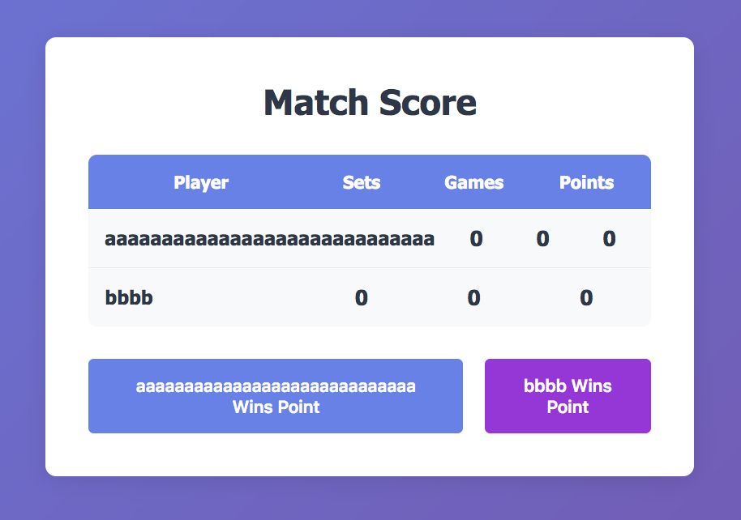
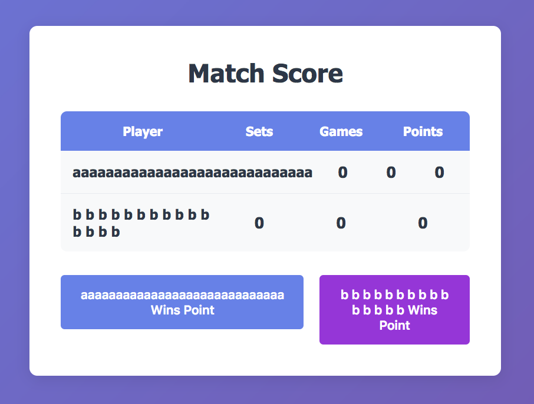
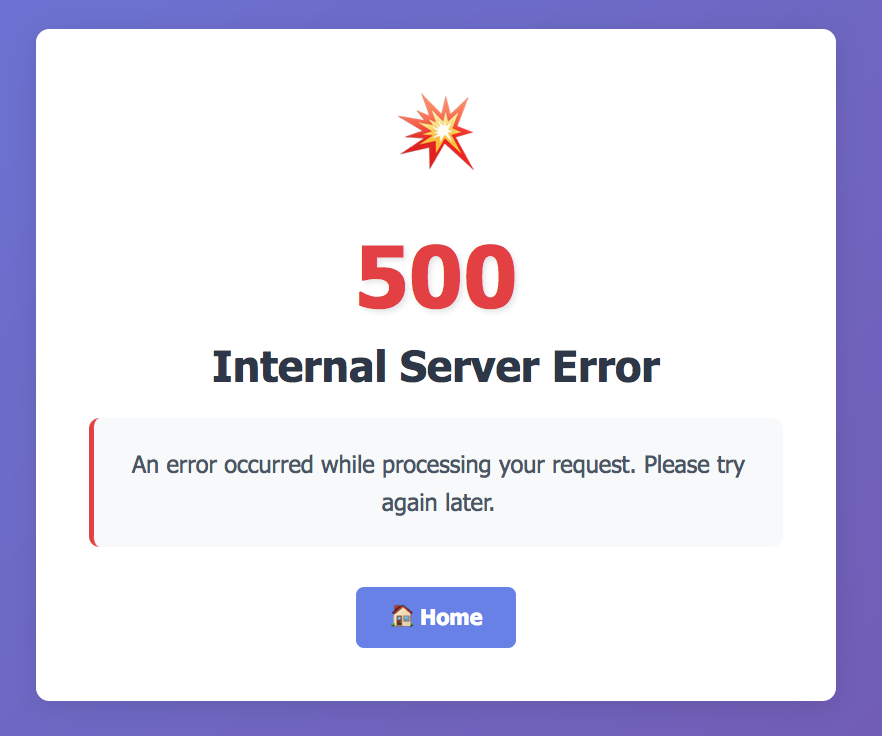

# Review на реализацию от [@wayne_hays](https://github.com/WayneHays/scoreboard) проекта [Табло теннисного матча](https://zhukovsd.github.io/java-backend-learning-course/projects/tennis-scoreboard/)

```text
1. Знаком ❗️ помечены критически важные замечания, а также места нарушения ТЗ.
2. Если ❗️ стоит перед заголовком, значит он относится ко всем пунктам этого раздела.
3. Замечания, указанные в пункте с именем пакета, относятся ко всем классам этого пакета или ко всем классам этого слоя.
4. Знаком 💡 помечены блоки, в которых содержится подсказка по реализации какого-то приёма или части кода. 
   Такие пункты всегда находятся в сворачиваемом блоке и разворачиваются по нажатию. 
   Перед их раскрытием стоит постараться придумать или поискать решение самостоятельно. 
```

## Функциональный обзор
- если создать игрока с максимально длинным именем, то колонки очков сдвинутся вбок 
- если создать двух игроков с максимально длинными именами, при этом у одного сделать имя сплошной строкой, а у другого все части имени писать через пробел (для возможности переноса в любом месте), то (помимо съехавших колонок с очками) кнопки будут разного размера 

## Model
### domain.OngoingMatch <a id="ongoing-match"></a>
- Неоднородность в именах полей сейчас поля игроков в классе Match — `firstPlayer` и `secondPlayer`, а в OngoingMatch — `player1` и `player2`. Лучше везде придерживаться одного стиля и выбрать `firstPlayer` и `secondPlayer`.
- Цифры в именах переменных. Переменные с именами `player1Score` и `player2Score` проще перепутать при использовании и чтении, чем, например, `firstPlayerScore` и `secondPlayerScore`. Вторая причина не использовать цифры в именах переменных (особенно парных) в том, что при начале ввода в Idea имени в первом случае (`player1Score` и `player2Score`) она не всегда предложит нужное дополнение (чтобы просто нажать Enter после начала ввода), а в другом случае (`firstPlayerScore` и `secondPlayerScore`) префиксы имён переменных отличаются явно — это немного ускоряет написание кода.
- Сеттер для поля `winner` не является хорошей практикой в данном случае, потому что победитель матча определяется по правилам игры, а не произвольно. Установка победителя должна происходить только в результате завершения матча по правилам. Наличие сеттера позволяет установить победителя в обход правил, что может привести к некорректному состоянию. Это является симптомом анемичной модели, потому что логика определения победителя вынесена за пределы класса, а класс OngoingMatch просто хранит данные. Победителя можно вообще не хранить в поле и сделать метод для его получения.
  Ещё, при текущем подходе, инвариант "победитель должен быть одним из игроков матча и матч должен быть завершен" не гарантируется.
- определять завершение матча (`isFinished()`) по наличию победителя может быть допустимым, но из-за того, что у поля `winner` сейчас есть публичный сеттер, такая проверка не гарантирует достоверность. Также, это противоречит принципу единого источника истины ([Single Source of Truth](#ssot-principle)), так как поле дублирует информацию, которую можно вычислить. <a id="back-1"></a>
- Сейчас поле `advantage` имеет тип Player и через указание игрока с преимуществом кодирует состояние матча. При таком подходе null используется для кодирования отсутствия преимущества. Использовать null как специальное значения не является хорошей практикой.
  Также, это противоречит принципу единого источника истины ([Single Source of Truth](#ssot-principle)), так как поле дублирует информацию, которую можно вычислить.
  Учитывая то, как эти данные используются в коде (`if (player.equals(ongoingMatch.getAdvantage()))`), можно вместо поля `advantage` сделать метод
```java
public boolean hasAdvantage(Player player) {
    return getPlayerScore(player).getPoints() == Points.ADVANTAGE;
}
```
и в местах, где нужна проверка, вызывать его (`if (ongoingMatch.hasAdvantage(player))`)
- ❗️имеет смысл пересмотреть архитектуру бизнес-логики: переместить логику завершения матча и установки победителя внутрь класса OngoingMatch, чтобы он сам управлял своим состоянием на основе правил, которые можно передавать в качестве зависимости. Это сделало бы модель более богатой и соответствовало бы принципам ООП.
- для метода `resetPointsToForty()` можно рассмотреть более семантические названия, например `loseAdvantage()`, `cancelAdvantage()` или `resetToDeuce()`.
- ❗️сейчас класс кодирует информацию о состоянии матча: более явно через `boolean tieBreak` и менее явно через `Player advantage` и `Player winner`. В результате этого класс может одновременно быть в состоянии тай-брейка, иметь преимущество у одного из игроков и быть завершённым (иметь победителя). Это происходит из-за того, что он даёт бесконтрольный доступ к изменению своего состояния извне. Более подходящим было бы не кодировать разные состояния, а хранить их явно, например, с помощью перечисления (enum).

  Скажем, такого:
```java
public enum OngoingMatchState {
    REGULAR,
    ADVANTAGE,
    TIEBREAK,
    FINISHED;
}
```
Ещё более удачным вариантом было бы создать иерархию классов для состояния гейма (или матча в целом). Разделить ответственности за каждое состояние на соответствующие классы и реализовать их в виде полноценных (богатых) доменных моделей.

  [Анемичная vs Богатая модель предметной области](#reach-anemic-model) <a id="back-2"></a>

- Текущая архитектура нарушает принцип "Tell, Don't Ask". Вместо того, чтобы говорить матчу "обработай очко", внешний код спрашивает у матча состояние и сам принимает решения. Проведение декомпозиции и реализация богатой модели исправит это.
- ❗️Сейчас объекты Player в этом классе — это JPA Entity. Это смешивает слой персистенции (JPA/Hibernate) со слоем доменной логики (правила теннисного матча). Разделение слоёв будет чище, если игроки в этом классе будут Value Object-ами, например
```java
public record TennisPlayer(String name) {
}
```
- дублирования кода в методах `resetPointsForBoth()`, `resetGamesForBoth()`, `resetTieBreakPointsForBoth()` можно избежать так:
```java
private void resetPointsForBoth() {
    forBothScores(PlayerScore::resetPoints);
}

private void resetGamesForBoth() {
    forBothScores(PlayerScore::resetGames);
}

private void resetTieBreakPointsForBoth() {
    forBothScores(PlayerScore::resetTieBreakPoints);
}

private void forBothScores(Consumer<PlayerScore> action) {
    action.accept(player1Score);
    action.accept(player2Score);
}
```
- в текущей реализации метод `getPlayerScore()` возвращает счёт второго игрока, даже если в него передали null или игрока не относящееся к этому матчу:
```java
private PlayerScore getPlayerScore(Player player) {
    return player.equals(player1) ? player1Score : player2Score;
}
```
один из способов избежать этого — хранить игроков и счёт в Map:
```java
public class OngoingMatch { 
    // ...
    private final Map<Player, PlayerScore> scores;
    public OngoingMatch(Player player1, Player player2) {
        // ...
        this.scores = Map.of(
                player1, player1Score,
                player2, player2Score
        );
    }
    // ...
}
```
и счёт игрока получать так: `scores.get(player)` (проверяя на null).

Чуть лучше (в текущем варианте) — оставить поля игроков и очков и добавить проверку в метод:
```java
private PlayerScore getPlayerScore(Player player) {
    Objects.requireNonNull(player, "Player cannot be null");
    
    if (player.equals(player1)) {
        return player1Score;
    }
    if (player.equals(player2)) {
        return player2Score;
    }
    
    throw new IllegalArgumentException("There is no player in this match: " + player);
}
```

Идеально — изменить дизайн, чтобы убрать необходимость в `getPlayerScore()`

### domain.PlayerScore
- класс закрыт для доступа извне пакета, что правильно. Ещё лучше было бы распределить хранение счёта по классам, представляющим конкретные состояние матча.
- начальные значение очков можно вынести в константы
- у класса нет (и не предвидится) наследников, что давало бы преимущество использовать неявный package-private вместо protected, поэтому методам лучше явно указать модификатор доступа protected.
- Сейчас класс содержит счёт для тай-брейка `int tieBreakPoints` даже если нет тай-брейка. С точки зрения предметной области счёт тай-брейка имеет значение только во время тай-брейка. Наличие поля, которое актуально лишь иногда, может привести к путанице и потенциальным ошибкам. Это исправится при пересмотре архитектуры доменных моделей.
- класс больше соответствует Value Object (притом, является изменяемым (mutable)), чем объекту доменной модели и способствует процедурному стилю программирования. Скорее всего при реализации классов полноценных моделей необходимость в нём исчезнет.

### service.scorecalculation.Points
- Сейчас Points находится в пакете `service.scorecalculation`. Это создает зависимость модели предметной области от компонента уровня обслуживания, что с архитектурной точки зрения сомнительно. Перечисление Points представляет собой концепцию предметной области (очки в теннисном гейме) и должно находиться на слое предметной области, поэтому стоит переместить Points в `model.domain`.
- исключение из метода `next()` нигде не обрабатывается по стеку вызовов и если оно происходит, пользователь видит страницу 500-ой ошибки 

  Возможно, было бы лучше оставить пользователя на странице матча и просто показать сообщение о том, что не получилось обработать очко.
- метод `canAdvance()` используется только в тестах — это недостаточная причина для его существования в этом классе, поэтому стоит его удалить.
  Если для тестов нужен вспомогательный метод, надо сделать его в тестовом классе или в отдельном вспомогательном классе, расположенном в тестовой иерархии.
  Например, в PointsTest вместо такого вызова
```java
@Test
void someMethod() {
    assertTrue(Points.ZERO.canAdvance())
}
```
будет такой
```java
@Test
void someMethod() {
    assertTrue(canAdvance(Points.ZERO));
}
        
private boolean canAdvance(Points points) {
    return points != Points.ADVANTAGE;
}
```
- возможно, лучше вместо метода `getValue()` (который сейчас генерируется Lombok) сделать `getDisplayValue()`, потому что `value` - это строка для отображения

### model.entity
- Hibernate достаточно конструктора без параметров с уровнем доступа protected — поэтому можно именно это значение установить в аннотации: `@NoArgsConstructor(access = AccessLevel.PROTECTED)`
- если имя поля совпадает с названием колонки, то параметр name в аннотации `@Column` можно опустить: `@Column(name = "id")` -> `@Column`
### Player
- в аннотации `@Column` параметр `columnDefinition = "VARCHAR"` можно не указывать явно. Но если он есть, то надо в нём же прописать ограничения на длину этого поля: `columnDefinition = "VARCHAR (30)"`, чтобы задать соответствующее ограничение на уровне БД.
- Также в аннотацию `@Column` стоит добавить параметр `length = 30`, чтобы Hibernate тоже выполнял проверку перед вставкой в БД. Параметры `length = 30` и `columnDefinition = "VARCHAR (30)"` не заменяют друг друга: первый — задаёт критерий проверки именно на уровне Hibernate (влияет на DDL только если нет `columnDefinition`), второй влияет на DDL при создании таблицы (и переопределяет `length`, если он есть).

<details>

---

<summary><b>Вот как разные параметры влияют на создание таблицы</b></summary>

без `columnDefinition` и без `length`
```java
@Column(
        nullable = false,
        unique = true
)
```
```sqlite-sql
create table Players (
    id bigint generated by default as identity,
    name varchar(255) not null unique,
    primary key (id)
)
```

с `columnDefinition` (без явного ограничения) и без `length`
```java
@Column(
        nullable = false,
        unique = true,
        columnDefinition = "VARCHAR"
)
```
```sqlite-sql
create table Players (
    id bigint generated by default as identity,
    name VARCHAR not null unique,
    primary key (id)
)
```

с `columnDefinition` (и явным ограничением) и без `length`
```java
@Column(
        nullable = false,
        unique = true,
        columnDefinition = "VARCHAR(30)"
)
```
```sqlite-sql
create table Players (
    id bigint generated by default as identity,
    name VARCHAR(30) not null unique,
    primary key (id)
)
```

без `columnDefinition` и с `length` — один из лучших вариантов
```java
@Column(
        nullable = false,
        unique = true,
        length = 30
)
```
```sqlite-sql
create table Players (
    id bigint generated by default as identity,
    name varchar(30) not null unique,
    primary key (id)
)
```

с `columnDefinition` (без явного ограничения) и с `length`
```java
@Column(
        nullable = false,
        unique = true,
        columnDefinition = "VARCHAR",
        length = 30
)
```
```sqlite-sql
create table Players (
    id bigint generated by default as identity,
    name VARCHAR not null unique,
    primary key (id)
)
```

с `columnDefinition` (и явным ограничением) и с `length` — один из лучших вариантов
```java
@Column(
        nullable = false,
        unique = true,
        columnDefinition = "VARCHAR(30)",
        length = 30
)
```
```sqlite-sql
create table Players (
    id bigint generated by default as identity,
    name VARCHAR(30) not null unique,
    primary key (id)
)
```

---

</details>

### Match
- ❗️для обязательных полей стоит добавить `optional = false` в `@ManyToOne` или `nullable = false` в `@JoinColumn`. Целостность данных должна обеспечиваться на всех уровнях: в приложении (валидация) и в БД (constraints). Отсутствие ограничений в БД означает, что данные могут быть испорчены из-за ошибок в приложении или при прямом доступе к БД.

  При `optional = false` или `nullable = false` — Hibernate генерирует `NOT NULL` ограничение в БД и делает проверку перед вставкой в БД (если значение поля null, то Hibernate не будет обращаться в БД для вставки и сам выбросит исключение PropertyValueException)
- можно добавить ограничения, проверяющие, что игроки разные и победителем является один из участников матча

<details>

---

<summary><b>💡 Например так 💡</b></summary>

```java
@Table(name = "Matches",
        check = {
                @CheckConstraint(constraint = "firstPlayer != secondPlayer"),
                @CheckConstraint(constraint = "winner = firstPlayer OR winner = secondPlayer")
        }
)
public class Match { 
    // ...
}
```

---

</details>

- ❗️сейчас у поля `winner` есть публичный сеттер. Match представляет объект уже завершённого теннисного матча, у которого не должно быть возможности изменить победителя. Поэтому лучше спроектировать приложение так, чтобы этот сеттер не понадобился и удалить его
- названия колонок имеет смысл писать в стиле snake_case — это часто является стандартом де-факто, а также при nativeQuery запросах это будет визуально подчёркивать, что идёт обращение к колонке БД, а не полю сущности (как в hql запросах).
```java
// camelCase может запутать:
getCurrentSession().createQuery("SELECT p.firstName, p.lastName FROM Player p", Player.class); // HQL
getCurrentSession().createNativeQuery("SELECT firstName, lastName FROM players", Player.class); // SQL

// snake_case отличие явно:
getCurrentSession().createQuery("SELECT p.firstName, p.lastName FROM Player p", Player.class); // HQL
getCurrentSession().createNativeQuery("SELECT first_name, first_name FROM players", Player.class); // SQL
```

## Dao
- В текущей реализации методы сохранения сущностей `save(Player player)` и `save(Match match)` возвращают void. Это допустимо, но обычно в таких методах возвращают сохранённую сущность (особенно если у неё генерируется ID) или, по крайней мере, тот же объект. Это позволяет получить сгенерированный идентификатор или сохранённый объект более явно:
  Например, в FinishedMatchPersistenceService сейчас так:
```java
private Player savePlayer(Player player) {
    // ...
    playerDao.save(player);
    return player;
}
```
лучше так:
```java
private Player savePlayer(Player player) {
    // ...
    Player savedPlayer = playerDao.save(player);
    return savedPlayer;
}
```
или так:
```java
private Player savePlayer(Player player) {
    // ...
    return playerDao.save(player);
}
```

### MatchDao
- названия методов `getTotalCountOfMatches()` и `getTotalCountOfMatchesByPlayerName(String name)` можно упростить без потери смысла: 
  
  `getTotalCountOfMatches()` —> `countTotal()`, 

  `getTotalCountOfMatchesByPlayerName(String name)` —> `countWithPlayer(String name)`

### BaseDao
- валидацию номера страницы из метода `createPaginatedQuery()`
```java
if (pageNumber < 1) {
    throw new IllegalArgumentException("Page number must be positive");
}
```
лучше вынести на уровень сервлетов (валидировать входные параметры) или на уровень сервиса (где она уже реализована через PaginationValidator) — это сделает соблюдение принципа единственной ответственности в слое DAO более строгим.

А также вместо IllegalArgumentException выбрасывать более специализированное ValidationException, которое уже есть в проекте.
- расчёт смещения из метода `createPaginatedQuery()` лучше вынести на уровень сервиса — это тоже сделает соблюдение принципа единственной ответственности в слое DAO более строгим

### PlayerDaoImpl
- текст запроса удобнее читать, когда он логично разбит на строки:

```sqlite-sql
SELECT p 
FROM Player p 
WHERE p.name = :name
```
для этого можно использовать текстовые блоки:
```java
private static final String FIND_BY_NAME = """
        FROM Player 
        WHERE LOWER(name) = LOWER(:name)
        """;
```
- название параметра `"name"` в `setParameter("name", name)` можно вынести в константу, как в MatchDaoImpl
- в название константы `String FIND_BY_NAME` можно добавить суффикс `HQL` или `JPQL`

### MatchDaoImpl
- текст запроса удобнее читать, когда он логично разбит на строки:

```sqlite-sql
FROM Match
ORDER BY id DESC
```
- добавление пробелов для визуального выравнивания в коде может привести к ошибкам в распознавании запроса
```java
private static final String FIND_BY_PLAYER_NAME =
        "SELECT DISTINCT m FROM Match m " +
        "WHERE LOWER(m.firstPlayer.name) LIKE LOWER(:namePattern) " +
        "   OR LOWER(m.secondPlayer.name) LIKE LOWER(:namePattern) " + // в начале этой строки
        "ORDER BY m.id DESC";
```
- для разделения на строке лучше использовать текстовые блоки вместо конкатенации строк:
  сейчас так:
```java
private static final String FIND_BY_PLAYER_NAME =
        "SELECT DISTINCT m FROM Match m " +
        "WHERE LOWER(m.firstPlayer.name) LIKE LOWER(:namePattern) " +
        "   OR LOWER(m.secondPlayer.name) LIKE LOWER(:namePattern) " +
        "ORDER BY m.id DESC";
```
лучше так:
```java
private static final String FIND_BY_PLAYER_NAME_HQL = """
        SELECT DISTINCT m
        FROM Match m
        WHERE LOWER(m.firstPlayer.name) LIKE LOWER(:namePattern)
            OR LOWER(m.secondPlayer.name) LIKE LOWER(:namePattern)
        ORDER BY m.id DESC
        """;
```
- условия
```sqlite-sql
WHERE LOWER(m.firstPlayer.name) LIKE LOWER(:namePattern)
    OR LOWER(m.secondPlayer.name) LIKE LOWER(:namePattern)
```
и
```sqlite-sql
ORDER BY m.id DESC
```
дублируются в нескольких запросах — можно вынести их в отдельные переменные
```java
private static final String FILTER_BY_NAME_HQL = """
        WHERE LOWER(m.firstPlayer.name) LIKE LOWER(:namePattern)
           OR LOWER(m.secondPlayer.name) LIKE LOWER(:namePattern)
        """;

private static final String ORDER_HQL = """
        ORDER BY m.id DESC
        """;
```
- вместо функции `LOWER()` можно использовать ключевое слово `ILIKE` — тогда будет выполняться регистронезависимый поиск
```sqlite-sql
WHERE m.firstPlayer.name ILIKE :namePattern
    OR m.secondPlayer.name ILIKE :namePattern
```

- ❗️В запросах на выборку списка матчей загружаются сущности Match, которые связаны с Player отношением многие-к-одному. В текущей реализации при загрузке одного матча будет выполняться ещё два запроса для загрузки связанных с ним игроков (проблема N+1):

```sqlite-sql
-- запрос на получение матча
[Hibernate] 
    select
        distinct m1_0.id,
        m1_0.firstPlayer,
        m1_0.secondPlayer,
        m1_0.winner 
    from
        Matches m1_0 
    join
        Players fp1_0 
            on fp1_0.id=m1_0.firstPlayer 
    join
        Players sp1_0 
            on sp1_0.id=m1_0.secondPlayer 
    where
        lower(fp1_0.name) like lower(?) escape '' 
        or lower(sp1_0.name) like lower(?) escape '' 
    order by
        m1_0.id desc 
    offset
        ? rows 
    fetch
        first ? rows only
        
-- запрос на получение игрока
[Hibernate] 
    select
        p1_0.id,
        p1_0.name 
    from
        Players p1_0 
    where
        p1_0.id=?

-- запрос на получение игрока
[Hibernate] 
    select
        p1_0.id,
        p1_0.name 
    from
        Players p1_0 
    where
        p1_0.id=?
```

Следует это исправить — например, изменить запросы так, чтобы сразу загружать связанные сущности.

<details>

---

<summary><b>💡 Вот пример такого запроса 💡</b></summary>

Оптимизируем запросы с помощью JOIN FETCH
```java
String FIND_BY_NAME_HQL = """
        SELECT m FROM Match m
        LEFT JOIN FETCH m.firstPlayer
        LEFT JOIN FETCH m.secondPlayer
        LEFT JOIN FETCH m.winner
        WHERE m.firstPlayer.name LIKE :namePattern OR m.secondPlayer.name LIKE :namePattern
        """;
```

---

</details>

## Dto
### MatchesPageContext
- возможно, лучше переименовать в `MatchesPageData`

### MatchResult
- ❗️присутствие `firstPlayerRowClass` и `secondPlayerRowClass` в DTO — это смешение логики представления и данных. DTO не должен знать о деталях представления (CSS классах). Лучше вычислять CSS классы на уровне представления (JSP) на основе данных о победителе.
- инфикс `Final` избыточен в `int firstPlayerFinalSets` и `int secondPlayerFinalSets`

### MatchesPage
- ❗️инкапсулировать всё необходимое для одной страницы в DTO — очень хороший подход, но сейчас этот класс отдаёт в представление (JSP-файлы) список из Entity (`List<Match> matches` с данными напрямую из БД). Это не является хорошей практикой и может привести к проблемам производительности (например, ленивая загрузка) и безопасности (например, случайная передача чувствительных данных). Кроме того, это связывает слой представления с моделью данных, нарушая архитектурные границы. Лучше использовать список DTO, реализованных с соблюдением принципа единственной ответственности. [(перейти в MatchesServlet)](#matchesservlet)
- можно немного добавить информативности полю `String validationError` —> `String validationErrorMessage`
- избыточные вычисляемые поля: boolean — `hasFilter`, `shouldShowPagination`, `hasPrevious`, `hasNext` и long — `previousPage`, `nextPage`. Это усложняет DTO и увеличивают размер передачи — можно вычислять их на фронтенде из `filterByPlayerName`, `pageNumber` и `totalPages`
- логику из методов
```java
public boolean hasMatches() {
    return matches != null && !matches.isEmpty();
}

public boolean hasValidationError() {
    return validationError != null;
}
```
тоже можно вычислять в JSP. Это сделает DTO более соответствующим принципу единственной ответственности, как контейнеру данных.

### MatchLiveView
- поля `String firstPlayerId` и `String secondPlayerId` могут быть long

## Service
### BaseTransactionalService
- ❗️начинать транзакцию лучше в блоке try
  Сейчас так:
```java
private <T> T executeCommon(Supplier<T> operation, String errorMessage) {
    Session session = HibernateUtil.getSessionFactory().getCurrentSession();
    Transaction transaction = session.beginTransaction();

    try {
        // ...
    }
}
```
лучше так:
```java
private <T> T executeCommon(Supplier<T> operation, String errorMessage) {
    Session session = HibernateUtil.getSessionFactory().getCurrentSession();
    Transaction transaction = null;

    try {
        transaction = session.beginTransaction();
        // ...
    }
}
```
чтобы исключение при `beginTransaction()` было обработано как любое другое исключение при выполнении метода.
- ❗️перед откатом транзакции в блоках catch стоит добавить проверку, что она активна
```java
if (transaction != null && transaction.isActive()) {
    transaction.rollback();
}
```
иначе вызов `transaction.rollback()` может привести к исключению IllegalStateException
- ❗️также вызов `transaction.rollback()` стоит обернуть в try, иначе при возникновении исключения в этом методе оно замаскирует оригинальное из основного блока try.
  Например, так:
```java
private <T> T executeCommon(Supplier<T> operation, String errorMessage) {
    Session session = HibernateUtil.getSessionFactory().getCurrentSession();
    Transaction transaction = null;

    try {
        transaction = session.beginTransaction();
        
        T result = operation.get();
        
        transaction.commit();
        return result;

    } catch (NotFoundException | ValidationException e) {
        safeRollback(transaction, e);
        throw e;

    } catch (RuntimeException e) {
        safeRollback(transaction, e);
        throw new ScoreboardServiceException(errorMessage, e);
    }
}

private void safeRollback(Transaction transaction, Exception originalException) {
    try {
        if (transaction != null && transaction.isActive()) {
            transaction.rollback();
        }
    } catch (Exception rollbackException) {
        originalException.addSuppressed(rollbackException);
    }
}
```

### FinishedMatchPersistenceService
- ❗️сейчас при сохранении матча происходит от 4-х до 6-ти запросов в БД

<details>

---

<summary><b>Вот так</b></summary>

#### 6 запросов в БД при сохранении завершённого матча с двумя новыми игроками (обоих игроков нет в БД):

```sqlite-sql
-- запрос на получение игрока (первого)
[Hibernate]
    select
        p1_0.id,
        p1_0.name
    from
        Players p1_0
    where
        lower(p1_0.name)=lower(?)

-- запрос на сохранение игрока (первого)
[Hibernate]
    insert
    into
        Players
        (name, id)
    values
        (?, default)

-- запрос на получение игрока (второго)
[Hibernate]
    select
        p1_0.id,
        p1_0.name
    from
        Players p1_0
    where
        lower(p1_0.name)=lower(?)

-- запрос на сохранение игрока (второго)
[Hibernate]
    insert
    into
        Players
        (name, id)
    values
        (?, default)

-- запрос на получение игрока (победителя)
[Hibernate]
    select
        p1_0.id,
        p1_0.name
    from
        Players p1_0
    where
        lower(p1_0.name)=lower(?)

-- запрос на сохранение матча
[Hibernate]
    insert
    into
        Matches
        (firstPlayer, secondPlayer, winner, id)
    values
        (?, ?, ?, default)
```

#### 5 запросов в БД при сохранении завершённого матча с одним новым игроком (одного из игроков (второго) нет в БД):

```sqlite-sql
-- запрос на получение игрока (первого)
[Hibernate]
    select
        p1_0.id,
        p1_0.name
    from
        Players p1_0
    where
        lower(p1_0.name)=lower(?)

-- запрос на получение игрока (второго)
[Hibernate]
    select
        p1_0.id,
        p1_0.name
    from
        Players p1_0
    where
        lower(p1_0.name)=lower(?)

-- запрос на сохранение игрока (второго)
[Hibernate]
    insert
    into
        Players
        (name, id)
    values
        (?, default)

-- запрос на получение игрока (победителя)
[Hibernate]
    select
        p1_0.id,
        p1_0.name
    from
        Players p1_0
    where
        lower(p1_0.name)=lower(?)

-- запрос на сохранение матча
[Hibernate]
    insert
    into
        Matches
        (firstPlayer, secondPlayer, winner, id)
    values
        (?, ?, ?, default)
```

#### 4 запроса в БД при сохранении завершённого матча без новых игроков (оба игрока есть в БД):

```sqlite-sql
-- запрос на получение игрока (первого)
[Hibernate]
    select
        p1_0.id,
        p1_0.name
    from
        Players p1_0
    where
        lower(p1_0.name)=lower(?)

-- запрос на получение игрока (второго)
[Hibernate]
    select
        p1_0.id,
        p1_0.name
    from
        Players p1_0
    where
        lower(p1_0.name)=lower(?)

-- запрос на получение игрока (победителя)
[Hibernate]
    select
        p1_0.id,
        p1_0.name
    from
        Players p1_0
    where
        lower(p1_0.name)=lower(?)

-- запрос на сохранение матча
[Hibernate]
    insert
    into
        Matches
        (firstPlayer, secondPlayer, winner, id)
    values
        (?, ?, ?, default)
```

---

</details>

Стоит поискать решение, как сохранять матч с игроками в одном запросе — это снизит нагрузку на БД.

- ❗️в методе `savePlayer()` в случае ошибки при сохранении игрока стоит пытаться его найти только если это ошибка из-за конфликта имён, а не вообще любое исключение

сейчас так:
```java
catch (Exception e) {
    return playerDao.find(player.getName())
            .orElseThrow(() -> new RuntimeException(
                    "Failed to save player: " + player.getName(), e
            ));
}
```
лучше так:
```java
// ...
catch (Exception e) {
    if (isConstraintViolation(e)) {
        return playerDao.find(player.getName())
                .orElseThrow(() -> new RuntimeException(
                        "Failed to save player: " + player.getName(), e
                ));
    }
    throw new ScoreboardServiceException("Failed to save player: " + player.getName(), e);
}
// ...

private boolean isConstraintViolation(Exception e) {
    Throwable cause = e;
    while (cause != null) {
        if (cause instanceof ConstraintViolationException) {
            return true;
        }
        cause = cause.getCause();
    }
    return false;
}
```

- в случае ошибки в блоке catch в методе `savePlayer()` лучше вместо RuntimeException выбрасывать какое-то более специализированное исключение, например ScoreboardServiceException
- метод `save()` будет лучше читаться, если разделить его на несколько простых.

Сейчас так:
```java
private Player savePlayer(Player player) {
    return playerDao.find(player.getName())
            .orElseGet(() -> {
                try {
                    playerDao.save(player);
                    return player;
                } catch (Exception e) {
                    return playerDao.find(player.getName())
                            .orElseThrow(() -> new RuntimeException(
                                    "Failed to save player: " + player.getName(), e
                            ));
                }
            });
}
```
лучше читается так:
```java
private Player savePlayer(Player player) {
    return tryFind(player)
            .orElseGet(() -> trySave(player));
}

private Optional<Player> tryFind(Player player) {
    return playerDao.find(player.getName());
}

private Player trySave(Player player) {
    try {
        playerDao.save(player);
        return player;
    } catch (Exception e) {
        if (isConstraintViolation(e)) {
            return tryFind(player)
                    .orElseThrow(() -> getException(player, e));
        }
        throw getException(player, e);
    }
}

private boolean isConstraintViolation(Exception e) {
    Throwable cause = e;
    while (cause != null) {
        if (cause instanceof ConstraintViolationException) {
            return true;
        }
        cause = cause.getCause();
    }
    return false;
}

private ScoreboardServiceException getException(Player player, Exception e) {
    return new ScoreboardServiceException("Failed to save player: " + player.getName(), e);
}
```

### MatchesPageService
- дублирующуюся в методах `getPage()` и `getPageByPlayerName` валидацию номера страницы `PaginationValidator.validatePageNumber(pageNumber)` можно вынести в метод `buildPage()`
- в этом классе была бы уместна логика расчёта смещения для получения списка матчей (которая сейчас находится в DAO)
- в этом сервисе будет правильным — произвести конвертацию (через маппер) Entity-матчей, полученных из БД в матчи-DTO, которые будут отданы через сервлеты в представление (JSP).

### service.matchprocess
- ❗️логика блокировок на время обработки счёта пытается исправить архитектурные недостатки главной бизнес-логики приложения — из-за того, что обработка счёта не инкапсулирована в моделях, понадобились дополнительные инструменты синхронизации. Подобные решения избыточны в этом проекте и излишне усложняют код.
  Хорошим подходом будет реализовать логику обработки выигранного очка в классах моделей (например, через паттерн Chain of responsibility) и выполнять её в методе `ConcurrentHashMap.compute()` внутри OngoingMatchesService. Подобный подход можно применить и в текущей реализации. Это значительно упростило бы разработку и поддержку этой части приложения.

### service.scorecalculation.handler
- ❗️использовать паттерн Chain of responsibility для подсчёта очков — это хороший подход для этого проекта. Идеально — реализовать его на уровне моделей, чтобы данные и поведение не делились между разными частями приложения, а были сосредоточены в одном месте. Это больше соответствовало бы ООП стилю и принципу единственной ответственности.

## Servlet
### BaseServlet

<div align="right">

[перейти в JspPaths](#jsppaths)</div>

- логику методов `forwardToJsp()` и `redirect()` из утилитного класса ServletHelper будет уместно реализовать в этом BaseServlet

<details>

---

<summary><b>💡 Например так 💡</b></summary>

```java
private static final String PATH_DELIMITER = "/";
private static final String PARAMETER_PREFIX = "?";
private static final String PARAMETER_EQUAL = "=";
private static final String PARAMETER_DELIMITER = "&";
private static final String JSP_SUB_PATH = "/WEB-INF" + PATH_DELIMITER;
private static final String JSP_EXTENSION = ".jsp";

protected void forwardTo(
        String pageName,
        HttpServletRequest request,
        HttpServletResponse response
) throws ServletException, IOException {

    request.getRequestDispatcher(JSP_SUB_PATH + pageName + JSP_EXTENSION)
            .forward(request, response);
}

protected void redirectTo(
        String subPath,
        Map<String, ?> requestParameters,
        HttpServletRequest request,
        HttpServletResponse response
) throws IOException {

    String parameters = buildParameters(requestParameters);
    response.sendRedirect(request.getContextPath() + PATH_DELIMITER + subPath + parameters);
}

private String buildParameters(Map<String, ?> requestParameters) {
    if (requestParameters.isEmpty()) {
        return "";
    }

    return PARAMETER_PREFIX +
           requestParameters.entrySet().stream()
                   .filter(this::isValidEntry)
                   .map(this::buildParameter)
                   .collect(Collectors.joining(PARAMETER_DELIMITER));
}

private boolean isValidEntry(Map.Entry<String, ?> entry) {
    return isNotEmpty(entry.getKey()) && isNotEmpty(entry.getValue());
}

private boolean isNotEmpty(Object object) {
    return object != null && !object.toString().isBlank();
}

private String buildParameter(Map.Entry<String, ?> parameterEntry) {
    String encodedKey = encodeForUrl(parameterEntry.getKey());
    String encodedValue = encodeForUrl(parameterEntry.getValue().toString());

    return encodedKey + PARAMETER_EQUAL + encodedValue;
}

private String encodeForUrl(String raw) {
    return URLEncoder.encode(raw, StandardCharsets.UTF_8);
}
```

Также, каждый сервлет может наследоваться от BaseServlet и хранить название JSP страницы в виде константы (исчезнет необходимость в JspPaths).

Например, вместо:
```java
@WebServlet ("/home")
public class HomeServlet extends HttpServlet {

    @Override
    protected void doGet(HttpServletRequest req, HttpServletResponse resp)
            throws ServletException, IOException {
        getServletContext().getRequestDispatcher(JspPaths.HOME_JSP).forward(req, resp);
    }
}
```
будет:
```java
@WebServlet ("/home")
public class HomeServlet extends BaseServlet {
    private static final String JSP_NAME = "home";

    @Override
    protected void doGet(HttpServletRequest req, HttpServletResponse resp)
            throws ServletException, IOException {
        forwardTo(JSP_NAME, req, resp);
    }
}
```

---

</details>

### NewMatchServlet
- неоднородность в именах переменных даже в пределах одного метода:
```java
private UUID createMatch(String player1name, String player2name) {
    String player1ValidName = PlayerNameValidator.validate(player1name); // здесь числами
    String player2ValidName = PlayerNameValidator.validate(player2name);
        
    // ...

    Player firstPlayer = new Player(player1ValidName); // здесь словами
    Player secondPlayer = new Player(player2ValidName);

    // ...
}
```
лучше использовать один стиль и везде перейти на `firstPlayer` и `secondPlayer`
- в проекте есть класс Player, поэтому чистые имена `player` лучше оставить для переменных этого типа, а для строк `String player1 = (String) session.getAttribute(PLAYER_1_INPUT_ATTR);` использовать, например `firstPlayerAttributeValue`
- дублирование кода в методе `doGet()`

сейчас так:
```java
@Override
protected void doGet(HttpServletRequest req, HttpServletResponse resp) throws ServletException, IOException {
    HttpSession session = req.getSession(false);

    if (session != null) {
        String error = (String) session.getAttribute(ERROR_ATTR);
        if (error != null) {
            req.setAttribute(ERROR_ATTR, error);
            session.removeAttribute(ERROR_ATTR);
        }

        String player1 = (String) session.getAttribute(PLAYER_1_INPUT_ATTR);
        if (player1 != null) {
            req.setAttribute(PLAYER_1_INPUT_ATTR, player1);
            session.removeAttribute(PLAYER_1_INPUT_ATTR);
        }

        String player2 = (String) session.getAttribute(PLAYER_2_INPUT_ATTR);
        if (player2 != null) {
            req.setAttribute(PLAYER_2_INPUT_ATTR, player2);
            session.removeAttribute(PLAYER_2_INPUT_ATTR);
        }
    }

    ServletHelper.forwardToJsp(req, resp, JspPaths.NEW_MATCH_JSP);
}
```
лучше так:
```java
@Override
protected void doGet(HttpServletRequest req, HttpServletResponse resp) throws ServletException, IOException {
    HttpSession session = req.getSession(false);

    if (session != null) {
        setAttribute(ERROR_ATTR, req, session);
        setAttribute(PLAYER_1_INPUT_ATTR, req, session);
        setAttribute(PLAYER_2_INPUT_ATTR, req, session);
    }

    ServletHelper.forwardToJsp(req, resp, JspPaths.NEW_MATCH_JSP);
}

private void setAttribute(String attr, HttpServletRequest req, HttpSession session) {
    String playerAttributeValue = (String) session.getAttribute(attr);
    if (playerAttributeValue != null) {
        req.setAttribute(attr, playerAttributeValue);
        session.removeAttribute(attr);
    }
}
```
- сейчас логика валидации имён игроков разделена между сервлетом и валидатором
```java
private UUID createMatch(String player1name, String player2name) {
    String player1ValidName = PlayerNameValidator.validate(player1name); // здесь проверяет валидатор
    String player2ValidName = PlayerNameValidator.validate(player2name); // здесь проверяет валидатор

    if (player1ValidName.equalsIgnoreCase(player2ValidName)) { // эта проверка в сервлете
        throw new ValidationException(DUPLICATE_PLAYERS_NAME_MESSAGE);
    }

    Player firstPlayer = new Player(player1ValidName);
    Player secondPlayer = new Player(player2ValidName);

    return ongoingMatchesService.createMatch(firstPlayer, secondPlayer);
}
```
лучше инкапсулировать её в одном месте (в валидаторе). Например, можно создать DTO
```java
public record CreateMatchDto(String firstPlayerName, String secondPlayerName) {
}
```
и передавать в валидатор его.
- ❗️сейчас в методе `createMatch()` создаются JPA сущности Player — это создаёт смешение слоёв. Сервлеты должны обмениваться данными с сервисами только через DTO — cервлет извлекает данные из запроса, валидирует их с помощью валидатора и отдаёт в слой сервисов. А JPA Entity передаются между сервисами и DAO.
- ❗️по ТЗ HttpSession не должны использоваться в этом проекте
- имена параметров запроса `req.getParameter("player1name")` и `req.getParameter("player2name")` можно вынести в константы, по аналогии с атрибутами сессии

### ErrorServlet
- текст сообщений об ошибках из метода `getDefaultMessage()` можно вынести в константы, по аналогии с NewMatchServlet

### MatchScoreServlet
- ❗️в методе `doGet()` сервлет получает от сервиса объект доменной модели OngoingMatch — это создаёт смешение слоёв. Будет лучше, если сервлет получит из слоя сервисов сразу объект view (`Object view`), а MatchViewResolver уже по нему определит путь для форварда и имя атрибута.

### MatchesServlet
- ❗️в методе `doGet()` MatchesPage передаёт в слой представления JPA сущности (подробнее об этом сказано в разделе [MatchesPage](#matchespage))
- в этом сервлете можно только провалидировать номер страницы и получить значение атрибута фильтра по имени. Дальше передать это в слой сервисов и делегировать ему логику определения выборки матчей (с фильтром или без). Это сделает соблюдение принципа единственной ответственности более строгим в этом сервлете.

## Util
### ServletHelper
- в методе `parseUuid()` проверка на длину uuid параметра избыточна, так как этот параметр не вводится пользователем — можно сразу пытаться распарсить его в UUID и обрабатывать исключения
```java
public static UUID parseUuid(String uuidStr, String paramName) {
    if (uuidStr == null || uuidStr.isBlank()) {
        throw new ValidationException("Parameter '" + paramName + "' is required");
    }

    String trimmedUuid = uuidStr.trim();

    // этот if можно удалить
    if (trimmedUuid.length() != UUID_REQUIRED_LENGTH) {
        logger.warn("Invalid UUID length for parameter '{}': {} (expected exactly 36 characters)",
                paramName, trimmedUuid.length());
        throw new ValidationException("Invalid UUID format for parameter '" + paramName + "'");
    }

    try {
        return UUID.fromString(trimmedUuid);
    } catch (IllegalArgumentException e) {
        logger.warn("Invalid UUID format for parameter '{}': {}", paramName, trimmedUuid);
        throw new ValidationException("Invalid UUID format for parameter '" + paramName + "'");
    }
}
```
- логику валидации из этого класса, которая присутствует в `parseUuid()` и `parsePageNumber()` можно вынести в валидаторы (после чего в сервлете выполнять прямой парсинг), а `forwardToJsp()` и `redirect()` реализовать в базовом сервлете, тогда необходимость в этом классе исчезнет.

### ErrorHandler
- Если где-то в проекте принято (правильное) решение выносить "магические" строки в константы, то лучше следовать ему повсеместно. Тексты сообщений об ошибках, заголовки и иконки, а также названия атрибутов стоит вынести в константы этого класса.
- чтобы не передавать параметры, связанные с исключениями, по отдельности, можно создать для этого специальный ErrorDto
```java
public record ErrorDto(
        int statusCode,
        String errorIcon,
        String errorTitle,
        String defaultMessage,
        String message,
        String requestedUrl
) {
}
```
тогда вместо:
```java
req.setAttribute("statusCode", statusCode);
req.setAttribute("errorIcon", errorIcon);
req.setAttribute("errorTitle", errorTitle);
req.setAttribute("defaultMessage", defaultMessage);
req.setAttribute("errorMessage", message);
req.setAttribute("requestedUrl", requestedUrl);
```
будет:
```java
req.setAttribute("errorDto", errorDto);
```
- 

## Constant
### JspPaths
- ❗️константа `String APPLICATION_CONTEXT_ATTR = "applicationContext"` не является путём к JSP, поэтому не должна быть в этом классе
- после проведения рефакторинга, предложенного в разделе [BaseServlet](#baseservlet), необходимость в этом классе исчезнет и его можно будет удалить

### AppDefaults
- общих констант в проекте мало, поэтому нет необходимости создавать для них отдельные классы — можно хранить их там, где они используются
- в идеале количество матчей на странице должен выбирать пользователь (нет необходимости реализовывать это в текущем проекте), поэтому будет уместным соответствующую константу `int DEFAULT_MATCHES_PER_PAGE` хранить в классе MatchesServlet. Там же можно хранить `int DEFAULT_PAGE_NUMBER`
- `String DEFAULT_INITIAL_PLAYERS_FILE` можно перенести в TextFileDataSourceProvider
- `String HIBERNATE_CONFIG` можно перенести в HibernateConfigManager

### ConfigKeys
- существование этого класса может быть более оправданным, если сделать его перечислением (enum) и хранить на ряду с ключами значения по умолчанию

<details>

---

<summary><b>💡 Например, так 💡</b></summary>

```java
public enum ConfigurationKeys {
    MATCHES_PER_PAGE("matches.per.page", "10", Integer.class, Integer::parseInt),
    INITIAL_PLAYERS_FILE("files.initial.players", "/initial-players.txt", String.class, String::valueOf),
    HIBERNATE_CONFIG_FILE("hibernate.config", "hibernate.properties", String.class, String::valueOf);
    private final String key;
    private final Class<?> type;
    private final Supplier<?> source;

    <T> ConfigurationKeys(String key, String defaultValue, Class<T> type, Function<String, T> parser) {
        this.key = key;
        this.type = type;
        this.source = () -> parser.apply(defaultValue);
    }

    public String key() {
        return key;
    }

    public <T> T getDefaultTypedValue(Class<T> targetType) {
        if (!targetType.equals(type)) {
            throw new InitializationException("Type: %s is unsupported for key: %s\n".formatted(targetType, key));
        }
        return targetType.cast(source.get());
    }
}
```

---

</details>

## Config
### ApplicationContext
- в методе `get()` вместо небезопасного приведения типов `T service = (T) services.get(type)` лучше использовать `T service = type.cast(services.get(type))`, это позволит избежать подавления исключения `@SuppressWarnings("unchecked")`

### ApplicationContextListener
- в качестве ключа для атрибута можно использовать простое имя класса (или полное, если классов с одинаковыми именами может быть несколько в разных пакетах). Это избавит от необязательных констант.
  Вместо:
```java
servletContext.setAttribute(JspPaths.APPLICATION_CONTEXT_ATTR, context);
```
будет:
```java
servletContext.setAttribute(ServletContext.class.getSimpleName(), context);
```
и аналогично, при получении объекта:
```java
private ApplicationContext getApplicationContext() {
    ServletContext servletContext = getServletContext();
ApplicationContext context = (ApplicationContext) servletContext.getAttribute(ServletContext.class.getSimpleName());

    // ...
}
```

### PropertiesConfig
- в методе `loadProperties()` кажется, вместо `PropertiesConfig.class.getClassLoader()` лучшим подходом будет использовать контекстный загрузчик классов `Thread.currentThread().getContextClassLoader()`.

  `Thread.currentThread().getContextClassLoader()` лучше использовать в сложных средах (серверы приложений), а `MyClass.class.getClassLoader()` – для стандартных приложений. `getContextClassLoader()` позволяет получить загрузчик, установленный для конкретного потока (например, контекст веб-приложения в Tomcat), в то время как `getClassLoader()` возвращает загрузчик, который загрузил данный конкретный класс.

  [1. Difference Between Thread’s Context Class Loader and Normal Class Loader](https://www.baeldung.com/java-class-loader-thread-context-vs-normal)

  [2. Difference between Thread.currentThread() classLoader and normal classLoader](https://stackoverflow.com/questions/40303433/difference-between-thread-currentthread-classloader-and-normal-classloader)

- в методе `getInt()` нет проверки на NumberFormatException при вызове `Integer.parseInt(value.trim())`

### servicediscovery
- хорошая реализация паттерна SPI (Service Provider Interface). Можно подумать, как сохранить преимущества динамического обнаружения и при этом улучшить опыт использования. В частности, сейчас есть много классов-провайдеров и целью может быть избавиться от них.

<details>
<summary><b>💡 Например, это можно сделать так 💡</b></summary>

Ценность каждого класса-провайдера в том, что он сообщает как (с какими зависимостями) создавать тот или иной объект и с каким интерфейсом (типом) его связывать в контексте. При этом есть большое количество однотипных классов, что увеличивает кодовую базу и усложняет чтение кода. Было бы отлично — иметь те же преимущества, но при этом избавиться (или уменьшить) boilerplate-код и количество файлов.

То есть, чтобы при запуске приложение автоматически обнаруживало через сканирование classpath, какие объекты создавать и как это делать, и не было необходимости прописывать это кодом.

### Альтернативный подход на основе сканирования аннотаций
#### Основная идея

1. Создать аннотацию `@RegisterAs`, которой помечаются классы, предназначенные для регистрации в контексте.

2. Реализовать сканер, который ищет эти аннотации и создает экземпляры классов.

3. Упорядочивать регистрацию с помощью параметра priority в аннотации.

#### Пример аннотации

Можно создать специальную аннотацию и помечать ею класс, экземпляр которого надо поместить в контекст. Добавить ей параметр `type`, чтобы передавать тип переменной, с которым надо связать в контексте экземпляр помеченного класса. Также потребуется как-то указать порядок создания объектов, чтобы корректно создавать экземпляры, которые ожидают внедрения зависимостей. Для этого можно создать параметр `priority`.

```java
@Retention(RetentionPolicy.RUNTIME)
@Target(ElementType.TYPE)
public @interface RegisterAs {
    Class<?> type();

    RegistrationPriority priority() default RegistrationPriority.DEFAULT;
}
```

#### Пример упорядочивания приоритетов регистрации

Enum, чтобы централизовано задавать значения для слоёв

```java
public enum RegistrationPriority {
    DEFAULT(0),
    CONFIGURATION(100),
    INFRASTRUCTURE(200),
    DAO(300),
    BUSINESS_SERVICE(400),
    COMPOSITE_SERVICE(500),
    TEST_INFRASTRUCTURE(100_300),
    TEST_SERVICE(100_400),
    TEST_COMPOSITE_SERVICE(100_500),
    TEST_LIFECYCLE(100_600);
    private final int value;

    RegistrationPriority(int value) {
        this.value = value;
    }

    public int value() {
        return value;
    }
}
```

#### Пример использования аннотации

Добавить `@RegisterAs` ко всем классам, которые сейчас регистрируются через провайдеров и настроить правильный порядок регистрации (priority)

```java
@RegisterAs(type = Config.class, priority = RegistrationPriority.CONFIGURATION)
public class PropertiesConfig implements Config {
    // ...
}

@RegisterAs(type = PlayerDao.class, priority = RegistrationPriority.DAO)
public class PlayerDaoImpl extends BaseDao<Player> implements PlayerDao {
    // ...
}

@RegisterAs(type = OngoingMatchesService.class, priority = RegistrationPriority.BUSINESS_SERVICE)
public class OngoingMatchesService {
    // ...
}
```

И обеспечить возможность создания этих классов через конструкторы без параметров или с параметрами, которые можно получить из контекста.

#### Пример сканера

Сканер будет использовать библиотеку Reflections для поиска аннотированных классов (можно реализовать и без сторонней библиотеки).

```xml
<dependency>
    <groupId>org.reflections</groupId>
    <artifactId>reflections</artifactId>
    <version>0.10.2</version>
</dependency>
```

Он должен учитывать порядок регистрации и разрешать зависимости через конструкторы.

Вот упрощённый пример:

<table style="width:200%;">

<tr>
<td style="width:50%;" align="center">
< &nbsp; < &nbsp; < &nbsp;ДВИГАЙТЕ КОД ВЛЕВО, ЧТОБЫ УВИДЕТЬ КОММЕНТАРИИ&nbsp; < &nbsp; < &nbsp; <
</td>
<td style="width:50%;" align="center">
> &nbsp; > &nbsp; > &nbsp;ДВИГАЙТЕ КОД ВПРАВО, ЧТОБЫ СКРЫТЬ КОММЕНТАРИИ&nbsp; > &nbsp; > &nbsp; >
</td>
</tr>

<tr>
<td style="width:50%;">

```java

@NoArgsConstructor(access = AccessLevel.PRIVATE)
public class ServiceScanner {
    public static void scanAndRegister(String basePackage, ApplicationContext context) {
        List<ClassRegistrationInfo> classInfos = scan(basePackage);

        classInfos.sort(Comparator.comparingInt(ClassRegistrationInfo::order));

        classInfos.forEach(info -> register(info, context));
    }

    private static List<ClassRegistrationInfo> scan(String basePackage) {
        Reflections reflections = new Reflections(basePackage, Scanners.TypesAnnotated);

        Set<Class<?>> classes = reflections.getTypesAnnotatedWith(RegisterAs.class);

        return new ArrayList<>(
                classes.stream()
                        .map(ServiceScanner::getClassRegistrationInfo)
                        .toList()
        );
    }

    private static ClassRegistrationInfo getClassRegistrationInfo(Class<?> clazz) {
        RegisterAs annotation = clazz.getAnnotation(RegisterAs.class);
        Class<?> serviceInterface = annotation.type();

        checkAssignable(clazz, serviceInterface);

        return create(clazz, serviceInterface, annotation);
    }

    private static void checkAssignable(Class<?> clazz, Class<?> serviceInterface) {
        if (!serviceInterface.isAssignableFrom(clazz)) {
            String message = "Class " + clazz.getName() +
                             " does not implement " + serviceInterface.getName();
            throw new IllegalStateException(message);
        }
    }

    private static ClassRegistrationInfo create(Class<?> clazz, Class<?> serviceInterface, RegisterAs annotation) {
        return new ClassRegistrationInfo(
                clazz,
                serviceInterface,
                annotation.order().value()
        );
    }

    private static void register(ClassRegistrationInfo info, ApplicationContext context) {
        context.register(info.serviceInterface(), create(info, context));
    }

    private static Object create(ClassRegistrationInfo info, ApplicationContext context) {
        return createWithArgs(info.clazz(), context)
                .orElseGet(() -> createWithoutArgs(info.clazz()));
    }

    private static Optional<Object> createWithArgs(Class<?> clazz, ApplicationContext context) {
        return Arrays.stream(clazz.getDeclaredConstructors())
                .map(constructor -> createBy(constructor, context))
                .filter(Optional::isPresent)
                .findFirst()
                .orElse(Optional.empty());
    }

    private static Optional<Object> createBy(Constructor<?> constructor, ApplicationContext context) {
        try {
            Class<?>[] paramTypes = constructor.getParameterTypes();
            Object[] params = new Object[paramTypes.length];

            if (fillAllParams(params, paramTypes, context)) {
                constructor.setAccessible(true);
                return Optional.of(constructor.newInstance(params));
            }
            return Optional.empty();
        } catch (Exception e) {
            throw new RuntimeException("Failed to create instance of " + constructor.getDeclaringClass().getName(), e);
        }
    }

    private static boolean fillAllParams(Object[] params, Class<?>[] paramTypes, ApplicationContext context) {
        boolean allParamsResolved = true;
        for (int i = 0; i < paramTypes.length; i++) {
            try {
                params[i] = context.get(paramTypes[i]);
            } catch (IllegalStateException e) {
                allParamsResolved = false;
                break;
            }
        }
        return allParamsResolved;
    }

    private static Object createWithoutArgs(Class<?> clazz) {
        try {
            Constructor<?> constructor = clazz.getDeclaredConstructor();
            constructor.setAccessible(true);
            return constructor.newInstance();
        } catch (Exception e) {
            throw new RuntimeException("Failed to create instance of " + clazz.getName(), e);
        }
    }

    private record ClassRegistrationInfo(
            Class<?> clazz,
            Class<?> serviceInterface,
            int order
    ) {
    }
}
```

</td>
<td style="width:50%;">

```java
/**
 * Сканер сервисов для автоматической регистрации компонентов в контексте приложения.
 * Класс сканирует указанный пакет в поиске классов, аннотированных @RegisterAs,
 * и регистрирует их в предоставленном ApplicationContext.
 */
@NoArgsConstructor(access = AccessLevel.PRIVATE)
public class ServiceScanner {

    /**
     * Основной публичный метод для сканирования пакета и регистрации найденных сервисов.
     *
     * @param basePackage базовый пакет для сканирования
     * @param context контекст приложения для регистрации бинов
     */
    public static void scanAndRegister(String basePackage, ApplicationContext context) {
        // 1. Сканируем пакет и получаем информацию о классах
        List<ClassRegistrationInfo> classInfos = scan(basePackage);

        // 2. Сортируем классы по порядку регистрации (значение priority из аннотации)
        classInfos.sort(Comparator.comparingInt(ClassRegistrationInfo::order));

        // 3. Регистрируем каждый класс в контексте
        classInfos.forEach(info -> register(info, context));
    }

    /**
     * Сканирует указанный пакет в поиске классов с аннотацией @RegisterAs.
     *
     * @param basePackage пакет для сканирования
     * @return список информации о классах для регистрации
     */
    private static List<ClassRegistrationInfo> scan(String basePackage) {
        // Используем Reflections для поиска классов по аннотации
        Reflections reflections = new Reflections(basePackage, Scanners.TypesAnnotated);

        // Получаем все классы, аннотированные @RegisterAs
        Set<Class<?>> classes = reflections.getTypesAnnotatedWith(RegisterAs.class);

        // Преобразуем каждый класс в ClassRegistrationInfo и возвращаем список
        return new ArrayList<>(
                classes.stream()
                        .map(ServiceScanner::getClassRegistrationInfo)
                        .toList()
        );
    }

    /**
     * Создает объект ClassRegistrationInfo для класса на основе аннотации @RegisterAs.
     *
     * @param clazz класс для обработки
     * @return информация о регистрации класса
     * @throws IllegalStateException если класс не реализует интерфейс, указанный в аннотации
     */
    private static ClassRegistrationInfo getClassRegistrationInfo(Class<?> clazz) {
        // Получаем аннотацию @RegisterAs
        RegisterAs annotation = clazz.getAnnotation(RegisterAs.class);
        // Из аннотации получаем интерфейс, под которым нужно зарегистрировать класс
        Class<?> serviceInterface = annotation.type();

        // Проверяем, что класс действительно реализует указанный интерфейс
        checkAssignable(clazz, serviceInterface);

        // Создаем и возвращаем объект информации о регистрации
        return create(clazz, serviceInterface, annotation);
    }

    /**
     * Проверяет, что класс реализует указанный интерфейс.
     *
     * @param clazz проверяемый класс
     * @param serviceInterface ожидаемый интерфейс
     * @throws IllegalStateException если класс не реализует интерфейс
     */
    private static void checkAssignable(Class<?> clazz, Class<?> serviceInterface) {
        if (!serviceInterface.isAssignableFrom(clazz)) {
            String message = "Class " + clazz.getName() +
                             " does not implement " + serviceInterface.getName();
            throw new IllegalStateException(message);
        }
    }

    /**
     * Создает объект ClassRegistrationInfo.
     *
     * @param clazz регистрируемый класс
     * @param serviceInterface интерфейс для регистрации
     * @param annotation аннотация @RegisterAs
     * @return объект с информацией о регистрации
     */
    private static ClassRegistrationInfo create(Class<?> clazz, Class<?> serviceInterface, RegisterAs annotation) {
        return new ClassRegistrationInfo(
                clazz,
                serviceInterface,
                annotation.order().value() // Получаем числовое значение порядка
        );
    }

```

<details>
<summary>

<div align="center">

— — — — — — — — — — — — — — — — — — — — — — — — — — — — — —

&gt; &nbsp; &gt; &nbsp; НАЖМИТЕ ЗДЕСЬ, ЧТОБЫ УВИДЕТЬ/СКРЫТЬ ПРОЛОДЖЕНИЕ &nbsp; < &nbsp; <

— — — — — — — — — — — — — — — — — — — — — — — — — — — — — —
</div>

</summary>

```java
    /**
     * Регистрирует один класс в контексте приложения.
     *
     * @param info информация о регистрации класса
     * @param context контекст приложения
     */
    private static void register(ClassRegistrationInfo info, ApplicationContext context) {
        // Регистрируем в контексте: интерфейс -> экземпляр класса
        context.register(info.serviceInterface(), create(info, context));
    }

    /**
     * Создает экземпляр класса, используя информацию о регистрации.
     *
     * @param info информация о регистрации класса
     * @param context контекст приложения для разрешения зависимостей
     * @return созданный экземпляр класса
     */
    private static Object create(ClassRegistrationInfo info, ApplicationContext context) {
        // Пытаемся создать экземпляр с аргументами (через конструктор с зависимостями)
        // Если не получается - создаем через конструктор по умолчанию
        return createWithArgs(info.clazz(), context)
                .orElseGet(() -> createWithoutArgs(info.clazz()));
    }

    /**
     * Пытается создать экземпляр класса через конструктор с параметрами.
     * Ищет конструктор, все параметры которого могут быть разрешены из контекста.
     *
     * @param clazz класс для инстанцирования
     * @param context контекст для разрешения зависимостей
     * @return Optional с экземпляром класса, если удалось создать
     */
    private static Optional<Object> createWithArgs(Class<?> clazz, ApplicationContext context) {
        // Перебираем все конструкторы класса
        return Arrays.stream(clazz.getDeclaredConstructors())
                .map(constructor -> createBy(constructor, context))
                .filter(Optional::isPresent)
                .findFirst()
                .orElse(Optional.empty());
    }

    /**
     * Пытается создать экземпляр класса через конкретный конструктор.
     *
     * @param constructor конструктор для использования
     * @param context контекст для разрешения зависимостей
     * @return Optional с экземпляром класса, если удалось создать
     * @throws RuntimeException если возникла ошибка при создании экземпляра
     */
    private static Optional<Object> createBy(Constructor<?> constructor, ApplicationContext context) {
        try {
            // Получаем типы параметров конструктора
            Class<?>[] paramTypes = constructor.getParameterTypes();
            Object[] params = new Object[paramTypes.length];

            // Если удалось разрешить все параметры из контекста
            if (fillAllParams(params, paramTypes, context)) {
                // Делаем конструктор доступным (на случай если он private)
                constructor.setAccessible(true);
                // Создаем экземпляр
                return Optional.of(constructor.newInstance(params));
            }
            return Optional.empty();
        } catch (Exception e) {
            throw new RuntimeException("Failed to create instance of " + constructor.getDeclaringClass().getName(), e);
        }
    }

    /**
     * Заполняет массив параметров значениями из контекста.
     *
     * @param params массив для заполнения значениями
     * @param paramTypes типы параметров
     * @param context контекст приложения
     * @return true если все параметры успешно разрешены, false в противном случае
     */
    private static boolean fillAllParams(Object[] params, Class<?>[] paramTypes, ApplicationContext context) {
        boolean allParamsResolved = true;
        for (int i = 0; i < paramTypes.length; i++) {
            try {
                // Пытаемся получить бин из контекста по типу параметра
                params[i] = context.get(paramTypes[i]);
            } catch (IllegalStateException e) {
                // Если не найден - прерываем заполнение
                allParamsResolved = false;
                break;
            }
        }
        return allParamsResolved;
    }

    /**
     * Создает экземпляр класса через конструктор без параметров.
     *
     * @param clazz класс для инстанцирования
     * @return созданный экземпляр
     * @throws RuntimeException если не удалось создать экземпляр
     */
    private static Object createWithoutArgs(Class<?> clazz) {
        try {
            // Получаем конструктор без параметров
            Constructor<?> constructor = clazz.getDeclaredConstructor();
            // Делаем его доступным
            constructor.setAccessible(true);
            // Создаем экземпляр
            return constructor.newInstance();
        } catch (Exception e) {
            throw new RuntimeException("Failed to create instance of " + clazz.getName(), e);
        }
    }

    /**
     * Внутренняя запись для хранения информации о регистрации класса.
     *
     * @param clazz регистрируемый класс
     * @param serviceInterface интерфейс, под которым регистрируется класс
     * @param order порядок регистрации (для сортировки)
     */
    private record ClassRegistrationInfo(
            Class<?> clazz,
            Class<?> serviceInterface,
            int order
    ) {
    }
}
```

</details>

</td>
</tr>

<tr>
<td style="width:50%;" align="center">
< &nbsp; < &nbsp; < &nbsp;ДВИГАЙТЕ КОД ВЛЕВО, ЧТОБЫ УВИДЕТЬ КОММЕНТАРИИ&nbsp; < &nbsp; < &nbsp; <
</td>
<td style="width:50%;" align="center">
> &nbsp; > &nbsp; > &nbsp;ДВИГАЙТЕ КОД ВПРАВО, ЧТОБЫ СКРЫТЬ КОММЕНТАРИИ&nbsp; > &nbsp; > &nbsp; >
</td>
</tr>

</table>

> Приведённый код — демонстрация концепции, а не production-ready решение

После этого в ApplicationContextInitializer можно перейти с `ServiceDiscovery.discoverAndRegister(context)` на `ServiceScanner.scanAndRegister(basePackage, context)`.

В таком подходе один раз создаются аннотация и сканер, а затем добавление новых сервисов требует только аннотирования классов. Это соответствует принципу DRY (Don't Repeat Yourself), но имеет свои недостатки.

</details>

## JSP
- комментарии из JSP стоит удалять после завершения разработки

## В целом по проекту
- даже если сейчас у класса есть только final поля, то всё равно лучше использовать максимально "узкую" аннотацию `@RequiredArgsConstructor` вместо `@AllArgsConstructor`. Чтобы при добавлении новых non-final полей они автоматически не попадали в параметры конструктора.
- местами в некоторых классах немного не хватает форматирования, а также встречаются лишние пустые строки. Перед `git commit` можно нажимать (`cmd + alt + l` в Idea на mac os)
- ❗️В проекте наблюдается антипаттерн Overengineering — создание чрезмерно сложного и запутанного решения, когда для текущей задачи достаточно простого. Например, кастомный DI-контейнер, система жизненного цикла и обработки очков. Это нарушает принципы KISS и YAGNI, усложняет понимание и поддержку кода.

> **KISS (Keep It Short and Simple)** — принцип проектирования, призывающий делать системы, продукты и код максимально простыми и понятными, избегая ненужной сложности. Простые системы работают лучше, надежнее и легче поддаются модификации и поддержке.
> 
> **YAGNI (You Aren't Gonna Need It)** — принцип разработки ПО, гласящий: «Вам это не понадобится» и призывающий не добавлять избыточную функциональность «на всякий случай», а реализовывать только то, что нужно сейчас. Это помогает избежать лишней сложности и сосредоточиться на текущих требованиях.

  В ТЗ проекта уже заложены подзадачи, умелая реализация которых позволяет продемонстрировать навыки разработки.

  Для реализации элементов, значительно выходящих за пределы требований, лучше подошли бы задачи, где их применение было бы оправдано сложностью решаемых проблем.

  Умение решать задачи необходимыми и достаточными инструментами, не привнося в проект избыточную сложность — тоже важный навык.

  Также, за избыточным проектированием бывает сложно разглядеть находчивые приёмы в действительно уместных местах.

  Упрощение архитектуры не уменьшит ценность проекта, но сделает код понятнее и легче в поддержке.

<details>

---

<summary><b>💡 Вот некоторые идеи по откату избыточного проектирования 💡</b></summary>


  - IoC-контейнер с сервис-провайдерами можно заменить созданием бинов в методе инициализации в классе контекста.

  - Систему жизненного цикла — инициализацией Hibernate в ServletContextListener без дополнительных абстракций.

  - Логику обработки счёта из `service.scorecalculation` — инкапсулировать в моделях так, чтобы оставалось только запустить цепочку на объекте матча.

  - Систему блокировок — упразднить после реализации Chain of responsibility в классах самих доменных моделей (и других рекомендаций по моделям).

---

</details>

## Другое
- чтобы визуально протестировать пагинацию на странице списка матчей надо вручную завести много матчей. И ещё больше — чтобы протестировать пагинацию при фильтрации по имени игрока. Поэтому было бы хорошо добавлять при старте приложения (или деплое) нужное количество матчей в БД.

## Плюсы
- хорошая читаемость кода
- чёткое разделение на слои (Servlet -> Service -> DAO)
- реализован контекст приложения
- хорошо реализованы Service Provider Interface и Lifecycle Component
- используется фильтр для обработки исключений
- используются мапперы
- используются валидаторы
- хорошо реализован Chain of responsibility в сервисах
- есть отдельные абстракции для правил игры
- чистые JSP и связанные с ними файлы (+ правильное расположение файлов в проекте)
- качественный уникальный фронтенд
- работающая во всех случаях пагинация
- хорошая работа с сессиями и транзакциями
- детальное логирование
- подробные и проработанные тесты

## Может быть полезным
- Посмотреть, что такое Проблема N+1 в запросах к БД и способы её устранения
- Посмотреть, что такое Hibernate Validator
- Посмотреть, что такое MapStruct

## Сноски

<details>

---

### Принцип Single Source of Truth <a id="ssot-principle"></a>

<div align="right">

[вернуться назад](#back-1) </div>

<summary><b>Принцип Single Source of Truth (SSOT)</b></summary>

Принцип Single Source of Truth (SSOT), или "Единый источник истины", в контексте программирования и управления данными означает архитектурный подход, при котором все данные о конкретной сущности или состоянии системы хранятся и управляются в одном единственном, авторитетном месте.

Суть принципа заключается в том, чтобы избежать дублирования информации и обеспечить ее согласованность. Если данные существуют в нескольких местах, всегда есть риск их расхождения, что приводит к ошибкам, путанице и неверным решениям.

#### Преимущества:

- Согласованность данных: невозможно иметь противоречивое состояние.
- Упрощение отладки и поддержки: данные берутся и изменяются только в одном месте.
- Упрощение тестирования: легче тестировать, так как состояние определяется одним источником.
- Повышение надежности: уменьшает количество ошибок и повышает уверенность в точности информации.

#### Возможные недостатки:
- Производительность: постоянное вычисление может быть дороже, чем хранение поля.
- Сложность вычислений: иногда вычисление сложное.

Следование принципу SSOT делает код более предсказуемым, надёжным и понятным.

---

</details>

<details>

---

### Анемичная vs Богатая модель предметной области <a id="reach-anemic-model"></a>

<div align="right">

[вернуться назад](#back-2) </div>

<summary><b>Анемичная vs Богатая модель предметной области</b></summary>

> **Богатая модель** инкапсулирует как данные (состояние), так и всю связанную с ними бизнес-логику и поведение внутри классов предметной области, обеспечивая высокий уровень инкапсуляции.
>
> **Анемичная модель**, напротив, содержит только свойства (данные), а логика обработки этих данных вынесена в другие компоненты (как правило, сервисы).
>
> **Богатая модель (Rich Domain Model / Fat Model):**
> - Интегрирует данные и бизнес-логику в единое целое (в классах сущностей).
> - Объекты являются полноценными и самодостаточными, отвечают за собственную консистентность и поведение.
> - Соответствует ключевой идее объектно-ориентированного программирования — инкапсуляции.
> - Основа Domain-Driven Design (DDD) и чистой архитектуры.
>
> **Анемичная модель (Anemic Model):**
> - Хранит только состояние (свойства/поля).
> - Поведение (методы с бизнес-логикой) отсутствует или сведено к минимуму (сеттеры/геттеры).
> - Классы больше напоминают структуры данных (DTO) или записи (record), а не полноценные объекты.
> - Часто приводит к "Сервисному спагетти-коду" (Service Layer Spaghetti), когда сервисы разрастаются, управляя данными извне.

---

</details>


## Заключение
Реализация проекта демонстрирует глубокое понимание Java-экосистемы, знакомство с продвинутыми концепциями и потенциал разработчика.

Есть избыточная сложность архитектуры (overengineering), но при этом техническая реализация отдельных компонентов на высоком уровне.

Выполнение предложенных рекомендаций может стать отличным упражнением в рефакторинге и архитектурной сдержанности.
